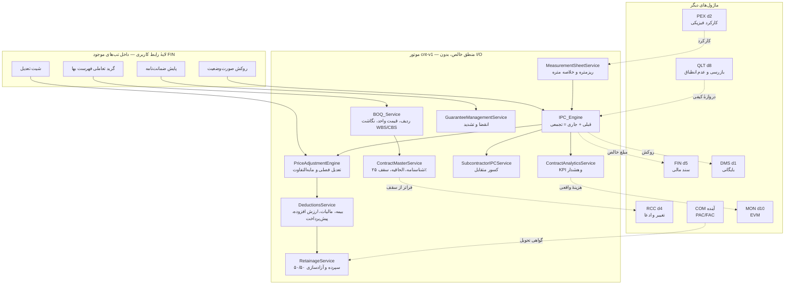

# مدیریت پیمان، صورت‌وضعیت و تعدیل — معماری ماژول (CNT/IPC · MOD-14)

نسخهٔ سند: D1 · موتور هدف: `cnt-v1` · دامنه: `d14`
مبنا: PMBOK 7 (Procurement)، FIDIC Clause 13 و 14، شرایط عمومی پیمان — نشریهٔ ۴۳۱۱ (مواد ۳۴ تا ۴۰)

---

## ۱. تحلیل وضعیت موجود — آنچه هست، نه آنچه فرض می‌شود

پیش از طراحی، کل مخزن بازرسی شد. خلاصهٔ صادقانه: **آنچه امروز هست، حدود
۶٪ نیاز این ماژول را پوشش می‌دهد** و آنچه هست هم بیشتر «جای‌نگه‌دار» است
تا موتور.

### ۱٫۱ آنچه واقعاً وجود دارد

| دارایی | مسیر | ارزیابی بی‌تعارف |
|---|---|---|
| جدول `PaymentCertificate` | `persistence.ts` · ماژول `d5` | ۱۲ ستون: `SerialNo`, `PeriodCode`, `GrossAmount`, `Deductions`, `NetAmount`, `Status`, دو جفت امضا. **یک ردیف هم ندارد** — نه `IPC_LineItem`، نه ریزمتره، نه تعدیل. عملاً «روکش بدون بدنه» است. |
| جدول `CostAccount` | همان · `d5` | `Code`, `Budget`, `Committed`, `Actual`. برای نگاشت CBS به‌کار می‌آید. دفتر سفارش خرید **نیست** (تلهٔ شناخته‌شده). |
| `ChangeRequest` / `Claim` | `d4` | `CostImpact`, `TimeImpactDays`, `ExtensionDays`, `TimeBarred`. برای اتصال کار جدید و ادعای تأخیر پرداخت آماده‌اند. |
| `escalate(amount, indexFrom, indexTo)` | `finance.ts:22` | ضرب ساده در نسبت دو شاخص. **تعدیل آحاد بها نیست** — نه فصل دارد، نه ضریب بالاسری، نه تفکیک مصالح. |
| `progressInvoice(gross, retentionPct, advanceRecoveryPct, legalDeductionsPct)` | `finance.ts:541` | همهٔ کسورات را **درصدی از ناخالص** می‌گیرد. با شرایط عمومی پیمان نمی‌خواند: پیش‌پرداخت درصدی از کارکرد **دوره** مستهلک می‌شود نه از ناخالص تجمعی؛ بیمه بر مبنای نوع کار متفاوت است؛ ارزش افزوده **افزوده** می‌شود نه کسر. |
| `InspectionRecord` | `d8` (QLT) | `Code`, `ItpPointCode`, `ActivityId`, `Outcome`, `InspectedAt`. **دقیقاً همان چیزی که برای دروازهٔ کیفی لازم است.** |
| `Ncr` | `d8` | برای کنترل «عدم انطباق باز» آماده است. |
| `ProgressEntry` | `d2` (PEX) | منبع کارکرد فیزیکی برای مقایسهٔ فیزیکی/مالی. |
| `Period` | `d2` | تقویم دوره‌ای مشترک — صورت‌وضعیت باید روی همین سوار شود، نه تقویم موازی. |

### ۱٫۲ آنچه وجود ندارد (شکاف واقعی)

بازرسی با `grep` روی کل `src/services/`: واژه‌های «تعدیل»، «ضمانت‌نامه»،
«ریزمتره»، «فهرست بها»، «حسن انجام» **صفر بار** در منطق کسب‌وکار ظاهر
می‌شوند (جز دو کامنت در `finance.ts`).

- ❌ شناسنامهٔ پیمان (`ContractMaster`) — پیمان به‌عنوان موجودیت وجود ندارد
- ❌ فهرست بها / جدول مقادیر (`ContractBOQ_Item`) — هیچ ردیف قیمت واحدی نیست
- ❌ ریزمتره (`MeasurementSheet`) — کارکرد فقط عدد کلی است، بدون طول×عرض×ارتفاع
- ❌ ردیف صورت‌وضعیت (`IPC_LineItem`) — قبلی/جاری/تجمعی محاسبه نمی‌شود
- ❌ موتور تعدیل آحاد بها با فصل و شاخص سه‌ماهه
- ❌ مابه‌التفاوت مصالح (آهن، سیمان، قیر، ارز)
- ❌ ضمانت‌نامه و هشدار انقضا
- ❌ سپردهٔ حسن انجام کار و آزادسازی ۵۰/۵۰
- ❌ کنترل سقف ۲۵٪ تغییر مقادیر
- ❌ صورت‌وضعیت پیمانکار جزء و کسور متقابل
- ❌ گردش‌کار سه‌سطحی پیمانکار → مشاور → کارفرما

### ۱٫۳ ⚠️ یک وابستگی معلق که باید همین حالا گفته شود

**D6 آزادسازی سپرده را به گواهی PAC/FAC ماژول COM گره می‌زند، ولی
PAC/FAC در این سامانه هنوز وجود ندارد.** جست‌وجو در کل `src/services/`
هیچ موجودیت تحویل موقت/قطعی نشان نداد — این دقیقاً **مورد ۳ فهرست
هشت‌گانه** («راه‌اندازی و تحویل نهایی») است که هنوز باز است.

تصمیم پیشنهادی (ADR-CNT-09): سپرده با یک **قلاب رویدادی** ساخته می‌شود که
امروز از راه اندپوینت دستی با ثبت مدرک مجوز کار می‌کند و فردا که COM
ساخته شد، بدون تغییر در موتور به آن وصل می‌شود. جایگزین بد این بود که
منتظر COM بمانیم یا PAC/FAC ناقص را داخل CNT بسازیم و بعد دو منبع حقیقت
داشته باشیم.

### ۱٫۴ قیدهای رعایت‌شده

طبق دستور دائمی شما:

- ✅ **بدون آیتم سایدبار جدید.** CNT داخل زیرماژول‌های موجود مونت می‌شود.
- ✅ **نام و ساختار شش زیرماژول FIN تغییر نمی‌کند** (`cost`, `control`, `cash`, `pr`, `po`, `inventory`).
- ✅ `PaymentCertificate` و `CostAccount` **از نو ساخته نمی‌شوند** — گسترش می‌یابند.
- ✅ `src/index.css`، فونت Vazirmatn و `vite.config.ts` دست‌نخورده.
- ✅ اکسل ظرف است نه منبع حقیقت.

---

## ۲. جایگاه ماژول و مرز مالکیت

پرسش تعیین‌کننده: CNT ماژول تازه است یا گسترش FIN؟

**تصمیم: دامنهٔ منطقی تازه `d14`، بدون آیتم سایدبار تازه.** جداول با
`module: "d14"` برچسب می‌خورند تا مالکیت روشن بماند، ولی UI داخل تب‌های
موجود FIN می‌نشیند. دلیل: پیمان و صورت‌وضعیت چرخهٔ عمر، گردش تأیید و
ذی‌نفعان خودش را دارد (مشاور و کارفرما)، ولی کاربر برای دیدنش نباید
منوی تازه یاد بگیرد.

### ۲٫۱ مرز مالکیت داده — چه چیزی مال کیست

| داده | مالک | CNT چه می‌کند |
|---|---|---|
| کارکرد فیزیکی روزانه | PEX (`d2`) | فقط **می‌خواند** تا ریزمتره را پیشنهاد دهد |
| تأییدیهٔ بازرسی و عدم انطباق | QLT (`d8`) | فقط **می‌خواند** به‌عنوان دروازهٔ ثبت |
| سند حسابداری و جریان نقدی | FIN (`d5`) | مبلغ خالص مصوب را **می‌فرستد** |
| درخواست تغییر و ادعا | RCC (`d4`) | پیش‌نویس **می‌سازد**، تصویب آنجاست |
| گواهی PAC/FAC | COM (آینده) | رویداد را **مصرف می‌کند** |
| هزینهٔ واقعی برای EVM | MON (`d10`) | `AC` را **می‌فرستد** |
| **پیمان، فهرست بها، صورت‌وضعیت، تعدیل، ضمانت‌نامه** | **CNT (`d14`)** | **منبع حقیقت** |

قاعدهٔ سخت: CNT به جدول ماژول دیگر **مستقیم نمی‌نویسد**؛ فقط پیش‌نویس
می‌سازد و ماژول مالک تصویب می‌کند. همان الگویی که در ENG جواب داد.

---

## ۳. شش زیرماژول و نگاشت به تب‌های موجود

| کد | زیرماژول | مونت در |
|---|---|---|
| ۱۴٫۱ | شناسنامهٔ پیمان و فهرست بها | تب `cost` (مدیریت هزینه) |
| ۱۴٫۲ | صورت‌وضعیت پیمانکار اصلی | تب `control` (کنترل هزینه) |
| ۱۴٫۳ | صورت‌وضعیت پیمانکاران جزء | تب `control` |
| ۱۴٫۴ | تعدیل و مابه‌التفاوت | تب `control` |
| ۱۴٫۵ | کسورات، ضمانت‌نامه و سپرده | تب `cash` (جریان نقدی) |
| ۱۴٫۶ | پایش مالی پیمان و گزارش‌ها | تب `cash` + مرکز گزارش |

---

## ۴. نمودار مؤلفه‌ها



---

## ۵. فهرست سرویس‌ها

| سرویس | مسئولیت | توابع کلیدی (طرح) |
|---|---|---|
| `ContractMasterService` | شناسنامه، الحاقیه، سقف ۲۵٪ | `contractCeiling`, `applyAmendment`, `ceilingMargin` |
| `BOQ_Service` | ردیف‌های فهرست بها، درخت فصول | `boqRollup`, `mapToWbs`, `mapToCbs`, `validateBoq` |
| `MeasurementSheetService` | ریزمتره و خلاصه متره | `measurementTotal`, `sheetFromDpr`, `validateAgainstBoq` |
| `IPC_Engine` | موتور صورت‌وضعیت | `buildIpc`, `cumulativeQuantities`, `ipcWorkflow`, `qualityGate` |
| `PriceAdjustmentEngine` | تعدیل و مابه‌التفاوت | `adjustmentFactor`, `chapterAdjustment`, `materialDiff`, `advanceAdjustment` |
| `DeductionsService` | کسورات قانونی | `insuranceDeduction`, `withholdingTax`, `vatAddition`, `advanceAmortization` |
| `RetainageService` | سپردهٔ حسن انجام کار | `retainageAccrual`, `releaseOnPac`, `releaseOnFac`, `retainageLedger` |
| `GuaranteeManagementService` | ضمانت‌نامه | `expiryAlerts`, `guaranteeStatus`, `extendGuarantee` |
| `SubcontractorIPCService` | پیمانکار جزء | `backToBackCheck`, `subDeductions`, `subIpcTotals` |
| `ContractAnalyticsService` | KPI و هشدار | `contractKpis`, `contractAlerts`, `physicalVsFinancial` |

---

## ۶. تصمیمات معماری (ADR)

### ADR-CNT-01 — واحد حقیقت کارکرد، ریزمتره است نه درصد

**زمینه.** وسوسه این است که کارکرد را مثل PEX درصدی بگیریم.

**تصمیم.** واحد پایه `MeasurementSheet` است: ردیف‌هایی با شرح موقعیت،
تعداد، طول، عرض، ارتفاع و ضریب. مقدار کارکرد **جمع این ردیف‌ها**ست، و
درصد پیشرفت مالی **نتیجه** است نه ورودی.

**چرا.** در دعوای پیمان، آنچه قابل دفاع است دفترچهٔ متره با ارجاع به نقشه
است، نه عدد «۶۲٪». اگر موتور از درصد شروع کند، در جلسهٔ مشاور چیزی برای
نشان دادن نداریم.

### ADR-CNT-02 — دروازهٔ کیفی، شرط ثبت است نه هشدار

**تصمیم.** ردیفی که `InspectionRecord` با `Outcome = accepted` نداشته
باشد، یا فعالیتش `Ncr` باز داشته باشد، **وارد صورت‌وضعیت نمی‌شود** (خطای
`E-CNT-NO-IR`). قابل دور زدن با مجوز صریح `cnt.ipc.override` که در ممیزی
ثبت می‌شود.

**چرا.** «هشدار» یعنی کسی آن را نادیده می‌گیرد و کارِ ردنشده پول می‌گیرد.
اما دروازهٔ بدون شیر اضطراری هم غلط است: گاهی بازرسی با تأخیر ثبت می‌شود
و کل صورت‌وضعیت نباید بخوابد. پس دروازه بسته، با کلید ثبت‌شونده.

### ADR-CNT-03 — قبلی + جاری = تجمعی، و تجمعی حقیقت است

**تصمیم.** هر ردیف صورت‌وضعیت سه عدد دارد: تجمعی دورهٔ قبل، تجمعی تا
پایان دورهٔ جاری، و **جاری = تفاضل این دو**. عدد جاری هرگز مستقیم ذخیره
نمی‌شود.

**چرا.** اگر جاری مستقل ذخیره شود، اصلاح یک صورت‌وضعیت قدیمی زنجیره را
می‌شکند و جمع تجمعی با واقعیت نمی‌خواند — کلاسیک‌ترین خطای صورت‌وضعیت‌نویسی.

### ADR-CNT-04 — تعدیل روی کارکرد دوره، با شاخص دورهٔ کارکرد

**تصمیم.** تعدیل هر دوره = کارکرد **همان دوره** × ضریب تعدیل همان دوره.
ضریب از شاخص فصل مربوط و شاخص مبنای پیمان مشتق می‌شود. تعدیل تجمعی، جمع
تعدیل دوره‌هاست نه تعدیل جمع.

**چرا.** «تعدیل جمع» عدد غلط می‌دهد چون کارکرد دوره‌های مختلف با شاخص‌های
مختلف انجام شده. این همان درسی است که در گزارش مدیریتی ENG گرفتیم: دو
مسیر محاسبه نباید دو رقم بدهد.

### ADR-CNT-05 — ارزش افزوده کسر نیست، افزوده است

**تصمیم.** `progressInvoice` موجود ارزش افزوده را داخل «کسورات قانونی»
می‌گیرد. در موتور تازه، ارزش افزوده به مبلغ **اضافه** و به‌صورت بدهی
جداگانه ردیابی می‌شود.

**چرا.** ارزش افزوده پول پیمانکار نیست ولی از او کسر هم نمی‌شود؛ کارفرما
آن را می‌پردازد و پیمانکار به سازمان امور مالیاتی می‌دهد. نمایشش به‌عنوان
کسر، مبلغ خالص را غلط و روکش را غیرقابل ارائه می‌کند.

### ADR-CNT-06 — استهلاک پیش‌پرداخت درصدی از کارکرد دوره است

**تصمیم.** استهلاک = درصد قراردادی × کارکرد ناخالص **دوره**، با سقف
«مانده پیش‌پرداخت». تابع موجود که درصدی از ناخالص تجمعی می‌گرفت کنار
گذاشته می‌شود.

**چرا.** با فرمول قدیمی، پیش‌پرداخت در صورت‌وضعیت آخر بیش از دریافتی
مستهلک می‌شد. سقف مانده، شرط بستن حساب است.

### ADR-CNT-07 — سقف ۲۵٪ مانع است، با مسیر قانونی

**تصمیم.** جمع مبلغ ردیف‌های اجراشده که از ۱۲۵٪ مبلغ اولیهٔ پیمان بگذرد،
با `E-CNT-CEILING-25` رد می‌شود؛ مگر `ChangeRequest` مصوب با کد مشخص
پیوست باشد.

**چرا.** مادهٔ ۲۹ شرایط عمومی پیمان. سیستمی که اجازه دهد بی‌سروصدا از سقف
بگذرند، بعداً صورت‌وضعیت غیرقابل پرداخت تولید می‌کند.

### ADR-CNT-08 — کار جدید نرخ ندارد تا تصویب نشود

**تصمیم.** ردیف ستاره‌دار (`ExtraWorkItem`) با وضعیت `rate_pending` ثبت
می‌شود؛ مقدار می‌گیرد ولی در جمع مالی صفر است تا نرخش تصویب شود.

**چرا.** ثبت با نرخ حدسی یعنی روکشی که بعداً باید اصلاح شود. نمایش «مقدار
ثبت شد، نرخ در انتظار» صادقانه‌تر از عدد ساختگی است.

### ADR-CNT-09 — قلاب رویدادی برای PAC/FAC که هنوز نیست

**زمینه.** بند ۱۴٫۵ آزادسازی سپرده را به COM گره می‌زند؛ COM ساخته نشده.

**تصمیم.** `RetainageService` رویداد `deliveryMilestone` با نوع
`PAC`/`FAC` مصرف می‌کند. امروز این رویداد از اندپوینت دستی با شمارهٔ مدرک
مجوز ثبت می‌شود؛ فردا COM همان رویداد را می‌فرستد. موتور تغییر نمی‌کند.

**چرا.** جایگزین‌ها بدتر بودند: انتظار برای COM کل ماژول را معطل می‌کرد،
و ساختن PAC/FAC ناقص داخل CNT دو منبع حقیقت می‌ساخت که بعداً باید یکی
حذف می‌شد.

### ADR-CNT-10 — پیمانکار جزء صورت‌وضعیت مستقل دارد، نه کپی

**تصمیم.** `SubcontractorIPC` جدول جداست با ارجاع نرم به صورت‌وضعیت اصلی.
کنترل «کارکرد تأییدشدهٔ جزء ≤ کارکرد تأییدشدهٔ اصلی برای همان ردیف» هشدار
می‌دهد، نه خطا.

**چرا.** در عمل دوره‌های مالی جزء و اصلی هم‌تراز نیستند. خطای سخت، کاربر
را به ثبت داده‌های ساختگی وادار می‌کند.

---

## ۷. استراتژی یکپارچگی

### ۷٫۱ CNT ↔ QLT — دروازهٔ کیفی (حیاتی)

```
ثبت ردیف صورت‌وضعیت
   └─> آیا InspectionRecord با Outcome=accepted برای ActivityId هست؟
         ├─ خیر ──> رد با E-CNT-NO-IR
         └─ بله ──> آیا Ncr باز روی این فعالیت هست؟
                      ├─ بله ──> رد با E-CNT-OPEN-NCR
                      └─ خیر ──> ثبت مجاز
```

خواندنی محض؛ CNT در QLT چیزی نمی‌نویسد.

### ۷٫۲ CNT ↔ FIN — ارسال مبلغ خالص

صورت‌وضعیت با وضعیت `approved` مبلغ خالص را به `CostAccount.Actual`
می‌فرستد — **فقط با `apply=1`** و به‌صورت ایدمپوتنت با کلید
`(ContractId, SerialNo)`. الگوی `EquipmentCostPosting` که در ماژول
ماشین‌آلات جواب داد، عیناً تکرار می‌شود.

### ۷٫۳ CNT ↔ PEX — تغذیهٔ ریزمتره و مقایسه

دو جهت: `ProgressEntry` ریزمتره را **پیشنهاد** می‌دهد (کاربر تأیید
می‌کند)، و پیشرفت فیزیکی با مالی مقایسه می‌شود.

### ۷٫۴ CNT ↔ RCC / COM / MON / DMS

| مقصد | محرک | خروجی |
|---|---|---|
| RCC | عبور از سقف ۲۵٪ یا کار جدید | پیش‌نویس `ChangeRequest` |
| RCC | تأخیر پرداخت فراتر از مهلت | پیش‌نویس `Claim` |
| COM | گواهی PAC/FAC | آزادسازی ۵۰/۵۰ سپرده |
| MON | صورت‌وضعیت مصوب | `AC` برای EVM |
| DMS | روکش و دفترچهٔ متره | بایگانی با شمارهٔ سند |

---

## ۸. طرح بهبود بصری

سه نمای اصلی، همه با کلاس‌های موجود (`glass`, `glass-row`, `tx1..tx3`) —
بدون افزودن کلاس تازه به `index.css`:

1. **گرید تعاملی فهرست بها** — درختی بر پایهٔ فصل، ستون‌های مقدار پیمانی /
   اجراشده / مانده، نوار مصرف رنگی، هشدار سقف ۲۵٪.
2. **روکش صورت‌وضعیت** — چیدمان رسمی: ناخالص، تعدیل، مابه‌التفاوت، جمع
   کل، کسورات به تفکیک، خالص قابل پرداخت. همان نمایی که چاپ می‌شود.
3. **داشبورد مالی پیمان** — پیشرفت فیزیکی در برابر مالی، مانده سقف،
   ضمانت‌نامه‌های نزدیک انقضا، وضعیت گردش صورت‌وضعیت.

---

## ۹. آنچه در D2 تا D14 می‌آید

| تحویلی | محتوا |
|---|---|
| D2 | ERD کامل ~۱۸ جدول با Mermaid، ایندکس و پارتیشن |
| D3 | شناسنامهٔ پیمان و فهرست بها |
| D4 | موتور صورت‌وضعیت و ریزمتره |
| D5 | موتور تعدیل و مابه‌التفاوت |
| D6 | کسورات، پیش‌پرداخت، سپرده |
| D7 | ضمانت‌نامه‌ها |
| D8 | پیمانکار جزء |
| D9 | انطباق فیزیکی و مالی |
| D10 | ۵ KPI و هشدارهای EWS-CNT |
| D11 | گزارش‌های A4 با سربرگ سه‌لوگو |
| D12 | چهار قالب اکسل |
| D13 | یکپارچگی بین‌ماژولی |
| D14 | RBAC، ۳۵+ اندپوینت، MVP و نقشهٔ راه |

---

## ۱۰. ده لوپ خودارزیابی — اجرای D1

| لوپ | معیار | نتیجه | توضیح |
|---|---|---|---|
| ۱ | PMBOK / FIDIC / نشریهٔ ۴۳۱۱ | ✅ | Control Procurements، Clause ۱۳ و ۱۴، مواد ۲۹ و ۳۴ تا ۴۰ نگاشت شد |
| ۲ | سقف ۲۵٪ و کار جدید | ✅ | ADR-CNT-07 و ۰۸؛ مانع سخت با مسیر قانونی |
| ۳ | ریزمتره و دروازهٔ کیفی | ✅ | ADR-CNT-01 و ۰۲ و ۰۳ |
| ۴ | موتور تعدیل | ✅ | ADR-CNT-04؛ تعدیل دوره‌ای نه تجمعی |
| ۵ | کسورات و آزادسازی سپرده | ⚠️ **مشروط** | ADR-CNT-05 و ۰۶ روشن؛ **آزادسازی وابسته به PAC/FAC است که وجود ندارد** → قلاب رویدادی ADR-CNT-09 |
| ۶ | انقضای ضمانت‌نامه | ✅ | آستانه‌های ۳۰/۱۰/۳ روز در D7 |
| ۷ | انحراف فیزیکی/مالی | ✅ | منبع `ProgressEntry` تأیید شد |
| ۸ | گزارش A4 سه‌لوگو | ✅ | زیرساخت `rpt-v1` موجود و آزموده است |
| ۹ | ورود اکسل | ✅ | `itgLogic` موجود؛ چهار قالب در D12 |
| ۱۰ | یکپارچگی و مهاجرت | ⚠️ **مشروط** | شش اتصال روشن؛ COM معلق. مهاجرت از `0010` شروع می‌شود |

### یافته‌های لوپ که باید تصمیم شما را بگیرد

**۱. PAC/FAC وجود ندارد.** مورد ۳ فهرست هشت‌گانه است. پیشنهاد من قلاب
رویدادی است تا CNT معطل نماند؛ ولی اگر ترجیح می‌دهید اول مورد ۳ را
ببندیم و بعد CNT را کامل کنیم، ترتیب عوض می‌شود.

**۲. `progressInvoice` موجود اشتباه محاسبه می‌کند.** سه ایراد: ارزش
افزوده را کسر می‌گیرد، پیش‌پرداخت را از ناخالص تجمعی مستهلک می‌کند، و
بیمه را ثابت فرض می‌کند. تابع **حذف نمی‌شود** (ممکن است جایی مصرف شود)
ولی منسوخ اعلام می‌شود و موتور تازه جایگزینش می‌گردد.

**۳. `PaymentCertificate` باید گسترش یابد نه بازسازی.** ستون‌های موجود
حفظ و ستون‌های تازه (`ContractId`, `AdjustmentAmount`, `VatAmount`,
`RetainageAmount`, `WorkflowState`) در مهاجرت `0010` افزوده می‌شوند.
مهاجرت اجراشده هرگز ویرایش نمی‌شود.

---

**وضعیت:** D1 تحویل شد. منتظر دستور برای D2 (مدل داده و ERD کامل).
