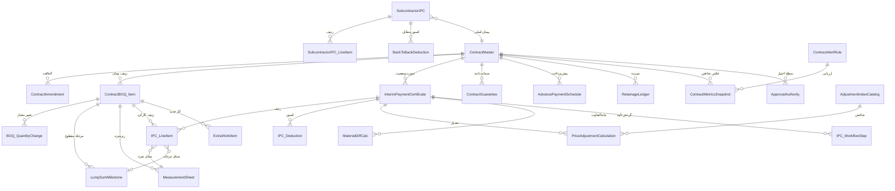

# مدل دادهٔ ماژول پیمان، صورت‌وضعیت و تعدیل — D2

دامنه: `d14` · موتور هدف: `cnt-v1` · مهاجرت: `0010`
پیش‌نیاز: `docs/CNT_Architecture.md` (D1)

---

## ۱. تصمیم بنیادی این تحویلی: دو حالت پیمان در یک مدل

درخواست شما پشتیبانی از **فهرست بهایی (Unit Price / Re-measurable)** و
**مقطوع (Lump Sum)** است. این یک قابلیت اضافه نیست — انشعاب معماری است و
اگر بد حل شود کل موتور صورت‌وضعیت دوتکه می‌شود.

### ۱٫۱ تفاوت واقعی دو حالت

| موضوع | فهرست بهایی | مقطوع |
|---|---|---|
| واحد کارکرد | مقدار × قیمت واحد | درصد تکمیل یا مرحلهٔ محقق‌شده |
| منبع اثبات | دفترچهٔ ریزمتره با ارجاع نقشه | تأیید تحقق مرحله / اندازه‌گیری وزنی |
| تغییر مقدار | عادی است؛ سقف ۲۵٪ کنترل می‌کند | مفهوم ندارد؛ تغییر یعنی الحاقیه |
| مبنای تعدیل | کارکرد ریالی دوره به تفکیک فصل | همان، ولی وزن فصول از تفکیک اولیه می‌آید |
| ریسک اصلی | اختلاف بر سر مقدار | اختلاف بر سر «آیا مرحله محقق شده؟» |

### ۱٫۲ سه راه‌حل و آنچه انتخاب شد

**راه ۱ — دو مجموعه جدول جدا.** ساده در نگاه اول، فاجعه در عمل: تعدیل،
کسورات، سپرده، ضمانت‌نامه و گزارش‌ها باید دو بار نوشته شوند و از هم واگرا
می‌شوند. **رد شد.**

**راه ۲ — یک جدول با ستون‌های اختیاری و شرط‌های نرم.** جدول پر از ستون
`nullable` می‌شود و هیچ‌کس نمی‌داند کدام ترکیب معتبر است. **رد شد.**

**راه ۳ — پایهٔ مشترک با «سنجهٔ ارزش‌گذاری» چندریختی.** ✅ **انتخاب شد.**

هر ردیف پیمان یک `PricingBasis` دارد: `unit_price` یا `lump_sum`. موتور
صورت‌وضعیت با یک تابع `lineEarnedValue(item, measure)` کار می‌کند که بر
پایهٔ همین میدان شاخه می‌گیرد. **همه‌چیز پایین‌دست — تعدیل، کسورات، سپرده،
گزارش — یک مسیر دارد** چون همه با «ارزش کسب‌شدهٔ ریالی» کار می‌کنند نه با
مقدار خام.

> **ADR-CNT-11 — ارزش ریالی، زبان مشترک دو حالت است.**
> هر آنچه بالادست است (مقدار متره یا درصد مرحله) در مرز `IPC_LineItem` به
> «ارزش کسب‌شدهٔ ریالی» تبدیل می‌شود. هیچ سرویس پایین‌دستی نمی‌داند پیمان
> فهرست‌بهایی است یا مقطوع.
> **چرا:** در D1 دیدیم دو مسیر محاسبه دو رقم می‌دهد (ماجرای ۴۹ در برابر
> ۵۱ روز). اینجا هم اگر تعدیل بداند حالت چیست، دو فرمول تعدیل خواهیم داشت
> و اختلافشان در جلسهٔ کارفرما بیرون می‌زند.

### ۱٫۳ حالت سوم که در عمل بیشتر از هر دو دیده می‌شود

پیمان‌های EPC واقعی معمولاً **ترکیبی**اند: مهندسی مقطوع، تدارکات
بازپرداختی، ساخت فهرست‌بهایی. مدل این را پشتیبانی می‌کند چون
`PricingBasis` روی **ردیف** است نه روی پیمان. `ContractMaster.ContractType`
فقط حالت پیش‌فرض ردیف‌های تازه را تعیین می‌کند.

---

## ۲. ERD کامل

---

## ۳. جداول — ۱۸ جدول تازه

قرارداد رعایت‌شده در همهٔ جداول:
`id()` · `ProjectId` اجباری · هر ستون `Status` با `nullable:false` و
`comment` حاوی مقادیر مجاز جداشده با `|` · کلید طبیعی یکتا ·
بدون FK سخت بین‌ماژولی (کلید نرم، مثل `PoNo` در ENG).

### گروه ۱ — شناسنامهٔ پیمان

#### `ContractMaster`

| ستون | نوع | الزام | توضیح |
|---|---|---|---|
| `Id` | text(60) | ✔ | |
| `ProjectId` | text(60) | ✔ | |
| `Code` | text(40) | ✔ | شمارهٔ پیمان — کلید طبیعی |
| `TitleFa` | text(400) | ✔ | |
| `ContractType` | text(30) | ✔ | `unit_price\|lump_sum\|mixed\|cost_plus` — **حالت پیش‌فرض ردیف‌ها** |
| `Party` | text(30) | ✔ | `main\|subcontract` |
| `EmployerName` | text(200) | ✔ | کارفرما |
| `ConsultantName` | text(200) | — | مشاور |
| `ContractorName` | text(200) | ✔ | پیمانکار |
| `SignDate` | date | ✔ | |
| `StartDate` | date | ✔ | |
| `DurationDays` | int | ✔ | |
| `InitialAmount` | decimal(18,2) | ✔ | مبلغ اولیه — مبنای سقف ۲۵٪ |
| `CurrentAmount` | decimal(18,2) | ✔ | پس از الحاقیه‌ها |
| `Currency` | text(10) | ✔ | پیش‌فرض `IRR` |
| `CeilingPct` | decimal(9,4) | ✔ | پیش‌فرض ۲۵ |
| `AdvancePct` | decimal(9,4) | — | درصد پیش‌پرداخت |
| `AdvanceRecoveryPct` | decimal(9,4) | — | درصد استهلاک از کارکرد **دوره** (ADR-CNT-06) |
| `RetainagePct` | decimal(9,4) | ✔ | پیش‌فرض ۱۰ |
| `InsuranceRatePct` | decimal(9,4) | — | ۵ یا ۱٫۶ بسته به نوع کار |
| `WithholdingTaxPct` | decimal(9,4) | — | مالیات تکلیفی |
| `VatPct` | decimal(9,4) | — | **افزوده می‌شود نه کسر** (ADR-CNT-05) |
| `AdjustmentEnabled` | bool | ✔ | آیا پیمان تعدیل‌پذیر است |
| `BaseIndexPeriod` | text(20) | — | دورهٔ شاخص مبنا مثل `1404-Q1` |
| `ReviewDaysConsultant` | int | — | مهلت بررسی مشاور |
| `ReviewDaysEmployer` | int | — | مهلت تصویب کارفرما |
| `Status` | text(30) | ✔ | `draft\|active\|suspended\|completed\|terminated` |

ایندکس: `UX_ContractMaster(ProjectId, Code)` یکتا ·
`IX_ContractMaster_Status(ProjectId, Status)`

> **چرا `InitialAmount` و `CurrentAmount` هر دو؟** سقف ۲۵٪ همیشه بر
> مبنای مبلغ **اولیه** سنجیده می‌شود (مادهٔ ۲۹)، ولی مانده و درصد پیشرفت
> بر مبنای جاری. یک ستون برای هر دو، خطای رایج است.

#### `ContractAmendment`

`Id` · `ProjectId` · `ContractId` ✔ · `Code` ✔ · `TitleFa` ✔ ·
`AmendmentType` ✔ (`amount\|duration\|scope\|rate`) · `EffectiveDate` ✔ ·
`AmountDelta` decimal(18,2) · `DurationDeltaDays` int ·
`LinkedCrCode` text(40) — کلید نرم به RCC ·
`Status` ✔ (`draft\|approved\|rejected\|cancelled`)

ایندکس: `UX_ContractAmendment(ProjectId, Code)` یکتا

#### `ApprovalAuthority`

`Id` · `ProjectId` · `ContractId` ✔ · `Level` ✔ int (۱=مشاور، ۲=کارفرما) ·
`RoleCode` ✔ text(40) · `MaxAmount` decimal(18,2) — سقف اختیار ·
`Status` ✔ (`active\|revoked`)

---

### گروه ۲ — فهرست بها و ردیف‌های پیمان

#### `ContractBOQ_Item` ⭐ جدول محوری دوحالته

| ستون | نوع | الزام | توضیح |
|---|---|---|---|
| `Id` | text(60) | ✔ | |
| `ProjectId` | text(60) | ✔ | |
| `ContractId` | text(60) | ✔ | |
| `ItemNo` | text(40) | ✔ | شمارهٔ ردیف — کلید طبیعی با ContractId |
| `ParentItemNo` | text(40) | — | ساختار درختی فصول |
| `ChapterCode` | text(20) | — | کد فصل — **مبنای ضریب تعدیل** |
| `TitleFa` | text(600) | ✔ | شرح ردیف |
| **`PricingBasis`** | text(20) | ✔ | **`unit_price\|lump_sum`** — انشعاب اصلی |
| `Unit` | text(20) | — | برای `unit_price` الزامی است |
| `ContractQty` | decimal(18,3) | — | مقدار پیمانی — برای `unit_price` |
| `UnitRate` | decimal(18,2) | — | قیمت واحد — برای `unit_price` |
| `LumpSumAmount` | decimal(18,2) | — | مبلغ مقطوع — برای `lump_sum` |
| `LineAmount` | decimal(18,2) | ✔ | مبلغ ردیف؛ **همیشه پر** — زبان مشترک |
| `WbsId` | text(60) | — | نگاشت به PEX |
| `CostAccountCode` | text(40) | — | نگاشت به CBS (FIN) |
| `IsStarred` | bool | ✔ | ردیف ستاره‌دار / کار جدید |
| `RateStatus` | text(20) | ✔ | `agreed\|rate_pending\|disputed` (ADR-CNT-08) |
| `Status` | text(30) | ✔ | `active\|superseded\|cancelled` |

ایندکس: `UX_ContractBOQ_Item(ContractId, ItemNo)` یکتا ·
`IX_BOQ_Chapter(ContractId, ChapterCode)` · `IX_BOQ_Wbs(ProjectId, WbsId)`

> **قاعدهٔ اعتبارسنجی دوحالته** (در موتور، نه در پایگاه داده):
> - `unit_price` → `Unit`، `ContractQty`، `UnitRate` الزامی؛
>   `LineAmount = ContractQty × UnitRate`
> - `lump_sum` → `LumpSumAmount` الزامی؛ `LineAmount = LumpSumAmount`؛
>   `ContractQty` و `UnitRate` باید تهی باشند
>
> چرا در موتور نه در اسکیما؟ چون `CHECK` شرطی در نسخهٔ SQL Server هدف
> پرهزینه و در درایور JSON نامفهوم است؛ و پیام خطای فارسی با شمارهٔ ردیف
> در موتور قابل تولید است.

#### `LumpSumMilestone` ⭐ ویژهٔ حالت مقطوع

ردیف مقطوع بدون مرحله، صورت‌وضعیت‌پذیر نیست — وگرنه «چند درصد محقق شده؟»
به سلیقه بستگی می‌گیرد.

`Id` · `ProjectId` · `ContractId` ✔ · `BoqItemId` ✔ · `MilestoneNo` ✔ int ·
`TitleFa` ✔ · `WeightPct` ✔ decimal(9,4) — وزن مرحله از ردیف ·
`PlannedDate` date · `AcceptanceCriteriaFa` text(1000) — **معیار تحقق** ·
`AchievedDate` date · `AchievedPct` decimal(9,4) ·
`EvidenceDocNo` text(80) — مدرک اثبات · `VerifiedBy` text(60) ·
`Status` ✔ (`pending\|claimed\|verified\|rejected`)

ایندکس: `UX_LumpSumMilestone(BoqItemId, MilestoneNo)` یکتا

> **قاعده:** جمع `WeightPct` مراحل هر ردیف باید ۱۰۰ شود. انحراف، هشدار
> اعتبارسنجی است نه خطای ثبت — همان الگوی جمع وزن مدارک در ENG که جواب داد.

#### `BOQ_QuantityChange`

`Id` · `ProjectId` · `ContractId` ✔ · `BoqItemId` ✔ · `ChangeNo` ✔ int ·
`PreviousQty` decimal(18,3) · `NewQty` decimal(18,3) ·
`DeltaAmount` decimal(18,2) · `ReasonFa` text(1000) ·
`LinkedCrCode` text(40) · `RequestedAt` ✔ date ·
`Status` ✔ (`draft\|approved\|rejected`)

#### `ExtraWorkItem`

`Id` · `ProjectId` · `ContractId` ✔ · `Code` ✔ · `TitleFa` ✔ ·
`Unit` text(20) · `Quantity` decimal(18,3) ·
`ProposedRate` decimal(18,2) · `AgreedRate` decimal(18,2) ·
`AnalysisMethod` text(30) (`similar_item\|rate_analysis\|daywork`) ·
`LinkedCrCode` text(40) · `BoqItemId` text(60) — پس از تصویب ·
`Status` ✔ (`proposed\|rate_pending\|agreed\|rejected`)

---

### گروه ۳ — ریزمتره و صورت‌وضعیت

#### `MeasurementSheet`

واحد اثبات در حالت فهرست‌بهایی (ADR-CNT-01).

`Id` · `ProjectId` · `ContractId` ✔ · `IpcId` text(60) ·
`BoqItemId` ✔ · `SheetNo` ✔ int · `LocationFa` text(400) — موقعیت ·
`DrawingNo` text(80) — **ارجاع نقشه** · `Count` decimal(18,3) ·
`Length` decimal(18,3) · `Width` decimal(18,3) · `Height` decimal(18,3) ·
`Factor` decimal(18,4) — ضریب · `Quantity` ✔ decimal(18,3) — حاصل ·
`SourceDprId` text(60) — کلید نرم به PEX ·
`InspectionRecordCode` text(40) — **دروازهٔ کیفی** ·
`Status` ✔ (`draft\|claimed\|verified\|rejected`)

ایندکس: `UX_MeasurementSheet(IpcId, BoqItemId, SheetNo)` یکتا ·
`IX_MeasurementSheet_Boq(ContractId, BoqItemId)`

> `Quantity` ذخیره می‌شود ولی موتور آن را از
> `Count × Length × Width × Height × Factor` بازمحاسبه و مغایرت را گزارش
> می‌کند. ذخیره برای سرعت گزارش، بازمحاسبه برای صحت.

#### `InterimPaymentCertificate`

⚠️ **جدول موجود `PaymentCertificate` حذف نمی‌شود.** این جدول تازه، بدنهٔ
کامل است؛ مسیر مهاجرت در بخش ۶.

| ستون | نوع | الزام | توضیح |
|---|---|---|---|
| `Id` · `ProjectId` | | ✔ | |
| `ContractId` | text(60) | ✔ | |
| `SerialNo` | int | ✔ | شمارهٔ صورت‌وضعیت |
| `IpcType` | text(20) | ✔ | `interim\|final\|advance\|adjustment_only` |
| `PeriodCode` | text(20) | ✔ | هم‌تراز با `Period` ماژول d2 |
| `PeriodFrom` / `PeriodTo` | date | ✔ | |
| `GrossCurrent` | decimal(18,2) | ✔ | کارکرد ناخالص **دوره** |
| `GrossCumulative` | decimal(18,2) | ✔ | کارکرد ناخالص تجمعی |
| `AdjustmentAmount` | decimal(18,2) | — | تعدیل دوره |
| `MaterialDiffAmount` | decimal(18,2) | — | مابه‌التفاوت مصالح |
| `SubtotalAmount` | decimal(18,2) | ✔ | ناخالص + تعدیل + مابه‌التفاوت |
| `TotalDeductions` | decimal(18,2) | ✔ | جمع کسورات |
| `VatAmount` | decimal(18,2) | — | **افزوده** |
| `NetPayable` | decimal(18,2) | ✔ | خالص قابل پرداخت |
| `WorkflowState` | text(30) | ✔ | `draft\|contractor_submitted\|consultant_review\|consultant_approved\|employer_review\|approved\|rejected\|paid` |
| `SubmittedAt` / `ConsultantApprovedAt` / `EmployerApprovedAt` / `PaidAt` | date | — | |
| `PostedToFin` | bool | ✔ | ایدمپوتنسی ارسال به FIN |
| `Status` | text(30) | ✔ | `open\|closed\|cancelled` |

ایندکس: `UX_IPC(ContractId, SerialNo)` یکتا ·
`IX_IPC_Period(ProjectId, PeriodCode)` · `IX_IPC_Workflow(ProjectId, WorkflowState)`

#### `IPC_LineItem` ⭐ نقطهٔ همگرایی دو حالت

| ستون | نوع | توضیح |
|---|---|---|
| `Id` · `ProjectId` | | |
| `IpcId` ✔ · `BoqItemId` ✔ | text(60) | |
| `PricingBasis` ✔ | text(20) | تکرار از ردیف پیمان — تحلیل بدون join |
| `PrevQty` | decimal(18,3) | مقدار تجمعی دورهٔ قبل |
| `CumQty` | decimal(18,3) | مقدار تجمعی تا این دوره |
| `CurrentQty` | decimal(18,3) | **مشتق:** `CumQty − PrevQty` (ADR-CNT-03) |
| `PrevPct` / `CumPct` | decimal(9,4) | معادل درصدی برای حالت مقطوع |
| `MilestoneId` | text(60) | مرجع مرحله در حالت مقطوع |
| `UnitRate` | decimal(18,2) | نرخ اعمال‌شده — تاریخی |
| **`EarnedCurrent`** ✔ | decimal(18,2) | **ارزش ریالی دوره — زبان مشترک** |
| **`EarnedCumulative`** ✔ | decimal(18,2) | ارزش ریالی تجمعی |
| `ClaimedQty` / `VerifiedQty` / `ApprovedQty` | decimal(18,3) | ادعایی / تأییدشده / مصوب |
| `QualityGateStatus` ✔ | text(20) | `passed\|no_ir\|open_ncr\|overridden` |
| `OverrideBy` / `OverrideReasonFa` | text | ثبت استفاده از شیر اضطراری |
| `Status` ✔ | text(30) | `draft\|claimed\|verified\|approved\|rejected` |

ایندکس: `UX_IPC_LineItem(IpcId, BoqItemId)` یکتا ·
`IX_IPC_LineItem_Boq(ProjectId, BoqItemId)`

> **این جدول قلب تصمیم دوحالته است.** `EarnedCurrent` برای
> `unit_price` از `CurrentQty × UnitRate` و برای `lump_sum` از
> `(CumPct − PrevPct)/100 × LumpSumAmount` می‌آید. از این نقطه به بعد
> هیچ سرویسی به `PricingBasis` نگاه نمی‌کند.

#### `IPC_WorkflowStep`

`Id` · `ProjectId` · `IpcId` ✔ · `StepNo` ✔ int ·
`Actor` ✔ (`contractor\|consultant\|employer`) · `ActorUserId` text(60) ·
`Action` ✔ (`submit\|approve\|reject\|return_for_correction`) ·
`ActedAt` ✔ datetime · `DueAt` date — مهلت قراردادی ·
`OverdueDays` int — **ورودی ادعای تأخیر پرداخت** · `CommentFa` text(1000)

#### `IPC_Deduction`

`Id` · `ProjectId` · `IpcId` ✔ · `DeductionType` ✔
(`insurance\|withholding_tax\|retainage\|advance_recovery\|penalty\|other\|back_to_back`) ·
`BaseAmount` decimal(18,2) — مبنای محاسبه · `RatePct` decimal(9,4) ·
`Amount` ✔ decimal(18,2) · `IsStatutory` ✔ bool · `NoteFa` text(600)

> کسورات ردیف‌به‌ردیف ذخیره می‌شوند نه به‌صورت یک عدد. روکش رسمی باید
> بگوید هر رقم از کجا آمده، وگرنه در جلسه قابل دفاع نیست.

---

### گروه ۴ — تعدیل و مابه‌التفاوت

#### `AdjustmentIndexCatalog`

`Id` · `ProjectId` — `*` برای شاخص ملی · `IndexPeriod` ✔ text(20) (`1404-Q1`) ·
`ChapterCode` ✔ text(20) · `IndexValue` ✔ decimal(18,4) ·
`SourceFa` text(200) — «سازمان برنامه و بودجه» ·
`PublishedAt` date · `Status` ✔ (`draft\|published\|superseded`)

ایندکس: `UX_AdjustmentIndex(ProjectId, IndexPeriod, ChapterCode)` یکتا

#### `PriceAdjustmentCalculation`

`Id` · `ProjectId` · `ContractId` ✔ · `IpcId` ✔ · `ChapterCode` ✔ ·
`WorkAmount` ✔ decimal(18,2) — کارکرد **دوره** همان فصل ·
`BaseIndex` ✔ decimal(18,4) · `PeriodIndex` ✔ decimal(18,4) ·
`AdjustmentFactor` ✔ decimal(18,6) · `AdjustmentAmount` ✔ decimal(18,2) ·
`AppliedRatePct` decimal(9,4) — ضریب قراردادی (مثلاً ۰٫۹۵) ·
`CalcNoteFa` text(600) · `Status` ✔ (`draft\|approved\|rejected`)

ایندکس: `UX_PriceAdjustment(IpcId, ChapterCode)` یکتا

> در حالت مقطوع، `ChapterCode` از تفکیک اولیهٔ مبلغ مقطوع بین فصول
> می‌آید (`LumpSumChapterSplit` در D5). بدون آن تعدیل مقطوع بی‌معناست.

#### `MaterialDiffCalc`

`Id` · `ProjectId` · `ContractId` ✔ · `IpcId` ✔ ·
`MaterialCode` ✔ (`rebar\|cement\|bitumen\|fx\|other`) · `MaterialNameFa` ✔ ·
`Quantity` decimal(18,3) · `Unit` text(20) ·
`BaseRate` decimal(18,2) · `PeriodRate` decimal(18,2) ·
`DiffAmount` ✔ decimal(18,2) · `EvidenceDocNo` text(80) ·
`Status` ✔ (`draft\|approved\|rejected`)

---

### گروه ۵ — کسورات، ضمانت‌نامه، سپرده

#### `ContractGuarantee`

`Id` · `ProjectId` · `ContractId` ✔ · `Code` ✔ ·
`GuaranteeType` ✔ (`advance\|performance\|bid\|retention\|warranty`) ·
`BankName` ✔ · `GuaranteeNo` ✔ text(60) · `Amount` ✔ decimal(18,2) ·
`Currency` text(10) · `IssueDate` ✔ date · `ExpiryDate` ✔ date ·
`ExtendedToDate` date · `ReleaseDate` date ·
`Status` ✔ (`active\|extended\|released\|forfeited\|expired`) ·
`AlertLevel` text(20) (`none\|d30\|d10\|d3\|overdue`)

ایندکس: `UX_ContractGuarantee(ProjectId, Code)` یکتا ·
`IX_Guarantee_Expiry(ProjectId, ExpiryDate, Status)` — **پیمایش هشدار**

#### `AdvancePaymentSchedule`

`Id` · `ProjectId` · `ContractId` ✔ · `InstallmentNo` ✔ int ·
`PaidAmount` decimal(18,2) · `PaidAt` date ·
`RecoveryPct` decimal(9,4) · `RecoveredToDate` decimal(18,2) ·
`OutstandingAmount` ✔ decimal(18,2) — **سقف استهلاک** ·
`Status` ✔ (`pending\|paid\|recovering\|settled`)

#### `RetainageLedger`

`Id` · `ProjectId` · `ContractId` ✔ · `IpcId` text(60) ·
`EntryType` ✔ (`accrual\|release_pac\|release_fac\|forfeit\|adjustment`) ·
`Amount` ✔ decimal(18,2) · `BalanceAfter` ✔ decimal(18,2) ·
`TriggerEvent` text(60) — `PAC`/`FAC` (ADR-CNT-09) ·
`TriggerDocNo` text(80) · `EntryDate` ✔ date ·
`Status` ✔ (`posted\|reversed`)

> دفتر رویدادمحور است نه مانده‌ای. مانده همیشه از جمع رویدادها بازسازی
> می‌شود؛ `BalanceAfter` فقط برای گزارش است. اگر مانده تنها ستون بود،
> اصلاح یک رویداد قدیمی کل زنجیره را غلط می‌کرد.

---

### گروه ۶ — پیمانکار جزء

#### `SubcontractorIPC`

`Id` · `ProjectId` · `ContractId` ✔ — پیمان جزء ·
`MainContractId` text(60) — کلید نرم · `MainIpcId` text(60) ·
`SerialNo` ✔ int · `PeriodCode` ✔ · `GrossCurrent` ✔ decimal(18,2) ·
`TotalDeductions` decimal(18,2) · `NetPayable` ✔ decimal(18,2) ·
`WorkflowState` ✔ (`draft\|submitted\|reviewed\|approved\|rejected\|paid`) ·
`Status` ✔ (`open\|closed\|cancelled`)

ایندکس: `UX_SubcontractorIPC(ContractId, SerialNo)` یکتا

#### `SubcontractorIPC_LineItem`

`Id` · `ProjectId` · `SubIpcId` ✔ · `BoqItemId` text(60) ·
`DescriptionFa` ✔ · `Unit` text(20) · `Quantity` decimal(18,3) ·
`UnitRate` decimal(18,2) · `Amount` ✔ decimal(18,2) ·
`MainApprovedQty` decimal(18,3) — برای کنترل متقابل ·
`VarianceFlag` text(20) (`ok\|exceeds_main\|no_main_ref`) ·
`Status` ✔ (`draft\|approved\|rejected`)

#### `BackToBackDeduction`

`Id` · `ProjectId` · `SubIpcId` ✔ ·
`SourceModule` ✔ (`fin_material\|hse_incident\|qlt_rework\|other`) ·
`SourceRefCode` text(60) · `DescriptionFa` ✔ · `Amount` ✔ decimal(18,2) ·
`EvidenceDocNo` text(80) · `Status` ✔ (`draft\|approved\|disputed\|waived`)

---

### گروه ۷ — پایش

#### `ContractMetricsSnapshot`

`Id` · `ProjectId` · `ContractId` ✔ · `PeriodCode` ✔ ·
`PhysicalPct` decimal(9,4) · `FinancialPct` decimal(9,4) ·
`VariancePct` decimal(9,4) · `CeilingUsedPct` decimal(9,4) ·
`AdvanceRecoveredPct` decimal(9,4) · `ExtraWorkRatioPct` decimal(9,4) ·
`AvgIpcCycleDays` decimal(9,2) · `OpenGuaranteeCount` int ·
`RetainageBalance` decimal(18,2) · `SnapshotAt` ✔ datetime

ایندکس: `UX_ContractMetrics(ContractId, PeriodCode)` یکتا

#### `ContractAlertRule`

`Id` · `ProjectId` · `RuleCode` ✔ text(30) · `TitleFa` ✔ ·
`Severity` ✔ (`info\|medium\|high\|critical`) ·
`ThresholdValue` decimal(18,4) · `IsEnabled` ✔ bool ·
`Status` ✔ (`active\|disabled`)

---

## ۴. جمع‌بندی جداول

| گروه | جداول | تعداد |
|---|---|---|
| شناسنامه | `ContractMaster`, `ContractAmendment`, `ApprovalAuthority` | ۳ |
| فهرست بها | `ContractBOQ_Item`, `LumpSumMilestone`, `BOQ_QuantityChange`, `ExtraWorkItem` | ۴ |
| صورت‌وضعیت | `MeasurementSheet`, `InterimPaymentCertificate`, `IPC_LineItem`, `IPC_WorkflowStep`, `IPC_Deduction` | ۵ |
| تعدیل | `AdjustmentIndexCatalog`, `PriceAdjustmentCalculation`, `MaterialDiffCalc` | ۳ |
| کسورات | `ContractGuarantee`, `AdvancePaymentSchedule`, `RetainageLedger` | ۳ |
| پیمانکار جزء | `SubcontractorIPC`, `SubcontractorIPC_LineItem`, `BackToBackDeduction` | ۳ |
| پایش | `ContractMetricsSnapshot`, `ContractAlertRule` | ۲ |
| **جمع** | | **۲۳** |

پس از افزودن: **۵۲ + ۲۳ = ۷۵ جدول**؛ مهاجرت `0010`.

> ⚠️ سه آزمون رگرسیون شمارندهٔ هاردکد دارند و باید عددشان به‌روز شود، نه
> حذف: «d12 دقیقاً … جدول دارد»، «اسکیما … جدول دارد»، «مهاجرت … آخرین است».

---

## ۵. ایندکس و پارتیشن

**ایندکس‌های پرترافیک:**

| ایندکس | چرا |
|---|---|
| `IX_IPC_Workflow(ProjectId, WorkflowState)` | داشبورد «در انتظار بررسی» |
| `IX_Guarantee_Expiry(ProjectId, ExpiryDate, Status)` | پیمایش روزانهٔ هشدار |
| `IX_IPC_LineItem_Boq(ProjectId, BoqItemId)` | محاسبهٔ تجمعی و کنترل سقف |
| `IX_MeasurementSheet_Boq(ContractId, BoqItemId)` | جمع ریزمتره |
| `IX_BOQ_Chapter(ContractId, ChapterCode)` | گروه‌بندی تعدیل |

**پارتیشن:** فقط `MeasurementSheet` و `IPC_LineItem` رشد میلیونی دارند →
پارتیشن بر `ProjectId`. بقیه در مقیاس این سامانه نیازی ندارند؛ پارتیشن
زودهنگام پیچیدگی بی‌فایده است.

---

## ۶. مسیر مهاجرت `PaymentCertificate`

جدول موجود ۱۲ ستون دارد و ممکن است داده داشته باشد. **حذف نمی‌شود.**

1. مهاجرت `0010` جداول تازه را می‌سازد؛ `PaymentCertificate` دست‌نخورده.
2. اسکریپت انتقال هر ردیف را به `InterimPaymentCertificate` می‌نگارد:
   `SerialNo`→`SerialNo` · `GrossAmount`→`GrossCurrent` و
   `GrossCumulative` · `Deductions`→`TotalDeductions` ·
   `NetAmount`→`NetPayable` · `Status`→`WorkflowState` با نگاشت واژگان ·
   `ContractId` از پیمان پیش‌فرض پروژه.
3. ردیف‌های منتقل‌شده `LegacyRef` می‌گیرند.
4. `PaymentCertificate` **فقط‌خواندنی** اعلام می‌شود، نه حذف.

> چرا حذف نمی‌شود؟ `PUBLIC_TABLES` آن را از راه REST عمومی سرو می‌کند و
> ممکن است مصرف‌کنندهٔ ناشناخته داشته باشد. حذف جدول در همان مهاجرتی که
> جایگزین می‌سازد، راه بازگشت را می‌بندد.

---

## ۷. ده لوپ خودارزیابی — اجرای D2

| لوپ | معیار | نتیجه | شواهد |
|---|---|---|---|
| ۱ | PMBOK / FIDIC / نشریهٔ ۴۳۱۱ | ✅ | مادهٔ ۲۹ (`CeilingPct`)، مواد ۳۷ و ۳۸ (`AdvancePaymentSchedule`, `RetainageLedger`)، Clause ۱۳ (`PriceAdjustmentCalculation`)، Clause ۱۴ (`IPC_WorkflowStep`) |
| ۲ | سقف ۲۵٪ و کار جدید | ✅ | `InitialAmount` جدا از `CurrentAmount`؛ `ExtraWorkItem.Status=rate_pending`؛ `BOQ_QuantityChange.LinkedCrCode` |
| ۳ | ریزمتره و دروازهٔ کیفی | ✅ | `MeasurementSheet` با `DrawingNo` و `InspectionRecordCode`؛ `IPC_LineItem.QualityGateStatus` با ثبت override |
| ۴ | موتور تعدیل | ✅ | `WorkAmount` صراحتاً کارکرد **دوره** است؛ کلید یکتا روی `(IpcId, ChapterCode)` مانع تعدیل مضاعف |
| ۵ | کسورات و آزادسازی سپرده | ⚠️ **مشروط** | `RetainageLedger.TriggerEvent` آماده است ولی **PAC/FAC هنوز وجود ندارد** (مورد ۳ فهرست) |
| ۶ | انقضای ضمانت‌نامه | ✅ | `AlertLevel` با چهار پله و ایندکس اختصاصی پیمایش |
| ۷ | انحراف فیزیکی/مالی | ✅ | `ContractMetricsSnapshot` هر دو درصد را نگه می‌دارد؛ `WbsId` پل PEX |
| ۸ | گزارش A4 سه‌لوگو | ✅ | `IPC_Deduction` ردیف‌به‌ردیف است تا روکش قابل دفاع باشد |
| ۹ | ورود اکسل | ✅ | چهار جدول هدف کلید طبیعی یکتا دارند → درون‌ریزی ایدمپوتنت |
| ۱۰ | یکپارچگی و مهاجرت | ✅ | کلیدهای نرم `LinkedCrCode`, `SourceDprId`, `InspectionRecordCode`, `CostAccountCode`; مسیر مهاجرت بدون حذف |

### لوپ ویژه — پوشش دوحالته

| سنجه | فهرست بهایی | مقطوع | ترکیبی |
|---|---|---|---|
| تعریف ردیف | `ContractQty × UnitRate` | `LumpSumAmount` + مراحل | هر ردیف مستقل |
| اثبات کارکرد | `MeasurementSheet` | `LumpSumMilestone` | هر دو |
| محاسبهٔ دوره | `CurrentQty × UnitRate` | `ΔPct × LumpSumAmount` | یکسان در `EarnedCurrent` |
| تعدیل | فصل ردیف | تفکیک فصلی مبلغ مقطوع | یکسان |
| کسورات و سپرده | یکسان | یکسان | یکسان |
| سقف ۲۵٪ | معنادار | فقط با الحاقیه | ترکیبی |

**نتیجه:** از مرز `IPC_LineItem.EarnedCurrent` به بعد هیچ سرویسی حالت را
نمی‌شناسد. انشعاب فقط در دو نقطه است: تعریف ردیف و اثبات کارکرد.

### دو نکتهٔ صادقانه

**۱. `LumpSumMilestone` یک جدول فراتر از فهرست اولیهٔ D1 است.** پرامپت
شما ۱۸ جدول می‌خواست؛ من ۲۳ نوشتم. علتش پشتیبانی مقطوع است: بدون مرحله،
درصد تحقق به سلیقه بستگی می‌گیرد و همان دعوایی می‌شود که این ماژول قرار
است حل کند.

**۲. لوپ ۵ باز هم مشروط ماند.** تا PAC/FAC ساخته نشود، آزادسازی سپرده
دستی می‌ماند. علامت سبز نمی‌زنم.

---

**وضعیت:** D2 تحویل شد. منتظر دستور برای D3 (شناسنامهٔ پیمان و فهرست بها).
