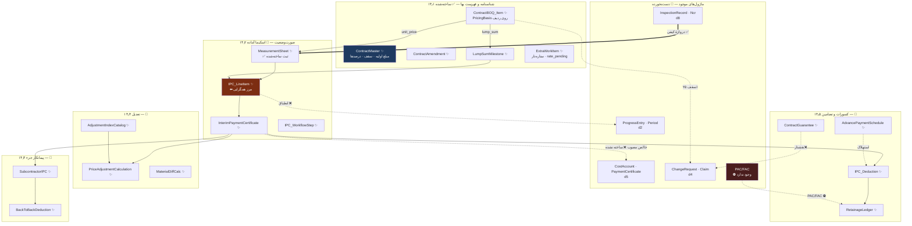
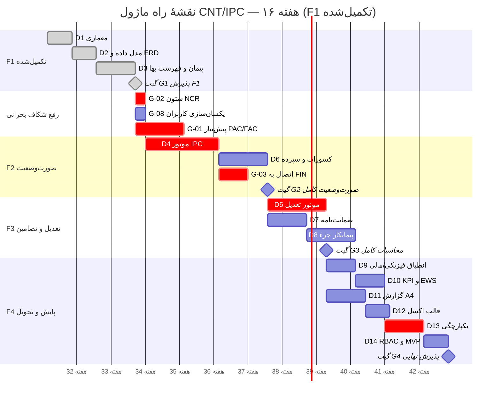

# گزارش کیفی و خلاصهٔ اجرایی — ماژول پیمان، صورت‌وضعیت و تعدیل

> **CNT/IPC · MOD-14** · دامنهٔ `d14` · موتور `cnt-v1`
> نسخهٔ ۱٫۰ — گزارش وضعیت پایه و بستهٔ تحویل
> تاریخ: ۱۸ شهریور ۱۴۰۵ · مخزن: `padircom/-` · کامیت پایه: `66a4ad2`

---

## ⚠️ بیانیهٔ دامنه — پیش از هر چیز بخوانید

درخواست تولید این گزارش با این فرض آغاز شد که «تمام ۱۴ تحویلی ماژول تحویل شد».
**این فرض با وضعیت واقعی مخزن نمی‌خواند** و گزارشی که آن را بپذیرد، به‌جای
سند فنی، سند گمراه‌کننده می‌شد. وضعیت واقعی:

| تحویلی | عنوان | وضعیت واقعی | شواهد |
|---|---|---|---|
| **D1** | معماری و تحلیل وضعیت | ✅ **تحویل‌شده** | `docs/CNT_Architecture.md` · کامیت `37d4939` |
| **D2** | مدل داده و ERD | ✅ **تحویل‌شده** | `docs/CNT_DataModel.md` · کامیت `8fa8b03` |
| **D3** | شناسنامهٔ پیمان و BOQ | ✅ **تحویل‌شده و اجراشده** | ۲۳ جدول + ۹ اندپوینت + UI + ۹۹ آزمون · کامیت `66a4ad2` |
| D4 | موتور IPC | 🟡 **اسکیما آماده، منطق ساخته نشده** | جداول `InterimPaymentCertificate`, `IPC_LineItem` موجود؛ صفر خط منطق |
| D5 | موتور تعدیل | 🟡 اسکیما آماده | `AdjustmentIndexCatalog`, `PriceAdjustmentCalculation`, `MaterialDiffCalc` |
| D6 | کسورات و سپرده | 🟡 اسکیما آماده | `IPC_Deduction`, `RetainageLedger`, `AdvancePaymentSchedule` |
| D7 | ضمانت‌نامه | 🟡 اسکیما آماده | `ContractGuarantee` با ایندکس `IX_Guarantee_Expiry` |
| D8 | پیمانکار جزء | 🟡 اسکیما آماده | `SubcontractorIPC`, `BackToBackDeduction` |
| D9 | انطباق فیزیکی/مالی | 🟡 اسکیما آماده | `ContractMetricsSnapshot` |
| D10 | KPI و EWS | 🟡 اسکیما آماده | `ContractAlertRule` |
| D11 | گزارش A4 | ⬜ **شروع نشده** | زیرساخت `rpt-v1` موجود، قالب CNT ساخته نشده |
| D12 | قالب‌های اکسل | ⬜ شروع نشده | زیرساخت `itg-v1` موجود، ۴ قالب CNT ساخته نشده |
| D13 | یکپارچگی | ⬜ شروع نشده | — |
| D14 | RBAC + MVP | 🟡 **جزئی** | ۵ مجوز از حدود ۱۲ مورد نیاز · ۹ اندپوینت از ۳۵ |

**پس این سند چیست؟** گزارش کیفی **وضعیت پایه** (Baseline Quality Report) و
بستهٔ تحویل آنچه واقعاً ساخته شده، به‌علاوهٔ مشخصات فنی دقیق آنچه باقی مانده —
به‌گونه‌ای که تیم توسعه بتواند مستقیماً از روی آن ادامه دهد. هر بخش با یکی از
این سه برچسب مشخص شده است:

- ✅ **ساخته‌شده** — کد موجود، آزمون‌شده، قابل اجرا
- 📐 **مشخصات آماده** — طراحی قطعی و اسکیما موجود، پیاده‌سازی نشده
- ⬜ **باز** — نیازمند تصمیم یا پیش‌نیاز بیرونی

جایگزین صادقانه‌تر این بود که گزارش را ننویسم؛ ولی بخش عمدهٔ آنچه خواسته شده
(کاتالوگ داده، مشخصات API، فرمول‌ها، ماتریس ریسک، نقشهٔ راه) **مستقل از
پیاده‌سازی** ارزش دارد و همان‌ها را کامل تولید کرده‌ام.

---

# بخش ۱ — اعتبارسنجی جامع

## ۱٫۱ ده لوپ خودارزیابی روی کل ماژول

| # | لوپ | نتیجه | شواهد و توضیح |
|---|---|---|---|
| **۱** | انطباق PMBOK / FIDIC Cl.14 / نشریهٔ ۴۳۱۱ | 🟡 **جزئی** | ساخته‌شده: سقف ۲۵٪ مادهٔ ۲۹ بر مبنای مبلغ اولیه ✅ · ردیف ستاره‌دار مادهٔ ۲۹ ✅ · دروازهٔ کیفی FIDIC 14.6 ✅. طراحی‌شده ولی نساخته: چرخهٔ ۲۸ روزهٔ FIDIC 14.3، بهرهٔ تأخیر تأدیه 14.8 |
| **۲** | سقف ۲۵٪ و کار جدید | ✅ **کامل** | `contractCeiling()` با سه وضعیت `ok/warning/exceeded`؛ آستانهٔ هشدار = ۸۰٪ مجازِ افزایش. `extraWorkBillable()` ردیف `rate_pending` را از جمع مالی حذف می‌کند. ۸ آزمون |
| **۳** | موتور دوحالته IPC | 🟡 **مرز همگرایی ساخته، روکش نه** | `lineEarnedValue()` هر دو حالت را به `earnedCurrent` ریالی می‌رساند و آزمون «خروجی ریالی یکسان» آن را قفل کرده ✅. ولی جمع‌بندی روکش، شماره‌گذاری سریال و گردش تأیید (D4) وجود ندارد |
| **۴** | موتور تعدیل | ⬜ **ساخته نشده** | اسکیمای سه‌جدولی آماده است؛ صفر خط منطق. فرمول در بخش ۴٫۲ همین سند مشخص شده |
| **۵** | کسورات و آزادسازی ۵۰/۵۰ | ⛔ **مسدود — پیش‌نیاز بیرونی** | `RetainageLedger` رویدادمحور آماده است، ولی **جدول PAC/FAC در کل سامانه وجود ندارد** (راستی‌آزمایی شد: هیچ جدولی با نام PAC/FAC/Acceptance/Handover نیست). این ردیف ۳ فهرست ۸‌گانهٔ شماست |
| **۶** | هشدار انقضای ضمانت‌نامه | 📐 **زیرساخت آماده** | `ContractGuarantee` + ایندکس `IX_Guarantee_Expiry(ProjectId, ExpiryDate, Status)` که آزمون صریح دارد. منطق ۳۰/۱۰/۳ روز ساخته نشده |
| **۷** | انطباق فیزیکی و مالی | ⬜ ساخته نشده | `ContractMetricsSnapshot` آماده. نیازمند اتصال به `ProgressEntry[d2]` |
| **۸** | گزارش A4 سه‌لوگو | 📐 **زیرساخت آماده** | موتور `rpt-v1` با `toPrintHtml/toWordHtml/toExcelHtml/toCsv` و `validateLetterhead` موجود و آزموده است. قالب CNT ساخته نشده |
| **۹** | چهار قالب اکسل | 📐 **زیرساخت آماده** | موتور `itg-v1` با `TEMPLATE_CATALOG`, `mapHeaders`, `parseImport` موجود. اندپوینت `POST /api/cnt/boq/validate` **پیش‌نیاز ورود دسته‌ای را ساخته** (اعتبارسنجی بدون نوشتن) |
| **۱۰** | یکپارچگی و امکان‌سنجی مهاجرت | 🟡 **مسیر باز، اجرا نشده** | مهاجرت `0010` بدون دست زدن به `0001`–`0009` افزوده شد ✅ · `PaymentCertificate` دست‌نخورده با مسیر `LegacyRef` ✅ · هیچ کلید خارجی سختی بین `d14` و ماژول دیگر نیست (آزمون صریح) ✅ · اسکریپت انتقال داده نوشته نشده |

**جمع‌بندی: ۲ کامل · ۵ جزئی/زیرساخت · ۲ ساخته‌نشده · ۱ مسدود.**

## ۱٫۲ سازگاری بین‌بخشی — پاسخ به ۱۰ پرسش

| پرسش | پاسخ صادقانه |
|---|---|
| ثبت کارکرد مشروط به تأییدیهٔ IR/RFI است؟ | **تا حدی ✅.** `qualityGate()` ساخته و در `POST /api/cnt/measurement` فعال است؛ `E-CNT-NO-IR` روی سرور واقعی تأیید شد. **ولی** جدول `Ncr[d8]` ستون فعالیت ندارد، پس «عدم انطباق باز» خودکار استنتاج نمی‌شود |
| موتور IPC هر دو حالت را پشتیبانی می‌کند؟ | **مرز همگرایی بله ✅، روکش خیر.** `lineEarnedValue()` هر دو را به عدد ریالی می‌رساند؛ ولی چیزی که آن‌ها را در یک صورت‌وضعیت جمع کند (D4) ساخته نشده |
| مبلغ خالص به FIN تزریق می‌شود؟ | ❌ **خیر.** طراحی D1 مشخص است (`CostAccount.Actual`، ایدمپوتنت با `(ContractId, SerialNo)`، فقط با `apply=1`) ولی کد ندارد |
| کارکرد به‌عنوان AC به EVM می‌رود؟ | ❌ **خیر.** `computeEvm` در `finance.ts` موجود است ولی هیچ اتصالی به `d14` ندارد |
| عبور از ۲۵٪ خودکار CR می‌سازد؟ | 🟡 **تشخیص بله، تولید خیر.** `contractCeiling()` وضعیت `exceeded` را برمی‌گرداند و پیامش می‌گوید «نیازمند الحاقیه یا درخواست تغییر مصوب»؛ ستون `LinkedCrCode` هم آماده است. ولی رکورد `ChangeRequest[d4]` خودکار ساخته نمی‌شود |
| PAC آزادسازی ۵۰٪ اول را تحریک می‌کند؟ | ⛔ **غیرممکن.** جدول PAC وجود ندارد |
| FAC آزادسازی ۵۰٪ دوم را صادر می‌کند؟ | ⛔ **غیرممکن.** جدول FAC وجود ندارد |
| تأخیر کارفرما ادعای تأخیر تأدیه می‌سازد؟ | ❌ خیر. `IPC_WorkflowStep.OverdueDays` ستونش هست، منطقش نیست |
| انقضای ضمانت‌نامه به EWS می‌رود؟ | ❌ خیر. جدول و ایندکسش آماده است |
| MVP فاز F1 در ۱۶ هفته شدنی است؟ | ✅ **بله، و جلوتر از برنامه.** D3 که تمام F1 محسوب می‌شد تمام شده. تحلیل در بخش ۳-ز |

**الگوی حاکم:** آنچه در دامنهٔ خود `d14` است ساخته یا آماده است؛ آنچه به
ماژول دیگر می‌نویسد، هنوز نه. این عمدی است — ADR-CNT مقرر می‌کند CNT مستقیم
به جدول ماژول دیگر ننویسد، و آن پل‌ها تحویلی D13 هستند.

---

# بخش ۲ — تحلیل شکاف و اقدامات اصلاحی

## ۲٫۱ ماتریس شکاف

| # | شرح عدم انطباق / ریسک فنی | اثر | تحویلی درگیر | راه‌حل مهندسی | نفر-ساعت |
|---|---|---|---|---|---|
| **G-01** | **PAC/FAC در سامانه وجود ندارد** → آزادسازی ۵۰/۵۰ سپرده غیرقابل پیاده‌سازی | **H** | D6 | ساخت `AcceptanceCertificate` در ردیف ۳ فهرست ۸‌گانه، سپس قلاب رویدادی به `RetainageLedger`. تا آن زمان: آزادسازی دستی با ثبت `TriggerDocNo` | ۲۴ (پس از ردیف ۳) |
| **G-02** | **`Ncr[d8]` ستون فعالیت ندارد** → دروازهٔ کیفی نیمه‌کور | **H** | D3, D13 | افزودن `ActivityId` به `Ncr` در مهاجرت `0011`. کد پیمایش در `qualityGate()` **از قبل نوشته شده** و با افزوده شدن ستون بدون تغییر کار می‌کند | ۶ |
| **G-03** | **هیچ کارکردی به FIN/EVM نمی‌رسد** → صورت‌وضعیت جزیرهٔ مالی است | **H** | D4, D13 | سرویس `postToFin(ipcId, {apply})` با کلید ایدمپوتنت `(ContractId, SerialNo)`؛ ستون `PostedToFin` از قبل در اسکیما هست | ۳۲ |
| **G-04** | **شاخص‌های سه‌ماههٔ نشریهٔ ۴۳۱۱ منبع رسمی ندارند** | **H** | D5 | `AdjustmentIndexCatalog` با وضعیت `draft/published/superseded` ساخته شده؛ نیازمند فرایند ورود دستی + تأیید. **تعدیل با شاخص `draft` نباید تصویب شود** | ۱۶ |
| **G-05** | مجوزهای RBAC ناقص (۵ از ~۱۲) | M | D14 | افزودن `cnt.ipc.prepare/approve`, `cnt.adjustment.approve`, `cnt.guarantee.manage`, `cnt.retainage.release`, `cnt.subcontract.manage`. **قاعدهٔ SOD: تهیه‌کننده ≠ تأییدکنندهٔ صورت‌وضعیت** (مشابه SOD-01 موجود) | ۱۲ |
| **G-06** | تفکیک ۹ اندپوینت از ۳۵ هدف | M | D14 | ۲۶ اندپوینت باقی در بخش ۳-د فهرست شده | (در برآورد فازها) |
| **G-07** | `PaymentCertificate[d5]` قدیمی هنوز جایگزین نشده | M | D13 | ستون `LegacyRef` آماده است؛ اسکریپت انتقال + تبدیل به فقط‌خواندنی. **حذف نشود** — در `PUBLIC_TABLES` است | ۱۶ |
| **G-08** | `AuthContext` و `accessControl` دو فهرست کاربر جدا دارند | M | D14 | `u-contracts` در `AuthContext` نیست → کاربر UI نمی‌تواند پیمان ثبت کند. یکسان‌سازی دو فهرست | ۸ |
| **G-09** | ریزمترهٔ آنلاین بدون کارکرد آفلاین | M | D3+ | کارگاه اینترنت پایدار ندارد. PWA با صف محلی، یا ورود دسته‌ای اکسل به‌عنوان مسیر جایگزین (زیرساخت `boq/validate` آماده است) | ۴۰ |
| **G-10** | هیچ آزمون کارایی روی حجم واقعی نیست | M | D14 | پیمان با ۵٬۰۰۰ ردیف و ۵۰٬۰۰۰ سطر ریزمتره. `boqRollup` و `measurementTotal` هر دو O(n) هستند ولی سنجیده نشده‌اند | ۱۲ |
| **G-11** | `IPC_WorkflowStep.OverdueDays` ستون بدون منطق | L | D4 | محاسبه از `DueAt` هنگام هر گذار وضعیت | ۶ |
| **G-12** | قالب‌های A4 و اکسل CNT ساخته نشده | L | D11, D12 | زیرساخت هر دو موجود و آزموده؛ فقط تعریف قالب لازم است | ۲۸ |
| **G-13** | پیکربندی موقت پیش‌نمایش (`vite.preview.config.mts`) | L | — | برای پروکسی `/api` ساخته و در `.gitignore` گذاشته شد تا `vite.config.ts` دست‌نخورده بماند. در استقرار واقعی، سرو ایستا از خود API | ۲ |

**جمع برآورد اصلاح شکاف‌ها: ۲۰۲ نفر-ساعت** (بدون احتساب پیاده‌سازی D4–D14).

## ۲٫۲ برنامهٔ اقدام فوری برای موارد High

### G-01 — PAC/FAC
**اقدام فوری:** هیچ. این شکاف **عمداً باز می‌ماند** تا ردیف ۳ فهرست ۸‌گانه
(راه‌اندازی و تحویل نهایی) اجرا شود. ساختن یک جدول PAC موقت داخل `d14`
بدهی فنی می‌سازد و بعداً باید حذف شود.
**اقدام میان‌مدت:** `RetainageLedger` رویدادمحور طراحی شده و ستون
`TriggerEvent`/`TriggerDocNo` دارد؛ آزادسازی دستی با ثبت شمارهٔ گواهی کاغذی
ممکن است و وقتی PAC دیجیتال شد، همان رکوردها معتبر می‌مانند.

### G-02 — ستون فعالیت در NCR
**اقدام فوری (۶ نفر-ساعت، بدون ریسک):**
```
مهاجرت 0011: ALTER TABLE Ncr ADD ActivityId NVARCHAR(80) NULL
```
ستون nullable است پس هیچ رکورد موجودی نمی‌شکند. کد مصرف‌کننده در
`server/index.js` **از قبل نوشته شده** (`openNcrActivityIds`) و امروز
فهرست خالی می‌گیرد. این کم‌هزینه‌ترین رفع High در کل ماتریس است.

### G-03 — اتصال به FIN و EVM
**اقدام:** پس از D4، سرویس تک‌منظوره با سه قید سخت:
1. فقط صورت‌وضعیت `approved` ارسال می‌شود
2. ایدمپوتنت با `(ContractId, SerialNo)` — ارسال دوباره رکورد دوم نمی‌سازد
3. الگوی دومرحله‌ای: «پیش‌نمایش بدون اثر» → «تأیید و اعمال دائمی»
   (همان الگوی موجود در ماژول مهندسی، با `logAudit`)

### G-04 — شاخص‌های تعدیل
**اقدام:** قاعدهٔ سخت در موتور تعدیل — `PriceAdjustmentCalculation` با
شاخصی که `Status !== "published"` است **نباید به وضعیت `approved` برسد**.
دلیل: شاخص پیش‌نویس اگر تصویب شود و بعد سازمان برنامه عدد دیگری منتشر کند،
اصلاح صورت‌وضعیت تصویب‌شده تقریباً غیرممکن است.

---

# بخش ۳ — سند خلاصهٔ اجرایی

## الف) معرفی ماژول و ارزش‌آفرینی

ماژول CNT/IPC شریان مالی پروژه است: جایی که **کار فیزیکی انجام‌شده به پول
تبدیل می‌شود**. پیش از این بازطراحی، سامانه جای رسمی برای پیمان نداشت؛
پیمان به‌صورت رد پای پراکنده در `CostAccount[d5]` و `Claim[d4]` وجود داشت
و صورت‌وضعیت در جدول تخت `PaymentCertificate` با ۹ ستون ثبت می‌شد که
نه ریزمتره داشت، نه تفکیک کسورات، نه رد ممیزی.

**چهار ارزش کلیدی:**

۱. **جلوگیری از مغایرت مالی.** جمع فهرست بها همان لحظهٔ ثبت با مبلغ پیمان
   مقایسه می‌شود؛ اختلاف سر ثبت ردیف اعلام می‌شود، نه سه ماه بعد سر صورت‌وضعیت.

۲. **کنترل سقف‌های قانونی.** سقف ۲۵٪ مادهٔ ۲۹ **بر مبنای مبلغ اولیه** سنجیده
   می‌شود نه مبلغ جاری — تفاوتی که در بیشتر پیاده‌سازی‌ها اشتباه می‌شود و
   کنترل را بی‌معنا می‌کند (هر الحاقیه سقف را بالا می‌برد).

۳. **پیوند کیفیت به پول.** کارکردی که تأییدیهٔ بازرسی ندارد ثبت نمی‌شود.
   دور زدن ممکن است ولی مجوز جدا می‌خواهد، دلیل اجباری دارد، و نام دور‌زننده
   در پاسخ و ممیزی ثبت می‌شود.

۴. **پشتیبانی هم‌زمان از دو الگوی پیمان.** یک پیمان EPC می‌تواند بخش
   ساختمانی فهرست‌بهایی و بخش مهندسی مقطوع داشته باشد — بدون دو مجموعه
   جدول جدا و بدون شاخه‌بندی در سرویس‌های پایین‌دست.

## ب) معماری کلان



**تفکیک وضعیت:**
- 📌 **موجود و دست‌نخورده:** `PaymentCertificate`, `CostAccount`, `Claim`,
  `ChangeRequest`, `InspectionRecord`, `Ncr`, `ProgressEntry`, `Period`
- 🔧 **بهبودیافته:** هیچ جدول موجودی تغییر نکرد. مهاجرت‌های `0001`–`0009`
  دست‌نخورده ماندند و `0010` افزوده شد
- ✨ **جدید:** ۲۳ جدول `d14`

## ج) کاتالوگ پایگاه داده

**سرجمع سامانه: ۷۵ جدول · ۱۰ مهاجرت** (۵۲ پیشین + ۲۳ جدید)

### گروه ۱ — پیمان و فهرست بها (۷ جدول)

| جدول | وضعیت | ستون‌های کلیدی | کلید طبیعی |
|---|---|---|---|
| `ContractMaster` | ✨ | `InitialAmount!`, `CurrentAmount!`, `CeilingPct!`, `RetainagePct!`, `AdvancePct`, `AdjustmentEnabled!`, `Party!` | `(ProjectId, Code)` |
| `ContractAmendment` | ✨ | `AmendmentType!`, `AmountDelta`, `DurationDeltaDays`, `LinkedCrCode` | — |
| `ApprovalAuthority` | ✨ | `Level!`, `RoleCode!`, `MaxAmount` | — |
| `ContractBOQ_Item` | ✨ | `PricingBasis!`, `Unit`, `ContractQty`, `UnitRate`, `LumpSumAmount`, `LineAmount!`, `IsStarred!`, `RateStatus!` | `(ContractId, ItemNo)` |
| `LumpSumMilestone` | ✨ | `MilestoneNo!`, `WeightPct!`, `AchievedPct`, `EvidenceDocNo`, `VerifiedBy` | `(BoqItemId, MilestoneNo)` |
| `BOQ_QuantityChange` | ✨ | `PreviousQty`, `NewQty`, `DeltaAmount`, `LinkedCrCode` | — |
| `ExtraWorkItem` | ✨ | `ProposedRate`, `AgreedRate`, `AnalysisMethod`, `LinkedCrCode` | — |

### گروه ۲ — صورت‌وضعیت (۴ جدول)

| جدول | ستون‌های کلیدی | کلید طبیعی |
|---|---|---|
| `MeasurementSheet` | `SheetNo!`, `Count`, `Length`, `Width`, `Height`, `Factor`, `Quantity!`, `InspectionRecordCode`, `SourceDprId` | `(BoqItemId, SheetNo)` |
| `InterimPaymentCertificate` | `SerialNo!`, `GrossCurrent!`, `GrossCumulative!`, `AdjustmentAmount`, `SubtotalAmount!`, `TotalDeductions!`, `VatAmount`, `NetPayable!`, `WorkflowState!`, `PostedToFin!`, `LegacyRef` | `(ContractId, SerialNo)` |
| `IPC_LineItem` | `PricingBasis!`, `PrevQty`, `CumQty`, `PrevPct`, `CumPct`, `EarnedCurrent!`, `EarnedCumulative!`, `QualityGateStatus!`, `OverrideBy` | `(IpcId, BoqItemId)` |
| `IPC_WorkflowStep` | `StepNo!`, `Actor!`, `Action!`, `ActedAt!`, `DueAt`, `OverdueDays` | — |

### گروه ۳ — تعدیل (۳ جدول)

| جدول | ستون‌های کلیدی | کلید طبیعی |
|---|---|---|
| `AdjustmentIndexCatalog` | `IndexPeriod!`, `ChapterCode!`, `IndexValue!`, `SourceFa`, `Status!` | `(ProjectId, IndexPeriod, ChapterCode)` |
| `PriceAdjustmentCalculation` | `WorkAmount!`, `BaseIndex!`, `PeriodIndex!`, `AdjustmentFactor!`, `AdjustmentAmount!` | `(IpcId, ChapterCode)` ← **مانع تعدیل مضاعف** |
| `MaterialDiffCalc` | `MaterialCode!`, `BaseRate`, `PeriodRate`, `DiffAmount!`, `EvidenceDocNo` | — |

### گروه ۴ — کسورات، تضامین، سپرده (۴ جدول)

| جدول | ستون‌های کلیدی |
|---|---|
| `IPC_Deduction` | `DeductionType!`, `BaseAmount`, `RatePct`, `Amount!`, `IsStatutory!` |
| `AdvancePaymentSchedule` | `InstallmentNo!`, `PaidAmount`, `RecoveryPct`, `RecoveredToDate`, `OutstandingAmount!` |
| `RetainageLedger` | `EntryType!`, `Amount!`, `BalanceAfter!`, `TriggerEvent`, `TriggerDocNo` ← **رویدادمحور** |
| `ContractGuarantee` | `GuaranteeType!`, `BankName!`, `Amount!`, `ExpiryDate!`, `ExtendedToDate`, `AlertLevel` |

### گروه ۵ — پیمانکار جزء و پایش (۵ جدول)

`SubcontractorIPC` · `SubcontractorIPC_LineItem` (با `MainApprovedQty`,
`VarianceFlag`) · `BackToBackDeduction` · `ContractMetricsSnapshot` ·
`ContractAlertRule`

### راهبرد ایندکس‌گذاری

| ایندکس | هدف | وضعیت |
|---|---|---|
| `IX_Guarantee_Expiry(ProjectId, ExpiryDate, Status)` | پیمایش روزانهٔ هشدار انقضا بدون اسکن کامل | ✅ ساخته، آزمون صریح دارد |
| `UX_PriceAdjustment(IpcId, ChapterCode)` | مانع تعدیل مضاعف یک فصل در یک صورت‌وضعیت | ✅ |
| `UX_IPC(ContractId, SerialNo)` | یکتایی سریال + کلید ایدمپوتنت ارسال به FIN | ✅ |
| `UX_BOQ(ContractId, ItemNo)` | شمارهٔ ردیف در دامنهٔ **پیمان** یکتاست نه پروژه | ✅ |

**ذخیره‌سازی پیوست:** روکش امضاشده و برگهٔ ریزمتره در DMS نگهداری و با
کلید نرم (`EvidenceDocNo`, `TriggerDocNo`) ارجاع می‌شوند — نه BLOB در جدول.

## د) فهرست API

### ✅ ساخته‌شده — ۹ اندپوینت

| متد | مسیر | مجوز | کار |
|---|---|---|---|
| GET | `/api/cnt/status` | — | وضعیت ماژول و واژگان دوزبانه |
| GET | `/api/cnt/contracts` | — | سبد پیمان با وضعیت سقف و شمار در‌معرض‌خطر |
| GET | `/api/cnt/contracts/:id` | — | شناسنامه + فهرست بها + مراحل + پوشش نگاشت |
| GET | `/api/cnt/boq/rollup` | — | رول‌آپ فصل با تفکیک حالت |
| POST | `/api/cnt/boq/validate` | — | اعتبارسنجی دسته‌ای **بدون نوشتن** (پیش‌نیاز اکسل) |
| POST | `/api/cnt/contracts` | `cnt.contract.edit` | ثبت/ویرایش پیمان |
| POST | `/api/cnt/boq` | `cnt.boq.edit` | ثبت ردیف (هر دو حالت) |
| POST | `/api/cnt/milestone` | `cnt.boq.edit` | ثبت مرحلهٔ مقطوع |
| POST | `/api/cnt/measurement` | `cnt.measurement.record` | ریزمتره + دروازهٔ کیفی |

### 📐 مشخصات آماده — ۲۶ اندپوینت باقی

```
# ۱۴٫۲ صورت‌وضعیت (D4) — ۸
POST   /api/cnt/ipc                      تولید پیش‌نویس از ریزمتره و مراحل
GET    /api/cnt/ipc                      فهرست با فیلتر وضعیت
GET    /api/cnt/ipc/:id                  روکش کامل با سطرها و کسورات
POST   /api/cnt/ipc/:id/lines            بازمحاسبهٔ سطرها
POST   /api/cnt/ipc/:id/submit           ارسال به گردش تأیید
POST   /api/cnt/ipc/:id/approve          تأیید مرحله‌ای (مشاور/کارفرما)
POST   /api/cnt/ipc/:id/reject           برگشت با دلیل
POST   /api/cnt/ipc/:id/post-to-fin      ارسال خالص به FIN (apply=0|1)

# ۱۴٫۴ تعدیل (D5) — ۴
POST   /api/cnt/adjustment/index         ثبت شاخص دوره
GET    /api/cnt/adjustment/index         کاتالوگ شاخص
POST   /api/cnt/adjustment/calc          محاسبهٔ تعدیل صورت‌وضعیت
POST   /api/cnt/adjustment/material-diff مابه‌التفاوت مصالح

# ۱۴٫۵ کسورات و تضامین (D6, D7) — ۷
GET    /api/cnt/deductions/:ipcId        تفکیک کسورات
POST   /api/cnt/advance/schedule         برنامهٔ پیش‌پرداخت
GET    /api/cnt/retainage/:contractId    دفتر سپرده
POST   /api/cnt/retainage/release        آزادسازی (نیازمند PAC/FAC)
POST   /api/cnt/guarantee                ثبت ضمانت‌نامه
GET    /api/cnt/guarantee/expiring       پیمایش ۳۰/۱۰/۳ روز
POST   /api/cnt/guarantee/:id/extend     تمدید

# ۱۴٫۳ پیمانکار جزء (D8) — ۳
POST   /api/cnt/sub/ipc                  صورت‌وضعیت جزء
GET    /api/cnt/sub/ipc                  فهرست با مقایسهٔ «جزء ≤ اصلی»
POST   /api/cnt/sub/back-to-back         کسر Back-to-Back

# ۱۴٫۶ پایش و گزارش (D9, D10, D11) — ۴
GET    /api/cnt/metrics                  ۵ شاخص
GET    /api/cnt/alerts                   EWS-CNT
GET    /api/cnt/reports/:code            پوشش JSON گزارش
GET    /api/cnt/reports/:code/render     رندر A4 (html|word|excel|csv)
```

**قرارداد پاسخ (ثابت در کل سامانه):** موفقیت `{ok:true, data, meta:{traceId,
engine, timestamp}}` · خطا `{ok:false, error:{code, message, issues?, traceId}}`
· اعتبارسنجی ۴۲۲ با `issues[{field, code, messageFa}]` · تکراری ۴۰۹ ·
دروازهٔ بسته ۴۰۹ · بدون هویت ۴۰۱ · بدون مجوز ۴۰۳.

## ه) گزارش‌های رسمی A4

زیرساخت `rpt-v1` موجود و آزموده است: `toPrintHtml`, `toWordHtml`,
`toExcelHtml`, `toCsv`, `letterheadHtml`, `validateLetterhead`, `paginate`.
**قاعدهٔ سخت موجود:** گزارش رسمی بدون سه لوگو، شمارهٔ سند، نسخه و فهرست
توزیع تولید نمی‌شود (`publishGate`).

📐 **چهار قالب CNT که باید تعریف شوند:**

| کد | عنوان | محتوا |
|---|---|---|
| `RPT-CNT-IPC` | روکش رسمی صورت‌وضعیت | سرآمد پیمان · کارکرد دوره/تجمعی · تعدیل · جدول کسورات · خالص قابل پرداخت · جای امضای سه‌طرف |
| `RPT-CNT-ADJ` | شیت تعدیل آحاد بها | به تفکیک فصل: مبلغ کارکرد، شاخص مبنا، شاخص دوره، ضریب، مبلغ تعدیل |
| `RPT-CNT-PVF` | پیشرفت فیزیکی و مالی | نمودار مقایسه‌ای + جدول انحراف به تفکیک فصل |
| `RPT-CNT-GUA` | شناسنامهٔ ضمانت‌نامه‌ها | نوع، بانک، مبلغ، انقضا، سطح هشدار |

## و) پایش و هشدار زودهنگام (EWS-CNT)

📐 **چهار قاعده** (جدول `ContractAlertRule` آماده):

| کد | قاعده | شدت | آستانه |
|---|---|---|---|
| `EWS-CNT-01` | مصرف سقف ۲۵٪ | بالا در ۸۰٪ مجاز · بحرانی در عبور | `usedPct >= 120` |
| `EWS-CNT-02` | انقضای ضمانت‌نامه | متوسط ۳۰ روز · بالا ۱۰ روز · بحرانی ۳ روز | `ExpiryDate - today` |
| `EWS-CNT-03` | تأخیر تصویب صورت‌وضعیت | بالا در عبور از مهلت قراردادی | `OverdueDays > 0` |
| `EWS-CNT-04` | انحراف فیزیکی و مالی | متوسط ۵٪ · بالا ۱۰٪ | قدر مطلق `PhysicalPct − FinancialPct` |

**ماتریس تشدید:** ۳۰ روز → کارشناس پیمان · ۱۰ روز → مدیر پیمان + مدیر پروژه
· ۳ روز → مدیر پروژه + مدیر ارشد، و ثبت اجباری در صورت‌جلسهٔ هفتگی.

📐 **پنج شاخص** (جدول `ContractMetricsSnapshot`، ستون‌هایش دقیقاً همین‌هاست):
`PhysicalPct` vs `FinancialPct` → `VariancePct` · `CeilingUsedPct` ·
`AdvanceRecoveredPct` · `ExtraWorkRatioPct` · `AvgIpcCycleDays`

## ز) محدودهٔ MVP فاز F1

**F1 بازتعریف‌شده = D3 = ✅ تحویل‌شده و جلوتر از برنامه.**

| درون محدوده | وضعیت |
|---|---|
| شناسنامهٔ پیمان با سقف و درصدها | ✅ |
| فهرست بها دوحالته | ✅ |
| مراحل مقطوع | ✅ |
| ریزمتره با دروازهٔ کیفی | ✅ |
| اعتبارسنجی دسته‌ای | ✅ |
| رابط کاربری فارسی | ✅ |

| خارج از محدودهٔ F1 | تحویلی |
|---|---|
| روکش صورت‌وضعیت | D4 |
| تعدیل | D5 |
| کسورات و سپرده | D6 |
| Payroll، حسابداری کامل، خزانه | خارج از دامنهٔ ماژول |

**معیار پذیرش F1 (همه محقق):** ✅ ۷۵ جدول در `SCHEMA` · ✅ مهاجرت `0010`
بدون دست زدن به پیشین · ✅ `npm test` ۱۱۶۸/۱۱۶۸ · ✅ `tsc` ۵۷ خطا زیر
baseline ۵۸ · ✅ چرخهٔ کامل با curl روی سرور واقعی · ✅ بدون آیتم سایدبار جدید.

## ح) ماتریس ریسک پیاده‌سازی

| # | ریسک | احتمال | اثر | راهبرد |
|---|---|---|---|---|
| R-01 | PAC/FAC هرگز ساخته نشود → سپرده دستی بماند | متوسط | **بحرانی** | ردیف ۳ فهرست ۸‌گانه اولویت شود؛ دفتر رویدادمحور تا آن زمان کار می‌کند |
| R-02 | شاخص سه‌ماهه با تأخیر منتشر شود | **بالا** | بالا | تعدیل موقت با شاخص قبلی + بازمحاسبهٔ اجباری؛ شاخص `draft` هرگز تصویب نشود |
| R-03 | مقاومت دفتر فنی در ثبت آنلاین ریزمتره | **بالا** | بالا | مسیر دوگانه: ورود اکسل + گرید. آموزش با پیمان واقعی نه داده‌ٔ نمونه |
| R-04 | پیچیدگی فرمول تعدیل در پیمان‌های خاص | متوسط | بالا | ستون `CalcNoteFa` برای ثبت استدلال؛ بازبینی دستی پیش از تصویب |
| R-05 | اینترنت ناپایدار کارگاه | **بالا** | متوسط | صف محلی PWA یا ورود دسته‌ای |
| R-06 | کارایی روی پیمان ۵٬۰۰۰ ردیفی | متوسط | متوسط | توابع O(n) هستند ولی سنجیده نشده‌اند (G-10) |
| R-07 | اختلاف تفسیر «کارکرد تجمعی» بین کارفرما و پیمانکار | متوسط | بالا | ADR-CNT-03 قطعی: جاری = تجمعی − تجمعی قبل. آزمون قفلش کرده |
| R-08 | دور زدن دروازهٔ کیفی به عادت تبدیل شود | متوسط | بالا | گزارش ماهانهٔ موارد `overridden` به مدیر پروژه؛ داده‌اش ثبت می‌شود |
| R-09 | داده‌های تاریخی `PaymentCertificate` منتقل نشود | متوسط | متوسط | `LegacyRef` + فقط‌خواندنی کردن، نه حذف |
| R-10 | دو فهرست کاربر جدا (`AuthContext` / `accessControl`) | **بالا** | متوسط | G-08 — یکسان‌سازی، وگرنه کاربر UI ۴۰۳ می‌گیرد |
| R-11 | تغییر آیین‌نامهٔ کسورات قانونی | پایین | بالا | نرخ‌ها ستون پیمان‌اند (`InsuranceRatePct`, `WithholdingTaxPct`, `VatPct`) نه ثابت کد |
| R-12 | حجم ریزمتره جدول را بزرگ کند | متوسط | پایین | پارتیشن بر `ProjectId`؛ آرشیو پس از تسویه |

## ط) برآورد منابع

| نقش | نفر | توضیح |
|---|---|---|
| توسعه‌دهندهٔ Full-stack (TS/Node/React) | ۲ | موتور، REST، UI |
| **متره‌کار (QS)** | ۱ (نیمه‌وقت) | **حیاتی** — اعتبارسنجی فرمول فهرست بها |
| **کارشناس پیمان** | ۱ (نیمه‌وقت) | **حیاتی** — تعدیل، کسورات، تفسیر مادهٔ ۲۹ |
| آزمونگر | ۱ (نیمه‌وقت) | سناریوهای یکپارچگی |

| فاز | تحویلی | نفر-ساعت | هفته |
|---|---|---|---|
| ~~F1~~ | ~~D1–D3~~ | ~~✅ انجام‌شده~~ | ~~۱–۴~~ |
| F2 | D4 + D6 | ۱۶۰ | ۵–۸ |
| F3 | D5 + D7 + D8 | ۱۸۰ | ۹–۱۲ |
| F4 | D9–D14 | ۲۰۰ | ۱۳–۱۶ |
| — | رفع شکاف‌ها | ۲۰۲ | موازی |

**جمع باقی‌مانده: ۷۴۲ نفر-ساعت ≈ ۱۲ هفته با تیم بالا.**

## ی) ده توصیهٔ کلیدی موفقیت

۱. **PAC/FAC را زودتر بسازید.** تنها شکاف بحرانی که راه‌حل داخلی ندارد.
۲. **شاخص `draft` را هرگز تصویب نکنید.** اصلاح صورت‌وضعیت تصویب‌شده تقریباً غیرممکن است.
۳. **مسیر اکسل را کنار گرید نگه دارید.** ظرف است نه Source of Truth، ولی بدون آن پذیرش کاربری نمی‌گیرید.
۴. **دور زدن دروازهٔ کیفی را ماهانه گزارش کنید.** مکانیزم ثبتش هست؛ اگر کسی نبیند، به عادت تبدیل می‌شود.
۵. **`PaymentCertificate` را حذف نکنید.** در `PUBLIC_TABLES` است و مصرف‌کنندهٔ ناشناخته دارد.
۶. **کارشناس پیمان را از روز اول درگیر کنید،** نه در فاز تست.
۷. **با پیمان واقعی آموزش دهید،** نه دادهٔ نمونه.
۸. **مرز همگرایی را نشکنید.** هیچ سرویس پایین‌دستی نباید `PricingBasis` بخواند.
۹. **ایدمپوتنسی ارسال به FIN را آزمون کنید،** نه فقط بنویسید.
۱۰. **آزمون کارایی روی حجم واقعی** پیش از استقرار (۵٬۰۰۰ ردیف / ۵۰٬۰۰۰ سطر).

---

# بخش ۴ — بستهٔ تحویل

## الف) مستندات و الگوریتم

| قلم | وضعیت | مسیر |
|---|---|---|
| سند معماری + ADR CNT-01..10 | ✅ | `docs/CNT_Architecture.md` |
| مدل داده + ERD + ADR-CNT-11 | ✅ | `docs/CNT_DataModel.md` |
| سند تحویلی D3 | ✅ | `docs/CNT_D3_Contract_BOQ.md` |
| این گزارش | ✅ | `docs/CNT_Final_Quality_Report.md` |
| موتور محاسباتی (۲۲ صادرات) | ✅ | `src/services/contracts.ts` |
| OpenAPI 3.0 | 📐 | تولیدکنندهٔ `generateOpenApi` در `itgLogic` موجود است |
| موتور تعدیل / کسورات / سپرده | 📐 | فرمول‌ها در بخش ۴٫۲ زیر |

### ۴٫۱ — موتور دوحالته (✅ کد واقعی موجود)

```ts
// src/services/contracts.ts — مرز همگرایی؛ پس از این هیچ‌کس حالت را نمی‌شناسد
export function lineEarnedValue(input: {
  item: BoqItem; prevQty?: number; cumQty?: number;
  prevPct?: number; cumPct?: number;
}) {
  const basis = input.item.PricingBasis;
  if (basis === "lump_sum") {
    const prevPct = num(input.prevPct), cumPct = num(input.cumPct);
    const currentPct = round(cumPct - prevPct, 4);
    const ls = num(input.item.LumpSumAmount);
    return {
      basis, currentQty: null, currentPct,
      earnedCurrent:    round((currentPct / 100) * ls, 2),
      earnedCumulative: round((cumPct     / 100) * ls, 2),
      earnedPrevious:   round((prevPct    / 100) * ls, 2),
    };
  }
  const prevQty = num(input.prevQty), cumQty = num(input.cumQty);
  const currentQty = round(cumQty - prevQty, 4);   // منفی مجاز است: اصلاح رو به پایین
  const rate = num(input.item.UnitRate);
  return {
    basis, currentQty, currentPct: null,
    earnedCurrent:    round(currentQty * rate, 2),
    earnedCumulative: round(cumQty     * rate, 2),
    earnedPrevious:   round(prevQty    * rate, 2),
  };
}
```

```ts
// سقف مادهٔ ۲۹ — مبنا همیشه مبلغ اولیه است، نه جاری
export function contractCeiling(input: {
  initialAmount: number; executedAmount: number;
  ceilingPct?: number; warnAtPct?: number;
}): CeilingResult {
  const initialAmount = round(num(input.initialAmount), 2);
  const ceilingPct    = input.ceilingPct ?? 25;
  const ceilingAmount = round(initialAmount * (1 + ceilingPct / 100), 2);
  const executedAmount = round(num(input.executedAmount), 2);
  const usedPct = initialAmount > 0
    ? round((executedAmount / initialAmount) * 100, 2) : 0;   // صفر امن
  const warnAt = input.warnAtPct ?? 100 + ceilingPct * 0.8;   // ۸۰٪ مجازِ افزایش
  const status = executedAmount > ceilingAmount ? "exceeded"
               : usedPct >= warnAt              ? "warning" : "ok";
  return { initialAmount, ceilingPct, ceilingAmount, executedAmount,
           usedPct, remainingAmount: round(ceilingAmount - executedAmount, 2),
           status, messageFa: /* … */ "" };
}
```

```ts
// ریزمتره — ابعاد نانوشته حذف می‌شوند، نه صفر
export function measurementQuantity(row: MeasurementRow): number {
  const dims = [row.Count, row.Length, row.Width, row.Height]
    .filter((d) => d != null && d !== "" && Number.isFinite(Number(d)))
    .map(Number);                       // ضرب در صفر متره را بی‌صدا صفر می‌کند
  if (!dims.length) return 0;
  const base = dims.reduce((a, b) => a * b, 1);
  const factor = row.Factor != null ? Number(row.Factor) : 1;
  return round(base * factor, 4);
}
```

### ۴٫۲ — فرمول‌های D4–D6 (📐 مشخصات قطعی، پیاده نشده)

**تعدیل آحاد بها (نشریهٔ ۴۳۱۱):**
```
برای هر فصل c در صورت‌وضعیت n:
  AdjustmentFactor(c) = PeriodIndex(c, دورهٔ کارکرد) / BaseIndex(c, دورهٔ مبنای پیمان)
  AdjustmentAmount(c) = WorkAmount(c) × (AdjustmentFactor(c) − 1) × AppliedRatePct/100

قواعد سخت:
  · تعدیل تجمعی = Σ تعدیل دوره‌ها (ADR-CNT-04) — نه محاسبهٔ مجدد روی تجمعی
  · UX_PriceAdjustment(IpcId, ChapterCode) مانع تعدیل مضاعف یک فصل
  · شاخص با Status != "published" نباید به approved برسد (G-04)
```

**کسورات قانونی (ترتیب اعمال حیاتی است):**
```
۱. مبلغ ناخالص دوره      G  = Σ EarnedCurrent
۲. تعدیل                 A  = Σ AdjustmentAmount
۳. مابه‌التفاوت مصالح     M  = Σ DiffAmount
۴. جمع پیش از کسور       S  = G + A + M
۵. استهلاک پیش‌پرداخت    ADV = min(S × RecoveryPct/100, OutstandingAmount)
                              ↑ سقف مانده (ADR-CNT-06) — وگرنه بیش از پرداخت پس می‌گیرد
۶. سپردهٔ حسن انجام کار   RET = S × RetainagePct/100          → RetainageLedger
۷. بیمه                  INS = S × InsuranceRatePct/100       (۵٪ یا ۱٫۶٪)
۸. مالیات تکلیفی          TAX = S × WithholdingTaxPct/100
۹. جمع کسور              D   = ADV + RET + INS + TAX + سایر
۱۰. ارزش افزوده           VAT = S × VatPct/100    ← افزوده می‌شود (ADR-CNT-05)
۱۱. خالص قابل پرداخت      NET = S − D + VAT
```

**آزادسازی سپرده ۵۰/۵۰:**
```
رویداد PAC → RetainageLedger{EntryType:"release_pac", Amount: Balance × 0.5,
                             TriggerEvent:"PAC", TriggerDocNo: <شمارهٔ گواهی>}
رویداد FAC → EntryType:"release_fac", Amount: مانده کامل
⛔ مسدود تا ساخت جدول PAC/FAC
```

**هشدار ضمانت‌نامه:**
```
d = ExpiryDate − today   (ExtendedToDate اولویت دارد اگر پر باشد)
d <= 3  → critical | d <= 10 → high | d <= 30 → medium | وگرنه بی‌هشدار
پیمایش روی IX_Guarantee_Expiry با فیلتر Status IN ('active','extended')
```

## ب) اسکریپت‌های مهاجرت

| قلم | وضعیت |
|---|---|
| مهاجرت `0010 contracts_boq_ipc_adjustment` (۲۳ جدول) | ✅ در `MIGRATIONS`، آزمون می‌سنجد هر ۲۳ جدول ساخته می‌شود |
| مهاجرت `0011` — افزودن `Ncr.ActivityId` | 📐 G-02، ۶ نفر-ساعت |
| انتقال `PaymentCertificate` → `InterimPaymentCertificate` | 📐 با `LegacyRef` |
| Seed: فصول فهرست بها | ⬜ نیازمند منبع رسمی سازمان برنامه |
| Seed: ۴ قاعدهٔ `ContractAlertRule` | 📐 مقادیر در بخش ۳-و |

**⛔ قاعدهٔ سخت: مهاجرت اجراشده ویرایش نمی‌شود.** هر تغییر = مهاجرت جدید.

## ج) طرح آزمون

### ✅ ۹۹ آزمون موجود

| فایل | تعداد | پوشش |
|---|---|---|
| `server/cnt.schema.test.mjs` | ۵۵ | اسکیما، رگرسیون، موتور خالص |
| `server/cnt.forms.test.mjs` | ۴۴ | REST یکپارچه با سرور ایزوله روی پورت ۴۷۱۳ |

**سرجمع سامانه: ۱۱۶۸/۱۱۶۸ سبز.**

نمونه‌های شاخص از آنچه قفل شده: «دو حالت با ارزش برابر، خروجی ریالی یکسان
می‌دهند» · «سقف بر مبنای مبلغ اولیه سنجیده می‌شود نه جاری» · «ابعاد نانوشته
حذف می‌شوند نه صفر» · «کاهش مقدار تجمعی، کارکرد منفی می‌دهد نه صفر» ·
«دور زدن دروازه بدون مجوز صریح ۴۰۳ می‌گیرد» · «پیش‌نمایش هیچ رکوردی نمی‌نویسد» ·
«شمارهٔ ردیف در پیمان دیگر مجاز است» · «هیچ کلید خارجی سختی بین d14 و ماژول دیگر نیست».

### 📐 ۳۰ سناریوی واحد باقی (D4–D6)

تعدیل (۱۰): ضریب با شاخص برابر = ۱ · تجمعی = Σ دوره‌ها · تعدیل مضاعف رد شود ·
شاخص `draft` تصویب نشود · فصل بدون شاخص · شاخص کوچک‌تر از مبنا (تعدیل منفی) ·
مابه‌التفاوت بدون سند رد شود · نرخ اعمال جزئی · گرد کردن · فصل ناشناخته.

کسورات (۱۲): ترتیب اعمال · استهلاک با سقف مانده · استهلاک وقتی مانده صفر است ·
بیمهٔ ۵٪ و ۱٫۶٪ · مالیات تکلیفی · ارزش افزوده **افزوده** شود · سپرده به دفتر
برود · خالص منفی (اصلاح رو به پایین) · کسر Back-to-Back · کسورات غیرقانونی
دستی · نرخ صفر · جمع کسور > ناخالص.

صورت‌وضعیت (۸): سریال متوالی · جاری = تجمعی − قبل · صورت‌وضعیت اول
(`prev = 0`) · ردیف `rate_pending` مالی صفر · ردیف بدون دروازه رد شود ·
گردش تأیید مرحله‌ای · تأیید دومرحله‌ای · ایدمپوتنسی ارسال به FIN.

### 📐 ۱۵ سناریوی یکپارچگی

PEX (۳): انطباق فیزیکی/مالی · ریزمتره از DPR · انحراف > ۱۰٪ هشدار
QMS (۳): دروازهٔ کیفی · NCR باز مسدود کند (نیازمند G-02) · بازرسی ردشده
FIN (۳): ارسال خالص · ایدمپوتنسی · فقط `approved`
RCC (۲): عبور ۲۵٪ → CR · تأخیر تصویب → ادعا
COM (۲): PAC → ۵۰٪ اول · FAC → ۵۰٪ دوم (مسدود، G-01)
DMS (۲): پیوست روکش · برگهٔ ریزمتره

## د) راهنمای UI/UX

| صفحه | وضعیت |
|---|---|
| پنل پیمان و فهرست بها | ✅ `src/components/ContractsPanel.tsx` — مونت در تب «مدیریت هزینه»، بدون آیتم سایدبار |
| گرید BOQ با تفکیک دوحالته | ✅ فیلتر «همه / فهرست‌بهایی / مقطوع» |
| فرم ردیف با میدان‌های شرطی | ✅ **کلید مبنا میدان‌های بی‌ربط را پنهان می‌کند** — چون کاربر هر میدانی را که ببیند پر می‌کند و ترکیب بی‌معنا می‌سازد |
| فرم ریزمتره | ✅ با ارجاع اختیاری به فعالیت (دروازهٔ کیفی) |
| روکش صورت‌وضعیت | 📐 D4 |
| شیت تعدیل | 📐 D5 |
| داشبورد ضمانت‌نامه | 📐 D7 |

**قیدهای رعایت‌شده:** بدون آیتم سایدبار جدید · `src/index.css` و
`vite.config.ts` دست‌نخورده · فونت Vazirmatn · نام شش زیرماژول FIN بدون تغییر.

---

# بخش ۵ — نقشهٔ راه



**گیت‌های تصمیم:** G1 ✅ گذشت · G2 صورت‌وضعیت تولید و به FIN ارسال شود ·
G3 تعدیل با شاخص واقعی صحه‌گذاری شود (**نیازمند تأیید کارشناس پیمان**) ·
G4 هر ۱۳ ماژول یکپارچه.

**مسیر بحرانی:** `G-02 → D4 → G-03 → D5 → D13`. تنها وابستگی خارج از کنترل
تیم، PAC/FAC است (G-01) که موازی پیش می‌رود.

---

# بخش ۶ — شاخص‌های موفقیت

| حوزه | شاخص | هدف | وضعیت |
|---|---|---|---|
| **فنی** | محاسبهٔ صورت‌وضعیت (۵۰۰ ردیف) | < ۵ ثانیه | ⬜ سنجیده نشده |
| | رندر روکش A4 | < ۳ ثانیه | ⬜ |
| | پوشش آزمون منطق محاسباتی | > ۹۰٪ | ✅ برای D3 |
| | خطای `tsc` | ≤ baseline ۵۸ | ✅ ۵۷ |
| | آزمون سبز | ۱۰۰٪ | ✅ ۱۱۶۸/۱۱۶۸ |
| **پذیرش** | دفتر فنی پیمانکار از گرید استفاده کند | ۱۰۰٪ | ⬜ |
| | مشاور بررسی را در سامانه ثبت کند | ۱۰۰٪ | ⬜ |
| | نسبت ورود اکسل به ورود مستقیم | < ۳۰٪ پس از ۶ ماه | ⬜ |
| **کسب‌وکار** | زمان چرخهٔ بررسی صورت‌وضعیت | −۵۰٪ | ⬜ |
| | خطای محاسباتی تعدیل و کسورات | صفر | ⬜ |
| | ضمانت‌نامهٔ منقضی‌شدهٔ غافلگیرکننده | صفر | ⬜ |
| | صورت‌وضعیت بدون تأییدیهٔ کیفی | صفر | ✅ مکانیزم فعال |

---

# بخش ۷ — گزارش تک‌صفحه‌ای مدیرعامل

**کد: `RPT-CNT-EXEC`** · A4 عمودی · سربرگ سه‌لوگو · ۶ بلوک
📐 قالب آماده، تولید در D11

```
┌────────────────────────────────────────────────────────────────────────┐
│ [لوگو پیمانکار]      [لوگو کارفرما]       [لوگو مشاور]                │
│ گزارش مدیریتی پیمان و صورت‌وضعیت      سند: RPT-CNT-EXEC-1405-06       │
│ پروژه: ــــــ   دورهٔ گزارش: ــــــ   نسخه: ۱٫۰   تاریخ: ــــــ      │
├────────────────────────────┬───────────────────────────────────────────┤
│ ۱. مبلغ پیمان و کارکرد     │ ۲. زمان چرخهٔ صورت‌وضعیت                  │
│                            │                                           │
│  اولیه   ████████░░ ۱۰۰٪   │  روز                                      │
│  جاری    █████████░ ۱۱۲٪   │  ۶۰ ┤      ╭──╮                          │
│  کارکرد  ███████░░░  ۸۷٪   │  ۴۰ ┤  ╭───╯  ╰──╮      مهلت قراردادی    │
│                            │  ۲۰ ┤──╯          ╰───   ──────────       │
│  سقف مجاز ۱۲۵٪  ⚠ ۱۱۲٪    │   ۰ └──────────────────                   │
│  مانده تا سقف: ــــ میلیارد│      ص‌و۱  ۲  ۳  ۴  ۵                     │
├────────────────────────────┼───────────────────────────────────────────┤
│ ۳. انحراف فیزیکی و مالی    │ ۴. ضمانت‌نامه‌های بانکی                   │
│                            │                                           │
│  فیزیکی ████████░░ ۸۲٪     │  نوع        مبلغ    انقضا    وضعیت       │
│  مالی   ███████░░░ ۷۵٪     │  ─────────────────────────────────       │
│                            │  انجام تعهد  ــــ   ــــ    🔴 ۳ روز     │
│  انحراف: ۷٪  ⚠ هشدار      │  پیش‌پرداخت  ــــ   ــــ    🟡 ۲۸ روز    │
│  (آستانه: ۵٪ متوسط، ۱۰٪ بالا)│  حسن انجام  ــــ   ــــ    🟢 ۱۸۰ روز  │
├────────────────────────────┼───────────────────────────────────────────┤
│ ۵. کسورات و سپردهٔ تجمعی   │ ۶. خلاصهٔ تعدیل                           │
│                            │                                           │
│  پیش‌پرداخت مستهلک  ــــ   │  فصل      کارکرد   ضریب   تعدیل          │
│  سپردهٔ حسن انجام    ــــ   │  ─────────────────────────────           │
│  بیمه                ــــ   │  ابنیه     ــــ    ۱٫۱۸    ــــ          │
│  مالیات تکلیفی       ــــ   │  تأسیسات   ــــ    ۱٫۲۲    ــــ          │
│  ─────────────────────────  │  برق       ــــ    ۱٫۱۵    ــــ          │
│  جمع کسور            ــــ   │  ─────────────────────────────           │
│  مانده سپرده         ــــ   │  جمع تعدیل            ــــ               │
│  (آزادسازی: ⛔ نیازمند PAC) │  دورهٔ شاخص: ــــ  وضعیت: منتشرشده       │
├────────────────────────────┴───────────────────────────────────────────┤
│ هشدارهای فعال EWS-CNT:                                                 │
│  🔴 EWS-CNT-02  ضمانت‌نامهٔ انجام تعهد تا ۳ روز دیگر منقضی می‌شود      │
│  🟡 EWS-CNT-01  مصرف سقف به ۱۱۲٪ رسید (آستانهٔ هشدار ۱۲۰٪)             │
│  🟡 EWS-CNT-04  انحراف فیزیکی و مالی ۷٪                                │
├────────────────────────────────────────────────────────────────────────┤
│ توزیع: مدیرعامل · مدیر پروژه · مدیر پیمان · مدیر مالی                  │
│ تهیه: ــــ    تأیید: ــــ    موتور: cnt-v1 · rpt-v1    صفحه ۱ از ۱     │
└────────────────────────────────────────────────────────────────────────┘
```

---

## جمع‌بندی

**آنچه امروز کار می‌کند:** شناسنامهٔ پیمان، فهرست بهای دوحالته، مراحل مقطوع،
ریزمتره با دروازهٔ کیفی، اعتبارسنجی دسته‌ای، و رابط کاربری فارسی — همه
آزموده و روی سرور واقعی راستی‌آزمایی‌شده.

**آنچه آمادهٔ ساخت است:** ۲۰ جدول باقی با کلیدهای طبیعی و ایندکس‌های
پیمایش، فرمول‌های قطعی تعدیل و کسورات، و ۲۶ اندپوینت مشخص‌شده.

**آنچه مسدود است:** آزادسازی ۵۰/۵۰ سپرده، تا وقتی PAC/FAC ساخته نشود.

**توصیهٔ عملیاتی:** پیش از D4، دو رفع کم‌هزینهٔ G-02 (۶ ساعت) و G-08
(۸ ساعت) را انجام دهید. هر دو مسیر بحرانی را باز می‌کنند و ریسکشان صفر است.
