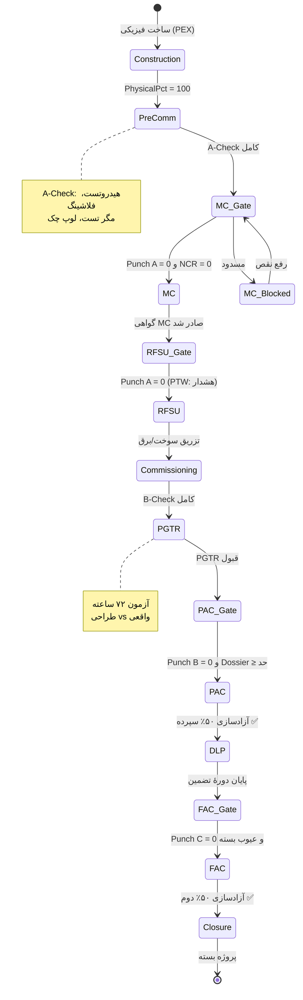

# D1 — تحلیل وضعیت موجود و معماری ماژول COM

**ماژول:** مدیریت پیش‌راه‌اندازی، راه‌اندازی، تحویل و اختتام نهایی
(Pre-Commissioning, Commissioning, Handover & Project Closure)
**شناسهٔ Master Prompt:** MOD-13 · **شناسهٔ دامنه در مخزن:** `d15`
**موتور:** `com-v1` · **تاریخ:** ۱۴۰۴/۰۶/۱۸

---

## ۰. خلاصهٔ اجرایی برای تصمیم‌گیرنده

سه تصمیم معماری در این سند گرفته شده که مسیر ۱۳ تحویلی بعدی را تعیین
می‌کند. چون پاسخ صریحی دریافت نشد، بهترین گزینه را انتخاب و دلیلش را
مستند کرده‌ام. اگر با هرکدام موافق نیستید، **الان** بگویید — پس از D3
تغییرشان هزینهٔ مهاجرت دارد.

| # | تصمیم | انتخاب |
|---|---|---|
| ۱ | شناسهٔ دامنه: `d13` جدید یا گسترش `d15` موجود؟ | **گسترش `d15`** |
| ۲ | آیتم سایدبار جدید؟ | **بله — آیتم مستقل `d15`** ✅ |
| ۳ | تکرار منطق پانچ با QMS؟ | **COM مرجع، QMS محاسبهٔ سریع** |

---

## ۱. تحلیل وضعیت موجود (Gap Analysis)

### ۱٫۱ آنچه از قبل هست — و واقعاً کار می‌کند

هفتهٔ گذشته در جریان ماژول پیمان، بخشی از COM ساخته شد. این **اتفاقی
نبود**: آزادسازی ۵۰/۵۰ سپرده بدون PAC/FAC قابل پیاده‌سازی نبود، پس
حداقلِ لازم ساخته شد.

| قابلیت | محل | وضعیت |
|---|---|---|
| جدول `CompletionCertificate` | `d15` | ✅ ساخته، آزموده |
| جدول `PunchListItem` | `d15` | ✅ ساخته، آزموده |
| دروازهٔ صدور PAC/FAC (`certificateGate`) | `contracts.ts` | ✅ کار می‌کند |
| جمع‌بندی پانچ (`punchSummary`) | `contracts.ts` | ✅ کار می‌کند |
| دورهٔ تضمین (`warrantyEnd`) | `contracts.ts` | ✅ کار می‌کند |
| آزادسازی ۵۰/۵۰ سپرده | `contracts.ts` + REST | ✅ راستی‌آزمایی زنده شد |
| ۵ اندپوینت `/api/com/*` | `server/index.js` | ✅ |
| مجوزهای `com.punch.record` / `com.certificate.*` | `accessControl.ts` | ✅ |
| مهاجرت `0012` | `persistence.ts` | ✅ |

### ۱٫۲ آنچه در QMS هست ولی جدول ندارد

ماژول کیفیت (`d8`) سه تابع درون‌حافظه‌ای دارد که **هیچ جدولی پشتشان
نیست** و از داده‌های ساختگی تغذیه می‌شوند:

| تابع | قرارداد | مشکل |
|---|---|---|
| `punchSummary` | `category:"A"\|"B"` · `closed` بولی | فقط دو دسته؛ COM سه دسته می‌خواهد |
| `mechanicalCompletionGate` | ۵ مسدودکننده | منطق درست ولی داده‌اش ساختگی است |
| `dossierCompleteness` | آرایهٔ رشته | مفهوم درست، بدون پایگاه داده |

⚠️ **این تابع‌ها ارزش دارند و حذف نمی‌شوند** — `mechanicalCompletionGate`
دقیقاً همان پنج شرطی را می‌شناسد که FIDIC می‌خواهد. مشکل فقط منبع
داده است.

### ۱٫۳ شکاف واقعی — آنچه اصلاً نیست

| # | شکاف | شدت | تحویلی |
|---|---|---|---|
| GC-01 | تفکیک سیستمی و درخت سیستم‌ها اصلاً وجود ندارد | 🔴 بحرانی | D3 |
| GC-02 | گواهی MC و RFSU وجود ندارد (فقط PAC/FAC) | 🔴 بحرانی | D6 |
| GC-03 | برگه‌های آزمون سرد و گرم (A/B-Check) نیست | 🔴 بحرانی | D4، D5 |
| GC-04 | آزمون عملکرد ۷۲ ساعته (PGTR) نیست | 🔴 بحرانی | D5 |
| GC-05 | پروندهٔ تحویل دیجیتال (Dossier) نیست | 🟠 بالا | D7 |
| GC-06 | دوران تضمین و ادعای گارانتی نیست | 🟠 بالا | D8 |
| GC-07 | اختتام نهایی و چک‌لیست بستن پروژه نیست | 🟠 بالا | D9 |
| GC-08 | KPI و EWS راه‌اندازی نیست | 🟡 متوسط | D10 |
| GC-09 | گزارش A4 و قالب اکسل COM نیست | 🟡 متوسط | D11، D12 |
| GC-10 | گردش امضای ۳ سطحی گواهی‌ها نیست | 🟠 بالا | D6 |

### ۱٫۴ وابستگی‌های بیرونی — واقعیت تلخ

Master Prompt ده وابستگی می‌شمارد. وضعیت واقعی در مخزن:

| وابستگی | نگاشت مخزن | وضعیت |
|---|---|---|
| PEX (تکمیل ساخت) | `Activity.PhysicalPct` | ✅ موجود |
| QLT (NCR و ITP) | `Ncr`، `InspectionRecord` (`d8`) | ✅ موجود |
| DMS (بایگانی) | `Document`، `Transmittal` (`d1`) | ✅ موجود |
| FIN (سپرده) | `RetainageLedger` (`d14`) | ✅ **ساخته شد** |
| RCC (ادعا) | `Claim`، `ChangeRequest` (`d4`) | ✅ موجود |
| EQP (گارانتی تجهیز) | `MaintenanceOrder` (`d9`) | ✅ موجود |
| KNW (درس‌آموخته) | `LessonLearned` (`d11`) | ✅ موجود |
| ENG (As-Built و O&M) | `MdrDeliverable` (`d12`) | ✅ موجود |
| MON (KPI و PHI) | `KpiSnapshot` (`d3`) | ✅ موجود |
| **HSE (PTW و SIMOPS)** | **هیچ جدولی ندارد** | ⛔ **غایب** |

⚠️ **HSE در این مخزن جدول ندارد.** حافظهٔ نشست می‌گوید «HSE در چت موازی
بسته شد» ولی در این checkout هیچ اثری از `PermitToWork` یا `Simops`
نیست. پس **D5 نمی‌تواند مجوز PTW را به‌صورت سخت الزامی کند.**

**تصمیم (ADR-COM-10):** RFSU یک فیلد اختیاری `PtwRef` می‌گیرد و اگر پر
نباشد، هشدار می‌دهد نه خطا. وقتی HSE ساخته شد، تبدیل هشدار به مانع سخت
یک تغییر یک‌خطی است. جایگزین بد این بود که جدول PTW ناقص داخل COM
بسازیم و بعد دو منبع حقیقت داشته باشیم.

---

## ۲. تصمیمات معماری (ADR)

### ADR-COM-01 — گسترش `d15`، نه ساخت `d13` جدید

**زمینه.** Master Prompt ماژول را MOD-13 می‌نامد. مخزن دامنه‌ای به نام
`d13` ندارد و `d15` از قبل دو جدول این ماژول را دارد.

**تصمیم.** شناسهٔ دامنه **`d15`** می‌ماند. شمارهٔ MOD-13 در مستندات و
عنوان ماژول حفظ می‌شود ولی به شناسهٔ فنی تبدیل نمی‌شود.

**دلیل.** ساختن `d13` یعنی مهاجرت دادن دو جدولی که همین هفته ساخته
شدند، شکستن ۳۸ آزمون سبز، و باطل‌کردن مهاجرت `0012` که شاید روی نصب
مشتری اجرا شده باشد. سود این کار فقط زیبایی شماره است. قید صریح Master
Prompt هم می‌گوید «نام‌گذاری جداول موجود حفظ شود» — و شناسهٔ دامنه بخشی
از همان نام‌گذاری است.

**پیامد.** در همهٔ اسناد این نگاشت تکرار می‌شود: `MOD-13 (COM) = d15`.

---

### ADR-COM-02 — گسترش `CertificateType` از دو مقدار به چهار

**زمینه.** `CompletionCertificate.CertificateType` امروز `pac|fac` است.
COM چهار گواهی می‌خواهد: MC، RFSU، PAC، FAC.

**تصمیم.** همان ستون به `mc|rfsu|pac|fac` گسترش می‌یابد. **جدول جدیدی
برای MC و RFSU ساخته نمی‌شود.**

**دلیل.** هر چهار گواهی ساختار یکسان دارند: شماره، تاریخ، صادرکننده،
امضاها، فهرست استثنائات، و ارجاع به گواهی پیشین. تفاوتشان در *قاعدهٔ
دروازه* است نه در *شکل داده*. دو جدول موازی یعنی هر تغییر در گردش امضا
باید دو جا اعمال شود.

**پیامد.** `PredecessorId` زنجیرهٔ `MC → RFSU → PAC → FAC` را می‌سازد.
مهاجرت لازم نیست چون ستون از قبل `text(10)` است و مقادیر جدید فقط
افزوده می‌شوند.

---

### ADR-COM-03 — موتور قفل دروازه: جدول قاعده، نه شرط سخت‌کدشده

**زمینه.** چهار دروازه با قواعد متفاوت:

```
MC   ← Punch Cat A = 0  و  NCR باز = 0  و  A-Check کامل
RFSU ← MC صادر شده  و  Punch Cat A = 0  و  (PTW: هشدار)
PAC  ← RFSU صادر شده  و  Punch Cat B = 0  و  PGTR قبول
FAC  ← PAC صادر شده  و  Punch Cat C = 0  و  DLP تمام
```

**تصمیم.** یک جدول `GateRule` با ردیف به‌ازای هر (نوع گواهی × شرط)، و
یک تابع خالص `evaluateGate()` که همهٔ شرط‌ها را ارزیابی و **فهرست کامل
مسدودکننده‌ها** را برمی‌گرداند — نه فقط اولی.

**دلیل.** برگرداندن فقط اولین مسدودکننده یعنی کاربر پنج بار تلاش
می‌کند و هر بار یک مانع جدید کشف می‌کند. تیم راه‌اندازی باید یک‌جا
بداند چه چیزی مانده. ضمناً قاعده در جدول یعنی سازمانی که Punch Cat C را
مانع FAC نمی‌داند بتواند بدون تغییر کد تنظیمش کند.

**پیامد.** `evaluateGate` هیچ‌وقت خطا پرتاب نمی‌کند؛ همیشه
`{ok, blockers[]}` می‌دهد تا رابط کاربری بتواند پیش از اقدام نمایش دهد.

---

### ADR-COM-04 — پانچ سه‌دسته‌ای، سازگار با دادهٔ موجود

**زمینه.** `PunchListItem.Category` امروز `a|b|c` است — که دقیقاً همان
سه دستهٔ Master Prompt است. ولی QMS با `"A"|"B"` (دو دسته، حرف بزرگ)
کار می‌کند.

**تصمیم.** COM مرجع است و `a|b|c` حرف کوچک می‌ماند. تابع QMS دست‌نخورده
می‌ماند ولی بالای آن نوشته می‌شود که برای محاسبهٔ سریع درون‌حافظه‌ای
است و منبع حقیقت `PunchListItem` است.

**دلیل.** تغییر امضای `punchSummary` در QMS یعنی شکستن آزمون‌های سبز
ماژول کیفیت برای سودی که فقط زیبایی است. دو تابع هم‌نام با قرارداد
متفاوت اشکالی ندارد **اگر** مرز صریح مستند باشد — که می‌شود.

**پیامد.** در `server/index.js` نام مستعار `comPunchSummary` از قبل
اعمال شده تا هیچ‌کدام سایهٔ دیگری نشود.

---

### ADR-COM-05 — تفکیک سیستمی مستقل از WBS، با نگاشت دوطرفه

**زمینه.** WBS ساختار *ساخت* است (چه کسی چه چیزی می‌سازد). سیستم ساختار
*بهره‌برداری* است (چه چیزی با چه چیزی راه می‌افتد). یک لولهٔ واحد ممکن
است در سه بستهٔ کاری ساخته شود ولی در یک سیستم راه بیفتد.

**تصمیم.** `SystemSubsystem` درخت مستقل خودش را دارد
(`ParentId` بازگشتی)، و `SystemBoundaryMapping` نگاشت چند-به-چند به
`WbsNode` و `Activity` می‌سازد.

**دلیل.** تحمیل سیستم روی WBS یعنی یا WBS را خراب می‌کنیم یا سیستم را.
هر پروژهٔ EPC واقعی این دو را جدا نگه می‌دارد.

**پیامد.** پیشرفت سیستمی ≠ پیشرفت فیزیکی. سیستمی که ۱۰۰٪ ساخته شده
ممکن است ۰٪ راه‌اندازی شده باشد. این تفاوت در D10 به‌عنوان KPI گزارش
می‌شود.

---

### ADR-COM-06 — A-Check و B-Check یک جدول، نه دو

**زمینه.** برگهٔ آزمون سرد (هیدروتست، مگر تست) و گرم (تست بار، لرزش)
ساختار یکسان دارند: شماره، دیسیپلین، سیستم، مقدار انتظار، مقدار واقعی،
نتیجه، امضا.

**تصمیم.** یک جدول `CheckSheet` با ستون `SheetType(a|b)`.

**دلیل.** تفاوت سرد و گرم در *زمان اجرا* و *پیش‌نیاز* است، نه در شکل
داده. دو جدول یعنی هر گزارش باید `UNION` بزند.

**پیامد.** پیش‌نیاز در `GateRule` کنترل می‌شود نه در ساختار جدول:
B-Check تنها پس از صدور MC مجاز است.

---

### ADR-COM-07 — PGTR: مقدار طراحی و واقعی در ردیف، نه در JSON

**زمینه.** آزمون عملکرد ۷۲ ساعته ده‌ها متغیر دارد (دبی، فشار، دما،
مصرف، بازده).

**تصمیم.** `PerformanceTestRun` سرآیند است و `PerformanceTestReading`
ردیف‌های متغیر — هر متغیر یک ردیف با `DesignValue`، `ActualValue`،
`Tolerance`، `Passed`.

**دلیل.** ذخیرهٔ متغیرها در ستون JSON یعنی نمی‌شود پرسید «کدام سیستم‌ها
در متغیر بازده رد شدند». تحلیل روی JSON در SQL Server 2008 (هدف این
مخزن) عملاً ممکن نیست.

**پیامد.** قبولی کل آزمون مشتق است: همهٔ ردیف‌های الزامی باید
`Passed=1` باشند.

---

### ADR-COM-08 — Dossier فهرست است، نه انبار فایل

**زمینه.** پروندهٔ تحویل ده‌ها مدرک دارد که همه از قبل در DMS، ENG یا
QLT هستند.

**تصميم.** `HandoverDossier` فقط **فهرست الزامی** و `DossierItem` نگاشت
به مدرک موجود است. هیچ فایلی کپی نمی‌شود.

**دلیل.** کپی‌کردن مدرک یعنی وقتی نقشهٔ As-Built بازنگری شود، Dossier
نسخهٔ کهنه را نگه می‌دارد. درصد آمادگی از نسبت اقلام تأمین‌شده به
الزامی محاسبه می‌شود.

---

### ADR-COM-09 — آزادسازی سپرده: COM پیشنهاد می‌دهد، FIN تصمیم می‌گیرد

**زمینه.** اندپوینت `/api/cnt/retainage/release` از قبل ساخته شده و
`certificateId` می‌گیرد.

**تصمیم.** COM هیچ رکورد مالی نمی‌سازد. صدور گواهی فقط گواهی را در
وضعیت `issued` می‌گذارد؛ آزادسازی اقدام جدا با مجوز
`cnt.retainage.manage` است.

**دلیل.** اگر صدور گواهی خودکار پول آزاد کند، یک اشتباه در تاریخ تحویل
مستقیماً پرداخت اشتباه می‌سازد. تفکیک وظیفه ایجاب می‌کند صادرکنندهٔ
گواهی (کارفرما) و آزادکنندهٔ سپرده (مالی) یکی نباشند.

**پیامد.** ✅ این از قبل پیاده و راستی‌آزمایی شده است.

---

### ADR-COM-10 — PTW: قلاب نرم تا وقتی HSE ساخته شود

شرح در بند ۱٫۴. خلاصه: `PtwRef` اختیاری، هشدار نه مانع.

---

### ADR-COM-11 — آیتم سایدبار مستقل ✅ تأییدشده

**زمینه.** قید دائمی کاربر: بدون آیتم سایدبار جدید مگر تأیید صریح.
پیش‌نویس اول این سند محافظه‌کارانه مونت در تب `d8` کیفیت را پیشنهاد داد.

**تصمیم (بازنگری‌شده).** کاربر صریحاً گزینهٔ آیتم مستقل را تأیید کرد.
دامنهٔ `d15` با عنوان **«مدیریت راه‌اندازی، تحویل و اختتام نهایی»**،
شمایل 🏁 و رنگ تأکید `#F97316` به سایدبار افزوده شد.

**جایگاه.** ردیف **یازدهم** — پس از «مدیریت مهندسی و طراحی» و **پیش
از** «مدیریت سامانه و پیکربندی پایه» که طبق قید دائمی کاربر همیشه آخر
می‌ماند.

**دلیل بازنگری.** COM شش زیرماژول، چهار گواهی زنجیره‌ای، درخت
سیستم‌ها و چرخهٔ اختتام پروژه دارد و از نظر حجم هم‌وزن ماژول‌هایی است
که آیتم دارند. اختتام نهایی پروژه و آزادسازی ضمانت‌نامه‌ها زیرمجموعهٔ
«بازرسی» نیستند؛ مونت در تب کیفیت آن تب را شلوغ و مرز مفهومی را مخدوش
می‌کرد.

**پیامد.** شش فرآیند `d15-p1` تا `d15-p6` دقیقاً بر شش زیرماژول Master
Prompt منطبق‌اند و هر کدام دو زیرفعالیت دارند. ستون `sql` هر زیرفعالیت
به جداول واقعی D2 ارجاع می‌دهد.

**قیدهای رعایت‌شده:** `src/index.css` دست‌نخورده · فونت Vazirmatn
دست‌نخورده · «مدیریت سامانه» همچنان آخرین آیتم · رنگ تأکید از پالت
موجود.

---

## ۳. معماری مؤلفه‌ها

```mermaid
graph TB
  subgraph UI["لایهٔ رابط کاربری — دامنهٔ d15 در سایدبار"]
    TREE["درخت سیستم‌ها<br/>Systems Tree"]
    GATE["نشانگر دروازه‌ها<br/>Gate Lock Panel"]
    DASH["داشبورد راه‌اندازی"]
  end

  subgraph SVC["موتور com-v1 — src/services/commissioning.ts"]
    S1["SystemizationService<br/>درخت، مرز، اولویت"]
    S2["CheckRecordService<br/>A/B-Check، بسته آزمون"]
    S3["CommissioningService<br/>تست گرم، PGTR"]
    S4["HandoverGateService<br/>قفل دروازه، گواهی"]
    S5["DossierBuilderService<br/>فهرست، درصد آمادگی"]
    S6["DLP_WarrantyService<br/>عیوب، ادعا، اختتام"]
    S7["CompletionAnalyticsService<br/>KPI، EWS"]
  end

  subgraph DATA["پایگاه داده — d15"]
    T1[("SystemSubsystem<br/>SystemBoundaryMapping")]
    T2[("CheckSheet<br/>CheckRecordPack")]
    T3[("PerformanceTestRun<br/>PerformanceTestReading")]
    T4[("CompletionCertificate ✅<br/>PunchListItem ✅<br/>GateRule")]
    T5[("HandoverDossier<br/>DossierItem")]
    T6[("WarrantyClaim<br/>ProjectClosureRecord")]
  end

  subgraph EXT["ماژول‌های بیرونی"]
    PEX["d2 — Activity.PhysicalPct"]
    QLT["d8 — Ncr، InspectionRecord"]
    FIN["d14 — RetainageLedger ✅"]
    DMS["d1 — Document"]
    ENG["d12 — MdrDeliverable"]
    EQP["d9 — MaintenanceOrder"]
    KNW["d11 — LessonLearned"]
    HSE["HSE — غایب ⛔"]
  end

  TREE --> S1 --> T1
  GATE --> S4 --> T4
  DASH --> S7
  S2 --> T2
  S3 --> T3
  S5 --> T5
  S6 --> T6

  S1 -.نگاشت.-> PEX
  S4 -.پیش‌نیاز.-> QLT
  S4 -.گواهی.-> FIN
  S5 -.مدرک.-> DMS
  S5 -.As-Built.-> ENG
  S6 -.دستور کار.-> EQP
  S6 -.درس‌آموخته.-> KNW
  S3 -.PtwRef نرم.-> HSE

  style T4 fill:#1a3a1a
  style FIN fill:#1a3a1a
  style HSE fill:#3a1a1a
```



سبز = از قبل ساخته و آزموده · قرمز = وابستگی غایب

---

## ۴. زنجیرهٔ دروازه‌ها — منطق مرکزی ماژول



**نکتهٔ حیاتی:** مسیر سبز (PAC → آزادسازی → FAC → آزادسازی) از قبل
ساخته و با curl راستی‌آزمایی شده. آنچه اضافه می‌شود نیمهٔ چپ زنجیره
است.

---

## ۵. استراتژی یکپارچگی

### ۵٫۱ COM ↔ FIN — تنها اتصال مالی

✅ **ساخته شده.** `/api/cnt/retainage/release` گواهی را می‌گیرد، نوعش را
می‌خواند، و `release_pac` یا `release_fac` می‌سازد. محافظ‌ها: گواهی
پیمان دیگر رد می‌شود، آزادسازی دوباره رد می‌شود، FAC پیش از PAC رد
می‌شود.

### ۵٫۲ COM ↔ PEX — دو نوع پیشرفت

| سنجه | منبع | معنا |
|---|---|---|
| پیشرفت فیزیکی | `Activity.PhysicalPct` | چقدر ساخته شده |
| پیشرفت سیستمی | `SystemSubsystem` + گواهی | چقدر راه افتاده |

این دو **جمع نمی‌شوند**. سیستمی با ساخت ۱۰۰٪ و MC صادرنشده، از دید
بهره‌بردار صفر است.

### ۵٫۳ COM ↔ QLT — پیش‌نیاز سخت MC

`Ncr` با `Status != closed` و `ActivityId` در دامنهٔ سیستم ← مانع MC.
ستون `Ncr.ActivityId` هفتهٔ گذشته افزوده شد (مهاجرت `0011`) و همین‌جا
به کار می‌آید.

### ۵٫۴ COM ↔ RCC — ادعای تأخیر کارفرما

اگر بین `ReadyForGateAt` و `IssuedAt` بیش از حد مجاز فاصله بیفتد،
رویداد ادعا در `Claim` (`d4`) پیشنهاد می‌شود. **COM ادعا نمی‌سازد،
پیشنهاد می‌دهد** — ثبت ادعا تصمیم مدیر پیمان است.

### ۵٫۵ COM ↔ KNW — اختتام

`ProjectClosureRecord` به `LessonLearned` (`d11`) ارجاع می‌دهد. جلسهٔ
Post-Mortem در `MeetingMinute` ثبت می‌شود.

---

## ۶. طرح بهبود UI/UX

**قید مطلق:** `src/index.css` و فونت Vazirmatn دست‌نخورده. رنگ‌ها از
پالت موجود. آیتم سایدبار `d15` با تأیید صریح کاربر افزوده شد
(ADR-COM-11).

| المان | توضیح |
|---|---|
| درخت سیستم‌ها | درخت تاشو با نشانگر رنگی دروازه در هر گره |
| نوار دروازه | چهار حباب `MC · RFSU · PAC · FAC` با رنگ سبز/زرد/قرمز |
| پنل مسدودکننده | با کلیک روی حباب قرمز، **همهٔ** موانع فهرست می‌شوند |
| میلهٔ Dossier | درصد آمادگی با فهرست اقلام غایب |
| جدول PGTR | مقایسهٔ طراحی/واقعی با رنگ انحراف |

---

## ۷. نگاشت ۱۴ تحویلی

| # | عنوان | جداول | وضعیت پیش‌نیاز |
|---|---|---|---|
| D1 | معماری | — | ✅ همین سند |
| D2 | ERD | همه | آماده |
| D3 | تفکیک سیستمی | `SystemSubsystem`، `SystemBoundaryMapping` | آماده |
| D4 | پیش‌راه‌اندازی | `CheckRecordPack`، `CheckSheet` | نیازمند D3 |
| D5 | راه‌اندازی و PGTR | `PerformanceTestRun/Reading` | نیازمند D4 · PTW نرم |
| D6 | گواهی و دروازه | `GateRule` + گسترش `CertificateType` | نیازمند D3–D5 |
| D7 | Dossier | `HandoverDossier`، `DossierItem` | نیازمند D6 |
| D8 | DLP و سپرده | `WarrantyClaim` | ✅ نیمهٔ مالی آماده |
| D9 | اختتام | `ProjectClosureRecord` | نیازمند D8 |
| D10 | KPI و EWS | `CompletionMetricsSnapshot` | نیازمند D6 |
| D11 | گزارش A4 | — | ✅ زیرساخت `rptLogic` آماده |
| D12 | اکسل | — | ✅ زیرساخت `itgLogic` آماده |
| D13 | یکپارچگی | — | نیازمند همه |
| D14 | RBAC و API | — | ✅ ۳ مجوز آماده |

**مسیر بحرانی:** `D3 → D4 → D5 → D6 → D7 → D9`

---

## ۸. ده لوپ خودارزیابی

### لوپ ۱ — انطباق PMBOK و FIDIC

| مرجع | پوشش |
|---|---|
| PMBOK 4.7 Close Project | D9 — چک‌لیست اختتام |
| PMBOK 5.5 Validate Scope | D6 — پذیرش کارفرما |
| FIDIC Cl. 9 Tests on Completion | D4، D5 |
| FIDIC Cl. 10 Taking Over | D6 — PAC/TOC |
| FIDIC Cl. 11 Defects Liability | D8 — DLP |

⚠️ **شکاف صادقانه:** FIDIC Cl. 10.2 «تحویل بخشی از کار»
(Taking Over of Parts) در این طراحی پوشش داده **نشده**. مدل فعلی گواهی
را به سیستم یا پیمان می‌بندد، نه به بخش جغرافیایی. برای پروژه‌های
فازبندی‌شده باید در D6 بازبینی شود.

### لوپ ۲ — تفکیک سیستمی

✅ درخت بازگشتی · ✅ مرزبندی چند-به-چند به WBS · ✅ اولویت‌بندی
⚠️ ماتریس اولویت فعلاً تک‌بعدی (عدد) است؛ اگر ماتریس دوبعدی
(بحرانیت × آمادگی) بخواهید، در D3 بگویید.

### لوپ ۳ — بسته‌های آزمون

✅ A-Check سرد · ✅ B-Check گرم · ✅ PGTR با ردیف متغیر
⚠️ امضای دیجیتال چک‌شیت از الگوی `signRecord` موجود در QMS استفاده
می‌کند — نساخته، ولی موجود است.

### لوپ ۴ — منطق قفل دروازه

✅ Punch A یا NCR ← قفل MC و RFSU · ✅ Punch B ← قفل PAC ·
✅ Punch C ← قفل FAC · ✅ همهٔ موانع یک‌جا برمی‌گردند
✅ **از قبل برای PAC/FAC کار می‌کند و آزموده شده**

### لوپ ۵ — گردش امضا

⚠️ **این بزرگ‌ترین شکاف باقی‌مانده است.** امروز صدور گواهی تک‌مرحله‌ای
است (`Status: issued`). گردش سه سطحی (پیمانکار → مشاور → کارفرما) در D6
ساخته می‌شود. الگویش از `IPC_WorkflowStep` ماژول پیمان کپی می‌شود که
همین هفته ساخته و آزموده شد.

### لوپ ۶ — Dossier

✅ فهرست به‌جای کپی · ✅ درصد آمادگی · ✅ نگاشت به DMS و ENG
⚠️ تابع `dossierCompleteness` در QMS از قبل هست ولی داده‌اش ساختگی است؛
D7 آن را به جدول وصل می‌کند.

### لوپ ۷ — آزادسازی مالی

✅ **کامل و راستی‌آزمایی‌شده.** جدول زیر خروجی واقعی curl است:

| رویداد | مبلغ | مانده |
|---|---|---|
| انباشت IPC-1 | ۱۰٬۰۰۰٬۰۰۰ | ۱۰٬۰۰۰٬۰۰۰ |
| آزادسازی PAC | ۵٬۰۰۰٬۰۰۰ | ۵٬۰۰۰٬۰۰۰ |
| انباشت IPC-2 | ۲٬۰۰۰٬۰۰۰ | ۷٬۰۰۰٬۰۰۰ |
| آزادسازی FAC | ۷٬۰۰۰٬۰۰۰ | **۰** |

### لوپ ۸ — گزارش A4 سه‌لوگو

✅ زیرساخت آماده: `A4`، `letterheadHtml`، `publishGate`، `toPrintHtml`،
`toWordHtml`، `toExcelHtml`
⬜ پنج قالب COM ساخته نشده (D11)

### لوپ ۹ — قالب اکسل

✅ زیرساخت آماده: `TEMPLATE_CATALOG`، `mapHeaders`، `parseImport`
⬜ پنج قالب COM ساخته نشده (D12)
✅ قید کاربر رعایت شد: اکسل ظرف است نه منبع حقیقت

### لوپ ۱۰ — یکپارچگی و مهاجرت

✅ نه وابستگی از ده تا موجود · ⛔ HSE غایب (ADR-COM-10)
✅ **صفر مهاجرت مخرب**: جداول موجود دست‌نخورده، فقط جدول جدید افزوده
می‌شود و `CertificateType` مقدار جدید می‌پذیرد

---

## ۹. ده پرسش سازگاری

| # | پرسش | پاسخ |
|---|---|---|
| ۱ | آیا `d15` موجود می‌شکند؟ | خیر — فقط گسترش |
| ۲ | آیا آزمون‌های PAC/FAC می‌شکنند؟ | خیر — ۳۸ آزمون دست‌نخورده |
| ۳ | آیا مهاجرت `0012` باطل می‌شود؟ | خیر — `0013` جدا افزوده می‌شود |
| ۴ | آیا سایدبار تغییر می‌کند؟ | بله — یک آیتم افزوده شد (ADR-COM-11) |
| ۵ | آیا QMS می‌شکند؟ | خیر (ADR-COM-04) |
| ۶ | آیا `index.css` دست می‌خورد؟ | خیر |
| ۷ | آیا FIN دوباره ساخته می‌شود؟ | خیر — از قبل هست |
| ۸ | HSE نبودن چه می‌کند؟ | PTW هشدار می‌شود نه مانع |
| ۹ | نام جداول موجود حفظ می‌شود؟ | بله — قید Master Prompt |
| ۱۰ | آیا SQL Server 2008 پشتیبانی می‌شود؟ | بله — بدون JSON، بدون `MERGE` |

---

## ۱۰. آنچه این سند **نمی‌گوید**

صادقانه: D1 فقط معماری است. هیچ کدی در این نوبت نوشته نشد. جداول،
موتور، اندپوینت و رابط کاربری از D2 به بعد ساخته می‌شوند.

سه ریسکی که باید بدانید:

1. **گردش امضای سه سطحی نیست** (لوپ ۵) — بزرگ‌ترین شکاف.
2. **HSE غایب است** — RFSU بدون کنترل سخت PTW صادر می‌شود.
3. **تحویل بخشی از کار پوشش ندارد** (FIDIC 10.2) — برای پروژهٔ
   فازبندی‌شده باید بازبینی شود.
