# D2 — مدل دادهٔ جامع ماژول COM

**ماژول:** MOD-13 راه‌اندازی، تحویل و اختتام نهایی · **دامنه:** `d15`
**موتور:** `com-v1` · **مهاجرت هدف:** `0013`
**تاریخ:** ۱۴۰۴/۰۶/۱۸

---

## ۰. چطور این سند را بخوانید

هر جدول یکی از سه برچسب را دارد:

| برچسب | معنا |
|---|---|
| ✅ **موجود** | امروز در `sqlLogic.js` هست و داده دارد — دست نمی‌خورد |
| 🔧 **بهبود** | جدول موجود است، ستون یا معنای مقدار گسترش می‌یابد |
| 🆕 **جدید** | در مهاجرت `0013` ساخته می‌شود |

**قید Master Prompt:** نام جداول و فیلدهای موجود حفظ می‌شود. در کل این
مدل **هیچ ستونی حذف یا تغییرنام نمی‌شود** و هیچ جدولی بازنویسی نمی‌شود.

---

## ۱. جمع‌بندی

| گروه | موجود | بهبود | جدید | جمع |
|---|---|---|---|---|
| تفکیک سیستمی | ۰ | ۰ | ۳ | ۳ |
| پیش‌راه‌اندازی و راه‌اندازی | ۰ | ۰ | ۴ | ۴ |
| گواهی و دروازه | ۱ | ۱ | ۳ | ۵ |
| پرونده تحویل | ۰ | ۰ | ۳ | ۳ |
| تضمین و اختتام | ۰ | ۰ | ۳ | ۳ |
| تحلیل و هشدار | ۰ | ۰ | ۲ | ۲ |
| **جمع** | **۱** | **۱** | **۱۸** | **۲۰** |

پس از این مهاجرت: **۷۷ + ۱۸ = ۹۵ جدول** · **۱۳ مهاجرت**

⚠️ دو جدول `CompletionCertificate` و `PunchListItem` هفتهٔ گذشته ساخته
شدند و **آزمون سبز و دادهٔ راستی‌آزمایی‌شده دارند**. یکی دست‌نخورده
می‌ماند و دیگری فقط دامنهٔ یک مقدار متنی را گسترش می‌دهد.

---

## ۲. ERD کامل

```mermaid
erDiagram
  SystemSubsystem ||--o{ SystemSubsystem : "زیرسیستم"
  SystemSubsystem ||--o{ SystemBoundaryMapping : "مرز"
  SystemSubsystem ||--o{ SystemMilestoneTarget : "تاریخ هدف"
  SystemSubsystem ||--o{ CheckRecordPack : "بستهٔ آزمون"
  SystemSubsystem ||--o{ CommissioningActivity : "فعالیت"
  SystemSubsystem ||--o{ PerformanceTestRun : "آزمون عملکرد"
  SystemSubsystem ||--o{ CompletionCertificate : "گواهی"
  SystemSubsystem ||--o{ PunchListItem : "نقص"
  SystemSubsystem ||--o{ HandoverDossier : "پرونده"
  SystemSubsystem ||--o{ CompletionMetricsSnapshot : "سنجه"

  CheckRecordPack ||--o{ CheckSheet : "برگه"
  CheckSheet ||--o{ CheckSheetLine : "ردیف"

  PerformanceTestRun ||--o{ PerformanceTestReading : "قرائت"

  CompletionCertificate ||--o{ CertificateSignature : "امضا"
  CompletionCertificate ||--o{ PunchClearanceLink : "تسویهٔ نقص"
  CompletionCertificate ||--o| CompletionCertificate : "گواهی پیشین"
  PunchListItem ||--o{ PunchClearanceLink : "ارجاع"
  GateRule ||--o{ CompletionCertificate : "قاعدهٔ ارزیابی"

  HandoverDossier ||--o{ DossierItem : "قلم"
  DossierRequirementTemplate ||--o{ HandoverDossier : "الگو"

  WarrantyClaim ||--o{ WarrantyClaimAction : "اقدام"
  ProjectClosureRecord ||--o{ ClosureChecklistItem : "بند"

  CompletionAlertRule ||--o{ CompletionMetricsSnapshot : "ارزیابی"

  SystemSubsystem {
    text Id PK
    text ProjectId FK
    text ParentId FK "درخت بازگشتی"
    text SystemCode UK "یکتا در پروژه"
    text TitleFa
    text SystemType "system|subsystem|package"
    text DisciplineCode
    int  CommissioningPriority
    text CriticalityFa "high|medium|low"
    text OwnerUserId
    int  SortOrder
    text Status "planned|precomm|comm|handed_over|closed"
  }

  SystemBoundaryMapping {
    text Id PK
    text ProjectId FK
    text SystemId FK
    text TargetKind "wbs|activity|pid|equipment|tag"
    text TargetRef "شناسهٔ هدف"
    text BoundaryNoteFa
    bit  IsPrimary
  }

  SystemMilestoneTarget {
    text Id PK
    text ProjectId FK
    text SystemId FK
    text GateType "mc|rfsu|pac|fac"
    date TargetDate
    date ForecastDate
    date ActualDate
    int  SlipDays "مشتق"
  }

  CheckRecordPack {
    text Id PK
    text ProjectId FK
    text SystemId FK
    text PackNo UK
    text TitleFa
    text PackType "a|b"
    text DisciplineCode
    int  TotalSheets
    int  ClearedSheets
    text Status "draft|in_progress|cleared|rejected"
  }

  CheckSheet {
    text Id PK
    text ProjectId FK
    text PackId FK
    text SheetNo UK
    text SheetType "a|b"
    text TestKind "hydrotest|flushing|megger|loop_check|..."
    text TitleFa
    date TestDate
    text TestedBy
    text WitnessedBy
    text ResultFa "pass|fail|conditional"
    text NcrRef "ارجاع به عدم انطباق"
    text Status "draft|signed|void"
  }

  CheckSheetLine {
    text Id PK
    text SheetId FK
    int  LineNo
    text ParameterFa
    text ExpectedValue
    text ActualValue
    text UnitFa
    bit  IsMandatory
    bit  Passed
  }

  CommissioningActivity {
    text Id PK
    text ProjectId FK
    text SystemId FK
    text ActivityNo
    text TitleFa
    text Phase "precomm|comm|startup"
    text PtwRef "قلاب نرم HSE"
    text SimopsNoteFa
    date PlannedDate
    date ActualDate
    text Status
  }

  PerformanceTestRun {
    text Id PK
    text ProjectId FK
    text SystemId FK
    text RunNo UK
    text TitleFa
    datetime StartedAt
    datetime EndedAt
    int  DurationHours "پیش‌فرض ۷۲"
    int  RequiredHours
    text ResultFa "pass|fail|aborted"
    text AbortReasonFa
    text WitnessedBy
    text Status
  }

  PerformanceTestReading {
    text Id PK
    text RunId FK
    int  LineNo
    text ParameterFa
    numeric DesignValue
    numeric ActualValue
    numeric TolerancePct
    text UnitFa
    bit  IsMandatory
    bit  Passed "مشتق"
  }

  CompletionCertificate {
    text Id PK
    text ProjectId FK
    text ContractId FK
    text SystemId FK "بهبود: جدید"
    text CertificateType "بهبود: mc|rfsu|pac|fac"
    text CertificateNo UK
    text TitleFa
    date HandoverDate
    date IssueDate
    int  WarrantyMonths
    date WarrantyEndDate
    text PredecessorId FK
    int  OpenPunchCount
    date ReadyForGateAt "بهبود: مبنای ادعای تأخیر"
    text CommitteeFa
    text NoteFa
    text Status "draft|issued|revoked"
  }

  CertificateSignature {
    text Id PK
    text ProjectId FK
    text CertificateId FK
    int  StepNo
    text Actor "contractor|consultant|employer"
    text ActorUserId
    text Action "submit|approve|reject|return_for_correction"
    datetime ActedAt
    date DueAt
    int  OverdueDays
    text CommentFa
  }

  GateRule {
    text Id PK
    text ProjectId FK
    text GateType "mc|rfsu|pac|fac"
    text RuleCode UK
    text TitleFa
    text CheckKind "punch|ncr|checksheet|pgtr|dossier|predecessor|warranty|ptw"
    text Operator "eq|lte|gte"
    numeric Threshold
    text SeverityFa "blocker|warning"
    bit  IsActive
  }

  PunchClearanceLink {
    text Id PK
    text ProjectId FK
    text CertificateId FK
    text PunchItemId FK
    text LinkKind "exception|cleared"
    text NoteFa
  }

  PunchListItem {
    text Id PK
    text ProjectId FK
    text CertificateId FK
    text ContractId FK
    text SystemId FK "بهبود: جدید"
    text ItemNo UK
    text TitleFa
    text Category "a|b|c"
    text DisciplineCode
    text LocationFa
    text RaisedBy
    date RaisedAt
    date DueDate
    date ClosedAt
    text ClosedBy
    text EvidenceDocNo
    text Status "open|in_progress|closed|waived"
  }

  HandoverDossier {
    text Id PK
    text ProjectId FK
    text SystemId FK
    text DossierNo UK
    text TitleFa
    text TemplateId FK
    int  RequiredCount
    int  SuppliedCount
    numeric ReadinessPct "مشتق"
    text Status "draft|in_progress|complete|submitted"
  }

  DossierItem {
    text Id PK
    text ProjectId FK
    text DossierId FK
    int  LineNo
    text ItemKind "as_built|om_manual|itp|checksheet|certificate|vendor_doc|spare_list"
    text TitleFa
    text SourceModule "d1|d8|d12|d15"
    text SourceRef "شناسهٔ مدرک در ماژول مبدأ"
    bit  IsMandatory
    bit  IsSupplied
    date SuppliedAt
    text NoteFa
  }

  DossierRequirementTemplate {
    text Id PK
    text ProjectId FK
    text TemplateCode UK
    text TitleFa
    text DisciplineCode
    text ItemsJson "فهرست اقلام الزامی"
    bit  IsActive
  }

  WarrantyClaim {
    text Id PK
    text ProjectId FK
    text SystemId FK
    text CertificateId FK "PAC مبنای شروع تضمین"
    text ClaimNo UK
    text TitleFa
    date ReportedAt
    text ReportedBy
    text DefectCategoryFa
    text LiablePartyFa "contractor|vendor|client|shared"
    text VendorRef
    numeric EstimatedCost
    numeric ActualCost
    text MaintenanceOrderRef "d9"
    date TargetFixDate
    date ClosedAt
    text Status "open|assigned|fixing|verified|closed|rejected"
  }

  WarrantyClaimAction {
    text Id PK
    text ClaimId FK
    int  StepNo
    text ActionFa
    text ActorUserId
    datetime ActedAt
    text NoteFa
  }

  ProjectClosureRecord {
    text Id PK
    text ProjectId UK
    text ClosureNo
    date InitiatedAt
    date ClosedAt
    text PostMortemMinuteRef "d11"
    int  LessonsCaptured
    numeric FinalSettlementAmount
    text ClosureCommitteeFa
    text Status "draft|in_review|closed|archived"
  }

  ClosureChecklistItem {
    text Id PK
    text ClosureId FK
    int  LineNo
    text CategoryFa "financial|contractual|hr|equipment|document|knowledge"
    text TitleFa
    text OwnerModule
    text VerifyRef
    bit  IsMandatory
    bit  IsDone
    date DoneAt
    text NoteFa
  }

  CompletionMetricsSnapshot {
    text Id PK
    text ProjectId FK
    text SystemId FK
    date SnapshotDate
    numeric McRatePct
    int  PacSlipDays
    numeric PunchACleardPct
    numeric PgtrPassRatePct
    numeric DossierReadinessPct
    numeric DlpResolutionPct
    numeric SystemCompletionPct
  }

  CompletionAlertRule {
    text Id PK
    text ProjectId FK
    text RuleCode UK
    text TitleFa
    text MetricKey
    text Operator
    numeric Threshold
    text SeverityFa "critical|high|medium|low"
    text EscalateToRole
    bit  IsActive
  }
```



---

## ۳. جزئیات جدول‌ها با وضعیت بازطراحی

### گروه ۱ — تفکیک سیستمی

#### 🆕 `SystemSubsystem` — درخت سیستم‌ها

| ستون | نوع | Null | توضیح |
|---|---|---|---|
| `Id` | text(60) | ✖ | کلید اصلی |
| `ProjectId` | text(60) | ✖ | FK → `Project` |
| `ParentId` | text(60) | ✔ | خودارجاع؛ خالی = ریشه |
| `SystemCode` | text(40) | ✖ | یکتا در پروژه |
| `TitleFa` | text(400) | ✖ | — |
| `TitleEn` | text(400) | ✔ | دوزبانه |
| `SystemType` | text(20) | ✖ | `system` · `subsystem` · `package` |
| `DisciplineCode` | text(20) | ✔ | — |
| `CommissioningPriority` | int | ✔ | ۱ = بالاترین |
| `CriticalityFa` | text(10) | ✔ | `high` · `medium` · `low` |
| `OwnerUserId` | text(60) | ✔ | مسئول راه‌اندازی |
| `SortOrder` | int | ✔ | ترتیب نمایش هم‌نیا |
| `Status` | text(20) | ✖ | `planned`→`precomm`→`comm`→`handed_over`→`closed` |

**یکتا:** `(ProjectId, SystemCode)`
**ایندکس:** `IX_SysSub_Parent(ParentId)` · `IX_SysSub_Status(ProjectId,Status)`

⚠️ **چرا `ParentId` و نه جدول رابطه؟** درخت سیستم تک‌والدی است — یک
زیرسیستم دقیقاً در یک سیستم است. جدول رابطه پیچیدگی بی‌دلیل می‌آورد.
عمق درخت در عمل ۳ سطح است.

⚠️ **حلقه در درخت:** SQL Server 2008 چک بازگشتی در CHECK ندارد. جلوگیری
از حلقه در موتور `com-v1` انجام می‌شود (`assertNoCycle`).

#### 🆕 `SystemBoundaryMapping` — نگاشت به WBS و P&ID

| ستون | نوع | Null | توضیح |
|---|---|---|---|
| `Id` | text(60) | ✖ | — |
| `ProjectId` | text(60) | ✖ | — |
| `SystemId` | text(60) | ✖ | FK → `SystemSubsystem` |
| `TargetKind` | text(20) | ✖ | `wbs` · `activity` · `pid` · `equipment` · `tag` |
| `TargetRef` | text(120) | ✖ | شناسه در ماژول مقصد |
| `BoundaryNoteFa` | text(600) | ✔ | مثلاً «از شیر V-101 تا فلنج پمپ» |
| `IsPrimary` | bit | ✖ | نگاشت اصلی برای محاسبهٔ پیشرفت |

**یکتا:** `(SystemId, TargetKind, TargetRef)`

⚠️ **`TargetRef` عمداً FK سخت ندارد.** یک ردیف می‌تواند به `WbsNode`،
`Activity` یا برچسب P&ID اشاره کند. FK چندگانه در SQL Server ممکن
نیست. صحت ارجاع در موتور بررسی می‌شود.

#### 🆕 `SystemMilestoneTarget` — تاریخ هدف چهار دروازه

| ستون | نوع | Null | توضیح |
|---|---|---|---|
| `GateType` | text(10) | ✖ | `mc` · `rfsu` · `pac` · `fac` |
| `TargetDate` | date | ✖ | مصوب اولیه |
| `ForecastDate` | date | ✔ | پیش‌بینی جاری |
| `ActualDate` | date | ✔ | از تاریخ صدور گواهی |
| `SlipDays` | int | ✔ | مشتق: `Actual − Target` |

**یکتا:** `(SystemId, GateType)` — هر سیستم برای هر دروازه یک هدف.

---

### گروه ۲ — پیش‌راه‌اندازی و راه‌اندازی

#### 🆕 `CheckRecordPack` — بستهٔ آزمون

**یکتا:** `(ProjectId, PackNo)` · `PackType` مقدار `a` (سرد) یا `b` (گرم).
`TotalSheets`/`ClearedSheets` مشتق‌اند و با ثبت برگه به‌روز می‌شوند.

#### 🆕 `CheckSheet` + 🆕 `CheckSheetLine` — برگه و ردیف آزمون

طبق **ADR-COM-06** یک جدول برای هر دو نوع سرد و گرم.

| ستون کلیدی | توضیح |
|---|---|
| `SheetType` | `a` سرد · `b` گرم |
| `TestKind` | `hydrotest` · `flushing` · `blowing` · `megger` · `loop_check` · `calibration` · `alignment` · `no_load` · `load_test` · `vibration` |
| `ResultFa` | `pass` · `fail` · `conditional` |
| `NcrRef` | برگهٔ مردود می‌تواند عدم انطباق بسازد |

⚠️ **`CheckSheetLine` جدا از برگه است** چون یک هیدروتست ده پارامتر دارد
(فشار آزمون، مدت، افت مجاز، دما...). ذخیره در JSON یعنی نمی‌شود پرسید
«کدام سیستم‌ها در افت فشار رد شدند».

**قاعدهٔ مشتق:** برگه قبول است اگر همهٔ ردیف‌های `IsMandatory=1` مقدار
`Passed=1` داشته باشند.

#### 🆕 `CommissioningActivity` — فعالیت راه‌اندازی و قلاب PTW

| ستون | توضیح |
|---|---|
| `Phase` | `precomm` · `comm` · `startup` |
| `PtwRef` | **قلاب نرم HSE (ADR-COM-10)** — خالی = هشدار، نه مانع |
| `SimopsNoteFa` | یادداشت عملیات هم‌زمان |

⚠️ **چرا `PtwRef` رشتهٔ آزاد است و FK نیست:** ماژول HSE در این مخزن
جدول ندارد. وقتی ساخته شد، این ستون به FK تبدیل می‌شود بدون تغییر داده.

#### 🆕 `PerformanceTestRun` + 🆕 `PerformanceTestReading` — آزمون ۷۲ ساعته

طبق **ADR-COM-07** قرائت‌ها ردیف‌اند نه JSON.

| ستون قرائت | توضیح |
|---|---|
| `DesignValue` | مقدار طراحی |
| `ActualValue` | مقدار واقعی بهره‌برداری |
| `TolerancePct` | رواداری مجاز |
| `Passed` | مشتق: `abs(Actual−Design)/Design ≤ Tolerance/100` |

**قاعدهٔ قبولی کل:** همهٔ قرائت‌های الزامی قبول **و**
`DurationHours ≥ RequiredHours`.

⚠️ **`RequiredHours` ستون جداست و ثابت ۷۲ سخت‌کد نشده.** پروژه‌های
مختلف مدت‌های متفاوت دارند؛ ۷۲ فقط پیش‌فرض است.

---

### گروه ۳ — گواهی و دروازه

#### 🔧 `CompletionCertificate` — بهبود، بدون تغییر مخرب

**وضعیت موجود:** ۱۵ ستون، ساخته و آزموده، دادهٔ راستی‌آزمایی‌شده.

| تغییر | نوع | خطر |
|---|---|---|
| `CertificateType` از `pac\|fac` به `mc\|rfsu\|pac\|fac` | گسترش دامنهٔ مقدار | **صفر** — ستون از قبل `text(10)` است |
| `SystemId` ستون جدید nullable | افزودن ستون | **صفر** — خالی = گواهی سطح پیمان |
| `ReadyForGateAt` ستون جدید nullable | افزودن ستون | **صفر** |

⚠️ **هیچ ستونی حذف یا تغییرنام نمی‌شود.** ردیف‌های موجود PAC/FAC با
`SystemId` خالی معتبر می‌مانند و رفتارشان عوض نمی‌شود.

**`ReadyForGateAt` چرا لازم است:** مبنای محاسبهٔ تأخیر کارفرما در
امضاست. فاصلهٔ `IssueDate − ReadyForGateAt` ورودی ادعای تمدید مدت در
RCC می‌شود.

**ایندکس جدید:** `IX_Cert_System(ProjectId,SystemId,CertificateType)`

#### 🆕 `CertificateSignature` — گردش امضای سه سطحی

این جدول **شکاف لوپ ۵ در D1** را می‌بندد. ساختارش عمداً کپی
`IPC_WorkflowStep` است که در ماژول پیمان ساخته و آزموده شد.

| ستون | توضیح |
|---|---|
| `StepNo` | ترتیب گام |
| `Actor` | `contractor` · `consultant` · `employer` |
| `Action` | `submit` · `approve` · `reject` · `return_for_correction` |
| `DueAt` / `OverdueDays` | مبنای هشدار تأخیر امضا |

⚠️ **چرا جدول جدا و نه ستون در گواهی:** گواهی چند امضا دارد و تاریخچه
باید بماند. ستون `ApprovedBy` تنها آخرین وضعیت را نگه می‌دارد و ردپای
ممیزی را از بین می‌برد.

#### 🆕 `GateRule` — قاعدهٔ قفل دروازه

طبق **ADR-COM-03** قاعده داده است نه کد.

| `CheckKind` | معنا | آستانهٔ پیش‌فرض |
|---|---|---|
| `punch` | تعداد نقص باز دستهٔ مشخص | `= 0` |
| `ncr` | عدم انطباق باز | `= 0` |
| `checksheet` | درصد برگه‌های تأییدشده | `≥ 100` |
| `pgtr` | آزمون عملکرد قبول | `= 1` |
| `dossier` | درصد آمادگی پرونده | `≥ 95` |
| `predecessor` | گواهی پیشین صادر شده | `= 1` |
| `warranty` | دورهٔ تضمین تمام | `= 1` |
| `ptw` | مجوز کار گرم | هشدار |

**۱۲ قاعدهٔ پیش‌فرض** در مهاجرت درج می‌شود:

| دروازه | قواعد |
|---|---|
| MC | نقص الف = ۰ · NCR = ۰ · برگهٔ سرد = ۱۰۰٪ |
| RFSU | MC صادر شده · نقص الف = ۰ · PTW (هشدار) |
| PAC | RFSU صادر شده · نقص ب = ۰ · PGTR قبول · Dossier ≥ ۹۵٪ |
| FAC | PAC صادر شده · نقص ج = ۰ · تضمین تمام |

⚠️ **`SeverityFa` دو مقدار دارد:** `blocker` مانع صدور، `warning` فقط
هشدار. این همان مکانیزمی است که PTW را نرم نگه می‌دارد.

#### 🔧 `PunchListItem` — یک ستون جدید

`SystemId` nullable افزوده می‌شود. رفتار عمدی موجود حفظ می‌شود: نقص
بدون `ContractId` در دامنهٔ همهٔ پیمان‌ها می‌افتد. حالا نقص بدون
`SystemId` هم در دامنهٔ همهٔ سیستم‌ها می‌افتد.

#### 🆕 `PunchClearanceLink` — استثنائات گواهی

`LinkKind`: `exception` = نقصی که با توافق در PAC پذیرفته شد
(فهرست استثنائات حقوقی) · `cleared` = نقصی که پیش از صدور بسته شد.

⚠️ این جدول برای گزارش رسمی PAC حیاتی است: FIDIC می‌خواهد گواهی تحویل
موقت **فهرست صریح استثنائات** داشته باشد.

---

### گروه ۴ — پروندهٔ تحویل

#### 🆕 `HandoverDossier` · 🆕 `DossierItem` · 🆕 `DossierRequirementTemplate`

طبق **ADR-COM-08** فهرست است نه انبار فایل.

| `ItemKind` | منبع |
|---|---|
| `as_built` | `d12` مهندسی |
| `om_manual` | `d12` |
| `itp` | `d8` کیفیت |
| `checksheet` | `d15` خودِ COM |
| `certificate` | `d15` |
| `vendor_doc` | `d1` مستندات |
| `spare_list` | `d1` |

`ReadinessPct = SuppliedCount ÷ RequiredCount × 100` — فقط اقلام
`IsMandatory=1` شمرده می‌شوند.

⚠️ **`SourceRef` کپی نمی‌شود، ارجاع می‌دهد.** اگر نقشهٔ چون‌ساخت بازنگری
شود، پرونده خودکار نسخهٔ جدید را نشان می‌دهد.

---

### گروه ۵ — تضمین و اختتام

#### 🆕 `WarrantyClaim` · 🆕 `WarrantyClaimAction`

| ستون | توضیح |
|---|---|
| `CertificateId` | PAC مبنای شروع تضمین |
| `LiablePartyFa` | `contractor` · `vendor` · `client` · `shared` |
| `MaintenanceOrderRef` | ارجاع به `MaintenanceOrder` در `d9` |
| `EstimatedCost` / `ActualCost` | هزینهٔ اصلاح |

⚠️ **تعیین مسئولیت ستون جداست چون پیامد مالی دارد.** عیب با مسئولیت
`vendor` از ضمانت‌نامهٔ سازنده جبران می‌شود نه سپردهٔ پیمانکار.

#### 🆕 `ProjectClosureRecord` · 🆕 `ClosureChecklistItem`

**یکتا:** `ProjectId` — هر پروژه یک رکورد اختتام.

شش دستهٔ چک‌لیست: `financial` · `contractual` · `hr` · `equipment` ·
`document` · `knowledge`.

⚠️ **`VerifyRef` اجباری نیست ولی توصیه می‌شود:** بند «تسویهٔ کامل
پیمانکاران» باید به سند تسویه در FIN اشاره کند، وگرنه چک‌لیست به
تیک‌زدن تشریفاتی تبدیل می‌شود.

---

### گروه ۶ — تحلیل و هشدار

#### 🆕 `CompletionMetricsSnapshot` — شش KPI

| ستون | KPI |
|---|---|
| `McRatePct` | نرخ تکمیل مکانیکی |
| `PacSlipDays` | لغزش تحویل موقت |
| `PunchACleardPct` | نرخ رفع نقص دستهٔ الف |
| `PgtrPassRatePct` | نرخ قبولی آزمون عملکرد |
| `DossierReadinessPct` | آمادگی پرونده |
| `DlpResolutionPct` | نرخ رفع عیوب تضمین |

`SystemCompletionPct` هفتمین ستون است: پیشرفت سیستمی که طبق
**ADR-COM-05** با پیشرفت فیزیکی فرق دارد.

#### 🆕 `CompletionAlertRule` — پنج قاعدهٔ EWS

| کد | شرط | شدت |
|---|---|---|
| EWS-COM-01 | لغزش PAC > ۳۰ روز | critical |
| EWS-COM-02 | نقص الف باز و تاریخ MC گذشته | high |
| EWS-COM-03 | PGTR دو بار مردود | high |
| EWS-COM-04 | آمادگی پرونده < ۷۰٪ و PAC نزدیک | medium |
| EWS-COM-05 | عیب تضمین بازِ گذشته از موعد | medium |

---

## ۴. ایندکس و پارتیشن

### ۴٫۱ ایندکس‌های کلیدی

| جدول | ایندکس | دلیل |
|---|---|---|
| `SystemSubsystem` | `UX_SysSub_Code(ProjectId,SystemCode)` | یکتایی |
| `SystemSubsystem` | `IX_SysSub_Parent(ParentId)` | پیمایش درخت |
| `CheckSheet` | `IX_Sheet_Pack(PackId,Status)` | شمارش تأییدشده |
| `CheckSheetLine` | `IX_Line_Sheet(SheetId,IsMandatory)` | قاعدهٔ قبولی |
| `PerformanceTestReading` | `IX_Reading_Run(RunId,IsMandatory)` | قاعدهٔ قبولی |
| `CompletionCertificate` | `IX_Cert_System(ProjectId,SystemId,CertificateType)` | ارزیابی دروازه |
| `CertificateSignature` | `IX_Sig_Cert(CertificateId,StepNo)` | بازسازی گردش |
| `PunchListItem` | `IX_Punch_Gate(ProjectId,SystemId,Category,Status)` | **داغ‌ترین پرس‌وجو** |
| `DossierItem` | `IX_DossItem_Dossier(DossierId,IsMandatory,IsSupplied)` | درصد آمادگی |
| `WarrantyClaim` | `IX_Claim_Status(ProjectId,Status,TargetFixDate)` | پایش DLP |
| `CompletionMetricsSnapshot` | `IX_Snap_Date(ProjectId,SnapshotDate)` | روند |

⚠️ **`IX_Punch_Gate` مهم‌ترین ایندکس ماژول است.** هر بار که کاربر نوار
دروازه‌ها را می‌بیند، این پرس‌وجو برای چهار دروازه اجرا می‌شود.

### ۴٫۲ پارتیشن

| جدول | راهبرد |
|---|---|
| `CheckSheetLine` | پارتیشن بر `ProjectId` اگر > ۵ میلیون ردیف |
| `PerformanceTestReading` | همان |
| `CompletionMetricsSnapshot` | پارتیشن ماهانه بر `SnapshotDate` |
| بقیه | بدون پارتیشن |

⚠️ **پارتیشن در SQL Server Express موجود نیست.** این‌ها برای نصب
Enterprise است؛ در Express فقط ایندکس کار می‌کند. کد نباید به پارتیشن
وابسته باشد.

---

## ۵. طرح مهاجرت `0013`

### ۵٫۱ ترتیب اجرا

```
۱. ساخت ۱۸ جدول جدید (بدون FK سخت به جداول موجود)
۲. افزودن ۳ ستون nullable:
     CompletionCertificate.SystemId
     CompletionCertificate.ReadyForGateAt
     PunchListItem.SystemId
۳. درج ۱۲ ردیف GateRule پیش‌فرض
۴. درج ۵ ردیف CompletionAlertRule پیش‌فرض
۵. بدون UPDATE روی دادهٔ موجود
```

### ۵٫۲ چرا مهاجرت امن است

| پرسش | پاسخ |
|---|---|
| ستونی حذف می‌شود؟ | خیر |
| ستونی تغییرنام می‌دهد؟ | خیر |
| ستونی NOT NULL می‌شود؟ | خیر — هر سه ستون جدید nullable |
| دادهٔ موجود UPDATE می‌شود؟ | خیر |
| مقدار موجود `pac`/`fac` معتبر می‌ماند؟ | بله |
| مهاجرت `0012` باطل می‌شود؟ | خیر |
| بازگشت‌پذیر است؟ | بله — حذف جداول جدید کافی است |

⚠️ **`addColumnDdl` ایدمپوتنت است** و تعریف را از `SCHEMA` می‌خواند، پس
ستون باید **اول** به `SCHEMA` افزوده شود بعد به مهاجرت.

### ۵٫۳ دادهٔ قدیمی

ردیف‌های PAC/FAC موجود `SystemId` خالی دارند = گواهی سطح پیمان. هیچ
مهاجرت دادهٔ اجباری لازم نیست. اگر سازمان بخواهد بعداً آن‌ها را به
سیستم نسبت دهد، اسکریپت اختیاری جدا ارائه می‌شود.

---

## ۶. صفحات UI — وضعیت موجود / جدید / بهبود

آیتم سایدبار `d15` در نوبت قبل افزوده شد. صفحات زیر داخل آن ساخته
می‌شوند.

| صفحه | وضعیت | شرح |
|---|---|---|
| آیتم سایدبار `d15` | ✅ **موجود** | افزوده شد، درخت شش فرآیند را نشان می‌دهد |
| `CommissioningWorkspace.tsx` | 🆕 **جدید** | پنل اصلی با ۶ تب |
| تب ۱ درخت سیستم‌ها | 🆕 | درخت تاشو + نشانگر چهار دروازه در هر گره |
| تب ۲ بستهٔ آزمون | 🆕 | برگه‌های سرد و گرم با ردیف پارامتر |
| تب ۳ آزمون عملکرد | 🆕 | جدول طراحی/واقعی با رنگ انحراف |
| تب ۴ گواهی و دروازه | 🔧 **بهبود** | منطق PAC/FAC موجود + MC/RFSU + نوار قفل |
| تب ۵ پروندهٔ تحویل | 🆕 | میلهٔ آمادگی + فهرست اقلام غایب |
| تب ۶ تضمین و اختتام | 🆕 | ثبت عیب + چک‌لیست اختتام |
| نوار دروازه (کامپوننت) | 🆕 | چهار حباب `MC · RFSU · PAC · FAC` |
| پنل مسدودکننده | 🆕 | با کلیک روی حباب قرمز، **همهٔ** موانع فهرست می‌شوند |
| `QualityWorkspace` | ✅ **دست‌نخورده** | تابع‌های پانچ آن حفظ می‌شوند (ADR-COM-04) |
| `ContractsPanel` | ✅ **دست‌نخورده** | آزادسازی سپرده همان‌جا می‌ماند |
| `src/index.css` | ✅ **دست‌نخورده** | قید مطلق کاربر |

⚠️ **تب ۴ تنها تب «بهبود» است** چون منطق PAC/FAC از قبل کار می‌کند و
فقط رابط کاربری و دو گواهی جدید به آن افزوده می‌شود.

---

## ۷. ده لوپ خودارزیابی

### لوپ ۱ — انطباق PMBOK و FIDIC

| مرجع | جدول پشتیبان |
|---|---|
| PMBOK 4.7 Close Project | `ProjectClosureRecord` · `ClosureChecklistItem` |
| PMBOK 5.5 Validate Scope | `CertificateSignature` |
| FIDIC Cl. 9 Tests on Completion | `CheckSheet` · `PerformanceTestRun` |
| FIDIC Cl. 10.1 Taking Over | `CompletionCertificate` نوع `pac` |
| FIDIC Cl. 10.2 تحویل بخشی | ⚠️ **پوشش ندارد** |
| FIDIC Cl. 11 Defects Liability | `WarrantyClaim` |

⚠️ **شکاف صادقانه (تکرار از D1):** تحویل بخشی از کار پوشش داده نشده.
مدل گواهی را به سیستم یا پیمان می‌بندد، نه به بخش جغرافیایی. **راه‌حل
ارزان اگر لازم شد:** یک `SystemType` جدید با مقدار `section` — بدون
تغییر ساختار. تصمیم به D6 موکول شد.

### لوپ ۲ — تفکیک سیستمی و مرزبندی

✅ درخت بازگشتی با `ParentId` · ✅ یکتایی کد در پروژه ·
✅ نگاشت چند-به-چند به WBS و P&ID · ✅ اولویت و بحرانیت
⚠️ ماتریس اولویت دوبعدی (بحرانیت × آمادگی) پیاده نشد؛ دو ستون
`CommissioningPriority` و `CriticalityFa` جدا هستند و ماتریس در D3 از
ترکیبشان محاسبه می‌شود.

### لوپ ۳ — بسته‌های آزمون

✅ A-Check و B-Check یک جدول با `SheetType` ·
✅ ردیف پارامتر جدا برای پرس‌وجوی تحلیلی ·
✅ PGTR با `RequiredHours` قابل تنظیم ·
✅ `TestKind` ده مقدار پوشش‌دهندهٔ هیدروتست تا لرزش
⚠️ امضای دیجیتال برگه از `signRecord` موجود در QMS استفاده می‌کند —
ستون `Status="signed"` جا دارد ولی تابع در D4 وصل می‌شود.

### لوپ ۴ — منطق قفل دروازه

✅ `GateRule` با ۱۲ قاعدهٔ پیش‌فرض ·
✅ `SeverityFa` تفکیک `blocker` از `warning` ·
✅ همهٔ مسدودکننده‌ها یک‌جا (ADR-COM-03) ·
✅ ایندکس `IX_Punch_Gate` برای پرس‌وجوی داغ
✅ منطق PAC/FAC از قبل کار می‌کند و آزموده است

### لوپ ۵ — گردش امضا

✅ **شکاف D1 بسته شد.** `CertificateSignature` با الگوی آزمودهٔ
`IPC_WorkflowStep`: `StepNo` · `Actor` سه‌مقداری · `Action` چهارمقداری ·
`DueAt`/`OverdueDays` برای هشدار تأخیر · تاریخچهٔ کامل برای ممیزی.

### لوپ ۶ — پروندهٔ تحویل

✅ فهرست نه کپی · ✅ هفت نوع قلم با ماژول مبدأ ·
✅ `DossierRequirementTemplate` برای الگوی دیسیپلینی ·
✅ درصد آمادگی فقط روی اقلام الزامی
⚠️ `dossierCompleteness` در QMS حفظ می‌شود؛ D7 نسخهٔ جدولی را کنارش
می‌سازد بدون حذف قدیمی.

### لوپ ۷ — آزادسازی مالی

✅ **از قبل کامل و راستی‌آزمایی‌شده.** `RetainageLedger` در `d14`
گواهی را می‌گیرد. طبق **ADR-COM-09** هیچ جدول مالی در `d15` ساخته
نمی‌شود.
✅ `WarrantyClaim.LiablePartyFa` تفکیک می‌کند که جبران از ضمانت‌نامهٔ
سازنده باشد یا سپردهٔ پیمانکار.

### لوپ ۸ — گزارش A4 سه‌لوگو

✅ همهٔ داده‌های لازم برای پنج گزارش موجود است:
گواهی MC · گواهی PAC با فهرست استثنائات (`PunchClearanceLink`) ·
گواهی FAC · برگهٔ PGTR (`PerformanceTestReading`) · گزارش ماهانه
(`CompletionMetricsSnapshot`)
⬜ قالب‌ها در D11 ساخته می‌شوند؛ زیرساخت `rptLogic` آماده است.

### لوپ ۹ — قالب اکسل

✅ پنج قالب Master Prompt نگاشت جدولی دارند:

| قالب | جدول مقصد |
|---|---|
| Systemization Master | `SystemSubsystem` + `SystemBoundaryMapping` |
| Pre-Comm Log | `CheckRecordPack` + `CheckSheet` |
| Comm Log | `CommissioningActivity` |
| PGTR Log | `PerformanceTestRun` + `PerformanceTestReading` |
| DLP Claims Log | `WarrantyClaim` |

⬜ ساخت در D12 · ✅ قید کاربر: اکسل ظرف است نه منبع حقیقت.

### لوپ ۱۰ — یکپارچگی و مهاجرت

| ماژول | ستون اتصال | وضعیت |
|---|---|---|
| PEX `d2` | `SystemBoundaryMapping.TargetRef` → `Activity` | ✅ |
| QLT `d8` | `CheckSheet.NcrRef` → `Ncr` | ✅ |
| DMS `d1` | `DossierItem.SourceRef` → `Document` | ✅ |
| FIN `d14` | `CompletionCertificate.Id` → `RetainageLedger` | ✅ **کار می‌کند** |
| RCC `d4` | `ReadyForGateAt` → مبنای ادعا | ✅ |
| EQP `d9` | `WarrantyClaim.MaintenanceOrderRef` | ✅ |
| KNW `d11` | `ProjectClosureRecord.PostMortemMinuteRef` | ✅ |
| ENG `d12` | `DossierItem.ItemKind='as_built'` | ✅ |
| MON `d3` | `CompletionMetricsSnapshot` | ✅ |
| HSE | `CommissioningActivity.PtwRef` | ⚠️ **قلاب نرم** |

✅ مهاجرت `0013` صفر تغییر مخرب.

---

## ۸. ده پرسش سازگاری

| # | پرسش | پاسخ |
|---|---|---|
| ۱ | آزمون‌های PAC/FAC می‌شکنند؟ | خیر — ستون‌ها فقط افزوده می‌شوند |
| ۲ | مقدار `pac`/`fac` موجود معتبر می‌ماند؟ | بله |
| ۳ | ردیف بدون `SystemId` چه می‌شود؟ | گواهی سطح پیمان — رفتار فعلی |
| ۴ | تعداد جدول از ۷۷ به چند می‌رسد؟ | ۹۵ |
| ۵ | آزمون شمارندهٔ جدول کدام است؟ | `cnt.schema` و `eng.schema` — باید ۹۵ شود |
| ۶ | آخرین مهاجرت چه می‌شود؟ | `0013` — دو آزمون assert دارند |
| ۷ | QMS دست می‌خورد؟ | خیر (ADR-COM-04) |
| ۸ | `index.css` دست می‌خورد؟ | خیر |
| ۹ | SQL Server 2008 پشتیبانی می‌کند؟ | بله — بدون JSON، بدون `MERGE`، بدون CTE بازگشتی در DDL |
| ۱۰ | حلقه در درخت چطور جلو گرفته می‌شود؟ | در موتور، چون 2008 چک بازگشتی ندارد |

---

## ۹. آنچه این سند نمی‌گوید

D2 فقط مدل داده است. **هیچ جدولی هنوز ساخته نشده** — نه در
`sqlLogic.js` نه در `persistence.ts`. مهاجرت `0013` در D3 نوشته می‌شود،
همراه با اولین گروه جداول (تفکیک سیستمی).

سه ریسک باز:

1. **FIDIC Cl. 10.2** تحویل بخشی — تصمیم به D6 موکول شد.
2. **HSE غایب** — `PtwRef` رشتهٔ آزاد است تا ماژول ساخته شود.
3. **حجم `CheckSheetLine`** — پروژهٔ بزرگ می‌تواند میلیون‌ها ردیف بسازد؛
   در Express پارتیشن نیست و فقط ایندکس کمک می‌کند.
