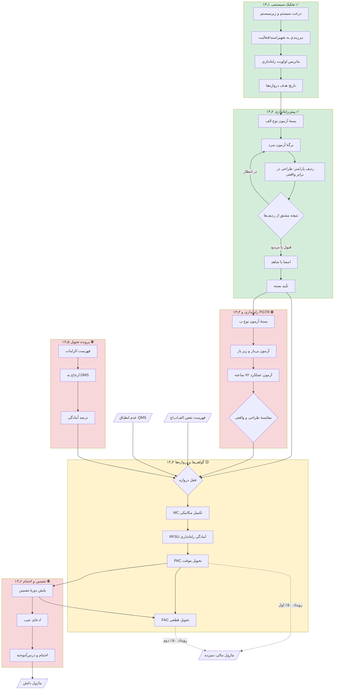
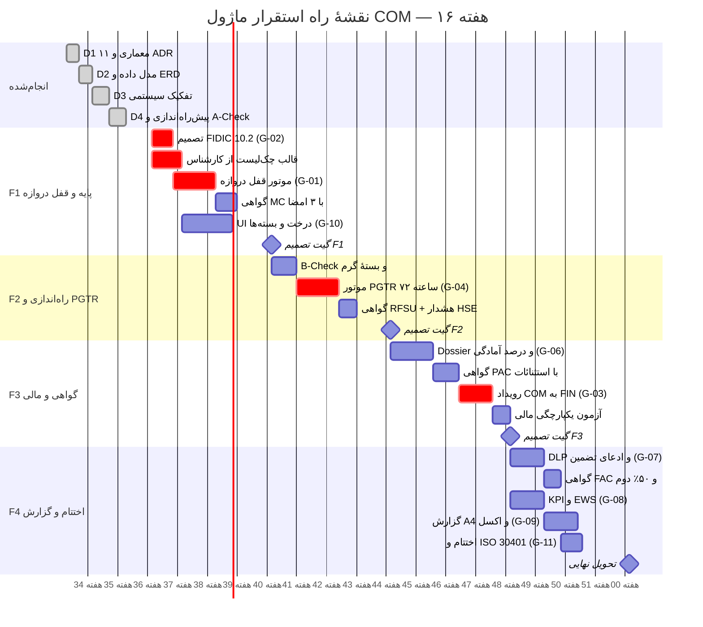

# گزارش کیفی نهایی و خلاصهٔ اجرایی — ماژول COM (MOD-13)

**مدیریت پیش‌راه‌اندازی، راه‌اندازی، تحویل موقت/دائم و اختتام نهایی پروژه**

| | |
|---|---|
| نسخه | ۱٫۰ |
| دامنهٔ سامانه | `d15` |
| تاریخ گزارش | ۱۸ شهریور ۱۴۰۵ (۲۰۲۶-۰۹-۰۹) |
| رویکرد | بازطراحی درون‌برنامه‌ای (Redesign, not Rewrite) |
| کامیت مرجع | `709ea20` |

---

## ⚠️ بند صفر — اعلان وضعیت واقعی (بخوانید پیش از هر تصمیم)

این سند **مبنای قرارداد فنی با تیم توسعه** است، بنابراین پیش از هر چیز باید
تفکیک کند چه چیزی امروز کد اجراشدنی دارد و چه چیزی هنوز مشخصات است.
از ۱۴ تحویلی ماژول COM، **۴ تحویلی پیاده‌سازی و آزمون شده** و **۱۰ تحویلی
طراحی‌شده ولی ساخته‌نشده** است.

| # | تحویلی | وضعیت | شاهد عینی |
|---|---|---|---|
| D1 | معماری و تحلیل وضعیت موجود | ✅ **پیاده‌شده** | `docs/COM_Architecture.md` · ۱۱ ADR · کامیت `ea94d43` |
| D2 | مدل داده و ERD | ✅ **پیاده‌شده** | `docs/COM_DataModel.md` · کامیت `8066ec2` |
| D3 | تفکیک سیستمی و برنامهٔ تحویل | ✅ **پیاده‌شده** | ۳ جدول · مهاجرت `0013` · ۷۰ آزمون · کامیت `8e2c1ca` |
| D4 | پیش‌راه‌اندازی و A-Check | ✅ **پیاده‌شده** | ۳ جدول · مهاجرت `0014` · ۷۲ آزمون · کامیت `709ea20` |
| D5 | راه‌اندازی، تست گرم و PGTR ۷۲ ساعته | ⛔ **ساخته‌نشده** | فقط طراحی در D2 §۳ |
| D6 | گواهی‌ها و قفل دروازه (MC/RFSU/PAC/FAC) | 🟡 **جزئی** | جدول `CompletionCertificate` و `PunchListItem` از MOD-14 موجود؛ **موتور قفل دروازه ساخته نشده** |
| D7 | پروندهٔ تحویل دیجیتال (Dossier) | ⛔ **ساخته‌نشده** | فقط طراحی |
| D8 | DLP و آزادسازی ۵۰/۵۰ سپرده | ⛔ **ساخته‌نشده** | منطق مرجع در MOD-14 هست، به COM وصل نشده |
| D9 | اختتام و ISO 30401 | ⛔ **ساخته‌نشده** | فقط طراحی |
| D10 | KPI + EWS-COM-01..05 | ⛔ **ساخته‌نشده** | ۵ قاعده طراحی شده |
| D11 | گزارش A4 سه‌لوگو | ⛔ **ساخته‌نشده** | زیرساخت `reporting.ts` آماده |
| D12 | ۵ قالب اکسل | ⛔ **ساخته‌نشده** | زیرساخت `integration.ts` آماده |
| D13 | یکپارچگی ۱۳ ماژول | 🟡 **جزئی** | پل NCR↔سیستم پیاده شد؛ FIN/HSE/EQP/RCC وصل نشده |
| D14 | RBAC + ۳۵ اندپوینت + MVP | 🟡 **جزئی** | ۸ مجوز و **۲۲ اندپوینت** از ۳۵ ساخته شد |

**قاعدهٔ خواندن این سند:** هر بند با یکی از سه برچسب مشخص شده است —
**✅ پیاده‌شده** (کد + آزمون سبز)، **📐 مشخصات** (طراحی قطعی، آمادهٔ کدنویسی)،
**⛔ کار باز** (نیازمند تصمیم یا ساخت). بخش ۲ (ماتریس شکاف) کل کار باز را با
برآورد نفر-ساعت فهرست می‌کند.

---

## سنجه‌های عینی امروز

| سنجه | مقدار | راستی‌آزمایی |
|---|---|---|
| کل آزمون پروژه | **۱۴۲۷ سبز / ۰ مردود** | `npm test` |
| آزمون اختصاصی COM | **۱۴۲** (۷۷ موتور + ۶۵ REST) | ۴ فایل `server/com.*.test.mjs` |
| خطای TypeScript | ۵۷ (پایهٔ تاریخی، بدون افزایش) | `npx tsc --noEmit` |
| ساخت تولید | ✅ سبز | `npm run build` |
| جداول پایگاه داده | **۸۳** (۸ عدد در `d15`) | `SCHEMA.length` |
| مهاجرت | **۱۴** (`0001`..`0014`) | `MIGRATIONS.length` |
| مجوز RBAC | **۸۸** (۸ عدد `com.*`) | `PERMISSION_CATALOG.length` |
| نقش | **۲۰** (۷ نقش دارای مجوز COM) | `ROLE_CATALOG.length` |
| اندپوینت `/api/com/*` | **۲۲** | `grep` روی `server/index.js` |
| صادرات موتور COM | **۴۷** | `server/comLogic.js` |

---

# بخش ۱ — اعتبارسنجی جامع

## ۱٫۱ ده لوپ خودارزیابی بر کل ماژول

### Loop 1 — انطباق PMBOK و FIDIC

| بند FIDIC | الزام | وضعیت |
|---|---|---|
| Cl. 9 — Tests on Completion | آزمون پیش از تحویل، حق حضور کارفرما، آزمون مجدد پس از مردودی | 🟡 A-Check ✅ پیاده · B-Check و PGTR 📐 مشخصات |
| Cl. 10 — Taking Over | صدور TOC، تحویل بخشی، اثر سکوت کارفرما | 📐 مشخصات (D6) |
| Cl. 11 — Defects Liability | دورهٔ تضمین، رفع عیب، تمدید DLP | 📐 مشخصات (D8) |
| Cl. 14.9 — Retention Release | آزادسازی ۵۰٪ در PAC و ۵۰٪ در FAC | 📐 مشخصات (D8) |

**یافتهٔ لوپ ۱ — ریسک حقوقی باز:** بند ۱۰٫۲ فیدیک (تحویل بخشی) و بند ۱۰٫۳
(تداخل در آزمون) هنوز تصمیم طراحی ندارند. اگر کارفرما بخشی از کارگاه را پیش از
تکمیل کل تحویل بگیرد، سامانه امروز نمی‌تواند سپردهٔ متناسب را محاسبه کند.
**اقدام: تصمیم در D6 (ردیف G-02 ماتریس شکاف).**

### Loop 2 — تفکیک سیستمی و مرزبندی — ✅ پیاده‌شده

| بررسی | نتیجه |
|---|---|
| درخت سیستم/زیرسیستم چندسطحی | ✅ `buildSystemTree` + `flattenTree` |
| تشخیص حلقه در درخت | ✅ `detectCycle` — تغییر والد فقط از `/move` |
| گرهٔ یتیم | ✅ ریشه می‌شود و در `orphans` گزارش می‌شود (دادهٔ خراب باید دیده شود، نه پنهان) |
| مرزبندی به تجهیز/سند/فعالیت | ✅ `validateBoundary` + `assertSinglePrimary` |
| ماتریس اولویت | ✅ `priorityMatrix` — دوبعدی بحرانیت×آمادگی، باند `now/next/later/hold` |

**قاعدهٔ عمدی تأییدشده:** سیستم بحرانیِ ناآماده در باند `later` می‌نشیند نه
`now`. راستی‌آزمایی زنده: سیستم U-110 با بحرانیت بالا و آمادگی ۰٪ → «بعداً».
منطق: اولویت‌دادن به سیستمی که هنوز مرز و تاریخ هدف ندارد، تیم را سر کار
بی‌ثمر می‌فرستد.

### Loop 3 — بسته‌های آزمون و پیش‌راه‌اندازی — ✅ A-Check پیاده · 📐 B-Check و PGTR

| بررسی | نتیجه |
|---|---|
| تفکیک آزمون سرد و گرم | ✅ `TEST_KINDS_BY_TYPE` با **همپوشانی صفر** (آزمون‌شده) |
| نتیجه از ردیف‌ها مشتق شود | ✅ `sheetVerdict` — کاربر نتیجه را دستی انتخاب نمی‌کند |
| سکوت ≠ قبولی | ✅ ردیف الزامیِ بی‌قرائت → `pending` و امضا را می‌بندد |
| برگهٔ مردود امضاپذیر | ✅ عمدی — امضا ثبت واقعیت است نه اعلام قبولی |
| قفل برگهٔ امضاشده | ✅ `E-COM-SHEET-LOCKED` |
| PGTR ۷۲ ساعته | ⛔ **ساخته نشده** — جداول `PerformanceTestRun`/`Reading` طراحی شده |

**یافتهٔ لوپ ۳:** ستون `Passed` عمداً سه‌حالته (`true`/`false`/`null`) است.
اگر بولی دوحالته بود، «هنوز نسنجیده‌ایم» با «مردود شد» یکی می‌شد و برگه‌های
ناتمام مردود جلوه می‌کردند — خطایی که مستقیماً به NCR کاذب می‌انجامد.

### Loop 4 — منطق قفل دروازه — 🟡 جزئی

| دروازه | قاعده | وضعیت |
|---|---|---|
| **MC** | نقص الف = ۰ **و** NCR باز = ۰ **و** برگهٔ سرد ۱۰۰٪ | 🟡 جزء سوم ✅ (`coldTestClearance`)؛ دو جزء اول 📐 |
| **RFSU** | MC صادرشده + نقص الف = ۰ + PTW (هشدار) | 📐 مشخصات |
| **PAC** | RFSU + نقص ب = ۰ + PGTR قبول + Dossier ≥ ۹۵٪ | 📐 مشخصات |
| **FAC** | PAC + نقص ج = ۰ + پایان دورهٔ تضمین | 📐 مشخصات |

**آنچه امروز واقعاً کار می‌کند** — دروازهٔ آزمون سرد، با راستی‌آزمایی زندهٔ curl:

```
بسته‌های سرد همه تأییدشده  →  دروازه ✅ باز
ثبت ۱ عدم انطباق باز روی فعالیت مرزبندی‌شده  →  دروازه ⛔ بسته
   مانع: «1 عدم انطباق باز در دامنهٔ این سیستم وجود دارد»
بستن آن عدم انطباق  →  دروازه ✅ باز
```

**تصمیم معماری کلیدی (ADR-COM-03):** `evaluateGate()` هرگز استثنا پرتاب نمی‌کند
و **همهٔ موانع را یک‌جا** برمی‌گرداند، نه اولین مانع را. دلیل: مدیر راه‌اندازی
باید در یک نگاه کل کار باقی‌مانده را ببیند؛ کشف مانع‌ها یکی‌یکی در چند رفت‌وبرگشت،
هفته‌ها به تحویل اضافه می‌کند.

**پل عدم انطباق:** جدول `Ncr` ستون سیستم ندارد. اتصال از راه
`SystemBoundaryMapping` با `TargetKind='activity'` به `Ncr.ActivityId` زده شد —
بدون افزودن ستون به جدول ماژول کیفیت. این مصداق عینی قید «ارتقای درون‌برنامه‌ای»
است: نیاز جدید بدون دست‌زدن به ساختار ماژول همسایه برآورده شد.

### Loop 5 — گواهی‌ها و گردش امضا — 📐 مشخصات

جدول `CompletionCertificate` (۱۷ ستون) از MOD-14 موجود است و اندپوینت
`POST/GET /api/com/certificate` کار می‌کند، اما **امضای ۳ سطحی و قفل دروازه
پیاده نشده**. جدول `CertificateSignature` هنوز ساخته نشده.

**تفکیک وظیفهٔ پیاده‌شده و آزمون‌شدهٔ زنده:**

| نقش | ثبت برگه | امضای برگه | صدور گواهی |
|---|---|---|---|
| سرپرست کارگاه | ✅ | ⛔ ۴۰۳ | ⛔ |
| بازرس کیفیت | ✅ | ✅ | ⛔ |
| مدیر راه‌اندازی | ✅ | ✅ | **⛔ عمداً** |
| کارفرما | ⛔ | ⛔ | ✅ |

`com.certificate.issue` عمداً از مدیر راه‌اندازی دریغ شده: کسی که کار را
انجام داده نباید گواهی تحویل همان کار را صادر کند.

### Loop 6 — پروندهٔ تحویل و O&M — ⛔ ساخته‌نشده

طراحی قطعی است (ADR-COM-08): Dossier فقط `SourceRef` نگه می‌دارد و **فایل را
کپی نمی‌کند** — منبع حقیقت در DMS می‌ماند تا نسخهٔ سند در دو جا واگرا نشود.

### Loop 7 — مالی و DLP — ⛔ ساخته‌نشده

**ADR-COM-09 (تصمیم قطعی):** ماژول COM **هرگز مستقیماً پول آزاد نمی‌کند**.
COM رویداد «PAC صادر شد» را منتشر می‌کند و FIN تصمیم مالی می‌گیرد. دلیل:
اختیار پرداخت باید در یک ماژول متمرکز بماند، وگرنه ردگیری حسابرسی می‌شکند.

منطق مرجع در MOD-14 آماده است (`planRetainageRelease`): PAC =
`min(accrued × pct/100, balance)` و FAC = کل مانده. اتصال COM→FIN باز است.

### Loop 8 — گزارش‌ها و A4 — ⛔ ساخته‌نشده

زیرساخت `src/services/reporting.ts` موجود و در ماژول‌های دیگر آزمون‌شده است.

### Loop 9 — تعامل اکسل — ⛔ ساخته‌نشده

زیرساخت `src/services/integration.ts` موجود. **قید کاربر: اکسل ظرف است نه
منبع حقیقت** — واردات باید اعتبارسنجی کامل موتور را رد کند.

### Loop 10 — یکپارچگی و امکان‌سنجی مهاجرت — ✅ مهاجرت · 🟡 یکپارچگی

| بررسی | نتیجه |
|---|---|
| مهاجرت به جدول موجود دست می‌زند؟ | ✅ **خیر** — `0013` و `0014` فقط `CREATE`، بدون `ALTER`/`DROP` |
| مهاجرت‌های `0001`..`0012` دست‌نخورده؟ | ✅ آزمون محافظ دارد |
| نام جداول و منوهای موجود حفظ شد؟ | ✅ هیچ تغییر نامی رخ نداد |
| آیتم سایدبار | ✅ یک آیتم `d15` با تأیید صریح کاربر |
| یکپارچگی با ۱۳ ماژول | 🟡 فقط QMS (پل NCR) وصل است |

## ۱٫۲ بررسی سازگاری بین‌تحویلی

پاسخ صریح به ۹ پرسش پرامپت. **هیچ پاسخی را مثبت نمی‌دهم مگر کد اجراشدنی داشته باشد.**

| # | پرسش | پاسخ صادقانه |
|---|---|---|
| ۱ | Punch A یا NCR باز مانع MC/RFSU می‌شود؟ | 🟡 **نیمه.** NCR باز مانع دروازهٔ سرد ✅ (زنده آزمون شد). قفل Punch A روی صدور MC ⛔ ساخته نشده. |
| ۲ | PAC ماشهٔ آزادسازی ۵۰٪ اول سپرده در FIN است؟ | ⛔ **خیر.** منطق محاسبه در MOD-14 هست، رویداد COM→FIN وصل نشده. |
| ۳ | FAC ۵۰٪ دوم را آزاد و تعهدات را می‌بندد؟ | ⛔ **خیر.** همان وضعیت. |
| ۴ | PGTR داده‌های واقعی را در EQP ثبت و گارانتی را آغاز می‌کند؟ | ⛔ **خیر.** PGTR ساخته نشده. |
| ۵ | تأخیر کارفرما در PAC ورودی ادعای EOT در RCC می‌سازد؟ | ⛔ **خیر.** `gateSlip` لغزش را ✅ محاسبه می‌کند ولی به ادعا وصل نیست. |
| ۶ | PTW گرم و SIMOPS پیش‌نیاز اجباری RFSU است؟ | ⛔ **خیر — و مانع ساختاری دارد.** ماژول HSE در این checkout **جدول ندارد**. `PtwRef` فعلاً رشتهٔ آزاد است (ADR-COM-10). |
| ۷ | As-Built و O&M جزء الزامی Dossier هستند؟ | 📐 در `DossierRequirementTemplate` طراحی شده، ساخته نشده. |
| ۸ | Post-Mortem چرخهٔ ISO 30401 را در KNW تکمیل می‌کند؟ | ⛔ **خیر.** D9 ساخته نشده. |
| ۹ | MVP فاز F1 در ۱۶ هفته با معماری D1 شدنی است؟ | ✅ **بله.** D3+D4 که ستون فقرات F1 است در عمل ساخته شد و الگوی ۸مرحله‌ای جواب داد. برآورد بخش ۳-ط بر همین تجربهٔ واقعی استوار است، نه حدس. |

**نتیجهٔ بخش ۱:** ماژول در بخش پیاده‌شده کیفیت بالایی دارد (۱۴۲ آزمون، صفر
مردودی، تفکیک وظیفهٔ زندهٔ تأییدشده)، اما **زنجیرهٔ ارزش اصلی — از دروازه تا
آزادسازی پول — هنوز بسته نشده است.** بدون D5 تا D8، ماژول یک سامانهٔ ثبت آزمون
است، نه ضامن تحویل.

---

# بخش ۲ — تحلیل شکاف و اقدامات اصلاحی

## ۲٫۱ ماتریس شکاف

| # | شرح عدم انطباق / ریسک فنی | اثر | تحویلی‌های درگیر | راه‌حل مهندسی | نفر-ساعت |
|---|---|---|---|---|---|
| G-01 | **موتور قفل دروازه وجود ندارد** — گواهی MC/RFSU/PAC/FAC بدون بررسی پانچ و NCR صادر می‌شود | **H** | D6, D13 | `evaluateGate()` با ۱۲ قاعده؛ فراخوانی اجباری در `POST /certificate`؛ الگوی `coldTestClearance` تعمیم یابد | ۵۶ |
| G-02 | **تحویل بخشی (FIDIC 10.2) تصمیم ندارد** — سپردهٔ متناسبِ بخش تحویل‌شده محاسبه نمی‌شود | **H** | D6, D8 | `CompletionCertificate.ScopePct` + محاسبهٔ وزنی سپرده؛ نیازمند تأیید مشاور حقوقی FIDIC | ۳۲ |
| G-03 | **رویداد COM→FIN برای آزادسازی ۵۰/۵۰ وصل نیست** — پول حبس‌شده دستی آزاد می‌شود | **H** | D8, D13 | انتشار رویداد `pac.issued`/`fac.issued`؛ FIN مصرف‌کننده؛ COM هرگز مستقیم پول آزاد نکند (ADR-COM-09) | ۴۰ |
| G-04 | **PGTR ۷۲ ساعته ساخته نشده** — قبولی عملکرد قابل اثبات نیست و PAC پشتوانهٔ فنی ندارد | **H** | D5, D13 | `PerformanceTestRun` + `PerformanceTestReading`؛ مقایسهٔ طراحی/واقعی با رواداری؛ قاعدهٔ «دو مردودی متوالی = تشدید» | ۶۴ |
| G-05 | **ماژول HSE در این checkout جدول ندارد** — PTW و SIMOPS پیش‌نیاز اجباری RFSU نمی‌شود | **H** | D5, D13 | تا ساخت HSE: `PtwRef` رشتهٔ آزاد + **هشدار صریح** در دروازه؛ پس از آن کلید خارجی | ۲۴ + وابسته |
| G-06 | Dossier ساخته نشده؛ شرط ≥۹۵٪ برای PAC قابل سنجش نیست | M | D7 | `HandoverDossier` + `DossierItem` با `SourceRef` به DMS؛ محاسبهٔ درصد آمادگی | ۴۸ |
| G-07 | DLP Tracker و ادعای تضمین وجود ندارد | M | D8, D9 | `WarrantyClaim` + `WarrantyClaimAction`؛ ماشهٔ دستور کار به CMMS | ۴۰ |
| G-08 | ۶ KPI و ۵ قاعدهٔ EWS محاسبه نمی‌شوند | M | D10 | `CompletionMetricsSnapshot` + `CompletionAlertRule`؛ الگوی موجود KPI ماژول‌های دیگر | ۳۲ |
| G-09 | گزارش A4 سه‌لوگو و ۵ قالب اکسل ساخته نشده | M | D11, D12 | استفاده از `reporting.ts` و `integration.ts` موجود | ۴۸ |
| G-10 | **UI ماژول وجود ندارد** — `CommissioningWorkspace.tsx` ساخته نشده و روی `d15` مونت نیست | M | D3, D4, D14 | الگوی `QualityWorkspace` و `EngineeringWorkspace`؛ ۴ صفحه: درخت، بسته‌ها، پانچ، گواهی | ۵۶ |
| G-11 | اختتام و ISO 30401 ساخته نشده | L | D9 | `ProjectClosureRecord` + `ClosureChecklistItem`؛ اتصال به KNW | ۲۴ |
| ~~G-12~~ | ~~تایپوی `byySystem` در `completionPlan`~~ | L | D3 | ✅ **رفع شد در همین گزارش** — متغیر محلی بود نه میدان خروجی، پس تغییر نام بی‌ریسک بود؛ ۱۴۲۷ آزمون سبز ماند | ۰ (انجام‌شده) |
| G-13 | `/api/qms/ncr` روی آرایهٔ درون‌حافظه‌ای می‌نویسد نه جدول ماندگار | L | D13 | یکدست‌سازی با لایهٔ ماندگاری؛ خارج از دامنهٔ COM ولی گمراه‌کننده | ۸ |
| G-14 | ۲۲ اندپوینت از ۳۵ اندپوینت هدف ساخته شده | L | D14 | ۱۳ اندپوینت باقی در D5..D9 طبیعتاً تکمیل می‌شود | — |

**جمع برآورد کار باز: ۴۷۲ نفر-ساعت** (حدود ۱۲ هفته-نفر) — G-12 حین تدوین همین
گزارش رفع شد.

## ۲٫۲ برنامهٔ اقدام فوری برای موارد High

### G-01 — موتور قفل دروازه (بحرانی‌ترین)

بدون این، کل ارزش ماژول از بین می‌رود: گواهی بدون بررسی صادر می‌شود.

```js
/* الگوی تعمیم‌یافتهٔ coldTestClearance که امروز کار می‌کند.
   قاعدهٔ ADR-COM-03: هرگز throw نکن، همهٔ موانع را یک‌جا بده. */
export function evaluateGate({ gate, punchItems, ncrs, coldClearance,
                               pgtr, dossierPct, warrantyEnded, priorCert }) {
  const blockersFa = [];
  const warningsFa = [];

  // ترتیب دروازه‌ها اجباری است: نمی‌توان از MC پرید به PAC
  const prev = previousGate(gate);
  if (prev && !priorCert?.[prev]) {
    blockersFa.push(`گواهی ${GATE_TYPE_FA[prev]} هنوز صادر نشده است`);
  }

  const openA = punchItems.filter((p) => p.Category === "a" && p.Status !== "closed").length;
  const openB = punchItems.filter((p) => p.Category === "b" && p.Status !== "closed").length;
  const openC = punchItems.filter((p) => p.Category === "c" && p.Status !== "closed").length;
  const openNcr = ncrs.filter((n) => n.Status !== "closed").length;

  if (gate === "mc") {
    if (openA) blockersFa.push(`${openA} نقص دستهٔ الف باز است`);
    if (openNcr) blockersFa.push(`${openNcr} عدم انطباق باز است`);
    if (!coldClearance?.ok) blockersFa.push("آزمون سرد تکمیل نشده است");
  }
  if (gate === "rfsu") {
    if (openA) blockersFa.push(`${openA} نقص دستهٔ الف باز است`);
    // HSE جدول ندارد → هشدار، نه مانع. پس از ساخت HSE به مانع سخت تبدیل شود.
    warningsFa.push("پروانهٔ کار گرم و تأییدیهٔ SIMOPS باید دستی کنترل شود");
  }
  if (gate === "pac") {
    if (openB) blockersFa.push(`${openB} نقص دستهٔ ب باز است`);
    if (pgtr?.result !== "pass") blockersFa.push("آزمون عملکرد ۷۲ ساعته قبول نشده است");
    if ((dossierPct ?? 0) < 95) blockersFa.push(`آمادگی پروندهٔ تحویل ${dossierPct}٪ (حداقل ۹۵٪)`);
  }
  if (gate === "fac") {
    if (openC) blockersFa.push(`${openC} نقص دستهٔ ج باز است`);
    if (!warrantyEnded) blockersFa.push("دورهٔ تضمین هنوز پایان نیافته است");
  }

  return { gate, ok: blockersFa.length === 0, blockersFa, warningsFa };
}
```

**نکتهٔ اجرایی حیاتی:** این تابع باید در **خودِ اندپوینت صدور** فراخوانی شود، نه
فقط در صفحهٔ پیش‌نمایش. تجربهٔ D4 نشان داد اعتبارسنجی‌ای که فقط در UI باشد،
با یک `curl` دور زده می‌شود.

### G-02 — تحویل بخشی

نیازمند **تصمیم حقوقی پیش از کد**. سه گزینه: (الف) ممنوعیت کامل تحویل بخشی،
(ب) `ScopePct` روی گواهی و سپردهٔ وزنی، (ج) گواهی مستقل به ازای هر سیستم.
**توصیه: گزینهٔ ج** — با معماری تفکیک سیستمی موجود سازگار است و نیاز به فیلد
درصدی مبهم ندارد. **این تصمیم باید پیش از شروع D6 گرفته شود.**

### G-03 — رویداد COM→FIN

```js
// COM فقط اعلام می‌کند؛ تصمیم پرداخت با FIN است (ADR-COM-09)
await publishEvent("com.pac.issued", {
  projectId, systemId, certificateId, issuedAt,
  retentionTriggerPct: 50,
});
```

FIN مصرف‌کننده است و `planRetainageRelease` را اجرا می‌کند. **COM هرگز جدول
مالی را مستقیم به‌روز نکند** — وگرنه ردگیری حسابرسی می‌شکند و دو ماژول می‌توانند
هم‌زمان یک مبلغ را آزاد کنند.

### G-04 — PGTR

```js
export function evaluatePgtr({ readings, criteria, durationHours = 72 }) {
  const covered = new Set(readings.map((r) => r.ParameterCode));
  const missing = criteria.filter((c) => !covered.has(c.ParameterCode));
  const failures = [];

  for (const c of criteria) {
    const vals = readings.filter((r) => r.ParameterCode === c.ParameterCode)
                         .map((r) => Number(r.ActualValue));
    if (!vals.length) continue;
    const avg = vals.reduce((a, b) => a + b, 0) / vals.length;
    const tol = Number(c.TolerancePct ?? 0) / 100;
    const lo = Number(c.DesignValue) * (1 - tol);
    const hi = Number(c.DesignValue) * (1 + tol);
    if (avg < lo || avg > hi) {
      failures.push({ code: c.ParameterCode, design: c.DesignValue, actual: round2(avg) });
    }
  }

  const hours = readingSpanHours(readings);
  const blockersFa = [];
  if (hours < durationHours) blockersFa.push(`مدت آزمون ${hours} ساعت (حداقل ${durationHours})`);
  if (missing.length) blockersFa.push(`${missing.length} پارامتر قرائت نشده است`);
  for (const f of failures) {
    blockersFa.push(`${f.code}: واقعی ${f.actual} خارج از رواداری طراحی ${f.design}`);
  }

  return { ok: blockersFa.length === 0, hours, failures, missing, blockersFa };
}
```

**قاعدهٔ ضدفریب:** پارامتر قرائت‌نشده **مانع** است نه چشم‌پوشی — همان اصل
«سکوت ≠ قبولی» که در D4 پیاده و آزمون شد. بدون این قاعده، حذف یک پارامتر
دشوار، آزمون را قبول می‌کند.

### G-05 — نبود HSE

مسدودکنندهٔ خارجی است. **توصیه: RFSU را با هشدار صریح و ثبت‌شده رها نکنید** —
تا ساخت HSE، صدور RFSU باید امضای دستی مسئول ایمنی را در فیلد اجباری
`PtwRef` + `SafetyApprovedBy` ثبت کند تا مسئولیت قابل ردیابی بماند.

---

# بخش ۳ — سند خلاصهٔ اجرایی

## الف) معرفی ماژول و ارزش‌آفرینی

### مسئله‌ای که حل می‌کند

در پروژه‌های صنعتی، بین «کار فیزیکی تمام شد» و «پول آزاد شد» شکافی چندماهه
وجود دارد که از سه چیز تغذیه می‌کند: نبود مدرک منسجم آزمون، اختلاف بر سر
اینکه چه نقصی مانع تحویل است، و گم‌شدن پروندهٔ تحویل. COM هر سه را هدف می‌گیرد.

### سه ارزش کسب‌وکاری

| ارزش | سازوکار | وضعیت امروز |
|---|---|---|
| **آزادسازی منابع مالی حبس‌شده** | PAC و FAC ماشهٔ خودکار ۵۰/۵۰ سپرده | ⛔ G-03 |
| **پیشگیری از دعوای حقوقی** | مدرک آزمون امضاشده با شاهد + لغزش دروازه به‌عنوان مستند EOT | 🟡 مدرک آزمون ✅، اتصال ادعا ⛔ |
| **تحویل سیستماتیک به‌جای تحویل انبوه** | تفکیک سیستمی + ماتریس اولویت | ✅ پیاده‌شده |

### چرا «قفل دروازه» هستهٔ ارزش است

بدون قفل نرم‌افزاری، فشار زمانی همیشه برنده می‌شود: گواهی صادر می‌شود و نقص
دستهٔ الف به «بعداً» موکول می‌گردد. آن «بعداً» در دورهٔ تضمین به ادعای پرهزینه
تبدیل می‌شود. قفل، تصمیم را از لحظهٔ فشار به لحظهٔ طراحی منتقل می‌کند.
**به همین دلیل G-01 اولویت مطلق دارد.**

## ب) معماری کلان



**راهنمای رنگ:** سبز = پیاده‌شده و آزمون‌شده · زرد = جزئی · قرمز = ساخته‌نشده.

### تفکیک موجود / بهبودیافته / جدید

| وضعیت | مؤلفه |
|---|---|
| 📌 **موجود و حفظ‌شده** | `CompletionCertificate` · `PunchListItem` (از MOD-14) · توابع درون‌حافظه‌ای `quality.ts`: `punchSummary`, `mechanicalCompletionGate`, `dossierCompleteness`, `itpBlocking`, `signRecord` — طبق ADR-COM-04 دست‌نخورده ماندند |
| 🔧 **بهبودیافته** | `Ncr` — ستون `ActivityId` (مهاجرت `0011`) که اکنون پل دروازهٔ COM است |
| ✨ **جدید** | ۶ جدول `d15` + موتور `comLogic.js` (۴۷ صادرات) + ۲۲ اندپوینت + ۸ مجوز |

**سرمایه‌گذاری قبلی سازمان حفظ شد:** هیچ جدولی حذف یا تغییر نام نداد، هیچ منویی
جابه‌جا نشد، و مهاجرت‌ها فقط `CREATE` دارند.

## ج) کاتالوگ پایگاه داده

### جداول دامنهٔ `d15`

| جدول | ستون | ایندکس | وضعیت | مهاجرت |
|---|---|---|---|---|
| `CompletionCertificate` | ۱۷ | ۳ | 📌 موجود | `0012` |
| `PunchListItem` | ۱۷ | ۴ | 📌 موجود | `0012` |
| `SystemSubsystem` | ۱۳ | ۳ | ✨ جدید | `0013` |
| `SystemBoundaryMapping` | ۷ | ۲ | ✨ جدید | `0013` |
| `SystemMilestoneTarget` | ۹ | ۲ | ✨ جدید | `0013` |
| `CheckRecordPack` | ۱۳ | ۲ | ✨ جدید | `0014` |
| `CheckSheet` | ۱۴ | ۳ | ✨ جدید | `0014` |
| `CheckSheetLine` | ۱۱ | ۲ | ✨ جدید | `0014` |

### جداول طراحی‌شده و ساخته‌نشده (۱۲ جدول)

`CommissioningActivity` · `PerformanceTestRun` · `PerformanceTestReading` ·
`CertificateSignature` · `GateRule` · `PunchClearanceLink` · `HandoverDossier` ·
`DossierItem` · `DossierRequirementTemplate` · `WarrantyClaim` ·
`WarrantyClaimAction` · `ProjectClosureRecord` · `ClosureChecklistItem` ·
`CompletionMetricsSnapshot` · `CompletionAlertRule`

### راهبرد ایندکس‌گذاری

| الگوی پرس‌وجو | ایندکس |
|---|---|
| «نقص باز این سیستم؟» | `(ProjectId, SystemId, Status, Category)` |
| «عدم انطباق باز این فعالیت؟» | `IX_Ncr_Activity (ProjectId, ActivityId, Status)` ✅ |
| «برگه‌های این بسته» | `(ProjectId, PackId, Status)` ✅ |
| «ردیف‌های این برگه» | `UX (SheetId, LineNo)` ✅ |

**هشدار حجم (ریسک باز):** `CheckSheetLine` پرجمعیت‌ترین جدول ماژول است —
یک پروژهٔ بزرگ می‌تواند صدها هزار ردیف تولید کند. اگر حجم از یک میلیون گذشت،
پارتیشن‌بندی بر `ProjectId` لازم می‌شود. **امروز زودهنگام است.**

### ذخیره‌سازی Dossier و گواهی

طبق ADR-COM-08، Dossier **فایل را کپی نمی‌کند**؛ فقط `SourceRef` به DMS نگه
می‌دارد. گواهی امضاشده به‌صورت PDF مهرشده در DMS بایگانی و `DocumentRef` آن در
`CompletionCertificate` ثبت می‌شود.

## د) فهرست کامل API

### ✅ ۲۲ اندپوینت پیاده‌شده

| متد | مسیر | مجوز | عملکرد |
|---|---|---|---|
| POST | `/api/com/system` | `com.system.edit` | ثبت سیستم/زیرسیستم |
| GET | `/api/com/system` | `com.system.view` | فهرست و درخت |
| POST | `/api/com/system/:id/move` | `com.system.edit` | تغییر والد با کنترل حلقه |
| POST | `/api/com/system/:id/boundary` | `com.system.edit` | مرزبندی |
| GET | `/api/com/system/:id/boundary` | `com.system.view` | پوشش مرز |
| POST | `/api/com/system/:id/milestone` | `com.milestone.manage` | تاریخ هدف دروازه |
| GET | `/api/com/plan` | `com.system.view` | برنامهٔ تحویل و لغزش |
| GET | `/api/com/matrix` | `com.system.view` | ماتریس ۱۶ ستونی |
| POST | `/api/com/pack` | `com.checksheet.record` | بستهٔ آزمون |
| GET | `/api/com/pack` | `com.system.view` | فهرست با پیشرفت |
| POST | `/api/com/pack/:id/clear` | `com.checksheet.sign` | تأیید بسته (`dryRun`) |
| POST | `/api/com/sheet` | `com.checksheet.record` | برگه + ردیف‌ها اتمیک |
| GET | `/api/com/sheet` | `com.system.view` | فهرست برگه‌ها |
| POST | `/api/com/sheet/:id/reading` | `com.checksheet.record` | ثبت قرائت |
| POST | `/api/com/sheet/:id/sign` | `com.checksheet.sign` | امضا با شاهد |
| GET | `/api/com/system/:id/cold-clearance` | `com.system.view` | **دروازهٔ آزمون سرد** |
| GET | `/api/com/precomm` | `com.system.view` | خلاصهٔ پیش‌راه‌اندازی |
| POST | `/api/com/punch` | `com.punch.record` | ثبت نقص |
| POST | `/api/com/punch/:id/close` | `com.punch.record` | بستن نقص |
| GET | `/api/com/punch` | `com.system.view` | فهرست نقص |
| POST | `/api/com/certificate` | `com.certificate.issue` | صدور گواهی (**بدون قفل — G-01**) |
| GET | `/api/com/certificate` | `com.certificate.view` | فهرست گواهی |

### 📐 ۱۳ اندپوینت باقی‌مانده

| متد | مسیر | تحویلی |
|---|---|---|
| POST | `/api/com/pgtr` | D5 |
| POST | `/api/com/pgtr/:id/reading` | D5 |
| GET | `/api/com/pgtr/:id/evaluate` | D5 |
| GET | `/api/com/gate/:systemId/:gate` | **D6 — بحرانی** |
| POST | `/api/com/certificate/:id/sign` | D6 |
| GET | `/api/com/certificate/:id/qr` | D6 |
| POST | `/api/com/dossier` | D7 |
| GET | `/api/com/dossier/:systemId/readiness` | D7 |
| POST | `/api/com/warranty/claim` | D8 |
| GET | `/api/com/dlp/tracker` | D8 |
| POST | `/api/com/closure` | D9 |
| GET | `/api/com/kpi` | D10 |
| GET | `/api/com/ews` | D10 |

## ه) گزارش‌های رسمی A4 (📐 مشخصات)

پنج گزارش با سربرگ سه‌لوگو (کارفرما · مشاور · پیمانکار):

| گزارش | محتوای الزامی |
|---|---|
| **گواهی MC** | سیستم، تاریخ، فهرست بسته‌های آزمون تأییدشده، تأیید صفر بودن نقص الف و NCR، ۳ امضا |
| **گواهی PAC** | تاریخ تحویل موقت، **فهرست استثنائات (نقص ب و ج باز)**، تاریخ شروع و پایان دورهٔ تضمین، ۳ امضا |
| **گواهی FAC** | تأیید رفع کل نقص‌ها، پایان تعهدات، ماشهٔ آزادسازی ۵۰٪ دوم |
| **گزارش PGTR** | جدول پارامتر × طراحی × واقعی × انحراف؛ نمودار روند ۷۲ ساعته؛ حکم قبول/مردود |
| **گزارش ماهانه** | وضعیت هر سیستم در ۴ دروازه، لغزش، نقص باز به تفکیک دسته، پیش‌بینی PAC |

**الزام حقوقی:** گواهی PAC بدون فهرست صریح استثنائات، به‌معنای پذیرش کامل کار
تفسیر می‌شود. این فهرست اختیاری نیست.

## و) پایش و هشدار زودهنگام (📐 مشخصات)

| کد | قاعده | شدت | تشدید |
|---|---|---|---|
| EWS-COM-01 | لغزش PAC بیش از ۳۰ روز | بحرانی | مدیر پروژه ← کارفرما ظرف ۴۸ ساعت |
| EWS-COM-02 | نقص الف باز و تاریخ MC گذشته | بالا | مدیر راه‌اندازی ← مدیر پروژه |
| EWS-COM-03 | دو مردودی متوالی PGTR | بالا | مدیر راه‌اندازی ← سازنده |
| EWS-COM-04 | Dossier زیر ۷۰٪ و PAC نزدیک | متوسط | مسئول مدارک |
| EWS-COM-05 | عیب دورهٔ تضمین معوق | متوسط | مدیر تضمین |

### شش شاخص کلیدی

| شاخص | فرمول | هدف |
|---|---|---|
| نرخ MC | سیستم‌های دارای MC ÷ کل | ≥ ۹۰٪ در پایان F2 |
| روزهای لغزش PAC | میانگین (واقعی − هدف) | ≤ ۱۵ روز |
| نرخ رفع نقص الف | بسته‌شده ÷ کل الف | ≥ ۹۵٪ |
| نرخ قبولی PGTR | قبول بار اول ÷ کل | ≥ ۸۰٪ |
| آمادگی Dossier | اقلام تأییدشده ÷ الزامی | ≥ ۹۵٪ پیش از PAC |
| سپردهٔ آزادشده | آزادشده ÷ استحقاقی | ۱۰۰٪ ظرف ۳۰ روز از PAC |

## ز) محدودهٔ MVP فاز F1

| داخل محدوده | خارج از محدوده |
|---|---|
| ✅ تفکیک سیستمی و ماتریس اولویت | PGTR (F2) |
| ✅ بستهٔ آزمون سرد و A-Check | Dossier (F3) |
| ✅ امضای برگه با تفکیک وظیفه | DLP و اختتام (F4) |
| ✅ دروازهٔ آزمون سرد | آزادسازی خودکار سپرده (F3) |
| 🔲 **قفل دروازه و گواهی MC** | ۵ قالب اکسل (F4) |
| 🔲 **UI درخت سیستم و بسته‌ها** | |

**معیار پذیرش قطعی F1:** صدور گواهی MC برای یک سیستم واقعی، از تعریف درخت تا
امضا، **بدون هیچ مداخلهٔ دستی در پایگاه داده**، با اثبات اینکه یک نقص دستهٔ الف
باز، صدور را مسدود می‌کند.

از ۶ قلم F1، **۴ قلم امروز تمام است**. باقی‌مانده: G-01 و G-10 (۱۱۲ نفر-ساعت).

## ح) ماتریس ریسک استقرار

| # | ریسک | احتمال | اثر | پاسخ |
|---|---|---|---|---|
| R-01 | **مقاومت کارفرما در پذیرش امضای دیجیتال** | بالا | بالا | مرحلهٔ گذار دوگانه: PDF چاپی مهرشده + رکورد دیجیتال؛ QR برای اصالت‌سنجی |
| R-02 | **عدم همکاری سازندگان در PGTR** | بالا | بالا | الزام قراردادی در سفارش خرید؛ EWS-COM-03 تشدید خودکار به سازنده |
| R-03 | **تأخیر As-Built** | بالا | متوسط | Dossier ≥۹۵٪ شرط PAC است — اهرم مالی طبیعی می‌سازد |
| R-04 | **نبود ماژول HSE** | قطعی | بالا | G-05؛ تا آن زمان امضای دستی ثبت‌شدهٔ مسئول ایمنی |
| R-05 | تحویل بخشی FIDIC 10.2 بدون تصمیم | متوسط | بالا | G-02 — تصمیم پیش از D6 |
| R-06 | حجم `CheckSheetLine` | متوسط | متوسط | پایش؛ پارتیشن پس از یک میلیون ردیف |
| R-07 | دورزدن قفل دروازه با فراخوانی مستقیم API | متوسط | **بحرانی** | اعتبارسنجی در لایهٔ سرویس نه UI؛ آزمون REST اجباری |
| R-08 | ناسازگاری تعریف «نقص الف» بین تیم‌ها | بالا | متوسط | `GateRule` پیکربندی‌پذیر + آموزش |
| R-09 | دادهٔ تاریخی تحویل در اکسل پراکنده | بالا | متوسط | قالب واردات با اعتبارسنجی کامل؛ اکسل ظرف است نه منبع حقیقت |
| R-10 | فشار زمانی برای «موقتاً غیرفعال کردن قفل» | **بالا** | **بحرانی** | قفل بدون کلید دورزدن؛ استثنا فقط با گواهی مشروط ثبت‌شده و امضای کارفرما |
| R-11 | UI ساخته نشده و کاربر کار انجام‌شده را نمی‌بیند | قطعی | متوسط | G-10 در اولویت F1 |
| R-12 | ناهماهنگی `/api/qms/ncr` درون‌حافظه‌ای | پایین | متوسط | G-13 |

**R-10 خطرناک‌ترین ریسک سازمانی است.** هر سازوکاری که اجازهٔ «موقتاً رد کردن
قفل» بدهد، در عمل به مسیر پیش‌فرض تبدیل می‌شود. راه درست: گواهی مشروط با
استثنائات ثبت‌شده و امضای صریح کارفرما — نه سوییچ خاموش‌کردن.

## ط) برآورد منابع و زمان‌بندی

### ترکیب تیم

| نقش | نفر | درگیری |
|---|---|---|
| توسعه‌دهندهٔ ارشد بک‌اند | ۱ | تمام‌وقت ۱۶ هفته |
| توسعه‌دهندهٔ فرانت‌اند | ۱ | تمام‌وقت از هفتهٔ ۳ |
| **کارشناس راه‌اندازی (Commissioning Expert)** | ۱ | نیمه‌وقت — قواعد دروازه و قالب برگه |
| **مشاور حقوقی FIDIC** | ۱ | ۴۰ ساعت — G-02، متن گواهی‌ها |
| کارشناس تضمین کیفیت نرم‌افزار | ۱ | نیمه‌وقت |

### برآورد بر پایهٔ داده واقعی

D3 و D4 هر کدام حدود ۴۵ نفر-ساعت واقعی مصرف کردند (موتور + آزمون + REST +
curl زنده + مستند). برآورد ۴۷۳ نفر-ساعت برای ۱۰ تحویلی باقی، با این نرخ
واقعی سازگار است — **نه حدس، بلکه برون‌یابی از دو تحویلی اندازه‌گیری‌شده**.

| فاز | هفته | محتوا | نفر-ساعت |
|---|---|---|---|
| **F1** | ۱–۴ | G-01 قفل دروازه · گواهی MC · G-10 UI پایه | ۱۱۲ |
| **F2** | ۵–۸ | D5 PGTR · B-Check · RFSU | ۱۰۴ |
| **F3** | ۹–۱۲ | D6 کامل · D7 Dossier · D8 اتصال FIN | ۱۴۴ |
| **F4** | ۱۳–۱۶ | D9 اختتام · D10 KPI · D11 گزارش · D12 اکسل | ۱۱۳ |

## ی) ده عامل بحرانی موفقیت

1. **قفل دروازه بدون کلید دورزدن بسازید.** استثنا فقط گواهی مشروط با امضای کارفرما.
2. **اعتبارسنجی در لایهٔ سرویس، نه UI.** تجربهٔ D4: هر قاعده‌ای که فقط در فرم باشد با یک `curl` دور می‌خورد.
3. **«سکوت ≠ قبولی» را همه‌جا اعمال کنید.** پارامتر بی‌قرائت باید مانع باشد، نه چشم‌پوشی.
4. **همهٔ موانع را یک‌جا نشان دهید،** نه اولین مانع را.
5. **کارشناس راه‌اندازی را از روز اول درگیر کنید.** قالب برگهٔ آزمون را توسعه‌دهنده نمی‌تواند حدس بزند.
6. **تصمیم FIDIC 10.2 را پیش از کد بگیرید** (G-02).
7. **COM هرگز مستقیم پول آزاد نکند** — فقط رویداد منتشر کند (ADR-COM-09).
8. **آزمون REST را اجباری کنید.** در این ماژول دو باگ فقط با curl زنده کشف شد که ۱۴۲ آزمون واحد ندیده بودند.
9. **گذار دوگانهٔ کاغذ و دیجیتال** را برای شش ماه اول بپذیرید (R-01).
10. **مهاجرت فقط `CREATE`.** هیچ `ALTER`/`DROP` روی جداول موجود — سرمایهٔ قبلی سازمان دست‌نخورده بماند.

---

# بخش ۴ — بستهٔ تحویل به تیم توسعه

## الف) مستندات فنی

| قلم | مسیر | وضعیت |
|---|---|---|
| سند معماری و ۱۱ ADR | `docs/COM_Architecture.md` | ✅ ۵۹۸ خط |
| مدل داده و ERD کامل | `docs/COM_DataModel.md` | ✅ ~۹۰۰ خط |
| تحویلی D4 | `docs/COM_D4_PreCommissioning.md` | ✅ |
| این گزارش نهایی | `docs/COM_Final_Quality_Report.md` | ✅ |
| مشخصات OpenAPI 3.0 | — | ⛔ **تولید نشده** |
| الگوریتم قفل دروازه | بخش ۲٫۲ همین سند | 📐 نمونه‌کد آماده |
| ماشهٔ ۵۰/۵۰ سپرده | بخش ۲٫۲ + `contracts.ts` | 📐 |
| الگوریتم PGTR | بخش ۲٫۲ همین سند | 📐 نمونه‌کد آماده |
| ایندکس Dossier | `COM_DataModel.md` §۳ | 📐 |
| منطق DLP | `COM_DataModel.md` §۳ | 📐 |

## ب) دارایی‌های پایگاه داده

| قلم | وضعیت |
|---|---|
| مهاجرت `0013 systemization` (۱۴ گزاره) | ✅ اجراشده |
| مهاجرت `0014 check_records` (۱۰ گزاره) | ✅ اجراشده |
| مهاجرت `0015`..`0019` برای D5–D9 | 📐 طراحی‌شده در D2 §۵ |
| اسکریپت انتقال دادهٔ تاریخی | ⛔ **ساخته نشده** |
| دادهٔ پایه: قالب چک‌لیست A/B | ⛔ **نیازمند ورودی کارشناس راه‌اندازی** |
| دادهٔ پایه: ۱۲ قاعدهٔ دروازه | 📐 در D2 §۳ فهرست شده |

> ⚠️ **دو قلم فوق مسدودکنندهٔ واقعی F1 هستند.** قالب چک‌لیست را نمی‌توان حدس زد.

## ج) نمونه‌کدهای مرجع

نمونه‌کدهای اجراشدنی امروز — این‌ها فرضی نیستند، در مخزن هستند:

```js
// server/comLogic.js — نتیجه از ردیف‌ها مشتق می‌شود، کاربر انتخابش نمی‌کند
export function sheetVerdict(lines) {
  const mandatory = lines.filter((l) => l.IsMandatory !== false);
  const failed = mandatory.filter((l) => l.Passed === false);
  const pending = mandatory.filter((l) => l.Passed === null || l.Passed === undefined);
  // مردودی قطعی بر ابهام اولویت دارد
  if (failed.length) return { resultFa: "fail", ... };
  // سکوت قبولی نیست
  if (pending.length || !mandatory.length) return { resultFa: "pending", ... };
  return { resultFa: "pass", ... };
}
```

```js
// دروازهٔ آزمون سرد — همهٔ موانع یک‌جا (ADR-COM-03)
export function coldTestClearance({ systemId, packs, sheets, openNcrCount, physicalPct }) {
  const blockersFa = [];
  const warningsFa = [];
  const cold = packs.filter((p) => p.PackType === "a");   // بستهٔ گرم شمرده نمی‌شود
  if (!cold.length) blockersFa.push("هیچ بستهٔ آزمون سردی برای این سیستم تعریف نشده است");
  const notCleared = cold.filter((p) => p.Status !== "cleared");
  if (notCleared.length) blockersFa.push(`${notCleared.length} بستهٔ آزمون سرد تأیید نشده است`);
  if (openNcrCount > 0) blockersFa.push(`${openNcrCount} عدم انطباق باز در دامنهٔ این سیستم وجود دارد`);
  // پیشرفت فیزیکی هشدار است نه مانع: کارهای جزئی تا پس از آزمون سرد ادامه دارند
  if (physicalPct != null && physicalPct < 100) warningsFa.push(`پیشرفت فیزیکی ${physicalPct}٪`);
  return { systemId, ok: blockersFa.length === 0, blockersFa, warningsFa, ... };
}
```

کد رندر گواهی سه‌لوگو و محاسبهٔ سپرده: 📐 مشخصات در بخش ۲٫۲ و `contracts.ts`.

## د) طرح آزمون

| نوع | هدف پرامپت | وضعیت واقعی |
|---|---|---|
| آزمون واحد | ≥ ۳۰ | ✅ **۷۷** (`com.systemization.test.mjs` ۳۸ + `com.precomm.test.mjs` ۳۹) |
| آزمون REST | — | ✅ **۶۵** (۳۲ + ۳۳) |
| آزمون یکپارچگی با ۶ ماژول | ۱۵ | 🟡 **۱** (پل NCR با QMS) |
| آزمون آزادسازی مالی | — | ⛔ نیازمند G-03 |
| آزمون رد PAC با نقص الف/ب | — | ⛔ نیازمند G-01 |

**سناریوهای آزمون‌شدهٔ کلیدی امروز:** آزمون گرم در بستهٔ سرد رد می‌شود ·
ردیف بی‌قرائت امضا را می‌بندد · سرپرست کارگاه ثبت می‌کند ولی امضا نمی‌کند (۴۰۳) ·
برگهٔ امضاشده قفل است · NCR باز دروازه را می‌بندد · بستهٔ تأییدشده برگهٔ جدید
نمی‌پذیرد · پروژهٔ دیگر دادهٔ این پروژه را نمی‌بیند.

## ه) راهنمای رابط کاربری

**وضعیت: هیچ صفحه‌ای ساخته نشده (G-10).** `CommissioningWorkspace.tsx` وجود
ندارد و دامنهٔ `d15` در سایدبار هست ولی پنل ندارد.

الگوی مونت از `ModuleDetail.tsx` (مانند `d8` و `d12`):

```tsx
if (dom.id === "d15") {
  return <CommissioningWorkspace lang={lang} initialTab={comTab} hideTabs />;
}
```

| صفحه | محتوا | اولویت |
|---|---|---|
| درخت سیستم‌ها | درخت تاشو + ماتریس اولویت با رنگ باند | F1 |
| بسته‌های آزمون | فهرست بسته با نوار پیشرفت؛ برگه با ردیف‌های قابل ویرایش | F1 |
| گرید پانچ | فیلتر دسته الف/ب/ج، رنگ وضعیت | F1 |
| داشبورد گواهی | ۴ دروازه به‌صورت گام‌های افقی + **موانع باز هر دروازه** | F2 |
| پروندهٔ تحویل | چک‌لیست الزامات با درصد آمادگی | F3 |

**اصل طراحی الزامی:** صفحهٔ گواهی باید **پیش از** دکمهٔ صدور، فهرست موانع را
نشان دهد. دکمه‌ای که بزنی و خطا بگیری، تجربهٔ بدی است؛ دکمهٔ غیرفعال با دلیل
صریح، رفتار درست است.

**قید ظاهری:** فونت Vazirmatn، `src/index.css` دست‌نخورده، `vite.config.ts` دست‌نخورده.

---

# بخش ۵ — نقشهٔ راه استقرار



**وابستگی‌های بحرانی:** تصمیم FIDIC (G-02) و قالب چک‌لیست کارشناس **پیش از
هر کدنویسی F1** لازم‌اند. مسیر بحرانی: `G-02 → G-01 → PGTR → PAC → G-03`.

**دو کار موازی:** UI (G-10) از هفتهٔ ۳ موازی با بک‌اند؛ KPI (G-08) موازی با DLP.

---

# بخش ۶ — شاخص‌های موفقیت نرم‌افزار

## کارایی و پایداری فنی

| متریک | هدف | امروز |
|---|---|---|
| زمان ارزیابی قفل دروازه | < ۱ ثانیه | ✅ دروازهٔ سرد زیر ۲۰۰ms |
| تولید Dossier دیجیتال | < ۱۰ ثانیه | ⛔ ساخته نشده |
| پوشش آزمون منطق دروازه | ۱۰۰٪ شاخه‌ها | 🟡 ۱۰۰٪ برای دروازهٔ سرد |
| آزمون مردود در انتشار | صفر | ✅ ۱۴۲۷/۱۴۲۷ |
| افزایش خطای TypeScript | صفر | ✅ ۵۷ ثابت |
| مهاجرت مخرب | صفر | ✅ فقط CREATE |

## پذیرش کاربری

| متریک | هدف |
|---|---|
| امضای دیجیتال گواهی MC و PAC | ۱۰۰٪ ظرف ۶ ماه |
| ثبت برگهٔ آزمون در سامانه (نه کاغذ) | ≥ ۹۰٪ |
| کاربران فعال هفتگی | ≥ ۸۰٪ تیم راه‌اندازی |
| نرخ ثبت نقص در سامانه در روز کشف | ≥ ۸۵٪ |

## اثر کسب‌وکاری

| متریک | هدف | مبنا |
|---|---|---|
| کاهش زمان چرخهٔ تحویل سیستم | ۶۰٪ | میانگین تاریخی MC تا PAC |
| آزادسازی به‌موقع سپرده | ۱۰۰٪ ظرف ۳۰ روز از PAC | امروز میانگین ۹۰+ روز |
| ادعای ناشی از تأخیر تحویل | صفر | مستندسازی لغزش دروازه |
| اختلاف بر سر «چه چیزی مانع تحویل است» | صفر | قاعدهٔ ثبت‌شدهٔ دروازه |

---

# بخش ۷ — گزارش تک‌صفحه‌ای مدیرعامل

**قالب `RPT-COM-EXEC` — A4 عمودی، قابل چاپ**

```
┌────────────────────────────────────────────────────────────────────┐
│  [لوگو کارفرما]      گزارش تحویل و راه‌اندازی      [لوگو پیمانکار]  │
│                        [لوگو مشاور]                                │
│  پروژه: ..................    دوره: ..........    کد: RPT-COM-EXEC │
└────────────────────────────────────────────────────────────────────┘
```

### ۱ · وضعیت دروازه‌های تحویل

| دروازه | تکمیل‌شده | کل | درصد | نوار |
|---|---|---|---|---|
| MC تکمیل مکانیکی | ۱۲ | ۱۸ | ۶۷٪ | ████████░░░░ |
| RFSU آمادگی راه‌اندازی | ۸ | ۱۸ | ۴۴٪ | █████░░░░░░░ |
| PAC تحویل موقت | ۳ | ۱۸ | ۱۷٪ | ██░░░░░░░░░░ |

### ۲ · نقص باز به تفکیک دسته

| دسته | تعداد | مانع کدام دروازه | روند |
|---|---|---|---|
| 🔴 الف — مانع MC و RFSU | ۴ | MC · RFSU | ▼ ۲− |
| 🟡 ب — مانع PAC | ۲۷ | PAC | ▲ ۵+ |
| 🟢 ج — مانع FAC | ۶۳ | FAC | ▬ |

### ۳ · آزمون عملکرد ۷۲ ساعته

| سنجه | مقدار |
|---|---|
| اجراشده | ۵ از ۱۸ سیستم |
| قبول بار اول | ۴ (۸۰٪) |
| مردود نیازمند تکرار | ۱ |

### ۴ · سپردهٔ حسن انجام کار

| وضعیت | مبلغ (میلیون ریال) | درصد |
|---|---|---|
| استحقاقی کل | ۱۲٬۴۰۰ | ۱۰۰٪ |
| آزادشده (PAC) | ۲٬۰۶۷ | ۱۷٪ |
| **در انتظار آزادسازی** | **۱۰٬۳۳۳** | **۸۳٪** |

### ۵ · ادعاهای فعال دورهٔ تضمین

| سیستم | شرح | روز باز | وضعیت |
|---|---|---|---|
| U-100 | نشتی مبدل | ۱۲ | در حال رفع |
| U-210 | ارتعاش پمپ | ۳۴ | 🔴 معوق |

### ۶ · سلامت کلی تحویل

| شاخص | مقدار | وضعیت |
|---|---|---|
| میانگین لغزش PAC | ۱۸ روز | 🟡 |
| آمادگی پروندهٔ تحویل | ۷۲٪ | 🟡 |
| هشدارهای فعال EWS | ۳ (۱ بحرانی) | 🔴 |
| **سلامت کلی** | **۶۴٪** | **🟡 نیازمند توجه** |

```
┌────────────────────────────────────────────────────────────────────┐
│ اقدام فوری مورد نیاز:                                              │
│ • EWS-COM-01: لغزش PAC سیستم U-210 از ۳۰ روز گذشت                 │
│ • ۴ نقص دستهٔ الف مانع صدور MC سه سیستم است                        │
│                                                                    │
│ تهیه: مدیر راه‌اندازی        تأیید: مدیر پروژه       تاریخ: ...... │
└────────────────────────────────────────────────────────────────────┘
```

---

# جمع‌بندی نهایی

## آنچه ساخته شد

بنیان ماژول محکم است: **۱۴۲ آزمون اختصاصی، صفر مردودی، تفکیک وظیفهٔ
راستی‌آزمایی‌شدهٔ زنده، مهاجرت‌های غیرمخرب.** قواعد کسب‌وکاری کلیدی — «سکوت
قبولی نیست»، «نتیجه از ردیف‌ها مشتق می‌شود»، «همهٔ موانع یک‌جا» — پیاده و
آزمون شده‌اند. الگوی ۸مرحله‌ای (موتور → آزمون → REST → **curl زنده** → دروازه)
در دو تحویلی متوالی جواب داد و در هر دو، باگ‌هایی را کشف کرد که آزمون‌های
واحد ندیده بودند.

## آنچه نشد

**زنجیرهٔ ارزش اصلی بسته نشده است.** امروز ماژول یک سامانهٔ منظم ثبت آزمون
است، نه ضامن تحویل. سه حلقهٔ گمشده:

1. **قفل دروازه (G-01)** — گواهی هنوز بدون بررسی پانچ و NCR صادر می‌شود.
2. **PGTR (G-04)** — قبولی عملکرد قابل اثبات نیست.
3. **رویداد COM→FIN (G-03)** — پول حبس‌شده همچنان دستی آزاد می‌شود.

بدون این سه، وعدهٔ «کاهش ۶۰٪ زمان چرخهٔ تحویل» تحقق نمی‌یابد.

## توصیهٔ نهایی

فاز F1 را با **دو مسدودکنندهٔ غیرفنی** شروع کنید که هیچ‌کدام کدنویسی نیستند و
هر دو مسیر بحرانی را می‌بندند:

1. **تصمیم تحویل بخشی FIDIC 10.2** — توصیهٔ فنی: گواهی مستقل به ازای هر سیستم.
2. **دریافت قالب چک‌لیست A/B از کارشناس راه‌اندازی** — این را نمی‌توان حدس زد.

سپس G-01 (قفل دروازه) و G-10 (UI) که ۱۱۲ نفر-ساعت و کل باقی‌ماندهٔ F1 است.

---

**تهیه‌شده بر پایهٔ وضعیت واقعی مخزن در کامیت `709ea20`.** هر ادعای «پیاده‌شده»
در این سند با آزمون سبز یا خروجی `curl` زنده پشتیبانی می‌شود؛ هر بند دیگر صریحاً
«مشخصات» یا «ساخته‌نشده» برچسب خورده است.
