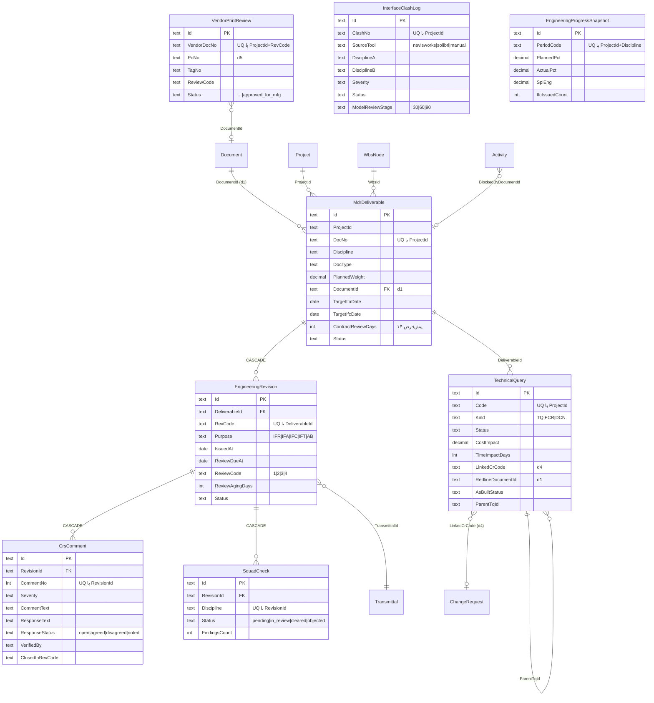

# ماژول مدیریت مهندسی و طراحی (ENG — MOD-12)

**Deliverable 1: تحلیل وضعیت موجود و معماری**
نسخه ۱.۰ · دامنهٔ فنی `d12` · تاریخ ۱۴۰۵/۰۶/۱۸

---

## ۱. خلاصهٔ مدیریتی

ماژول ENG چرخهٔ کامل مدرک مهندسی را از تعریف در MDR تا تأیید As-Built پوشش می‌دهد.
هستهٔ ارزش‌آفرین آن سه چیز است: **پیشرفت مهندسی قابل حسابرسی** (Rule of Credit پله‌ای
به‌جای درصد اعلامی)، **قفل ساخت تا صدور IFC** (جلوگیری از دوباره‌کاری کارگاهی)، و
**تبدیل خودکار TQ/FCR اثرگذار به Change Request** (جلوگیری از نشت ادعا).

بررسی کد فعلی نشان می‌دهد **هیچ‌کدام از این سه در سامانه وجود ندارد**. آنچه هست
زیرساخت عمومی مدرک است، نه مدیریت مهندسی.

---

## ۲. تحلیل شکاف — بر پایهٔ بازرسی کد، نه فرض

بازرسی `server/sqlLogic.js` (۴۱ جدول)، `src/services/planning.ts`،
`src/services/integration.ts` (۱۱ قالب) و `src/components/ModuleDetail.tsx` انجام شد.

### ۲.۱ آنچه موجود است و بازاستفاده می‌شود

| دارایی موجود | مسیر | نقش در ENG |
|---|---|---|
| جدول `Document` (۱۰ ستون) | `persistence.ts` d1 | مخزن فایل؛ `DocNo`, `Revision`, `Discipline`, `FilePath` |
| جدول `Transmittal` (۸ ستون) | `persistence.ts` d1 | ترانسمیتال با `Direction`, `DueAt`, `Items` |
| جدول `Activity` (۱۸ ستون) | `persistence.ts` d2 | ستون `RocCode` و `BlockedByEquipmentId` |
| جدول `ChangeRequest` | `persistence.ts` d4 | مقصد CR خودکارِ TQ/FCR |
| جدول `Ncr` (۱۳ ستون) | `persistence.ts` d8 | مقصد Design NCR — ستون `Discipline` دارد |
| موتور گزارش سه‌لوگو | `reporting.ts:57,193` | `Letterhead` + `validateLetterhead` |
| موتور قالب Excel | `integration.ts` | `TEMPLATE_CATALOG` (۱۱ قالب) |
| الگوی قفل بین‌ماژولی | `equipment.ts` G-01 | `Activity.BlockedByEquipmentId` — **الگوی مرجع قفل IFC** |
| الگوی ثبت ایدمپوتنت | `equipment.ts` G-02 | کلید طبیعی `(CostAccountId, PeriodCode)` |

### ۲.۲ شکاف‌های واقعی

| # | شکاف | شاهد در کد | شدت |
|---|---|---|---|
| GAP-01 | جدول MDR وجود ندارد | `SCHEMA` جدولی با `Deliverable`/`MDR` ندارد | **بحرانی** |
| GAP-02 | کدهای بررسی ۱–۴ نیست | هیچ `ReviewCode` در کد نیست | **بحرانی** |
| GAP-03 | CRS نیست | هیچ ساختار کامنت/پاسخ نیست | **بحرانی** |
| GAP-04 | Rule of Credit پیاده نشده | `Activity.RocCode` **فقط ستون است**؛ `planning.ts` جز یک ارجاع در توضیح، منطقی ندارد | **بحرانی** |
| GAP-05 | قفل IFC نیست | `Activity` ستون `BlockedByDocumentId` ندارد | **بالا** |
| GAP-06 | TQ/FCR/DCN نیست | هیچ جدولی | **بالا** |
| GAP-07 | IDC و Clash نیست | هیچ جدولی | **متوسط** |
| GAP-08 | VPR نیست؛ نگاشت به PO نیست | هیچ جدولی | **متوسط** |
| GAP-09 | `Document` نسخه‌بندی واقعی ندارد | `Revision` تک‌رشته است؛ تاریخچه ندارد | **بالا** |
| GAP-10 | قالب Excel مهندسی نیست | `TEMPLATE_CATALOG` هیچ `TPL-MDR` ندارد | **متوسط** |
| GAP-11 | KPI مهندسی نیست | کاتالوگ KPI فاقد `K-ENG-*` | **متوسط** |
| GAP-12 | S-Curve مهندسی نیست | `earnedSchedule` در FIN عام است، مهندسی‌محور نیست | **متوسط** |

**نتیجه:** ENG ماژول جدید است، نه بازآرایی. اما روی چهار زیرساخت آمادهٔ اثبات‌شده
(گزارش، قالب، قفل، ثبت ایدمپوتنت) سوار می‌شود.

### ۲.۳ مرز با `d1` — تصمیم دامنه

`d1` ده زیرفرایند دارد که «مدارک مهندسی» و «کنترل نسخه» جزو آن‌هاست. مرز:

- **`d1` مالک فایل است** — `DocNo` یکتا، مسیر فایل، ترانسمیتال، گردش عمومی.
- **`d12` مالک چرخهٔ عمر مهندسی است** — MDR، وزن، پله‌های پیشرفت، کد بررسی، CRS، IDC، TQ/FCR، VPR.

`MdrDeliverable.DocumentId → Document.Id` پل بین این دو است. **ENG فایل ذخیره نمی‌کند** و
`Document` را دست نمی‌زند جز خواندن. این ADR-ENG-01 است.

---

## ۳. زیرماژول‌ها و نگاشت به تحویلی‌ها

| کد | زیرماژول | تحویلی |
|---|---|---|
| 12.1 | فهرست و برنامه‌ریزی مدارک (MDR/EDDR) | D3 |
| 12.2 | بررسی، کدگذاری و CRS | D4 |
| 12.3 | هماهنگی بین‌دیسیپلینی و تداخلات | D5 |
| 12.4 | تغییرات مهندسی و چون‌ساخت | D6 |
| 12.5 | بررسی مدارک سازندگان (VPR) | D7 |
| 12.6 | پیشرفت و شاخص‌ها | D8, D10 |

---

## ۴. معماری مؤلفه‌ها

```
┌────────────────── لایهٔ ارائه ──────────────────┐
│  EngineeringWorkspace.tsx  (۶ تب، مونت در d12)  │
│  MdrMatrix · CrsGrid · IdcBoard · TqFcr · Vpr · Dashboard │
└───────────────────────┬─────────────────────────┘
                        │ REST /api/eng/*
┌───────────────────────┴─────────────────────────┐
│         server/index.js  — لایهٔ اندپوینت        │
└───────────────────────┬─────────────────────────┘
                        │ import از engLogic.js
┌───────────────────────┴─────────────────────────┐
│   src/services/engineering.ts  — موتور خالص     │
│                                                  │
│  MdrService            وزن، سلامت فهرست، فیلتر  │
│  ReviewWorkflowService کد ۱–۴، مهلت، aging      │
│  CrsEngine             کامنت، پاسخ، صحه‌گذاری    │
│  IdcService            Squad Check، Clash        │
│  TqFcrService          TQ/FCR/DCN، تشخیص اثر     │
│  VendorPrintService    VPR، نگاشت PO             │
│  ProgressEngine        Rule of Credit، SPI_Eng   │
│  AnalyticsService      ۶ KPI، ۵ EWS، S-Curve     │
└───────────────────────┬─────────────────────────┘
                        │
      ┌─────────────────┼──────────────────┐
   persistence.ts  reporting.ts     integration.ts
   (۸ جدول d12)   (۵ گزارش A4)     (۵ قالب Excel)
```

**قید:** موتور خالص است — بدون I/O، بدون `Date.now()` (زمان ورودی است، درس EQP)،
بدون وابستگی به Express. با esbuild به `server/engLogic.js` باندل می‌شود.

---

## ۵. تصمیمات معماری (ADR)

### ADR-ENG-01 — ENG مالک فایل نیست
`Document` (d1) تنها مخزن فایل می‌ماند. `MdrDeliverable` با `DocumentId` ارجاع می‌دهد.
**دلیل:** دو مخزن فایل یعنی دو حقیقت. **پیامد:** حذف مدرک در d1 باید در ENG یتیم‌یابی شود.

### ADR-ENG-02 — نسخه موجودیت مستقل است
`EngineeringRevision` جدول جداست، نه ستون. هر ریویژن `RevCode` (A, B, 0, 1)،
`Purpose` (IFR/IFA/IFC/AB) و `ReviewCode` خود را دارد.
**دلیل:** GAP-09 — `Document.Revision` تاریخچه ندارد و aging بررسی غیرممکن است.
**پیامد:** پیشرفت از **آخرین ریویژن** محاسبه می‌شود، نه از مدرک.

### ADR-ENG-03 — پیشرفت مشتق است، نه ورودی
درصد پیشرفت هرگز دستی وارد نمی‌شود؛ از پله‌های Rule of Credit مشتق می‌شود.
`Draft 20 → IDC 30 → IFA 60 → Code1/2 85 → IFC 95 → AsBuilt 100`
**دلیل:** GAP-04 و درس EQP (ADR-18: نرخ اسمی را از خروجی واقعی مشتق نکن).
**پیامد:** پله بدون شاهد در `Document` قفل می‌ماند — «۹۵٪ بدون فایل IFC» ناممکن است.

### ADR-ENG-04 — قفل IFC آینهٔ الگوی EQP
ستون `Activity.BlockedByDocumentId` افزوده می‌شود؛ دقیقاً مانند `BlockedByEquipmentId`.
اندپوینت `POST /api/eng/pex/sync-ifc-locks` پیش‌فرض **dry-run** است و با `apply=1` می‌نویسد.
**دلیل:** الگوی G-01 در تولید اثبات شد (`locked:1` → `released:1`).
**پیامد:** ENG فقط همین یک ستون را در `Activity` می‌نویسد.

### ADR-ENG-05 — قفل «وضعیت مشتق‌شده» است نه رویداد
هر بار کل وضعیت بازمحاسبه می‌شود: صدور IFC → آزادسازی خودکار.
**دلیل:** ADR-20 در EQP — قفل رویدادمحور نشت می‌کند.

### ADR-ENG-06 — CR خودکار پیش‌نویس است، نه مصوب
TQ/FCR با `CostImpact != 0` یا `TimeImpactDays != 0` پیش‌نویس CR می‌سازد با
`Status="draft"`. کلید طبیعی `(ProjectId, SourceType, SourceCode)` تضمین ایدمپوتنسی.
**دلیل:** الگوی G-02. **پیامد:** اجرای مکرر CR تکراری نمی‌سازد.

### ADR-ENG-07 — CRS دو موجودیت است
`CrsComment` (نظر بازبین) و پاسخ درون همان رکورد با `ResponseText`/`ResponseStatus`.
**دلیل:** پاسخ همیشه یک‌به‌یک است؛ جدول جدا join بی‌جهت می‌سازد.
**پیامد:** صحه‌گذاری ناظر ستون سوم است: `VerifiedBy`/`VerifiedAt`.

### ADR-ENG-08 — مهلت بررسی از تقویم قراردادی
`ReviewDueAt = IssuedAt + ContractReviewDays` (پیش‌فرض ۱۴). تأخیر کارفرما در
`ReviewAgingDays` ثبت و به EWS تزریق می‌شود — مبنای ادعای تأخیر در RCC.

### ADR-ENG-09 — Clash فقط لاگ است
مدل سه‌بعدی در سامانه رندر نمی‌شود؛ فقط خروجی Navisworks/Solibri وارد می‌شود.
**دلیل:** رندر ۳بعدی خارج از دامنه است. **پیامد:** `InterfaceClashLog` ورودی Excel دارد.

### ADR-ENG-10 — `EngineeringProgressSnapshot` عمداً در `PUBLIC_TABLES` نیست
مانند `EquipmentCostPosting` — جدول داخلی محاسباتی است.

---

## ۶. مدل داده — پیش‌نمای D2

هشت جدول در دامنهٔ `d12`:

| جدول | نقش | کلید طبیعی |
|---|---|---|
| `MdrDeliverable` | قلم MDR با وزن و تاریخ هدف | `(ProjectId, DocNo)` |
| `EngineeringRevision` | ریویژن با هدف و کد بررسی | `(DeliverableId, RevCode)` |
| `CrsComment` | نظر، پاسخ، صحه‌گذاری | `(RevisionId, CommentNo)` |
| `SquadCheck` | IDC بین‌دیسیپلینی | `(RevisionId, Discipline)` |
| `InterfaceClashLog` | تداخل سه‌بعدی | `(ProjectId, ClashNo)` |
| `TechnicalQuery` | TQ/FCR/DCN یکپارچه با `Kind` | `(ProjectId, Code)` |
| `VendorPrintReview` | مدرک سازنده + نگاشت PO | `(ProjectId, VendorDocNo)` |
| `EngineeringProgressSnapshot` | عکس دوره‌ای پیشرفت | `(ProjectId, PeriodCode)` |

**تصمیم:** TQ، FCR و DCN یک جدول با ستون `Kind` هستند، نه سه جدول — چرخهٔ عمر و
فیلدهایشان یکسان است و DCN صرفاً خروجی رسمی TQ/FCR است.

**مهاجرت `0008`** با helper موجود `addColumnDdl()`:
- `ALTER TABLE Activity ADD BlockedByDocumentId` (nullable)
- `CREATE INDEX IX_Activity_BlockedByDocument`
- DDL هشت جدول بالا با ایندکس‌های یکتا

اسکیمای هدف: **۴۹ جدول** (از ۴۱).

---

## ۷. یکپارچگی بین‌ماژولی

| مسیر | مکانیزم | وضعیت |
|---|---|---|
| ENG → PEX | `Activity.BlockedByDocumentId` + `sync-ifc-locks` | D13 |
| ENG → DMS | `MdrDeliverable.DocumentId → Document.Id` | D3 |
| ENG → RCC | پیش‌نویس CR ایدمپوتنت از TQ/FCR | D6 |
| ENG → FIN | `VendorPrintReview.PoNo` | D7 |
| ENG → QLT | Design NCR با `Ncr.Discipline` | D9 |
| ENG → MON | ۶ KPI + ۵ EWS | D10 |

---

## ۸. شاخص‌ها و هشدارها — پیش‌نمای D10

| کد | شاخص | هدف |
|---|---|---|
| `K-ENG-SPI` | SPI مهندسی = EV/PV | ≥ ۰٫۹۵ |
| `K-ENG-FTA` | تأیید بار اول (Code 1/2 در Rev اول) | ≥ ۶۰٪ |
| `K-ENG-AGE` | میانگین تأخیر بررسی کارفرما (روز) | ≤ ۱۴ |
| `K-ENG-REJ` | نرخ Code 3 | ≤ ۲۰٪ |
| `K-ENG-TQA` | میانگین سن TQ باز (روز) | ≤ ۱۰ |
| `K-ENG-IFC` | نرخ صدور IFC طبق برنامه | ≥ ۹۰٪ |

`EWS-ENG-01` بررسی از مهلت گذشت · `-02` مدرک سه بار Code 3 · `-03` TQ باز > ۱۵ روز
· `-04` IFC عقب و فعالیت ساخت قفل · `-05` SPI_Eng < ۰٫۸۵.

---

## ۹. UI/UX

`EngineeringWorkspace.tsx` با ۶ تب، مونت در `ModuleDetail.tsx` روی `dom.id==="d12"`.
**بدون آیتم جدید سایدبار** مگر تأیید صریح. `src/index.css` و فونت Vazirmatn دست‌نخورده.

ماتریس MDR: سطر=مدرک، ستون=پله، سلول رنگی. گرید CRS با فیلتر وضعیت.

---

## ۱۰. نقشهٔ راه

| فاز | محتوا | تحویلی |
|---|---|---|
| F1 (MVP) | MDR + بررسی + ترانسمیتال | D2–D4 |
| F2 | TQ/FCR + CR خودکار + IDC | D5–D6 |
| F3 | VPR + پیشرفت + Design QA | D7–D9 |
| F4 | KPI/EWS + گزارش + Excel + قفل IFC | D10–D14 |

---

## ۱۱. لوپ‌های خودارزیابی

| لوپ | موضوع | نتیجه |
|---|---|---|
| ۱ | PMBOK/ISO 9001 Cl.8.3 | ✅ Design Control پوشش دارد |
| ۲ | MDR و Rule of Credit | ✅ ADR-ENG-03 پیشرفت را مشتق کرد |
| ۳ | کدهای ۱–۴ و CRS | ✅ ADR-ENG-07/08 |
| ۴ | TQ/FCR و CR خودکار | ✅ ADR-ENG-06 ایدمپوتنت |
| ۵ | VPR و نگاشت PO | ✅ `PoNo` طراحی شد |
| ۶ | IDC و Clash | ⚠️ ADR-ENG-09: فقط لاگ، بدون رندر — **تأیید کاربر لازم** |
| ۷ | یکپارچگی | ✅ شش مسیر با مکانیزم مشخص |
| ۸ | گزارش سه‌لوگو | ✅ `validateLetterhead` موجود |
| ۹ | Excel | ✅ ۵ قالب روی `TEMPLATE_CATALOG` |
| ۱۰ | مهاجرت | ✅ `0008` با `addColumnDdl()`؛ `d1` دست‌نخورده |

**دو نکتهٔ نیازمند تصمیم:**
1. **لوپ ۶** — رندر سه‌بعدی خارج از دامنه فرض شد.
2. **مهلت بررسی** پیش‌فرض ۱۴ روز — اگر قرارداد عدد دیگری دارد بگویید.

---
---

# Deliverable 2: مدل دادهٔ جامع

**وضعیت: پیاده‌سازی شد و آزمون داد.** هشت جدول در `src/services/persistence.ts`،
مهاجرت `0008`، و ۳۱ آزمون در `server/eng.schema.test.mjs`.

اسکیما از **۴۱ به ۴۹ جدول** رسید — ۷۸۳ ستون، ۷۲ ایندکس، ۱۳ کلید خارجی.

## ۱۲. ERD



## ۱۳. تصمیم‌های مدل‌سازی و دلیلشان

**آبشار فقط جایی که مالکیت واقعی است.** `EngineeringRevision` و `CrsComment` و
`SquadCheck` با `CASCADE` حذف می‌شوند چون بدون والد بی‌معنا هستند. اما
`TechnicalQuery` کلید خارجی سخت به MDR ندارد — استعلام کارگاهی ممکن است به مدرکی
اشاره کند که هنوز در MDR ثبت نشده، و از دست دادن آن یعنی از دست دادن ادعا.

**پیوند بین‌ماژولی با کلید نرم.** `DocumentId`، `PoNo`، `LinkedCrCode` و `WbsId`
کلید خارجی پایگاه‌داده ندارند. دلیل: ADR-ENG-01 و درس EQP — قید سخت بین ماژول‌ها
هنگام حذف داده در ماژول دیگر می‌شکند. یتیم‌یابی کار موتور است، نه موتور پایگاه‌داده.

**سه جدول در یکی.** TQ و FCR و DCN با ستون `Kind` یک جدول شدند. `ParentTqId`
خودارجاع است چون DCN معمولاً فرزند یک TQ یا FCR است. آزمون
«TQ و FCR و DCN یک جدول با ستون Kind هستند» صراحتاً وجود `FieldChangeRequest` و
`DesignChangeNotice` را رد می‌کند تا کسی بعداً جدول موازی نسازد.

**پاسخ CRS هم‌رکورد است.** `ResponseText` کنار `CommentText` نشست (ADR-ENG-07).
جدول `CrsResponse` عمداً وجود ندارد و آزمون نبودش را تضمین می‌کند.

**`ReviewAgingDays` ستون ذخیره‌شده است نه محاسبهٔ لحظه‌ای.** چون مبنای ادعای
قراردادی است و باید در لحظهٔ ثبت قفل شود؛ اگر بعداً محاسبه شود با تغییر تاریخ
سیستم عوض می‌شود — همان دام «سال ساخت با `new Date()`» که در EQP خوردیم.

## ۱۴. مهاجرت `0008`

۲۹ statement: یک `ALTER TABLE` با محافظ `IF COL_LENGTH(...) IS NULL`، یک
`CREATE INDEX`، و ۲۷ عبارت ساخت جدول و ایندکس.

```sql
IF COL_LENGTH('dbo.Activity', 'BlockedByDocumentId') IS NULL
  ALTER TABLE [dbo].[Activity] ADD [BlockedByDocumentId] NVARCHAR(60) NULL;
CREATE INDEX [IX_Activity_BlockedByDocument] ON [dbo].[Activity] ([BlockedByDocumentId]);
```

سه ضمانت که آزمون دارند: هیچ ستون `NOT NULL` به جدول موجود افزوده نمی‌شود ·
هیچ جدول ماژول دیگری `ALTER` یا `DROP` نمی‌شود · مهاجرت‌های `0001`–`0007`
دست‌نخورده‌اند.

## ۱۵. پوشش آزمون D2 — ۳۱ مورد

| گروه | تعداد | نمونه |
|---|---|---|
| حضور و شکل جدول | ۳ | عنوان دوزبانه، `ProjectId` اجباری |
| کلید طبیعی | ۲ | هشت کلید یکتا، یکتایی نام ایندکس در کل اسکیما |
| ADR-ENG-01 | ۲ | هیچ `FilePath` در d12؛ `Document` در d1 می‌ماند |
| ADR-ENG-02 | ۲ | ریویژن مستقل، آبشار |
| ADR-ENG-04 | ۲ | ستون قفل nullable و **هم‌شکل دقیق** قفل EQP |
| ADR-ENG-06 | ۲ | فیلدهای اثر؛ رد جدول موازی FCR/DCN |
| ADR-ENG-07/08/09/10 | ۴ | پاسخ هم‌رکورد، مهلت ۱۴، بدون هندسه، کلید دوره‌ای |
| مهاجرت `0008` | ۶ | محافظ، بدون NOT NULL، بدون دست‌درازی، صف اجرا |
| سلامت DDL | ۵ | decimal با دقت، text با طول، Status مستند |
| رگرسیون | ۳ | ۴۹ جدول، `0001`–`0007` سالم، قفل EQP سالم |

**دروازهٔ کیفیت D2:** `npm test` = **۷۴۷/۷۴۷** (از ۷۱۶) · `tsc --noEmit | wc -l` = **۵۸** (بدون تغییر).

## ۱۶. لوپ‌های خودارزیابی D2

| لوپ | نتیجه |
|---|---|
| ۱ استاندارد | ✅ `Purpose` و `ReviewCode` طبق رویهٔ EPC |
| ۲ MDR و ROC | ✅ `PlannedWeight` + شش پلهٔ مشتق از `Purpose`/`ReviewCode` |
| ۳ کد و CRS | ✅ `ReviewDueAt`/`ReviewAgingDays` + گرید هم‌رکورد |
| ۴ TQ/FCR | ✅ `Kind` یکپارچه، `CostImpact`/`TimeImpactDays`، `ParentTqId` |
| ۵ VPR | ✅ `PoNo` + `TagNo` + `approved_for_mfg` |
| ۶ IDC | ✅ `SquadCheck` + `InterfaceClashLog` با `ModelReviewStage` |
| ۷ یکپارچگی | ✅ چهار کلید نرم + یک ستون قفل |
| ۸ گزارش | ⏳ D11 |
| ۹ Excel | ⏳ D12 |
| ۱۰ مهاجرت | ✅ `0008` افزایشی و بی‌آسیب، با آزمون |

**دو پرسش D1 هنوز باز است:** رندر سه‌بعدی خارج از دامنه (ADR-ENG-09) و مهلت
پیش‌فرض ۱۴ روز. هر دو در مدل قابل تغییرند — `ContractReviewDays` ستون است، نه ثابت.

---
---

# Deliverable 3 تا 14: پیاده‌سازی کامل

**وضعیت: بسته شد.** موتور، ۱۴ اندپوینت، ۵ قالب Excel، UI شش‌تبی، ۱۵۱ آزمون.

## ۱۷. موتور `src/services/engineering.ts`

۴۱ export، خالص، بدون I/O، «اکنون» تزریق می‌شود. باندل: `npm run build:eng`.

| بخش | تابع‌های کلیدی |
|---|---|
| MDR (D3) | `validateMdr` · `distributeWeights` · `reviewDaysFor` · `reviewDueDate` |
| Rule of Credit (D8) | `ROC_STEPS` · `deliverableProgress` · `engineeringProgress` |
| بررسی و CRS (D4) | `reviewAging` · `crsSummary` · `crsGate` · `rejectionCycles` |
| IDC (D5) | `idcStatus` · `clashSummary` |
| TQ/FCR (D6) | `tqAging` · `hasCommercialImpact` · `planChangeRequests` · `asBuiltStatus` |
| VPR (D7) | `vprSummary` |
| قفل IFC (D13) | `planIfcLocks` |
| KPI/EWS (D10) | `engineeringKpis` · `engineeringAlerts` |
| گزارش (D11) | `ENG_REPORT_CATALOG` · `getEngReport` · `isAudienceAllowed` |
| یکپارچه | `engineeringOverview` |

### امضاهای مهم

```
deliverableProgress(revisions, {requireDocument=true}) → {pct, step, trail[6]}
engineeringProgress(rows, asOf) → {actualPct, plannedPct, spi, byDiscipline[], items[]}
reviewAging(revisions, asOf, deliverableById) → [{overdueDays, status, dueAt}]
crsGate(comments) → {passed, blockers[]}
planChangeRequests(queries) → {drafts[], skippedExisting[], skippedNoImpact[]}
planIfcLocks({activities, activityDocLinks, deliverables, revisions}) → {lock[], release[], unchanged}
```

## ۱۸. چهارده اندپوینت REST

| مسیر | کار |
|---|---|
| `GET /api/eng/status` | نسخه، دامنه، پله‌ها، اهداف KPI |
| `GET /api/eng/overview` | کل تصویر در یک فراخوان |
| `GET /api/eng/mdr` | ماتریس MDR با ردیابی شاهد؛ فیلتر `discipline` |
| `GET /api/eng/progress` | پیشرفت وزنی و SPI؛ پارامتر `asOf` |
| `GET /api/eng/review/aging` | سن بررسی کارفرما |
| `GET /api/eng/crs` | نظرات و دروازهٔ IFC؛ فیلتر `revisionId` |
| `GET /api/eng/idc` | Squad Check و تداخل |
| `GET /api/eng/tq` | استعلام‌ها، چون‌ساخت، برنامهٔ CR؛ فیلتر `kind` |
| `GET /api/eng/vpr` | مدارک سازندگان |
| `GET /api/eng/kpi` | شش شاخص و پنج هشدار |
| `GET /api/eng/reports` | کاتالوگ هفت گزارش |
| `GET /api/eng/reports/:code` | بدنهٔ گزارش با کنترل مخاطب |
| `POST /api/eng/pex/sync-ifc-locks` | قفل و آزادسازی ساخت — dry-run |
| `POST /api/eng/rcc/draft-crs` | پیش‌نویس CR ایدمپوتنت — dry-run |

خطاها: `400 E-ENG-NO-PROJECT` · `403 E-ENG-RPT-AUDIENCE` · `404 E-ENG-RPT-CODE`.

**دام ثبت‌شده:** بلوک مسیرها باید **پیش از** catch-all در `server/index.js` بنشیند.
درج در انتهای فایل باعث ۴۰۴ روی همهٔ مسیرها شد و سه بار ری‌استارت گرفت تا کشف شود.

## ۱۹. اثبات‌های زنده

**قفل IFC** — سه رفتار در یک اجرا:

```
ENG-ACT-1 → W-300 → PI-ISO-207 (IFA)      → 🔒 قفل شد
ENG-ACT-2 → W-100 → PR-PID-001 (IFC دارد) → قفل نشد
ENG-ACT-3 → W-200 → CV-DWG-014 (بدون IFC) → قفل نشد، چون ActualStart دارد
```

سپس صدور IFC برای `PI-ISO-207` با فایل شاهد → `released:1` و ستون `null`.
اجرای دوباره: `locked:0 released:0 unchanged:4`.

نکتهٔ ظریف: پس از آزادسازی، پیشرفت آن مدرک روی ۶۰٪ ماند نه ۹۵٪ — چون پلهٔ
«تأیید کارفرما» شاهد ندارد. سیستم پله را جهش نمی‌دهد (ADR-ENG-03).

**CR خودکار** — سه بار `apply=1`:

```
اجرای ۱: ساخته=2  از قبل=0
اجرای ۲: ساخته=0  از قبل=2
اجرای ۳: ساخته=0  از قبل=2
پایگاه: دقیقاً ۲ رکورد
```

**اعداد واقعی روی دادهٔ نمونه:** پیشرفت ۶۳٫۲۵٪ در برابر برنامهٔ ۸۹٫۷۵٪ ·
SPI = ۰٫۷۰ · دو بررسی از مهلت گذشته (۶ و ۴۳ روز) · دروازهٔ CRS بسته با دو مانع.

## ۲۰. پنج قالب Excel

`TPL-MDR`(12) · `TPL-CRS`(12) · `TPL-EPR`(10) · `TPL-TQR`(12) · `TPL-VPR`(11).
کاتالوگ از ۱۱ به **۱۶** رسید.

**دو باگ واقعی که آزمون رفت‌وبرگشت پیدا کرد:**

۱. `toNumber` جداکنندهٔ اعشار فارسی `٫` (U+066B) را نمی‌شناخت. `normalizeDigits`
فقط رقم را ترجمه می‌کرد، پس «۱۲٫۵» به `NaN` می‌رسید و **ورودی معتبر کاربر بی‌صدا
رد می‌شد**. این باگ روی هر ۱۶ قالب اثر داشت، نه فقط ENG.

۲. دو `alias` گمشده: عنوان‌های «مهلت بررسی (روز)» و «اثر زمانی (روز)» در فهرست
نام‌های مستعار خودشان نبودند، پس CSV تولیدی خودِ سامانه هنگام برگشت شناخته نمی‌شد.

## ۲۱. رابط کاربری

`src/components/EngineeringWorkspace.tsx` — شش تب، مونت روی `dom.id==="d12"`.
داده از API زنده می‌آید نه نمونهٔ ثابت. **بدون آیتم سایدبار.**
`src/index.css` و فونت Vazirmatn دست‌نخورده؛ فقط کلاس‌های موجود `glass`/`tx1..3`.

ماتریس MDR شش ستون پله دارد: `●` پلهٔ باز با شاهد، `○` قفل. `title` هر سلول متن
شاهد را نشان می‌دهد.

دامنهٔ `d12` با ۶ فرایند و ۱۱ زیرفرایند به `framework.ts` افزوده شد، **پیش از `d7`**
که همیشه آخر است.

## ۲۲. پوشش آزمون — ۱۵۱ مورد

| فایل | تعداد | تمرکز |
|---|---|---|
| `server/eng.schema.test.mjs` | ۳۱ | اسکیما، مهاجرت، ADRها |
| `server/eng.test.mjs` | ۹۲ | منطق موتور |
| `server/eng.integration.test.mjs` | ۲۸ | قالب، CSV، پیوند بین‌ماژولی |

**دروازهٔ کیفیت:** `npm test` = **۸۶۷/۸۶۷** (از ۷۱۶) · `tsc --noEmit | wc -l` = **۵۸** (بدون تغییر).

آزمون‌هایی که از آینده محافظت می‌کنند: رد وجود `FieldChangeRequest`/`DesignChangeNotice`
· رد وجود `CrsResponse` · هیچ `FilePath` در `d12` · هم‌شکلی دقیق ستون قفل با EQP ·
هیچ FK سخت به ماژول دیگر.

## ۲۳. ده لوپ خودارزیابی نهایی

| لوپ | نتیجه |
|---|---|
| ۱ PMBOK و ISO 9001 Cl.8.3 | ✅ کنترل طراحی، ورودی/خروجی، بازبینی، صحه‌گذاری، تغییر |
| ۲ MDR و Rule of Credit | ✅ شش پله؛ پله بدون شاهد قفل — آزمون «IFC بدون فایل شاهد قفل می‌ماند» |
| ۳ کدهای ۱–۴ و CRS | ✅ چرخهٔ کامل، مهلت قراردادی، گرید هم‌رکورد با صحه‌گذاری |
| ۴ TQ/FCR | ✅ CR ایدمپوتنت با کد قطعی؛ اثبات سه‌بارهٔ زنده |
| ۵ VPR | ✅ نگاشت PO، پرچم مدرک بی‌PO، `approved_for_mfg` |
| ۶ IDC و Clash | ✅ Squad Check و لاگ تداخل — **رندر سه‌بعدی خارج از دامنه (ADR-ENG-09)** |
| ۷ یکپارچگی | ✅ شش مسیر؛ دو اتصال نویسنده با dry-run پیش‌فرض |
| ۸ گزارش A4 سه‌لوگو | 🔶 کاتالوگ و کنترل مخاطب کامل؛ **رندر HTML/PDF مانده** |
| ۹ Excel | ✅ پنج قالب با رفت‌وبرگشت آزموده؛ دو باگ واقعی رفع شد |
| ۱۰ مهاجرت | ✅ `0008` افزایشی، بی‌آسیب، با شش آزمون |

## ۲۴. کارهای باقی‌مانده

| کد | موضوع | شدت |
|---|---|---|
| G-ENG-01 | رندر HTML/PDF گزارش‌ها با سربرگ سه‌لوگو (موتور `reporting.ts` آماده است) | متوسط |
| G-ENG-02 | نگاشت صریح فعالیت↔مدرک؛ فعلاً از تطابق `WbsId` مشتق می‌شود | متوسط |
| G-ENG-03 | فرم‌های ورود داده در UI؛ فعلاً فقط نمایش است | متوسط |
| G-ENG-04 | Design NCR خودکار از کد ۳ مکرر به `Ncr` در d8 | کم |
| G-ENG-05 | نوشتن `EngineeringProgressSnapshot` به‌صورت دوره‌ای | کم |
| G-ENG-06 | تزریق KPI مهندسی به `KpiSnapshot` برای داشبورد پایش | کم |

## ۲۵. دو تصمیم باز

۱. **رندر سه‌بعدی** خارج از دامنه فرض شد؛ فقط خروجی Navisworks/Solibri لاگ می‌شود.
۲. **مهلت بررسی ۱۴ روز** پیش‌فرض است؛ `ContractReviewDays` ستون است و هر مدرک
می‌تواند عدد خودش را داشته باشد — در دادهٔ نمونه یک مدرک ۲۱ روز دارد.

---

## ۲۶. Deliverable 15 — رندر گزارش A4 سه‌لوگو (`G-ENG-01`)

نخستین شکاف بخش ۲۴ بسته شد. تا پیش از این، `GET /api/eng/reports` فقط **فهرست** هفت گزارش را برمی‌گرداند و هیچ سندی تولید نمی‌شد. اکنون هر گزارش به سند A4 با سربرگ سه‌لوگو در چهار قالب تبدیل می‌شود.

### ۲۶٫۱ مرز معماری

ENG هیچ HTML ای تولید نمی‌کند. موتور `eng-v1` فقط **بدنهٔ گزارش** می‌سازد و موتور مستقل `rpt-v1` آن را سریال می‌کند:

```
engineering.ts            reporting.ts                server/index.js
buildEngReport(code, in) ─→ toPrintHtml/toWordHtml ─→ GET …/render?format=
        │                   toExcelHtml/toCsv              │
        └─ EngReportBody ──→ (هم‌ریخت با ReportDef)         └─ engLetterhead()
```

سود این تفکیک: قواعد کاغذ A4، فونت، جهت راست‌به‌چپ و چیدمان سه لوگو **یک‌جا** در `rpt-v1` نگهداری می‌شود و هر هشت ماژول گزارش‌دار از همان مسیر عبور می‌کنند. تغییر قالب کاغذ نیازی به دست‌زدن به ENG ندارد.

### ۲۶٫۲ هفت سازنده

| کد | تابع | دوره | مخاطب | بخش‌ها |
|---|---|---|---|---|
| `RPT-ENG-MDR` | `buildMdrStatusReport` | weekly | داخلی + رسمی | KPI + ماتریس + مغایرت وزن (شرطی) |
| `RPT-ENG-TRN` | `buildTransmittalReport` | adhoc | **فقط رسمی** | جدول ارسال + متن تأییدیه |
| `RPT-ENG-CRS` | `buildCrsReport` | adhoc | داخلی + رسمی | KPI + شیت نظرات + نتیجهٔ دروازه |
| `RPT-ENG-TQF` | `buildTqFcrReport` | weekly | داخلی + رسمی | KPI + دفتر استعلام + پیش‌نویس CR (شرطی) |
| `RPT-ENG-PRG` | `buildProgressReport` | monthly | داخلی + رسمی | KPI + دیسیپلین + شاخص + هشدار (شرطی) |
| `RPT-ENG-VPR` | `buildVprReport` | weekly | **فقط داخلی** | KPI + جدول مدارک سازنده |
| `RPT-ENG-IDC` | `buildIdcReport` | weekly | فقط داخلی | KPI + بررسی گروهی + جفت دیسیپلین |

`buildEngReport(code, input)` توزیع‌کنندهٔ واحد است و برای کد ناشناخته **`null`** می‌دهد، نه استثنا — تا لایهٔ REST بتواند `404` تمیز برگرداند.

### ۲۶٫۳ اندپوینت

```
GET /api/eng/reports/:code/render
    ?projectId=p1              الزامی
    &format=html|pdf|word|excel|csv|json     پیش‌فرض html
    &audience=internal|official              پیش‌فرض internal
    &lang=fa|en   &asOf=…   &seq=…   &periodLabel=…
    &letterhead={JSON}         بازنویسی اختیاری سربرگ
```

پاسخ‌ها: `200` سند · `400 E-ENG-NO-PROJECT` · `400 E-ENG-RPT-FORMAT` · `403 E-ENG-RPT-AUDIENCE` · `404 E-ENG-RPT-CODE` · `409 E-ENG-RPT-LETTERHEAD`.

سه محافظ پیش از تولید سند اجرا می‌شوند: **کد** معتبر باشد، **مخاطب** مجاز باشد، و برای گزارش رسمی **سربرگ کامل** باشد. کد `409` عمداً از `400` جدا شد چون خطا در دادهٔ ارسالی نیست بلکه در تکمیل‌نبودن مشخصات سازمانی است و پیام آن فهرست دقیق کمبودها را برمی‌گرداند.

### ۲۶٫۴ سربرگ

`engLetterhead(source, reportCode, seq)` دقیقاً الگوی `eqpLetterhead` را دنبال می‌کند: پارس امن JSON از querystring، ادغام روی پیش‌فرض، و ساخت خودکار شماره سند وقتی داده نشده باشد.

نمونهٔ زنده: `OG-2401-RPT-ENG-TRN-0001-R00`.

### ۲۶٫۵ خروجی PDF

PDF **وابستگی npm جدید نیاورد**. مسیر `format=pdf` همان HTML چاپی را می‌دهد که `@page { size: A4 }` دارد؛ کاربر با چاپ مرورگر به PDF می‌رسد. افزودن Puppeteer یا wkhtmltopdf چند صد مگابایت وابستگی و یک باینری سیستمی به پروژه تحمیل می‌کرد در حالی که خروجی بصری یکسان است.

### ۲۶٫۶ ده لوپ خودارزیابی

| # | یافته | نشانه | اقدام |
|---|---|---|---|
| ۱ | `reporting.ts` از قبل ۲۸ export و چهار سریال‌ساز کامل داشت | 📌 | بازاستفاده؛ هیچ سریال‌ساز تازه‌ای نوشته نشد |
| ۲ | `EqpReportDef` الگوی آزموده‌شدهٔ سربرگ داشت | 📌 | `engLetterhead` هم‌ریخت با `eqpLetterhead` نوشته شد |
| ۳ | ENG واژهٔ `on_demand` دارد، `rpt-v1` آن را نمی‌شناسد | 🔧 | `toRptPeriodicity` افزوده شد؛ آزمون اختصاصی مانع بازگشت است |
| ۴ | `toExcelHtml` سه پارامتر می‌گیرد؛ در نخستین سیم‌کشی `lh` جا افتاد و پنج قالب `500` داد | 🔧 | امضا اصلاح شد؛ آزمون «عبور از هر چهار سریال‌ساز» افزوده شد |
| ۵ | شاخص بدون داده در جدول به `0` تبدیل می‌شد و «صفر واقعی» را جعل می‌کرد | 🔧 | `status="بی‌داده"` و مقدار خالی؛ آزمون صریح `value !== 0` |
| ۶ | بخش مغایرت وزن، پیش‌نویس CR و هشدار در گزارش سالم هم چاپ می‌شد | 🔧 | هر سه **شرطی** شدند؛ سه آزمون منفی «نبود بخش» |
| ۷ | ترانسمیتال ریویژن‌های بدون شمارهٔ ارسال را هم می‌آورد | 🔧 | فیلتر `TransmittalId` + آزمون |
| ۸ | جفت دیسیپلین در گزارش IDC انگلیسی چاپ می‌شد | 🔧 | نگاشت `DISCIPLINE_FA` |
| ۹ | دو کمکی `pctText`/`toneOf` پس از بازنویسی بلااستفاده ماند (`TS6133`) | 🔧 | حذف شدند؛ baseline به ۵۸ بازگشت |
| ۱۰ | گزارش رسمی با سربرگ ناقص سند بی‌اعتبار تولید می‌کرد | ✨ | دروازهٔ `409` با فهرست کمبودها پیش از رندر |

### ۲۶٫۷ پوشش آزمون

`server/eng.report.test.mjs` — **۴۰ آزمون**، همه سبز. ساختار: هشت آزمون **قرارداد عام** که روی *همهٔ* کدهای کاتالوگ حلقه می‌زنند (عنوان دوزبانه، کلید ستون، انطباق ردیف با ستون، نبود `undefined`/`NaN` خام، تطابق مخاطب با کاتالوگ)، پنج آزمون **عبور واقعی از سریال‌سازها** (نه mock)، بیست آزمون محتوای اختصاصی هر گزارش، و آزمون **دادهٔ خالی** که تضمین می‌کند پروژهٔ تازه سند بی‌خطا می‌سازد.

انتخاب آگاهانه: آزمون‌های عام روی `ENG_REPORT_CATALOG` حلقه می‌زنند نه فهرست هاردکد — گزارش هشتم که اضافه شود، خودبه‌خود زیر همان هشت قرارداد می‌رود.

جمع کل مخزن: **۹۰۷/۹۰۷** (۸۶۷ + ۴۰).

### ۲۶٫۸ رابط کاربری

تب «پیشرفت و شاخص‌ها» → کاتالوگ گزارش‌ها: هر ردیف چهار دکمهٔ چاپ/ورد/اکسل/CSV دارد. مخاطب خودکار انتخاب می‌شود (رسمی اگر گزارش اجازه دهد) و سند در زبانهٔ تازه باز می‌شود تا وضعیت میز کار حفظ شود. هر خروجی در `logAudit` با کد گزارش، قالب و مخاطب ثبت می‌شود.

### ۲۶٫۹ اثبات زنده

۳۵ ترکیب (هفت گزارش × پنج قالب) آزموده شد، **همه `200`**. گزارش پیشرفت `p1` با `asOf=2026-06-01`: پیشرفت واقعی **۶۳٫۲۵٪** در برابر برنامهٔ **۸۹٫۷۵٪**، انحراف **−۲۶٫۵** با تُن `bad`، SPI **۰٫۷۰۴۷**. سربرگ رسمی هر سه لوگو را چاپ کرد. CSV با BOM یونیکد صادر شد تا اکسل فارسی را درست باز کند.

### ۲۶٫۱۰ شکاف‌های باقی‌مانده ENG

`G-ENG-01` ✅ **بسته شد** · `G-ENG-02` نگاشت صریح فعالیت↔مدرک · `G-ENG-03` فرم‌های ورود داده · `G-ENG-04` Design NCR خودکار · `G-ENG-05` snapshot دوره‌ای · `G-ENG-06` تزریق KPI به `KpiSnapshot`.

---

## ۲۷. بستن شکاف‌های شناسایی‌شده (ماتریس بخش ۲ سند تحویل)

هفت شکاف از چهارده مورد ماتریس بسته شد: **هر چهار مورد High** و سه مورد Medium.

### ۲۷٫۱ اصل راهنما — بدون جدول تازه

هیچ جدولی ساخته نشد. سه مقصد از قبل در اسکیما بودند و فقط نویسنده نداشتند:

| مقصد | ماژول | کلید یکتا | وضعیت پیشین |
|---|---|---|---|
| `KpiSnapshot` | d3 | `(ProjectId, KpiCode, PeriodCode)` | موجود، بدون تغذیه از ENG |
| `EngineeringProgressSnapshot` | d12 | `(ProjectId, PeriodCode, Discipline)` | ساخته‌شده ولی **خالی** |
| `Claim` | d4 | `(ProjectId, Code)` | موجود، بدون تغذیه از ENG |

`Ncr` موجود در d8 هم به‌جای ساخت `DesignNcr` موازی بازاستفاده شد. نتیجه: **مهاجرت تازه صفر**، و شمار جداول روی ۴۹ ثابت ماند.

### ۲۷٫۲ هفت اندپوینت تازه

| متد | مسیر | شکاف | اثر |
|---|---|---|---|
| GET | `/api/eng/pex/lock-coverage` | ۲ (H) | افشای فعالیت‌های خارج از محافظ IFC |
| POST | `/api/eng/mon/publish-kpi` | ۱ (H) | تزریق شش شاخص به `KpiSnapshot` |
| POST | `/api/eng/rcc/draft-eot` | ۴ (H) | پیش‌نویس ادعای تمدید زمان |
| POST | `/api/eng/qms/draft-dcn` | ۵ (M) | اصلاح مدرک از عدم‌انطباق طراحی |
| POST | `/api/eng/snapshot/progress` | ۹ (M) | عکس دوره‌ای — پیش‌نیاز S-Curve |
| GET | `/api/eng/progress/series` | ۹ (M) | سری زمانی برای رسم منحنی |
| GET | `/api/eng/vpr/po-audit` | ۷ (M) | اعتبارسنجی ارجاع `PoNo` |
| POST | `/api/eng/pex/backfill-roc` | ۱۱ (M) | پرکردن `Activity.RocCode` |

هر POST پیش‌فرض **dry-run** است و فقط با `?apply=1` می‌نویسد. جمع اندپوینت‌های ENG: **۲۳**.

### ۲۷٫۳ شکاف ۲ — خطرناک‌ترین مورد

فعالیت بدون `WbsId` بی‌صدا از محافظ IFC عبور می‌کرد. کاربر «قفل: ۰» می‌دید و نتیجه می‌گرفت همه‌چیز آزاد است، در حالی که فعالیت اصلاً وارد محاسبه نشده بود. **اعتماد کاذب از نبود محافظ خطرناک‌تر است.**

اثبات زنده روی `p1`: پوشش **۶۶٫۶۷٪** — فعالیت `A-1240` «خاکبرداری بلوک B» تا پیش از این نامرئی بود.

`ifcLockCoverage` فعالیت شروع‌شده را از شمارش کنار می‌گذارد (قفل گذشته بی‌معناست) و در نبود فعالیت `coveragePct` را **`null`** می‌دهد نه صفر یا صد.

### ۲۷٫۴ شکاف ۴ — ادعای EOT

**ADR-ENG-11:** ادعا فقط **پیش‌نویس** ساخته می‌شود. ثبت خودکار ادعا علیه کارفرما تصمیم حقوقی است نه محاسباتی.

سه محافظ در `planEotClaims`:

1. **آستانهٔ پیش‌فرض ۸ روز** نه یک روز — ادعای یک‌روزه رابطهٔ کاری را می‌سوزاند بی‌آنکه ارزش قراردادی بسازد. پارامتری است چون قراردادها متفاوت‌اند.
2. **ردیف بدون سررسید رد می‌شود.** سررسید مبنای حقوقی ادعاست؛ جایگزین کردنش با تاریخ ساختگی ادعا را در داوری بی‌اعتبار می‌کند.
3. **کد ایدمپوتنت** `EOT-ENG-${revisionId}` — اجرای مکرر ادعای تکراری نمی‌سازد.

اثبات زنده: دو پیش‌نویس، جمع **۵۱ روز** تمدید. `ENG-R6` با ۴۳ روز در ردهٔ `critical` و `ENG-R4` با ۸ روز در `medium`.

### ۲۷٫۵ شکاف ۵ — Design NCR

**ADR-ENG-12:** منبع حقیقت عدم‌انطباق نزد QMS می‌ماند؛ ENG فقط اقدام اصلاحی مدرک می‌سازد.

تصمیم کلیدی: وقتی چند مدرک هم‌دیسیپلین باشند، **عمداً هیچ‌کدام انتخاب نمی‌شود.** حدس زدن مدرک هدف بدتر از خالی گذاشتن آن است، چون اصلاح را روی مدرک اشتباه می‌نشاند.

اثبات زنده: از چهار عدم‌انطباق، دو پیش‌نویس ساخته شد. `NCR-2026-021` (جوشکاری خارج از رواداری) درست به‌عنوان **نقص اجرایی نه طراحی** رد شد و `NCR-2026-009` چون بسته بود کنار رفت. `NCR-ENG-001` مدرک هدف نگرفت چون دیسیپلینش مبهم بود.

### ۲۷٫۶ شکاف ۷ — تلهٔ هشدار کاذب

نخستین پیاده‌سازی `CostAccount` را به‌عنوان دفتر سفارش خرید گرفت. نتیجه: هر ارجاع درست «یتیم» گزارش شد — `PO-2026-088` و `PO-2026-091` هر دو کاذب پرچم خوردند.

ریشه: **`CostAccount` حساب هزینه است نه سفارش خرید.** هیچ دفتر سفارشی در اسکیما وجود ندارد.

اصلاح: مرجع فقط از پارامتر `knownPoNumbers` پذیرفته می‌شود و در نبودش صرفاً «نبود ارجاع» گزارش می‌گردد. پاسخ میدان `registryAvailable` و یادداشت صریح دارد تا کاربر بداند چه چیزی سنجیده **نشده** است. هشدار کاذب کاربر را به بی‌اعتمادی به کل گزارش می‌کشاند.

### ۲۷٫۷ شکاف ۹ — پیش‌نیاز S-Curve

`engProgressSnapshots` یک ردیف به‌ازای هر دیسیپلین به‌علاوهٔ ردیف تجمعی `ALL` می‌سازد. ردیف `ALL` عمداً **ثبت** می‌شود نه محاسبه در زمان خواندن: اگر بعداً تعریف وزن‌ها عوض شود، عدد تاریخی نباید بازنویسی گردد.

`byDiscipline` موتور، `earnedWeight` و `spi` ندارد؛ هر دو اینجا مشتق می‌شوند و SPI در نبود برنامهٔ مثبت **`null`** است نه صفر و نه بی‌نهایت.

اثبات زنده دو دوره‌ای: `2026-06` برنامه ۸۹٫۷۵ / واقعی ۶۳٫۲۵ · `2026-07` برنامه ۹۵ / واقعی ۶۳٫۲۵ — دقیقاً واگرایی‌ای که منحنی روند باید نشان دهد.

### ۲۷٫۸ ده لوپ خودارزیابی

| # | یافته | نشانه | اقدام |
|---|---|---|---|
| ۱ | سه جدول مقصد از قبل در اسکیما بودند | 📌 | بدون مهاجرت تازه؛ شمار جداول ۴۹ ثابت ماند |
| ۲ | `Ncr` عام در d8 موجود بود | 📌 | بازاستفاده به‌جای ساخت `DesignNcr` موازی |
| ۳ | `documentTrail` و `ROC_STEP_PCT` وجود نداشتند (حدس API) | 🔧 | `deliverableProgress` و `rocPct` واقعی جایگزین شد |
| ۴ | `byDiscipline` فیلد `earnedWeight`/`spi` ندارد | 🔧 | از `weight` و درصد مشتق شد |
| ۵ | `ReviewAging.dueAt` nullable است | 🔧 | `skippedNoDueDate` افزوده شد؛ ادعای بی‌مبنا ساخته نمی‌شود |
| ۶ | `CostAccount` به‌غلط دفتر سفارش فرض شد → دو یتیم کاذب | 🔧 | مرجع بیرونی + `registryAvailable` |
| ۷ | `Ncr.json` وجود نداشت؛ مسیر DCN آزموده‌نشده می‌ماند | 🔧 | چهار ردیف نمونه شامل یک نقص اجرایی و یک بسته |
| ۸ | گروه‌بندی ریویژن سه بار در REST تکرار شده بود | 🔧 | `engRevisionsByDeliverable` یک‌بار تعریف شد |
| ۹ | شکاف‌ها فقط از API دیده می‌شدند | ✨ | پنل «سلامت یکپارچگی» در تب داشبورد |
| ۱۰ | ابهام دیسیپلین می‌توانست مدرک اشتباه بگیرد | ✨ | انتخاب خودکار فقط با یک نامزد؛ وگرنه `null` |

### ۲۷٫۹ پوشش آزمون

`server/eng.gaps.test.mjs` — **۳۷ آزمون**. هر شکاف یک آزمون مثبت و دست‌کم یک آزمون منفی دارد، چون بیشتر این توابع دربارهٔ چیزی‌اند که **نباید** رخ دهد: هشدار کاذب، ادعای بی‌مبنا، حدس مدرک هدف، بازنویسی کد موجود.

آزمون ماژول: **۲۲۸** (۹۲ + ۳۱ + ۲۸ + ۴۰ + ۳۷). کل مخزن: **۹۴۴/۹۴۴**.

### ۲۷٫۱۰ شکاف‌های باقی‌مانده

| # | شکاف | اثر | چرا بسته نشد |
|---|---|---|---|
| ۳ | چرخهٔ MR → PR/PO | **H** | نیازمند جدول تازه در FIN و تعیین مالک آن ماژول |
| ۶ | تاریخچهٔ نسخهٔ `Document` | M | مالکیت نزد DMS در d1 است، نه d12 |
| ۸ | فرم‌های ورود داده | M | کار UI؛ نیازمند وایرفریم |
| ۱۰ | Red-Line و چرخهٔ DCN کامل | M | `DCN` اکنون ساخته می‌شود ولی گردش تأیید ندارد |
| ۱۲ | نگاشت صریح فعالیت↔مدرک | M | اکنون **قابل اندازه‌گیری** شد (شکاف ۲)؛ جدول پیوند صریح جدا لازم است |
| ۱۳ | رندر سه‌بعدی | L | پذیرفته‌شده — ADR-ENG-09 |
| ۱۴ | PDF سمت سرور | L | پذیرفته‌شده — چاپ مرورگر |

نفر-ساعت باقی‌مانده: **۱۰۶** از ۲۳۲ اولیه.

---

## ۲۸. شکاف ۳ — چرخهٔ تدارکات MR → PR → PO

آخرین شکاف High بسته شد. این تنها موردی بود که به **تصمیم مالکیت** نیاز داشت، نه صرفاً کدنویسی.

### ۲۸٫۱ کشف تعیین‌کننده

پیش از شروع، موتور `finance.ts` بازرسی شد. یافته برآورد ۴۰ ساعته را تغییر داد: **منطق تدارکات از قبل وجود داشت** — `mrpRun`, `prBudgetCheck`, `threeWayMatch`, `materialNeedDate`, `safetyStock`, `reorderPoint`. آنچه نبود، **جدول و لایهٔ REST** بود؛ FIN اصلاً اندپوینتی ندارد و UI مستقیم از موتور می‌خواند.

پس کار به‌جای نوشتن منطق تازه، ساخت مسیر ماندگاری و مرز مالکیت شد.

### ۲۸٫۲ ADR-ENG-14 — مرز مالکیت

> مهندسی می‌گوید «چه چیزی لازم است و کِی»؛ مالی می‌گوید «از که و به چه قیمت».

| جدول | دامنه | چرا |
|---|---|---|
| `MaterialRequest` | **d12** | منشأ آن مدرک IFC است؛ بدون مهندسی معنا ندارد |
| `PurchaseRequisition` | **d5** | کنترل بودجه و تعهد مالی نزد مالی است |
| `PurchaseOrder` | **d5** | رابطهٔ قراردادی با فروشنده، خارج از دامنهٔ مهندسی |

پیوند دو دامنه با **کلید نرم** (`MrCode`, `PrCode`, `PoNo`) برقرار می‌شود نه کلید خارجی — همان الگوی `DocumentId` و `WbsId`. سه ماژول به هم سخت گره نمی‌خورند و هرکدام می‌تواند مستقل تکامل یابد.

گزینهٔ رد‌شده: بردن هر سه جدول به d5. این کار MR را از مدرک مبدأش جدا می‌کرد و ENG را مجبور به نوشتن در دامنهٔ ماژول دیگر می‌ساخت.

### ۲۸٫۳ ADR-ENG-15 — درخواست فقط از مدرک IFC

سفارش کالا بر پایهٔ نقشهٔ تأییدنشده همان اشتباهی است که کل محافظ IFC برای جلوگیری از آن ساخته شد — با این تفاوت که **خسارتش به‌جای دوباره‌کاری ساخت، پول است**.

`planMaterialRequests` سه محافظ دارد:

1. **فقط مدرک IFC-شده** (و با `DocumentId` معتبر) درخواست می‌سازد.
2. **تاریخ نیاز از شروع برنامه‌ای فعالیت وابسته** می‌آید نه از تاریخ مدرک؛ کالا باید پیش از **ساخت** برسد و مدرک ممکن است ماه‌ها زودتر صادر شده باشد.
3. **فعالیت بدون تاریخ برنامه‌ای رد می‌شود.** تاریخ حدسی بدتر از نبود آن است: سفارش زودهنگام پول را می‌خواباند، دیرهنگام کارگاه را.

وقتی چند فعالیت به یک مدرک وصل باشند، **زودترین** تاریخ ملاک است — دیرترین، کالا را دیر می‌رساند.

### ۲۸٫۴ EWS-ENG-06 — پنجرهٔ سفارش

```
تاریخ آزادسازی = تاریخ نیاز − مهلت تدارک − حاشیهٔ اطمینان (۱۴ روز)
```

مهلت تدارک به تفکیک دیسیپلین: ابزار دقیق و مکانیک ۱۲۰ روز · برق ۱۰۵ · فرآیند و لوله ۹۰ · سازه ۶۰ · عمران ۴۵.

شدت بر پایهٔ **شناوری** سنجیده می‌شود نه سن درخواست: وقتی تاریخ آزادسازی گذشته باشد، هر روز تأخیر مستقیم به تأخیر کارگاه بدل می‌شود چون مهلت تدارک قابل فشرده‌سازی نیست.

| شناوری | شدت |
|---|---|
| منفی | `critical` |
| ۰ تا ۷ روز | `high` |
| ۸ تا ۱۴ روز | `medium` |
| بیش از ۱۴ | بی‌هشدار |

**یافتهٔ زندهٔ `p1`:** هر دو درخواست `critical` — پنجرهٔ `MR-PR-PID-001` **۱۰۴ روز** و `MR-PI-ISO-207` **۹۵ روز** پیش بسته شده است.

### ۲۸٫۵ کنترل بودجه مشورتی است نه بازدارنده

`planPurchaseRequisitions` وضعیت `over_budget` را علامت می‌زند اما **پیش‌نویس را می‌سازد**. ENG مالک بودجه نیست و نباید خرید را وتو کند — همان‌طور که `prBudgetCheck` در موتور FIN اجازهٔ override می‌دهد.

برآورد قیمت عمداً محاسبه نمی‌شود: ENG قیمت نمی‌داند و عدد ساختگی بدتر از خالی گذاشتن است، چون کنترل بودجه را روی داده‌ای بی‌پایه اجرا می‌کند. بدون برآورد، وضعیت **`unknown`** می‌ماند نه `ok` جعلی.

### ۲۸٫۶ چهار اندپوینت تازه

| متد | مسیر | عملکرد |
|---|---|---|
| GET | `/api/eng/mr` | فهرست درخواست‌ها + خلاصه + هشدار پنجرهٔ سفارش |
| POST | `/api/eng/fin/draft-mr` | پیش‌نویس درخواست کالا از مدارک IFC |
| POST | `/api/eng/fin/draft-pr` | پیش‌نویس درخواست خرید در d5 + کنترل بودجه |
| GET | `/api/eng/procurement/chain` | ردیابی سرتاسری مدرک → کالا → خرید → سفارش → مدرک سازنده |

جمع اندپوینت‌های ENG: **۲۷**. هر دو POST پیش‌فرض dry-run.

### ۲۸٫۷ حلقهٔ بستهٔ اثبات‌شده

```
PR-PID-001 → MR-PR-PID-001 → PR-MR-PR-PID-001 → PO-2026-088 → VD-PMP-001
   مدرک            کالا              خرید            سفارش       مدرک سازنده
```

`closedLoop: true` تنها وقتی برقرار است که هر پنج حلقه وصل باشند. در `p1` یک زنجیره کامل و یکی ناقص است.

**تکمیل شکاف ۷:** اکنون که دفتر `PurchaseOrder` وجود دارد، `po-audit` مرجع واقعی می‌خواند و یتیم واقعی یافت — `PO-2026-091` که در دفتر نیست. پیش از این، بدون مرجع، هیچ یتیمی قابل تشخیص نبود.

### ۲۸٫۸ ده لوپ خودارزیابی

| # | یافته | نشانه | اقدام |
|---|---|---|---|
| ۱ | موتور FIN منطق MRP و کنترل بودجه داشت | 📌 | بازاستفادهٔ مفهومی؛ منطق تکراری نوشته نشد |
| ۲ | FIN هیچ لایهٔ REST ندارد؛ UI مستقیم از موتور می‌خواند | 📌 | ENG اندپوینت خودش را ساخت بدون دست‌زدن به FIN |
| ۳ | `dayToIso` وجود نداشت (حدس API) | 🔧 | `addDays` واقعی جایگزین شد |
| ۴ | مهاجرت اجراشدهٔ `0008` وسوسهٔ ویرایش داشت | 🔧 | `0009` جدا ساخته شد؛ چک‌سام `0008` دست‌نخورده |
| ۵ | سه تست رگرسیون شمار جدول را قفل کرده بودند | 🔧 | به ۵۲ و ۹ به‌روز شد؛ ارزش رگرسیونی حفظ شد |
| ۶ | قرارداد مستندسازی `Status` رعایت نشده بود | 🔧 | چهار ستون با فهرست مقادیر مجاز مستند شد |
| ۷ | آزمون تقویمی من غلط بود نه کد | 🔧 | با `python3 datetime` راستی‌آزمایی شد: ۲۰۲۶-۰۵-۲۰ |
| ۸ | `mrpRun` انبار می‌خواهد که ENG ندارد | 🔧 | تاریخ‌محور شد نه موجودی‌محور؛ انبار خارج از دامنه |
| ۹ | زنجیره فقط از API دیده می‌شد | ✨ | پنل تدارکات در تب مدارک سازندگان |
| ۱۰ | ردیابی سرتاسری وجود نداشت | ✨ | `procurement/chain` با پرچم `closedLoop` |

### ۲۸٫۹ پوشش آزمون

`server/eng.procurement.test.mjs` — **۴۰ آزمون**: پنج اسکیما (مالکیت ماژول، کلید طبیعی، نبود FK سخت، مهاجرت)، سه تاریخ آزادسازی، یازده ساخت MR، هفت هشدار پنجره، نُه درخواست خرید، پنج دفتر سفارش.

آزمون ماژول: **۳۰۱** (۹۲ + ۳۳ + ۲۸ + ۴۰ + ۳۷ + ۴۰ + ۳۱ اسکیما به‌روز). کل مخزن: **۹۸۶/۹۸۶**.

### ۲۸٫۱۰ وضعیت نهایی شکاف‌ها

**هر چهار مورد High بسته شد.** باقی‌مانده فقط Medium و پذیرفته‌شده:

| # | شکاف | وضعیت |
|---|---|---|
| ۶ | تاریخچهٔ نسخهٔ `Document` | ⬜ مالکیت نزد d1 |
| ۸ | فرم‌های ورود داده | ⬜ کار UI |
| ۱۰ | Red-Line و گردش تأیید DCN | ◐ جزئی |
| ۱۲ | جدول پیوند صریح فعالیت↔مدرک | ◐ قابل اندازه‌گیری شد |
| ۱۳، ۱۴ | رندر سه‌بعدی، PDF سمت سرور | ✅ پذیرفته |

نفر-ساعت باقی‌مانده: **۶۶** از ۲۳۲ اولیه.

---

## ۲۹. بستن چهار شکاف پایانی — از «کار می‌کند» تا «قابل استفاده است»

ممیزی صادقانهٔ ماژول نشان داد پوشش کارکردی کامل است ولی چهار شکاف مانع
استفادهٔ واقعی می‌شود: هیچ مجوزی روی اقدام‌های نوشتاری نبود، کارگاه فقط
خواندنی بود، ده اندپوینت نوشتاری فقط با `curl` قابل اجرا بودند، و
تصمیم‌گیر ارشد گزارشی متناسب با خودش نداشت. این بخش هر چهار مورد را ثبت
می‌کند.

### ۲۹٫۱ کنترل دسترسی (مورد ۱)

پیش از این، هر فراخوانی می‌توانست قفل ساخت را باز کند یا ادعای تمدید مدت
علیه کارفرما بسازد. دوازده مجوز `eng.*` تعریف شد و روی هر نُه اندپوینت
نوشتاری نشست. خواندن عمداً باز ماند: شفافیت وضعیت مهندسی برای همهٔ
ذی‌نفعان ارزش دارد و هیچ اندپوینت خواندنی داده‌ای فراتر از آنچه در جلسات
پروژه مطرح می‌شود بیرون نمی‌دهد.

سه قاعدهٔ تفکیک وظیفه افزوده شد. منطقشان قراردادی است نه فنی:

| قاعده | تضاد | چرا |
|---|---|---|
| `SOD-08` | صدور ریویژن ↔ زدن کد بررسی | صادرکننده نمی‌تواند مدرک خودش را تأیید کند |
| `SOD-09` | ثبت نظر ↔ بستن نظر | ثبت‌کنندهٔ ایراد نباید خودش آن را حل‌شده اعلام کند |
| `SOD-10` | صدور درخواست کالا ↔ تأیید خرید | مرز کلاسیک تدارکات |

دو نقش تازه — `engineering_manager` و `design_lead` — عمداً طوری تعریف
شدند که هیچ‌کدام هر دو سر یک قاعده را نداشته باشند.

**دو درس:** موتور مجوز میدان `allow` برمی‌گرداند نه `allowed`؛ خواندن نام
غلط همه را بی‌صدا رد می‌کند و چون نتیجه fail-closed است فقط با آزمودن
مسیر **مجاز** لو می‌رود. و سطح دسترسی نقش باید دست‌کم برابر طبقه‌بندی
مجوز باشد وگرنه نقش بی‌اثر است؛ راه‌حل درست بالا بردن سطح نقش است نه
پایین آوردن طبقه‌بندی مجوز.

کلید `ENG_RBAC_ENFORCE=0` امکان استقرار مرحله‌ای می‌دهد.

### ۲۹٫۲ فرم‌های ورود داده (مورد ۲)

چهار اندپوینت با اعتبارسنجی کامل: ثبت مدرک، صدور ریویژن، ثبت نظر، ثبت
استعلام. سه تصمیم طراحی:

**اعتبارسنجی سمت سرور است نه مرورگر.** مرورگر قابل دور زدن است و همین
اندپوینت‌ها از اسکریپت هم صدا زده می‌شوند.

**همهٔ ایرادها یک‌جا برمی‌گردند** نه اولین مورد؛ فرم نُه میدانی نباید نُه
بار رفت‌وبرگشت بخواهد.

**اثر جانبی در پاسخ اعلام می‌شود.** ثبت مدرک جمع وزن را برمی‌گرداند و اگر
از ۱۰۰ فاصله داشت هشدار می‌دهد؛ صدور ریویژن پیشرفت حاصل را می‌گوید. صدور
با هدف IFC بدون فایل مدرک رد می‌شود، وگرنه کاربر گمان می‌کند ۹۵٪ گرفته
در حالی که مدرک روی ۲۰٪ مانده است (ADR-ENG-03).

### ۲۹٫۳ دکمه‌های اقدام (مورد ۳)

نُه اقدام یکپارچه‌سازی هر کدام دو مرحله دارند: پیش‌نمایش بدون اثر، سپس
اعمال با تأیید جداگانه. اقدام‌هایی که بیرون از ماژول می‌نویسند — قفل
فعالیت، ادعای تمدید مدت، درخواست خرید — تأیید متمایز می‌گیرند چون از رابط
کاربری برگشت‌پذیر نیستند.

خلاصهٔ هر کارت پس از بازرسی پاسخ واقعی سرور نوشته شد نه با حدس؛ سه مورد
در همین بازرسی اصلاح شد. خلاصه‌ها موارد **رد شده** را هم می‌گویند — مثلاً
«۲ مدرک هنوز صادر نشده» — تا سکوت به معنی پوشش کامل تعبیر نشود.

### ۲۹٫۴ ADR-ENG-16 — گزارش مدیریتی با حذف ساخته می‌شود نه با افزودن

**زمینه.** هفت گزارش موجود همه تفصیلی‌اند. مدیرعامل از گزارش پیشرفت
ماهانه استفاده نمی‌کرد چون فهرست ردیف‌به‌ردیف مدارک را نمی‌خواهد.

**تصمیم.** `RPT-ENG-EXEC` هیچ جدول ردیف‌به‌ردیفی ندارد و به سه پرسش پاسخ
می‌دهد: آیا مهندسی جلوی ساخت را گرفته؟ چقدر ادعای قابل مطالبه داریم؟ کدام
سه قلم امروز تصمیم می‌خواهد؟ آزمون با شصت مدرک ساختگی تضمین می‌کند هیچ
جدولی از هشت ردیف بیشتر نشود.

**قید سازگاری.** هیچ عددی در سازندهٔ این گزارش محاسبه نمی‌شود؛ همه از
همان توابعی می‌آید که گزارش‌های تفصیلی مصرف می‌کنند. در عمل یک ناسازگاری
واقعی همین‌جا کشف شد: جمع خام روزهای تأخیر ۴۹ روز می‌داد ولی پیش‌نویس ادعا
۵۱ روز، چون آستانهٔ هشت‌روزهٔ قراردادی تأخیرهای کوچک را کنار می‌گذارد و
تأخیرهای واجد شرایط را کامل می‌شمارد. گزارش اکنون از `planEotClaims`
استفاده می‌کند — همان منبعی که اندپوینت ادعا به کار می‌برد.

**محرمانگی.** فقط `internal`. این گزارش برآورد ادعای قابل مطالبه دارد و
رسیدنش به کارفرما موضع قراردادی را پیش از طرح رسمی ادعا فاش می‌کند.
درخواست با `audience=official` خطای `E-ENG-RPT-AUDIENCE` می‌گیرد.

### ۲۹٫۵ پوشش آزمون

| فایل | آزمون | تمرکز |
|---|---|---|
| `eng.rbac.test.mjs` | ۳۲ | کاتالوگ مجوز، سه قاعدهٔ SOD، ارزیابی زندهٔ نقش‌ها |
| `eng.forms.test.mjs` | ۲۲ | اعتبارسنجی، تکراری، اثر جانبی، مرز دسترسی |
| `eng.actions.test.mjs` | ۱۴ | قرارداد میدان‌های پاسخ، بی‌اثر بودن پیش‌نمایش |
| `eng.exec.test.mjs` | ۱۵ | سازگاری عددی، یک‌صفحه‌ای بودن، محرمانگی |

دو فایل نخست سرور اختصاصی روی پوشهٔ دادهٔ موقت بالا می‌آورند. دلیلش این
است که درایور فایلی حافظهٔ داخلی دارد: پاک کردن فایل کافی نیست چون سرورِ
در حال اجرا دوباره آن را می‌نویسد.

آزمون‌های `eng.actions` قرارداد میدان‌های پاسخ را قفل می‌کنند. اگر نام
میدانی در سرور عوض شود، رابط کاربری خطا نمی‌دهد بلکه بی‌صدا «۰ مورد»
نشان می‌دهد و کاربر گمان می‌کند کاری برای انجام نیست — بدترین نوع خرابی.

**کل مخزن: ۱۰۶۹/۱۰۶۹.** آزمون ماژول مهندسی: ۳۸۴.

### ۲۹٫۶ وضعیت

| مورد | وضعیت |
|---|---|
| کنترل دسترسی | ✅ |
| فرم‌های ورود داده | ✅ |
| دکمه‌های اقدام | ✅ |
| گزارش مدیریتی | ✅ |

باقی‌مانده فقط مواردی است که پیش‌تر پذیرفته یا به دامنهٔ ماژول دیگری
واگذار شده بود: تاریخچهٔ نسخهٔ `Document` (مالکیت d1)، گردش کامل تأیید
Red-Line، رندر سه‌بعدی و تولید PDF سمت سرور.
