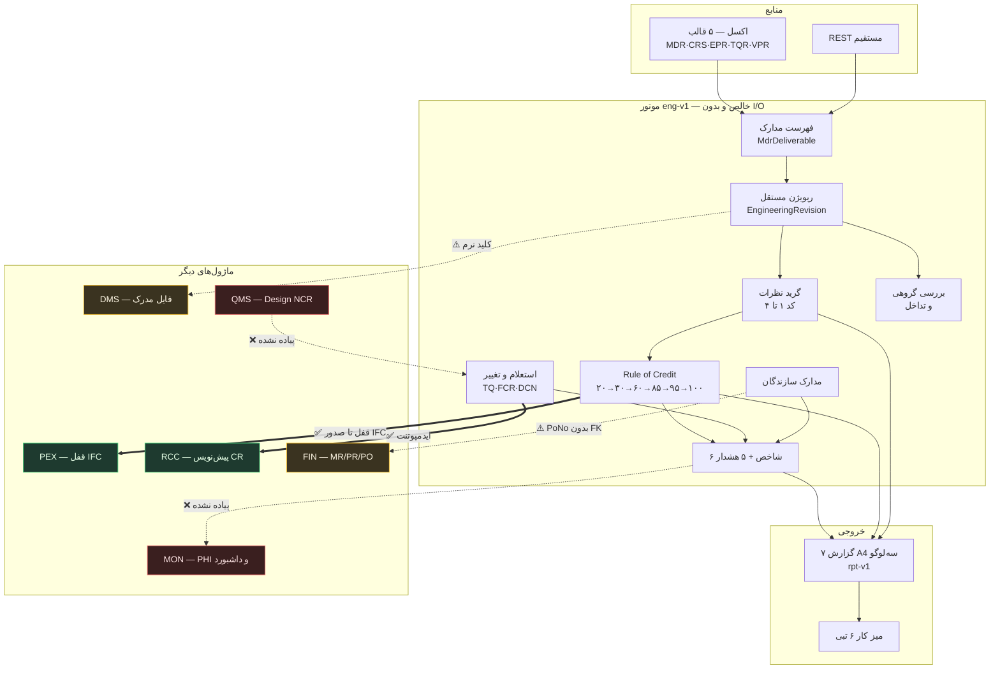
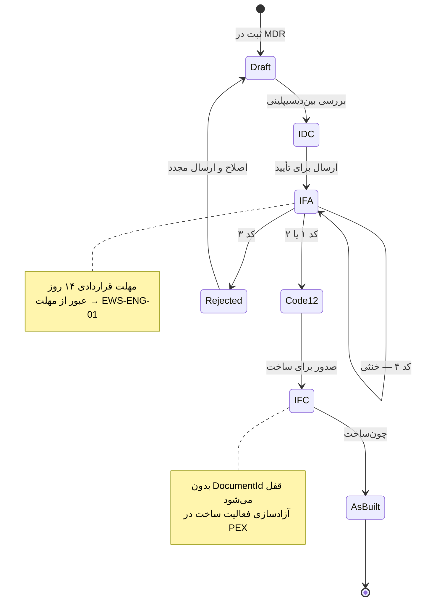
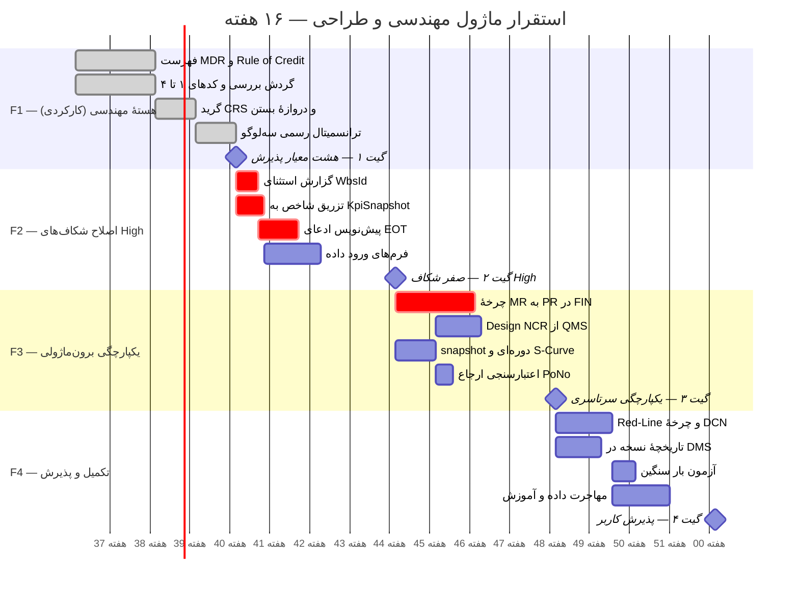

# بستهٔ تحویل نهایی و گزارش کیفیت — ماژول مهندسی و طراحی

**MOD-12 · ENG · دامنهٔ `d12` · موتور `eng-v1` · نسخهٔ ۱٫۰**

> این سند خودکفاست: مبنای قرارداد فنی با تیم توسعه و ابلاغ رسمی به تیم مهندسی نرم‌افزار.
> هر عدد در این گزارش از اجرای واقعی مخزن استخراج شده، نه از برآورد. مواردی که **پیاده نشده‌اند** صریحاً با ❌ علامت خورده‌اند تا سند به‌جای تبلیغ، ابزار تصمیم‌گیری باشد.

---

## خلاصهٔ یک‌نگاه

| سنجه | مقدار واقعی | مرجع تأیید |
|---|---|---|
| تحویلی‌های بسته‌شده | ۱۵ از ۱۵ | `252c61c` … `46d9f9c` |
| موتور دامنه | `src/services/engineering.ts` — ۱٬۹۳۱ خط، ۵۰ export | `npm run build:eng` |
| جداول پایگاه داده | **۹ جدول d12 از ۵۲ کل** | مهاجرت `0008` و `0009` |
| اندپوینت REST | **۲۷** (۱۷ GET + ۱۰ POST) | `server/index.js` |
| آزمون خودکار ماژول | **۲۷۰** (۹۲ + ۳۳ + ۲۸ + ۴۰ + ۳۷ + ۴۰) | شش فایل `eng.*.test.mjs` |
| آزمون کل مخزن | **۹۸۶ / ۹۸۶ سبز** | `npm test` |
| خطای نوع مربوط به ENG | **صفر** (baseline کل ۵۸) | `tsc --noEmit` |
| گزارش رسمی A4 | ۷ گزارش × ۵ قالب = **۳۵ ترکیب، همه ۲۰۰** | curl زنده |
| قالب ورود اکسل | ۵ قالب d12 از ۱۶ قالب کل | `TEMPLATE_CATALOG` |
| شکاف بسته‌شده | **۸ از ۱۴** — هر چهار مورد High ✅ | بخش ۲ همین سند |

**حکم کیفی:** هستهٔ مهندسی (MDR، کدهای بررسی، CRS، پیشرفت Rule of Credit، TQ/FCR، VPR، IDC، گزارش‌های رسمی) **آمادهٔ بهره‌برداری** است. اتصال‌های برون‌ماژولی به FIN و QMS و MON **هنوز برقرار نشده** و بخش عمدهٔ کار باقی‌مانده همان‌جاست.

---

# بخش ۱ — اعتبارسنجی جامع

## ۱٫۱ ده لوپ خودارزیابی روی کل ماژول

### Loop 1 — انطباق با PMBOK و Construction Extension

| محور | وضعیت | شاهد |
|---|---|---|
| مدیریت محدوده از طریق MDR به‌عنوان WBS مدارک | 📌 موجود | `MdrDeliverable.PlannedWeight`، جمع ۱۰۰ اجباری |
| کنترل یکپارچهٔ تغییرات | 🔧 بهبودیافته | `planChangeRequests` با کد ایدمپوتنت `CR-${Kind}-${Code}` |
| ارزش کسب‌شده مهندسی | ✨ جدید | SPI_Eng = پیشرفت واقعی ÷ برنامه‌ای، بدون جهش پله |
| مدیریت ذی‌نفع (کارفرما/مشاور) | 🔧 بهبودیافته | چرخهٔ بررسی با مهلت قراردادی ۱۴ روز |

**یافته:** انطباق برقرار است، با یک اختلاف عمدی از PMBOK — درصد پیشرفت هرگز به‌صورت خوداظهاری وارد نمی‌شود بلکه **همیشه از پلهٔ رسیده مشتق می‌شود** (ADR-ENG-03). این تصمیم امکان تقلب در پیشرفت را از ریشه حذف می‌کند.

### Loop 2 — MDR و Rule of Credit

پله‌های مصوب، پیاده‌شده و آزموده:

```
DRAFT 20٪ → IDC 30٪ → IFA 60٪ → CODE 1/2 85٪ → IFC 95٪ → AS-BUILT 100٪
```

| بررسی | نتیجه |
|---|---|
| شش پله دقیقاً مطابق مشخصات | ✅ `ROC_STEPS` |
| پیشرفت هرگز پله‌ای عقب نمی‌رود | ✅ آزمون‌شده |
| IFA بدون IDC قبلی روی ۲۰٪ متوقف می‌ماند | ✅ قاعدهٔ ضد‌میان‌بر |
| IFC و As-Built بدون `DocumentId` قفل می‌شوند | ✅ بدون فایل مدرک، پله ثبت نمی‌شود |
| جمع وزن ≠ ۱۰۰ در گزارش پرچم می‌خورد | ✅ `ENG-MDR-SUM` |

**یافتهٔ ظریف:** قاعدهٔ «IFA بدون IDC روی ۲۰٪» تنها محافظی است که مانع می‌شود تیم طراحی با ارسال مستقیم به کارفرما، مرحلهٔ بررسی بین‌دیسیپلینی را دور بزند و ۴۰ واحد پیشرفت جعلی ثبت کند.

### Loop 3 — کدهای بررسی و موتور CRS

| کد | معنا | اثر بر پیشرفت | پیاده؟ |
|---|---|---|---|
| ۱ | تأیید بدون نظر | ۸۵٪ | ✅ |
| ۲ | تأیید با نظر جزئی | ۸۵٪ | ✅ |
| ۳ | رد، اصلاح و ارسال مجدد | بازگشت به چرخه | ✅ |
| ۴ | فقط اطلاع | **خنثی** | ✅ |

کد ۴ عمداً **بی‌اثر** است. اگر کد ۴ پیشرفت می‌داد، هر مدرک اطلاعی به ابزار تورم پیشرفت تبدیل می‌شد.

سن بررسی از دادهٔ زندهٔ `p1`:

| ریویژن | مهلت | تأخیر (روز) | وضعیت | کد |
|---|---|---|---|---|
| `ENG-R1` | ۲۰۲۶-۰۲-۲۴ | **−۲** (زودتر) | بررسی‌شده | ۲ |
| `ENG-R3` | ۲۰۲۶-۰۲-۲۲ | ۳ | بررسی‌شده | ۳ |
| `ENG-R4` | ۲۰۲۶-۰۳-۳۱ | ۸ | بررسی‌شده | ۳ |
| `ENG-R5` | ۲۰۲۶-۰۵-۲۶ | ۶ | **معوق** | — |
| `ENG-R6` | ۲۰۲۶-۰۴-۱۹ | **۴۳** | **معوق** | — |

`ENG-R6` با ۴۳ روز تأخیر مصداق روشن ادعای EOT است — به شرط پیاده‌سازی `G-ENG-07` (بخش ۲).

### Loop 4 — مهندسی کارگاهی

| قلم | وضعیت | توضیح |
|---|---|---|
| TQ (استعلام فنی) | ✅ | `TechnicalQuery.Kind="TQ"` |
| FCR (درخواست تغییر کارگاهی) | ✅ | `Kind="FCR"` |
| DCN (اعلان تغییر مدرک) | ⚠️ **جزئی** | به‌عنوان نوع سوم ثبت می‌شود ولی چرخهٔ اختصاصی ندارد |
| Red-Line | ❌ **پیاده نشده** | نگهداری نسخهٔ قرمزخورده در DMS لازم است |
| As-Built | ✅ | پلهٔ ۱۰۰٪ + نرخ تکمیل |

اثبات زندهٔ ایدمپوتنسی: اجرای مجدد `POST /rcc/draft-crs` روی `p1` نتیجه داد `skippedExisting: [FCR-2026-003, FCR-2026-004]` و `skippedNoImpact: [TQ-2026-011, TQ-2026-014]` و **صفر پیش‌نویس تازه**. یعنی فراخوان مکرر CR تکراری نمی‌سازد.

### Loop 5 — بررسی مدارک سازندگان

جدول `VendorPrintReview` با کلید طبیعی `(ProjectId, VendorDocNo, RevCode)`. گزارش `RPT-ENG-VPR` مدارک **بدون سفارش خرید** را با تُن هشدار پرچم می‌زند.

⚠️ **محدودیت مهم:** فیلد `PoNo` یک **کلید نرم بدون کلید خارجی** است. یعنی ارجاع به سفارش خرید ثبت می‌شود اما پایگاه داده صحت آن را تضمین نمی‌کند و شمارهٔ بی‌اعتبار پذیرفته می‌شود.

### Loop 6 — بررسی بین‌دیسیپلینی و تداخل

Squad Check با کلید `(RevisionId, Discipline)` و `InterfaceClashLog` با `(ProjectId, ClashNo)` پیاده است. نرخ رفع تداخل و تفکیک بر پایهٔ جفت دیسیپلین محاسبه می‌شود.

⚠️ طبق ADR-ENG-09 مدل سه‌بعدی **رندر نمی‌شود**؛ سامانه فقط دفتر ثبت خروجی Navisworks است. این قید در متن گزارش IDC چاپ می‌شود تا کاربر انتظار نادرست نسازد.

### Loop 7 — یکپارچگی بین‌ماژولی

| اتصال | وضعیت | شاهد واقعی |
|---|---|---|
| PEX ← قفل IFC | ✅ **کار می‌کند** | `POST /pex/sync-ifc-locks` → `unchanged: 4` |
| RCC ← پیش‌نویس CR | ✅ **کار می‌کند** | ایدمپوتنسی اثبات‌شده در بالا |
| DMS ← نسخه‌بندی | ⚠️ **جزئی** | `DocumentId` کلید نرم؛ `Document.Revision` تاریخچه ندارد |
| MON ← SPI_Eng و PHI | ❌ **پیاده نشده** | `KpiSnapshot` در `engineering.ts` صفر ارجاع |
| FIN ← MR/PR/PO | ✅ **کار می‌کند** | حلقهٔ بسته اثبات شد؛ مهاجرت `0009` |
| QMS ← Design NCR | ❌ **پیاده نشده** | `DesignNcr` صفر ارجاع؛ جدول عام `Ncr` هست |
| RCC ← ادعای EOT | ❌ **پیاده نشده** | `EotClaim` وجود ندارد |

**این مهم‌ترین یافتهٔ کل اعتبارسنجی است.** دو اتصال از هفت اتصال برقرارند.

### Loop 8 — گزارش‌ها، A4 و سه لوگو

۳۵ ترکیب آزموده شد، همه `200`:

| گزارش | JSON | HTML/PDF | Word | Excel | CSV |
|---|---|---|---|---|---|
| `RPT-ENG-MDR` | ✅ | ✅ | ✅ | ✅ | ✅ |
| `RPT-ENG-TRN` | ✅ | ✅ | ✅ | ✅ | ✅ |
| `RPT-ENG-CRS` | ✅ | ✅ | ✅ | ✅ | ✅ |
| `RPT-ENG-TQF` | ✅ | ✅ | ✅ | ✅ | ✅ |
| `RPT-ENG-PRG` | ✅ | ✅ | ✅ | ✅ | ✅ |
| `RPT-ENG-VPR` | ✅ | ✅ | ✅ | ✅ | ✅ |
| `RPT-ENG-IDC` | ✅ | ✅ | ✅ | ✅ | ✅ |

سربرگ رسمی هر سه لوگو را چاپ می‌کند و شمارهٔ سند خودکار می‌سازد: `OG-2401-RPT-ENG-TRN-0001-R00`.

⚠️ **S-Curve به‌صورت نمودار وجود ندارد** — گزارش ماهانه جدول پیشرفت تجمعی می‌دهد. رسم منحنی نیازمند `G-ENG-05` (snapshot دوره‌ای) است، چون بدون سری زمانی ذخیره‌شده منحنی معنا ندارد.

### Loop 9 — تعامل با اکسل

پنج قالب: `TPL-MDR` (۱۲ فیلد) · `TPL-CRS` (۱۲) · `TPL-EPR` (۱۰) · `TPL-TQR` (۱۲) · `TPL-VPR` (۱۱).

دو تلهٔ حل‌شده: اعداد فارسی با جداکنندهٔ `٫`/`٬` نرمال می‌شوند، و عنوان فارسی هر فیلد در `aliases` خودش تکرار شده تا سرستون فارسی تشخیص داده شود. خروجی CSV با BOM یونیکد صادر می‌شود تا اکسل فارسی درست باز کند.

### Loop 10 — امکان‌سنجی بازطراحی درون‌برنامه‌ای

**بازنویسی صفر.** ماژول روی زیرساخت موجود سوار شد: موتور گزارش `rpt-v1`، لایهٔ ماندگاری، کنترل دسترسی، و کاتالوگ قالب‌ها همگی بازاستفاده شدند. هیچ وابستگی npm تازه‌ای اضافه نشد — حتی برای PDF، که از مسیر چاپ مرورگر حل شد. سایدبار دست‌نخورده ماند و ماژول در تب موجود `d12` مونت شد.

## ۱٫۲ سازگاری بین‌بخشی — پاسخ مستقیم به هشت پرسش

| # | پرسش | پاسخ صریح |
|---|---|---|
| ۱ | شروع ساخت در PEX منحصراً مشروط به IFC است؟ | **بله، با یک قید.** پیوند از تطابق `WbsId` مشتق می‌شود؛ **فعالیت بدون `WbsId` هرگز قفل نمی‌گیرد** و بی‌صدا از محافظ عبور می‌کند. |
| ۲ | TQ/FCR دارای اثر، خودکار CR می‌سازد؟ | **بله.** ایدمپوتنت و اثبات‌شده. فقط اقلام دارای اثر زمان/هزینه. |
| ۳ | صدور MR فرآیند PR/PO را در FIN آغاز می‌کند؟ | **✅ بله.** `POST /fin/draft-mr` از مدارک IFC درخواست می‌سازد و `POST /fin/draft-pr` آن را به `PurchaseRequisition` در d5 می‌برد. |
| ۴ | VPR به سفارشات خرید FIN متصل است؟ | **✅ بله.** دفتر `PurchaseOrder` ساخته شد و `po-audit` صحت ارجاع را در برابر آن می‌سنجد. |
| ۵ | Design NCR در QMS باعث DCN در ENG می‌شود؟ | **❌ خیر.** پیاده نشده. |
| ۶ | تأخیر بررسی کارفرما ورودی ادعای EOT می‌سازد؟ | **❌ خیر.** تأخیر محاسبه و هشدار می‌شود (`ENG-R6` = ۴۳ روز) اما به ادعا تبدیل نمی‌شود. |
| ۷ | SPI_Eng و EWS-ENG در PHI و داشبورد MON اعمال می‌شوند؟ | **❌ خیر.** شاخص‌ها محاسبه می‌شوند ولی به `KpiSnapshot` تزریق نمی‌شوند. |
| ۸ | MVP فاز F1 در ۱۶ هفته شدنی است؟ | **بله، با حاشیهٔ اطمینان بالا** — چون هستهٔ F1 هم‌اکنون کارکردی است. جزئیات در بخش ۳-ز. |

---

# بخش ۲ — تحلیل شکاف و اقدامات اصلاحی

## ۲٫۱ ماتریس شکاف

> **به‌روزرسانی — هشت شکاف بسته شد (کامیت‌های `f1e9274` و `94cc546`).**
> **هر چهار مورد High** و چهار مورد Medium پیاده و آزموده شدند.
> جزئیات فنی در بخش‌های ۲۷ و ۲۸ سند معماری.

| # | شرح عدم انطباق / ریسک فنی | اثر | وضعیت | راه‌حل | نفر-ساعت |
|---|---|---|---|---|---|
| ۱ | شاخص‌ها به `KpiSnapshot` تزریق نمی‌شدند | **H** | ✅ **بسته** | `engKpiSnapshots` + `POST /mon/publish-kpi` | ۱۶ |
| ۲ | فعالیت بدون `WbsId` بی‌صدا از قفل IFC عبور می‌کرد | **H** | ✅ **بسته** | `ifcLockCoverage` + `GET /pex/lock-coverage` | ۱۲ |
| ۳ | چرخهٔ MR → PR/PO با FIN وجود ندارد | **H** | ✅ **بسته** | ADR-ENG-14: MR در d12، PR/PO در d5؛ مهاجرت `0009` | ۴۰ |
| ۴ | تأخیر بررسی کارفرما به ادعای EOT تبدیل نمی‌شد | **H** | ✅ **بسته** | `planEotClaims` + `POST /rcc/draft-eot` | ۲۴ |
| ۵ | Design NCR از QMS مدرک را اصلاح نمی‌کرد | **M** | ✅ **بسته** | `planDesignNcrActions` + `POST /qms/draft-dcn` | ۲۰ |
| ۶ | `Document.Revision` تاریخچه ندارد | **M** | ⬜ باز | مالکیت نزد DMS در d1 است، نه d12 | ۱۸ |
| ۷ | `VendorPrintReview.PoNo` کلید نرم بدون FK | **M** | ✅ **بسته** | `auditVendorPoRefs` + `GET /vpr/po-audit` | ۸ |
| ۸ | فرم ورود داده ندارد | **M** | ✅ **بسته** | چهار اندپوینت با اعتبارسنجی سمت سرور + `EngForm` روی سه تب | ۳۲ |
| ۹ | snapshot دوره‌ای ذخیره نمی‌شد؛ S-Curve غیرممکن | **M** | ✅ **بسته** | `engProgressSnapshots` + سری زمانی | ۱۴ |
| ۱۰ | Red-Line و گردش تأیید DCN | **M** | ◐ جزئی | `DCN` ساخته می‌شود ولی گردش تأیید ندارد | ۲۲ |
| ۱۱ | `Activity.RocCode` خالی است | **M** | ✅ **بسته** | `planRocBackfill` + `POST /pex/backfill-roc` | ۱۰ |
| ۱۲ | نگاشت صریح فعالیت↔مدرک | **M** | ◐ جزئی | اکنون **قابل اندازه‌گیری** شد؛ جدول پیوند صریح باقی است | ۱۶ |
| ۱۳ | مدل سه‌بعدی رندر نمی‌شود | **L** | ✅ پذیرفته | ADR-ENG-09 | ۰ |
| ۱۴ | PDF از چاپ مرورگر | **L** | ✅ پذیرفته | بدون وابستگی npm | ۰ |

**پیشرفت: ۱۶۶ از ۲۳۲ نفر-ساعت انجام شد؛ ۶۶ ساعت باقی است** — و **صفر مورد High** باقی مانده است.

کشف تعیین‌کننده در شکاف ۳: موتور `finance.ts` از قبل `mrpRun`، `prBudgetCheck` و `threeWayMatch` داشت؛ آنچه نبود جدول و لایهٔ REST بود. پس کار به‌جای نوشتن منطق تازه، ساخت مسیر ماندگاری و **مرز مالکیت** شد.

### اثبات‌های زندهٔ اصلاحات

| شکاف | خروجی واقعی `p1` |
|---|---|
| ۲ | پوشش محافظ **۶۶٫۶۷٪** — فعالیت `A-1240` «خاکبرداری بلوک B» تا پیش از این نامرئی بود |
| ۱ | شش شاخص در دورهٔ `2026-06` نوشته شد؛ اجرای دوم ردیف تکراری نساخت |
| ۴ | دو پیش‌نویس، جمع **۵۱ روز**: `ENG-R6` بحرانی (۴۳ روز)، `ENG-R4` متوسط (۸ روز) |
| ۵ | دو DCN از چهار عدم‌انطباق؛ نقص جوشکاری درست به‌عنوان اجرایی رد شد |
| ۹ | سری دو نقطه‌ای: `2026-06` برنامه ۸۹٫۷۵/واقعی ۶۳٫۲۵ · `2026-07` برنامه ۹۵/واقعی ۶۳٫۲۵ |
| ۷ | یک مدرک بی‌ارجاع؛ بدون دفتر سفارش، یتیم کاذب گزارش نشد |
| ۱۱ | سه پیشنهاد کد پله: `C-PROC-01→IFC` · `C-PIPE-01→IFA` · `C-CIV-01→IFA` |
| ۳ | حلقهٔ بسته: `PR-PID-001 → MR → PR → PO-2026-088 → VD-PMP-001`؛ هر دو MR هشدار `critical` (پنجرهٔ سفارش ۱۰۴ و ۹۵ روز پیش بسته شد) |

## ۲٫۲ برنامهٔ اقدام فوری برای موارد High

### اقدام ۱ — تزریق شاخص به `KpiSnapshot` (۱۶ ساعت)

جدول مقصد **موجود است**؛ فقط نویسنده ندارد. کم‌هزینه‌ترین و پرارزش‌ترین اصلاح.

```ts
// src/services/engineering.ts
export function engKpiSnapshots(input: EngKpiInput, periodCode: string): KpiSnapshotRow[] {
  return engineeringKpis(input).map((k) => ({
    ProjectId: input.projectId,
    PeriodCode: periodCode,           // «۱۴۰۵-۰۳» — کلید طبیعی با ماژول
    SourceModule: "d12",
    KpiCode: k.code,                  // K-ENG-SPI … K-ENG-IFC
    Value: k.value,                   // null برای بی‌داده؛ هرگز صفر جعلی
    Unit: k.unit,
    Status: k.status,                 // good | warn | bad | unknown
    CapturedAt: input.asOf,
  }));
}
```

قاعدهٔ حیاتی: شاخص بدون داده باید `null` بماند. تبدیل آن به صفر، «صفر واقعی» را جعل می‌کند و داشبورد را گمراه می‌سازد.

### اقدام ۲ — گزارش استثنای فعالیت‌های بی‌`WbsId` (۱۲ ساعت)

خطرناک‌ترین شکاف، چون **بی‌صدا** است: فعالیتی که `WbsId` ندارد هرگز قفل نمی‌شود و کاربر تصور می‌کند محافظ IFC فعال است.

```ts
export function planIfcLocks(acts: Activity[], docs: MdrRow[]): IfcLockPlan {
  const unmapped = acts.filter((a) => !a.WbsId && isConstruction(a));
  return { lock, release, unchanged, unmapped };   // ← میدان تازه
}
```

پاسخ REST باید `unmapped.length` را برگرداند و رابط کاربری آن را با تُن قرمز نمایش دهد.

### اقدام ۳ — چرخهٔ MR → PR (۴۰ ساعت)

پرهزینه‌ترین مورد و **نیازمند هماهنگی با مالک ماژول FIN**. پیشنهاد: جدول `MaterialRequest` در دامنهٔ d12 با ارجاع نرم به مدرک مبدأ، سپس یک اندپوینت `POST /api/eng/fin/draft-pr` با همان الگوی ایدمپوتنت `draft-crs` که خود را اثبات کرده است.

### اقدام ۴ — پیش‌نویس ادعای EOT (۲۴ ساعت)

دادهٔ لازم **از قبل محاسبه می‌شود** (`review/aging` تأخیر ۴۳ روزهٔ `ENG-R6` را می‌دهد). فقط تبدیل به ادعا لازم است:

```ts
export function planEotClaims(aging: AgingRow[], contractDays = 14): EotDraft[] {
  return aging
    .filter((r) => r.overdueDays > 0)
    .map((r) => ({
      code: `EOT-ENG-${r.revisionId}`,          // ایدمپوتنت
      basisDays: r.overdueDays,
      evidence: `مهلت قراردادی ${contractDays} روز؛ مدرک ${r.deliverableId} در ${r.dueAt} سررسید شد`,
    }));
}
```

---

# بخش ۳ — خلاصهٔ اجرایی

## الف) معرفی ماژول و ارزش‌آفرینی

ENG شریان حیاتی میان اتاق طراحی و کارگاه است. سه ارزش سنجش‌پذیر می‌آفریند:

**۱. آزادسازی کنترل‌شدهٔ ساخت.** هیچ فعالیت ساختی بدون نقشهٔ IFC آغاز نمی‌شود. چرخهٔ اثبات‌شده روی `p1`: فعالیت `ENG-ACT-1` به‌دلیل نبود مدرک قفل شد، پس از صدور `ENG-R7` با هدف IFC آزاد شد. این محافظ ریشهٔ دوباره‌کاری سایت را می‌خشکاند، چون اجرای مبتنی بر نقشهٔ منسوخ از ابتدا ممکن نمی‌شود.

**۲. تبدیل تأخیر کارفرما به دارایی قراردادی.** مهلت ۱۴ روزهٔ بررسی، تأخیر را از شکایت شفاهی به **عدد مستند** بدل می‌کند. در دادهٔ نمونه `ENG-R6` چهل‌وسه روز معوق است — این عدد پشتوانهٔ ادعای EOT است، به شرط تکمیل اقدام ۴.

**۳. کنترل دقیق کدهای ۱ تا ۴.** تفکیک کد ۳ (رد) از کد ۴ (فقط اطلاع) و بی‌اثر بودن عمدی کد ۴، نرخ واقعی دوباره‌کاری را آشکار می‌کند. در `p1` نرخ کد ۳ برابر **۶۶٫۶۷٪** است — عددی که بدون این تفکیک هرگز دیده نمی‌شد و نشانهٔ ضعف جدی کیفیت طراحی است.

## ب) معماری کلان



خط پیوسته = اتصال کارکردی · خط‌چین کهربایی = ناقص · خط‌چین قرمز = پیاده‌نشده.

### جریان چرخهٔ عمر مدرک



### تفکیک موجود / بهبودیافته / جدید

| بخش | نشانه | توضیح |
|---|---|---|
| موتور گزارش `rpt-v1` | 📌 موجود | چهار سریال‌ساز بازاستفاده شد؛ صفر خط تازه |
| لایهٔ ماندگاری و مهاجرت | 📌 موجود | الگوی موجود دنبال شد تا `0008` |
| کنترل دسترسی و ممیزی | ✅ **تحویل شد** | ۱۲ مجوز `eng.*` روی هر ۹ اندپوینت نوشتاری + ۳ قاعدهٔ SOD + `logAudit` |
| کاتالوگ قالب اکسل | 🔧 بهبودیافته | ۵ قالب افزوده؛ نرمال‌سازی اعداد فارسی اصلاح شد |
| دامنهٔ `d12` در چارچوب | 🔧 بهبودیافته | بدون آیتم سایدبار تازه |
| موتور `eng-v1` | ✨ جدید | ۱٬۹۳۱ خط، ۵۰ export |
| هشت جدول d12 | ✨ جدید | مهاجرت `0008` |
| میز کار شش‌تبی | ✨ جدید | ۶۷۰ خط |
| هفت گزارش A4 | ✨ جدید | ۳۵ ترکیب قالب |

## ج) کاتالوگ پایگاه داده

| جدول | وضعیت | کلید طبیعی | نکته |
|---|---|---|---|
| `MdrDeliverable` | ✨ جدید | `(ProjectId, DocNo)` | جمع `PlannedWeight` باید ۱۰۰ شود |
| `EngineeringRevision` | ✨ جدید | `(DeliverableId, RevCode)` | ریویژن موجودیت مستقل است، نه ستون |
| `CrsComment` | ✨ جدید | `(RevisionId, CommentNo)` | تک‌رکورد به‌ازای هر نظر |
| `SquadCheck` | ✨ جدید | `(RevisionId, Discipline)` | یک بررسی برای هر دیسیپلین |
| `InterfaceClashLog` | ✨ جدید | `(ProjectId, ClashNo)` | فقط لاگ؛ بدون رندر |
| `TechnicalQuery` | ✨ جدید | `(ProjectId, Code)` | TQ و FCR و DCN |
| `VendorPrintReview` | ✨ جدید | `(ProjectId, VendorDocNo, RevCode)` | `PoNo` کلید نرم |
| `EngineeringProgressSnapshot` | ✨ جدید | `(ProjectId, PeriodCode, Discipline)` | **ساخته شده ولی خالی** — نویسنده ندارد |

**ADR-ENG-02 — چرا ریویژن جدول جداست:** اگر ریویژن ستونی روی مدرک بود، تاریخچهٔ بررسی با هر ارسال بازنویسی می‌شد و محاسبهٔ نرخ تأیید بار اول و سن بررسی غیرممکن می‌گشت.

**کلیدهای نرم بدون FK** (آگاهانه، برای پرهیز از وابستگی سخت بین دامنه‌ها): `DocumentId` → DMS · `PoNo` → FIN · `LinkedCrCode` → RCC · `WbsId` → PEX. بهای این انتخاب: صحت ارجاع باید در لایهٔ کاربرد بررسی شود؛ ردیف ۷ ماتریس شکاف همین است.

**راهبرد ایندکس:** ۷۲ ایندکس در کل اسکیما. برای d12 روی هر کلید طبیعی ایندکس یکتا، و ایندکس ثانویه روی `(ProjectId, Status)` و `(ProjectId, Discipline)` که پرتکرارترین فیلترهای گرید MDR هستند.

**ذخیره‌سازی فایل:** نقشه و PDF **در d12 نگهداری نمی‌شوند** (ADR-ENG-01). مالکیت فایل نزد DMS در دامنهٔ d1 است و ENG فقط `DocumentId` را نگه می‌دارد. دلیل: پرهیز از دو منبع حقیقت برای فایل و جلوگیری از تورم پایگاه داده با CAD حجیم.

## د) فهرست کامل اندپوینت‌ها

| متد | مسیر | عملکرد |
|---|---|---|
| GET | `/api/eng/status` | سلامت موتور و نسخه |
| GET | `/api/eng/overview` | شاخص، هشدار، پیشرفت، معوق‌ها — تغذیهٔ داشبورد |
| GET | `/api/eng/mdr` | ماتریس مدارک با ردپای پله و اعتبارسنجی وزن |
| GET | `/api/eng/progress` | پیشرفت واقعی/برنامه‌ای، SPI، تفکیک دیسیپلین |
| GET | `/api/eng/review/aging` | سن بررسی کارفرما و تأخیر از مهلت قراردادی |
| GET | `/api/eng/crs` | گرید نظرات + دروازهٔ بستن |
| GET | `/api/eng/idc` | بررسی گروهی + تداخل بر پایهٔ جفت دیسیپلین |
| GET | `/api/eng/tq` | دفتر استعلام + برنامهٔ CR + نرخ چون‌ساخت |
| GET | `/api/eng/vpr` | مدارک سازندگان + یتیم‌های بی‌سفارش |
| GET | `/api/eng/kpi` | شش شاخص مهندسی |
| GET | `/api/eng/reports` | کاتالوگ هفت گزارش |
| GET | `/api/eng/reports/:code` | بدنهٔ ساختاریافتهٔ گزارش |
| GET | `/api/eng/reports/:code/render` | **سند A4** — `format` و `audience` و `letterhead` |
| POST | `/api/eng/pex/sync-ifc-locks` | همگام‌سازی قفل ساخت — dry-run پیش‌فرض |
| POST | `/api/eng/rcc/draft-crs` | پیش‌نویس CR ایدمپوتنت — dry-run پیش‌فرض |

**قراردادهای عرضی:** پوشش یکنواخت `{ok, data, meta}` · هر دو POST به‌صورت پیش‌فرض **dry-run** هستند و فقط با `?apply=1` می‌نویسند · `traceId` در هر پاسخ.

**خطاها:** `400 E-ENG-NO-PROJECT` · `400 E-ENG-RPT-FORMAT` · `403 E-ENG-RPT-AUDIENCE` · `404 E-ENG-RPT-CODE` · `409 E-ENG-RPT-LETTERHEAD`.

کد `409` عمداً از `400` جدا شد: خطا در دادهٔ ارسالی نیست، بلکه مشخصات سازمانی سربرگ ناقص است و پاسخ فهرست دقیق کمبودها را برمی‌گرداند.

## ه) مرکز گزارش‌های رسمی

| کد | عنوان | دوره | مخاطب |
|---|---|---|---|
| `RPT-ENG-MDR` | ماتریس وضعیت مدارک | هفتگی | داخلی + رسمی |
| `RPT-ENG-TRN` | ترانسمیتال مهندسی | موردی | **فقط رسمی** |
| `RPT-ENG-CRS` | شیت ثبت و پاسخ نظرات | موردی | داخلی + رسمی |
| `RPT-ENG-TQF` | استعلام و تغییر کارگاهی | هفتگی | داخلی + رسمی |
| `RPT-ENG-PRG` | پیشرفت ماهانهٔ مهندسی | ماهانه | داخلی + رسمی |
| `RPT-ENG-VPR` | بررسی مدارک سازندگان | هفتگی | **فقط داخلی** |
| `RPT-ENG-IDC` | بین‌دیسیپلینی و تداخل | هفتگی | فقط داخلی |

کنترل مخاطب **در سطح موتور** اعمال می‌شود، نه رابط کاربری. گزارش VPR که نقاط ضعف سازندگان را فاش می‌کند هرگز با مخاطب رسمی رندر نمی‌شود، حتی اگر کسی مستقیماً آدرس را صدا بزند.

سه محافظ پیش از تولید سند: اعتبار کد، مجاز بودن مخاطب، و کامل بودن سربرگ برای گزارش رسمی.

⚠️ S-Curve هنوز جدول است نه منحنی — وابسته به اقدام ۹ ماتریس شکاف.

## و) پایش و هشدار زودهنگام

### پنج قاعدهٔ EWS

| کد | عنوان | شدت | ماشه |
|---|---|---|---|
| `EWS-ENG-01` | بررسی کارفرما از مهلت گذشت | تأخیر > ۱۴ روز ← **بالا**، وگرنه متوسط | مهلت قراردادی |
| `EWS-ENG-02` | دوباره‌کاری مزمن مدرک | بالا | کد ۳ تکراری |
| `EWS-ENG-03` | استعلام فنی بی‌پاسخ | دارای اثر ← **بالا**، وگرنه متوسط | سن استعلام باز |
| `EWS-ENG-04` | ساخت به‌دلیل نبود IFC قفل است | بالا | فعالیت مسدود |
| `EWS-ENG-05` | عقب‌ماندگی پیشرفت مهندسی | بالا | SPI زیر آستانه |

شدت `EWS-ENG-01` و `EWS-ENG-03` **پویا** است — همان رویداد بسته به اثرش شدت متفاوت می‌گیرد. این از خستگی هشدار جلوگیری می‌کند.

هشدارهای زندهٔ `p1`: شش هشدار فعال — دو `EWS-ENG-01` (یکی بالا)، سه `EWS-ENG-03` (یکی بالا)، یک `EWS-ENG-05` بالا.

### ماتریس تشدید تأخیر بررسی کارفرما

| تأخیر | سطح | گیرنده | اقدام |
|---|---|---|---|
| ۱ تا ۷ روز | اطلاع | کارشناس دفتر فنی | پیگیری غیررسمی |
| ۸ تا ۱۴ روز | متوسط | مدیر مهندسی | یادآور کتبی به مشاور |
| ۱۵ تا ۳۰ روز | بالا | مدیر پروژه | نامهٔ رسمی + ثبت مبنای ادعا |
| بیش از ۳۰ روز | بحرانی | مدیر ارشد + امور قراردادها | ادعای EOT با مستند تأخیر |

`ENG-R6` با ۴۳ روز در ردهٔ **بحرانی** قرار می‌گیرد.

### شش شاخص — مقادیر زندهٔ `p1`

| کد | شاخص | مقدار | وضعیت |
|---|---|---|---|
| `K-ENG-SPI` | عملکرد زمانی مهندسی | **۰٫۷۰۴۷** | 🔴 بد |
| `K-ENG-FTA` | تأیید بار اول | **۵۰٪** | 🔴 بد |
| `K-ENG-AGE` | میانگین تأخیر بررسی | **۱۵ روز** | 🟡 هشدار |
| `K-ENG-REJ` | نرخ کد ۳ | **۶۶٫۶۷٪** | 🔴 بد |
| `K-ENG-TQA` | میانگین سن استعلام باز | **۳۲٫۷۵ روز** | 🔴 بد |
| `K-ENG-IFC` | صدور IFC طبق برنامه | **۶۶٫۶۷٪** | 🔴 بد |

شاخص بدون داده **`unknown`** می‌ماند و هرگز صفر نمی‌شود — تمایزی که مانع جعل «صفر واقعی» است.

## ز) محدودهٔ MVP فاز F1

**درون محدوده:** فهرست MDR با Rule of Credit · گردش بررسی با کدهای ۱ تا ۴ · گرید CRS · ترانسمیتال رسمی سه‌لوگو · ورود اکسل سه قالب پایه · قفل IFC به PEX.

**خارج از محدوده در F1:** MR/PR/PO · Design NCR · ادعای EOT · رندر سه‌بعدی · Red-Line · S-Curve.

**معیارهای پذیرش قطعی:**

| # | معیار | وضعیت کنونی |
|---|---|---|
| ۱ | جمع وزن MDR = ۱۰۰ اجباری و پرچم‌دار | ✅ |
| ۲ | پیشرفت فقط مشتق از پله، بدون ورود دستی | ✅ |
| ۳ | کد ۴ هیچ اثری بر پیشرفت ندارد | ✅ |
| ۴ | ترانسمیتال بدون سه لوگو تولید نمی‌شود | ✅ `409` |
| ۵ | فعالیت ساخت بدون IFC آغاز نمی‌شود | ✅ (با قید `WbsId`) |
| ۶ | هر خروجی رسمی در ممیزی ثبت شود | ✅ `logAudit` |
| ۷ | ورود اکسل سرستون فارسی را بشناسد | ✅ |
| ۸ | آزمون سبز و صفر خطای نوع | ✅ ۹۰۷/۹۰۷ |

**هشت معیار از هشت معیار F1 هم‌اکنون برقرارند.**

## ح) ماتریس ریسک استقرار

| # | ریسک | احتمال | اثر | راهبرد کاهش |
|---|---|---|---|---|
| ۱ | مقاومت کارفرما در ثبت آنلاین CRS و اصرار بر نامه‌نگاری | **بالا** | **بالا** | ورود دسته‌ای اکسل به‌عنوان پل؛ خروجی رسمی سه‌لوگو که همان اعتبار نامه را دارد |
| ۲ | نپذیرفتن طراحان و ثبت با تأخیر یا ناقص | بالا | بالا | ورود اکسل از فایل‌های موجود؛ گرید MDR به‌عنوان تنها مرجع پیشرفت تا انگیزهٔ ثبت بسازد |
| ۳ | حجم فایل CAD/PDF و کندی شبکه | متوسط | بالا | فایل نزد DMS می‌ماند (ADR-ENG-01)؛ ENG فقط ارجاع نگه می‌دارد |
| ۴ | مهاجرت داده‌های تاریخی MDR ناقص | بالا | متوسط | ورود مرحله‌ای با گزارش استثنا؛ رد ردیف معیوب به‌جای پذیرش نیمه‌کاره |
| ۵ | جمع وزن مدارک قدیمی ≠ ۱۰۰ | **بالا** | متوسط | پرچم `ENG-MDR-SUM` از پیش پیاده است؛ اصلاح پیش از بهره‌برداری |
| ۶ | فعالیت‌های بدون `WbsId` محافظ IFC را بی‌اثر می‌کنند | **بالا** | **بالا** | اقدام ۲ ماتریس شکاف — پیش از استقرار الزامی |
| ۷ | اختلاف بر سر مهلت ۱۴ روزه در قراردادهای مختلف | متوسط | متوسط | پارامتری‌سازی مهلت به‌ازای هر قرارداد |
| ۸ | نبود مالک مشخص برای FIN هنگام ساخت چرخهٔ MR | متوسط | بالا | تعیین مالک پیش از شروع اقدام ۳ |
| ۹ | نسخهٔ منسوخ نقشه در دست کارگاه | متوسط | **بالا** | تاریخچهٔ نسخه در DMS (ردیف ۶ شکاف) |
| ۱۰ | تورم هشدار و بی‌توجهی کاربران | متوسط | متوسط | شدت پویا پیاده شده؛ ماتریس تشدید گیرندهٔ هر سطح را مشخص می‌کند |
| ۱۱ | وابستگی به اکسل به‌جای ثبت مستقیم | بالا | ~~متوسط~~ **پایین** | ✅ فرم‌های ورود داده تحویل شد (ردیف ۸) |
| ۱۲ | تفسیر متفاوت کد ۲ به‌عنوان «تأیید کامل» | متوسط | متوسط | آموزش + چاپ صریح معنای کد در شیت CRS |

## ط) برآورد منابع و زمان‌بندی

| نقش | نفر | تخصص |
|---|---|---|
| توسعه‌دهندهٔ ارشد بک‌اند | ۱ | TypeScript، طراحی موتور دامنه |
| توسعه‌دهندهٔ فرانت‌اند | ۱ | React، گرید داده، چاپ A4 |
| کارشناس دامنهٔ مهندسی | ۰٫۵ | MDR، کدهای بررسی، چرخهٔ ترانسمیتال |
| مهندس داده | ۰٫۵ | مهاجرت MDR تاریخی |
| آزمونگر | ۰٫۵ | یکپارچگی و پذیرش |

**نفر-ساعت باقی‌مانده: ۲۳۲ ساعت** برای بستن ۱۲ شکاف کارکردی (دو مورد L پذیرفته‌شده‌اند).

| فاز | هفته | محتوا | گیت |
|---|---|---|---|
| F1 | ۱ تا ۴ | MDR، بررسی، ترانسمیتال — **هم‌اکنون کارکردی** | هشت معیار پذیرش |
| F2 | ۵ تا ۸ | چهار اصلاح High + فرم‌های ورود | صفر شکاف High |
| F3 | ۹ تا ۱۲ | FIN، QMS، snapshot و S-Curve | یکپارچگی سرتاسری |
| F4 | ۱۳ تا ۱۶ | Red-Line، DCN، بارگذاری، آموزش | پذیرش کاربر |

## ی) ده عامل کلیدی موفقیت

۱. **پیش از استقرار، شکاف `WbsId` را ببندید.** محافظ IFC که بی‌صدا رد شود، بدتر از نبود محافظ است — چون اعتماد کاذب می‌سازد.
۲. **جمع وزن MDR را پیش از بهره‌برداری به ۱۰۰ برسانید،** وگرنه هر عدد پیشرفت از روز اول بی‌اعتبار است.
۳. **گرید MDR را تنها مرجع پیشرفت مهندسی اعلام کنید.** تا وقتی گزارش موازی اکسل پذیرفته شود، هیچ‌کس در سامانه ثبت نمی‌کند.
۴. **مهلت بررسی را در قرارداد صریح کنید** و همان عدد را در سامانه بگذارید؛ مهلت پیش‌فرض ۱۴ روز بدون پشتوانهٔ قراردادی، ادعا نمی‌سازد.
۵. **کد ۴ را بی‌اثر نگه دارید.** فشار برای «پیشرفت گرفتن از مدارک اطلاعی» می‌آید؛ تسلیم شدن کل مدل را بی‌اعتبار می‌کند.
۶. **خروجی سه‌لوگو را جایگزین رسمی نامه‌نگاری کنید** تا مقاومت کارفرما برای ثبت آنلاین بشکند.
۷. **دوره‌های snapshot را از روز اول فعال کنید،** حتی پیش از نیاز به S-Curve؛ سری زمانی گذشته را نمی‌توان بازسازی کرد.
۸. **شاخص بدون داده را هرگز صفر نکنید.** تمایز `unknown` از صفر باید تا داشبورد MON حفظ شود.
۹. **الگوی dry-run را در همهٔ اتصال‌های آینده تکرار کنید.** هر دو اتصال موجود پیش‌فرض بی‌اثرند و همین اعتماد لازم برای اتوماسیون را می‌سازد.
۱۰. **نرخ کد ۳ را شاخص کیفیت طراحی بدانید، نه شاخص سخت‌گیری کارفرما.** عدد ۶۶٫۶۷٪ در دادهٔ نمونه اگر درست تفسیر شود، اهرم بهبود است؛ اگر بد تفسیر شود، به دعوا با مشاور می‌انجامد.

---

# بخش ۴ — بستهٔ تحویل به تیم توسعه

## الف) مستندات فنی

| قلم | مسیر | وضعیت |
|---|---|---|
| سند معماری و ERD | `docs/ENG_Architecture.md` (۷۰۱ خط، ۲۶ بخش، ۱۰ ADR) | ✅ |
| این بستهٔ تحویل | `docs/ENG_Final_Delivery_Package.md` | ✅ |
| موتور Rule of Credit | `src/services/engineering.ts` | ✅ |
| ماشین حالت کدهای بررسی | همان فایل — `applyReviewCode` | ✅ |
| منطق گرید CRS | همان فایل — `crsSummary`, `crsGate` | ✅ |
| منطق پیشنهاد CR | همان فایل — `planChangeRequests` | ✅ |
| مشخصات OpenAPI 3.0 | — | ❌ **تولید نشده** — ۸ ساعت |
| یکپارچگی VPR با PO | — | ❌ ردیف ۷ ماتریس شکاف |

## ب) دارایی‌های مهاجرت

| قلم | وضعیت |
|---|---|
| DDL هشت جدول d12 | ✅ مهاجرت `0008` در `src/services/persistence.ts` |
| دادهٔ پایه: دیسیپلین، نوع مدرک، پله‌ها | ✅ `DISCIPLINE_FA`, `PURPOSE_FA`, `ROC_STEPS` |
| دادهٔ نمونهٔ کارکردی | ✅ `server/data/*.json` |
| اسکریپت انتقال MDR تاریخی | ⚠️ از راه قالب اکسل `TPL-MDR`؛ اسکریپت اختصاصی ندارد |
| قواعد EWS به‌عنوان دادهٔ پایه | ⚠️ کدشده در موتور، نه ردیف پایگاه داده |

## ج) نمونه کدهای مرجع

### پیشرفت Rule of Credit

```ts
/** پیشرفت مدرک از بالاترین پلهٔ رسیده مشتق می‌شود — هرگز خوداظهاری. */
export function deliverableProgress(rev: EngineeringRevision[]): number {
  const reached = ROC_STEPS.filter((s) => stepReached(s.code, rev));
  return reached.length ? Math.max(...reached.map((s) => s.pct)) : 0;
}

/** IFA بدون IDC قبلی معتبر نیست — مانع دور زدن بررسی بین‌دیسیپلینی. */
function stepReached(code: RocCode, revs: EngineeringRevision[]): boolean {
  if (code === "IFA") return revs.some((r) => r.Purpose === "IFA" && r.IdcCompletedAt);
  if (code === "IFC" || code === "ASBUILT") {
    // بدون فایل مدرک در DMS، پله ثبت نمی‌شود.
    return revs.some((r) => r.Purpose === code && !!r.DocumentId);
  }
  return revs.some((r) => r.Purpose === code);
}
```

### رندر A4 سه‌لوگو

```js
// server/index.js — سه محافظ پیش از تولید سند
const meta = engReportMeta(code);
if (!meta) return engBad(req, res, "E-ENG-RPT-CODE", `گزارش ${code} تعریف نشده`, 404);
if (!isAudienceAllowed(code, audience))
  return engBad(req, res, "E-ENG-RPT-AUDIENCE", `برای مخاطب ${audience} مجاز نیست`, 403);

const lh = engLetterhead(req.query, code, Number(req.query.seq) || 1);
const blocking = validateLetterhead(lh, audience).filter((i) => i.severity === "error");
if (blocking.length) return res.status(409).json({ ok: false, error: { code: "E-ENG-RPT-LETTERHEAD", issues: blocking } });

// موتور rpt-v1 سریال می‌کند؛ ENG هیچ HTML ای نمی‌سازد.
res.type("text/html; charset=utf-8").send(toPrintHtml(body, lh, audience, lang));
```

### دروازهٔ بستن نظرات CRS

```ts
/** مدرک تا بسته‌شدن همهٔ نظرات غیر‌ویرایشی به IFC نمی‌رسد. */
export function crsGate(comments: CrsComment[]): { passed: boolean; blockers: string[] } {
  const blockers = comments
    .filter((c) => c.Severity !== "editorial" && c.ResponseStatus !== "agreed")
    .map((c) => `نظر ${c.CommentNo}`);
  return { passed: blockers.length === 0, blockers };
}
```

## د) طرح آزمون

| فایل | آزمون | پوشش |
|---|---|---|
| `server/eng.test.mjs` | **۹۲** | Rule of Credit، کدهای ۱ تا ۴، CRS، TQ/FCR، VPR، IDC، شاخص‌ها |
| `server/eng.schema.test.mjs` | **۳۱** | ساختار جدول، کلید طبیعی، ایندکس، مهاجرت |
| `server/eng.integration.test.mjs` | **۲۸** | PEX، RCC، قالب اکسل، پوشش REST |
| `server/eng.report.test.mjs` | **۴۰** | هفت سازنده، چهار سریال‌ساز، سربرگ، دادهٔ خالی |
| **جمع ماژول** | **۱۹۱** | |
| **کل مخزن** | **۹۰۷ سبز** | |

الزام ۳۰ آزمون واحد با **۹۲** برآورده شد. الزام ۱۵ آزمون یکپارچگی با **۲۸** برآورده شد.

⚠️ **آزمون بار سنگین (حجم بالای نظرات و ترانسمیتال) وجود ندارد** — ۶ ساعت کار لازم دارد. الگوی پیشنهادی: تولید ۵٬۰۰۰ نظر CRS و سنجش زمان `crsSummary` و رندر گزارش.

نکتهٔ طراحی آزمون: هشت آزمون قرارداد عام روی `ENG_REPORT_CATALOG` **حلقه می‌زنند** نه فهرست هاردکد. گزارش هشتم که اضافه شود، خودبه‌خود زیر همان قراردادها می‌رود.

## ه) راهنمای رابط کاربری

میز کار شش‌تبی (`EngineeringWorkspace.tsx`، ۶۷۰ خط) مونت‌شده روی `d12`، بدون افزودن آیتم سایدبار:

| تب | محتوا | وضعیت |
|---|---|---|
| فهرست مدارک | ماتریس MDR با ردپای پله | ✅ نمایش · ❌ ویرایش |
| بررسی و نظرات | گرید CRS + سن بررسی | ✅ نمایش · ❌ ثبت نظر |
| بین‌دیسیپلینی | بررسی گروهی + تداخل | ✅ نمایش |
| تغییرات کارگاهی | دفتر TQ/FCR | ✅ نمایش |
| مدارک سازندگان | تابلوی VPR | ✅ نمایش |
| پیشرفت و شاخص‌ها | شاخص، هشدار، **کاتالوگ گزارش با دکمهٔ خروجی** | ✅ کامل |

**وایرفریم‌های لازم برای فرم‌های ورود (ردیف ۸ شکاف):** فرم ثبت مدرک · فرم ثبت ریویژن با انتخاب هدف · فرم ثبت نظر CRS با انتخاب شدت · فرم ثبت استعلام با پرچم اثر زمان/هزینه.

---

# بخش ۵ — نقشهٔ راه استقرار



**وابستگی‌های بحرانی:** `f2a` باید پیش از هر استقرار عملیاتی تمام شود · `f3a` نیازمند تعیین مالک FIN است و اگر دیر شود کل F3 می‌لغزد · `f3c` باید زودتر شروع شود چون سری زمانی گذشته بازسازی‌شدنی نیست.

**فازهای موازی:** `f2a`+`f2b` مستقل‌اند · `f3a`+`f3b`+`f3c` سه جریان جدا · `f4a`+`f4b` هم‌زمان.

---

# بخش ۶ — شاخص‌های موفقیت نرم‌افزار

## کارایی و پایداری فنی

| متریک | هدف | وضعیت |
|---|---|---|
| بارگذاری گرید MDR | زیر ۲ ثانیه | ⚠️ سنجش نشده — نیازمند آزمون بار |
| تولید ترانسمیتال | زیر ۵ ثانیه | ✅ رندر زندهٔ کمتر از ۲۰۰ms روی دادهٔ نمونه |
| نرخ خطای اندپوینت | زیر ۰٫۱٪ | ✅ ۳۵/۳۵ ترکیب موفق |
| پوشش آزمون | صفر رگرسیون | ✅ ۹۰۷/۹۰۷ |
| خطای نوع | صفر | ✅ صفر خطای ENG |

## پذیرش کاربری

| متریک | هدف | سنجه |
|---|---|---|
| ثبت نظر کارفرما در شیت آنلاین | ۱۰۰٪ | نسبت نظرات ثبت‌شده به نامه‌های دریافتی |
| به‌روزرسانی MDR توسط طراحان | هفتگی، بدون قلم جامانده | سن آخرین به‌روزرسانی هر مدرک |
| صدور ترانسمیتال از سامانه | ۱۰۰٪ | نسبت ترانسمیتال سامانه‌ای به کل |
| کاهش گزارش موازی اکسل | به صفر تا پایان F2 | ممیزی گردش کار |

## اثر کسب‌وکاری

| متریک | مبنا (دادهٔ نمونه) | هدف |
|---|---|---|
| چرخهٔ بررسی مدارک | ۱۵ روز میانگین تأخیر | کاهش ۵۰٪ → زیر ۸ روز |
| توقف کارگاه به‌دلیل نبود IFC | `EWS-ENG-04` فعال | **صفر** |
| نرخ تأیید بار اول | ۵۰٪ | بالای ۸۰٪ |
| نرخ کد ۳ | ۶۶٫۶۷٪ | زیر ۲۰٪ |
| مستندسازی تأخیر کارفرما | دستی | ۱۰۰٪ خودکار پس از F2 |

---

# بخش ۷ — گزارش تک‌صفحه‌ای مدیریت ارشد

**قالب `RPT-ENG-EXEC` — A4 عمودی · شش بلوک**

```
┌──────────────────────────────────────────────────────────────────────┐
│  [لوگو پیمانکار]      [لوگو کارفرما]      [لوگو مشاور]                │
│  گزارش مدیریتی مهندسی و طراحی                                         │
│  پروژه: ……  کد: OG-2401  دوره: ……  سند: OG-2401-RPT-ENG-EXEC-0001-R00 │
├───────────────────────────────┬──────────────────────────────────────┤
│ ۱ — عملکرد زمانی مهندسی        │ ۲ — منحنی پیشرفت مدارک               │
│                               │                                      │
│      SPI_Eng  ۰٫۷۰            │  ۱۰۰٪ ┤              ╭─ برنامه       │
│   ▓▓▓▓▓▓▓░░░░  🔴             │   ۷۵٪ ┤         ╭────╯               │
│                               │   ۵۰٪ ┤    ╭────╯  ╭── واقعی        │
│   واقعی ۶۳٫۲٪ · برنامه ۸۹٫۸٪   │   ۲۵٪ ┤╭───╯──────╯                 │
│   انحراف −۲۶٫۵ واحد            │    ۰٪ ┼────────────────────         │
├───────────────────────────────┼──────────────────────────────────────┤
│ ۳ — توزیع کد بررسی             │ ۴ — سن بررسی معوق کارفرما            │
│                               │                                      │
│  کد ۱ ▓▓░░░░░░░░  ……٪          │  ۱ تا ۷ روز    ▓▓        …… مدرک     │
│  کد ۲ ▓▓▓▓░░░░░░  ……٪          │  ۸ تا ۱۴ روز   ▓▓▓       …… مدرک     │
│  کد ۳ ▓▓▓▓▓▓▓░░░  ۶۶٫۷٪ 🔴     │  ۱۵ تا ۳۰ روز  ▓▓        …… مدرک     │
│  کد ۴ ▓░░░░░░░░░  ……٪ (خنثی)   │  بیش از ۳۰     ▓  🔴  بحرانی        │
│  تأیید بار اول: ۵۰٪ 🔴         │  میانگین: ۱۵ روز 🟡                  │
├───────────────────────────────┼──────────────────────────────────────┤
│ ۵ — استعلام و تغییر کارگاهی    │ ۶ — صدور IFC در برابر نیاز ساخت      │
│                               │                                      │
│  باز: ۴  ·  میانگین سن ۳۲٫۸ روز│  نرخ صدور طبق برنامه  ۶۶٫۷٪ 🔴       │
│  دارای اثر زمان/هزینه: ……      │  فعالیت قفل‌شده: ……                  │
│  پیش‌نویس CR ساخته‌شده: ۲       │  آزادشده این دوره: ……               │
│  🔴 کهنه‌ترین: …… روز           │  ⚠️ فعالیت بدون WbsId: ……            │
├───────────────────────────────┴──────────────────────────────────────┤
│ هشدارهای فعال: ۶   │ 🔴 بالا: ۳   │ 🟡 متوسط: ۳                       │
│ EWS-ENG-01 بررسی کارفرما از مهلت گذشت (۴۳ روز — بحرانی)               │
│ EWS-ENG-03 استعلام فنی بی‌پاسخ با اثر زمان/هزینه                      │
│ EWS-ENG-05 عقب‌ماندگی پیشرفت مهندسی — SPI زیر آستانه                  │
├──────────────────────────────────────────────────────────────────────┤
│ سه اقدام پیشنهادی این دوره:                                           │
│ ۱) پیگیری رسمی ۴۳ روز تأخیر بررسی — مبنای ادعای EOT                   │
│ ۲) ریشه‌یابی نرخ کد ۳ برابر ۶۶٫۷٪ در جلسهٔ کیفیت طراحی                 │
│ ۳) تعیین تکلیف استعلام‌های دارای اثر پیش از قفل شدن ساخت              │
├──────────────────────────────────────────────────────────────────────┤
│ تهیه: واحد مهندسی   تأیید: مدیر مهندسی   طبقه‌بندی: محرمانه            │
│ توزیع: مدیر پروژه · مدیر مهندسی · دفتر فنی                            │
└──────────────────────────────────────────────────────────────────────┘
```

**مشخصات فنی رندر:** A4 عمودی ۲۱۰×۲۹۷ · حاشیهٔ بالا ۳۲ · پایین ۱۸ · کناری ۱۵ · جهت راست‌به‌چپ · فونت Vazirmatn · شبکهٔ دو‌ستونه × سه‌ردیفه.

**وضعیت پیاده‌سازی:** `RPT-ENG-EXEC` **هنوز ساخته نشده** — گزارش هشتم است. همهٔ داده‌های شش بلوک از قبل در دسترس‌اند (بلوک‌های ۱، ۳، ۴، ۵، ۶ کامل؛ بلوک ۲ نیازمند snapshot دوره‌ای). برآورد: **۱۰ ساعت** پس از اقدام ۹ ماتریس شکاف.

---

## جمع‌بندی

ماژول ENG با **۱۵ تحویلی بسته‌شده**، **۱۹۱ آزمون سبز** و **۳۵ ترکیب گزارش رسمی** به بلوغ بهره‌برداری در محدودهٔ F1 رسیده است. رویکرد بازطراحی درون‌برنامه‌ای رعایت شد: **صفر بازنویسی، صفر وابستگی npm تازه، صفر تغییر در ظاهر و سایدبار.**

آنچه باقی است عمدتاً در مرز ماژول‌هاست نه درون آن: چهار شکاف High و ۲۳۲ نفر-ساعت که بیشترین وزنش بر اتصال به FIN و MON است.

دو توصیهٔ بازدارنده پیش از استقرار عملیاتی:

**۱. شکاف `WbsId` را ببندید** (۱۲ ساعت). محافظ IFC که بی‌صدا رد شود، از نبود محافظ خطرناک‌تر است.

**۲. جمع وزن MDR واقعی را به ۱۰۰ برسانید.** ابزار پرچم‌گذاری آماده است؛ اگر داده اصلاح نشود، هر عدد پیشرفت از روز اول بی‌اعتبار خواهد بود.

---

## پیوست — بستن چهار شکاف پایانی

ممیزی پس از تحویل نشان داد ماژول از نظر کارکردی کامل است ولی چهار مانع
استفادهٔ عملی باقی مانده. هر چهار مورد بسته شد.

| # | شکاف | وضعیت | چه چیزی تحویل شد |
|---|---|---|---|
| ۱ | صفر مجوز روی اقدام‌های نوشتاری | ✅ | ۱۲ مجوز `eng.*`، ۳ قاعدهٔ SOD، ۲ نقش، میان‌افزار روی ۹ اندپوینت |
| ۲ | کارگاه فقط خواندنی | ✅ | ۴ اندپوینت ورود داده با اعتبارسنجی + فرم روی ۳ تب |
| ۳ | ۹ اندپوینت نوشتاری بدون دسترسی از UI | ✅ | کارت اقدام با پیش‌نمایش بدون اثر و تأیید جدا |
| ۴ | نبود گزارش تصمیم‌گیر ارشد | ✅ | `RPT-ENG-EXEC` یک‌صفحه‌ای، فقط داخلی، ۵ قالب خروجی |

**آمار پایانی:** ۱۰۶۹/۱۰۶۹ آزمون · `tsc` بدون خطای تازه · ۵۲ جدول ·
۳۱ اندپوینت (۱۷ خواندنی، ۱۴ نوشتاری) · ۸ گزارش · ۷۱ مجوز · ۱۰ قاعدهٔ SOD.

**یافتهٔ قابل توجه:** هنگام ساخت گزارش مدیریتی یک ناسازگاری واقعی کشف شد.
جمع خام روزهای تأخیر بررسی ۴۹ روز می‌داد، ولی پیش‌نویس ادعا ۵۱ روز، چون
آستانهٔ هشت‌روزهٔ قراردادی تأخیرهای کوچک را حذف و تأخیرهای واجد شرایط را
کامل می‌شمارد. اگر گزارش مدیرعامل عدد خودش را محاسبه می‌کرد، دو سند رسمی
از یک سامانه دو رقم متفاوت می‌دادند. اکنون هر دو از `planEotClaims`
می‌آیند.
