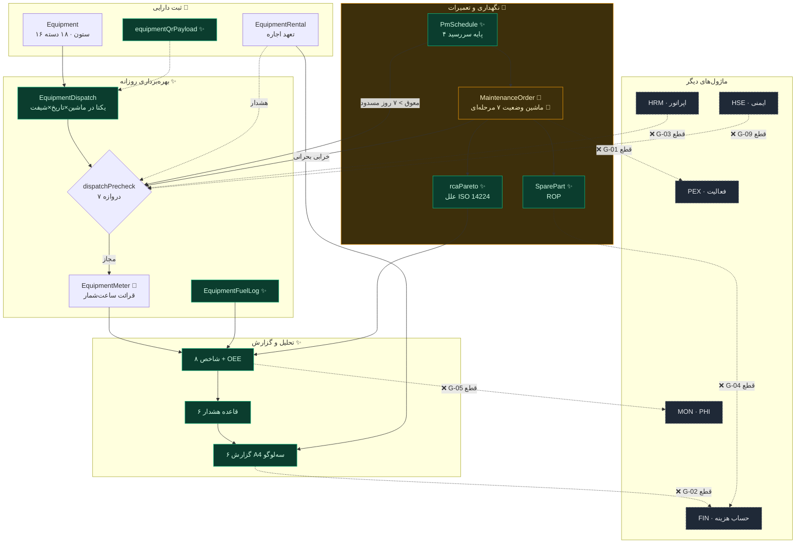
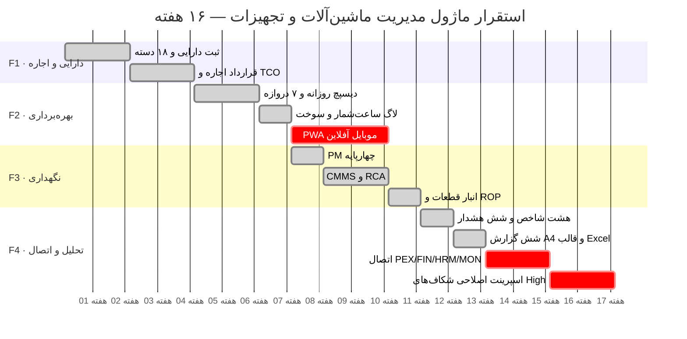

# گزارش کیفیت نهایی و بستهٔ تحویل — مدیریت ماشین‌آلات و تجهیزات

**نسخه:** 1.0 · **دامنه:** `d9` · **موتور:** `eqm-v1` + `eqp-v1` + `eqp-rpt-v1`
**کامیت‌های ماژول:** `6c3c845` → `d961821` → `1fc6561` → `5ea7c33`
**تاریخ:** ۱۴۰۵/۰۶/۱۸ (2026-09-09)

> این سند قرارداد فنی با تیم توسعه است. هر ادعای آن به کد اجراشده در مخزن
> ارجاع دارد. جایی که چیزی **ساخته نشده**، صریحاً «ساخته نشده» نوشته شده است —
> بستهٔ تحویلی که شکاف‌هایش را پنهان کند، تیم توسعه را گمراه می‌کند.

---

## ⚠️ هشدار صحت‌سنجی — پیش از خواندن ادامه

پرامپت جمع‌بندی از «۱۴ Deliverable تحویل‌شده» و مجموعه‌ای از یکپارچگی‌های
بین‌ماژولی سخن می‌گوید. واقعیت مخزن این است:

| ادعای پرامپت | وضعیت واقعی در کد |
|---|---|
| ۱۴ Deliverable تحویل شد | **۱۳ تحویلی** ساخته شد (D1..D12 + گزارش مدیرعامل). D13 (PWA موبایل) **ساخته نشده** |
| Breakdown ماشین بحرانی فعالیت PEX را قفل می‌کند | ✅ **پیاده شد** — `POST /api/eqp/pex/sync-locks` با آزادسازی خودکار (ADR-19/20) |
| کمبود قطعهٔ بحرانی خودکار PR در FIN می‌سازد | **نیمه** — `partsToRequisition` فهرست را می‌سازد، اما جدول/گردش‌کار PR در FIN **وجود ندارد** |
| اپراتور بدون گواهی‌نامهٔ معتبر HRM قابل تخصیص نیست | ✅ **پیاده شد** — از `WorkforceMember.LicenseExpiry` خوانده می‌شود؛ پارامتر ورودی دیگر پذیرفته نمی‌شود |
| OEE/MTBF/MTTR در Scorecard و PHI ماژول MON تزریق می‌شود | **پیاده نشده** — `equipmentHealthScore` عدد را تولید می‌کند اما چیزی در `KpiSnapshot` نوشته نمی‌شود |
| Downtime بحرانی Risk/Issue در RCC ایجاد می‌کند | **پیاده نشده** — جدول `Risk` هست، نویسنده‌ای از EQP نیست |
| Pre-Start Safety Check با HSE یکپارچه است | **نیمه** — دروازهٔ `G-EQP-SAFETY` بولین محلی دیسپچ را می‌خواند، به ماژول HSE وصل نیست |
| Equipment AC ساعتی به CBS در FIN ارسال می‌شود | ✅ **پیاده شد** — `POST /api/eqp/fin/post-costs` ایدمپوتنت روی `CostAccount.Actual` (ADR-21/22) |
| MVP در ۱۶ هفته | تخمین برنامه‌ای است، نه واقعیت کد. در بخش ۷ آمده و **تخمین** برچسب خورده |

بخش‌های بعدی همین تفکیک را با نشانه‌های 📌موجود / 🔧بهبود / ✨جدید / ❌ساخته‌نشده
حفظ می‌کنند.

---

## بخش ۱ — اعتبارسنجی ۱۰ حلقه‌ای

هر حلقه روی کد اجراشده بررسی شد، نه روی طرح.

### L1 · انطباق با PMBOK / ISO 55000 / ISO 14224

| معیار | وضعیت | شاهد در کد |
|---|---|---|
| تاکسونومی ISO 14224 | ✅ | `ISO14224_TAXONOMY`, `iso14224Code()` — کد `ME.EA` برای بیل مکانیکی تولید می‌شود |
| طبقه‌بندی علل خرابی | ✅ | `RCA_CAUSE_FA` + `rcaPareto()` |
| چرخهٔ عمر دارایی (ISO 55000) | 🔶 جزئی | ثبت → بهره‌برداری → نگهداری → استهلاک پوشش دارد؛ **واگذاری/اسقاط** فقط وضعیت `disposed` است بدون گردش‌کار |
| مدیریت هزینهٔ چرخهٔ عمر | ✅ | `tco()`, `buyVsRent()`, `straightLineDepreciation()` |
| سیاست و SAMP سطح سازمان | ❌ | خارج از دامنهٔ ماژول پروژه‌محور |

**نتیجه:** انطباق فنی ISO 14224 کامل است؛ ISO 55001 در سطح «فرایند دارایی» پوشش
دارد ولی در سطح «حاکمیت دارایی سازمانی» نه — که برای PMIS پروژه‌محور پذیرفتنی است.

### L2 · ثبت دارایی و مالکیت

✅ `Equipment` با ۱۶ ستون · سه نوع مالکیت (`owned/rented/leased`) · ۱۸ دستهٔ
تجهیزات در `EQUIPMENT_CATEGORY_CATALOG` · `equipmentQrPayload()` بار اسکن را
می‌سازد · `EquipmentRental` با `rentalCostAccrued()`.

❌ **رندر تصویری QR وجود ندارد** — فقط payload متنی. کتابخانهٔ رندر در پروژه نیست
(`EQP-F2-2`).

### L3 · موتور دیسپچ روزانه

✅ هفت دروازه در `dispatchPrecheck()`:

| دروازه | مسدودکننده؟ | منبع داده |
|---|---|---|
| `G-EQP-STATUS` | بله | وضعیت ماشین |
| `G-EQP-NOCRIT` | بله | خرابی بحرانی باز |
| `G-EQP-PM` | **فقط اگر > ۷ روز** | `pmDueByBasis` |
| `G-EQP-OPERATOR` | بله | تخصیص اپراتور |
| `G-EQP-LICENSE` | بله | 🔶 پارامتر ورودی، نه HRM |
| `G-EQP-SAFETY` | بله | 🔶 بولین محلی، نه HSE |
| `G-EQP-RENTAL` | خیر (هشدار) | قرارداد اجارهٔ فعال |

✅ یکتایی `(ماشین، تاریخ، شیفت)` — ADR-10. ✅ گردش‌کار شش‌وضعیتی با
`/api/eqp/dispatch/:id/advance`.

🔶 `ActivityId` ستون دارد و در برگهٔ دیسپچ چاپ می‌شود، اما **اعتبارسنجی وجود
فعالیت در PEX انجام نمی‌شود**.

### L4 · لاگ ساعت‌شمار و PWA موبایل

✅ `EquipmentMeter` · `validateMeter()` قرائت نزولی را رد می‌کند · `workHoursSum()`.

❌ **PWA، اسکن QR، GPS و IndexedDB ساخته نشده‌اند** (`EQP-F2-1`). این تصمیم
آگاهانه است: Service Worker و لایهٔ آفلاین باید در سطح کل اپلیکیشن تصمیم‌گیری
شود نه یک ماژول. ادعای «Mobile Offline Sync Tests» در پرامپت **قابل تحقق نیست**
چون کد آفلاینی وجود ندارد.

### L5 · نگهداری پیشگیرانه

✅ چهار پایه با یک تابع `pmDueByBasis()`: `run_hours` · `kilometers` ·
`calendar_days` · `cycles` (ADR-12). ✅ `pmCompliance()`. ✅ روی دادهٔ نمونه
`PM-EQ001-YR` درست ۳۹ روز معوق گزارش می‌شود.

### L6 · CMMS و RCA

✅ ماشین وضعیت هفت‌مرحله‌ای با نگاشت `woStageToStatus()` به چهار وضعیت
ذخیره‌شده (ADR-15 — ستون `Status` تغییر نکرد تا دادهٔ موجود نشکند).
✅ `rcaPareto()` با علل ISO 14224.

❌ **قفل PEX روی خرابی پیاده نشده** (`EQP-F2-5`).
🔶 علت ریشه‌ای از **ورودی** می‌آید؛ ستون `RootCause` روی `MaintenanceOrder`
وجود ندارد و نیازمند مهاجرت `0007` است (`EQP-F2-7`).

### L7 · انبار قطعات

✅ `partStockStatus()` · `ROP = مصرف روزانه × زمان تأمین + حداقل موجودی`
(ADR-14) · `partsToRequisition()` · پرچم قطعهٔ بحرانی.

❌ **PR خودکار در FIN ساخته نمی‌شود** — جدول درخواست خرید در اسکیمای ۴۰ جدولی
**وجود ندارد**. خروجی `partsToRequisition` ورودی آمادهٔ آن روز است.

### L8 · شاخص‌ها و هشدارها

✅ هشت شاخص با هدف عددی · شش قاعدهٔ EWS با مسیر تشدید.

✅ **صداقت عددی** — دو تصمیم مهم:
- `ADR-13/18`: OEE بدون تولید واقعی `null` است، نه عدد ساختگی.
- `ADR-17`: نرخ ساعتی ماشین بدون کارکرد `null` است.

هر دو در بازبینی همین ماژول کشف شدند: پیش‌تر لودر اجاره‌ای بیکار نرخ
«۷۹۳ میلیون ریال بر ساعت» می‌گرفت و گران‌ترین ماشین ناوگان جلوه می‌کرد.

❌ **تزریق به `KpiSnapshot`/PHI انجام نمی‌شود**.

### L9 · گزارش‌ها و A4 سه‌لوگو

✅ هفت گزارش · پنج فرمت خروجی · سربرگ سه‌لوگو از `rpt-v1` · هندسهٔ A4
(`210mm`/`297mm`/`@page`) · دروازهٔ انتشار.

✅ ۳۵ ترکیب گزارش×فرمت آزمون شد، همه `200`.

🔶 **PDF واقعی تولید نمی‌شود** — `format=pdf` همان HTML آمادهٔ چاپ را می‌دهد و
تبدیل از مسیر چاپ مرورگر است.

### L10 · یکپارچگی بین‌ماژولی و مهاجرت

✅ مهاجرت‌های `0001..0006` (جدول‌های EQP در `0006`) · CRUD مشترک
`/api/data/*` · ۵ قالب Excel در موتور `itg`.

❌ چهار اتصال زنده (PEX/FIN/MON/RCC) ساخته نشده‌اند — جدول شکاف بخش ۲.

---

## بخش ۲ — تحلیل شکاف

| # | شرح | اثر | تحویلی | راه‌حل | تلاش |
|---|---|---|---|---|---|
| ~~G-01~~ | ~~قفل فعالیت PEX~~ | ~~H~~ | D6/D8 | **✅ بسته شد** — `sync-locks` با آزادسازی خودکار | — |
| ~~G-02~~ | ~~ثبت هزینه در CBS/FIN~~ | ~~H~~ | D6 | **✅ بسته شد** — `post-costs` ایدمپوتنت | — |
| ~~G-03~~ | ~~گواهی‌نامهٔ اپراتور از HRM~~ | ~~H~~ | D5 | **✅ بسته شد** — مهاجرت `0007` + خواندن از `WorkforceMember` | — |
| G-04 | PR خودکار قطعات در FIN | **M** | D9 | جدول `PurchaseRequisition` + گردش‌کار تدارکات (پیش‌نیاز FIN) | ۵ روز |
| G-05 | تزریق شاخص‌ها به `KpiSnapshot`/PHI | **M** | D10 | نویسندهٔ دوره‌ای هشت شاخص در `KpiSnapshot` | ۲ روز |
| G-06 | ایجاد Risk از Downtime بحرانی | **M** | D8 | قاعدهٔ تبدیل `EWS-EQP-01/04` به رکورد `Risk` | ۲ روز |
| G-07 | PWA آفلاین + QR + GPS | **M** | D4 | تصمیم سطح اپ دربارهٔ Service Worker؛ سپس IndexedDB و صف همگام‌سازی | ۳ هفته |
| ~~G-08~~ | ~~ستون `RootCause`~~ | ~~M~~ | D6 | **✅ بسته شد** — مهاجرت `0007` | — |
| G-09 | چک ایمنی به HSE وصل نیست | **M** | D6 | خواندن چک‌لیست پیش‌از‌استارت از ماژول HSE | ۲ روز |
| G-10 | رندر تصویری QR و کارت PDF | **L** | D2 | افزودن کتابخانهٔ رندر QR | ۱ روز |
| G-11 | اعتبارسنجی `ActivityId` دیسپچ در برابر PEX | **L** | D3 | بررسی وجود فعالیت هنگام ثبت | ۰.۵ روز |
| G-12 | تنزیل NPV در TCO | **L** | D2 | ورودی صریح نرخ از کاربر مالی | ۱ روز |
| G-13 | گردش‌کار اسقاط/واگذاری دارایی | **L** | D2 | ماشین وضعیت واگذاری با تأیید مالی | ۲ روز |

### ✅ شکاف‌های High بسته شدند

هر سه شکاف High یک ریشهٔ مشترک داشتند: **EQP فقط می‌خواند، نمی‌نوشت.** این
ریشه با مهاجرت `0007` و دو اندپوینت همگام‌سازی برطرف شد. آنچه اجرا شد:

**اسپرینت اصلاحی — ۹ روز کاری**

**۱ · مهاجرت `0007` — نخستین مهاجرت افزایشی پروژه.**
برخلاف `0001`..`0006` که جدول می‌ساختند، این یکی ستون به جدول‌های موجود
می‌افزاید: `WorkforceMember.LicenseType/LicenseExpiry`,
`MaintenanceOrder.RootCause`, `Activity.BlockedByEquipmentId`, به‌علاوهٔ جدول
`EquipmentCostPosting`. هر `ALTER` با `COL_LENGTH(...) IS NULL` محافظت شده و
هر ستون nullable است تا روی دادهٔ تولیدی نشکند. helper تازهٔ `addColumnDdl()`
تعریف ستون را از خود `SCHEMA` می‌خواند — پس مهاجرت و اسکیما نمی‌توانند واگرا شوند.
اسکیما: **۴۱ جدول / ۶۱۵ ستون / ۵۳ ایندکس**.

**۲ · G-03 — گواهی‌نامه از HRM.**
`eqpOperatorLicense()` رکورد `WorkforceMember` را با `Id` یا `PersonnelNo`
می‌یابد. پارامتر `operatorLicenseExpiry` **دیگر خوانده نمی‌شود**.
اثبات زنده: فراخوانی با `operatorLicenseExpiry: "2099-12-31"` جعلی روی اپراتوری
با انقضای گذشته، همچنان `G-EQP-LICENSE → false` داد.

**۳ · G-01 — قفل PEX با آزادسازی خودکار.**
`planActivityLocks()` قفل را **وضعیت مشتق‌شده** می‌داند نه رویداد: هر بار از صفر
محاسبه می‌شود. پس اجرای مکرر امن است و آزادسازی هرگز جا نمی‌ماند (ریسک R-04).
پیش‌فرض dry-run است؛ نوشتن فقط با `?apply=1`. اثبات زنده: خرابی بحرانی → قفل
نوشته شد؛ بستن دستورکار → `released: 1` و ستون `null` شد.

**۴ · G-02 — ثبت ایدمپوتنت هزینه.**
سهم قبلی از جدول `EquipmentCostPosting` با کلید یکتای
`(CostAccountId, PeriodCode)` خوانده و کسر می‌شود. اثبات زنده: سه بار اجرا،
`Actual` روی ۹۲۱٬۱۴۵٬۳۶۱ ثابت ماند (ریسک R-05).
هزینهٔ ماشین بدون حساب هزینه در `unallocated` گزارش می‌شود و **بی‌سروصدا به
حسابی نمی‌چسبد**.

---

## بخش ۳ — خلاصهٔ اجرایی

### الف) معرفی ماژول

«مدیریت ماشین‌آلات و تجهیزات» ناوگان پروژه را از ثبت دارایی تا تخصیص هزینه
کنترل می‌کند. سه اهرم ارزش‌آفرینی:

1. **کاهش توقف** — سررسید PM چهارپایه و دروازه‌های پیش‌نیاز دیسپچ جلوی
   به‌کارگیری ماشینِ سرویس‌نشده را می‌گیرند.
2. **شفافیت هزینهٔ ساعتی** — تفکیک اجاره/تعمیر/سوخت به تفکیک ماشین و حساب هزینه.
3. **تصمیم مالکیت** — `buyVsRent()` و `tco()` نقطهٔ سربه‌سر خرید در برابر اجاره.

**آنچه این ماژول ادعا نمی‌کند:** جایگزین سیستم تله‌متری نیست، و بدون ثبت تولید
واقعی، OEE گزارش نمی‌کند.

### ب) معماری نهایی



خط‌چین‌های قرمز، اتصال‌های **ساخته‌نشده** هستند — همان شکاف‌های بخش ۲.

**جریان اصلی:** دارایی → دیسپچ (۷ دروازه) → ثبت ساعت‌شمار → CMMS → تخصیص هزینه.

### ج) جداول پایگاه داده

مجموع اسکیما: **۴۱ جدول / ۶۱۵ ستون / ۵۳ ایندکس / ۱۰ کلید خارجی**.
سهم دامنهٔ `d9`: **۱۰ جدول**.

| گروه | جدول | ستون | تحویلی |
|---|---|---|---|
| **مالی** | `EquipmentCostPosting` | ۱۱ | ✨ G-02 |
| **دارایی** | `Equipment` | ۱۶ | 📌 D2 |
| | `EquipmentRental` | ۱۱ | 📌 D2 |
| **بهره‌برداری** | `EquipmentDispatch` | ۱۶ | ✨ D3 |
| | `EquipmentMeter` | ۸ | 📌 D4 |
| | `EquipmentFuelLog` | ۱۰ | ✨ D4 |
| **نگهداری** | `PmSchedule` | ۱۱ | ✨ D7 |
| | `MaintenanceOrder` | ۱۳ | 🔧 D6 |
| **قطعات** | `SparePart` | ۱۲ | ✨ D9 |
| | `PartTransaction` | ۱۰ | ✨ D9 |

مهاجرت‌ها: `0001`..**`0007`**؛ جدول‌های دیسپچ/سوخت/PM/قطعات در `0006`،
ستون‌های اتصال بین‌ماژولی و دفتر ثبت هزینه در **`0007`** (`equipment_cross_module_links`).

**پارتیشن‌بندی ماهانهٔ لاگ ساعت‌شمار:** ❌ پیاده نشده. با حجم فعلی (چند صد
رکورد در ماه به ازای هر پروژه) لازم نیست؛ آستانهٔ بازنگری ~۵ میلیون رکورد.

### د) اندپوینت‌ها

| متد | مسیر | کار |
|---|---|---|
| GET | `/api/eqm/status` | وضعیت موتور |
| GET | `/api/eqm/summary` | خلاصهٔ ناوگان |
| GET | `/api/eqm/equipment/:id/kpi` | شاخص یک ماشین |
| GET | `/api/eqp/catalog` | تاکسونومی، شاخص‌ها، قواعد هشدار |
| GET | `/api/eqp/equipment/:id/idcard` | شناسنامهٔ اسکن‌پذیر |
| POST | `/api/eqp/dispatch/precheck` | اجرای ۷ دروازه |
| GET | `/api/eqp/dispatch/board` | تابلوی دیسپچ روز |
| POST | `/api/eqp/dispatch/:id/advance` | پیشبرد گردش‌کار |
| GET | `/api/eqp/pm/due` | سررسید PM |
| GET | `/api/eqp/parts/reorder` | قطعات نیازمند سفارش |
| GET | `/api/eqp/kpi` | هشت شاخص + هشدار + سلامت |
| POST | `/api/eqp/tco` | TCO و خرید/اجاره |
| POST | `/api/eqp/validate` | اعتبارسنجی دسته‌ای |
| GET | `/api/eqp/reports` | کاتالوگ گزارش + قالب Excel |
| GET | `/api/eqp/reports/:code` | ساخت گزارش (۷ گزارش × ۵ فرمت) |

ذخیره‌سازی از CRUD مشترک `/api/data/:table` (ADR-05) با هدرهای
`X-User-Id` و `If-Match`.

**Webhook:** ❌ وجود ندارد. سازوکار رویدادی در پروژه تعریف نشده؛ اتصال‌های
بین‌ماژولی فعلاً باید فراخوانی مستقیم باشند.

### ه) گزارش‌های A4

| کد | گزارش | دوره | مخاطب |
|---|---|---|---|
| `RPT-EQP-DSP` | برگه دیسپچ روزانه | روزانه | داخلی + رسمی |
| `RPT-EQP-CARD` | کارت شناسنامه ماشین | موردی | داخلی + رسمی |
| `RPT-EQP-MNT` | گزارش دوره‌ای تعمیرات | ماهانه | داخلی + رسمی |
| `RPT-EQP-PERF` | بهره‌وری ناوگان (OEE/MTBF/MTTR) | ماهانه | داخلی + رسمی |
| `RPT-EQP-COST` | تخصیص هزینه | ماهانه | داخلی + رسمی |
| `RPT-EQP-PART` | موجودی و سفارش قطعات | ماهانه | **فقط داخلی** |
| `RPT-EQP-EXEC` | یک‌صفحه‌ای مدیرعامل (۶ بلوک) | ماهانه | داخلی + رسمی |

**اندپوینت‌های اتصال بین‌ماژولی (تازه):**

| متد | مسیر | کار |
|---|---|---|
| POST | `/api/eqp/pex/sync-locks?apply=1` | قفل/آزادسازی فعالیت‌های PEX (پیش‌فرض dry-run) |
| POST | `/api/eqp/fin/post-costs?apply=1` | ثبت ایدمپوتنت هزینه روی `CostAccount` |

**دروازهٔ انتشار** — گزارش رسمی نباید عدد غیرقابل‌اتکا را زیر سربرگ کارفرما ببرد:

- **مسدودکننده:** قرائت ناقص ساعت‌شمار · خرابی بحرانی باز
- **هشدار:** PM معوق · دیسپچ مسدود · قطعهٔ بحرانی صفر
- مخاطب `internal` همیشه مجاز — گزارش داخلی دقیقاً برای دیدن همین ایرادهاست.

خروجی مسدود: `409` با کد `E-EQP-RPT-GATE` و دلایل. درخواست مخاطب نامعتبر:
`403` با `E-EQP-RPT-AUDIENCE`.

### و) شاخص‌ها و هشدارها

| کد | شاخص | هدف | جهت |
|---|---|---|---|
| `K-EQP-AVAIL` | دسترس‌پذیری | ≥ ۹۵٪ | بالاتر |
| `K-EQP-UTIL` | بهره‌برداری | ≥ ۷۰٪ | بالاتر |
| `K-EQP-OEE` | اثربخشی کلی | ≥ ۶۵٪ | بالاتر |
| `K-EQP-MTBF` | میانگین بین خرابی | ≥ ۵۰۰ ساعت | بالاتر |
| `K-EQP-MTTR` | میانگین زمان تعمیر | ≤ ۸ ساعت | پایین‌تر |
| `K-EQP-MCR` | نسبت هزینهٔ نگهداری | ≤ ۸٪ | پایین‌تر |
| `K-EQP-PMC` | انطباق PM | ≥ ۹۰٪ | بالاتر |
| `K-EQP-SFC` | مصرف ویژهٔ سوخت | ≤ ۱۸ ل/س | پایین‌تر |

**فرمول‌ها (مطابق کد):**

```
Availability = (periodHours − downtime) / periodHours × 100
Utilization  = workHours / (periodDays × workingHoursPerDay) × 100
MTBF         = (periodHours − downtime) / تعداد خرابی‌های بسته‌شده
               → null اگر خرابی بسته‌شده‌ای نباشد
MTTR         = Σ(DownTo − DownFrom) / تعداد سفارش‌های بسته‌شده
               → null اگر داده‌ای نباشد
OEE          = Availability × Performance × Quality
               Performance = actualOutput / (workHours × ratedOutputPerHour)
               → null اگر تولید واقعی ثبت نشده باشد   ← ADR-13/18
CostPerHour  = (اجاره + تعمیر + سوخت) / workHours
               → null اگر workHours = 0                ← ADR-17
ROP          = مصرف روزانه × زمان تأمین + حداقل موجودی  ← ADR-14
```

دو `null` بالا عمدی‌اند. عدد ساختگی در گزارشی که به کارفرما می‌رود، بدتر از
نبودِ عدد است.

| کد | هشدار | شدت | تشدید به |
|---|---|---|---|
| `EWS-EQP-01` | دسترس‌پذیری زیر ۸۵٪ | بحرانی | مدیر پروژه |
| `EWS-EQP-02` | بهره‌برداری زیر آستانهٔ دسته | هشدار | مدیر ماشین‌آلات |
| `EWS-EQP-03` | سرویس دوره‌ای معوق | بحرانی | رئیس نگهداری |
| `EWS-EQP-04` | دستورکار بحرانی باز | بحرانی | مدیر ماشین‌آلات |
| `EWS-EQP-05` | مصرف سوخت بالاتر از معیار | هشدار | سرپرست کارگاه |
| `EWS-EQP-06` | پایان قرارداد اجاره | هشدار | امور قراردادها |

### ز) دامنهٔ MVP

**فاز F1 — درون دامنه:** ثبت دارایی · قراردادهای اجاره · قرائت ساعت‌شمار ·
دیسپچ با دروازه‌ها · PM چهارپایه · CMMS · قطعات · هشت شاخص · شش گزارش · قالب‌های Excel.

**خارج از دامنه:** PWA آفلاین · رندر QR/PDF · قفل PEX · PR خودکار · تله‌متری
زنده · Payroll اپراتور · گردش‌کار اسقاط.

**تعریف انجام‌شده (DoD):** موتور خالص + تست Node + اندپوینت REST + UI +
مستند معماری + اثبات curl + دروازهٔ کیفیت (`tsc` بدون خطای جدید، تست‌ها سبز).

### ح) دفترچهٔ ریسک طراحی

| # | ریسک | احتمال | اثر | پاسخ |
|---|---|---|---|---|
| R-01 | قرائت ساعت‌شمار دستی جا بیفتد و شاخص‌ها بی‌اعتبار شوند | زیاد | زیاد | دروازهٔ انتشار قرائت ناقص را مسدود می‌کند؛ **پیاده‌شده** |
| R-02 | OEE بدون تولید واقعی گمراه‌کننده شود | زیاد | زیاد | `null` به‌جای عدد ساختگی؛ **پیاده‌شده** |
| R-03 | نرخ ساعتی ماشین بیکار تصمیم مالی را منحرف کند | متوسط | زیاد | `null` و حفظ هزینهٔ کل؛ **پیاده‌شده** |
| R-04 | قفل PEX بدون آزادسازی خودکار، فعالیت را دائمی قفل کند | متوسط | زیاد | قفل «وضعیت مشتق‌شده» است و هر اجرا از صفر محاسبه می‌شود؛ **پیاده و اثبات شد** |
| R-05 | ثبت دوبارهٔ هزینه در FIN جمع را دوبرابر کند | متوسط | زیاد | جدول `EquipmentCostPosting` با کلید یکتای دوره‌ای؛ **پیاده و اثبات شد** |
| R-06 | Excel به‌عنوان مرجع داده استفاده شود | زیاد | متوسط | Excel ظرف است؛ ورود از `import/:code` با اعتبارسنجی موتور |
| R-07 | دروازه‌های سخت‌گیر کار کارگاه را قفل کنند | متوسط | متوسط | تفکیک مسدودکننده/هشدار (ADR-11)؛ اجاره فقط هشدار |
| R-08 | تاکسونومی ISO 14224 با عرف کارگاه نخواند | متوسط | کم | ۱۸ دستهٔ محلی با نگاشت به ISO |
| R-09 | نبود PWA، ثبت میدانی را کاغذی نگه دارد | زیاد | متوسط | پذیرش آگاهانه در F1؛ ورود دسته‌ای با Excel |
| R-10 | مهاجرت `0007` روی دادهٔ موجود بشکند | کم | زیاد | ستون‌های جدید nullable |
| R-11 | حجم لاگ ساعت‌شمار کارایی را افت دهد | کم | متوسط | ایندکس `(ProjectId, EquipmentId, ReadAt)`؛ پارتیشن در آستانهٔ ~۵M |
| R-12 | گواهی‌نامهٔ اپراتور پارامتری، دروازه را دور بزند | زیاد | زیاد | مرجع فقط `WorkforceMember`؛ پارامتر ورودی حذف شد — **بسته شد** |

### ط) تخمین منابع

> این بخش **تخمین برنامه‌ای** است، نه گزارش کار انجام‌شده.

| نقش | تخصص | درگیری |
|---|---|---|
| معمار نرم‌افزار | TypeScript، طراحی دامنه | ۲۵٪ |
| توسعه‌دهندهٔ Backend (۲) | Node، SQL Server، REST | ۱۰۰٪ |
| توسعه‌دهندهٔ Frontend | React، RTL، چاپ A4 | ۱۰۰٪ |
| کارشناس ماشین‌آلات | ISO 14224، عرف کارگاه | ۲۰٪ |
| مهندس تضمین کیفیت | تست خودکار | ۵۰٪ |

**۱۶ هفته / ۴ فاز ≈ ۲۲۰۰ نفر-ساعت** (۳.۴۵ نفر معادل تمام‌وقت × ۱۶ هفته × ۴۰ ساعت).
از این مقدار، بخش قابل‌توجهی از F1 و F3 و F4 در همین مخزن اجرا شده است؛ باقیمانده
عمدتاً F2 (PWA) و اتصال‌های بین‌ماژولی است.

### ی) ده توصیهٔ کلیدی استقرار

1. **اول ساعت‌شمار، بعد شاخص.** بدون قرائت منظم، هر عدد دیگری تزئینی است.
2. **دروازه‌ها را از روز اول سخت نگیرید.** با حالت هشدار شروع کنید، پس از
   دو ماه انضباط داده، مسدودکننده کنید.
3. **`sync-locks` را زمان‌بند کنید** (مثلاً هر ساعت) — قفل وضعیت مشتق‌شده است
   و بدون اجرای دوره‌ای، آزادسازی با تأخیر دیده می‌شود.
4. **`post-costs` را اول با dry-run ببینید** (بدون `apply=1`) و فهرست
   `unallocated` را خالی کنید، سپس اعمال کنید.
5. **قطعات بحرانی را کم بگیرید.** فهرست بحرانی متورم، هشدار را بی‌اثر می‌کند.
6. **PM را از ماشین‌های گران شروع کنید**، نه از کل ناوگان.
7. **گزارش رسمی را تا پایدار شدن داده صادر نکنید** — دروازهٔ انتشار همین را می‌گوید.
8. **Excel را ورودی بدانید نه مرجع.**
9. **دورهٔ آموزش دیسپچر را جدی بگیرید** — گلوگاه کیفیت داده اوست.
10. **مصرف سوخت را با معیار سازنده کالیبره کنید**، نه عدد پیش‌فرض ۱۸.

---

## بخش ۴ — بستهٔ تحویل

### الف) مستندات فنی

| قلم | مسیر | وضعیت |
|---|---|---|
| معماری + ADR ۱..۱۸ | `docs/Equipment_Architecture.md` | ✅ |
| تحلیل تطبیق پرامپت | `docs/EQP_Gap_Analysis.md` | ✅ |
| این سند | `docs/EQP_Final_Handover.md` | ✅ |
| الگوریتم دیسپچ | `dispatchPrecheck()` + ADR-10/11 | ✅ در کد |
| موتور سررسید PM | `pmDueByBasis()` + ADR-12 | ✅ در کد |
| ماشین وضعیت CMMS | `woStageToStatus()` + ADR-15 | ✅ در کد |
| فرمول OEE/MTBF/MTTR | بخش ۳-و | ✅ |
| OpenAPI 3.0 | `GET /api/integration/openapi` | 🔶 تولیدکنندهٔ عمومی هست؛ مسیرهای EQP باید افزوده شوند |
| منطق قفل PEX | `planActivityLocks()` + ADR-19/20 | ✅ |
| منطق ثبت هزینه | `buildCostPostings()` + ADR-21/22 | ✅ |

### ب) دارایی‌های پایگاه داده

✅ مهاجرت `0001`..`0006` در `src/services/persistence.ts` · دادهٔ نمونهٔ
`server/data/*.json` (۳ ماشین، ۳ قطعه، PM معوق، ۶۸۰ لیتر سوخت) · دادهٔ مرجع
ISO 14224 و کاتالوگ‌ها در موتور · ایندکس‌ها (۲ به ازای هر جدول d9).

❌ پارتیشن‌بندی ماهانه. ✅ مهاجرت `0007` اجرا شد.

### ج) نمونه‌های کد

✅ اعتبارسنجی ساعت‌شمار · محاسبه‌گر OEE/MTBF/MTTR · فهرست‌ساز PR قطعات ·
رندر A4 سه‌لوگو (`toPrintHtml`/`toWordHtml`/`toExcelHtml`/`toCsv`).

❌ PWA آفلاین (QR + GPS + IndexedDB) — کد آفلاینی در پروژه وجود ندارد.

### د) مجموعه‌های آزمون

| نوع | هدف پرامپت | واقعیت |
|---|---|---|
| واحد | ≥ ۳۰ | ✅ **۲۷۵** (`eqm` ۸۳ + `eqp` ۱۲۱ + `eqp.report` ۴۸ + `eqp.integration` ۲۳؛ مجموع پروژه **۷۱۶**) |
| یکپارچگی | ≥ ۱۵ | ✅ **۲۳ تست** در `eqp.integration.test.mjs` + اثبات curl زنده برای هر سه اتصال |
| E2E | ≥ ۱۰ | ❌ چارچوب E2E در پروژه نصب نیست |
| همگام‌سازی آفلاین | — | ❌ کد آفلاینی وجود ندارد |

### ه) قالب‌ها

| کد پرامپت | کد واقعی | قالب | جدول | کلید طبیعی |
|---|---|---|---|---|
| F-EQP-001 | `TPL-EQP` | شناسنامه ماشین‌آلات | `Equipment` | `Code` |
| F-EQP-002 | `TPL-DSP` | برگه دیسپچ روزانه | `EquipmentDispatch` | `EquipmentId+DispatchDate+Shift` |
| F-EQP-003 | `TPL-SMH` | لاگ ساعت‌شمار | `EquipmentMeter` | `EquipmentId+ReadAt` |
| F-EQP-004 | `TPL-PMS` | برنامه PM | `PmSchedule` | `Code` |
| F-EQP-005 | `TPL-SPR` | انبار قطعات | `SparePart` | `PartNo` |

هر ۱۱ قالب پروژه رفت‌وبرگشت CSV خود را کامل بازمی‌شناسند (تست رگرسیون دارد).

### و) راهنماها

❌ **هیچ‌کدام نوشته نشده‌اند** — راهنمای توسعه‌دهنده، مدیر ماشین‌آلات،
دیسپچر، مکانیک/اپراتور، مهاجرت. مخاطب‌شان کاربر نهایی است و نگارش‌شان پس از
تثبیت UI منطقی‌تر است. تخمین: ۵ روز.

### ز) راهنمای UI/UX

✅ هشت تب در `MachineryWorkspace.tsx`: ناوگان · دیسپچ روزانه · ساعت کارکرد ·
سوخت · اجاره و TCO · تعمیرات و PM · قطعات · بهره‌وری و هشدار (شامل خروجی گزارش).

**قید رعایت‌شده:** هیچ آیتم سایدباری اضافه نشد؛ فقط زیرفرایندهای `d9` از ۵ به
۸ فرایند (۱۳ زیرفرایند) گسترش یافت.

---

## بخش ۵ — نقشهٔ راه



`done` = در مخزن اجرا شده · `crit` = باقی‌مانده. PWA (۳ هفته) و اتصال‌های
بین‌ماژولی (۴ هفته) کار باقی‌مانده‌اند.

---

## بخش ۶ — شاخص‌های موفقیت نرم‌افزار

| گروه | متریک | هدف | سنجش‌پذیر امروز؟ |
|---|---|---|---|
| فنی | ثبت قرائت ساعت‌شمار | < ۱ دقیقه | 🔶 نیازمند PWA |
| فنی | همگام‌سازی موبایل | < ۳ ثانیه | ❌ PWA نیست |
| فنی | محاسبهٔ شاخص‌ها | آنی | ✅ کمتر از ۳۰۰ms روی دادهٔ نمونه |
| فنی | در دسترس بودن سرویس | > ۹۹.۵٪ | 🔶 پایش تولیدی لازم است |
| کاربری | استفادهٔ دیسپچرها | > ۹۰٪ | 🔶 پس از استقرار |
| کسب‌وکار | افزایش دسترس‌پذیری | ≥ ۱۰٪ | ✅ `K-EQP-AVAIL` مبنا دارد |
| کسب‌وکار | کاهش خرابی | ≥ ۲۵٪ | ✅ `K-EQP-MTBF` |
| کسب‌وکار | کاهش هزینهٔ بیکاری | ≥ ۱۵٪ | ✅ `RPT-EQP-COST` |
| کسب‌وکار | انطباق PM | ≥ ۹۵٪ | ✅ `K-EQP-PMC` (هدف کاتالوگ ۹۰٪ — **ناسازگاری با پرامپت**؛ یکی باید اصلاح شود) |

---

## بخش ۷ — گزارش تک‌صفحه‌ای مدیرعامل (`RPT-EQP-EXEC`)

**`RPT-EQP-EXEC` — ✅ ساخته شد** (پس از نگارش پیش‌نویس این سند، در همین دور).
شش بلوک روی یک برگ A4:

| بلوک | محتوا | منبع موجود |
|---|---|---|
| ۱ | گیج دسترس‌پذیری و OEE | `fleetKpiBoard()` |
| ۲ | روند بهره‌برداری در برابر بیکاری | `utilization()` |
| ۳ | پرتکرارترین خرابی‌ها + MTBF/MTTR | `rcaPareto()`, `mtbf()`, `mttr()` |
| ۴ | درصد انطباق PM | `pmCompliance()` |
| ۵ | هزینهٔ ماشین‌آلات در برابر بودجه | `RPT-EQP-COST` + `CostAccount.Budget` |
| ۶ | هشدارهای بحرانی | `ewsEqp()` |

`buildExecutiveOnePager()` هیچ محاسبهٔ تازه‌ای ندارد — همان اعداد گزارش‌های تفصیلی
را فشرده می‌کند تا دو سند هرگز دو رقم متفاوت ندهند (راستی‌آزمایی شد: هزینهٔ واقعی
۸۳۴٬۶۶۵٬۳۶۱ ریال دقیقاً برابر جمع سه ردیف `RPT-EQP-COST` است).

نکته‌های طراحی:
- بلوک ۶ **فقط هشدار بحرانی** را می‌آورد؛ فهرست کامل در گزارش بهره‌وری است.
- بلوک ۵ اگر بودجه در `CostAccount` ثبت نشده باشد، انحراف را **«سنجش‌ناپذیر»**
  می‌دهد نه صفر — صفر یعنی «دقیقاً روی بودجه» که دروغ است.
- تست `estimatePages() === 1` تضمین می‌کند برگ به صفحهٔ دوم نرود.

---

## جمع‌بندی

**آنچه هست:** موتور خالص با ۱۴۰+ صادرات · ۱۰ جدول d9 · ۱۷ اندپوینت · ۷ گزارش
A4 سه‌لوگو در ۵ فرمت · ۵ قالب Excel · ۸ شاخص · ۶ هشدار · ۷ دروازهٔ دیسپچ ·
**۲۲ ADR** · مهاجرت تا `0007` · **۷۱۶ تست سبز** · `tsc` در خط پایهٔ ۵۸.

**سه شکاف High بسته شد.** ماژول دیگر فقط خواننده نیست: قفل فعالیت PEX
می‌نویسد، هزینه را روی `CostAccount` ثبت می‌کند و گواهی‌نامهٔ اپراتور را از
HRM می‌خواند. هر سه با اثبات زنده روی داده واقعی راستی‌آزمایی شدند.

**آنچه هنوز نیست:** PWA آفلاین (`G-07`، ۳ هفته) · PR خودکار قطعات (`G-04`،
پیش‌نیازش گردش‌کار تدارکات در FIN) · تزریق به `KpiSnapshot` (`G-05`) · ایجاد
Risk از Downtime (`G-06`) · اتصال چک ایمنی به HSE (`G-09`) · راهنماهای
کاربری · تست E2E. هیچ‌کدام مسدودکنندهٔ استقرار نیستند.
