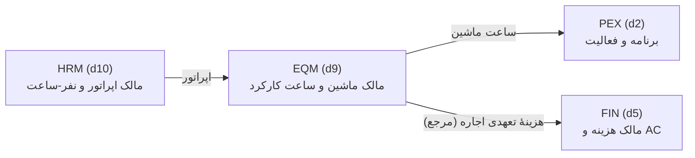

# EQM — معماری ماژول «مدیریت ماشین‌آلات و تجهیزات»

نسخه ۱.۰ | 2026-09-09 | حالت: ماژول جدید (New Module) | دامنه `d9` | موتور `eqm-v1`

> **اصول ثابت این ماژول:**
> ۱) EQM مالک «ساعت ماشین» است، نه مالک «هزینه» — نرخ‌گذاری اجاره و ثبت AC در FIN انجام می‌شود؛
> EQM فقط هزینهٔ تعهدی اجاره و هزینه/ساعت را برای تصمیم‌گیری محاسبه می‌کند.
> ۲) ساعت‌شمار هر ماشین **صعودی** است؛ عقب‌رفت با `E-EQM-METER-ROLLBACK` رد می‌شود.
> ۳) بهره‌برداری و دسترس‌پذیری از دادهٔ ثبت‌شده مشتق می‌شوند، نه اعلام شفاهی.
> ۴) موتور خالص است — بدون I/O، «اکنون» تزریق می‌شود، تاریخ‌ها ISO.
> ۵) ذخیره‌سازی از راه CRUD عمومی `/api/data/*` روی چهار جدول sql-v1 انجام می‌شود.

---

## ۱. تحلیل وضعیت موجود (As-Is)

| دارایی موجود | مسیر | ارزیابی برای EQM |
|---|---|---|
| ویجت «اجاره ماشین‌آلات» | `src/FinanceWorkspace.tsx:910` | عدد نمایشی؛ نه قرارداد، نه نرخ، نه دوره |
| یادداشت «لجستیک تجهیزات سنگین» | `src/ProjectControl.tsx:542` (کلید `machineryLogistics`) | ورودی متنی آزاد؛ بدون ساختار و بدون KPI |
| تحلیل «اجاره ماشین‌آلات و دستمزد» | `src/FinanceWorkspace.tsx:438` | متن توصیفی در EVM؛ ورودی عددی ندارد |
| رستهٔ «اپراتور ماشین‌آلات» در HRM | `src/services/workforce.ts` → `EQP-CRN … EQP-CMP` | ✅ اپراتور به ماشین قابل پیوند است؛ EQM مالک ماشین است، HRM مالک نفر |
| بار منابع در PEX | `docs/PEX_D8_Resources.md` | سطح‌بندی منابع ساده؛ GPS تجهیزات فاز بعد |

**شکاف‌ها:** نه فهرست ماشین هست، نه ساعت‌شمار، نه قرارداد اجارهٔ ساخت‌یافته، نه دستورکار تعمیر، نه MTBF/MTTR و نه بهره‌برداری.

## ۲. مرزهای مالکیت

## ۳. مدل داده (sql-v1 · مهاجرت `0005`)

| جدول | نقش | ستون‌های کلیدی |
|---|---|---|
| `Equipment` | ثبت ناوگان | ProjectId, Code, NameFa, Category, Ownership, Status, Year, Capacity, CommissionedAt, PurchaseValue, SalvageValue |
| `EquipmentMeter` | ساعت کارکرد | EquipmentId, ReadAt, HourMeter, WorkHours, Source |
| `EquipmentRental` | قرارداد اجاره | EquipmentId, Supplier, ContractNo, RateType, Rate, StartDate, EndDate, Status |
| `MaintenanceOrder` | دستورکار تعمیر | EquipmentId, Code, Kind, Priority, DownFrom, DownTo, Status, Cost |

- ۴ جدول / ۴۶ ستون / ۸ ایندکس به ۳۵ جدول و ۵۱۱ ستون پیشین افزوده می‌شود.
- کلیدهای یکتا: `UX_Equipment_Code`, `UX_EquipmentMeter`, `UX_EquipmentRental_Contract`, `UX_MaintenanceOrder_Code`.

## ۴. تصمیم‌های معماری (ADR)

| # | تصمیم | دلیل |
|---|---|---|
| ADR-01 | موتور خالص `src/services/equipment.ts` با `build:eqm` (esbuild) | منطق تست‌پذیر، بدون وابستگی به HTTP/فایل |
| ADR-02 | دامنه `d9` — عدد خالی بین d8 و d10 | هم‌ردیف QMS/HRM بدون برخورد کد |
| ADR-03 | «اکنون» تزریق می‌شود (`nowIso`) | تست قطعی، بدون `Date.now` پنهان |
| ADR-04 | تاریخ ISO و نمایش شمسی در UI | جدا شدن نگرانی رندر از منطق |
| ADR-05 | ذخیره روی sql-v1 از مسیر عمومی `/api/data/*` | یک CRUD واحد، بدون endpoint ذخیرهٔ تکراری |
| ADR-06 | KPI/EWS روی endpoint اختصاصی `/api/eqm/*` | محاسبه سنگین از CRUD جدا می‌ماند |
| ADR-07 | ماه اجاره = ۳۰.۴۴ روز (متوسط) | تعهدی ساده و قابل تکرار؛ تقویم دقیق فاز بعد |
| ADR-08 | PM دوره‌ای پیش‌فرض ۹۰ روزه | بدون ستون فاصلهٔ PM در v1؛ پارامتر endpoint است |

## ۵. کدهای مسئله و هشدار

**اعتبارسنجی:** `E-EQM-REQUIRED`, `E-EQM-CATEGORY`, `E-EQM-OWNERSHIP`, `E-EQM-STATUS`, `E-EQM-YEAR`, `E-EQM-CAPACITY`, `E-EQM-METER`, `E-EQM-METER-ROLLBACK`, `E-EQM-SOURCE`, `E-EQM-RATE`, `E-EQM-RATE-TYPE`, `E-EQM-DATE-RANGE`, `E-EQM-KIND`, `E-EQM-PRIORITY`, `E-EQM-MSTATUS`.

**هشدار (EWS):** `W-EQM-IDLE`, `W-EQM-LOW-UTIL`, `W-EQM-DOWNTIME`, `W-EQM-BACKLOG`, `W-EQM-PM-DUE`, `W-EQM-RENT-EXPIRY`, `W-EQM-AGING`.

## ۶. سطح API

| مسیر | خروجی |
|---|---|
| `GET /api/eqm/status` | نسخه، دامنه، تعداد دسته‌ها، جدول‌ها |
| `GET /api/eqm/summary?projectId=` | `fleetSummary`: شمارش، میانگین بهره‌برداری/دسترس‌پذیری، معوقات، اجارهٔ تعهدی، تعداد هشدار |
| `GET /api/eqm/equipment/:id/kpi?projectId=` | سن، استهلاک، بهره‌برداری، دسترس‌پذیری، هزینه/ساعت، MTTR، سررسید PM، هشدارها |
| `GET/POST/PATCH/DELETE /api/data/{Equipment,EquipmentMeter,EquipmentRental,MaintenanceOrder}` | CRUD عمومی sql-v1 |

## ۷. شکاف‌ها و فازهای بعد (F2)

| # | شکاف | جهت |
|---|---|---|
| EQ-1 | GPS/تله‌متری زنده | اتصال‌دهندهٔ IoT در مرکز یکپارچه‌سازی |
| EQ-2 | تقویم دقیق اجاره (روز کاری در برابر تقویمی) | جایگزینی ADR-07 |
| EQ-3 | فاصلهٔ PM اختصاصی هر ماشین | ستون `PmIntervalDays` در `Equipment` |
| EQ-4 | سوخت و روانکار به‌عنوان ورودی هزینه | جدول `EquipmentFuel` و پیوند به FIN |
| EQ-5 | اتصال دستورکار به Activity (شارژ ساعت توقف به PEX) | کلید `ActivityId` در `MaintenanceOrder` |

---

# بخش دوم — افزونهٔ EQP (نسخه ۱.۱ · 2026-09-09)

انطباق با پراممپت «MACHINERY & EQUIPMENT MANAGEMENT MODULE (EQP) v1.0». ماژول پایه (`eqm-v1`)
دست‌نخورده ماند و همهٔ امضاهای قبلی سازگار عقب‌رو هستند؛ افزونه در همان فایل موتور با پیشوند
`EQP_` و توابع جدید اضافه شد. سنجش شکاف در `docs/EQP_Gap_Analysis.md`.

## ۱۰. مدل داده افزوده (مهاجرت `0006` — «equipment_dispatch_cmms»)

| جدول | نقش | کلید یکتا |
|---|---|---|
| `EquipmentDispatch` | برگهٔ دیسپچ روزانه؛ پل به `Activity` (PEX) و `CostAccount` (FIN) | `(EquipmentId, DispatchDate, Shift)` |
| `EquipmentFuelLog` | مصرف گازوئیل، بنزین، روغن، گریس و لاستیک | ایندکس `(EquipmentId, LogDate)` |
| `PmSchedule` | برنامهٔ نگهداری پیشگیرانه چهارپایه | `(ProjectId, Code)` |
| `SparePart` | اقلام انبار قطعات با ROP و نشان بحرانی | `(ProjectId, PartNo)` |
| `PartTransaction` | ورود/خروج قطعه با ارجاع به دستور کار | ایندکس `(PartId, TxnDate)` |

آمار اسکیما پس از `0006`: **۴۰ جدول / ۵۹۵ ستون / ۵۲ ایندکس / ۱۰ کلید خارجی**.

## ۱۱. تصمیمات معماری افزوده

| کد | تصمیم | دلیل |
|---|---|---|
| **ADR-09** | TCO با استهلاک خط مستقیم و بدون تنزیل جریان نقدی | نرخ تنزیل در پروژه‌های ایرانی به‌شدت متغیر است؛ عدد بدون‌تنزیل قابل دفاع‌تر و قابل ممیزی است. تنزیل در فاز F2 با ورودی صریح نرخ. |
| **ADR-10** | یکتایی دیسپچ روی `(ماشین، تاریخ، شیفت)` | جلوگیری از تخصیص هم‌زمان یک ماشین به دو جبههٔ کاری در یک شیفت — خطای رایج کارگاهی. |
| **ADR-11** | دروازه‌های دیسپچ دو‌گانه‌اند: مسدودکننده و هشداردهنده | نبود اپراتور یا ایمنی باید متوقف کند، اما نبود قرارداد اجاره فقط هشدار است تا کار کارگاه قفل نشود. PM معوق تا ۷ روز هشدار و بیش از آن مسدودکننده است. |
| **ADR-12** | سررسید PM بر چهار پایه با یک تابع واحد `pmDueByBasis` | پایه‌های شمارنده‌ای (ساعت/کیلومتر/سیکل) هم‌ریخت‌اند و فقط پایهٔ تقویمی متفاوت است؛ یک تابع از واگرایی منطق جلوگیری می‌کند. |
| **ADR-13** | **OEE بدون تولید واقعی محاسبه نمی‌شود و `null` برمی‌گردد** | فرض ۱۰۰٪ برای مؤلفهٔ «عملکرد» رقم OEE را ساختگی و گمراه‌کننده می‌کند. تولید واقعی از برگه‌های دیسپچ با وضعیت `executed` و حجم ثبت‌شده می‌آید. |
| **ADR-14** | ROP = مصرف روزانه × زمان تأمین + حداقل موجودی | فرمول متعارف مدیریت انبار؛ حداقل موجودی نقش ذخیرهٔ اطمینان را بازی می‌کند و ورودی جداگانه نمی‌خواهد. |
| **ADR-15** | مرحلهٔ CMMS (هفت‌مرحله‌ای) روی وضعیت چهارگانهٔ ذخیره‌شده نگاشت می‌شود | ستون `Status` جدول `MaintenanceOrder` تغییر نکرد تا دادهٔ موجود و اندپوینت‌های قبلی نشکنند؛ `woStageToStatus` پل نگاشت است. |
| **ADR-16** | نمرهٔ سلامت با وزن ثابت (دسترس‌پذیری ۳۵٪، PM ۲۵٪، بهره‌برداری ۲۰٪، فرسودگی ۲۰٪، جریمهٔ بک‌لاگ) | وزن‌ها در یک نقطه متمرکزند و تغییرشان تک‌خطی است؛ خروجی ورودی شاخص سلامت پروژه (PHI) است. |

## ۱۲. کدهای خطا و هشدار افزوده

| کد خطا | جدول | معنی |
|---|---|---|
| `E-EQP-SHIFT` | دیسپچ | شیفت خارج از `day/night/full` |
| `E-EQP-DSTATUS` | دیسپچ | وضعیت خارج از گردش‌کار شش‌گانه |
| `E-EQP-HOURS` | دیسپچ | ساعت برنامه خارج از بازهٔ ۰ تا ۲۴ |
| `E-EQP-QTY` | دیسپچ | حجم برنامه منفی |
| `E-EQP-FLOW` | دیسپچ (API) | گذار وضعیت غیرمجاز |
| `E-EQP-FUEL-KIND` / `-QTY` / `-COST` | سوخت | نوع نامعتبر، مقدار ≤ ۰، بهای واحد منفی |
| `E-EQP-PM-BASIS` / `-INTERVAL` | برنامهٔ PM | پایهٔ نامعتبر، بازهٔ ≤ ۰ |
| `E-EQP-PART-STOCK` / `-MIN` / `-LEAD` | قطعات | موجودی، حداقل یا زمان تأمین منفی |

| دروازهٔ دیسپچ | مسدودکننده؟ |
|---|---|
| `G-EQP-STATUS` وضعیت عملیاتی ماشین | بله |
| `G-EQP-NOCRIT` نبود دستورکار بحرانی باز | بله |
| `G-EQP-PM` سرویس دوره‌ای به‌روز | فقط اگر بیش از ۷ روز معوق باشد |
| `G-EQP-OPERATOR` تخصیص اپراتور | بله |
| `G-EQP-LICENSE` اعتبار گواهی‌نامه | بله |
| `G-EQP-SAFETY` چک‌لیست پیش از استارت | بله |
| `G-EQP-RENTAL` قرارداد اجارهٔ فعال | خیر (فقط ماشین غیرملکی) |

| قاعدهٔ هشدار | شرط | شدت | تشدید به |
|---|---|---|---|
| `EWS-EQP-01` | دسترس‌پذیری < ۸۵٪ | بحرانی | مدیر پروژه |
| `EWS-EQP-02` | بهره‌برداری زیر آستانهٔ دسته | هشدار | مدیر ماشین‌آلات |
| `EWS-EQP-03` | سرویس دوره‌ای معوق | بحرانی | رئیس نگهداری |
| `EWS-EQP-04` | دستورکار بحرانی باز | بحرانی | مدیر ماشین‌آلات |
| `EWS-EQP-05` | مصرف سوخت > ۱۱۵٪ معیار | هشدار | سرپرست کارگاه |
| `EWS-EQP-06` | انقضای مدارک تا ۱۴ روز | هشدار | امور قراردادها |

## ۱۳. کاتالوگ هشت شاخص

| کد | شاخص | واحد | جهت | هدف |
|---|---|---|---|---|
| `K-EQP-AVAIL` | دسترس‌پذیری | ٪ | بالاتر بهتر | ۹۵ |
| `K-EQP-UTIL` | بهره‌برداری | ٪ | بالاتر بهتر | ۷۰ |
| `K-EQP-OEE` | اثربخشی کلی تجهیز | ٪ | بالاتر بهتر | ۶۵ |
| `K-EQP-MTBF` | میانگین زمان بین خرابی | ساعت | بالاتر بهتر | ۵۰۰ |
| `K-EQP-MTTR` | میانگین زمان تعمیر | ساعت | پایین‌تر بهتر | ۸ |
| `K-EQP-MCR` | نسبت هزینهٔ نگهداری | ٪ | پایین‌تر بهتر | ۸ |
| `K-EQP-PMC` | انطباق نگهداری پیشگیرانه | ٪ | بالاتر بهتر | ۹۰ |
| `K-EQP-SFC` | مصرف ویژه سوخت | لیتر/ساعت | پایین‌تر بهتر | ۱۸ |

## ۱۴. اندپوینت‌های افزوده

| متد و مسیر | خروجی |
|---|---|
| `GET /api/eqp/catalog` | تاکسونومی ISO 14224، هشت شاخص، شش قاعدهٔ هشدار |
| `GET /api/eqp/equipment/:id/idcard` | شناسنامهٔ ماشین با کد تاکسونومی، شناسهٔ اسکن، سن و ارزش دفتری |
| `POST /api/eqp/dispatch/precheck` | نتیجهٔ هفت دروازهٔ پیش‌نیاز |
| `GET /api/eqp/dispatch/board?projectId=&date=` | برگه‌های دیسپچ یک روز با تفکیک وضعیت |
| `POST /api/eqp/dispatch/:id/advance` | پیشبرد وضعیت با گارد گذار مجاز (`E-EQP-FLOW` در تخلف) |
| `GET /api/eqp/pm/due?projectId=` | سررسید برنامه‌های PM مرتب‌شده بر اساس شدت |
| `GET /api/eqp/parts/reorder?projectId=&coverDays=` | پیش‌نویس درخواست خرید با ارزش تخمینی |
| `GET /api/eqp/kpi?projectId=` | تابلوی هشت شاخص، OEE، پارتو علل، نمرهٔ سلامت و هشدارها |
| `POST /api/eqp/tco` | TCO و تحلیل خرید در برابر اجاره |
| `POST /api/eqp/validate` | اعتبارسنجی دسته‌ای چهار نوع ردیف جدید |

## ۱۵. رابط کاربری

کارگاه ماشین‌آلات از پنج تب به **هشت تب** رسید: ناوگان · **دیسپچ روزانه** · ساعت کارکرد ·
**سوخت و مصرفی** · اجاره و TCO · تعمیرات و PM · **قطعات یدکی** · بهره‌وری و هشدار.
دامنهٔ `d9` در سایدبار **آیتم جدید نگرفت**؛ فقط زیرفرایندهای همان دامنه از ۵ به ۸ فرایند
(و ۱۳ زیرفرایند) گسترش یافت و هر زیرفرایند به تب متناظر نگاشت شد (`D9_TAB_BY_SUB`).

## ۱۶. شکاف‌های باقی‌مانده (فاز F2)

| کد | شکاف | چرا الان نه |
|---|---|---|
| `EQP-F2-1` | PWA آفلاین با IndexedDB، اسکن QR و برچسب GPS | Service Worker و لایهٔ آفلاین باید در سطح کل اپ تصمیم‌گیری شود، نه یک ماژول |
| `EQP-F2-2` | رندر تصویری بارکد/QR و کارت شناسنامهٔ PDF | payload اسکن آماده است؛ کتابخانهٔ رندر هنوز در پروژه نیست |
| ~~`EQP-F2-3`~~ | ~~پنج قالب Excel اختصاصی EQP~~ | **✅ بسته شد — تحویلی ۱۲** |
| ~~`EQP-F2-4`~~ | ~~گزارش رسمی A4 سه‌لوگو برای ناوگان~~ | **✅ بسته شد — تحویلی ۱۱** |
| `EQP-F2-5` | قفل خودکار فعالیت PEX هنگام خرابی ماشین بحرانی | نیاز به تصمیم حاکمیتی دربارهٔ مجوز نوشتن EQP روی جدول PEX |
| `EQP-F2-6` | صدور خودکار PR قطعات در FIN | گردش‌کار تدارکات هنوز در FIN وجود ندارد؛ خروجی `partsToRequisition` ورودی آماده است |
| `EQP-F2-7` | ستون `RootCause` روی `MaintenanceOrder` | نیازمند مهاجرت `0007`؛ فعلاً تابع `rcaPareto` علت را از ورودی می‌گیرد |
| `EQP-F2-8` | نرخ تنزیل در TCO و مقایسهٔ NPV | نیاز به ورودی صریح نرخ از کاربر مالی |

## ۱۷. پوشش تست

`server/eqp.test.mjs` — **۱۲۱ تست در ۱۲ بخش**: کاتالوگ‌های مرجع، TCO و خرید/اجاره،
اعتبارسنجی دیسپچ، دروازه‌های پیش‌نیاز، گردش‌کار دیسپچ، سوخت و مصرف ویژه، PM چهارپایه و انطباق،
گردش‌کار CMMS و پارتو، انبار قطعات، OEE و شاخص‌های ترکیبی، شش قاعدهٔ EWS، تابلوی شاخص ناوگان.
مجموع تست‌های پروژه: **۶۴۴** (پیش از این افزونه ۵۲۳).

---

# تحویلی ۱۱ و ۱۲ — مرکز گزارش و قالب‌های Excel

## ۱۸. شش گزارش رسمی ناوگان (`eqp-rpt-v1`)

موتور A4 سه‌لوگو (`rpt-v1`) **بازنویسی نشد**. تایپ‌های `EqpReport`/`EqpSection`/`EqpColumn`
عمداً هم‌ریخت با `ReportDef`/`ReportSection`/`ColumnDef` تعریف شدند تا سازنده‌های ماشین‌آلات
بدون وابستگی متقابل بین دو موتور، مستقیم به سریال‌سازهای موجود پاس شوند.

| کد | گزارش | دوره | مخاطب | منبع داده |
|---|---|---|---|---|
| `RPT-EQP-DSP` | برگه دیسپچ روزانه | روزانه | داخلی + رسمی | `dispatchPrecheck` و هفت دروازهٔ پیش‌نیاز |
| `RPT-EQP-CARD` | کارت شناسنامه ماشین | موردی | داخلی + رسمی | `equipmentQrPayload`, `iso14224Code`, استهلاک خط مستقیم |
| `RPT-EQP-MNT` | گزارش دوره‌ای تعمیرات | ماهانه | داخلی + رسمی | `maintenanceBacklog`, `mttr`, `mtbf`, `pmCompliance`, `rcaPareto` |
| `RPT-EQP-PERF` | گزارش بهره‌وری ناوگان | ماهانه | داخلی + رسمی | `fleetKpiBoard`, `ewsEqp`, `equipmentHealthScore` |
| `RPT-EQP-COST` | گزارش تخصیص هزینه | ماهانه | داخلی + رسمی | `equipmentCostPerHour`, `rentalCostAccrued`, `fuelSummary` |
| `RPT-EQP-PART` | موجودی و سفارش قطعات | ماهانه | **فقط داخلی** | `partStockStatus`, `partsToRequisition` |

### دروازهٔ انتشار (`eqpPublishGate`)

گزارش رسمی نباید عدد غیرقابل‌اتکا را زیر سربرگ کارفرما ببرد:

- **مسدودکننده:** `missingMeterReadings` (شاخص بدون قرائت ساعت‌شمار بی‌معناست) و
  `criticalOpen` (خرابی بحرانی باز باید پیش از ابلاغ رسمی تعیین تکلیف شود).
- **هشدار (بدون مسدودی):** `pmOverdue`, `blockedDispatch`, `criticalPartsOut`.
- مخاطب `internal` **همیشه** مجاز است — گزارش داخلی دقیقاً برای دیدن همین ایرادهاست.

خروجی رسمیِ مسدود با `409` و کد `E-EQP-RPT-GATE` همراه دلایل برمی‌گردد. سربرگ نیز
از `validateLetterhead` موتور `rpt-v1` عبور می‌کند و خطاهای `E-RPT-101..107` مسدودکننده‌اند.

## ۱۹. ADRهای جدید

**ADR-17 — نرخ ساعتی ماشینِ بدون کارکرد `null` است.**
`equipmentCostPerHour` پیش‌تر بر `Math.max(1, hours)` تقسیم می‌کرد. نتیجه این بود که یک
لودر اجاره‌ایِ بیکار با ۷۹۳ میلیون ریال هزینهٔ دوره، نرخ «۷۹۳ میلیون ریال بر ساعت» می‌گرفت و
در گزارش تخصیص هزینه گران‌ترین ماشین ناوگان جلوه می‌کرد. اکنون `totalCost` کامل حفظ می‌شود
(هزینهٔ ماشین بیکار واقعی است) اما `costPerHour` برابر `null` و در گزارش «—» است.

**ADR-18 — OEE از دیسپچ استخراج نمی‌شود.**
وسوسه‌ای بود که نرخ اسمی تولید را از میانگین همان دیسپچ‌هایی بگیریم که خروجی واقعی را
می‌دهند؛ حاصل ریاضیاتش همیشه `performance = ۱۰۰٪` و عددی بی‌معناست. مطابق ADR-13،
تا وقتی `ActualQty` و نرخ اسمی دسته ثبت نشده، OEE **سنجش‌ناپذیر** گزارش می‌شود.

## ۲۰. پنج قالب Excel ماشین‌آلات (تحویلی ۱۲)

در `TEMPLATE_CATALOG` موتور `itg` با `module: "d9"` ثبت شدند؛ هر میدان نام مستعار فارسی و
انگلیسی دارد تا فایل‌های دست‌ساز کارگاه بدون ویرایش ستون پذیرفته شوند.

| کد | قالب | جدول مقصد | کلید طبیعی | میدان |
|---|---|---|---|---|
| `TPL-EQP` | شناسنامه ماشین‌آلات | `Equipment` | `Code` | ۱۳ |
| `TPL-DSP` | برگه دیسپچ روزانه | `EquipmentDispatch` | `EquipmentId + DispatchDate + Shift` | ۱۲ |
| `TPL-SMH` | لاگ کارکرد و ساعت‌شمار | `EquipmentMeter` | `EquipmentId + ReadAt` | ۶ |
| `TPL-PMS` | برنامه نگهداری پیشگیرانه | `PmSchedule` | `Code` | ۸ |
| `TPL-SPR` | انبار قطعات یدکی | `SparePart` | `PartNo` | ۱۰ |

کلید طبیعی `TPL-DSP` همان قاعدهٔ یکتایی ADR-10 را در مسیر ورود Excel نگه می‌دارد.
Excel همچنان **ظرف** است نه مرجع: ورود از مسیر `POST /api/integration/import/:code`
و اعتبارسنجی همان موتور است.

## ۲۱. اندپوینت‌های گزارش

| اندپوینت | کار |
|---|---|
| `GET /api/eqp/reports` | کاتالوگ شش گزارش، فرمت‌های مجاز و پنج قالب Excel دامنه |
| `GET /api/eqp/reports/:code?projectId=&format=` | ساخت گزارش؛ `format` یکی از `json\|html\|pdf\|doc\|xls\|csv` |

پارامترها: `audience=internal\|official` (پیش‌فرض داخلی)، `lang=fa\|en`،
`date=` برای برگهٔ دیسپچ، `equipmentId=` برای کارت شناسنامه، `coverDays=` برای قطعات،
و `letterhead` برای بازنویسی سربرگ پیش‌فرض. `format=pdf` همان HTML آمادهٔ چاپ را می‌دهد؛
تولید PDF از مسیر چاپ مرورگر انجام می‌شود (کتابخانهٔ رندر سمت سرور هنوز در پروژه نیست).

## ۲۲. رابط کاربری

بخش «خروجی گزارش‌های رسمی A4» به انتهای تب **بهره‌وری و هشدار** افزوده شد — کارت هر گزارش
با نشان مخاطب (رسمی/داخلی) و چهار دکمهٔ خروجی. مطابق قید پروژه **هیچ آیتم سایدباری اضافه نشد**.

## ۲۳. پوشش تست

`server/eqp.report.test.mjs` — **۳۸ تست**: کاتالوگ و یکتایی کد، شش سازنده با حالت خالی،
دروازهٔ انتشار (مسدودکننده در برابر هشدار)، سازگاری هر شش گزارش با `toPrintHtml`/`toWordHtml`/
`toExcelHtml`/`toCsv`، حضور سربرگ سه‌لوگو و هندسهٔ A4، و صحت پنج قالب Excel.
`server/eqm.test.mjs` دو تست ADR-17 گرفت. مجموع تست‌های پروژه: **۶۸۳**.

---

# تحویلی ۱۳ — گزارش یک‌صفحه‌ای مدیرعامل

`RPT-EQP-EXEC` هفتمین گزارش کاتالوگ است: شش بلوک روی یک برگ A4 —
دسترس‌پذیری/OEE · بهره‌برداری در برابر بیکاری · خرابی‌های اصلی و MTBF/MTTR ·
انطباق PM · هزینه در برابر بودجه · هشدارهای بحرانی.

`buildExecutiveOnePager()` هیچ محاسبهٔ تازه‌ای ندارد و از همان توابعی تغذیه
می‌شود که گزارش‌های تفصیلی استفاده می‌کنند؛ هدف این است که برگ مدیرعامل و
گزارش تفصیلی هرگز دو رقم متفاوت ندهند.

سه قاعدهٔ طراحی:

1. **بلوک ۶ فقط بحرانی‌ها** — هشدار سطح warning در برگ مدیرعامل نمی‌آید.
2. **بودجهٔ ثبت‌نشده «سنجش‌ناپذیر» است، نه صفر** — انحراف صفر یعنی «دقیقاً روی
   بودجه» که ادعای نادرستی است.
3. **یک صفحه یعنی یک صفحه** — تست `estimatePages() === 1` این را قفل می‌کند.

بودجه از `CostAccount.Budget` حساب‌های مرتبط با دیسپچ‌های همان پروژه جمع
می‌شود؛ تا وقتی G-02 (ثبت سند در FIN) بسته نشده، این عدد فقط خوانده می‌شود.

پوشش تست `server/eqp.report.test.mjs` به **۴۸** رسید؛ مجموع پروژه **۶۹۳**.

---

# اتصال‌های بین‌ماژولی — بستن شکاف‌های High

## ۲۴. مهاجرت `0007` — نخستین مهاجرت افزایشی

`0001`..`0006` همه جدول می‌ساختند. `0007` نخستین مهاجرتی است که **ستون به
جدول موجود** می‌افزاید:

| جدول | ستون | برای |
|---|---|---|
| `WorkforceMember` | `LicenseType`, `LicenseExpiry` | G-03 |
| `MaintenanceOrder` | `RootCause` | G-08 (بستن F2-7) |
| `Activity` | `BlockedByEquipmentId` + ایندکس | G-01 |
| — | جدول `EquipmentCostPosting` | G-02 |

دو محافظ: هر `ALTER` با `IF COL_LENGTH(...) IS NULL` ایدمپوتنت است، و helper
تازهٔ `addColumnDdl()` تعریف ستون را از خودِ `SCHEMA` می‌خواند و اگر ستون
`NOT NULL` باشد خطا می‌دهد — پس مهاجرت نمی‌تواند روی دادهٔ تولیدی موجود بشکند
یا با اسکیما واگرا شود.

اسکیما: **۴۱ جدول / ۶۱۵ ستون / ۵۳ ایندکس**.

## ۲۵. ADRهای اتصال

**ADR-19 — EQP فقط یک ستون از PEX را می‌نویسد.**
مجوز نوشتن روی `Activity` محدود به `BlockedByEquipmentId` است. هیچ ستون
دیگری از دامنهٔ برنامه‌ریزی لمس نمی‌شود تا مالکیت داده تک‌نقطه‌ای بماند.

**ADR-20 — قفل، وضعیت مشتق‌شده است نه رویداد.**
`planActivityLocks()` هر بار از صفر محاسبه می‌کند: تا وقتی دست‌کم یک دستورکار
بحرانیِ باز روی ماشین هست فعالیت قفل می‌ماند، و با بستن آخرین مورد قفل همان
لحظه برداشته می‌شود. اگر قفل را «رویداد» می‌گرفتیم، از دست رفتن یک رویدادِ
آزادسازی فعالیت را برای همیشه می‌بست (ریسک R-04).

**ADR-21 — ثبت هزینه ایدمپوتنت با کلید `(CostAccountId, PeriodCode)`.**
EQP «سهم خودش» را اعلام می‌کند نه «مقدار افزوده». سهم قبلی همان دوره از جدول
`EquipmentCostPosting` کسر و سهم تازه جایگزین می‌شود؛ پس اجرای صدبارهٔ یک دوره
همان نتیجهٔ یک بار را می‌دهد (ریسک R-05).

**ADR-22 — EQP سند حسابداری نمی‌زند.**
فقط `CostAccount.Actual` را به‌روز می‌کند و شرح تفکیکی می‌دهد. ثبت سند دوطرفه
کار ماژول مالی است. هزینهٔ ماشین بدون حساب هزینه در `unallocated` گزارش
می‌شود و بی‌سروصدا به حسابی نمی‌چسبد.

## ۲۶. دو اندپوینت تازه

| متد | مسیر | پیش‌فرض |
|---|---|---|
| POST | `/api/eqp/pex/sync-locks?projectId=&apply=1` | **dry-run** |
| POST | `/api/eqp/fin/post-costs?projectId=&periodCode=&apply=1` | **dry-run** |

هر دو بدون `apply=1` فقط پیش‌نمایش می‌دهند — فراخوان تصادفی نباید برنامهٔ
زمان‌بندی یا دفتر مالی را دست بزند.

## ۲۷. G-03 — گواهی‌نامه از HRM

`eqpOperatorLicense()` رکورد `WorkforceMember` را با `Id` یا `PersonnelNo`
می‌یابد. پارامتر `operatorLicenseExpiry` **دیگر خوانده نمی‌شود**؛ پیش‌تر هر
فراخوان می‌توانست تاریخ دلخواه بفرستد و دروازه را دور بزند.

اثبات: فراخوانی با `operatorLicenseExpiry: "2099-12-31"` روی اپراتوری با
انقضای `2026-01-15` همچنان `G-EQP-LICENSE → false` می‌دهد.

## ۲۸. پوشش تست

`server/eqp.integration.test.mjs` — **۲۳ تست**: صحت و ایدمپوتنسی مهاجرت
`0007`، nullable بودن ستون‌های تازه، قفل/آزادسازی/عدم‌بازنویسی PEX، نادیده
گرفتن دیسپچ لغوشده، تفکیک هزینه به حساب، هزینهٔ تخصیص‌نیافته، و ایدمپوتنسی
ثبت مالی. مجموع پروژه: **۷۱۶**.
