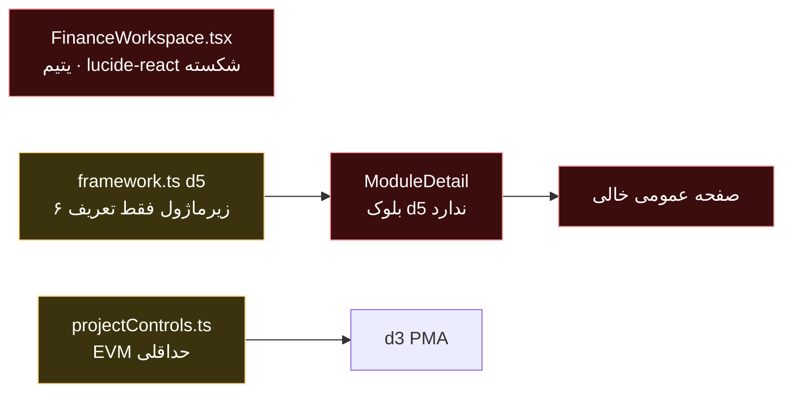

# FIN Deliverable 1 — تحلیل وضعیت موجود و معماری بازطراحی (ماژول هزینه، تأمین و لجستیک — d5)

**نسخه:** 1.0 · هم‌تراز با MASTER PROMPT FIN v1.0
**محدوده:** دامنه `d5` موجود در برنامه («مدیریت هزینه، تأمین و لجستیک پروژه») — نه بازنویسی کل PMIS
**اصل:** ارتقای درون‌برنامه‌ای · ساختار منو و نام ۶ زیرماژول ۱۰۰٪ حفظ · افزودن قابلیت زیرِ پوسته

**خلاصه ۳ خطی:** d5 امروز فقط یک تعریف در `framework.ts` است؛ **هیچ صفحهٔ اختصاصی ندارد** و تنها کد مالی موجود (`src/FinanceWorkspace.tsx`، ۱۰۷۱ خط) **یتیم و غیرقابل کامپایل** است چون به `lucide-react` وابسته است که در `package.json` نیست. شکاف‌های ساختاری: CBS، PMB، تعهد (Commitment)، ۳-Way Match، MRP و انبار هیچ‌کدام وجود ندارند؛ AC عدد دستی است در حالی که d3 روی آن EVM می‌سازد. بازطراحی = حفظ ۶ زیرماژول + افزودن دو لایهٔ سرویس (Financial / Supply Chain) با نام‌های SQL موجود و VIEW سازگاری.

---

## ۱) موجودی واقعی (شواهد کد، نه حدس)

| لایه | مسیر | شاهد | وضعیت |
|---|---|---|---|
| تعریف دامنه | `src/data/framework.ts` → `domains` id `d5` | ۶ فرآیند `d5-p1..p6` هرکدام با یک زیرفرآیند | 📌 موجود |
| صفحهٔ دامنه | `src/components/ModuleDetail.tsx` | بلوک اختصاصی فقط برای `d1,d2,d3,d4,d6,d7` | ❌ **d5 ندارد** → مسیر عمومی «یک زیرفرآیند انتخاب کنید» |
| کد مالی | `src/FinanceWorkspace.tsx` (۱۰۷۱ خط) | `grep` کل `src` → **صفر ارجاع** به `FinanceSelectorModal` / `FinanceWorkspacePage` | ❌ یتیم |
| وابستگی شکسته | همان فایل، خط ۷ | `import … from 'lucide-react'` — در `package.json` **نیست** و در `node_modules` هم نصب نشده | ❌ `TS2307` |
| تم بصری | همان فایل | ۸۴ مورد `bg-slate-*/text-slate-*/bg-white` (تم روشن) در برابر تم شیشه‌ای تیره برنامه | 🔧 ناسازگار |
| موتور اعداد | `src/services/projectControls.ts` | `computeEvm()`، `DATA_DATE`، `FORMULA_VERSION = "v1"` | 📌 پایهٔ حداقلی |
| مالکیت داده | `src/services/governance.ts` → `DATA_OWNER` | `cost → d5` قفل شده؛ d6 حق نوشتن ندارد | ✅ سازگار با FIN |

> **یافتهٔ کیفیت مهم:** خطای نحوی `src/ForensicClaimsHub.tsx:1424` باعث می‌شود TypeScript **همهٔ خطاهای معنایی پروژه را نادیده بگیرد** (وقتی خطای syntax وجود دارد، فاز semantic اجرا نمی‌شود). به همین دلیل خطای `lucide-react` در `tsc -p` دیده نمی‌شد و فقط در کامپایل تک‌فایلی ظاهر شد. رفع آن پیش‌نیاز هر تضمین کیفیت در FIN است.

**نام‌های SQL موجود (حفظ می‌شوند):** `Project_Budget`, `Cost_Transaction`, `Cash_Flow`, `Purchase_Request`, `Purchase_Order`, `Material_Register`.
**فرمت‌های خروجی موجود:** `domainExportFormats.d5 = [excel, pdf, csv, xml]` — حفظ می‌شود.

---

## ۲) Gap Analysis — ۶ زیرماژول موجود

### زیرماژول ۱ — مدیریت هزینه (`d5-p1`, SQL: `Project_Budget`)

| قابلیت لازم | وضعیت | شکاف |
|---|---|---|
| Cost Estimation (AACE Class 1–5) | ❌ ندارد | کلاس، بازهٔ دقت و سطح اطمینان تعریف نشده |
| ۵ روش برآورد (Analogous, Parametric, BottomUp, 3-Point, Monte Carlo) | ❌ ندارد | — |
| CBS پنج‌سطحی | ❌ ندارد | **بحرانی** — بودجه ریشهٔ ساختاری ندارد |
| WBS × CBS Matrix | ❌ ندارد | **بحرانی** — بدون آن PV در d3 بی‌مبنا است |
| PMB زمان‌بندی‌شده با ۶ منحنی | ❌ ندارد | فقط عدد BAC ثابت در `FinanceWorkspace` |
| چندارزی + نرخ تاریخی | ❌ ندارد | همه‌جا «میلیارد ریال» hard-code |
| Escalation Indices | ❌ ندارد | — |
| Reserve (Contingency + Management) | ❌ ندارد در d5 | فقط طراحی `Reserve_Ledger` در RCC (d4) |

**نقاط ضعف UI/UX:** بدون درخت CBS، بدون ماتریس، بدون منحنی PMB؛ تم روشن ناسازگار. 👁️ **نیاز به بهبود بصری: بله**

### زیرماژول ۲ — کنترل هزینه (`d5-p2`, SQL: `Cost_Transaction`)

| قابلیت لازم | وضعیت | شکاف |
|---|---|---|
| PV/EV/AC/SV/CV/SPI/CPI | 🔧 ناقص | `computeEvm()` در `projectControls.ts` حداقلی؛ در `FinanceWorkspace` عدد دستی |
| ES و SPI(t) | ❌ ندارد | — |
| ۵ روش EAC | 🔧 ناقص | فقط دو حالت `ac+(bac-ev)/cpi` و `/(cpi×spi)` |
| Schedule-Only Mode | ❌ ندارد | — |
| Immutable Snapshot + Formula Version | 🔧 ناقص | `FORMULA_VERSION="v1"` هست ولی Snapshot ثبت نمی‌شود |
| Variance + Root Cause + Auto-CR | ❌ ندارد در d5 | قفل گزارش در d3 (`majorVarianceBlocksReport`) هست |
| Trend + Anomaly (Z-Score) | ❌ ندارد | — |
| Rollup چندسطحی (Activity→WBS→Project→Portfolio) | ❌ ندارد | — |

**نقاط ضعف UI/UX:** بدون داشبورد ۴پنل، بدون نمودار روند، بدون مقایسهٔ ۵ روش EAC. 👁️ **بله**

### زیرماژول ۳ — جریان نقدی (`d5-p3`, SQL: `Cash_Flow`)

| قابلیت لازم | وضعیت |
|---|---|
| Cash In/Out، خالص و تجمعی | ❌ ندارد |
| شرایط پرداخت (Advance/Milestone/Retention/Final) | ❌ ندارد |
| پیش‌بینی غلتان ۱۲ ماهه + سناریو | ❌ ندارد |
| AR/AP Aging، DSO، DPO، CCC | ❌ ندارد |
| NPV / IRR / Payback / حساسیت | ❌ ندارد |
| مواجههٔ ارزی و پوشش ریسک | ❌ ندارد |
| تأمین مالی و اثر بهره بر EAC | ❌ ندارد |

👁️ **بله** — این زیرماژول عملاً صفر است.

### زیرماژول ۴ — درخواست خرید (`d5-p4`, SQL: `Purchase_Request`)

| قابلیت لازم | وضعیت |
|---|---|
| PR دستی / خودکار (MRP) / اضطراری | ❌ ندارد |
| MRP با BOM از PEX + Need Date | ❌ ندارد — **بحرانی** برای اتصال به d2 |
| تأیید چندسطحی مبتنی بر مبلغ | ❌ ندارد در d5 (ماتریس اختیار در GOV پیاده شده و قابل استفاده مجدد است ✅) |
| کنترل بودجه پیش از ثبت + رد خودکار | ❌ ندارد |
| توصیهٔ تأمین‌کننده | ❌ ندارد |
| تبدیل PR→PO | ❌ ندارد |

👁️ **بله**

### زیرماژول ۵ — سفارش خرید (`d5-p5`, SQL: `Purchase_Order`)

| قابلیت لازم | وضعیت |
|---|---|
| رجیستری تأمین‌کننده + صلاحیت + امتیاز عملکرد | ❌ ندارد |
| RFQ و تحلیل پیشنهاد (فنی/بازرگانی) | ❌ ندارد |
| PO + INCOTERMS 2020 + شرایط پرداخت | ❌ ندارد |
| **Commitment Tracking** | ❌ ندارد — **بزرگ‌ترین حفرهٔ کنترل هزینه** |
| Expediting + پیش‌بینی تأخیر | ❌ ندارد |
| انطباق قرارداد + Change Order | ❌ ندارد |
| **3-Way Match (PO+GRN+Invoice)** | ❌ ندارد |

👁️ **بله**

### زیرماژول ۶ — مدیریت کالا و انبار (`d5-p6`, SQL: `Material_Register`)

| قابلیت لازم | وضعیت |
|---|---|
| Material Master + ABC | ❌ ندارد |
| چندانباره (Zone/Bin) | ❌ ندارد |
| GRN + کنترل کیفی | ❌ ندارد |
| صدور کالا با تخصیص به فعالیت/WBS | ❌ ندارد |
| ROP / EOQ / Safety Stock | ❌ ندارد |
| ردیابی Batch/Serial + بارکد/QR/RFID | ❌ ندارد |
| شمارش فیزیکی (دوره‌ای/کامل) | ❌ ندارد |
| تحلیل مصرف و ضایعات | ❌ ندارد |
| اپ موبایل انبار آفلاین | ❌ ندارد (زیرساخت `syncQueue.ts` موجود است ✅) |

👁️ **بله**

---

## ۳) Backward Compatibility Risks

| # | ریسک | اثر | کاهش |
|---|---|---|---|
| BC1 | تغییر نام ۶ زیرماژول در `framework.ts` | شکستن عادت کاربر + لینک‌های `subId` | **ممنوع** — فقط زیرآیتم داخل صفحهٔ d5 |
| BC2 | افزودن آیتم به سایدبار اصلی | رد قطعی کاربر | زیرماژول‌های جدید فقط در aside داخلی |
| BC3 | تغییر نام جداول قدیمی | شکستن گزارش‌های موجود | جداول `fin_*` + VIEW با نام قدیمی |
| BC4 | مهاجرت `FinanceWorkspace.tsx` | حذف کد موجود | فایل دست‌نخورده می‌ماند تا محتوایش تدریجی منتقل شود |
| BC5 | افزودن `lucide-react` به پروژه | تورم باند و تم ناسازگار | **افزوده نمی‌شود**؛ آیکن‌ها با ایموجی/SVG داخلی مثل بقیه ماژول‌ها |
| BC6 | بازنویسی AC توسط ماژول دیگر | خراب‌شدن EVM | `DATA_OWNER.cost = d5` (پیاده‌شده در GOV) |
| BC7 | تغییر `FORMULA_VERSION` بدون نسخه‌بندی | ناتوانی در بازتولید Snapshot قدیمی | هر Snapshot با نسخهٔ فرمول ذخیره می‌شود |

---

## ۴) معماری — قبل و بعد

### وضعیت فعلی



### معماری هدف

```mermaid
flowchart TB
  subgraph UI["صفحهٔ d5 — همان ۶ زیرماژول"]
    T1[۱ مدیریت هزینه]
    T2[۲ کنترل هزینه]
    T3[۳ جریان نقدی]
    T4[۴ درخواست خرید]
    T5[۵ سفارش خرید]
    T6[۶ کالا و انبار]
  end

  subgraph FINSVC["لایه مالی (Financial)"]
    CBS[CBSService]
    EST[CostEstimationService]
    PMB[PMBService]
    CUR[CurrencyService]
    RSV[ReserveService]
    EVM[EVMEngine]
    FCE[ForecastEngine]
    VAR[VarianceService]
    CF[CashFlowService]
    PT[PaymentTermsService]
    WC[WorkingCapitalService]
    FA[FinancialAnalysisService]
  end

  subgraph SUPSVC["لایه تأمین (Supply Chain)"]
    PR[PRService]
    MRP[MRPEngine]
    APW[ApprovalWorkflowService]
    VEN[VendorService]
    RFQ[RFQService]
    BID[BidAnalysisService]
    PO[POService]
    COM[CommitmentService]
    EXP[ExpeditingService]
    CC[ContractComplianceService]
    CO[ChangeOrderService]
    MM[MaterialMasterService]
    WH[WarehouseService]
    GRN[GRNService]
    ISS[IssuanceService]
    INV[InventoryControlService]
    TRC[TraceabilityService]
    CON[ConsumptionService]
    PCT[PhysicalCountService]
  end

  T1 --> EST & CBS & PMB & CUR & RSV
  T2 --> EVM & FCE & VAR
  T3 --> CF & PT & WC & FA
  T4 --> PR & MRP & APW
  T5 --> VEN & RFQ & BID & PO & COM & EXP & CC & CO
  T6 --> MM & WH & GRN & ISS & INV & TRC & CON & PCT

  PEX[d2 PEX<br/>BOM · Need Date · Progress] --> MRP & EVM
  COM --> EVM
  GRN --> COM
  EVM --> MON[d3 MON — فقط خواندن]
  VAR --> RCC[d4 RCC — Auto-CR]
  APW --> GOV[d6 GOV — DoA]
  PO --> DMS[d1 DMS — اسناد]
  ERP[(ERP خارجی<br/>SAP/سپیدار/رایورز)] --> COM & CF
```



**تفکیک دو حوزه:** زیرماژول‌های ۱،۲،۳ = مالی · ۴،۵،۶ = تأمین.
**سه نقطهٔ اتصال حیاتی:** `Material Need Date` (تأمین→برنامه) · `Commitment` (تأمین→مالی) · `Cash Flow` (مالی↔تأمین).

### زنجیرهٔ طلایی تعهد

```
PR (نیاز) → PO (تعهد) → GRN (تحویل) → Invoice (بدهی) → Payment (خروج نقد)
            Committed      Accrued        Actual (AC)       Cash-out
```

| عدد | مالک انحصاری | مصرف‌کننده |
|---|---|---|
| `Committed` | d5 | d3 پیش‌بینی · d6 تصمیم |
| `Actual (AC)` | **d5** | d3 (EVM) — فقط خواندن |
| `EV`, `PV` | d3 / از PMB در d5 | d5 برای انحراف |
| `Progress`, `BOM`, `Need Date` | d2 | d5 (MRP, EV) |

---

## ۵) ADR — تصمیم‌های معماری

| ADR | تصمیم | دلیل | پیامد |
|---|---|---|---|
| ADR-01 | ۶ زیرماژول به‌عنوان **تب** در یک ورک‌اسپیس واحد `CostSupplyWorkspace` | حفظ نام و ترتیب منو + الگوی d1/d2/d3/d4/d6 | زیرقابلیت‌ها فقط داخل تب مربوطه |
| ADR-02 | جداول جدید با پیشوند `fin_` و VIEW روی نام‌های قدیمی | Backward Compatibility ۱۰۰٪ | ترتیب مهاجرت: کپی داده → VIEW |
| ADR-03 | **عدم افزودن `lucide-react`** | تم و باند پروژه؛ بقیهٔ ماژول‌ها ایموجی/SVG دارند | بازنویسی بصری کد یتیم هنگام مهاجرت |
| ADR-04 | EVM در d5 محاسبه و **Snapshot غیرقابل تغییر** ذخیره می‌شود؛ d3 فقط می‌خواند | یک منبع حقیقت برای AC/EAC | حذف محاسبهٔ موازی در `projectControls.ts` در فاز F2 |
| ADR-05 | Commitment رویداد-محور از PO/GRN/Invoice ساخته می‌شود، نه ورودی دستی | جلوگیری از دوباره‌شماری | نیاز به موتور Reconciliation |
| ADR-06 | ماتریس اختیار **از GOV مصرف می‌شود** (`authorityFor`) نه پیاده‌سازی مجدد | یک منبع DoA در کل سامانه | سقف‌های مبلغی FIN در `gov_authority_matrix` تنظیم می‌شود |
| ADR-07 | چندارزی از روز اول؛ ذخیره به ارز معامله + ارز پایه با نرخ تاریخی | جلوگیری از مهاجرت پرهزینه | هر رکورد مالی سه فیلد ارزی دارد |
| ADR-08 | اپ انبار PWA آفلاین‌محور با استفاده از `src/services/syncQueue.ts` موجود | عدم اختراع دوباره | قواعد حل تعارض باید توسعه یابد |
| ADR-09 | Excel فقط ظرف ورود/خروج؛ هرگز منبع حقیقت | سازگار با اصل کل پروژه | ۱۵ قالب در D11 |
| ADR-10 | رفع خطای نحوی `ForensicClaimsHub.tsx` به‌عنوان پیش‌نیاز کیفیت | آزادسازی بررسی معنایی TypeScript | خارج از دامنهٔ FIN ولی مسدودکننده |

---

## ۶) Migration Strategy

| فاز | اقدام | برگشت‌پذیری |
|---|---|---|
| M0 | رفع خطای نحوی `ForensicClaimsHub.tsx` تا `tsc` واقعاً بررسی کند | commit جدا |
| M1 | ساخت بلوک d5 در `ModuleDetail` + ورک‌اسپیس شش‌تبی با دادهٔ نمونه | فقط افزودنی؛ حذف بلوک = بازگشت |
| M2 | ایجاد جداول `fin_*` و کپی دادهٔ `Project_Budget`/`Cost_Transaction`/… | اسکریپت معکوس |
| M3 | ساخت VIEWهای هم‌نام قدیمی؛ گزارش‌های قدیمی بدون تغییر کار می‌کنند | `DROP VIEW` |
| M4 | مهاجرت تدریجی محتوای `FinanceWorkspace.tsx` به تب‌ها (بدون `lucide-react`) | فایل قدیمی تا پایان باقی می‌ماند |
| M5 | قطع محاسبهٔ موازی EVM در `projectControls.ts` و اتصال d3 به Snapshot d5 | فلگ پیکربندی |
| M6 | اتصال ERP خارجی (SAP/سپیدار/رایورز) به‌جای دادهٔ داخلی | کانکتور خاموش‌شدنی |

**Phased Rollout:** به ازای هر زیرماژول جدا (۱→۲→۳→۴→۵→۶) با فلگ فعال‌سازی؛ Rollback = خاموش‌کردن فلگ + بازگشت VIEW.

---

## ۷) UI/UX — بهبود لازم به تفکیک زیرماژول

| زیرماژول | 👁️ بهبود بصری | اقلام |
|---|---|---|
| ۱ مدیریت هزینه | بله | درخت CBS تعاملی · گرید WBS×CBS · نمایشگر منحنی PMB · داشبورد چندارزی · گیج سلامت Reserve |
| ۲ کنترل هزینه | بله ★ | داشبورد ۴پنل PV/EV/AC/BAC · نمودار روند SPI/CPI با خط آستانه · مقایسهٔ ۵ روش EAC · Waterfall انحراف · تایم‌لاین تاریخی · فیلتر سطح |
| ۳ جریان نقدی | بله | Waterfall ورودی/خروجی · منحنی تجمعی · هیت‌مپ Aging · فید سررسید معوق · گیج سرمایه در گردش · مقایسهٔ سناریو |
| ۴ درخواست خرید | بله | ویجت تأییدهای معلق · نوار پیشرفت گردش تأیید · تایم‌لاین MRP · نمایشگر اثر بودجه · فید PR اضطراری |
| ۵ سفارش خرید | بله | رادار عملکرد تأمین‌کننده · ماتریس مقایسهٔ پیشنهادها · گانت تحویل · نمودار تعهد در برابر واقعی · فید Expediting · نمای مغایرت ۳-Way |
| ۶ کالا و انبار | بله | گرید موجودی زنده · نقشهٔ انبار · پارتو ABC · فید هشدار سفارش مجدد · روند مصرف · داشبورد ضایعات · تایم‌لاین حرکت کالا |
| **مشترک** | بله | همسان‌سازی با تم شیشه‌ای تیره و فونت Vazirmatn؛ **بدون** `lucide-react`؛ **بدون** تغییر سایدبار اصلی |

---

## ۸) سرویس‌های جدید — نگاشت به زیرماژول

**مالی (۱۲):** `CostEstimationService`, `CBSService`, `PMBService` → زیرماژول ۱ · `EVMEngine`, `ForecastEngine`, `VarianceService` → ۲ · `CashFlowService`, `PaymentTermsService`, `WorkingCapitalService`, `FinancialAnalysisService` → ۳ · `CurrencyService`, `ReserveService` → مشترک ۱/۲/۳

**تأمین (۱۹):** `PRService`, `MRPEngine`, `ApprovalWorkflowService` → ۴ · `VendorService`, `RFQService`, `BidAnalysisService`, `POService`, `CommitmentService`, `ExpeditingService`, `ContractComplianceService`, `ChangeOrderService` → ۵ · `MaterialMasterService`, `WarehouseService`, `GRNService`, `IssuanceService`, `InventoryControlService`, `TraceabilityService`, `ConsumptionService`, `PhysicalCountService` → ۶

قرارداد پیاده‌سازی: هر سرویس **تابع خالص + بدون نوشتن روی داده ماژول دیگر**، الگوی `src/services/governance.ts` (نسخهٔ TS برای UI + نسخهٔ Node برای تست).

---

## ۹) نتیجهٔ ۱۲ Loop خودارزیابی

| Loop | حکم | شواهد / شکاف |
|---|---|---|
| 1 استانداردها | **پوشش در طراحی** | PMBOK 7.x/12.x، EVM Practice Standard، AACE TCM، SCOR، INCOTERMS 2020 در دامنهٔ D3–D8 نگاشت شد؛ استانداردهای مالی ایران در D5 (صورت‌وضعیت/حسن انجام کار) |
| 2 موتور مالی | **شکاف کامل** | CBS/PMB/چندارزی/Escalation/Reserve هیچ‌کدام نیست → D3 |
| 3 EVM ★★★ | **شکاف بحرانی** | ES/SPI(t)، ۵ EAC، Schedule-Only، Snapshot، Anomaly، Rollup نیست → D4 |
| 4 نقدینگی | **شکاف کامل** | زیرماژول ۳ عملاً صفر → D5 |
| 5 PR | **شکاف کامل** | MRP و تأیید مبلغی نیست؛ DoA از GOV قابل استفاده مجدد → D6 |
| 6 PO/Vendor | **شکاف بحرانی** | Commitment و 3-Way Match نیست → D7 |
| 7 انبار | **شکاف کامل** | GRN/ROP/بارکد/شمارش نیست؛ `syncQueue.ts` برای آفلاین موجود → D8 |
| 8 یکپارچگی | **نیمه** | d3/d4/d6 قلاب دارند؛ BOM از d2 و ERP خارجی ندارد → D9 |
| 9 KPI/قواعد/EWS | **تعریف‌نشده** | ۲۵ KPI، ۲۰ قاعده، ۱۵ EWS → D10 |
| 10 گزارش/قالب | **تعریف‌نشده** | ۲۰ گزارش، ۱۵ قالب اکسل → D11 |
| 11 RBAC/API/موبایل | **نیمه** | RBAC پایه در `AuthContext` + DoA در GOV؛ ۶۰ endpoint و PWA ندارد → D12/D13 |
| 12 ارتقای درون‌برنامه‌ای ★ | **رعایت‌شده در طراحی** | نام ۶ زیرماژول ثابت · سایدبار اصلی دست‌نخورده · VIEW سازگاری · Rollback و Phased Rollout در §۶ |

### شکاف‌های این Deliverable و اصلاح انجام‌شده

| # | شکاف کشف‌شده | اصلاح در همین سند |
|---|---|---|
| G1 | فرض اولیه «d5 فقط سند ندارد» غلط بود؛ کد مالی **غیرقابل کامپایل** است | §۱ با شاهد `TS2307` و §ADR-03 |
| G2 | خطای `ForensicClaimsHub` بررسی معنایی کل پروژه را خاموش می‌کرد | §۱ هشدار + M0 در نقشهٔ مهاجرت |
| G3 | خطر پیاده‌سازی موازی DoA در FIN | ADR-06: مصرف `authorityFor` از GOV |
| G4 | خطر دو منبع EVM (d3 و d5) | ADR-04 + M5 |
| G5 | نبود مسیر آفلاین برای انبار | ADR-08: استفاده از `syncQueue.ts` موجود |

---

## ۱۰) وضعیت واقعی تحویل (صداقت قراردادی)

| قلم | وضعیت |
|---|---|
| D1 (این سند) | ✅ تحویل |
| D2–D14 | ❌ نوشته نشده — منتظر دستور |
| کد | ❌ **هیچ فایلی تغییر نکرد**؛ `FinanceWorkspace.tsx` دست‌نخورده |
| صفحهٔ d5 | ❌ هنوز مسیر عمومی |
| سایدبار اصلی / فونت / `index.css` / `vite.config.ts` | ✅ دست‌نخورده |

## ۱۱) پرسش‌های باز (پاسخ لازم پیش از D2)

1. **ارز پایه** گزارش‌دهی: IRR یا USD؟ (پیش‌فرض فعلی: IRR با نگهداری ارز معامله)
2. **ERP مقصد** برای فاز اول: SAP یا سپیدار یا رایورز؟ (پیش‌فرض: هیچ‌کدام؛ کانکتور عمومی)
3. **سقف‌های تأیید PR** بر حسب ریال یا دلار؟ (پیش‌فرض: نگاشت به `gov_authority_matrix` موجود)
4. آیا **صورت‌وضعیت پیمانکاری ایران** (کارکرد/تعدیل/حسن انجام کار/پیش‌پرداخت) باید در D5 مدل شود؟ (پیش‌فرض: بله)

پاسخ ندهی هم مشکلی نیست — با همین پیش‌فرض‌ها D2 نوشته می‌شود.
