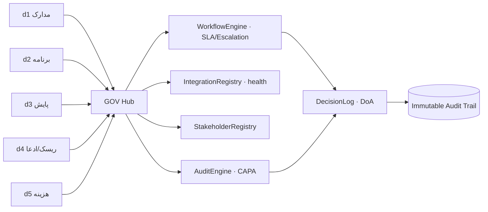

# GOV D1 — تحلیل وضعیت موجود و معماری بازطراحی ماژول حاکمیت (d6)

**نسخه:** 1.0 · هم‌تراز با PIM (d1) / PEX (d2) / PMA (d3) / RCC (d4)
**محدوده:** دامنه `d6` موجود در برنامه — «مدیریت حاکمیت و فرآیندهای PMBOK»
**اصل:** حفظ ساختار · افزودن قابلیت · **بدون آیتم جدید در سایدبار اصلی** · Excel ظرف است نه منبع حقیقت

خلاصه ۳ خطی: d6 تا امروز فقط یک کامپوننت یتیم (`GovernanceWorkspace`) با سه تب نمایشی داشت که **به هیچ صفحه‌ای وصل نبود** و صفحهٔ دامنه به مسیر عمومی `CapabilityDetail` می‌افتاد. شکاف اصلی: موتور گردش‌کار/SLA، رجیستری اختیار (DoA)، ممیزی با CAPA، دفتر تصمیم قابل ردیابی و ثبت غیرقابل‌تغییر (immutable audit). بازطراحی روی همان `GovernanceWorkspace` و نام‌های SQL فعلی انجام می‌شود و ۵ زیرفرایند فقط داخل صفحهٔ d6 دیده می‌شوند.

---

## ۱) موجودی واقعی (کد)

| لایه | مسیر | نقش |
|---|---|---|
| دامنه | `src/data/framework.ts` → `domains` id `d6` | d6-p1 حاکمیت، d6-p2 یکپارچگی، d6-p3 ذی‌نفعان، d6-p4 ممیزی، d6-p5 پشتیبان تصمیم |
| فضای کاری | `src/components/GovernanceWorkspace.tsx` | قبلاً: workflow / stakeholders / audit — **بدون مصرف‌کننده** |
| پوسته | `src/components/ModuleDetail.tsx` | تا این سند فقط d1/d2/d3/d4/d7 صفحهٔ اختصاصی داشتند |
| ثبت رویداد | `src/services/auditLogger.ts` (۶۱ خط) | `logAudit()` در حافظه؛ بدون persist و بدون hash chain |
| دسترسی | `src/context/AuthContext.tsx` + `src/components/AccessControlPanel.tsx` (۷۲ خط) | نقش/مجوز ساده `can()`؛ بدون DoA و بدون سقف مالی |
| ادمین | `src/components/AdminWorkspace.tsx` (d7) | پیکربندی سامانه — با d6 اشتباه گرفته نشود |
| فرمت خروجی | `domainExportFormats.d6 = [pdf, word, excel, json]` | حفظ می‌شود |

**نام‌های SQL اعلام‌شده در taxonomy (حفظ می‌شوند):** `Process_Master`, `Workflow_Instance`, `Project_Master`, `Integration_Log`, `Stakeholder_Register`, `Audit_Register`, `AI_Model_Input`, `Decision_Log`.

---

## ۲) Gap Analysis — زیرفرایندهای حاکمیت

### GOV-1 گردش فرآیند (d6-p1)

| کد | عنوان | وضعیت | توضیح |
|---|---|---|---|
| 10.1 | کاتالوگ فرآیند سازمانی (Process_Master) | **ندارد** | فهرست فرآیند/گام/نقش وجود ندارد؛ داده نمونه ثابت است |
| 10.2 | نمونه گردش‌کار (Workflow_Instance) | **ناقص** | جدول نمایشی + دکمه تأیید؛ بدون موتور گام و بازگشت |
| 10.3 | SLA و Escalation | **ناقص** | فقط عدد `slaDays`؛ بدون ساعت‌شمار، بدون سطح تشدید |
| 10.4 | RACI روی هر گام | **ندارد** | مسئول تک‌نفره است |
| 10.5 | ثبت غیرقابل تغییر تأیید | **ندارد** | `logAudit` فقط in-memory |

### GOV-2 یکپارچگی (d6-p2)

| کد | عنوان | وضعیت |
|---|---|---|
| 11.1 | رجیستری اتصال (P6 / ERP / EDMS / BI) | **ندارد** (در این فاز: نمای سلامت اضافه شد) |
| 11.2 | سلامت اتصال + آخرین همگام‌سازی | **جدید — UI اضافه شد** |
| 11.3 | مالکیت داده (Data Ownership) | **ندارد** — باید: هر عدد فقط توسط ماژول مالک نوشته شود |
| 11.4 | آشتی‌دهی (Reconciliation) بین d2/d3/d5 | **ندارد** |

### GOV-3 ذی‌نفعان (d6-p3)

| کد | عنوان | وضعیت |
|---|---|---|
| 12.1 | رجیستر ذی‌نفع | **ناقص** — کارت ثابت |
| 12.2 | ماتریس Power×Interest | **ناقص** — متن، نه ماتریس |
| 12.3 | برنامه ارتباطی + تعهد (Engagement) | **ندارد** |
| 12.4 | اتصال به مکاتبات d1 | **ندارد** |

### GOV-4 ممیزی و انطباق (d6-p4)

| کد | عنوان | وضعیت |
|---|---|---|
| 13.1 | برنامه ممیزی (Audit Plan) | **ندارد** |
| 13.2 | چک‌لیست استاندارد (PMBOK / ISO 9001 / 45001) | **ناقص** — ردیف نمونه |
| 13.3 | یافته + عدم‌انطباق + CAPA | **ندارد** — حیاتی |
| 13.4 | امتیاز انطباق و روند | **جدید — چیپ میانگین انطباق اضافه شد** |

### GOV-5 پشتیبان تصمیم (d6-p5)

| کد | عنوان | وضعیت |
|---|---|---|
| 14.1 | دفتر تصمیم (Decision_Log) | **جدید — UI اضافه شد** |
| 14.2 | مرجع اختیار / DoA و سقف مالی | **ندارد** — باید در D2 |
| 14.3 | اتصال تصمیم به شاهد عددی (EVM/انحراف/ادعا) | **ناقص** — متن مبنا هست، FK نیست |
| 14.4 | مهلت و تشدید تصمیم | **ناقص** — تاریخ نمایشی |

---

## ۳) ضعف UX و اقدام این فاز

| بخش | بهبود لازم؟ | اقدام انجام‌شده در این فاز |
|---|---|---|
| صفحهٔ دامنه d6 | بله (خالی بود) | صفحهٔ اختصاصی d6 در `ModuleDetail` با الگوی دقیق d1/d2/d3/d4 (سایدبار داخلی + `hideTabs`) |
| هدر حاکمیت | بله | چیپ «انطباق ٪» رنگ‌بند ۹۰/۷۵ + شمارنده «تصمیم باز» |
| گردش‌کار | بله | ستون SLA/وضعیت حفظ + ردیف دروازهٔ ادعا؛ برچسب جدول SQL |
| یکپارچگی | تب نبود | تب جدید: سامانه / جهت / آخرین سینک / رکورد / سلامت |
| تصمیم | تب نبود | تب جدید: کد تصمیم، مرجع اختیار، مبنای عددی، مهلت، وضعیت |
| سایدبار اصلی | خیر | **دست‌نخورده** — زیرفرایندهای اضافه فقط داخل صفحهٔ d6 |
| فونت/تم/`index.css` | خیر | **بدون تغییر** |

---

## ۴) معماری بازطراحی

**قواعد معماری**

1. **ارجاع، نه بازنویسی:** d6 هیچ عددی از d2/d3/d5 را تغییر نمی‌دهد؛ فقط ارجاع و مهر تأیید می‌زند.
2. **Baseline مقدس:** تأیید حاکمیتی نمی‌تواند Baseline را بازنویسی کند؛ فقط CR مصوب (d4/CCB) مسیر مجاز است.
3. **هر تصمیم = شاهد + اختیار:** بدون `evidence_ref` و `authority_level` رکورد `Decision_Log` پذیرفته نمی‌شود.
4. **Immutable:** جدول ممیزی فقط append؛ اصلاح با رکورد جبرانی.
5. **سازگاری عقب:** نام جداول قدیمی حفظ؛ جداول جدید با پیشوند `gov_` و VIEW روی نام‌های قدیمی.

---

## ۵) نگاشت SQL (طرح D2)

| موجود (حفظ) | جدید پیشنهادی | توضیح |
|---|---|---|
| `Process_Master` | `gov_process`, `gov_process_step` | کاتالوگ فرآیند و گام + RACI |
| `Workflow_Instance` | `gov_wf_instance`, `gov_wf_task` | نمونه اجرا + SLA + escalation |
| `Integration_Log` | `gov_connector`, `gov_sync_run` | رجیستری اتصال + اجرای سینک |
| `Stakeholder_Register` | `gov_stakeholder`, `gov_engagement` | Power×Interest + برنامه ارتباطی |
| `Audit_Register` | `gov_audit_plan`, `gov_audit_finding`, `gov_capa` | برنامه/یافته/اقدام اصلاحی |
| `Decision_Log` | `gov_decision`, `gov_authority_matrix` | DoA و سقف مالی |
| — | `gov_audit_trail` | زنجیره hash غیرقابل تغییر |

سازگاری: `CREATE VIEW dbo.Audit_Register AS SELECT ... FROM gov_audit_finding` و مشابه، **پس از** کپی داده.

---

## ۶) نقشه راه تحویل‌شدنی‌ها

| سند | موضوع | وضعیت |
|---|---|---|
| **D1** | تحلیل وضعیت + Gap + معماری (همین سند) | ✅ تحویل |
| D2 | مدل داده + DDL + VIEW سازگاری | بعدی |
| D3 | موتور گردش‌کار، SLA و Escalation | — |
| D4 | ماتریس اختیار (DoA) و کنترل دسترسی | — |
| D5 | ممیزی، عدم‌انطباق و CAPA | — |
| D6 | ذی‌نفعان و برنامه ارتباطی | — |
| D7 | یکپارچگی، مالکیت داده و آشتی‌دهی | — |
| D8 | دفتر تصمیم و ردیابی شاهد | — |
| D9 | گزارش‌ها و خروجی (pdf/word/excel/json) | — |
| D10 | API (OpenAPI `gov-v1.yaml`) و MVP | — |

---

## ۷) وضعیت پیاده‌سازی این فاز (صداقت فنی)

| قلم | وضعیت |
|---|---|
| صفحهٔ d6 در `ModuleDetail` با سایدبار داخلی | ✅ انجام شد |
| `GovernanceWorkspace` با ۵ تب + props `initialTab`/`hideTabs` | ✅ انجام شد |
| داده‌ها | **نمونه (mock)** — هنوز به SQL/سرویس وصل نیست |
| موتور SLA/CAPA/DoA | ❌ ندارد (D3–D5) |
| Migration و OpenAPI | ❌ ندارد (D2, D10) |
| سایدبار اصلی / فونت Vazirmatn / `src/index.css` | بدون تغییر ✔ |
