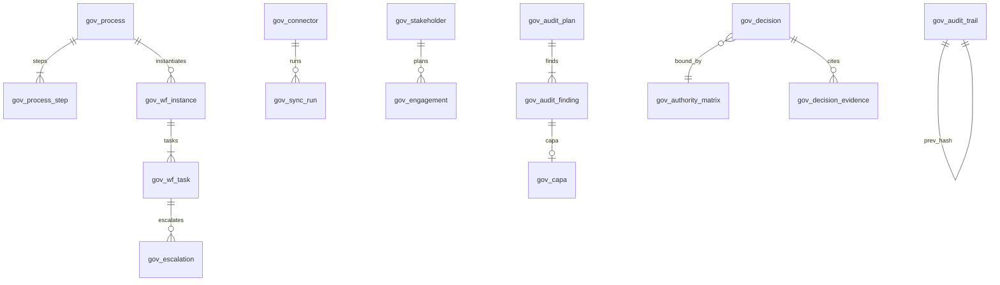

# GOV D2 — مدل داده و DDL ماژول حاکمیت (d6)

خلاصه ۳ خط: جداول جدید با پیشوند `gov_` ساخته می‌شوند و نام‌های قدیمی (`Process_Master`, `Workflow_Instance`, `Integration_Log`, `Stakeholder_Register`, `Audit_Register`, `Decision_Log`) به‌صورت **VIEW** حفظ می‌گردند تا گزارش‌های موجود نشکند. حاکمیت هیچ ستون عددی متعلق به d2/d3/d5 را نگهداری نمی‌کند؛ فقط `evidence_ref` متنی. زنجیره ممیزی append-only با hash link است.

D1 اصلاح نشد.

---

## قرارداد نوع
`uniqueidentifier` PK (SQL Server) / `uuid` (Postgres) · `datetime2`/`timestamptz` · پول `numeric(18,4)` · درصد `numeric(5,2)` · دوزبانه `*_fa` / `*_en` · وضعیت‌ها با `CHECK` هم‌نام Workflow.

## ERD کلان



---

## جداول

### 1) فرآیند و گردش‌کار
**gov_process:** `id`, `project_id`, `code UNIQUE(project,code)`, `name_fa/en`, `owner_role`, `pmbok_area`, `is_active`
**gov_process_step:** `id`, `process_id`, `seq`, `name_fa/en`, `sla_days`, `raci_r/a/c/i` (role ids), `gate_type` CHECK(`none|approval|ccb|audit`)
**gov_wf_instance:** `id`, `process_id`, `project_id`, `code`, `state` CHECK(`open|closed|cancelled`), `opened_at`, `closed_at`
**gov_wf_task:** `id`, `instance_id`, `step_id`, `assignee_id`, `due_at`, `closed_at`, `sla_level` CHECK(`ok|due_soon|breach`)، محاسبه‌شده در سرویس (D3)
**gov_escalation:** `id`, `task_id`, `level` CHECK(`L0|L1|L2|L3`), `raised_at`, `to_role`, `reason`

### 2) یکپارچگی
**gov_connector:** `id`, `system_code` (P6/ERP/EDMS/PBI), `owning_domain` CHECK(`d1..d5`), `direction` CHECK(`pull|push|two_way`), `sla_hours` default 24, `is_enabled`
**gov_sync_run:** `id`, `connector_id`, `started_at`, `finished_at`, `records`, `status` CHECK(`ok|warn|fail`), `error_text`
**gov_data_owner:** `field_key PK`, `owning_domain` — قفل مالکیت داده؛ درج در d6 ممنوع.

### 3) ذی‌نفعان
**gov_stakeholder:** `id`, `project_id`, `name_fa/en`, `org`, `role_fa/en`, `power` CHECK(`High|Medium|Low`), `interest` CHECK(...), `attitude` CHECK(`supporter|neutral|blocker`)
**gov_engagement:** `id`, `stakeholder_id`, `channel`, `frequency`, `owner_id`, `next_due`, `last_contact`, `correspondence_ref` (نرم به d1)

### 4) ممیزی
**gov_audit_plan:** `id`, `project_id`, `code`, `standard` (PMBOK/ISO 9001/ISO 45001/داخلی), `period_from`, `period_to`, `lead_auditor`, `state` CHECK(`draft|running|closed`)
**gov_audit_finding:** `id`, `plan_id`, `code`, `item_fa/en`, `weight` default 1, `compliance_pct`, `severity` CHECK(`minor|major|critical`), `finding_fa/en`, `capa_id NULL`
**gov_capa:** `id`, `finding_id`, `action_fa/en`, `owner_id`, `due_at`, `closed_at`, `verify_note`
> **قاعده بستن:** `UPDATE gov_audit_plan SET state='closed'` تنها وقتی مجاز است که هیچ `finding` با `severity IN ('major','critical') AND capa_id IS NULL` نمانده باشد (تریگر D5).

### 5) تصمیم و اختیار
**gov_authority_matrix:** `authority PK` CHECK(`PM|PMO|STEERING|BOARD`), `cost_ceiling`, `days_ceiling`
**gov_decision:** `id`, `project_id`, `code`, `subject_fa/en`, `authority`, `cost_impact`, `days_impact`, `due_at`, `state` CHECK(`open|approved|rejected|escalated`), `rewrites_baseline bit`, `cr_id NULL`
**gov_decision_evidence:** `id`, `decision_id`, `evidence_ref` (`PMA:EVM#...`, `PEX:BL#...`, `RCC:CLM-...`), `snapshot_at`
> **دروازه:** درج/تأیید `gov_decision` بدون حداقل یک ردیف evidence، یا با `rewrites_baseline=1 AND cr_id IS NULL`، یا با اختیار ناکافی نسبت به `gov_authority_matrix` → رد.

### 6) ثبت غیرقابل تغییر
**gov_audit_trail:** `seq BIGINT IDENTITY PK`, `at`, `actor_id`, `entity`, `entity_id`, `payload`, `prev_hash`, `hash` — فقط `INSERT`؛ `UPDATE/DELETE` با `DENY` و تریگر مسدود.

---

## DDL نمونه (SQL Server — محصول Arena)

```sql
CREATE TABLE dbo.gov_audit_finding (
  id            UNIQUEIDENTIFIER NOT NULL DEFAULT NEWID() PRIMARY KEY,
  plan_id       UNIQUEIDENTIFIER NOT NULL REFERENCES dbo.gov_audit_plan(id),
  code          NVARCHAR(40)  NOT NULL,
  item_fa       NVARCHAR(400) NOT NULL,
  item_en       NVARCHAR(400) NULL,
  weight        DECIMAL(5,2)  NOT NULL DEFAULT 1 CHECK (weight > 0),
  compliance_pct DECIMAL(5,2) NOT NULL CHECK (compliance_pct BETWEEN 0 AND 100),
  severity      VARCHAR(10)   NOT NULL CHECK (severity IN ('minor','major','critical')),
  finding_fa    NVARCHAR(MAX) NULL,
  finding_en    NVARCHAR(MAX) NULL,
  capa_id       UNIQUEIDENTIFIER NULL REFERENCES dbo.gov_capa(id),
  created_at    DATETIME2     NOT NULL DEFAULT SYSUTCDATETIME()
);

CREATE TABLE dbo.gov_audit_trail (
  seq        BIGINT IDENTITY(1,1) PRIMARY KEY,
  at         DATETIME2 NOT NULL DEFAULT SYSUTCDATETIME(),
  actor_id   NVARCHAR(80)  NOT NULL,
  entity     NVARCHAR(40)  NOT NULL,
  entity_id  NVARCHAR(80)  NOT NULL,
  payload    NVARCHAR(MAX) NOT NULL,
  prev_hash  CHAR(8)       NOT NULL DEFAULT '00000000',
  hash       CHAR(8)       NOT NULL
);
GO
CREATE TRIGGER dbo.trg_gov_trail_immutable ON dbo.gov_audit_trail
INSTEAD OF UPDATE, DELETE AS
BEGIN
  RAISERROR('gov_audit_trail is append-only', 16, 1);
END;
```

## VIEW سازگاری عقب (پس از کپی داده)

```sql
CREATE VIEW dbo.Audit_Register AS
SELECT f.code, f.item_fa AS item, p.standard, f.compliance_pct AS compliance, f.finding_fa AS finding
FROM dbo.gov_audit_finding f JOIN dbo.gov_audit_plan p ON p.id = f.plan_id;

CREATE VIEW dbo.Decision_Log AS
SELECT d.code, d.subject_fa AS subject, d.authority, d.state, d.due_at
FROM dbo.gov_decision d;

CREATE VIEW dbo.Workflow_Instance AS
SELECT i.code, p.name_fa AS process_name, i.state, i.opened_at, i.closed_at
FROM dbo.gov_wf_instance i JOIN dbo.gov_process p ON p.id = i.process_id;
```

## ایندکس و کارایی
`gov_wf_task(due_at, closed_at)` برای پایش SLA · `gov_sync_run(connector_id, started_at DESC)` · `gov_audit_finding(plan_id, severity)` · پارتیشن ماهانه روی `gov_audit_trail(at)`.

## Rollback
1) توقف نوشتن سرویس d6 · 2) `DROP VIEW` نام‌های قدیمی · 3) بازگرداندن جداول legacy از بکاپ · 4) `DROP TABLE gov_*` به ترتیب معکوس FK.
