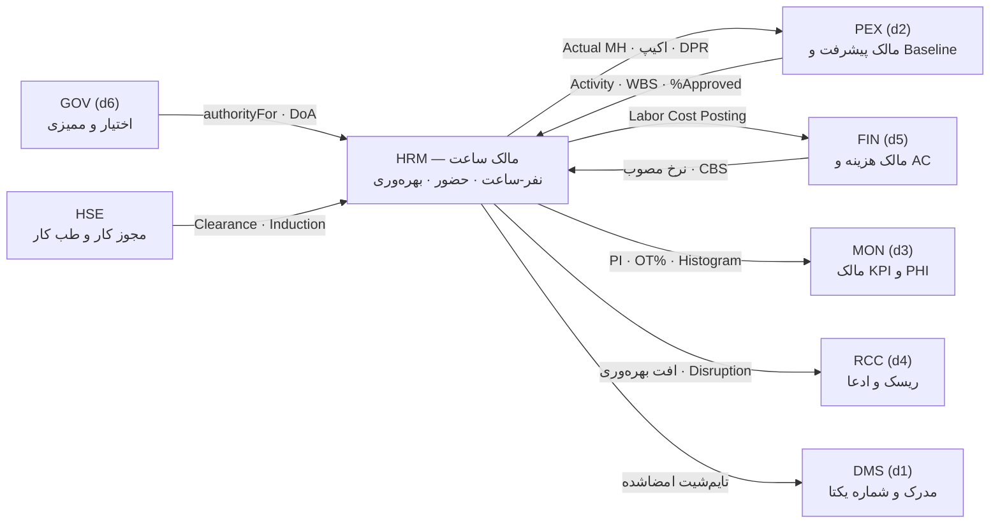
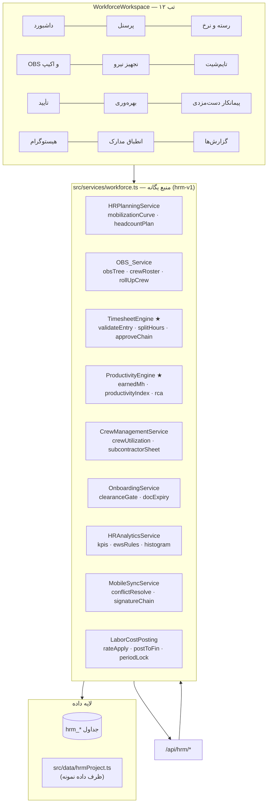
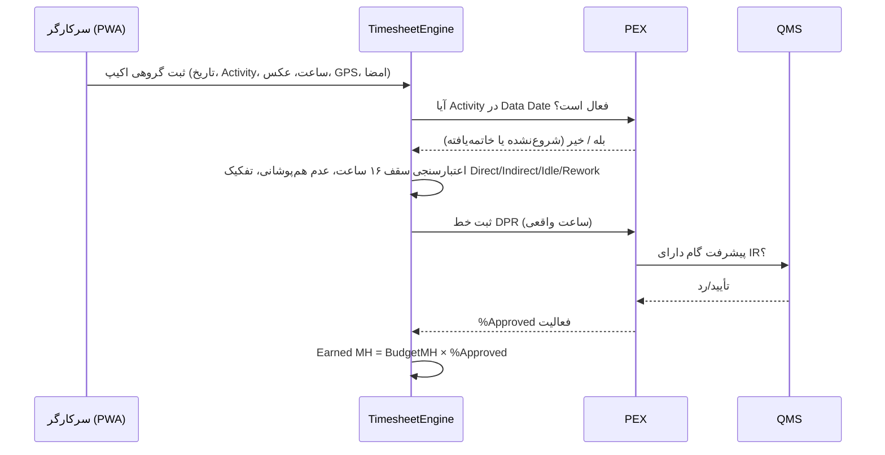
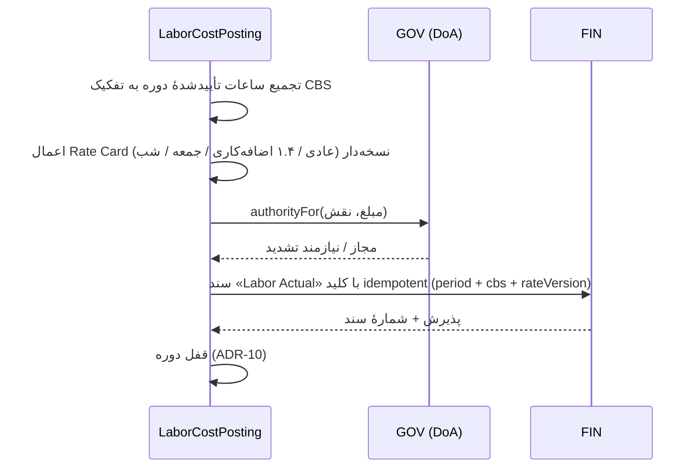

# HRM — Deliverable 1
# تحلیل وضعیت موجود و معماری ماژول «مدیریت منابع انسانی، تایم‌شیت و بهره‌وری»

نسخه ۱.۰ | 2026-09-08 | حالت: ارتقای درون‌برنامه‌ای (In-App Enhancement)

> **اصول ثابت این ماژول:**
> ۱) نفر-ساعت **تأییدشده** تنها ورودی معتبر هزینه و بهره‌وری است · ۲) HRM مالک «ساعت» است، نه مالک «هزینه» —
> نرخ‌گذاری و ثبت AC در FIN انجام می‌شود · ۳) هر ساعت باید به یک Activity و یک CBS شارژ شود، ساعت بی‌صاحب رد می‌شود ·
> ۴) Excel و موبایل فقط ظرف ورودند · ۵) دوره تأییدشده قفل می‌شود و اصلاح فقط با سند اصلاحی (Adjustment) انجام می‌گیرد ·
> ۶) بهره‌وری از پیشرفت **Approved** محاسبه می‌شود، نه پیشرفت اعلامی.

---

## ۱. تحلیل وضعیت موجود (As-Is)

### ۱-۱. آنچه امروز در سامانه هست

| دارایی موجود | مسیر | ارزیابی برای HRM |
|---|---|---|
| کارت KPI «نفر-ساعت کل» | `src/ProjectControl.tsx:528` (کلید `manpower`, `totalManHours`) | ورودی دستی و تجمیعی؛ نه تفکیک رسته، نه شارژ به فعالیت. فایل میراثی و خارج از `tsconfig` است |
| وزن‌دهی نفر-ساعتی | `src/services/planning.ts` → `computeWeights(items, "MH" \| "Hybrid")` | ✅ آماده مصرف؛ HRM باید نفر-ساعت **واقعی** را تغذیه کند تا وزن‌ها از تخمین به واقعیت برسند |
| فیلد `manHours` هر فعالیت | `src/data/pexProject.ts` | تخمین برنامه‌ای (Budget MH) — پایهٔ محاسبه Earned MH |
| گیت پیشرفت تأییدشده | `activityProgress()` در `planning.ts` | ✅ مبنای Earned MH؛ گام بدون IR تأییدشده وارد بهره‌وری نمی‌شود |
| بودجه و هزینه | `src/services/finance.ts` | مقصد ارسال Labor AC؛ HRM خودش AC نمی‌نویسد |
| مالکیت داده | `DATA_OWNER` در `src/services/governance.ts` | امروز کلید `manhour`/`attendance` ندارد → **باید افزوده شود** |
| صف آفلاین | `src/services/syncQueue.ts` | ✅ زیرساخت PWA تایم‌شیت میدانی؛ نیازمند قواعد حل تعارض اختصاصی |
| ماتریس اختیار | `authorityFor()` در `governance.ts` | ✅ سطوح تأیید تایم‌شیت از همین‌جا مصرف می‌شود، نه پیاده‌سازی دوباره |
| طراحی منابع در PEX | `docs/PEX_D8_Resources.md` | **هم‌پوشانی مدیریت‌شدنی**: آنجا Resource Pool و Timesheet در حد یک بند طراحی شده بود؛ HRM آن را می‌بلعد و PEX فقط مصرف‌کننده می‌ماند |

### ۱-۲. شکاف‌های وضعیت موجود

| # | شکاف | اثر |
|---|---|---|
| AS-1 | هیچ پروندهٔ پرسنلی، رستهٔ شغلی یا نرخ ساعتی در سامانه نیست | نه هزینهٔ نیرو محاسبه می‌شود نه بهره‌وری |
| AS-2 | ساعت کارکرد به فعالیت شارژ نمی‌شود | EVM نفر-ساعتی و PI غیرممکن است |
| AS-3 | نفر-ساعت فقط عدد دستی تجمیعی است | قابل ممیزی نیست؛ ادعای کارکرد پشتوانه ندارد |
| AS-4 | ساختار OBS و اکیپ وجود ندارد | مسئولیت‌پذیری و تحلیل بهره‌وری تیمی ممکن نیست |
| AS-5 | ثبت میدانی کاغذی است | تأخیر ۳ تا ۷ روزه در داده، اصلاحات دستی |
| AS-6 | نیروی پیمانکار دست‌مزدی ردیابی نمی‌شود | صورت‌کارکرد بدون کنترل، ریسک اضافه‌پرداخت |
| AS-7 | انقضای مدارک/طب کار/HSE پایش نمی‌شود | ریسک انطباق و توقف کار توسط بازرس |
| AS-8 | هیستوگرام نیرو (Plan vs Actual) نیست | انحراف تجهیز نیرو دیر کشف می‌شود |

### ۱-۳. آنچه دست نمی‌خورد (Backward Compatibility)

- نام و ترتیب منوهای موجود دست‌نخورده می‌ماند؛ HRM ورک‌اسپیس تب‌دار خودش را دارد (ADR-01).
- فیلد `totalManHours` در فایل میراثی حذف نمی‌شود؛ در فاز F2 به‌صورت **مشتق** از تجمیع HRM پر می‌شود (VIEW سازگاری).
- `manHours` فعالیت‌ها در PEX به‌عنوان **Budget MH** باقی می‌ماند و معنایش عوض نمی‌شود.
- ظاهر، فونت Vazirmatn و `src/index.css` تغییر نمی‌کند.

---

## ۲. جایگاه ماژول و مرزهای مالکیت



**قاعدهٔ مرزی صریح:** HRM هرگز در `fin_*` نمی‌نویسد و هرگز درصد پیشرفت تولید نمی‌کند.
خروجی آن دو چیز است: **ساعت تأییدشده** و **شاخص بهره‌وری**. افزودن به `DATA_OWNER`:

```ts
manhour:    "d9",   // ساعت کارکرد و حضور
productivity: "d9", // PI و نرخ اجرا
// cost همچنان "d5" و progress همچنان "d2" باقی می‌ماند
```

---

## ۳. معماری مؤلفه‌ها



### ۳-۱. مسئولیت سرویس‌ها و امضای کلیدی

| سرویس | مسئولیت | توابع کلیدی (پیش‌طرح) |
|---|---|---|
| **HRPlanningService** | برنامهٔ تجهیز/ترخیص، هدف نفری هر دوره | `mobilizationCurve(plan, calendar)` · `headcountAt(date)` · `demobRisk()` |
| **OBS_Service** | درخت سازمان پروژه، اکیپ‌ها و اعضا | `buildObs(nodes)` · `crewRoster(crewId, date)` · `spanOfControl()` |
| **TimesheetEngine ★** | اعتبارسنجی و تفکیک ساعت | `validateEntry(entry, ctx)` · `splitHours(raw, shift, law)` · `dailyCap(entries)` · `submit/approve(header, actor)` |
| **ProductivityEngine ★** | نفر-ساعت کسب‌شده و شاخص بهره‌وری | `earnedMh(activity, pctApproved)` · `productivityIndex(earned, actual)` · `rate(qty, mh)` · `varianceRca(logs)` |
| **CrewManagementService** | بهره‌برداری اکیپ و نیروی پیمانکار | `crewUtilization(crew, period)` · `subcontractorSheet(contract, entries)` |
| **OnboardingService** | دروازهٔ ورود به کار و انقضای مدرک | `clearanceGate(person)` · `expiringDocs(days)` · `offboardChecklist()` |
| **HRAnalyticsService** | ۶ KPI، ۴ قاعدهٔ EWS، هیستوگرام | `hrKpis(period)` · `ewsHrm(kpis, cfg)` · `histogram(plan, actual, groupBy)` |
| **MobileSyncService** | صف آفلاین، امضا، تعارض | `enqueue(batch)` · `resolveConflict(local, remote)` · `verifySignature(chain)` |
| **LaborCostPosting** | نرخ‌گذاری و ارسال به FIN | `rateApply(hours, rateCard)` · `postToFin(period)` · `lockPeriod(code)` |

★ = مسیر بحرانی ماژول.

---

## ۴. تصمیم‌های معماری (ADR)

| # | تصمیم | دلیل | پیامد |
|---|---|---|---|
| **ADR-01** | شش زیرماژول به‌صورت **تب** در یک ورک‌اسپیس واحد `WorkforceWorkspace` | هم‌الگو با d1/d2/d5/d6/d8؛ حفظ ساختار منو | زیرقابلیت‌ها فقط داخل تب مربوطه |
| **ADR-02** | جداول با پیشوند `hrm_`، به‌همراه VIEW سازگاری روی نام‌های قدیمی | Backward Compatibility ۱۰۰٪ | ترتیب مهاجرت: کپی داده → VIEW → قطع نوشتن قدیمی |
| **ADR-03** | **منبع یگانه محاسبات** در `src/services/workforce.ts` + آینهٔ esbuild برای سرور و تست | همان الگوی FIN/QMS/PEX؛ صفر منطق تکراری | اسکریپت‌های `build:hrm` و `build:hrmdata` |
| **ADR-04** | HRM هزینه نمی‌نویسد؛ فقط **سند ارسال هزینه** تولید می‌کند و FIN آن را می‌پذیرد | یک مالک برای AC (ADR-04 در FIN) | نیاز به قرارداد رویداد `hrm.labor.posted` |
| **ADR-05** | نرخ‌ها در **Rate Card نسخه‌دار** با تاریخ اثر نگهداری می‌شوند، نه روی پروندهٔ پرسنل | بازمحاسبهٔ تاریخی و ممیزی‌پذیری | هر پُست هزینه، شناسهٔ نسخهٔ نرخ را ذخیره می‌کند |
| **ADR-06** | سطوح تأیید تایم‌شیت از `authorityFor()` در GOV مصرف می‌شود | یک منبع DoA در کل سامانه | سقف ساعت/مبلغ در `gov_authority_matrix` تنظیم می‌شود |
| **ADR-07** | تفکیک ساعت (عادی/اضافه‌کاری/جمعه/شب/نوبت) در **موتور** انجام می‌شود نه در فرم | قانون کار قابل پیکربندی و آزمون‌پذیر | `LaborLawConfig` تزریق‌شدنی مثل `WorkCalendar` در PEX |
| **ADR-08** | ثبت میدانی روی `syncQueue.ts` موجود با قواعد حل تعارض **مبتنی بر امضا** (نه LWW) | داده کارکرد سند مالی است؛ آخرین‌نوشته برنده نیست | تعارض به کارتابل سرپرست می‌رود، نه بازنویسی خاموش |
| **ADR-09** | بهره‌وری از **Earned MH** محاسبه می‌شود: `Σ(BudgetMH × %Approved)` | اتصال مستقیم به گیت IR در QMS/PEX؛ ضد تورم پیشرفت | بدون پیشرفت تأییدشده، PI محاسبه نمی‌شود (نه صفر، بلکه «نامعلوم») |
| **ADR-10** | دورهٔ کارکرد پس از ارسال به مالی **قفل** می‌شود؛ اصلاح فقط با رکورد Adjustment | ممیزی‌پذیری و انطباق با Period Close در PEX | UI باید سند اصلاحی را جدا نمایش دهد |
| **ADR-11** | ذخیرهٔ تجمیع‌های سنگین (هیستوگرام، KPI دوره‌ای) به‌صورت **Snapshot** | ۵٬۰۰۰ نفر × ۳۰ روز ≈ ۱۵۰k رکورد در ماه | محاسبهٔ زنده فقط برای دورهٔ جاری |
| **ADR-12** | **عدم افزودن وابستگی npm جدید** (بدون `lucide-react`، بدون کتابخانهٔ گرید) | ADR-03 در FIN؛ حفظ باندل و تم | گرید تایم‌شیت با جدول ساده و ورودی‌های بومی |
| **ADR-13** | افزودن آیتم سایدبار **منوط به تأیید صریح کارفرمای محصول** است | قید ثابت پروژه: سایدبار اصلی بدون آیتم جدید (استثنا: کیفیت، HSE) | تا تأیید، دسترسی از مسیر دامنهٔ مربوطه |

---

## ۵. استراتژی یکپارچگی حیاتی

### ۵-۱. HRM ↔ PEX — شارژ ساعت به فعالیت



**قاعده:** ساعتی که به فعالیت غیرفعال یا فاقد WBS شارژ شود، در وضعیت `rejected_unallocated` می‌ماند و در هیچ گزارشی جمع زده نمی‌شود.

### ۵-۲. HRM ↔ FIN — ارسال هزینهٔ نیرو



**ضد دوباره‌شماری:** کلید یکتای `hrm.post.{period}.{cbs}.{rateVersion}`؛ ارسال مجدد همان کلید بی‌اثر است.

### ۵-۳. سایر مسیرها

| مسیر | محتوا | جهت |
|---|---|---|
| HRM → MON | `PI`, `OvertimeRatio`, `ManpowerVariance`, `Absenteeism` برای Scorecard و PHI | خروجی |
| HRM → RCC | افت `PI < 0.75` دو دوره پیاپی → پیشنهاد ثبت Issue/Disruption Claim | خروجی |
| HSE → HRM | `clearance = {medical, induction, permit}`؛ نبود آن = ممنوعیت ثبت کارکرد | ورودی |
| DMS ← HRM | تایم‌شیت امضاشده و احکام با شمارهٔ یکتا | خروجی |

---

## ۶. مدل داده — نمای سطح بالا (تفصیل در D2)

| گروه | جداول |
|---|---|
| پرسنل و تخصص | `hrm_personnel`, `hrm_trade`, `hrm_skill_matrix`, `hrm_document`, `hrm_rate_card`, `hrm_rate_line` |
| سازمان و اکیپ | `hrm_obs_node`, `hrm_crew`, `hrm_crew_member`, `hrm_mobilization_plan` |
| کارکرد | `hrm_timesheet_header`, `hrm_timesheet_entry`, `hrm_shift_calendar`, `hrm_leave_log`, `hrm_adjustment` |
| بهره‌وری | `hrm_productivity_log`, `hrm_performance_review`, `hrm_rca_reason` |
| پیمانکار | `hrm_sub_labor_contract`, `hrm_sub_attendance` |
| تحلیل | `hrm_manpower_plan`, `hrm_metric_snapshot`, `hrm_alert_rule`, `hrm_alert` |

**سیاست حجم:** پارتیشن ماهانه روی `hrm_timesheet_entry`؛ ایندکس ترکیبی `(project, work_date, activity_id)` و `(person_id, work_date)`؛ تجمیع‌های دوره‌ای در `hrm_metric_snapshot` (ADR-11).

---

## ۷. فرمول‌های مرجع ماژول

| شاخص | فرمول | یادداشت |
|---|---|---|
| نفر-ساعت کسب‌شده | `EarnedMH = Σ(BudgetMH_i × %Approved_i)` | فقط پیشرفت تأییدشده (ADR-09) |
| شاخص بهره‌وری | `PI = EarnedMH / ActualMH` | `PI ≥ 1` مطلوب؛ `< 0.85` هشدار |
| ضریب عملکرد (CII) | `PF = ActualMH / EarnedMH` | معکوس PI، برای مقایسه با مراجع خارجی |
| نرخ اجرا | `Rate = Qty / ActualMH` | مقایسه با `StandardRate` رستهٔ شغلی |
| نسبت اضافه‌کاری | `OT% = OT_MH / TotalMH` | آستانهٔ هشدار ۱۵٪ |
| نسبت غیرمستقیم | `Indirect% = IndirectMH / TotalMH` | آستانهٔ هشدار ۲۵٪ |
| غیبت | `Absenteeism = AbsentDays / PlannedDays` | آستانهٔ ۵٪ |
| انحراف تجهیز | `MobVar = (ActualHC − PlanHC) / PlanHC` | ±۱۰٪ قابل قبول |
| گردش نیرو | `Turnover = Demob / AvgHeadcount` | ماهانه |
| هزینهٔ نیرو | `LaborAC = Σ(Hours × Rate_base × Factor)` | ضرایب در `LaborLawConfig` |

**ضرایب پیش‌فرض قانون کار ایران (پیکربندی‌پذیر):** عادی ۱.۰ · اضافه‌کاری ۱.۴ · جمعه‌کاری ۱.۴ ·
شب‌کاری ۱.۳۵ · نوبت‌کاری صبح‑عصر ۱.۱۰، صبح‑عصر‑شب ۱.۱۵، صبح‑شب/عصر‑شب ۱.۲۲۵ ·
سقف روزانهٔ عادی ۸ ساعت، سقف اضافه‌کاری ۴ ساعت در روز، سقف مطلق ثبت ۱۶ ساعت.

---

## ۸. طرح بهبود بصری UI/UX

| صفحه | وضعیت امروز | طرح هدف |
|---|---|---|
| **گرید تایم‌شیت** | وجود ندارد | جدول ماتریسی «نفر × روز»، جمع ستونی/سطری زنده، رنگ‌بندی: عادی سبز، اضافه‌کاری کهربایی، Idle خاکستری، Rework قرمز؛ ورود سریع با صفحه‌کلید و چسباندن از Excel |
| **هیستوگرام نیرو** | وجود ندارد | میله‌های Actual روی خط Plan، فیلتر رسته/OBS/پیمانکار، منحنی S تجمعی نفر-ساعت |
| **داشبورد بهره‌وری** | وجود ندارد | کارت‌های PI/OT%/غیبت + جدول ۱۰ اکیپ برتر و ضعیف + نمودار روند ۶ دوره |
| **PWA ثبت میدانی** | وجود ندارد | تک‌صفحه‌ای موبایل: انتخاب اکیپ → پیش‌فرض حاضرین → ساعت گروهی → علت توقف → عکس/GPS → امضا؛ نشانگر «آفلاین/در صف/همگام» |
| **انطباق مدارک** | وجود ندارد | چراغ راهنمای هر نفر (طب کار، Induction، مجوز کار، کارت مهارت) با شمارش معکوس انقضا |
| **ورک‌اسپیس** | — | همان زبان بصری `glass-dark`، تب‌های موجود، بدون تغییر `index.css` |

---

## ۹. الزامات غیرکارکردی

| موضوع | هدف |
|---|---|
| حجم | ۵٬۰۰۰ پرسنل × ۳۰ روز ≈ ۱۵۰k رکورد ماهانه؛ ۱.۸M رکورد سالانه |
| کارایی | بارگذاری گرید ماهانهٔ یک اکیپ < ۱ ثانیه؛ تجمیع KPI دوره < ۳ ثانیه؛ API < ۵۰۰ms |
| آفلاین | ۷۲ ساعت کار بدون شبکه، صف تا ۵٬۰۰۰ رکورد |
| ممیزی | هر تغییر ساعت، رکورد تغییرناپذیر با کاربر/زمان/دلیل |
| امنیت | داده حقوق و مدارک شخصی فقط برای نقش HR؛ سرپرست فقط اکیپ خودش |
| دوزبانه | همهٔ برچسب‌ها fa/en، تاریخ شمسی در نمایش، ISO در ذخیره |

---

## ۱۰. پیش‌نمای فاز MVP (تفصیل در D14)

**F1 (۴ هفته):** پروندهٔ پرسنلی + رسته و نرخ + تایم‌شیت روزانه با تأیید دو مرحله‌ای + ارسال هزینه به FIN.
**F2 (۴ هفته):** OBS و اکیپ + بهره‌وری و PI + هیستوگرام.
**F3 (۴ هفته):** PWA میدانی + نیروی پیمانکار + انطباق مدارک.
**F4 (۴ هفته):** KPI/EWS، گزارش‌های A4 سه‌لوگو، قالب‌های Excel، مهاجرت داده.

---

# ۱۱. اجرای ۱۰ Loop خودارزیابی روی Deliverable 1

| Loop | چک‌لیست | نتیجه | توضیح |
|---|---|---|---|
| **L1 PMBOK & ISO 30414** | Plan/Estimate/Acquire/Develop/Manage/Control Resources پوشش دارد؟ شاخص‌های ISO 30414 (بهره‌وری، گردش، هزینه نیرو، مهارت) نگاشت شده؟ | ✅ | Plan→HRPlanningService · Acquire→Onboarding · Manage→Timesheet · Control→Productivity+EWS؛ چهار خانوادهٔ شاخص ISO در بخش ۷ |
| **L2 Trade & Skill Catalog** | نرخ عادی/اضافه‌کاری/تعطیل و نرخ بهره‌وری مرجع تعریف شده؟ | ✅ | `hrm_trade` + `hrm_rate_card` نسخه‌دار (ADR-05) + `StandardRate` در بخش ۷ |
| **L3 Timesheet & Activity Charging** | شارژ به Activity و CBS، سقف ۱۶ ساعت، تفکیک چهارگانه | ✅ | بخش ۵-۱ و `TimesheetEngine`؛ ساعت بی‌صاحب رد می‌شود |
| **L4 Field Mobile PWA** | ثبت گروهی، GPS، عکس، امضا، آفلاین | 🟡 | معماری روی `syncQueue` تثبیت شد؛ **قواعد حل تعارض** باید در D4 به‌صورت جدول حالت نوشته شود |
| **L5 Productivity Calculation** | PI و ریشه‌یابی افت | ✅ | `PI = EarnedMH/ActualMH` با گیت پیشرفت تأییدشده (ADR-09) + `hrm_rca_reason` |
| **L6 Onboarding & HSE Compliance** | طب کار و Induction پیش از کار | ✅ | `clearanceGate` مسدودکنندهٔ ثبت کارکرد؛ ورودی از HSE |
| **L7 Manpower Histogram & S-Curve** | Plan vs Actual به تفکیک رسته/OBS/پیمانکار | ✅ | `HRAnalyticsService.histogram(groupBy)` + Snapshot (ADR-11) |
| **L8 Cross-Module Integration** | Labor AC → FIN، DPR → PEX، KPI → MON | 🟡 | مسیرها و کلید idempotent تعریف شد؛ **قرارداد رویداد `hrm.labor.posted`** هنوز اسکیمای رسمی ندارد → D13 |
| **L9 Reports, A4 & 3-Logo** | تایم‌شیت رسمی، هیستوگرام، خروجی سه‌گانه | 🟡 | فهرست گزارش‌ها مشخص است؛ **تولید فایل واقعی** در کل سامانه هنوز پیاده نشده (شکاف مشترک با PEX-G3) |
| **L10 In-App Redesign & Migration** | حفظ ساختار، Migration Script | 🟡 | سیاست VIEW سازگاری تعیین شد (ADR-02)؛ **اسکریپت مهاجرت `totalManHours` تاریخی** باید در D14 نوشته شود |

---

# ۱۲. جدول Gap Analysis — Deliverable 1

| # | شکاف کشف‌شده | سطح اثر | Deliverable درگیر | راه‌حل | تلاش |
|---|---|---|---|---|---|
| **H-01** | هم‌پوشانی طراحی «منابع» میان `PEX_D8_Resources` و HRM | **H** | D1, D2 | HRM مالک انحصاری Timesheet/Resource Pool؛ PEX فقط مصرف‌کننده. سند D8 با یادداشت ارجاع علامت‌گذاری شود | ۰.۵ روز |
| **H-02** | `DATA_OWNER` کلید `manhour`/`productivity` ندارد | **H** | D1, D13 | افزودن دو کلید با مالک `d9` در `governance.ts` هنگام پیاده‌سازی | ۰.۵ روز |
| **H-03** | قواعد حل تعارض همگام‌سازی آفلاین تعریف نشده | **H** | D4 | جدول حالت: امضاشده > پیش‌نویس؛ تعارض دو امضا → کارتابل سرپرست | ۲ روز |
| **H-04** | اسکیمای رسمی رویداد ارسال هزینه به FIN | **H** | D12, D13 | تعریف `hrm.labor.posted` با کلید idempotent و پاسخ پذیرش | ۱ روز |
| **H-05** | نبود نقش‌های `hrManager`, `crewLeader`, `siteSupervisor` در سامانه | M | D14 | گسترش RBAC مشترک با GOV (وابسته به شکاف باز QMS-G3/PEX-G4) | ۳ روز |
| **H-06** | تولید خروجی PDF/Word/Excel در کل سامانه پیاده نشده | M | D10, D11 | استفاده از `xlsx` موجود + سرویس رندر مشترک با PEX-G3 | ۵ روز (مشترک) |
| **H-07** | تقویم شیفت و تعطیلات رسمی متمرکز نیست | M | D2, D4 | `hrm_shift_calendar` سازگار با `WorkCalendar` موجود در `planning.ts` | ۲ روز |
| **H-08** | فایل میراثی `ProjectControl.tsx` عدد نفر-ساعت دستی دارد | M | D14 | در F2 به مقدار مشتق تبدیل شود؛ ورودی دستی فقط-خواندنی گردد | ۱ روز |
| **H-09** | نرخ‌های حقوق داده حساس‌اند و مدل دسترسی سطح‌فیلد نداریم | M | D14 | ماسک‌گذاری ستون نرخ برای نقش‌های غیر HR | ۲ روز |
| **H-10** | داده پایه (رسته‌ها و نرخ‌های مرجع ایران) وجود ندارد | L | D3 | کتابخانهٔ رسته‌های EPC ایران هم‌الگو با `roc_iran.json` | ۲ روز |

**برنامهٔ اصلاح فوری High:** H-01 و H-02 همزمان با شروع D2 · H-03 به‌عنوان بخش تفکیک‌ناپذیر D4 · H-04 پیش از D12 قفل شود.

---

## ۱۳. آمادهٔ تصمیم شما

۱. **کد دامنه:** پیشنهاد `d9` برای HRM (d7 = مدیریت سامانه، d8 = کیفیت). تأیید می‌کنید؟
۲. **سایدبار:** طبق ADR-13 آیتم جدید اضافه نمی‌کنم مگر تأیید صریح شما (مانند استثنای کیفیت و HSE).
۳. **دامنهٔ حقوق و دستمزد:** فرض فعلی این است که HRM **محاسبهٔ فیش حقوقی و بیمه** را انجام نمی‌دهد و فقط نرخ×ساعت را برای هزینهٔ پروژه محاسبه می‌کند. اگر Payroll کامل لازم است، دامنه و D12 بازنویسی می‌شود.

**Deliverable 1 تحویل شد. منتظر دستور شما برای Deliverable 2 (مدل داده جامع و ERD) هستم.**
