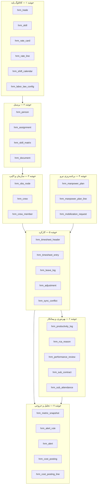
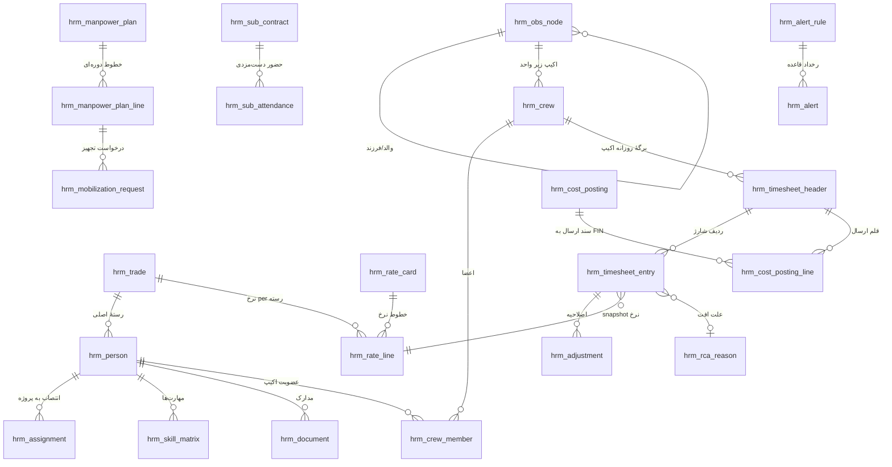

# HRM — Deliverable 2
# مدل داده جامع، ERD و قراردادهای نوع

نسخه ۱.۰ | 2026-09-08 | پیرو `docs/HRM_D1_Architecture.md` | حالت: ارتقای درون‌برنامه‌ای

> **شش قاعدهٔ حاکم بر این مدل داده**
> ۱) **هیچ ساعتی بی‌صاحب نیست** — هر ردیف تایم‌شیت اجباراً به یک `activity_id` و یک `cbs_id` گره می‌خورد.
> ۲) **ساعت خام و ساعت تفکیک‌شده جدا نگه داشته می‌شوند** — ورودی کاربر `hours_raw` است؛ تفکیک عادی/اضافه‌کاری/شب/جمعه خروجی موتور است و قابل ویرایش دستی نیست.
> ۳) **نرخ در تایم‌شیت ذخیره نمی‌شود** — تایم‌شیت فقط `rate_card_line_id` را snapshot می‌کند؛ مبلغ در FIN ساخته می‌شود (ADR-04).
> ۴) **دورهٔ بسته تغییر نمی‌کند** — اصلاح فقط با ردیف جدید در `hrm_adjustment` و ارجاع به ردیف اصلی (ADR-10).
> ۵) **حذف فیزیکی ممنوع** — همه‌جا `is_active` / `voided_at`؛ داده کارکرد سند مالی و حقوقی است.
> ۶) **همهٔ تجمیع‌ها مشتق‌اند** — تنها استثنا `hrm_metric_snapshot` است که عمداً غیرنرمال و تغییرناپذیر ذخیره می‌شود (ADR-11).

---

## ۱. نمای کلان مدل داده

مدل در **۷ خوشه** سازمان یافته است. جهت پیکان = جهت وابستگی (کلید خارجی).



**۲۶ جدول** (نسبت به D1 که ۲۰ جدول برآورد کرده بود، ۶ جدول تفکیک شد: `hrm_labor_law_config`، `hrm_assignment`، `hrm_manpower_plan_line`، `hrm_mobilization_request`، `hrm_sync_conflict`، `hrm_cost_posting_line` — دلیل هر تفکیک در بخش ۹ آمده است.)

---

## ۲. ERD مرجع (روابط اصلی)



---

## ۳. خوشه ۱ — کاتالوگ پایه

### 3-1. `hrm_trade` — رستهٔ شغلی
مرجع یگانهٔ رسته؛ هیچ رشتهٔ متنی آزادی برای شغل در سیستم پذیرفته نمی‌شود.

| فیلد | نوع | قید | توضیح |
|---|---|---|---|
| `id` | `TEXT` PK | `TR-####` | شناسه پایدار |
| `code` | `TEXT` | UNIQUE, NOT NULL | کد رسته مطابق کدینگ پیمان (مثلاً `WLD-6G`) |
| `name_fa` / `name_en` | `TEXT` | NOT NULL | دوزبانه (الزام Master Prompt) |
| `category` | ENUM `TradeCategory` | NOT NULL | `civil` \| `mechanical` \| `piping` \| `electrical` \| `instrument` \| `welding` \| `hse` \| `qc` \| `staff` \| `equipment_op` \| `general` |
| `is_direct` | `BOOLEAN` | NOT NULL | مستقیم/غیرمستقیم — پایهٔ محاسبهٔ `Indirect%` (آستانه ۲۵٪) |
| `std_productivity` | `REAL` | NULL | نرخ استاندارد (واحد بر نفر-ساعت) برای مقایسه با عملکرد واقعی |
| `std_uom` | `TEXT` | NULL | واحد نرخ استاندارد (`m3`, `inch-dia`, `m2`, `point`) |
| `crew_ratio_hint` | `TEXT` | NULL | ترکیب پیشنهادی اکیپ، مثلاً `1 استادکار : 2 کمکی` |
| `hse_required_docs` | `TEXT[]` | NULL | کد مدارک اجباری برای این رسته → مصرف در D7 |
| `is_active` | `BOOLEAN` | DEFAULT true | |

**ایندکس:** `UX_trade_code (code)`, `IX_trade_cat (category, is_active)`

### 3-2. `hrm_skill` — مهارت و گواهی‌نامه
`id`, `code` UNIQUE, `name_fa`, `name_en`, `type` (`certificate` \| `competency` \| `license` \| `training`), `issuing_body`, `validity_months` (NULL = بدون انقضا), `is_blocking` (اگر true، نبودِ معتبر آن مانع ثبت تایم‌شیت می‌شود).

### 3-3. `hrm_rate_card` — کارت نرخ (نسخه‌دار)
پیاده‌سازی ADR-05. **هیچ نرخی خارج از کارت نرخ وجود ندارد.**

| فیلد | نوع | قید | توضیح |
|---|---|---|---|
| `id` | `TEXT` PK | `RC-YYYY-##` | |
| `project_id` | `TEXT` FK | NULL = سراسری | کارت پروژه بر کارت سراسری اولویت دارد |
| `title` | `TEXT` | NOT NULL | |
| `currency` | ENUM | `IRR` \| `USD` | |
| `effective_from` / `effective_to` | `DATE` | `to` NULL = جاری | بازه‌ها نباید هم‌پوشانی داشته باشند (قید T-3) |
| `status` | ENUM | `draft` \| `approved` \| `superseded` | فقط `approved` قابل مصرف است |
| `approved_by` / `approved_at` | | | از `authorityFor()` |

### 3-4. `hrm_rate_line` — خط نرخ
`id`, `rate_card_id` FK, `trade_id` FK, `grade` (`helper`\|`skilled`\|`senior`\|`foreman`\|`supervisor`), `base_rate` REAL NOT NULL, `ot_factor` DEFAULT 1.4, `friday_factor` DEFAULT 1.4, `night_factor` DEFAULT 1.35, `shift_factor` DEFAULT 1.0, `burden_pct` (بیمه و مزایای کارفرما، پیش‌فرض ۲۳٪), `cbs_hint` (کد CBS پیش‌فرض این رسته در FIN).
**قید یکتایی:** `UX_rate_line (rate_card_id, trade_id, grade)`.

### 3-5. `hrm_shift_calendar` — تقویم شیفت (رفع شکاف H-07)
سازگار با `WorkCalendar` موجود در `planning.ts` — همان ساختار `workDays[]` + `holidays[]` را در ستون‌های `work_days` (آرایه ۰..۶) و `holidays` (آرایه ISO) نگه می‌دارد تا تبدیل بدون نگاشت انجام شود.
فیلدهای افزوده: `id`, `project_id`, `name`, `pattern` (`5-2` \| `6-1` \| `20-10` \| `14-14` \| `24-6` \| `custom`), `shift_start`, `shift_end`, `break_minutes`, `night_window_start` (پیش‌فرض `22:00`), `night_window_end` (پیش‌فرض `06:00`), `is_default`.

### 3-6. `hrm_labor_law_config` — پیکربندی قانون کار (تفکیک‌شده از موتور)
پیاده‌سازی ADR-07: ضرایب قانون کار **داده** هستند نه ثابت کد، تا برای پروژه‌های خارجی یا تغییر قانون بدون تغییر کد قابل تنظیم باشند.

| فیلد | پیش‌فرض ایران | مبنا |
|---|---|---|
| `daily_normal_cap` | ۸ ساعت | مادهٔ ۵۱ |
| `weekly_normal_cap` | ۴۴ ساعت | مادهٔ ۵۱ |
| `daily_ot_cap` | ۴ ساعت | مادهٔ ۵۹ |
| `daily_absolute_cap` | ۱۶ ساعت | قید ایمنی داخلی |
| `ot_factor` | ۱.۴۰ | مادهٔ ۵۹ |
| `holiday_factor` | ۱.۴۰ | مادهٔ ۶۲ |
| `night_factor` | ۱.۳۵ | مادهٔ ۵۸ |
| `shift_factor_dn` / `_dne` / `_ne` | ۱.۱۰ / ۱.۱۵ / ۱.۲۲۵ | مادهٔ ۵۶ |
| `weekend_days` | `[5]` (جمعه) | |

---

## ۴. خوشه ۲ — پرسنل

### 4-1. `hrm_person` — پروندهٔ پرسنلی
| فیلد | نوع | قید | توضیح |
|---|---|---|---|
| `id` | `TEXT` PK | `PS-######` | |
| `personnel_no` | `TEXT` | UNIQUE | شمارهٔ پرسنلی سازمانی |
| `national_id` | `TEXT` | UNIQUE, **masked** | کد ملی؛ در همهٔ خروجی‌ها به‌جز نقش HR Admin ماسک می‌شود (رفع H-09) |
| `first_name` / `last_name` | `TEXT` | NOT NULL | |
| `name_en` | `TEXT` | NULL | برای گزارش انگلیسی و ویزا |
| `birth_date`, `gender`, `phone`, `emergency_contact` | | | |
| `employment_type` | ENUM `EmploymentType` | NOT NULL | `permanent` \| `contract` \| `daily_wage` \| `subcontractor` \| `consultant` |
| `employer_id` | `TEXT` FK→`hrm_sub_contract` | NULL برای نیروی مستقیم | تفکیک نیروی خودی از پیمانکار |
| `primary_trade_id` | FK→`hrm_trade` | NOT NULL | |
| `grade` | ENUM | | هم‌راستا با `hrm_rate_line.grade` |
| `hire_date` / `termination_date` | `DATE` | | |
| `status` | ENUM `PersonStatus` | NOT NULL | `candidate` \| `onboarding` \| `active` \| `on_leave` \| `demobilized` \| `terminated` |
| `hse_clearance` | ENUM | | `none` \| `pending` \| `cleared` \| `expired` — **گیت ثبت کارکرد** |
| `photo_ref`, `signature_ref` | `TEXT` | | ارجاع فایل برای امضای دیجیتال تایم‌شیت |

**ماشین حالت `status`:**
`candidate → onboarding → active ⇄ on_leave → demobilized → terminated`
گذار به `active` فقط وقتی مجاز است که هیچ مدرک `is_blocking` منقضی نداشته باشد و `hse_clearance = cleared`.

**ایندکس:** `UX_person_no`, `UX_person_nid`, `IX_person_trade (primary_trade_id, status)`

### 4-2. `hrm_assignment` — انتصاب به پروژه
یک نفر می‌تواند هم‌زمان روی چند پروژه باشد؛ بدون این جدول، مالکیت ساعت مبهم می‌شد.
`id`, `person_id` FK, `project_id`, `obs_node_id` FK, `crew_id` FK NULL, `allocation_pct` (پیش‌فرض ۱۰۰), `start_date`, `end_date`, `rate_card_id` FK, `cost_center`, `status` (`planned`\|`mobilized`\|`demobilized`).
**قید T-1:** مجموع `allocation_pct` یک نفر در یک تاریخ ≤ ۱۰۰.

### 4-3. `hrm_skill_matrix`
`id`, `person_id`, `skill_id`, `level` (۱..۵), `certified_at`, `expires_at`, `evidence_ref`, `verified_by`.
**قاعده:** `expires_at < today` و `skill.is_blocking = true` ⇒ خطای مسدودکنندهٔ ثبت تایم‌شیت با کد `E-HRM-201`.

### 4-4. `hrm_document`
`id`, `person_id`, `doc_type` (`id_card`\|`contract`\|`medical`\|`hse_card`\|`insurance`\|`training`\|`visa`\|`other`), `doc_no`, `issued_at`, `expires_at`, `file_ref`, `is_blocking`, `status` (`valid`\|`expiring`\|`expired`\|`missing`).
`status` **مشتق** است: `expiring` وقتی `expires_at - today ≤ 30 روز` → مصرف مستقیم در `EWS-HRM-04`.

---

## ۵. خوشه ۳ — سازمان و اکیپ

### 5-1. `hrm_obs_node` — ساختار شکست سازمانی
`id`, `project_id`, `parent_id` (خودارجاع), `code` (مسیر نقطه‌ای مانند `PRJ.CIV.CONC`), `name_fa`, `name_en`, `level` (۱..۶), `manager_person_id`, `wbs_link[]` (نگاشت به WBS در PEX — پایهٔ ماتریس RAM), `sort_order`, `is_active`.
**قید T-2:** درخت باید بدون دور باشد؛ `code` باید با `parent.code` پیشوند بخورد (اعتبارسنجی در سرویس، نه در پایگاه‌داده).

### 5-2. `hrm_crew` — اکیپ
`id`, `project_id`, `code`, `name`, `obs_node_id` FK, `foreman_person_id` FK, `trade_mix` (JSON: `{trade_id: count}`), `shift_calendar_id` FK, `default_cbs_id`, `status` (`forming`\|`active`\|`disbanded`), `target_size`.

### 5-3. `hrm_crew_member`
`id`, `crew_id`, `person_id`, `role_in_crew` (`foreman`\|`skilled`\|`helper`\|`operator`), `from_date`, `to_date`.
**قید T-4:** یک نفر در یک تاریخ فقط عضو یک اکیپ فعال است (جلوگیری از دوبار شمارش نفر-ساعت).

---

## ۶. خوشه ۴ — برنامه‌ریزی نیرو

### 6-1. `hrm_manpower_plan` — سربرگ برنامه
`id`, `project_id`, `version` (`baseline` \| `rev-N`), `basis` (`bid` \| `re-baseline` \| `forecast`), `status` (`draft`\|`approved`\|`superseded`), `approved_by`, `approved_at`, `total_planned_mh`.
**قاعده:** فقط یک نسخهٔ `baseline` تأییدشده در هر پروژه؛ مقایسهٔ هیستوگرام همیشه با آن انجام می‌شود (D8).

### 6-2. `hrm_manpower_plan_line` — خط برنامه (دانهٔ داده: دوره × رسته)
`id`, `plan_id`, `period_code` (`2026-W12` یا `1405-03`), `period_start`, `period_end`, `trade_id`, `obs_node_id`, `wbs_id`, `planned_headcount` REAL, `planned_mh` REAL, `productivity_assumption`.
**ایندکس:** `IX_plan_line (plan_id, period_start, trade_id)` — کوئری اصلی هیستوگرام.

### 6-3. `hrm_mobilization_request` — درخواست تجهیز/تعدیل نیرو
`id`, `project_id`, `plan_line_id` FK, `request_type` (`mobilize`\|`demobilize`\|`replace`), `trade_id`, `qty`, `need_by_date`, `justification`, `status` (`draft`\|`submitted`\|`approved`\|`rejected`\|`fulfilled`), `approver_role` (از `authorityFor()`), `fulfilled_qty`, `fulfilled_at`.
`MobVar = (ActualHC − PlanHC)/PlanHC` از این جدول در برابر `plan_line` محاسبه می‌شود؛ آستانه ±۱۰٪ → `EWS-HRM-01`.

---

## ۷. خوشه ۵ — کارکرد (هستهٔ ماژول)

### 7-1. `hrm_timesheet_header` — برگهٔ روزانه
دانهٔ داده: **یک اکیپ × یک روز × یک شیفت**.

| فیلد | نوع | توضیح |
|---|---|---|
| `id` | `TEXT` PK | `TS-{project}-{yyyymmdd}-{crew}` — قطعی و idempotent برای همگام‌سازی آفلاین |
| `project_id`, `crew_id`, `obs_node_id` | FK | |
| `work_date` | `DATE` NOT NULL | |
| `shift` | ENUM | `day` \| `night` \| `swing` |
| `shift_calendar_id` | FK | تقویم مؤثر همان روز |
| `status` | ENUM `TimesheetStatus` | چرخهٔ ۷ حالتی زیر |
| `source` | ENUM | `web` \| `mobile` \| `excel` \| `api` |
| `weather`, `site_condition` | | ورودی ادعا و RCA |
| `gps_lat`, `gps_lng`, `gps_accuracy_m` | REAL | الزام ثبت میدانی |
| `photo_refs` | `TEXT[]` | عکس صف حضور/کارگاه |
| `foreman_signature_ref` | `TEXT` | امضای سرپرست |
| `client_signature_ref` | `TEXT` | امضای نمایندهٔ کارفرما (کلید ادعای صورت‌کارکرد) |
| `device_id`, `app_version`, `captured_at` | | ممیزی و حل تعارض |
| `sync_state` | ENUM | `local` \| `queued` \| `synced` \| `conflict` |
| `revision` | INT | شمارندهٔ نسخه برای تشخیص تعارض |
| `locked_at`, `locked_by` | | قفل دوره (ADR-10) |
| `total_hours_raw`, `total_hours_normal`, `total_hours_ot`, `total_hours_night`, `total_hours_holiday` | REAL | **مشتق و cache شده** — همیشه برابر جمع ردیف‌ها |

**ماشین حالت `status` (۷ حالت):**
```
draft → submitted → foreman_approved → qc_verified → pm_approved → posted → locked
                 ↘ rejected ↗ (بازگشت به draft با ثبت دلیل)
```
| گذار | مجوز لازم | اثر |
|---|---|---|
| `draft → submitted` | خودِ ثبت‌کننده | قفل ویرایش برای غیرسرپرست |
| `submitted → foreman_approved` | `foremanApprove` | امضای سرپرست الزامی |
| `foreman_approved → qc_verified` | نقش QC (اختیاری per project) | تطبیق با پیشرفت `Approved` |
| `qc_verified → pm_approved` | `authorityFor("timesheet", amount)` | ورود به EarnedMH و بهره‌وری |
| `pm_approved → posted` | موتور D12 | ایجاد `hrm_cost_posting` |
| `posted → locked` | بستن دوره | هر تغییر فقط از راه `hrm_adjustment` |

### 7-2. `hrm_timesheet_entry` — ردیف شارژ (پرحجم‌ترین جدول سیستم)
دانهٔ داده: **یک نفر × یک برگه × یک فعالیت**.

| فیلد | نوع | قید | توضیح |
|---|---|---|---|
| `id` | `TEXT` PK | | |
| `header_id` | FK | NOT NULL, ON DELETE RESTRICT | |
| `person_id` | FK | NOT NULL | |
| `trade_id`, `grade` | | snapshot در لحظهٔ ثبت | رستهٔ نفر ممکن است بعداً عوض شود؛ گزارش تاریخی نباید تغییر کند |
| `activity_id` | `TEXT` | **NOT NULL** | قاعدهٔ ۱ — ارجاع به فعالیت PEX |
| `wbs_id`, `cbs_id` | `TEXT` | `cbs_id` NOT NULL | مقصد هزینه در FIN |
| `hours_raw` | REAL | `0 < x ≤ 16` | تنها عدد ورودی کاربر |
| `hours_normal`, `hours_ot`, `hours_night`, `hours_holiday`, `hours_shift` | REAL | **read-only** | خروجی `TimesheetEngine` طبق `hrm_labor_law_config` |
| `attendance_code` | ENUM | | `present` \| `absent` \| `leave` \| `sick` \| `mission` \| `standby` \| `weather_delay` \| `no_work_front` |
| `is_productive` | BOOLEAN | | `standby`/`weather_delay`/`no_work_front` ⇒ false → از مخرج PI حذف نمی‌شود ولی در `LostTime%` می‌آید |
| `qty_done`, `qty_uom` | REAL/TEXT | NULL | کمیت اجراشده برای `Rate = Qty/ActualMH` |
| `rate_line_id` | FK | NOT NULL | snapshot نرخ (قاعدهٔ ۳) — مبلغ ذخیره نمی‌شود |
| `rca_reason_id` | FK | NULL | علت افت بهره‌وری |
| `note` | TEXT | | |
| `voided_at`, `voided_by`, `void_reason` | | | ابطال به‌جای حذف (قاعدهٔ ۵) |

**اعتبارسنجی‌های سطح ردیف (کدهای خطا):**
| کد | قاعده |
|---|---|
| `E-HRM-101` | `activity_id` خالی یا نامعتبر |
| `E-HRM-102` | جمع `hours_raw` یک نفر در یک روز > `daily_absolute_cap` |
| `E-HRM-103` | ثبت در دورهٔ `locked` |
| `E-HRM-104` | نفر در آن تاریخ `assignment` فعال روی این پروژه ندارد |
| `E-HRM-105` | `cbs_id` در FIN وجود ندارد یا بسته است |
| `E-HRM-201` | مدرک مسدودکننده منقضی |
| `E-HRM-202` | `hse_clearance ≠ cleared` |
| `W-HRM-301` | `hours_ot` بالاتر از `daily_ot_cap` → هشدار، نه خطا (نیازمند تأیید سطح بالاتر) |
| `W-HRM-302` | `qty_done` بدون `qty_uom` |

**ایندکس‌ها (طبق سیاست حجم D1):**
`IX_entry_date_act (project_id, work_date, activity_id)` · `IX_entry_person (person_id, work_date)` · `IX_entry_cbs (cbs_id, work_date)` · پارتیشن ماهانه روی `work_date`.

### 7-3. `hrm_leave_log`
`id`, `person_id`, `leave_type` (`annual`\|`sick`\|`unpaid`\|`mission`\|`rotation`), `from_date`, `to_date`, `days`, `status`, `approved_by`, `doc_ref`.
مبنای `Absenteeism%` (آستانه ۵٪).

### 7-4. `hrm_adjustment` — سند اصلاحی (ADR-10)
`id`, `original_entry_id` FK, `adjustment_type` (`reverse`\|`reclass`\|`hours_correction`), `delta_hours`, `new_activity_id`, `new_cbs_id`, `reason_code`, `reason_text` NOT NULL, `period_code`, `approved_by`, `approved_at`, `posted_to_fin` BOOLEAN.
**قاعده:** جمع جبری `delta_hours` هر ردیف اصلی + ساعت اصلی هرگز منفی نمی‌شود.

### 7-5. `hrm_sync_conflict` — دفتر تعارض آفلاین (رفع شکاف H-03)
`id`, `entity_type`, `entity_id`, `device_id`, `local_revision`, `server_revision`, `local_payload` JSON, `server_payload` JSON, `detected_at`, `resolution` (`server_wins`\|`local_wins`\|`merged`\|`manual`), `resolved_by`, `resolved_at`, `diff_summary`.

**جدول تصمیم حل تعارض (جایگزین LWW — ADR-08):**
| وضعیت سرور | وضعیت محلی | تصمیم |
|---|---|---|
| `draft` | هر چیز | آخرین `captured_at` برنده |
| `submitted` | `draft` | سرور برنده؛ محلی به‌عنوان پیشنهاد ثبت می‌شود |
| `foreman_approved` یا بالاتر | هر چیز | **سرور همیشه برنده**؛ ردیف محلی به `hrm_sync_conflict` می‌رود و نیاز به `hrm_adjustment` دارد |
| `locked` | هر چیز | رد قطعی با `E-HRM-103` |
| هر دو `draft` با امضای متفاوت | | ردیف دارای `foreman_signature_ref` برنده |

---

## ۸. خوشه ۶ و ۷ — بهره‌وری، پیمانکار، خروجی

### 8-1. `hrm_productivity_log`
دانه: **فعالیت × دوره**. `id`, `project_id`, `activity_id`, `period_code`, `budget_mh`, `earned_mh`, `actual_mh`, `pi`, `pf`, `qty_done`, `unit_rate`, `std_rate`, `variance_pct`, `trend` (`improving`\|`stable`\|`declining`), `computed_at`, `input_hash`.
`earned_mh = budget_mh × progress_approved%` — منبع `activityProgress()` در PEX. `input_hash` با `stableStringify` بازگشتی ساخته می‌شود تا محاسبهٔ تکراری تشخیص داده شود.

### 8-2. `hrm_rca_reason` — کاتالوگ علت افت
`id`, `code`, `name_fa`, `name_en`, `category` (`material`\|`equipment`\|`drawing`\|`permit`\|`weather`\|`rework`\|`access`\|`manpower_skill`\|`client_delay`\|`hse_stop`), `is_claimable` (پل به RCC/d4), `default_owner_domain`.

### 8-3. `hrm_performance_review`
`id`, `person_id`, `period_code`, `reviewer_id`, `scores` JSON (`{quality, safety, attendance, teamwork, output}`), `overall`, `recommendation` (`retain`\|`promote`\|`train`\|`replace`), `comments`.

### 8-4. `hrm_sub_contract` — قرارداد نیروی پیمانکاری
`id`, `project_id`, `contractor_name`, `contract_no`, `scope_trades[]`, `pricing_model` (`hourly`\|`daily`\|`unit_rate`\|`lump_sum`), `agreed_rates` JSON, `start_date`, `end_date`, `retention_pct`, `penalty_terms`, `status`, `fin_vendor_id` (پل به FIN).

### 8-5. `hrm_sub_attendance`
`id`, `sub_contract_id`, `work_date`, `trade_id`, `headcount`, `hours`, `activity_id`, `cbs_id`, `verified_by`, `gate_pass_ref`, `invoice_period`, `status`.
جدا از `hrm_timesheet_entry` نگه داشته می‌شود چون دانهٔ داده **گروهی** است (تعداد نفر، نه فرد) و مسیر تأیید و صورت‌وضعیت متفاوتی دارد.

### 8-6. `hrm_metric_snapshot` (ADR-11)
`id`, `project_id`, `period_code`, `metric_code` (`PI`\|`PF`\|`OT_PCT`\|`INDIRECT_PCT`\|`ABSENTEEISM`\|`MOB_VAR`), `dimension` (`project`\|`obs`\|`crew`\|`trade`\|`activity`), `dimension_id`, `value`, `target`, `status` (`green`\|`amber`\|`red`), `computed_at`, `input_hash`, `is_final`.
**تغییرناپذیر**: پس از `is_final = true` هیچ به‌روزرسانی مجاز نیست.

### 8-7. `hrm_alert_rule` و `hrm_alert`
`hrm_alert_rule`: `id` (`EWS-HRM-01..04`), `name`, `metric_code`, `operator`, `threshold`, `consecutive_periods`, `severity`, `notify_roles[]`, `is_active`.
`hrm_alert`: `id`, `rule_id`, `project_id`, `dimension`, `dimension_id`, `period_code`, `actual_value`, `severity`, `status` (`open`\|`ack`\|`resolved`\|`suppressed`), `raised_at`, `ack_by`, `resolved_at`, `action_plan_ref`.

### 8-8. `hrm_cost_posting` + `hrm_cost_posting_line` (رفع شکاف H-04)
سربرگ: `id`, `project_id`, `period_code`, `posting_date`, `total_hours`, `total_amount`, `currency`, `rate_card_id`, `status` (`draft`\|`sent`\|`accepted`\|`rejected`\|`reversed`), `fin_ref`, `idempotency_key`, `event_hash`.
خط: `id`, `posting_id`, `cbs_id`, `activity_id`, `trade_id`, `hours_normal`, `hours_ot`, `hours_night`, `hours_holiday`, `amount_base`, `amount_premium`, `amount_burden`, `amount_total`, `source_entry_ids[]`.

**اسکیمای رویداد `hrm.labor.posted` (قرارداد یگانه با FIN):**
```jsonc
{
  "event": "hrm.labor.posted",
  "version": "1.0",
  "idempotency_key": "HRM-{project}-{period}-{seq}",
  "project_id": "OG-2401",
  "period_code": "1405-06",
  "currency": "IRR",
  "rate_card_id": "RC-2026-01",
  "lines": [
    { "cbs_id": "CBS-3.2.1", "activity_id": "A-1240", "trade_id": "TR-0007",
      "hours": { "normal": 1320, "ot": 210, "night": 96, "holiday": 40 },
      "amount_base": 0, "amount_premium": 0, "amount_burden": 0, "amount_total": 0 }
  ],
  "totals": { "hours": 1666, "amount": 0 },
  "event_hash": "fnv1a-…"
}
```
`event_hash` با همان `hashLink()` موجود در `governance.ts` تولید می‌شود تا در زنجیرهٔ ممیزی حاکمیت قابل تأیید باشد. تکرار ارسال با `idempotency_key` بی‌اثر است.

---

## ۹. قراردادهای نوع (TypeScript) — پیش‌نویس `src/services/workforce.ts`

```ts
export type TradeCategory =
  | "civil" | "mechanical" | "piping" | "electrical" | "instrument"
  | "welding" | "hse" | "qc" | "staff" | "equipment_op" | "general";

export type Grade = "helper" | "skilled" | "senior" | "foreman" | "supervisor";

export type TimesheetStatus =
  | "draft" | "submitted" | "foreman_approved" | "qc_verified"
  | "pm_approved" | "posted" | "locked" | "rejected";

export type AttendanceCode =
  | "present" | "absent" | "leave" | "sick"
  | "mission" | "standby" | "weather_delay" | "no_work_front";

export type LaborLawConfig = {
  dailyNormalCap: number;   // 8
  weeklyNormalCap: number;  // 44
  dailyOtCap: number;       // 4
  dailyAbsoluteCap: number; // 16
  otFactor: number;         // 1.40
  holidayFactor: number;    // 1.40
  nightFactor: number;      // 1.35
  shiftFactorDN: number;    // 1.10
  shiftFactorDNE: number;   // 1.15
  shiftFactorNE: number;    // 1.225
  weekendDays: number[];    // [5]
  nightWindow: { start: string; end: string }; // "22:00" .. "06:00"
};

export type HoursBreakdown = {
  raw: number; normal: number; ot: number;
  night: number; holiday: number; shift: number;
};

export type TimesheetEntry = {
  id: string; headerId: string; personId: string;
  tradeId: string; grade: Grade;
  activityId: string; wbsId?: string; cbsId: string;
  hoursRaw: number; hours: HoursBreakdown;   // hours خروجی موتور است
  attendanceCode: AttendanceCode; isProductive: boolean;
  qtyDone?: number; qtyUom?: string;
  rateLineId: string; rcaReasonId?: string;
  note?: string; voidedAt?: string;
};

export type ProductivityResult = {
  activityId: string; periodCode: string;
  budgetMH: number; earnedMH: number; actualMH: number;
  pi: number; pf: number;
  unitRate?: number; stdRate?: number; variancePct?: number;
  trend: "improving" | "stable" | "declining";
  inputHash: string;
};
```

**قرارداد امضای موتور (ثابت برای D4 و D5):**
```ts
export function splitHours(
  hoursRaw: number, opts: { date: string; shift: "day"|"night"|"swing";
  calendar: WorkCalendar; law: LaborLawConfig; priorHoursToday: number }
): HoursBreakdown;

export function computeProductivity(
  entries: TimesheetEntry[], progress: Record<string, number>,
  budgets: Record<string, number>, periodCode: string
): ProductivityResult[];
```

---

## ۱۰. سازگاری عقب‌رو و مهاجرت داده

| مورد قدیمی | راهکار |
|---|---|
| `totalManHours` در `ProjectControl.tsx:528` | VIEW سازگاری `v_legacy_manhours` = `SUM(hours_raw)` روی `pm_approved` و بالاتر؛ فیلد حذف نمی‌شود، فقط مشتق می‌شود (رفع H-08) |
| `manHours` فعالیت‌ها در `pexProject.ts` | بدون تغییر؛ به‌عنوان `budget_mh` در `hrm_productivity_log` خوانده می‌شود |
| `WorkCalendar` در `planning.ts` | `hrm_shift_calendar` هم‌ساختار است؛ تابع `toWorkCalendar(row)` بدون نگاشت میدانی |
| `DATA_OWNER` در `governance.ts` | افزودن دو کلید: `manhour: "d9"`, `productivity: "d9"` (رفع H-02) — **تنها تغییر در فایل مشترک در این تحویلی** |
| `docs/PEX_D8_Resources.md` | یادداشت ارجاع در سرصفحه: مالکیت Resource/Timesheet به HRM منتقل شد (رفع H-01) |

**ترتیب مهاجرت (چهار گام، بدون توقف سرویس):** ایجاد جداول → بارگذاری کاتالوگ پایه (رسته/نرخ/تقویم) → ایجاد VIEWهای سازگاری → قطع نوشتن مستقیم روی فیلدهای قدیمی.

## ۱۱. برآورد حجم (پروژه ۵٬۰۰۰ نفره — سقف الزام)
| جدول | ردیف در سال | ملاحظه |
|---|---|---|
| `hrm_timesheet_entry` | ~۲.۲ میلیون (۵٬۰۰۰ نفر × ۳۰۰ روز × ۱.۵ فعالیت) | پارتیشن ماهانه اجباری |
| `hrm_timesheet_header` | ~۶۰٬۰۰۰ (۲۰۰ اکیپ × ۳۰۰ روز) | |
| `hrm_metric_snapshot` | ~۱۵۰٬۰۰۰ | نگهداری ۵ ساله |
| `hrm_person` | ~۸٬۰۰۰ با گردش نیرو | |
هدف کارایی: کوئری هیستوگرام ماهانه < ۱.۵ ثانیه با استفاده از snapshot به‌جای پیمایش ردیف‌ها.

---

## ۱۲. اجرای ۱۰ Loop خودارزیابی

| Loop | معیار | نتیجه | شاهد / اقدام |
|---|---|---|---|
| **L1 PMBOK / ISO 30414** | آیا مدل، شاخص‌های سرمایهٔ انسانی استاندارد را پشتیبانی می‌کند؟ | ✅ | `hrm_person` + `hrm_leave_log` + `hrm_performance_review` پوشش نرخ گردش، غیبت، بهره‌وری و ترکیب نیرو |
| **L2 Trade Catalog** | رسته، مهارت، نرخ و نرخ استاندارد نرمال شده؟ | ✅ | `hrm_trade.std_productivity` + `hrm_rate_line` با ۵ ضریب؛ هیچ شغل متنی آزادی مجاز نیست |
| **L3 Timesheet Charging** | هر ساعت به فعالیت و CBS می‌رسد؟ | ✅ | `activity_id`/`cbs_id` NOT NULL + `E-HRM-101`/`E-HRM-105` |
| **L4 Mobile PWA** | idempotency، تعارض، شواهد میدانی | ✅ | `id` قطعی برگه + `revision` + `hrm_sync_conflict` + جدول تصمیم ۵ ردیفی → **H-03 بسته شد** |
| **L5 Productivity** | PI از پیشرفت تأییدشده و ریشه‌یابی | ✅ | `hrm_productivity_log.earned_mh` از `activityProgress()` + `hrm_rca_reason` با پرچم `is_claimable` |
| **L6 Onboarding / HSE** | گیت مدرک و انطباق | ✅ | `hse_clearance` + `is_blocking` + `E-HRM-201/202` مانع ثبت ساعت |
| **L7 Histogram** | Plan vs Actual در یک دانهٔ مشترک | ✅ | `hrm_manpower_plan_line` دقیقاً هم‌دانهٔ تجمیع تایم‌شیت (دوره × رسته × OBS) |
| **L8 Cross-Module** | قرارداد رویداد با FIN و PEX | ✅ | اسکیمای `hrm.labor.posted` با `idempotency_key` و `event_hash` → **H-04 بسته شد** |
| **L9 Reports A4** | آیا مدل، فیلدهای سربرگ سه‌لوگو و امضا را دارد؟ | 🟡 | فیلدهای امضا و GPS هست، اما موتور تولید فایل هنوز نیست — شکاف مشترک با PEX-G3، به D10 موکول شد |
| **L10 In-App Migration** | سازگاری عقب‌رو و ترتیب مهاجرت | 🟡 | بخش ۱۰ ترتیب چهارگامی را داد، اما اسکریپت اجرایی و داده پایهٔ رسته‌های ایران هنوز نوشته نشده (H-10) |

**۸ سبز / ۲ زرد.** دو شکاف High تحویلی قبل (H-03، H-04) در همین سند بسته شدند.

---

## ۱۳. جدول Gap Analysis پس از D2

| # | شکاف | سطح | تحویلی هدف | راه‌حل پیشنهادی | برآورد |
|---|---|---|---|---|---|
| **H-01** | هم‌پوشانی با `PEX_D8_Resources` | H → **بسته** | D2 | یادداشت ارجاع + انتقال مالکیت به HRM (بخش ۱۰) | انجام‌شده |
| **H-02** | نبود کلید `manhour` در `DATA_OWNER` | H | D3 | افزودن `manhour: "d9"`, `productivity: "d9"` — تک‌خطی و ایزوله | ۱۰ دقیقه |
| **H-03** | قواعد حل تعارض آفلاین | H → **بسته** | D2 | `hrm_sync_conflict` + جدول تصمیم مبتنی بر وضعیت و امضا | انجام‌شده |
| **H-04** | اسکیمای رویداد ارسال هزینه | H → **بسته** | D2 | `hrm.labor.posted` v1.0 + `idempotency_key` + `event_hash` | انجام‌شده |
| **H-05** | نقش‌های RBAC ماژول | M | D14 | ۶ نقش: HR Admin، Planner، Foreman، QC، PM، Viewer | ۱ روز |
| **H-06** | تولید PDF/Word/Excel | M | D10/D11 | مشترک با PEX-G3؛ راهکار یکسان برای هر دو ماژول | ۳ روز |
| **H-07** | تقویم شیفت | M → **بسته** | D2 | `hrm_shift_calendar` هم‌ساختار با `WorkCalendar` | انجام‌شده |
| **H-08** | `totalManHours` میراثی | L → **بسته** | D2 | VIEW `v_legacy_manhours` | انجام‌شده |
| **H-09** | ماسک کد ملی و نرخ حقوق | M | D14 | ماسک در لایهٔ سریال‌سازی، نه UI؛ نقش HR Admin استثنا | ۰.۵ روز |
| **H-10** | داده پایهٔ رسته‌های ایران | M | D3 | ~۶۰ رستهٔ استاندارد صنعت نفت و ساختمان با نرخ استاندارد | ۱ روز |
| **H-11** | *جدید* — سیاست نگهداشت و بایگانی داده کارکرد | L | D14 | نگهداری آنلاین ۲ سال، بایگانی سرد ۱۰ سال (الزام حقوقی) | ۰.۵ روز |
| **H-12** | *جدید* — واحد پول دوگانه (IRR/USD) در تجمیع | M | D12 | نرخ تبدیل از FIN خوانده شود؛ HRM نرخ تبدیل نگه نمی‌دارد | ۱ روز |

**جمع‌بندی:** از ۴ شکاف High تحویلی ۱، سه مورد بسته شد (H-01، H-03، H-04) و H-02 به یک تغییر تک‌خطی در D3 تقلیل یافت. دو شکاف جدید (H-11، H-12) شناسایی شد که هیچ‌کدام مسدودکننده نیستند.

---

## ۱۴. سه تصمیم باز (تکرار از D1 — هنوز بی‌پاسخ)
۱. کد دامنه `d9` تأیید می‌شود؟ (فرض جاری: بله)
۲. آیتم سایدبار افزوده شود؟ (فرض جاری طبق ADR-13: **خیر**؛ دسترسی از داخل ورک‌اسپیس)
۳. دامنهٔ Payroll: فقط نرخ×ساعت برای هزینهٔ پروژه (فرض جاری) یا فیش حقوقی و بیمهٔ کامل؟
   ↳ مدل داده طوری طراحی شد که با افزودن دو جدول (`hrm_payroll_run`، `hrm_payslip`) بدون تغییر ساختار فعلی قابل توسعه باشد.

**ایست — منتظر دستور برای Deliverable 3 (برنامه‌ریزی نیرو، OBS و تجهیز).**
