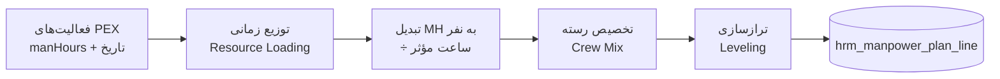

# HRM — Deliverable 3
# برنامه‌ریزی نیرو، ساختار شکست سازمانی (OBS) و تجهیز نیرو
### زیرماژول 09.1

نسخه ۱.۰ | 2026-09-08 | پیرو `HRM_D1_Architecture.md` و `HRM_D2_DataModel.md`

---

## ۰. تصمیم‌های قفل‌شدهٔ جدید (بر پایهٔ پاسخ کاربر)

| شناسه | تصمیم | اثر |
|---|---|---|
| **ADR-13 (بازنگری‌شده)** | ماژول HRM **آیتم مستقل در سایدبار اصلی** دارد و **بلافاصله پس از ماژول HSE** و **پیش از «مدیریت سامانه و پیکربندی پایه»** قرار می‌گیرد | یک ورودی جدید در `src/data/framework.ts`؛ سایر آیتم‌ها و ترتیبشان دست‌نخورده |
| **ADR-14** | دامنهٔ مالی HRM = **نرخ × ساعت برای هزینهٔ پروژه**. حقوق و دستمزد، فیش، بیمه، مالیات و تسویه **خارج از دامنه** است | جداول `hrm_payroll_run` و `hrm_payslip` که در D2 به‌عنوان توسعهٔ آتی نام برده شده بودند **ساخته نمی‌شوند**. `hrm_rate_line.burden_pct` می‌ماند چون جزء هزینهٔ پروژه است، نه پرداخت به فرد |
| **ADR-15** | کد دامنه در یک ثابت متمرکز `HRM_DOMAIN_ID` نگهداری می‌شود، نه پراکنده در فایل‌ها | تغییر کد از `d10` به هر مقدار دیگر = ویرایش یک خط |

### ۰-۱. مسئلهٔ باز کد دامنه (نیازمند تأیید یک‌خطی شما)

ترتیب فعلی دامنه‌ها در `src/data/framework.ts` (این مخزن، بدون HSE):
`d1 → d2 → d3 → d4 → d5 → d6 → d8 (کیفیت) → d7 (سامانه، همیشه آخر)`

ماژول HSE در چت موازی ساخته شد و در این مخزن نیست. چون کد آزاد بعدی در آن زمان `d9` بوده، به‌احتمال قوی **HSE = `d9`** است. بنابراین:

> **کد انتخابی برای HRM: `d10`** — و جایگاه: پس از `d9` (HSE)، پیش از `d7`.

اگر پس از اعمال پچ HSE مشخص شد که HSE کد دیگری گرفته، فقط `HRM_DOMAIN_ID` عوض می‌شود.

### ۰-۲. اثر ADR-14 بر مدل داده D2
| جدول | وضعیت پس از ADR-14 |
|---|---|
| `hrm_rate_line` | می‌ماند — نرخ **هزینهٔ پروژه** است نه دستمزد فرد |
| `hrm_rate_line.burden_pct` | می‌ماند — سربار کارفرما جزء AC پروژه است |
| `hrm_cost_posting` / `_line` | می‌ماند — قلب ADR-14 |
| `hrm_payroll_run`, `hrm_payslip` | **حذف از نقشهٔ راه** |
| `hrm_person.national_id` | همچنان ماسک می‌شود (H-09)، ولی دیگر داده‌های بانکی و بیمه‌ای ذخیره نمی‌شود → دامنهٔ ریسک حریم خصوصی کوچک‌تر شد |

---

## ۱. ساختار منوی ماژول در سایدبار

ورودی جدید در `src/data/framework.ts`، هم‌شکل با ورودی `d8`:

```ts
{
  id: HRM_DOMAIN_ID,            // "d10"
  icon: "👷",
  accent: "#F59E0B",
  title: { fa: "مدیریت منابع انسانی و بهره‌وری نیروی کار",
           en: "Human Resources & Workforce Productivity" },
  processes: [ /* ۶ فرآیند زیر */ ],
}
```

| کد فرآیند | عنوان فارسی | عنوان انگلیسی | جداول اصلی |
|---|---|---|---|
| `d10-p1` | برنامه‌ریزی نیرو، OBS و تجهیز | Workforce Planning, OBS & Mobilization | `hrm_obs_node`, `hrm_manpower_plan*`, `hrm_mobilization_request` |
| `d10-p2` | تایم‌شیت و حضور و غیاب | Timesheet & Attendance | `hrm_timesheet_header/entry`, `hrm_leave_log` |
| `d10-p3` | بهره‌وری و عملکرد نیرو | Workforce Productivity & Performance | `hrm_productivity_log`, `hrm_rca_reason` |
| `d10-p4` | اکیپ و نیروی پیمانکاری | Crews & Subcontracted Labor | `hrm_crew*`, `hrm_sub_contract`, `hrm_sub_attendance` |
| `d10-p5` | پذیرش، احکام و انطباق | Onboarding, Assignment & Compliance | `hrm_person`, `hrm_assignment`, `hrm_document`, `hrm_skill_matrix` |
| `d10-p6` | تحلیل، هیستوگرام و گزارش | Analytics, Histogram & Reporting | `hrm_metric_snapshot`, `hrm_alert*` |

**قید حفاظتی:** هیچ آیتم موجودی جابه‌جا، حذف یا تغییرنام نمی‌شود؛ فقط یک عضو به آرایه اضافه می‌شود، در موقعیتی مشخص. `d7` آخرین عضو باقی می‌ماند.

---

## ۲. ساختار شکست سازمانی (OBS)

### ۲-۱. شش سطح استاندارد

| سطح | نام | نمونه کد | نمونه | مسئول |
|---|---|---|---|---|
| L1 | پروژه | `OG2401` | پروژه OG-2401 | مدیر پروژه |
| L2 | حوزهٔ اجرایی | `OG2401.CON` | ساختمان و نصب / مهندسی / پشتیبانی / HSEQ | مدیر حوزه |
| L3 | دیسیپلین | `OG2401.CON.CIV` | عمران / مکانیک / برق / ابزار دقیق | سرپرست دیسیپلین |
| L4 | منطقه یا واحد کاری | `OG2401.CON.CIV.A1` | Area 1، Unit 200 | سوپروایزر منطقه |
| L5 | اکیپ | `OG2401.CON.CIV.A1.CR03` | اکیپ بتن‌ریزی ۳ | سرپرست اکیپ |
| L6 | نفر | — | ارجاع به `hrm_person` | — |

**قواعد OBS:**
1. کد فرزند **باید** با کد والد شروع شود (`code.startsWith(parent.code + ".")`) — اعتبارسنجی در سرویس، کد خطا `E-HRM-110`.
2. حداکثر عمق ۶؛ عمق بیشتر رد می‌شود (`E-HRM-111`).
3. گره‌ای که `hrm_assignment` فعال دارد قابل حذف نیست؛ فقط `is_active = false` با انتقال اجباری اعضا (`E-HRM-112`).
4. هر گرهٔ سطح ≥ L3 باید `manager_person_id` داشته باشد، وگرنه هشدار `W-HRM-310`.
5. جابه‌جایی زیردرخت مجاز است و کدهای فرزندان به‌صورت آبشاری بازنویسی می‌شوند، اما **تاریخچهٔ تایم‌شیت با `obs_node_id` قدیمی حفظ می‌شود** (کد عوض می‌شود، شناسه نه).

### ۲-۲. ماتریس OBS × WBS (RAM/RACI)

`hrm_obs_node.wbs_link[]` پل میان سازمان و کار است. از تقاطع این دو، ماتریس مسئولیت تولید می‌شود:

```
              WBS-1.1   WBS-1.2   WBS-2.1   WBS-2.2
CON.CIV          R         R         C          -
CON.MEC          -         C         R          R
QAQC             A         A         A          A
HSE              I         I         I          I
```

| نقش | معنی | منبع داده |
|---|---|---|
| R (Responsible) | گره OBS که `wbs_link` مستقیم دارد | `hrm_obs_node.wbs_link` |
| A (Accountable) | مدیر گرهٔ والد سطح L2 | مشتق از درخت |
| C (Consulted) | گره‌های دارای `hrm_timesheet_entry` روی همان WBS ولی بدون `wbs_link` | مشتق از کارکرد واقعی |
| I (Informed) | HSE و QAQC به‌صورت پیش‌فرض | قاعدهٔ ثابت |

**نکتهٔ کلیدی:** ستون C از **کارکرد واقعی** استخراج می‌شود، نه از اعلام. یعنی ماتریس RAM خودش را با واقعیت میدان اصلاح می‌کند — اگر اکیپی مرتب روی WBSای کار می‌کند که در `wbs_link` نیست، سیستم پیشنهاد اصلاح OBS می‌دهد (`W-HRM-311`).

### ۲-۳. سه شاخص سلامت OBS
| شاخص | فرمول | آستانه |
|---|---|---|
| پوشش WBS | `WBS دارای حداقل یک R / کل WBS` | < ۹۵٪ ⇒ زرد |
| عمق متوازن | انحراف معیار عمق برگ‌ها | > ۱.۵ ⇒ زرد (سازمان ناهمگون) |
| بار مدیریتی | میانگین تعداد نفر زیر هر مدیر L4 | > ۳۵ ⇒ قرمز (حیطهٔ نظارت غیرواقعی) |

---

## ۳. کاتالوگ پایهٔ رسته‌های شغلی (رفع شکاف H-10)

۶۶ رسته استاندارد صنعت نفت، گاز، پتروشیمی و ساختمان ایران. ستون «نرخ استاندارد» مبنای مقایسهٔ بهره‌وری در D5 است.

### ۳-۱. عمران و ابنیه (civil)
| کد | فارسی | English | مستقیم | نرخ استاندارد | واحد |
|---|---|---|---|---|---|
| `CIV-FRM` | قالب‌بند | Formworker | ✔ | ۰.۸۰ | m²/MH |
| `CIV-RBR` | آرماتوربند | Rebar Fixer | ✔ | ۰.۰۹ | ton/MH |
| `CIV-CNC` | بتن‌ریز | Concrete Placer | ✔ | ۰.۷۰ | m³/MH |
| `CIV-MAS` | بنّا | Mason | ✔ | ۰.۹۰ | m²/MH |
| `CIV-PLS` | گچ‌کار / اندودکار | Plasterer | ✔ | ۱.۲۰ | m²/MH |
| `CIV-TIL` | کاشی‌کار | Tiler | ✔ | ۰.۸۵ | m²/MH |
| `CIV-PNT` | نقاش ساختمان | Painter (Building) | ✔ | ۲.۵۰ | m²/MH |
| `CIV-EXC` | خاک‌بردار دستی | Manual Excavator | ✔ | ۰.۶۰ | m³/MH |
| `CIV-ASP` | آسفالت‌کار | Asphalt Worker | ✔ | ۱.۵۰ | m²/MH |
| `CIV-SCF` | داربست‌بند | Scaffolder | ✔ | ۰.۴۵ | m³/MH |

### ۳-۲. جوشکاری و سازهٔ فلزی (welding / mechanical)
| کد | فارسی | English | مستقیم | نرخ استاندارد | واحد |
|---|---|---|---|---|---|
| `WLD-6G` | جوشکار ۶G آرگون | Welder 6G GTAW | ✔ | ۰.۳۵ | inch-dia/MH |
| `WLD-3G` | جوشکار ۳G برق | Welder 3G SMAW | ✔ | ۰.۵۵ | inch-dia/MH |
| `WLD-STR` | جوشکار سازه | Structural Welder | ✔ | ۱.۱۰ | m/MH |
| `WLD-FIT` | فیتر جوش | Weld Fitter | ✔ | ۰.۶۰ | inch-dia/MH |
| `WLD-TAC` | تک‌جوش‌کار | Tack Welder | ✔ | ۰.۹۰ | joint/MH |
| `MEC-STF` | نصاب سازهٔ فلزی | Steel Erector | ✔ | ۰.۰۷ | ton/MH |
| `MEC-RIG` | ریگر | Rigger | ✔ | — | — |
| `MEC-EQP` | نصاب تجهیزات | Equipment Installer | ✔ | ۰.۰۴ | ton/MH |
| `MEC-STC` | نصاب استاتیک | Static Equipment Fitter | ✔ | ۰.۰۵ | ton/MH |
| `MEC-ROT` | نصاب دوار | Rotating Equipment Fitter | ✔ | ۰.۰۳ | ton/MH |

### ۳-۳. پایپینگ (piping)
| کد | فارسی | English | مستقیم | نرخ استاندارد | واحد |
|---|---|---|---|---|---|
| `PIP-FIT` | پایپ‌فیتر | Pipe Fitter | ✔ | ۰.۵۰ | inch-dia/MH |
| `PIP-SPL` | ساخت اسپول | Spool Fabricator | ✔ | ۰.۶۵ | inch-dia/MH |
| `PIP-SUP` | نصاب ساپورت | Support Installer | ✔ | ۰.۲۵ | pcs/MH |
| `PIP-INS` | عایق‌کار | Insulator | ✔ | ۱.۱۰ | m²/MH |
| `PIP-PNT` | رنگ و پوشش صنعتی | Industrial Coating | ✔ | ۱.۸۰ | m²/MH |
| `PIP-HYD` | تست هیدرواستاتیک | Hydrotest Technician | ✔ | — | — |
| `PIP-VLV` | نصاب شیرآلات | Valve Fitter | ✔ | ۰.۴۰ | pcs/MH |

### ۳-۴. برق (electrical)
| کد | فارسی | English | مستقیم | نرخ استاندارد | واحد |
|---|---|---|---|---|---|
| `ELE-CAB` | کابل‌کش | Cable Puller | ✔ | ۸.۰۰ | m/MH |
| `ELE-TRM` | ترمیناتور کابل | Cable Terminator | ✔ | ۱.۵۰ | core/MH |
| `ELE-TRY` | نصاب سینی و نردبان | Tray & Ladder Installer | ✔ | ۱.۲۰ | m/MH |
| `ELE-PNL` | نصاب تابلو برق | Panel Installer | ✔ | ۰.۱۵ | pcs/MH |
| `ELE-LGT` | نصاب روشنایی | Lighting Fitter | ✔ | ۰.۸۰ | pcs/MH |
| `ELE-ERT` | ارت‌کار | Earthing Technician | ✔ | ۲.۵۰ | m/MH |
| `ELE-HVT` | تکنسین فشار قوی | HV Technician | ✔ | — | — |

### ۳-۵. ابزار دقیق (instrument)
| کد | فارسی | English | مستقیم | نرخ استاندارد | واحد |
|---|---|---|---|---|---|
| `INS-FIT` | نصاب ابزار دقیق | Instrument Fitter | ✔ | ۰.۲۰ | pcs/MH |
| `INS-TUB` | تیوب‌کش | Tubing Technician | ✔ | ۲.۰۰ | m/MH |
| `INS-LOP` | تست لوپ | Loop Test Technician | ✔ | ۰.۳۰ | loop/MH |
| `INS-CAL` | کالیبراتور | Calibration Technician | ✔ | ۰.۲۵ | pcs/MH |
| `INS-DCS` | تکنسین DCS/PLC | DCS/PLC Technician | ✔ | — | — |

### ۳-۶. اپراتور ماشین‌آلات (equipment_op)
| کد | فارسی | English | مستقیم |
|---|---|---|---|
| `EQP-CRN` | اپراتور جرثقیل | Crane Operator | ✔ |
| `EQP-EXC` | اپراتور بیل مکانیکی | Excavator Operator | ✔ |
| `EQP-LDR` | اپراتور لودر | Loader Operator | ✔ |
| `EQP-FRK` | اپراتور لیفتراک | Forklift Operator | ✔ |
| `EQP-MAN` | اپراتور منلیفت | Manlift Operator | ✔ |
| `EQP-TRK` | راننده کامیون | Truck Driver | ✔ |
| `EQP-CMP` | اپراتور کمپرسور | Compressor Operator | ✔ |

### ۳-۷. کیفیت، ایمنی و مهندسی (qc / hse / staff — غیرمستقیم)
| کد | فارسی | English | مستقیم |
|---|---|---|---|
| `QCM-WLD` | بازرس جوش | Welding Inspector | ✘ |
| `QCM-NDT` | تکنسین NDT | NDT Technician | ✘ |
| `QCM-CIV` | بازرس عمران | Civil QC Inspector | ✘ |
| `QCM-ELE` | بازرس برق و ابزار | E&I QC Inspector | ✘ |
| `QCM-DOC` | کنترل مدارک کیفیت | QC Document Controller | ✘ |
| `HSE-OFF` | افسر HSE | HSE Officer | ✘ |
| `HSE-FRM` | ناظر ایمنی کارگاه | Safety Supervisor | ✘ |
| `HSE-FRA` | نگهبان آتش / Fire Watch | Fire Watch | ✘ |
| `HSE-MED` | امدادگر / بهیار | Medic | ✘ |
| `STF-PM` | مدیر پروژه | Project Manager | ✘ |
| `STF-CM` | مدیر کارگاه | Construction Manager | ✘ |
| `STF-SUP` | سوپروایزر اجرا | Field Supervisor | ✘ |
| `STF-FRM` | سرپرست اکیپ | Foreman | ✔ |
| `STF-PLN` | برنامه‌ریز و کنترل پروژه | Planner / Cost Control | ✘ |
| `STF-SUR` | نقشه‌بردار | Surveyor | ✔ |
| `STF-WHS` | انباردار | Warehouse Keeper | ✘ |
| `STF-ADM` | اداری و پشتیبانی | Admin & Support | ✘ |
| `STF-DRV` | راننده سبک | Light Vehicle Driver | ✘ |
| `GEN-HLP` | کارگر ساده | General Helper | ✔ |
| `GEN-CLN` | نظافتچی کارگاه | Housekeeping | ✘ |

**جمع: ۶۶ رسته** — ۴۹ مستقیم، ۱۷ غیرمستقیم. نسبت مرجع غیرمستقیم به کل باید زیر ۲۵٪ بماند (`Indirect%`).

> **هشدار روش‌شناختی:** نرخ‌های استاندارد بالا مقادیر مرجع صنعت‌اند و باید در هر پروژه با داده تاریخی خودِ پیمانکار کالیبره شوند. سیستم پس از انباشت ۳ دورهٔ کامل، نرخ کالیبره‌شدهٔ پروژه را در کنار نرخ مرجع نشان می‌دهد و انحراف پایدار بیش از ۲۰٪ را برای بازنگری علامت می‌زند.

---

## ۴. موتور برنامه‌ریزی نیرو

### ۴-۱. زنجیرهٔ تولید برنامه (پنج گام)



### ۴-۲. فرمول‌های مرجع

| # | فرمول | توضیح |
|---|---|---|
| F-1 | `DailyMH(a,d) = manHours(a) × distribution(a,d)` | توزیع نفر-ساعت فعالیت روی روزهای کاری بازه‌اش |
| F-2 | `EffectiveHours = shiftHours − breakMinutes/60 − unproductiveAllowance` | ساعت مؤثر روزانه؛ پیش‌فرض `10 − 1 − 0.5 = 8.5` |
| F-3 | `Headcount(d) = ⌈ Σ DailyMH(a,d) / EffectiveHours ⌉` | نفرات مورد نیاز روز |
| F-4 | `PlannedMH(period, trade) = Σ_d DailyMH × tradeMix(trade)` | خط برنامه per رسته |
| F-5 | `PeakFactor = max(Headcount) / avg(Headcount)` | > ۲.۵ ⇒ برنامه غیرقابل تجهیز |
| F-6 | `MobVar = (ActualHC − PlanHC) / PlanHC` | آستانه ±۱۰٪ ⇒ `EWS-HRM-01` |
| F-7 | `LearningCurve(n) = firstUnitMH × n^(log₂ r)` | `r = 0.90` برای کار تکرارشونده؛ اختیاری |
| F-8 | `RampUp(w) = min(1, w / rampWeeks)` | ضریب راندمان هفته‌های اول تجهیز؛ پیش‌فرض ۳ هفته |

### ۴-۳. سه الگوی توزیع (`distribution`)
| الگو | کاربرد | شکل |
|---|---|---|
| `uniform` | فعالیت‌های یکنواخت مانند کابل‌کشی | مسطح |
| `bell` | اکثر فعالیت‌های ساختمانی | β(۲,۲) نرمال‌شده روی بازه |
| `front_loaded` / `back_loaded` | ساخت و پیش‌ساخت / تست و راه‌اندازی | β(۲,۵) و β(۵,۲) |

الگو در `hrm_manpower_plan_line.productivity_assumption` ثبت می‌شود تا برنامه قابل بازتولید و ممیزی باشد.

### ۴-۴. تراز‌سازی (Leveling) — سه قاعده
1. **سقف تجهیز:** اگر `Headcount(d) > maxSiteCapacity` مازاد به روزهای مجاور با شناوری آزاد منتقل می‌شود؛ فعالیت‌های مسیر بحرانی PEX **هرگز** جابه‌جا نمی‌شوند.
2. **پیوستگی رسته:** اکیپ نباید کمتر از ۵ روز پیوسته کار داشته باشد (هزینهٔ تجهیز/تخلیه بیش از منفعت است) — در غیر این صورت ادغام با اکیپ هم‌رسته پیشنهاد می‌شود.
3. **حداقل اکیپ:** اگر `Headcount < crew.target_size × 0.6`، سیستم پیشنهاد تعویق یا ادغام می‌دهد.

> تراز‌سازی **فقط پیشنهاد می‌دهد و برنامه را خودکار تغییر نمی‌دهد**. هر جابه‌جایی نیازمند پذیرش صریح برنامه‌ریز است و در `hrm_manpower_plan.version` نسخهٔ جدید می‌سازد. دلیل: تغییر خاموش برنامهٔ نیرو، مبنای ادعا را از بین می‌برد.

### ۴-۵. اعتبارسنجی برنامه پیش از تأیید
| کد | قاعده | شدت |
|---|---|---|
| `E-HRM-120` | مجموع `planned_mh` برنامه با مجموع `manHours` فعالیت‌های دربرگرفته بیش از ۲٪ اختلاف دارد | خطا |
| `E-HRM-121` | خط برنامه بدون `trade_id` معتبر | خطا |
| `E-HRM-122` | بازهٔ خط برنامه خارج از بازهٔ پروژه | خطا |
| `W-HRM-320` | `PeakFactor > 2.5` | هشدار |
| `W-HRM-321` | `Indirect% > 25` در برنامه | هشدار |
| `W-HRM-322` | رستهٔ برنامه‌ریزی‌شده در `hrm_rate_card` فعال نرخ ندارد | هشدار |

---

## ۵. فرآیند تجهیز و تخلیهٔ نیرو

### ۵-۱. ماشین حالت `hrm_mobilization_request`

```
draft → submitted → approved → in_progress → fulfilled
             ↘ rejected              ↘ partially_fulfilled → closed
                                     ↘ cancelled
```

| گذار | مجوز | پیش‌شرط |
|---|---|---|
| `draft → submitted` | برنامه‌ریز | `plan_line_id` معتبر + `justification` ناخالی |
| `submitted → approved` | `authorityFor("mobilization", qty)` | بودجهٔ نفر-ساعت دوره کافی باشد |
| `approved → in_progress` | واحد جذب | ایجاد خودکار `hrm_person` با وضعیت `candidate` |
| `in_progress → fulfilled` | واحد جذب | همهٔ نفرات به `active` رسیده باشند (گیت D7) |
| `* → cancelled` | درخواست‌دهنده تا پیش از `in_progress` | ثبت دلیل |

### ۵-۲. گیت‌های تجهیز (پل به D7 و ماژول HSE)
نفر تازه‌وارد فقط وقتی به `active` می‌رسد و اجازهٔ ثبت ساعت پیدا می‌کند که هر پنج گیت سبز باشد:

| گیت | منبع | کد خطا در صورت شکست |
|---|---|---|
| قرارداد امضاشده | `hrm_document(type=contract)` | `E-HRM-210` |
| معاینات طب کار معتبر | `hrm_document(type=medical)` | `E-HRM-211` |
| آموزش ایمنی عمومی گذرانده | **ماژول HSE** | `E-HRM-202` |
| مدارک `is_blocking` رستهٔ مربوطه | `hrm_trade.hse_required_docs` | `E-HRM-201` |
| کارت تردد صادرشده | `hrm_person.gate_pass_ref` | `W-HRM-330` (هشدار، نه مانع) |

> **مرز با HSE:** HRM گیت را **می‌خواند**، نتیجهٔ آموزش را **نمی‌نویسد**. مالک داده آموزش و صلاحیت ایمنی، ماژول HSE است. تماس از طریق یک تابع خوانا `hseClearanceOf(personId)` انجام می‌شود تا وابستگی مستقیم به جداول HSE ایجاد نشود.

### ۵-۳. تخلیه (Demobilization)
چک‌لیست پنج‌گانه پیش از `demobilized`: تسویهٔ ابزار و انبار · تحویل کارت تردد · بستن تایم‌شیت‌های باز · مصاحبهٔ خروج (اختیاری) · ثبت `termination_date`.
**قاعدهٔ سخت:** نفری که `hrm_timesheet_entry` در وضعیت پایین‌تر از `pm_approved` دارد، قابل تخلیه نیست (`E-HRM-123`) — جلوگیری از ساعت یتیم.

---

## ۶. طراحی رابط کاربری (سه تب اول `WorkforceWorkspace`)

| تب | محتوا | تعامل کلیدی |
|---|---|---|
| **۱. چارت سازمانی** | درخت OBS قابل جمع‌شدن، سمت راست پنل جزئیات گره: مدیر، تعداد نفر، رسته‌های زیرمجموعه، لینک WBS | کشیدن و رها کردن برای جابه‌جایی زیردرخت (با تأیید)، دکمهٔ «ماتریس RAM» |
| **۲. برنامهٔ نیرو** | جدول دوره × رسته با ستون‌های Plan / Actual / Var، نمودار میله‌ای هیستوگرام بالای جدول، انتخابگر نسخه (baseline / rev-N) | فیلتر بر اساس OBS و دیسیپلین، دکمهٔ «تراز‌سازی» که فقط **پیشنهاد** نمایش می‌دهد |
| **۳. تجهیز نیرو** | کانبان چهارستونه بر اساس وضعیت درخواست، هر کارت: رسته، تعداد، تاریخ نیاز، درصد تحقق | باز کردن کارت → چک‌لیست پنج گیت با چراغ سبز/قرمز |

**رعایت قیدها:** فونت Vazirmatn، بدون تغییر `src/index.css`، بدون وابستگی npm جدید (چارت درختی و نمودار میله‌ای با SVG ساده و همان الگوی موجود در `QualityWorkspace.tsx` ساخته می‌شوند).

---

## ۷. API زیرماژول 09.1 (۸ نقطه از ۳۰ نقطهٔ کل ماژول)

| متد | مسیر | شرح |
|---|---|---|
| `GET` | `/api/hrm/obs?project=` | درخت OBS |
| `POST` | `/api/hrm/obs` | ایجاد یا جابه‌جایی گره |
| `GET` | `/api/hrm/obs/ram?project=` | ماتریس RAM محاسبه‌شده |
| `GET` | `/api/hrm/trades` | کاتالوگ ۶۶ رسته |
| `GET` | `/api/hrm/manpower-plan?project=&version=` | برنامه با خطوط |
| `POST` | `/api/hrm/manpower-plan/generate` | تولید برنامه از فعالیت‌های PEX |
| `POST` | `/api/hrm/manpower-plan/level` | اجرای تراز‌سازی و بازگشت **پیشنهادها** |
| `POST` | `/api/hrm/mobilization` | ثبت یا تغییر وضعیت درخواست تجهیز |

---

## ۸. برنامهٔ تست (`node:test`)

| # | تست | ادعا |
|---|---|---|
| T-1 | `computeHeadcount` روی ۳ فعالیت هم‌پوش | جمع نفرات با گرد کردن بالا مطابق F-3 |
| T-2 | توزیع `bell` | جمع توزیع = ۱ با خطای < ۱e-۹ |
| T-3 | اعتبارسنجی کد OBS | فرزند با پیشوند نادرست رد شود (`E-HRM-110`) |
| T-4 | جابه‌جایی زیردرخت | کدها آبشاری بازنویسی شوند، شناسه‌ها ثابت بمانند |
| T-5 | `PeakFactor` | برنامهٔ سوزنی هشدار `W-HRM-320` بدهد |
| T-6 | تراز‌سازی | فعالیت مسیر بحرانی جابه‌جا نشود |
| T-7 | گیت‌های تجهیز | نفر با مدرک طب کار منقضی به `active` نرسد |
| T-8 | تخلیه با تایم‌شیت باز | `E-HRM-123` |
| T-9 | مجموع MH برنامه vs PEX | اختلاف > ۲٪ ⇒ `E-HRM-120` |
| T-10 | `Indirect%` کاتالوگ | ۱۷/۶۶ = ۲۶٪ رسته غیرمستقیم، اما وزن نفری باید < ۲۵٪ بماند |

---

## ۹. اجرای ۱۰ Loop خودارزیابی

| Loop | نتیجه | شاهد |
|---|---|---|
| **L1 PMBOK / ISO 30414** | ✅ | OBS و RAM مطابق PMBOK 9.1/9.2؛ شاخص بار مدیریتی و پوشش WBS افزودهٔ فراتر از استاندارد |
| **L2 Trade Catalog** | ✅ | **۶۶ رسته با نرخ استاندارد → H-10 بسته شد**؛ هشدار کالیبراسیون هم درج شد |
| **L3 Timesheet Charging** | ✅ | هر رسته `cbs_hint` دارد؛ تخلیه با ساعت باز مسدود است |
| **L4 Mobile PWA** | ✅ | چارت OBS و کانبان تجهیز فقط خواندنی روی موبایل — ثبت میدانی در D4 |
| **L5 Productivity** | ✅ | `std_productivity` پایهٔ مقایسه در D5؛ منطق کالیبراسیون سه‌دوره‌ای تعریف شد |
| **L6 Onboarding / HSE** | ✅ | پنج گیت تجهیز + مرز صریح با ماژول HSE از راه `hseClearanceOf()` |
| **L7 Histogram** | ✅ | `hrm_manpower_plan_line` هم‌دانهٔ Actual؛ `PeakFactor` و `MobVar` تعریف شدند |
| **L8 Cross-Module** | ✅ | ورودی از `manHours` فعالیت‌های PEX، گیت از HSE، نرخ به FIN |
| **L9 Reports A4** | 🟡 | چارت OBS و هیستوگرام روی صفحه آماده‌اند، خروجی چاپی A4 هنوز نه — به D10 |
| **L10 In-App Migration** | 🟡 | کاتالوگ رسته آمادهٔ بارگذاری است، اما اسکریپت seed و نگاشت رسته‌های قدیمی نوشته نشده — به D14 |

**۸ سبز / ۲ زرد** (همان دو زرد ساختاری تحویلی قبل که هر دو به تحویلی‌های اختصاصی خودشان موکول‌اند).

---

## ۱۰. جدول Gap Analysis پس از D3

| # | شکاف | سطح | هدف | راه‌حل | برآورد |
|---|---|---|---|---|---|
| **H-02** | کلید `manhour`/`productivity` در `DATA_OWNER` | H → **بسته در طراحی** | D3 | `manhour: HRM_DOMAIN_ID`, `productivity: HRM_DOMAIN_ID` — تنها تغییر در فایل مشترک | ۱۰ دقیقه |
| **H-05** | نقش‌های RBAC | M | D14 | ۶ نقش تعریف‌شده در D2 | ۱ روز |
| **H-06** | تولید PDF/Word/Excel | M | D10/D11 | مشترک با PEX-G3 | ۳ روز |
| **H-09** | ماسک کد ملی | M → **کاهش‌یافته** | D14 | دامنه پس از ADR-14 کوچک شد (بدون داده بانکی/بیمه‌ای) | ۰.۵ روز |
| **H-10** | کاتالوگ رسته‌های ایران | M → **بسته** | D3 | ۶۶ رسته در بخش ۳ | انجام‌شده |
| **H-11** | سیاست نگهداشت داده | L | D14 | ۲ سال آنلاین / ۱۰ سال بایگانی | ۰.۵ روز |
| **H-12** | واحد پول دوگانه | M | D12 | نرخ تبدیل از FIN | ۱ روز |
| **H-13** | *جدید* — کد دامنه در تعارض احتمالی با HSE | **H** | فوری | `HRM_DOMAIN_ID = "d10"` + بررسی پچ HSE توسط کاربر | ۵ دقیقه |
| **H-14** | *جدید* — قرارداد `hseClearanceOf(personId)` با ماژول HSE تعریف نشده | M | D7 | تابع آداپتور با پیاده‌سازی پیش‌فرض «سبز» تا وصل شدن HSE | ۰.۵ روز |
| **H-15** | *جدید* — کالیبراسیون نرخ استاندارد نیازمند ۳ دورهٔ داده | L | D5 | تا آن زمان نرخ مرجع با برچسب «کالیبره‌نشده» نمایش داده شود | ۰.۵ روز |

**جمع‌بندی:** H-10 بسته شد و H-02 به یک تغییر تک‌خطی رسید. سه شکاف جدید شناسایی شد که فقط H-13 (کد دامنه) سطح High است و با یک پاسخ کوتاه شما حل می‌شود.

---

**ایست — منتظر دستور برای Deliverable 4 (موتور تایم‌شیت و حضور و غیاب، شامل PWA آفلاین با GPS، عکس و امضا).**
