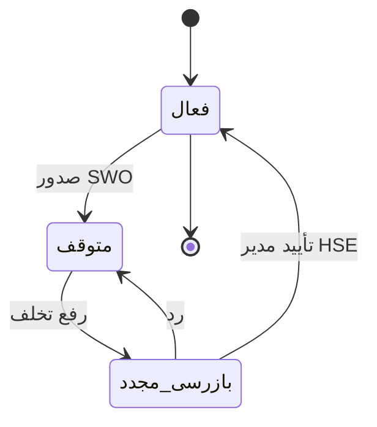

# تحویلی D1 — تحلیل وضعیت موجود و معماری ماژول HSE

**ماژول مدیریت ایمنی، بهداشت و محیط‌زیست (MOD-08 / دامنهٔ `d16`)**

| | |
|---|---|
| نسخه | ۱٫۰ |
| رویکرد | ارتقای درون‌برنامه‌ای (In-App Enhancement) |
| استانداردها | ISO 45001:2018 · ISO 14001:2015 · OSHA · HSE-MS شرکت ملی نفت · IOGP |
| تاریخ | ۱۸ شهریور ۱۴۰۵ |

---

## بند ۰ — قرارداد برچسب‌گذاری

هر مؤلفه در این سند یکی از سه برچسب را دارد. این تفکیک اختیاری نیست: سندی که
موجود و ساخته‌نشده را قاطی کند، تیم توسعه را روی چیزی که وجود ندارد
برنامه‌ریزی می‌کند.

| برچسب | معنا |
|---|---|
| 📌 **موجود** | امروز در مخزن کد اجراشدنی دارد |
| 🔧 **بهبود** | ساختارش هست، ارتقا می‌خورد |
| ✨ **جدید** | باید ساخته شود |

---

## بند ۱ — وضعیت موجود: HSE در این مخزن

### ۱٫۱ یافتهٔ اصلی

**ماژول HSE در سایدبار وجود ندارد.** ۱۳ دامنهٔ فعال عبارت‌اند از `d1`..`d6`,
`d8`..`d12`, `d15` و `d7` (که همیشه آخر است). هیچ دامنهٔ HSE در
`src/data/framework.ts` تعریف نشده.

اما — و این نکتهٔ مهم است — **جای خالی HSE در سرتاسر کد پیداست.** ماژول‌های
دیگر به آن ارجاع می‌دهند بی‌آنکه منبعی وجود داشته باشد:

| ماژول | ارجاع | مسیر | وضعیت امروز |
|---|---|---|---|
| MON (d3) | شاخص `TRIR` در `KPI_SEED` با وزن ۸ | `projectControls.ts:62` | **کد هست، منبع داده نیست** |
| MON (d3) | مؤلفهٔ `hse` در شاخص سلامت پروژه (PHI) با وزن ۱۵٪ | `projectControls.ts:48` | **مقدار ثابت ۹۰ هارد‌کد شده** |
| HRM (d10) | گیت `hseTraining` در تجهیز نیرو | `workforce.ts:77` | فیلد بولی بدون منبع |
| HRM (d10) | چهار نقش `HSE-OFF`, `HSE-FRM`, `HSE-FRA`, `HSE-MED` | `workforce.ts:483` | 📌 موجود |
| FIN (d5) | `hsePct` با وزن ۱۰٪ در امتیاز تأمین‌کننده | `finance.ts:514` | ورودی دستی |
| RCC (d4) | رشتهٔ `HSE` در فهرست دیسیپلین‌ها | `rcc.ts:94` | 📌 موجود |
| CKM (d11) | نوع جلسهٔ `hse` | `communication.ts:173` | 📌 موجود |
| COM (d15) | `PtwRef` رشتهٔ آزاد در دروازهٔ RFSU | ADR-COM-10 | **پیش‌نیاز کنترل‌ناپذیر** |
| RPT | «رویداد ایمنی: ۰» در قالب گزارش | `reporting.ts:506` | **عدد ثابت** |

**تفسیر مهندسی:** این‌ها بدهی فنی انباشته‌اند، نه صرفاً فیلدهای خالی.
`computePhi` امروز عدد ۹۰ را برای HSE جا می‌زند — یعنی شاخص سلامت پروژه
**همیشه فرض می‌کند ایمنی خوب است**. این بدترین حالت ممکن است: نه فقط داده
نداریم، بلکه نبود داده را با یک عدد خوش‌بینانه پنهان کرده‌ایم.

### ۱٫۲ آنچه در همین نشست ساخته شد (پیش‌درآمد D1)

پیش از رسیدن این Master Prompt، برای بستن شکاف G-05 گزارش ماژول COM
(«PTW پیش‌نیاز اجباری RFSU نیست») هستهٔ اولیهٔ HSE ساخته شد:

| قلم | وضعیت | جزئیات |
|---|---|---|
| ۴ جدول `d16` | ✅ ساخته و اعتبارسنجی‌شده | `WorkPermit` (۲۰ ستون) · `SafetyIncident` (۱۹) · `SafetyInspection` (۱۳) · `SafetyTrainingRecord` (۱۰) |
| مهاجرت `0015` | ✅ ۱۴ گزاره، **فقط CREATE** | `hse_permits_incidents` — بدون ALTER/DROP |
| موتور `src/services/hse.ts` | ✅ ۲۴ صادرات | PTW، رویداد، شاخص، آموزش، هشدار |
| آزمون `server/hse.test.mjs` | ✅ **۶۰/۶۰ سبز** | موتور خالص |
| RBAC | ⛔ **اعمال نشد** | اسکریپت شکست خورد؛ در D14 تکمیل می‌شود |
| اندپوینت REST | ⛔ ساخته نشده | D14 |
| آیتم سایدبار | ⛔ ساخته نشده | نیازمند تأیید صریح کاربر |

جمع: **۸۷ جدول · ۱۵ مهاجرت** در کل سامانه.

**این هسته با Master Prompt چه نسبتی دارد؟** پوشش جزئی و عمدتاً در ۰۸٫۲ و
۰۸٫۳. بند ۳ همین سند نگاشت دقیق را می‌دهد.

---

## بند ۲ — تحلیل شکاف (Gap Analysis)

| # | شکاف | اثر | زیرماژول | راه‌حل |
|---|---|---|---|---|
| GH-01 | **PHI مقدار HSE را ۹۰ هارد‌کد کرده** — شاخص سلامت پروژه همیشه ایمنی را خوب فرض می‌کند | **H** | ۰۸٫۶ | اتصال `computePhi` به `hseScore()` واقعی؛ در نبود داده `null` نه ۹۰ |
| GH-02 | **`TRIR` در `KPI_SEED` هست ولی منبع ندارد** | **H** | ۰۸٫۶ | `ManHourCalculator` + `HSE_MetricSnapshot` |
| GH-03 | **PTW پیش‌نیاز کنترل‌ناپذیر RFSU** — `PtwRef` رشتهٔ آزاد | **H** | ۰۸٫۲ | ✅ جدول `WorkPermit` ساخته شد؛ اتصال به دروازهٔ COM در D13 |
| GH-04 | **SWO وجود ندارد** — توقف کار قابل ثبت و اعمال نیست | **H** | ۰۸٫۴ | `HSE_Violation` + قفل فعالیت PEX |
| GH-05 | **JSA وجود ندارد** — پیش‌نیاز PTW قابل سنجش نیست | **H** | ۰۸٫۱ | `HSE_RiskAssessment` با Job Steps |
| GH-06 | **گازسنجی فقط رشتهٔ متنی است** (`GasTestResultFa`) | **H** | ۰۸٫۲ | 🔧 `GasTestLog` عددی با LEL/O2/H2S/CO و ابطال خودکار |
| GH-07 | **نفرساعت ایمن محاسبه نمی‌شود** | **H** | ۰۸٫۶ | `HSE_ManHourLog` + تیک تجمعی |
| GH-08 | **کمیته حقیقت‌یاب و ۵ چرا نیست** | M | ۰۸٫۳ | `HSE_IncidentInvestigation` + `RootCauseAnalysis` |
| GH-09 | **LOTO / Isolation نیست** | M | ۰۸٫۲ | `IsolationLog` |
| GH-10 | **گیت `hseTraining` در HRM منبع ندارد** | M | ۰۸٫۵ | ✅ `SafetyTrainingRecord` ساخته شد؛ HRM باید بخواند نه بنویسد |
| GH-11 | **محیط‌زیست کامل غایب** — پسماند، پساب، آلاینده | M | ۰۸٫۵ | `WasteLog` + `EnvironmentalAspect` |
| GH-12 | **موبایل PWA آفلاین، GPS، QR نیست** | M | همه | `MobileSyncService` + صف همگام‌سازی |
| GH-13 | **PPE مدیریت نمی‌شود** | L | ۰۸٫۵ | `PpeIssuance` |
| GH-14 | **تفکیک HSE-NCR از QLT-NCR تعریف نشده** | M | ۰۸٫۴ | جدول مجزا + قاعدهٔ صریح (بند ۵) |

---

## بند ۳ — نگاشت ۶ زیرماژول به وضعیت

| زیرماژول | عنوان | پوشش امروز | شکاف |
|---|---|---|---|
| **۰۸٫۱** | برنامه‌ریزی و JSA | ⛔ ۰٪ | GH-05 |
| **۰۸٫۲** | موتور PTW | 🟡 **۳۵٪** — ۷ نوع از ۸، گردش پایه، تفکیک وظیفه | GH-06, GH-09؛ نبود Radiation، QR، امضای ۳ سطحی |
| **۰۸٫۳** | حوادث و شبه‌حوادث | 🟡 **۴۰٪** — ۷ طبقه، LTIFR/TRIR، بستن مشروط | GH-08؛ نبود Flash Report، آسیب‌دیده، فراخوان اضطراری |
| **۰۸٫۴** | بازرسی، عدم انطباق، SWO | 🟡 **۱۵٪** — فقط `SafetyInspection` پایه | GH-04, GH-14 |
| **۰۸٫۵** | بهداشت، محیط‌زیست، آموزش | 🟡 **۲۰٪** — فقط آموزش | GH-11, GH-13 |
| **۰۸٫۶** | پایش و شاخص‌ها | 🟡 **۳۰٪** — LTIFR/TRIR/۵ هشدار | GH-01, GH-02, GH-07 |

**پوشش کلی ماژول: ۲۳٪.**

### ۳٫۱ هشت نوع مجوز — وضعیت

| نوع | فارسی | امروز |
|---|---|---|
| Hot Work | کار گرم | ✅ + پرخطر |
| Cold Work | کار سرد | ✅ |
| Confined Space | فضای بسته | ✅ + پرخطر |
| Height | کار در ارتفاع | ✅ |
| Excavation | گودبرداری | ✅ + پرخطر |
| Electrical Isolation | کار برقی | ✅ (نیازمند LOTO) |
| Lifting | بالابری | ✅ |
| **Radiation** | **پرتوکاری** | ⛔ **باید افزوده شود** |

---

## بند ۴ — نمودار مؤلفه‌ها

```mermaid
flowchart TB
    subgraph UI["لایهٔ ارائه"]
        W1[داشبورد کنترل‌روم HSE]
        W2[فرم لمسی PTW]
        W3[بازرسی موبایل PWA]
        W4[کارتابل حوادث]
    end

    subgraph SVC["لایهٔ سرویس"]
        S1[PTWEngine]
        S2[JSAService]
        S3[GasTestService]
        S4[IncidentService]
        S5[InvestigationService]
        S6[SWOService]
        S7[HSE_NCRService]
        S8[TrainingService]
        S9[EnvironmentalService]
        S10[ManHourCalculator]
        S11[HSEAnalyticsService]
        S12[MobileSyncService]
    end

    subgraph DATA["لایهٔ داده d16"]
        T1[(WorkPermit)]
        T2[(SafetyIncident)]
        T3[(SafetyInspection)]
        T4[(SafetyTrainingRecord)]
        T5[(HSE_RiskAssessment)]
        T6[(GasTestLog)]
        T7[(HSE_Violation)]
        T8[(HSE_ManHourLog)]
    end

    subgraph EXT["ماژول‌های همسایه"]
        PEX[PEX d2: فعالیت]
        MON[MON d3: شاخص]
        RCC[RCC d4: ریسک و ادعا]
        FIN[FIN d5: امتیاز تأمین‌کننده]
        QLT[QLT d8: عدم انطباق کیفی]
        HRM[HRM d10: نیروی کار]
        DMS[DMS d1: مدارک]
        COM[COM d15: دروازهٔ RFSU]
    end

    W2 --> S1
    W3 --> S12
    W4 --> S4
    W1 --> S11

    S1 --> T1
    S1 --> S2
    S1 --> S3
    S2 --> T5
    S3 --> T6
    S4 --> T2
    S4 --> S5
    S6 --> T7
    S8 --> T4
    S10 --> T8
    S11 --> S10

    S6 -.->|قفل فعالیت| PEX
    S1 -.->|پروانهٔ معتبر| PEX
    S11 -.->|LTIFR · TRIR · PHI| MON
    S4 -.->|حادثهٔ بحرانی| RCC
    S11 -.->|امتیاز HSE| FIN
    S7 -.->|تفکیک صریح| QLT
    S8 -.->|گیت آموزش| HRM
    S1 -.->|برگهٔ PTW| DMS
    S1 -.->|دروازهٔ ایمنی| COM

    style DATA fill:#e8f4f8
    style EXT fill:#fff3cd
```

### ۴٫۱ فهرست سرویس‌ها

| سرویس | مسئولیت | وضعیت |
|---|---|---|
| `PTWEngine` | چرخهٔ عمر پروانه، پیش‌نیازها، تفکیک وظیفه | 🔧 هسته ✅ |
| `JSAService` | ارزیابی ریسک شغلی، سلسله‌مراتب کنترل | ✨ |
| `GasTestService` | گازسنجی عددی، ابطال خودکار | ✨ |
| `IncidentService` | ثبت، طبقه‌بندی، Flash Report | 🔧 هسته ✅ |
| `InvestigationService` | کمیته، ۵ چرا، استخوان ماهی، CAPA | ✨ |
| `SWOService` | توقف کار، قفل PEX، رفع | ✨ |
| `HSE_NCRService` | عدم انطباق ایمنی، جدا از QLT | ✨ |
| `TrainingService` | آموزش، گواهی، انقضا | 🔧 هسته ✅ |
| `EnvironmentalService` | پسماند، پساب، آلاینده | ✨ |
| `ManHourCalculator` | نفرساعت ایمن، تیک تجمعی | ✨ |
| `HSEAnalyticsService` | ۶ KPI، ۵ EWS، تغذیهٔ PHI | 🔧 هسته ✅ |
| `MobileSyncService` | آفلاین، GPS، QR، امضا | ✨ |

---

## بند ۵ — تصمیمات معماری (ADR)

### ADR-HSE-01 — دامنهٔ `d16` با آیتم مستقل سایدبار

HSE به تب ماژول دیگری الحاق نمی‌شود. دلیل: افسر HSE کاربر مستقلی است که
هیچ‌یک از وظایفش زیرمجموعهٔ کیفیت یا اجرا نیست؛ پنهان‌کردنش زیر تب دیگری،
دسترسی روزمره را چند کلیک عقب می‌برد.

> ⚠️ **نیازمند تأیید صریح کاربر** طبق قید سایدبار. «HSE» در فهرست استثنائات
> تأییدشدهٔ کاربر هست، ولی چون این checkout آیتمی ندارد، پیش از افزودن
> دوباره تأیید گرفته می‌شود. جایگاه پیشنهادی: پس از `d15` و پیش از `d7`.

### ADR-HSE-02 — تابع ارزیابی هرگز استثنا پرتاب نمی‌کند

هم‌راستا با ADR-COM-03. خروجی `{ ok, blockersFa[], warningsFa[] }`.
دلیل: سرپرست کارگاه باید کل موانع صدور پروانه را یک‌جا ببیند. کشف
یکی‌یکی در چند رفت‌وبرگشت، همان چیزی است که باعث می‌شود تیم کنترل ایمنی را
دور بزند. ✅ **پیاده شد** (`canApprovePermit` سه مانع را هم‌زمان داد).

### ADR-HSE-03 — شبه‌حادثه در TRIR شمرده نمی‌شود

طبق OSHA فقط `medical_treatment`, `lost_time`, `fatality` ثبت‌شدنی‌اند.

**دلیل رفتاری، نه صرفاً استانداردی:** اگر شبه‌حادثه در شاخص بیاید، تیم برای
پایین نگه‌داشتن عدد از گزارشش خودداری می‌کند و سامانه دقیقاً همان داده‌ای را
از دست می‌دهد که برای پیشگیری لازم است. گزارش شبه‌حادثه باید **تشویق** شود.
✅ **پیاده و آزمون شد** (دو آزمون این را قفل کرده‌اند).

### ADR-HSE-04 — بدون نفرساعت، شاخص `null` است نه صفر

`LTIFR = 0` یعنی «ایمن»؛ `LTIFR = null` یعنی «نمی‌دانیم». یکی‌کردن این دو،
پروژه‌ای را که هنوز داده وارد نکرده «ایمن» نشان می‌دهد.
✅ **پیاده و آزمون شد.**

### ADR-HSE-05 — انقضای پروانه از تاریخ محاسبه می‌شود نه از ستون وضعیت

اگر فقط به `Status` تکیه کنیم، پروانه‌ای که کسی نبسته تا ابد «معتبر» می‌ماند
و QR اسکن‌شده در کارگاه سبز نشان می‌دهد. `permitState()` وضعیت مؤثر را از
`ValidTo` مشتق می‌کند. ✅ **پیاده و آزمون شد.**

### ADR-HSE-06 — تأییدکنندهٔ پروانه ≠ درخواست‌کننده

تفکیک وظیفه در **خودِ موتور**، نه فقط در RBAC. دلیل: RBAC می‌گوید «افسر HSE
حق تأیید دارد»، ولی نمی‌تواند بگوید «این افسر همان کسی است که درخواست داده».
✅ **پیاده و آزمون شد.**

### ADR-HSE-07 — بستن رویداد بدون ریشه‌یابی و CAPA ممنوع

رویدادی که علتش ثبت نشود دوباره رخ می‌دهد و سامانه به بایگانی حادثه تنزل
می‌کند. ✅ **پیاده و آزمون شد.**

### ADR-HSE-08 — پروانهٔ منقضی هشدار است، پروانهٔ باز مانع

در دروازهٔ ایمنی RFSU: پروانهٔ **باز** مانع سخت است (کار در جریان است)، ولی
پروانهٔ **منقضی بسته‌نشده** فقط هشدار (احتمالاً فراموشی اداری). تمایز نکردن
بین این دو، یا دروازه را غیرقابل عبور می‌کند یا کار واقعی در جریان را
نادیده می‌گیرد. ✅ **پیاده و آزمون شد.**

### ADR-HSE-09 — تفکیک HSE-NCR از QLT-NCR

جدول جداگانه `HSE_Violation`، نه ستون نوع روی `Ncr` موجود.

| معیار | QLT-NCR | HSE-NCR |
|---|---|---|
| موضوع | انطباق محصول با مشخصات | انطباق رفتار و شرایط با الزامات ایمنی |
| مالک | بازرس کیفیت | افسر HSE |
| اثر | دوباره‌کاری، دروازهٔ MC | توقف کار، جریمه |
| بستن | تأیید بازرسی مجدد کیفی | بازرسی مجدد ایمنی |

**قاعدهٔ مرزی:** جوش معیوب که خطر سازه‌ای دارد → **هر دو**؛ QLT برای رفع
عیب، HSE برای توقف کار تا رفع. یک رویداد می‌تواند دو رکورد داشته باشد و
این تکرار نیست — دو تعهد متفاوت است.

### ADR-HSE-10 — SWO فعالیت PEX را قفل می‌کند، حذف نمی‌کند

`Activity.IsStopWorkOrder = true` مانع ثبت پیشرفت می‌شود ولی فعالیت در
زمان‌بندی می‌ماند. حذف فعالیت، تاریخ توقف را از مسیر بحرانی پاک می‌کند و
مبنای ادعای EOT از بین می‌رود.

### ADR-HSE-11 — موبایل آفلاین: صف با شناسهٔ ایدمپوتنت

هر رکورد موبایل `ClientUuid` می‌گیرد. همگام‌سازی دوباره رکورد تکراری
نمی‌سازد. زیرساخت `syncQueue.ts` 📌 موجود است.

### ADR-HSE-12 — گازسنجی عددی، نه متنی

ستون فعلی `GasTestResultFa` رشتهٔ آزاد است و ابطال خودکار روی آن ممکن نیست.
🔧 ارتقا به `GasTestLog` با ستون‌های عددی و آستانه‌ها:

| گاز | آستانهٔ ایمن |
|---|---|
| LEL | < ۱۰٪ |
| O₂ | ۱۹٫۵٪ تا ۲۳٫۵٪ |
| H₂S | < ۱۰ ppm |
| CO | < ۳۵ ppm |

خارج از محدوده → ابطال خودکار پروانه + هشدار اضطراری.

---

## بند ۶ — راهبرد یکپارچگی

### ۶٫۱ HSE ↔ PEX (بحرانی‌ترین)

**قاعده:** `IsStopWorkOrder = true` ← ثبت پیشرفت رد می‌شود. آزادسازی فقط با
امضای مدیر HSE، نه سرپرست اجرا.

### ۶٫۲ HSE ↔ MON

جایگزینی مقدار ثابت ۹۰ در `computePhi`. **در نبود داده `null` برگردد** و
وزن ۱۵٪ بازتوزیع شود — نه اینکه عدد خوش‌بینانه جا زده شود (GH-01).

### ۶٫۳ HSE ↔ COM

`rfsuSafetyClearance()` ✅ ساخته شد و شکاف G-05 گزارش COM را می‌بندد.
اتصال به دروازهٔ RFSU در D13.

### ۶٫۴ سایر

| جفت | جهت | محتوا |
|---|---|---|
| HSE → RCC | رویداد | حادثهٔ بحرانی → ریسک/ادعای بیمه |
| HSE → FIN | خواندن | `hsePct` امتیاز تأمین‌کننده |
| HSE → HRM | خواندن | گیت `hseTraining` — **HRM می‌خواند، نمی‌نویسد** |
| HSE → DMS | ارجاع | `SourceRef`، بدون کپی فایل |

---

## بند ۷ — طرح بهبود UI/UX

| صفحه | محتوا | اولویت |
|---|---|---|
| داشبورد کنترل‌روم | LTIFR/TRIR/نفرساعت ایمن · پروانه‌های فعال روی نقشه · هشدارهای زنده | F1 |
| فرم لمسی PTW | گام‌به‌گام، دکمه‌های درشت دستکش‌پذیر، امضای انگشتی | F1 |
| بازرسی موبایل | آفلاین، دوربین با واترمارک GPS، چک‌لیست | F2 |
| کارتابل حوادث | Flash Report، تایمر ۱۵ دقیقه‌ای، ۵ چرا درختی | F2 |
| اسکنر QR | اعتبارسنجی میدانی پروانه | F1 |

**اصل طراحی:** دکمهٔ صدور پروانه باید **پیش از فشردن**، موانع را نشان دهد.
دکمه‌ای که بزنی و خطا بگیری، در محیط پرفشار کارگاه به دورزدن سامانه می‌انجامد.

**قیود:** فونت Vazirmatn · `src/index.css` دست‌نخورده · `vite.config.ts` دست‌نخورده.

---

## بند ۸ — نگاشت ۱۴ تحویلی

| # | تحویلی | وضعیت | پیش‌نیاز |
|---|---|---|---|
| D1 | معماری | ✅ همین سند | — |
| D2 | ERD کامل | ⬜ | D1 |
| D3 | JSA و سلسله‌مراتب کنترل | ⬜ | D2 |
| D4 | موتور PTW کامل | 🟡 ۳۵٪ | D3 |
| D5 | مدیریت حوادث | 🟡 ۴۰٪ | D2 |
| D6 | کمیته حقیقت‌یاب و ۵ چرا | ⬜ | D5 |
| D7 | SWO و تخلفات | ⬜ | D2, PEX |
| D8 | آموزش و PPE | 🟡 ۲۰٪ | D2 |
| D9 | محیط‌زیست و بهداشت | ⬜ | D2 |
| D10 | KPI و EWS | 🟡 ۳۰٪ | D4, D5, D7 |
| D11 | گزارش A4 سه‌لوگو | ⬜ | D10 |
| D12 | اکسل | ⬜ | D2 |
| D13 | یکپارچگی | ⬜ | همه |
| D14 | RBAC، API، MVP | ⬜ | همه |

**مسیر بحرانی:** `D2 → D3 → D4 → D7 → D10 → D13`.

---

## بند ۹ — ده لوپ خودارزیابی

| # | لوپ | یافته | اقدام |
|---|---|---|---|
| ۱ | **انطباق ISO/PMBOK** | ISO 45001 بند ۸٫۱٫۲ (حذف خطر) نیازمند JSA است که غایب است. ISO 14001 کامل غایب. TRIR طبق OSHA درست پیاده شد. | GH-05, GH-11 |
| ۲ | **موتور PTW** | ۷ از ۸ نوع؛ **Radiation غایب**. گازسنجی متنی است نه عددی. QR و امضای ۳ سطحی نیست. تفکیک وظیفه ✅. | GH-06؛ افزودن Radiation در D4 |
| ۳ | **JSA و سلسله‌مراتب** | ⛔ کامل غایب. پیش‌نیاز «JSA مصوب» برای PTW امروز قابل سنجش نیست. | GH-05 — بحرانی |
| ۴ | **حوادث و تحقیق** | ۷ طبقه از ۸ (**Permanent Disability غایب**). Flash Report ۱۵ دقیقه‌ای، آسیب‌دیده، ۵ چرا غایب. بستن مشروط ✅. | GH-08 |
| ۵ | **SWO** | ⛔ کامل غایب — **جدی‌ترین شکاف عملیاتی**. بدون آن ماژول قدرت اجرایی ندارد. | GH-04 |
| ۶ | **آموزش و PPE** | آموزش با انقضا ✅. PPE و اثربخشی غایب. | GH-13 |
| ۷ | **محیط‌زیست** | ⛔ کامل غایب. ISO 14001 پوشش صفر. | GH-11 |
| ۸ | **شاخص و EWS** | LTIFR/TRIR ✅ با فرمول درست. **نفرساعت ورودی است نه محاسبه‌شده.** ۵ هشدار ✅ ولی گازسنجی و SWO ندارند. **PHI هارد‌کد ۹۰.** | GH-01, GH-02, GH-07 |
| ۹ | **گزارش A4** | ⛔ غایب. زیرساخت `reporting.ts` 📌 آماده. | D11 |
| ۱۰ | **یکپارچگی و مهاجرت** | مهاجرت `0015` فقط CREATE ✅. نام جداول موجود دست‌نخورده ✅. اتصالات زنده: صفر. | D13 |

### جمع‌بندی لوپ‌ها

**سه یافتهٔ بحرانی:**

1. **SWO غایب است** (لوپ ۵) — بدون دستور توقف کار، ماژول HSE فقط دفتر ثبت
   است. قدرت اجرایی واقعی از قفل PEX می‌آید.
2. **JSA غایب است** (لوپ ۳) — پیش‌نیاز اصلی PTW در ISO 45001. بدون آن، صدور
   پروانه بدون ارزیابی خطر انجام می‌شود.
3. **PHI عدد ۹۰ را جا می‌زند** (لوپ ۸) — این از «نداشتن داده» بدتر است چون
   نبود داده را با خوش‌بینی پنهان می‌کند.

**نکتهٔ مثبت:** هستهٔ ساخته‌شده کیفیت بالایی دارد — ۶۰ آزمون سبز و ۵ ADR که
همگی رفتار ضدفریب دارند (شبه‌حادثه در TRIR نیاید، انقضا از تاریخ، تأییدکننده
≠ درخواست‌کننده، بستن مشروط، `null` نه صفر).

---

## بند ۱۰ — ریسک‌های باز

| # | ریسک | اثر | پاسخ |
|---|---|---|---|
| RH-01 | **حجم PTW روزانه تا ۲۰۰** — جدول سریع رشد می‌کند | M | ایندکس `(ProjectId, Status, ValidTo)` ✅؛ پارتیشن پس از یک میلیون |
| RH-02 | **موبایل آفلاین: تعارض همگام‌سازی** | H | ایدمپوتنت با `ClientUuid` (ADR-HSE-11) |
| RH-03 | **مقاومت میدانی در برابر PTW دیجیتال** | H | فرم لمسی + QR + گذار دوگانهٔ کاغذ |
| RH-04 | **فشار برای دورزدن SWO** | **بحرانی** | بدون کلید خاموشی؛ آزادسازی فقط با امضای مدیر HSE |
| RH-05 | **سناریوی اضطراری نیازمند پاسخ < ۱ دقیقه** | H | مسیر اضطراری بدون گردش تأیید |
| RH-06 | **تداخل مرزی HSE-NCR و QLT-NCR** | M | ADR-HSE-09 + آموزش |

**RH-04 خطرناک‌ترین است.** هر سازوکار «موقتاً غیرفعال کردن SWO» در عمل به
مسیر پیش‌فرض تبدیل می‌شود. مسیر درست: رفع تخلف و بازرسی مجدد ثبت‌شده.

---

## پیوست — سنجه‌های امروز

| سنجه | مقدار |
|---|---|
| جداول کل سامانه | ۸۷ (۴ عدد در `d16`) |
| مهاجرت | ۱۵ (`0015` آخرین، فقط CREATE) |
| صادرات موتور HSE | ۲۴ |
| آزمون HSE | **۶۰/۶۰ سبز** |
| کل آزمون پروژه | ۱۴۲۷ + ۶۰ |
| خطای TypeScript | ۵۷ (پایه، بدون افزایش) |
| اندپوینت HSE | ۰ (D14) |
| مجوز RBAC HSE | ۰ (D14) |
| آیتم سایدبار | ⛔ نیازمند تأیید |

**پوشش کلی ماژول نسبت به Master Prompt: ۲۳٪.**
