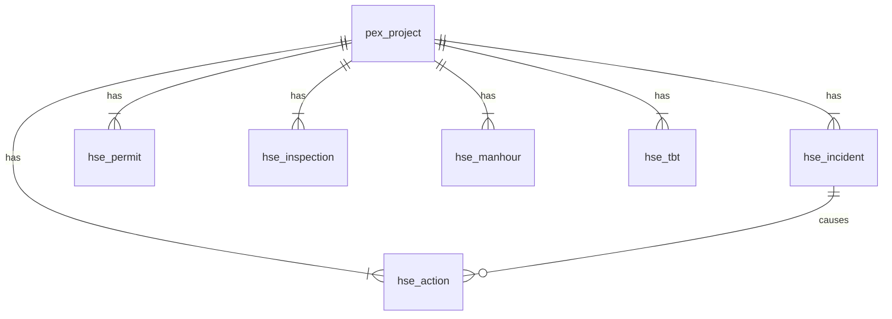

# HSE D2 — مدل داده و جداول SQL

**نسخه:** 1.0 · مبنا: `HSE_D1_Architecture.md` ‏(§۵) + سید `src/services/hse.ts`
**محدوده این فاز:** مدل + DDL ‏(`db/mssql/V003__hse.sql`) + سید (`seed__hse_og2401.sql`).
API و ثبت واقعی در D3؛ اتصال DPR/GOV/RCC در D4.

خلاصه ۳ خطی: ۶ جدول (`hse_incident`, `hse_permit`, `hse_inspection`, `hse_action`, `hse_manhour`, `hse_tbt`) با کلید `ProjectCode` به `pex_project`. منطق نرخ/باند/تشدید در موتور می‌ماند؛ دیتابیس فقط CHECK و یکتایی را نگه می‌دارد. سید OG-2401 آینه دقیق سید D1 است (جز `hse_tbt` که نمونه گویاست).

---

## ۱) قرارداد نگاشت نوع

| TypeScript (`hse.ts`) | SQL Server |
|---|---|
| `string` شناسه/کد | `NVARCHAR(50)` |
| متن فارسی نمایشی | `NVARCHAR(200..1000)` |
| `dateISO` ‏(YYYY-MM-DD) | `DATE` |
| `lostDays`, `Attendees`, امتیاز | `INT` |
| `volumeL`, ساعت من‌اور | `DECIMAL(18,2)` |
| وزن شدت | `DECIMAL(8,2)` |
| یونیون وضعیت‌ها | `NVARCHAR(20)` + `CHECK` |
| `items`/`flags` | `NVARCHAR(MAX)` ‏(JSON) |
| created/updated | `DATETIME` + `GETUTCDATE()` |

نام ستون تاریخ در SQL همان `IncidentDate/WorkDate/...` است (پسوند ISO فقط قرارداد TS).

---

## ۲) ERD

## ۳) جدول‌ها

**hse_incident:** Id, ProjectCode FK, Code UNIQUE(project,code), IncidentDate, Type CHECK(near_miss|first_aid|medical|lost_time|fatality|spill|property), SeverityW, LostDays, Area, DescFa, Status CHECK(open|investigating|closed), VolumeL NULL, CreatedAt/UpdatedAt.
قانون DB: `VolumeL` فقط برای spill معنادار است (سرویس اعتبارسنجی می‌کند، مثل روال DPR).

**hse_permit:** Id, ProjectCode FK, No UNIQUE(project,no), Type CHECK(7 نوع), Status CHECK(7 وضعیت), WorkDate, Area, RiskLevel CHECK(low|medium|high), FlagsJson NULL ‏(`{gasTest,rescuePlan,isolation,barricade}`)، ExpiresAt NULL, CreatedAt/UpdatedAt.

**hse_inspection:** Id, ProjectCode FK, Area, InspectDate, Score INT (۰..۱۰۰، هنگام ثبت از موتور), Band CHAR(1) CHECK(A|B|C|D), ItemsJson ‏(`[{item,ok,na?}]`)، NextDue NULL (قاعده باند: A:+۹۰، B:+۳۰، C:+۱۴، D:+۷ روز), CreatedAt.

**hse_action:** Id, ProjectCode FK, IncidentId NULL FK → hse_incident, Title, DueDate, ClosedAt NULL, Severity CHECK(low|medium|high|critical), Escalation NULL ‏(آخرین L محاسبه‌شده؛ موتور مرجع است), CreatedAt/UpdatedAt.

**hse_manhour:** PK ترکیبی (ProjectCode, Period NVARCHAR(20) مثل `1405-04`), Hours. مبنای TRIR/LTIFR؛ هرگز UPDATE نمی‌شود جز اصلاح رسمی (الگوی snapshot بسته).

**hse_tbt:** Id, ProjectCode FK, SessionDate, Area, Attendees INT, Topic. تجمیع planned/held در موتور از روی همین ردیف‌ها + برنامه (D3).

## ۴) چه چیزی در DB نیست (آگاهانه)

- تعریف «قابل‌ثبت OSHA» و فرمول TRIR/LTIFR/امتیاز: فقط موتور (`hse.ts` ↔ `hseLogic.js`) تا تک‌منبعی نشکند.
- `SeverityW` ذخیره می‌شود ولی مرجع وزن، `severityWeight` موتور است (سید با آن پر شده).
- ارجاع CAPA/RCC: ستون ندارد؛ در D4 با جدول میانی/رویداد اضافه می‌شود (از آلودگی مدل D2 پرهیز شد).

## ۵) سید OG-2401 (آینه D1)

| جدول | تعداد | دقت آینه |
|---|---|---|
| hse_manhour | ۳ | دقیق (176400/184000/62100) |
| hse_incident | ۸ | دقیق (کد/تاریخ/نوع/ناحیه/وضعیت/حجم) |
| hse_permit | ۵ | دقیق؛ FlagsJson ‏NULL (جریان D3 پر می‌کند) |
| hse_inspection | ۴ | دقیق؛ Score/Band محاسبه‌شده از آیتم‌ها |
| hse_action | ۵ | دقیق؛ IncidentId/Escalation ‏NULL (موتوری) |
| hse_tbt | ۶ | **نمونه گویا** (سید D1 فقط تجمیع planned/held دارد) |

امتیاز/باند سید بازرسی: n1 ‏۷۵/B، n2 ‏۱۰۰/A، n3 ‏۵۰/D، n4 ‏۱۰۰/A. تاريخ NextDue طبق قاعده باند.

## ۶) ایندکس

- `IX_hse_incident_proj_date` ‏(ProjectCode, IncidentDate) + فیلتر رایج Status
- `IX_hse_permit_proj_status` ‏(ProjectCode, Status, WorkDate)
- `IX_hse_inspection_proj_date` ‏(ProjectCode, InspectDate)
- `IX_hse_action_proj_due` ‏(ProjectCode, DueDate)
- `IX_hse_tbt_proj_date` ‏(ProjectCode, SessionDate)

## ۷) سازگاری و ترتیب اجرا

- SQL Server 2008 ‏(بدون OFFSET/FETCH)؛ همه DDL/سید idempotent مثل `db/mssql`.
- ترتیب: `V001` → `seed__pex_og2401` → `V003__hse` → `seed__hse_og2401` (نیاز FK به `pex_project`).
- `V002` (DPR) برای HSE اجباری نیست ولی در استقرار کامل قبلش اجرا می‌شود.

## ۸) خوداعتبارسنجی D2

| Loop | نتیجه |
|---|---|
| ۱ Gap‑D1 | هر ۵ زیرفرایند HSE-1..۵ جدول دارد |
| ۲ Seed‑parity | ۵ جدول آینه دقیق؛ انحراف تنها `hse_tbt` (مستند) |
| ۳ Engine‑single‑source | هیچ فرمولی در SQL تکرار نشده |
| ۴ 2008‑compat | بدون سینتکس ۲۰۱۲+؛ UTC با GETUTCDATE |
| ۵ Idempotency | DDL با IF OBJECT_ID؛ سید با IF NOT EXISTS |
| ۶ Naming | snake_case با پیشوند `hse_` طبق رزرو D1 |

**Gap:** پسماند/معاینات هنوز جدول ندارند (تجمیع در سید)؛ ستون لینک CAPA/RCC؛ API ثبت (D3)؛ تغذیه TRIR/PHI از SQL به‌جای سید (D4).
