# تحویلی D2 — مدل داده جامع و ERD ماژول HSE

**ماژول مدیریت ایمنی، بهداشت و محیط‌زیست (MOD-08 / دامنهٔ `d16`)**

| | |
|---|---|
| نسخه | ۱٫۰ |
| پیش‌نیاز | D1 (`docs/HSE_Architecture.md`) |
| رویکرد | ارتقای درون‌برنامه‌ای |
| تاریخ | ۱۸ شهریور ۱۴۰۵ |

---

## بند ۰ — قرارداد برچسب

| برچسب | معنا |
|---|---|
| 📌 **موجود** | امروز در `SCHEMA` هست و مهاجرتش اجرا شده |
| 🔧 **بهبود** | جدول موجود، ستون افزوده می‌شود (فقط `ADD`، هرگز `DROP`) |
| ✨ **جدید** | جدول تازه |

---

## بند ۱ — جمع‌بندی

| گروه | 📌 موجود | 🔧 بهبود | ✨ جدید | جمع |
|---|---|---|---|---|
| برنامه‌ریزی و JSA | ۰ | ۰ | ۴ | ۴ |
| پروانهٔ کار | ۱ | ۱ | ۴ | ۵ |
| حوادث و تحقیق | ۱ | ۱ | ۵ | ۶ |
| تخلف و توقف کار | ۱ | ۰ | ۲ | ۳ |
| آموزش و PPE | ۱ | ۰ | ۳ | ۴ |
| محیط‌زیست و بهداشت | ۰ | ۰ | ۵ | ۵ |
| تحلیل | ۰ | ۰ | ۲ | ۲ |
| **جمع `d16`** | **۴** | **۲** | **۲۵** | **۲۹** |

**اثر بر سامانه:** ۸۷ جدول امروز ← **۱۱۲ جدول** پس از تکمیل HSE.

**جداول ماژول‌های دیگر که 🔧 می‌شوند:** `Activity` (یک ستون برای قفل SWO).
هیچ جدول دیگری دست نمی‌خورد.

---

## بند ۲ — ERD کامل

```mermaid
erDiagram
    %% ═══ برنامه‌ریزی و ارزیابی خطر ═══
    HSE_RiskAssessment ||--o{ JSA_JobStep : "تفکیک به گام"
    JSA_JobStep ||--o{ JSA_Hazard : "خطرات گام"
    JSA_Hazard ||--o{ JSA_Control : "کنترل سلسله‌مراتبی"
    HSE_RiskAssessment }o--|| Activity : "فعالیت PEX"

    %% ═══ پروانهٔ کار ═══
    WorkPermit }o--o| HSE_RiskAssessment : "JSA مصوب"
    WorkPermit ||--o{ PTW_Precaution : "اقدامات احتیاطی"
    WorkPermit ||--o{ GasTestLog : "گازسنجی"
    WorkPermit ||--o{ IsolationLog : "LOTO"
    WorkPermit ||--o{ PTW_Approval : "امضای ۳ سطحی"
    WorkPermit }o--o| SystemSubsystem : "سیستم COM"
    WorkPermit }o--o| Activity : "فعالیت PEX"

    %% ═══ حوادث ═══
    SafetyIncident ||--o{ InjuredPerson : "آسیب‌دیدگان"
    SafetyIncident ||--o| HSE_Investigation : "کمیته حقیقت‌یاب"
    HSE_Investigation ||--o{ InvestigationMember : "اعضا"
    HSE_Investigation ||--o{ RootCauseNode : "۵ چرا درختی"
    HSE_Investigation ||--o{ CapaAction : "اقدام اصلاحی"
    SafetyIncident }o--o| WorkPermit : "پروانهٔ مرتبط"
    SafetyIncident }o--o| SystemSubsystem : "سیستم"

    %% ═══ تخلف و توقف کار ═══
    HSE_Violation ||--o{ ViolationEvidence : "مدرک و عکس"
    HSE_Violation ||--o{ ViolationClosure : "بازرسی مجدد"
    HSE_Violation }o--o| Activity : "فعالیت قفل‌شده"
    HSE_Violation }o--o| SafetyInspection : "منشأ بازرسی"

    %% ═══ بازرسی ═══
    SafetyInspection ||--o{ InspectionFinding : "یافته‌ها"

    %% ═══ آموزش و PPE ═══
    SafetyTrainingRecord }o--|| WorkforceMember : "فرد"
    TrainingSession ||--o{ TrainingAttendee : "حاضران"
    TrainingAttendee }o--|| WorkforceMember : "فرد"
    TrainingSession ||--o{ SafetyTrainingRecord : "صدور گواهی"
    PpeIssuance }o--|| WorkforceMember : "تحویل‌گیرنده"

    %% ═══ محیط‌زیست و بهداشت ═══
    EnvironmentalAspect ||--o{ AspectImpact : "ماتریس اثر"
    WasteLog }o--o| EnvironmentalAspect : "جنبه"
    EnvironmentalMonitoring }o--o| EnvironmentalAspect : "پایش"
    HealthExamination }o--|| WorkforceMember : "معاینه دوره‌ای"
    OccupationalHazard ||--o{ HealthExamination : "عامل زیان‌آور"

    %% ═══ تحلیل ═══
    HSE_MetricSnapshot }o--|| Project : "پروژه"
    HSE_AlertRule ||--o{ HSE_MetricSnapshot : "ارزیابی"

    HSE_RiskAssessment {
        text Id PK
        text ProjectId FK
        text JsaNo UK
        text TitleFa
        text ActivityId FK
        text TemplateCode
        text PreparedBy
        date PreparedAt
        text ApprovedBy
        date ApprovedAt
        date ValidUntil
        int MaxResidualRisk
        text Status
    }

    JSA_JobStep {
        text Id PK
        text JsaId FK
        int StepNo
        text DescriptionFa
        text ResponsibleFa
    }

    JSA_Hazard {
        text Id PK
        text StepId FK
        int HazardNo
        text HazardFa
        text HazardCategory
        int Likelihood
        int Severity
        int InitialRisk
        int ResidualRisk
    }

    JSA_Control {
        text Id PK
        text HazardId FK
        int ControlNo
        text ControlLevel
        text ControlFa
        text VerifiedBy
    }

    WorkPermit {
        text Id PK
        text ProjectId FK
        text PermitNo UK
        text PermitType
        text TitleFa
        text SystemId FK
        text ActivityId FK
        text JsaId FK
        text QrToken UK
        datetime ValidFrom
        datetime ValidTo
        bool SimopsRequired
        text Status
    }

    GasTestLog {
        text Id PK
        text PermitId FK
        datetime TestedAt
        decimal LelPct
        decimal OxygenPct
        decimal H2sPpm
        decimal CoPpm
        bool IsSafe
        text TestedBy
        text DeviceSerial
    }

    IsolationLog {
        text Id PK
        text PermitId FK
        int IsolationNo
        text IsolationType
        text PointTagFa
        text LockNo
        text TagNo
        datetime AppliedAt
        text AppliedBy
        datetime RemovedAt
        text RemovedBy
        text Status
    }

    PTW_Approval {
        text Id PK
        text PermitId FK
        text ApprovalLevel
        text ApproverRef
        datetime SignedAt
        text DecisionFa
        text CommentFa
    }

    SafetyIncident {
        text Id PK
        text ProjectId FK
        text IncidentNo UK
        text IncidentType
        datetime OccurredAt
        text PermitId FK
        text Severity
        int LostDays
        datetime FlashReportAt
        text Status
    }

    InjuredPerson {
        text Id PK
        text IncidentId FK
        text PersonRef FK
        text FullNameFa
        text InjuryType
        text BodyPart
        int LostWorkDays
        text TreatmentFa
        bool ReturnedToWork
    }

    HSE_Investigation {
        text Id PK
        text IncidentId FK
        text ChairPersonRef
        date StartedAt
        date CompletedAt
        decimal DirectCost
        decimal IndirectCost
        text ConclusionFa
        text Status
    }

    RootCauseNode {
        text Id PK
        text InvestigationId FK
        text ParentId FK
        int Depth
        text CauseFa
        text CauseLevel
        text Category
    }

    CapaAction {
        text Id PK
        text InvestigationId FK
        int ActionNo
        text ActionType
        text DescriptionFa
        text OwnerRef
        date DueDate
        date CompletedAt
        text Status
    }

    HSE_Violation {
        text Id PK
        text ProjectId FK
        text ViolationNo UK
        text ViolationType
        bool IsStopWork
        text ActivityId FK
        text InspectionId FK
        text Severity
        decimal FineAmount
        text IssuedBy
        datetime IssuedAt
        decimal GpsLat
        decimal GpsLng
        text Status
    }

    ViolationClosure {
        text Id PK
        text ViolationId FK
        datetime ReInspectedAt
        text ReInspectedBy
        text ResultFa
        text ReleasedBy
        datetime ReleasedAt
    }

    HSE_ManHourLog {
        text Id PK
        text ProjectId FK
        date LogDate UK
        decimal DirectHours
        decimal SubcontractorHours
        decimal TotalHours
        decimal CumulativeHours
        int DaysWithoutLti
        text SourceFa
    }

    WasteLog {
        text Id PK
        text ProjectId FK
        text WasteNo UK
        date LogDate
        text WasteCategory
        text WasteTypeFa
        decimal Quantity
        text UnitFa
        text DisposalMethodFa
        text ContractorFa
        text ManifestNo
    }

    HSE_MetricSnapshot {
        text Id PK
        text ProjectId FK
        date PeriodEnd UK
        decimal Ltifr
        decimal Trir
        decimal SafeManHours
        decimal PtwCompliancePct
        decimal TbtHoursPerWorker
        decimal ClosureRatePct
        decimal HseScore
    }
```



---

## بند ۳ — جزئیات جداول

### گروه ۱ — برنامه‌ریزی و ارزیابی خطر (زیرماژول ۰۸٫۱)

#### ✨ `HSE_RiskAssessment` — ارزیابی ریسک شغلی (JSA)

| ستون | نوع | الزام | توضیح |
|---|---|---|---|
| `Id` | text(60) | PK | |
| `ProjectId` | text(60) | ✔ | |
| `JsaNo` | text(40) | ✔ | یکتا در پروژه |
| `TitleFa` | text(400) | ✔ | |
| `ActivityId` | text(60) | | فعالیت PEX |
| `TemplateCode` | text(40) | | ارجاع به کتابخانهٔ الگو |
| `PreparedBy` / `PreparedAt` | text(60)/date | ✔ | |
| `ApprovedBy` / `ApprovedAt` | text(60)/date | | خالی = تصویب‌نشده |
| `ValidUntil` | date | | انقضای اعتبار |
| `MaxResidualRisk` | int | | بیشینهٔ ریسک باقیمانده — مشتق |
| `Status` | text(20) | ✔ | `draft` · `approved` · `expired` · `void` |

ایندکس: `UX(ProjectId, JsaNo)` · `IX(ProjectId, ActivityId, Status)` · `IX(ProjectId, ValidUntil)`

> **قاعدهٔ کلیدی:** `MaxResidualRisk` محاسبه می‌شود نه ورودی. اگر کاربر
> بتواند دستی بنویسدش، ارزیابی خطر به یک عدد تشریفاتی تبدیل می‌شود.

#### ✨ `JSA_JobStep` · `JSA_Hazard` · `JSA_Control`

سه سطح تودرتو: گام کار ← خطر ← کنترل.

**`JSA_Hazard`:** `Likelihood` (۱–۵) × `Severity` (۱–۵) = `InitialRisk`.
`ResidualRisk` پس از اعمال کنترل‌ها. هر دو **مشتق‌اند نه ورودی**.

**`JSA_Control.ControlLevel`** — سلسله‌مراتب ISO 45001 بند ۸٫۱٫۲:

| سطح | کد | فارسی | وزن کاهش |
|---|---|---|---|
| ۱ | `elimination` | حذف خطر | بیشترین |
| ۲ | `substitution` | جایگزینی | |
| ۳ | `engineering` | کنترل مهندسی | |
| ۴ | `administrative` | کنترل اداری | |
| ۵ | `ppe` | تجهیزات حفاظت فردی | کمترین |

> **قاعدهٔ ضدفریب:** اگر همهٔ کنترل‌های یک خطر از نوع `ppe` باشند و ریسک
> اولیه ≥ ۱۵ باشد، موتور هشدار می‌دهد. تکیهٔ صرف بر PPE برای خطر بالا،
> شایع‌ترین ضعف JSAهای صوری است — کلاه ایمنی جلوی سقوط از ارتفاع را
> نمی‌گیرد.

---

### گروه ۲ — پروانهٔ کار (زیرماژول ۰۸٫۲)

#### 🔧 `WorkPermit` — ستون‌های افزوده

جدول 📌 موجود است (۲۰ ستون). **پنج ستون افزوده می‌شود، هیچ ستونی حذف یا
تغییر نمی‌کند:**

| ستون جدید | نوع | چرا |
|---|---|---|
| `JsaId` | text(60) | پیش‌نیاز «JSA مصوب» — امروز قابل سنجش نیست |
| `QrToken` | text(64) | اعتبارسنجی میدانی با اسکن؛ یکتا |
| `SuspendedAt` / `SuspendedBy` | datetime/text(60) | تعلیق از لغو جداست |
| `ParentPermitId` | text(60) | تمدید — زنجیرهٔ پروانه حفظ شود |

**`PermitType` — افزودن نوع هشتم:** `radiation` (پرتوکاری). امروز ۷ نوع
پشتیبانی می‌شود؛ این تغییر فقط در ثابت‌های موتور است، نه اسکیما.

> **چرا `QrToken` جدا از `Id`؟** شناسهٔ داخلی نباید در QR چاپ‌شده روی کاغذ
> کارگاه بیفتد. توکن مستقل قابل ابطال است بدون دست‌زدن به رکورد.

#### ✨ `GasTestLog` — گازسنجی عددی (شکاف GH-06)

| ستون | نوع | آستانهٔ ایمن |
|---|---|---|
| `PermitId` | text(60) | |
| `TestedAt` | datetime | |
| `LelPct` | decimal(5,2) | **< ۱۰٪** |
| `OxygenPct` | decimal(5,2) | **۱۹٫۵ – ۲۳٫۵٪** |
| `H2sPpm` | decimal(8,2) | **< ۱۰ ppm** |
| `CoPpm` | decimal(8,2) | **< ۳۵ ppm** |
| `IsSafe` | bool | **مشتق، نه ورودی** |
| `TestedBy` | text(60) | |
| `DeviceSerial` | text(60) | ردگیری کالیبراسیون دستگاه |

ایندکس: `IX(PermitId, TestedAt)` · `IX(ProjectId, IsSafe, TestedAt)`

> **قاعدهٔ حیاتی:** `IsSafe` از مقادیر عددی مشتق می‌شود. اگر ورودی دستی
> بود، اپراتور تحت فشار زمانی تیک «ایمن» را می‌زند. خروج از محدوده ←
> **ابطال خودکار پروانه + هشدار اضطراری**.
>
> ستون موجود `GasTestResultFa` (رشتهٔ آزاد) **حذف نمی‌شود** — برای دادهٔ
> تاریخی می‌ماند و به‌عنوان یادداشت خوانده می‌شود.

#### ✨ `IsolationLog` — LOTO

`IsolationType`: `electrical` · `mechanical` · `process` · `hydraulic`.
`LockNo` و `TagNo` شمارهٔ فیزیکی قفل و برچسب.

> **قاعده:** پروانه بسته نمی‌شود تا همهٔ ایزولاسیون‌هایش `removed` شوند.
> قفل جامانده روی تجهیز، خطر مستقیم راه‌اندازی ناخواسته است.

#### ✨ `PTW_Approval` — امضای ۳ سطحی

`ApprovalLevel`: `supervisor` (سرپرست اجرا) · `hse` (افسر HSE) ·
`area_manager` (مدیر منطقه).

> **قاعده:** ترتیب اجباری است. سطح بعدی پیش از سطح قبلی امضا نمی‌کند —
> وگرنه مدیر منطقه چیزی را تأیید می‌کند که افسر HSE هنوز ندیده.

#### ✨ `PTW_Precaution` — چک‌لیست اقدامات احتیاطی

`IsMandatory` (bool) · `IsConfirmed` (bool، nullable).

> `null` یعنی «هنوز بررسی نشده» — همان اصل «سکوت ≠ تأیید» که در ماژول COM
> پیاده و آزمون شد.

---

### گروه ۳ — حوادث و تحقیق (زیرماژول‌های ۰۸٫۳ و ۰۸٫۶)

#### 🔧 `SafetyIncident` — ستون‌های افزوده

| ستون جدید | نوع | چرا |
|---|---|---|
| `PermitId` | text(60) | حادثه زیر پروانهٔ فعال؟ تحلیل اثربخشی PTW |
| `FlashReportAt` | datetime | مهر زمانی گزارش فوری — سنجش SLA ۱۵ دقیقه |
| `IsEmergencyActivated` | bool | فراخوان تیم واکنش اضطراری |
| `GpsLat` / `GpsLng` | decimal(9,6) | ثبت میدانی موبایل |

**`IncidentType` — افزودن طبقهٔ هشتم:** `permanent_disability`
(ازکارافتادگی دائم). امروز ۷ طبقه پشتیبانی می‌شود.

#### ✨ `InjuredPerson`

| ستون | توضیح |
|---|---|
| `PersonRef` | ارجاع به `WorkforceMember` |
| `InjuryType` | بریدگی · شکستگی · سوختگی · مسمومیت · له‌شدگی · … |
| `BodyPart` | سر · چشم · دست · پا · تنه · … |
| `LostWorkDays` | مبنای LTIFR |
| `ReturnedToWork` | bool |

> **چرا جدول جداست؟** یک حادثه می‌تواند چند مصدوم داشته باشد. ستون متنی
> `InjuredPersonFa` موجود برای دادهٔ تاریخی می‌ماند.

#### ✨ `HSE_Investigation` — کمیته حقیقت‌یاب

`DirectCost` + `IndirectCost` = هزینهٔ حادثه.

> **نسبت کوه یخ:** هزینهٔ غیرمستقیم معمولاً ۴ تا ۱۰ برابر مستقیم است
> (توقف کار، تحقیق، روحیه، اعتبار). ثبت جداگانه لازم است چون مدیریت
> معمولاً فقط هزینهٔ مستقیم را می‌بیند.

#### ✨ `RootCauseNode` — ۵ چرا درختی

خودارجاع با `ParentId` و `Depth`.

`CauseLevel`: `immediate` · `underlying` · `root`
`Category` (استخوان ماهی): `man` · `machine` · `method` · `material` ·
`environment` · `management`

> **چرا درخت و نه فهرست خطی؟** یک «چرا» می‌تواند چند پاسخ داشته باشد.
> ساختار خطی، تحلیل‌گر را مجبور می‌کند یکی را انتخاب کند و بقیه را دور
> بریزد.

#### ✨ `CapaAction`

`ActionType`: `corrective` (رفع علت موجود) · `preventive` (پیشگیری از تکرار).

> **قاعده:** تحقیق بسته نمی‌شود تا حداقل یک اقدام `preventive` داشته باشد.
> اقدام صرفاً اصلاحی یعنی حادثه دوباره رخ می‌دهد.

---

### گروه ۴ — تخلف و توقف کار (زیرماژول ۰۸٫۴)

#### ✨ `HSE_Violation` — تخلف و SWO (شکاف GH-04)

| ستون | نوع | توضیح |
|---|---|---|
| `ViolationNo` | text(40) | یکتا |
| `ViolationType` | text(30) | `unsafe_act` · `unsafe_condition` · `no_ptw` · `ppe_missing` · `environmental` |
| `IsStopWork` | bool | **کلید قفل PEX** |
| `ActivityId` | text(60) | فعالیت متوقف‌شده |
| `InspectionId` | text(60) | منشأ |
| `Severity` | text(20) | `low` · `medium` · `high` · `critical` |
| `FineAmount` | decimal(18,2) | جریمهٔ قراردادی |
| `GpsLat` / `GpsLng` | decimal(9,6) | ثبت میدانی |
| `Status` | text(20) | `issued` · `in_progress` · `re_inspected` · `closed` |

ایندکس: `UX(ProjectId, ViolationNo)` · **`IX(ProjectId, IsStopWork, Status)`**
(پیمایش «کدام فعالیت‌ها قفل‌اند؟» نباید جدول را اسکن کند) ·
`IX(ProjectId, ActivityId, Status)`

#### 🔧 `Activity` — یک ستون افزوده

```
IsStopWorkOrder  bool  DEFAULT 0
```

الگوی موجود `BlockedByEquipmentId` و `BlockedByDocumentId` در همین جدول
نشان می‌دهد این روش پذیرفته‌شدهٔ سامانه است.

> **ADR-HSE-10:** فعالیت **قفل** می‌شود نه حذف. حذف، تاریخ توقف را از مسیر
> بحرانی پاک می‌کند و مبنای ادعای EOT از بین می‌رود.

#### ✨ `ViolationClosure`

> **قاعده:** آزادسازی فقط با `ReleasedBy` که مجوز `hse.violation.release`
> دارد — نه سرپرست اجرایی که خودش عامل تخلف بوده.

#### ✨ `InspectionFinding`

یافته‌های بازرسی. `SafetyInspection` موجود فقط `FindingsCount` عددی دارد؛
این جدول جزئیات را نگه می‌دارد.

---

### گروه ۵ — آموزش و PPE (زیرماژول ۰۸٫۵)

#### 📌 `SafetyTrainingRecord` — بدون تغییر

#### ✨ `TrainingSession` + `TrainingAttendee`

`SessionType`: `induction` · `toolbox` · `height` · `confined_space` ·
`first_aid` · `fire_fighting` · `custom`

`TrainingAttendee`: `AttendedAt` · `ScorePct` · `SignatureRef`

> **جریان:** جلسه ← حاضران ← صدور خودکار `SafetyTrainingRecord` برای هر
> حاضر قبول‌شده. رکورد گواهی منبع حقیقت است؛ HRM آن را **می‌خواند و
> نمی‌نویسد**.

#### ✨ `PpeIssuance`

`PpeType` · `Quantity` · `IssuedAt` · `ExpiryDate` · `ReturnedAt`

---

### گروه ۶ — محیط‌زیست و بهداشت (زیرماژول ۰۸٫۵)

#### ✨ `EnvironmentalAspect` + `AspectImpact` — ماتریس ISO 14001

`AspectCategory`: `air` · `water` · `soil` · `waste` · `noise` · `energy` ·
`biodiversity`

`Significance` = شدت × احتمال × دامنه × الزام قانونی → **مشتق**.

#### ✨ `WasteLog`

`WasteCategory`: `hazardous` · `non_hazardous` · `recyclable`
`ManifestNo`: شمارهٔ مانیفست حمل — الزام قانونی برای پسماند خطرناک.

#### ✨ `EnvironmentalMonitoring`

پایش پساب و آلاینده: `ParameterCode` · `MeasuredValue` · `LimitValue` ·
`IsCompliant` (**مشتق**).

#### ✨ `OccupationalHazard` + `HealthExamination`

عوامل زیان‌آور: `noise` · `heat` · `chemical` · `vibration` · `radiation` ·
`ergonomic`.
معاینات: `ExamType` (`pre_employment` · `periodic` · `exit`) · `FitnessResult`.

---

### گروه ۷ — تحلیل (زیرماژول ۰۸٫۶)

#### ✨ `HSE_ManHourLog` — نفرساعت ایمن (شکاف GH-07)

| ستون | توضیح |
|---|---|
| `LogDate` | یکتا در پروژه |
| `DirectHours` | نیروی مستقیم |
| `SubcontractorHours` | پیمانکار جزء |
| `TotalHours` | جمع |
| `CumulativeHours` | تجمعی — مبنای تیک «نفرساعت بدون حادثه» |
| `DaysWithoutLti` | روزهای بدون حادثهٔ منجر به از کارافتادگی |
| `SourceFa` | `timesheet` (خودکار) یا `manual` |

> **کشف مهم:** جدول `Timesheet` 📌 موجود است و `NormalHours` +
> `OvertimeHours` + `HolidayHours` دارد. پس نفرساعت **از آن مشتق می‌شود**،
> نه ورودی دوباره. `HSE_ManHourLog` نقش «عکس روزانهٔ تجمعی» را دارد تا
> محاسبهٔ LTIFR نیازمند اسکن کل تایم‌شیت نباشد.
>
> ستون `SourceFa` صریح می‌گوید عدد از کجا آمده — نفرساعت پیمانکار جزء
> معمولاً در تایم‌شیت نیست و دستی وارد می‌شود.

#### ✨ `HSE_MetricSnapshot`

`Ltifr` · `Trir` · `SafeManHours` · `PtwCompliancePct` ·
`TbtHoursPerWorker` · `ClosureRatePct` · `HseScore`

> **`HseScore` جایگزین عدد ثابت ۹۰ در `computePhi` می‌شود** (شکاف GH-01).
> در نبود داده `null` برمی‌گردد و وزن ۱۵٪ بازتوزیع می‌شود — نه اینکه عدد
> خوش‌بینانه جا زده شود.

#### ✨ `HSE_AlertRule`

قواعد پیکربندی‌پذیر EWS با `Threshold` و `Severity`.

---

## بند ۴ — ایندکس و پارتیشن

| الگوی پرس‌وجو | ایندکس | چرا |
|---|---|---|
| «پروانه‌های فعال الان» | `IX(ProjectId, Status, ValidTo)` 📌 | داشبورد کنترل‌روم هر ۳۰ ثانیه |
| «کدام فعالیت قفل است؟» | `IX(ProjectId, IsStopWork, Status)` | قفل PEX نباید اسکن کامل کند |
| «گازسنجی ناایمن اخیر» | `IX(ProjectId, IsSafe, TestedAt)` | هشدار اضطراری |
| «اسکن QR» | `UX(QrToken)` | پاسخ زیر ۲۰۰ms در موبایل |
| «آموزش منقضی» | `IX(ProjectId, ExpiresAt, Status)` 📌 | هشدار روزانه |
| «حوادث دوره» | `IX(ProjectId, IncidentType, OccurredAt)` 📌 | محاسبهٔ LTIFR |

**پارتیشن:** پرجمعیت‌ترین جداول `GasTestLog` (تا ۲۰۰ پروانه × چند قرائت
روزانه) و `HSE_ManHourLog` (یک ردیف در روز — کم‌حجم).

> **تصمیم:** پارتیشن‌بندی **امروز زودهنگام است**. آستانه: یک میلیون ردیف در
> `GasTestLog`، سپس پارتیشن بر `ProjectId`. همان قاعده‌ای که برای
> `CheckSheetLine` در ماژول COM گرفته شد.

---

## بند ۵ — طرح مهاجرت

| نسخه | نام | محتوا | گزاره‌ها |
|---|---|---|---|
| 📌 `0015` | `hse_permits_incidents` | ۴ جدول پایه | ۱۴ ✅ اجراشده |
| ✨ `0016` | `hse_jsa_risk` | JSA و ۳ جدول تودرتو | ~۱۴ |
| ✨ `0017` | `hse_ptw_engine` | گازسنجی، LOTO، امضا، احتیاط + **۵ ستون به `WorkPermit`** | ~۱۸ |
| ✨ `0018` | `hse_incident_investigation` | مصدوم، کمیته، ۵ چرا، CAPA + **۴ ستون به `SafetyIncident`** | ~۲۰ |
| ✨ `0019` | `hse_violation_swo` | تخلف، رفع، یافته + **۱ ستون به `Activity`** | ~۱۲ |
| ✨ `0020` | `hse_training_ppe` | جلسه، حاضران، PPE | ~۱۰ |
| ✨ `0021` | `hse_environment_health` | جنبه، پسماند، پایش، معاینه | ~۱۸ |
| ✨ `0022` | `hse_analytics` | نفرساعت، شاخص، قاعدهٔ هشدار | ~۸ |

### قواعد قطعی مهاجرت

1. **هیچ `DROP` روی جدول یا ستون موجود.** ستون‌های متنی قدیمی
   (`GasTestResultFa`, `InjuredPersonFa`) می‌مانند.
2. **`ALTER TABLE ... ADD` فقط برای ستون nullable یا دارای `DEFAULT`.**
   `addColumnDdl` ستون `NOT NULL` بدون پیش‌فرض را رد می‌کند.
3. **`IsStopWorkOrder` روی `Activity` با `DEFAULT 0`** — سازگار با
   ردیف‌های موجود.
4. **ترتیب اجباری:** `0017` پس از `0016` (چون `WorkPermit.JsaId` به JSA
   ارجاع می‌دهد).

### مهاجرت دادهٔ موجود

| منبع | مقصد | راهبرد |
|---|---|---|
| `WorkPermit.GasTestResultFa` | `GasTestLog` | **بدون تبدیل خودکار.** متن آزاد قابل تجزیهٔ مطمئن نیست؛ رشتهٔ قدیمی به‌عنوان یادداشت می‌ماند |
| `SafetyIncident.InjuredPersonFa` | `InjuredPerson` | همان — تبدیل دستی با بازبینی |
| `Timesheet` | `HSE_ManHourLog` | **قابل خودکارسازی** — جمع ساعت به تفکیک روز |

> **چرا تبدیل خودکار متن آزاد را رد می‌کنم؟** «۰٪ LEL، اکسیژن نرمال» را
> نمی‌توان با اطمینان به اعداد نگاشت. تبدیل اشتباه، دادهٔ ایمنی جعلی
> می‌سازد که بدتر از نبود داده است.

---

## بند ۶ — صفحات UI

| صفحه | جداول | زیرماژول |
|---|---|---|
| داشبورد کنترل‌روم | `HSE_MetricSnapshot`, `WorkPermit`, `HSE_Violation` | ۰۸٫۶ |
| فرم لمسی PTW | `WorkPermit`, `PTW_Precaution`, `GasTestLog`, `IsolationLog` | ۰۸٫۲ |
| اسکنر QR | `WorkPermit.QrToken` | ۰۸٫۲ |
| کارگاه JSA | `HSE_RiskAssessment` + ۳ جدول | ۰۸٫۱ |
| کارتابل حوادث | `SafetyIncident`, `InjuredPerson` | ۰۸٫۳ |
| کمیته حقیقت‌یاب | `HSE_Investigation`, `RootCauseNode`, `CapaAction` | ۰۸٫۳ |
| گرید تخلفات و SWO | `HSE_Violation`, `ViolationClosure` | ۰۸٫۴ |
| آموزش | `TrainingSession`, `TrainingAttendee` | ۰۸٫۵ |
| محیط‌زیست | `WasteLog`, `EnvironmentalMonitoring` | ۰۸٫۵ |

---

## بند ۷ — ده لوپ خودارزیابی

| # | پرسش | یافته | اقدام |
|---|---|---|---|
| ۱ | آیا نام جدول موجودی تغییر کرد؟ | خیر — ۴ جدول `d16` دست‌نخورده | ✅ |
| ۲ | آیا ستونی حذف شد؟ | خیر — فقط `ADD`؛ ستون‌های متنی قدیمی می‌مانند | ✅ |
| ۳ | آیا `IsSafe` گازسنجی دستکاری‌پذیر است؟ | **بود** — تصمیم: مشتق از اعداد | ✅ |
| ۴ | آیا ریسک JSA ورودی است؟ | **بود** — تصمیم: `InitialRisk`/`ResidualRisk` مشتق | ✅ |
| ۵ | آیا PPE-only برای خطر بالا مجاز است؟ | **بود** — تصمیم: هشدار موتور | ✅ |
| ۶ | آیا نفرساعت دوباره وارد می‌شود؟ | **بود** — کشف: `Timesheet` موجود است، مشتق شود | ✅ |
| ۷ | آیا SWO فعالیت را حذف می‌کند؟ | خیر — فقط `IsStopWorkOrder` | ✅ ADR-HSE-10 |
| ۸ | آیا یک حادثه چند مصدوم می‌پذیرد؟ | **نمی‌پذیرفت** — جدول `InjuredPerson` افزوده شد | ✅ |
| ۹ | آیا ۵ چرا چندشاخه است؟ | **نبود** — درخت خودارجاع | ✅ |
| ۱۰ | آیا PHI همچنان ۹۰ می‌ماند؟ | **می‌ماند** — `HseScore` باید در D13 وصل شود | ⬜ باز |

**سه تصمیم که مدل داده را از «ظرف» به «موتور کنترل» تبدیل کرد:**

1. **همهٔ نمرات ریسک و ایمنی مشتق‌اند نه ورودی** — `IsSafe`, `InitialRisk`,
   `ResidualRisk`, `Significance`, `IsCompliant`. هر کدام اگر ورودی بودند،
   تحت فشار زمانی «خوب» پر می‌شدند.
2. **نفرساعت از `Timesheet` موجود مشتق می‌شود** — کشف حین بررسی اسکیما.
   ورود دوبارهٔ داده هم پرهزینه است هم واگرا می‌شود.
3. **متن آزاد قدیمی خودکار تبدیل نمی‌شود** — دادهٔ ایمنی جعلی بدتر از نبود
   داده است.

---

## بند ۸ — ده پرسش سازگاری

| # | پرسش | پاسخ |
|---|---|---|
| ۱ | `WorkPermit.SystemId` به `SystemSubsystem` کلید خارجی دارد؟ | نه فیزیکی — سازگار با الگوی سامانه (ارجاع منطقی) |
| ۲ | `PersonRef` به `WorkforceMember.Id`؟ | بله منطقی |
| ۳ | تعارض با `Ncr` ماژول کیفیت؟ | خیر — ADR-HSE-09، جدول جدا |
| ۴ | `HSE_Violation.ActivityId` با `Activity.Id`؟ | بله |
| ۵ | آیا `Timesheet` تغییر می‌کند؟ | **خیر** — فقط خوانده می‌شود |
| ۶ | آیا HRM باید تغییر کند؟ | حداقلی — `hseTraining` از HSE خوانده شود (D13) |
| ۷ | آیا `computePhi` تغییر می‌کند؟ | بله در D13 — عدد ثابت ۹۰ حذف |
| ۸ | ظرفیت `GasTestLog`؟ | ۲۰۰ پروانه × ۴ قرائت × ۳۰۰ روز ≈ ۲۴۰ هزار ردیف در سال |
| ۹ | موبایل آفلاین چه ستونی می‌خواهد؟ | `ClientUuid` روی جداول ورودی میدانی (D14) |
| ۱۰ | آیا `0016`..`0022` باید یکجا اجرا شوند؟ | خیر — هر کدام مستقل و ایدمپوتنت |

---

## بند ۹ — ریسک‌های باز

| # | ریسک | اثر | پاسخ |
|---|---|---|---|
| RD-01 | **`ClientUuid` برای موبایل هنوز در اسکیما نیست** | H | در `0017` به جداول ورودی میدانی افزوده شود؛ اگر فراموش شود، همگام‌سازی دوباره رکورد تکراری می‌سازد |
| RD-02 | **تعریف «نفرساعت» بین پیمانکار اصلی و جزء ناهمگون است** | M | `SourceFa` صریح؛ توافق قراردادی لازم |
| RD-03 | **آستانه‌های گازسنجی در پروژه‌های خاص متفاوت است** | M | `HSE_AlertRule` پیکربندی‌پذیر؛ پیش‌فرض OSHA |
| RD-04 | **حجم `RootCauseNode` در تحقیق‌های عمیق** | L | محدودیت عمق ۷ در موتور |

---

## پیوست — سنجه

| سنجه | امروز | پس از تکمیل D2 |
|---|---|---|
| جداول سامانه | ۸۷ | **۱۱۲** |
| جداول `d16` | ۴ | **۲۹** |
| مهاجرت | ۱۵ | **۲۲** |
| جدول 🔧 خارج از `d16` | — | ۱ (`Activity`) |
