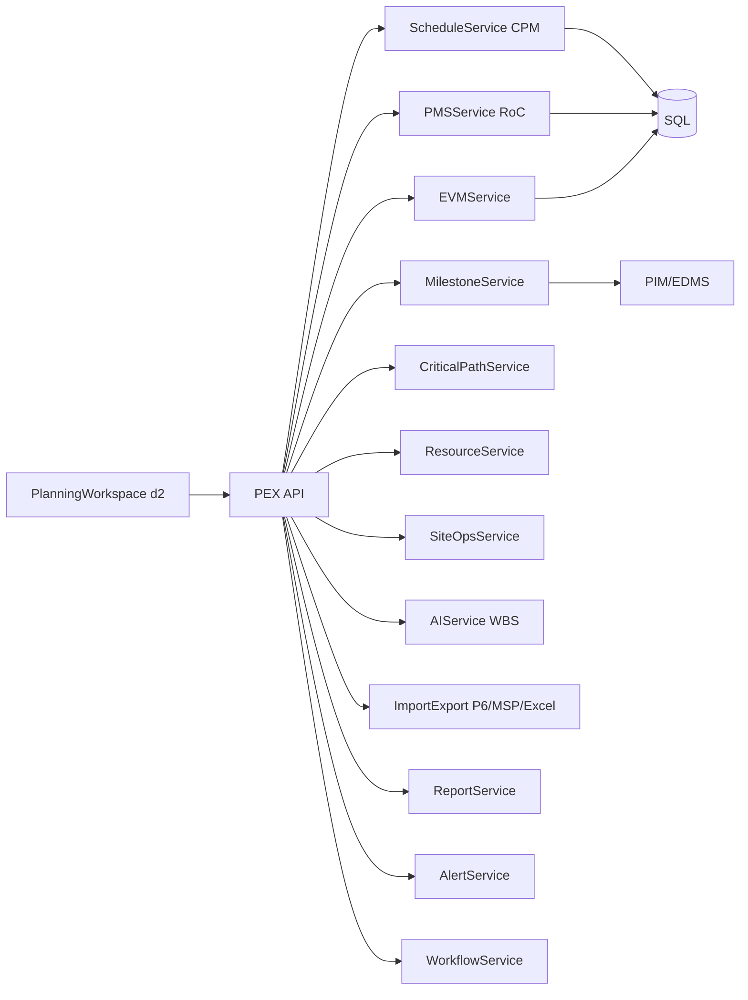
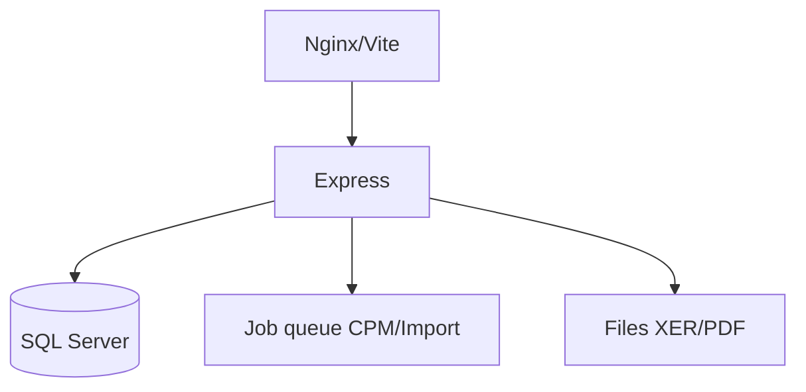

# PEX Deliverable 1 — معماری برنامه‌ریزی و اجرا
خلاصه ۳ خط: ماژول d2 روی پوسته فعلی Arena؛ سایدبار اصلی دست‌نخورده؛ کار در صفحه حوزه. WBS ستون فقرات است. Baseline فقط با CR. Excel/XER ظرف‌اند نه SoT. CPM و EVM سرویس دامنه داخل Express (async برای >20k فعالیت).

پیوند: PIM/DMS برای لینک سند؛ سایدبار همان ۵–۶ فرآیند فعلی d2؛ زیرماژول‌های جدید فقط صفحه بعد.

---

## لایه‌ها
1. **UI** — React/Vite، Vazirmatn، کلاس‌های glass. `PlanningWorkspace` در صفحه d2 (الگوی DocumentWorkspace).
2. **Application** — `pmisApiClient`؛ بدون SQL در مرورگر. PWA DPR بعداً از همان API + syncQueue.
3. **Domain services:** ScheduleService (CPM), EVMService, PMSService, MilestoneService, CriticalPathService, ResourceService, SiteOpsService, AIService, ImportExportService, ReportService, AlertService, WorkflowService.
4. **Infrastructure** — Express موجود، SQL Server Arena (JSONB معادل nvarchar(max) یا مهاجرت PG جدا)، فایل، صف Job برای CPM/EVM/Import.

## Component

## Deployment
همان docker-compose: frontend + api + db. Job worker می‌تواند همان process با queue باشد (ADR: نه microservice در F1).

## CPM Engine (Async)
- ورودی: Activity, Relationship, Calendar, DataDate, Constraints
- توپولوژیک + Forward ES/EF + Backward LS/LF + Float + CP + Near-CP (آستانه پروژه)
- Calendar-aware duration
- اگر N>20k: Job `cpm.compute`؛ UI polling/snapshot
- خروجی: فیلدهای زمان‌بندی + CriticalPathSnapshot

## AI WBS Pipeline
Upload قرارداد → OCR (موجود tesseract) → LLM draft WBS/CBS/Dictionary → Confidence → Human review → Approve به WBSNode. الگو از AITemplateLibrary. Excel خروجی ظرف است.

## Report / Template Engine
Internal + External؛ لوگو سه‌گانه؛ A4؛ رنگ P6 یا سفارشی؛ Excel/Word/PDF؛ پیش‌نمایش پنجره جدا (نه شکستن پوسته اصلی).

## ADR
1. WBS ستون فقرات؛ OBS/CBS/PBS/LBS map می‌شوند.
2. Baseline مقدس؛ فقط Workflow CR.
3. Progress فقط Approved در PMS/EVM.
4. Excel/XER/MPP ظرف + ExternalId برای Round-Trip.
5. Milestone و CP سرویس و خروجی مستقل (هشدار جدا).
6. بازطراحی نه بازنویسی: صفحه d2 مثل d1؛ فایل‌های lucide (`ProjectControl`…) به پوسته وصل نمی‌شوند تا ظاهر نشکند.
7. موتور در-process async نه سرویس جدا در F1.
8. SQL Server فعلی؛ اسکریپت PG فقط در صورت تصویب مهاجرت.

## UI صفحه بعد (نه سایدبار اصلی)
فرآیندهای فعلی d2 نگه داشته می‌شوند. زیرماژول‌های صفحه:
- زمان‌بندی: WBS, Baseline, CPM/Gantt, Health, What-if
- روزانه: DPR
- هفتگی/ماهانه: WPR/MPR
- صفحه: Milestone، Critical Path، PMS/RoC، Lookahead — به‌عنوان زیرماژول همان فرآیندها نه آیتم جدید سایدبار اصلی.

## Self-Validation D1 (۹ Loop فشرده)
- L1 PMBOK: Scope/Schedule/Cost/Resource/Integration در سرویس‌ها دیده شد؛ Quality/Risk/Procurement رابط.
- L2 Milestone: سرویس مستقل در دیاگرام؛ مدل در D2/D5.
- L3 CP: Snapshot سرویس مستقل؛ جزئیات D4/D6.
- L4 Alert: AlertService سراسری.
- L5 PMS: PMSService + RoC.
- L6 Report: Template Engine ADR.
- L7 نام سرویس‌ها با D12 API یکی می‌ماند.
- L8 50k فعالیت → async job؛ F1 هشت هفته فقط WBS+CPM+Import نه همه ۱۲ تحویلی.
- L9 Baseline permission و Period Close در دامنه.

**Gap D1:** جزئیات موجودیت و فرمول در D2+. اتصال P6 واقعی F1. تقویم ایرانی شیفت در Calendar D4.
**اصلاح:** ADR8 SQL Server صریح شد تا با Arena نشکند.
