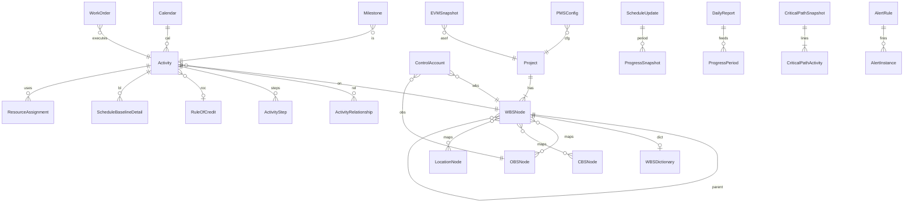

# PEX Deliverable 2 — مدل داده
خلاصه ۳ خط: WBS ستون فقرات. Baseline قفل. Progress فقط Approved. Milestone و Critical Path جدا از Activity ولی با FK. Excel/XER ظرف. JSONB برای فرمول PMS، RoC، AlertRule، Escalation. پارتیشن زمان‌مند برای Snapshot/Audit/DPR.

D1 اصلاح نشد (بدون بازخورد).

---

## قرارداد نوع
uuid PK، timestamptz، numeric(18,4) پول/مقدار، numeric(8,4) درصد، nvarchar/text دوزبانه `*_fa/*_en`.  
وضعیت‌ها با CHECK/ENUM هم‌نام Workflow.

---

## ERD کلان

---

## Scope / WBS
**WBSNode:** Id, ProjectId, ParentId, Code UNIQUE(project,code), NameFa/En, Level, Type(WP|CA|Summary), Weight numeric CHECK 0–1, WeightMethod(Cost|MH|Manual|Hybrid|BOQ), ExternalIdP6, SortPath, IsLocked, CRId, Attrs JSONB  
**WBSDictionary:** WBSNodeId PK/FK, Description, AcceptanceCriteria, Constraints, Assumptions, DeliverableIds[]  
**OBSNode / CBSNode / LocationNode / PBSNode:** همان الگو Code+Parent+NameFa/En+ProjectId  
**WBSMap:** WBSNodeId, OtherType(OBS|CBS|LBS|PBS|BOQ), OtherId, WeightShare CHECK مجموع سهم=1 در سرویس  
**ControlAccount:** Id, ProjectId, WBSNodeId, OBSNodeId, UNIQUE(WBS,OBS), CAMUserId  
**Deliverable:** Id, WBSNodeId, Name, AcceptanceStatus, PunchLink, DmsDocumentId  
**AIAnalysisRequest:** Id, ProjectId, FileId, Status(Upload|OCR|Draft|Review|Approved|Rejected), Confidence, PromptVer  
**AIGeneratedStructure:** RequestId, Kind(WBS|CBS|Dict), Payload JSONB, ApprovedBy  
**AITemplateLibrary:** Id, ProjectType, Structure JSONB

Constraint: تغییر WBS قفل‌شده فقط با CR (سرویس). جمع Weight فرزندان = 1 ±0.001.

---

## Schedule
**Calendar:** Id, ProjectId, Name, HoursPerDay, WorkWeek JSONB, CalendarType  
**CalendarException:** CalendarId, Date, Kind(Holiday|ExtraWork|Shift), Hours  
**Activity:** Id, ProjectId, WBSId, CalendarId, Code UNIQUE(project,code), NameFa/En, Type(Task|Milestone|LOE|WBSSummary|FinishMilestone), DurationHours, PercentComplete, PhysicalPercent (از PMS), ES,EF,LS,LF, TotalFloat, FreeFloat, ConstraintType(ASAP|ALAP|SNET|SNLT|FNET|FNLT|MustStart|MustFinish), ConstraintDate, IsCritical, IsMilestone, ExternalIdP6, ExternalIdMsp, DataDate, Status(NotStarted|InProgress|Completed|OnHold), ApprovedProgressOnly flag مصرف در view  
**ActivityRelationship:** PredId, SuccId, Type(FS|SS|FF|SF), LagHours, CHECK Pred≠Succ  
**ActivityStep:** ActivityId, Seq, Name, Weight, Qty, Uom, InspectionRequired, Percent  
**RuleOfCredit:** Id, Code, Discipline, Steps JSONB `[{name,weight,irRequired}]`, CHECK sum weights=1  
**ScheduleBaseline:** Id, ProjectId, Version, Status(Draft|Approved|Locked|Superseded), ApprovedBy, CRId, LockedAt  
**ScheduleBaselineDetail:** BaselineId, ActivityId, BL_Start, BL_Finish, BL_Dur, BL_Budget  
**ScheduleUpdate:** Id, ProjectId, DataDate, PeriodId, Status(Open|Closed), ClosedBy  
**LookAhead:** Id, ProjectId, Weeks(1|2|3|4|6), FromDate, PPC numeric  
**LookAheadItem:** LookAheadId, ActivityId, PlannedQty, ActualQty  
**DelayRegister:** Id, ActivityId, Cause, Hours, Responsible, DmsLink, ClaimLink

---

## Milestone (مستقل)
**Milestone:** Id, ActivityId UNIQUE (IsMilestone), Type(Contractual|Key|Payment|Gate|Internal|Interface), ContractualDate, BaselineDate, ForecastDate, ActualDate, PenaltyClauseId, PenaltyPerDay, BonusPerDay, LinkedDeliverableId, OwnerOrg(Contractor|Client|Consultant|JV), Priority(Critical|High|Medium|Low), AlertDaysBefore INT[] default {30,14,7,3,1}, EscalationLevels JSONB, Status(OnTrack|AtRisk|Delayed|Achieved|Cancelled), RiskScore  
**MilestoneBaseline:** MilestoneId, BaselineVersionId, BLDate, BLStatus  
**MilestoneHistory:** MilestoneId, ChangeDate, OldDate, NewDate, Reason, ChangedBy, LinkedCRId  
**MilestoneAlert:** … Type Approaching|AtRisk|Overdue|Achieved, DaysToTarget, Severity, Recipients[], SentAt, AckAt, EscalationLevel, LinkedActions JSONB  
**MilestoneReport / MilestoneDashboardConfig:** Config JSONB (فیلتر/ویجت)

نمونه: MS-CTR-01 Contractual Finish Mechanical 1403/12/01، PenaltyPerDay 50,000 USD، AlertDaysBefore {30,14,7}.

---

## Critical Path (مستقل)
**CriticalPathSnapshot:** Id, ProjectId, DataDate UNIQUE(project,date), CPLength_Days, CPLength_Baseline, CPDrift, NearCriticalThreshold default 10, ProjectEndDate_CP, ProjectEndDate_BL, EndDateVariance, HealthScore  
**CriticalPathActivity:** SnapshotId, ActivityId, TF, FF, IsCritical, IsNearCritical, FloatChange_vs_Prev, OnCPSince  
**FloatTrend:** ActivityId, DataDate, TotalFloat, FloatChange, Trend(Improving|Stable|Declining)  
**CriticalPathAlert:** SnapshotId, Type FloatNegative|FloatDecreasing|CPDrift|NewCritical|EndDateSlip|HealthDrop, Severity, ActivityId, Description, Impact, SuggestedAction  
**NearCriticalConfig:** ProjectId PK, FloatThreshold_Warning 10, Critical 5, Emergency 0, Drift Warning 5 / Critical 10, EnableAutoEscalation, EscalationRules JSONB  
**CriticalPathReport:** Instance لینک ReportInstance

---

## Cost / EVM
**CostEstimate:** Class 1–5, WBSId, Amount, Currency, Escalation JSONB  
**Budget / TimePhasedBudget:** Activity×Resource×Period×Amount  
**CostActual:** Source(Timesheet|Invoice|Material|Equipment|Subcon), Amount, Date, ActivityId  
**Commitment:** PO/Subcon, Amount, ActivityId  
**EVMSnapshot:** ProjectId, DataDate, PV,EV,AC,BAC, SV,CV, SPI,CPI, SPI_t, ES, EAC_cpi, EAC_cpi_spi, EAC_manual, EAC_bottomup, ETC, VAC, TCPI_bac, TCPI_eac, Immutable=true  
**ForecastMethod:** ProjectId, Method enum  
**CashFlow:** Period, InPlan, InAct, OutPlan, OutAct  
**ReserveLedger:** Kind(Contingency|Management), Amount, Draws JSONB

---

## Resource
**Resource:** Type Labor|Equipment|Material|Subcon, Trade, Rate, CalendarId  
**ResourceAssignment:** ActivityId, ResourceId, Curve JSONB, Qty, Remaining  
**Timesheet:** UserId, Date, Hours, ActivityId, Status(Draft|Submitted|Approved)  
**EquipmentLog:** ResourceId, Date, WorkH, IdleH, DownH, Fuel  
**MaterialRequirement:** ActivityId, MaterialId, NeedDate, Qty  
**MaterialTransaction:** Kind Receipt|Issue|Return|Transfer  
**ManpowerPlan:** Trade, Period, Headcount

---

## Site Ops
**WorkAuthorization, WorkOrder, DailyReport, InspectionRequest, PunchList, SiteInstruction, PermitToWork, Handover**  
DPR: Weather, Shift, Manpower JSONB, Equipment JSONB, Materials JSONB, ProgressLines (Activity×Location×Qty×Step), Stops (Cause×Hours×Resp), SafetyEvents, Photos GPS JSONB, EvidenceDmsId  
Punch: Cat A|B|C  
Handover: MC|PreComm|Comm|Provisional|Final  
Sync: Conflict table نه LWW.

---

## PMS
**PMSConfig:** ProjectId, WeightMode Cost|MH|Hybrid|BOQ|Manual, Alpha, Beta CHECK α+β=1 اگر Hybrid  
**PMSFormula:** Expr JSONB  
**ProgressPeriod:** ProjectId, DataDate, Status Open|Closed  
**ProgressSnapshot:** PeriodId, ActivityId, PlannedEarly, PlannedLate, ActualApproved, Forecast, Immutable after close  
**SCurveData:** Period, WBSId, Planned, Actual, Forecast  
**VarianceAnalysis:** ActivityId, PeriodId, StartVar, FinishVar, PctVar, Threshold, WorkflowStatus

---

## Report / Alert / System
**ReportTemplate:** Kind Internal|External, Format Xlsx|Docx|Pdf, ColorSchemeId, HeaderConfigId  
**ReportColorScheme:** PrimaveraStandard یا Custom JSONB  
**ReportHeaderConfig:** LogoContractor, LogoClient, LogoConsultant fileIds, ProjectFields  
**ReportInstance / ReportSchedule**  
**AlertRule:** Category Milestone|CP|EVM|Resource|DPR|Progress|Punch|Productivity, Rule JSONB  
**AlertInstance / AlertEscalation / AlertHistory / AlertDashboard**  
**Users/Roles/Permissions** — گسترش Role PEX: planner, cam, site_eng (بدون شکستن Auth فعلی در F0)  
**AuditLog** پارتیشن ماهانه  
**Notifications, ProjectConfig, LogoConfig**

---

## JSONB
RoC steps، Calendar workweek، AlertRule، EscalationLevels، AI payload، Assignment curve، DPR manpower، ColorScheme، PMS formula.

## ایندکس
B-Tree: Activity(ProjectId, WBSId, Status), Relationship(Pred,Succ), Milestone(Project via Activity, Status, ContractualDate), Snapshot(ProjectId, DataDate), DPR(ProjectId, Date)  
GIN: AlertRule.Rule, RoC.Steps, search names  
GiST: LookAhead date range  
Time-series partition: EVMSnapshot, CriticalPathSnapshot, DailyReport, AuditLog, FloatTrend by DataDate/month.

## Performance
۵۰k فعالیت: CPM async؛ ES/EF ستون ماندگار نه محاسبه UI؛ WBS path materialized.

## Self-Validation D2
| Loop | نتیجه |
|---|---|
| 1 PMBOK | جداول Scope..Stakeholder هست |
| 2 Milestone | Type/Penalty/AlertDays/Escalation/History/۱۰ گزارش در D5 جزئی می‌شود؛ فیلدها اینجاست |
| 3 CP | Snapshot, FloatTrend, NearConfig, Drift |
| 4 Alert | AlertRule JSON همه ۸ دسته |
| 5 PMS | Cost/Hybrid + RoC + Period Close + EVM immutable + SPI_t فیلد |
| 6 Report | Internal/External + 3 logo + A4 configs |
| 7 Consistency | نام‌ها = سرویس D1؛ Status لیست‌شده |
| 8 Feasibility | پارتیشن+ایندکس؛ XER ExternalId |
| 9 Security | Baseline Locked؛ Period Closed؛ Progress Approved view |

**Gap:** ۱۰ گزارش Milestone/CP فیلد به فیلد در D5/D6. نقش planner در Auth F0. اسکریپت SQL جدا بعد از تأیید مدل.
**نمونه CP:** فعالیت PIP-ISO-012 TF=0 روی Snapshot DataDate=2026-09-04؛ Drift=+4 روز نسبت BL.
