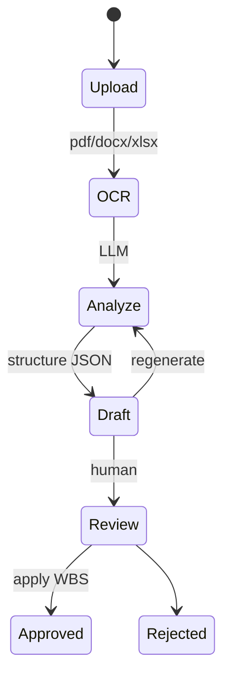

# PEX Deliverable 3 — Scope / WBS + AI Generator
خلاصه ۳ خط: WBS ستون فقرات. وزن فرزندان = ۱۰۰٪. تغییر قفل فقط با CR. AI فقط Draft می‌سازد؛ Approve انسانی اجباری. خروجی Excel ظرف است.

D2 اصلاح نشد.

---

## WBS Builder
- درخت Drag&Drop در **صفحه حوزه d2** (نه سایدبار اصلی).
- Import: Excel قالب، P6 XER/XML (`ExternalIdP6`)، MSP XML.
- عملیات: Add sibling/child, indent, code autonumber `{parent}.{n}`, freeze sort_path.
- Validation زنده: کد تکراری، حلقه Parent، وزن ≠۱.

## WBS Dictionary
هر WP: شرح، معیار پذیرش، فرض، قید، لینک Deliverable و DMS (PIM documentId).

## CBS / OBS / LBS / PBS
گره مستقل + جدول `WBSMap` با `WeightShare`. یک WBS می‌تواند چند CBS داشته باشد؛ مجموع سهم = ۱.

## Control Account
تقاطع WBS × OBS یکتا. CAM مسئول وزن و پیشرفت CA. بدون CA نمی‌توان Baseline سطح کنترل را قفل کرد (هشدار نه hard-stop در F1).

## Weight Engine
| روش | فرمول |
|---|---|
| Cost | `w_i = BAC_i / Σ BAC_sib` |
| ManHour | `w_i = MH_i / Σ MH` |
| BOQ | `w_i = Amount_i / Σ Amount` |
| Hybrid | `w_i = α·w_cost + β·w_mh` ، `α+β=1` از PMSConfig |
| Manual | ورود کاربر + دلیل در Audit |

پس از محاسبه: نرمال‌سازی تا Σ=1 ±0.001 وگرنه `WEIGHT_SUM`.

## Scope Validation
Deliverable Acceptance + Punch باز Cat A روی همان WP → وضعیت Validate=Blocked. IR از SiteOps.

## Scope Change Guard
`WBSNode.IsLocked` پس از Baseline Approved. Edit → الزام `CRId` لینک ماژول تغییر. بدون CR → 409 `SCOPE_LOCKED`.

## BOQ ↔ WBS
نقشه چندبهچند `WBSMap kind=BOQ`. پیشرفت BOQ به WP از طریق سهم.

---

## AI Generator Pipeline


**Prompt template (خلاصه):**  
نقش: planner EPC ایران. ورودی: متن قرارداد+شرح خدمات. خروجی فقط JSON مطابق MappingSchema. WBS حداکثر ۶ سطح. هر برگ Weight و Discipline. زبان Fa+En. اگر مبهم: `confidence<0.7` و `needsReview=true`.

**MappingSchema (نمونه):**
```json
{
  "version": 1,
  "nodes": [
    {
      "code": "1.2.3",
      "nameFa": "فونداسیون مخازن",
      "nameEn": "Tank foundation",
      "discipline": "CIV",
      "type": "WP",
      "weightHint": 0.12,
      "dictionary": { "acceptanceFa": "بتن به مقاومت مشخصه" },
      "confidence": 0.81
    }
  ],
  "cbsHints": [{ "code": "C-210", "mapTo": "1.2.3", "share": 1 }]
}
```

**AITemplateLibrary:** EPC OilGas / Petro / Building / Linear — الگوی سطح ۱–۲ از پیش.

**Excel خروجی AI:** گروه‌بندی بر اساس سطح، رنگ سطح (P6 palette)، شیت `_META` template=AI-WBS. ظرف است؛ Apply فقط از JSON تأییدشده به DB.

**HITL:** Confidence میانگین <0.75 → Approve کامل ممنوع؛ فقط گره به گره. Audit `AI_APPLY`.

شبه‌کد:
```
draft = llm(prompt, ocrText, library)
validateSchema(draft)
if min(confidence)<0.5: flag all needsReview
onApprove(nodes): insert WBSNode unlocked; no baseline change
```

---

## Self-Validation D3 (۹ Loop)

| Loop | ✓/Gap |
|---|---|
| 1 PMBOK Scope | WBS, Dict, Validate, Control, Change Guard |
| 2 Milestone | Deliverable لینک Milestone در D5؛ اینجا FK Deliverable |
| 3 CP | WBS روی Activity در D4 |
| 4 Alert | WEIGHT_SUM و SCOPE_LOCKED می‌تواند Alert Progress/Integration |
| 5 PMS | روش وزن = PMSConfig |
| 6 Report | Excel AI گروه‌بندی+رنگ |
| 7 Consistency | نام WBSNode/Map با D2 |
| 8 Feasibility | LLM اختیاری؛ بدون کلید هم Import Excel کار می‌کند |
| 9 Security | Apply AI نیاز document/planning.manage؛ فایل OCR اسکن فاز PIM F2 |

**Gap Analysis D3**
| # | Gap | حل |
|---|---|---|
| 1 | Drag&Drop جزئیات UX | F1 UI درخت ساده بدون lib جدید اگر ظاهر بشکند |
| 2 | LLM vendor | آداپتور؛ آفلاین = فقط قالب Library |
| 3 | جمع وزن اعشار | تلورانس 0.001 + نرمال‌سازی |
| 4 | Punch از SiteOps هنوز D9 | Validate در F2 وقتی Punch باشد؛ F1 چک Deliverable |

منتظر تأیید برای **D4 Schedule/CPM**.
