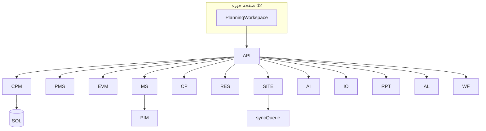
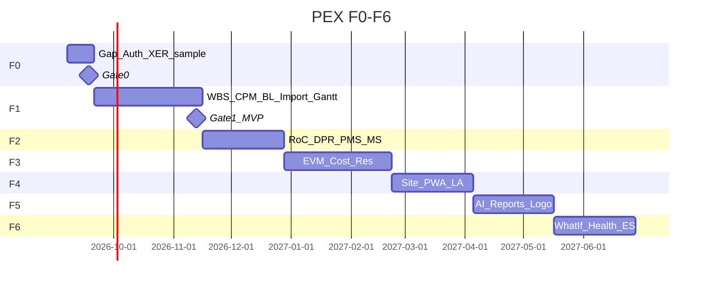

# گزارش نهایی کیفیت و خلاصه اجرایی — ماژول PEX
نسخه 1.0 | 2026-09-04 | طراحی D1–D12 تأیید تدریجی | پیاده‌سازی UI d2 هنوز نشده

اصل: WBS ستون فقرات · Baseline مقدس · Excel/XER ظرف · Progress فقط Approved · سایدبار اصلی Arena بدون آیتم جدید.

---

# بخش ۱ — اعتبارسنجی جامع

## ۹ Loop روی کل طراحی
| Loop | حکم |
|---|---|
| 1 PMBOK | Scope/Schedule/Cost/Resource/Integration در سرویس‌ها؛ Quality=IR/Punch؛ Comms=DPR/WPR/MPR؛ Risk=Delay+Float؛ Procurement=Material/IPC رابط |
| 2 Milestone | Types، Penalty/Bonus، AlertDays، Escalation، History+CR، ۱۰ گزارش، Widget، Forecast=EF، Status خودکار، جریمه |
| 3 Critical Path | Snapshot هر DataDate، FloatTrend، Near آستانه، Drift، ۱۰ گزارش، ۹ هشدار، DCMA 14، Emergency با MS قراردادی |
| 4 Alert | JSON Rule، ۸ دسته، L1–L3، In-App+Email (SMS/Push بعد)، Ack، Dashboard، History، Severity، SuggestedAction، لینک CR/RSK |
| 5 PMS | Cost/Hybrid، RoC بتن/فولاد/لوله/کابل، Roll-up، S-Curve Early/Late/Actual، Planned%@DD، Period Close، EVM immutable، SPI(t) |
| 6 Report | Internal/External، P6+Custom، ۳ لوگو، A4، Excel/Word/PDF، Word in، Preview جدا، P6/MSP Round-Trip+ExternalId |
| 7 Consistency | نام Entity≈API؛ Status لیست‌شده؛ نقش planner در F0؛ هشدارها مکمل نه متناقض |
| 8 Feasibility | CPM async >20k هدف <30s؛ F1 هشت هفته برش‌خورده واقع‌بین؛ XER parser ریسک؛ PWA F4 |
| 9 Security | BL lock، Period Close، Approved-only EV، Audit، ABAC پروژه، JWT+rate limit؛ ویروس از PIM F2 |

## Cross-check
| پرسش | حکم |
|---|---|
| D2 Entity = D12 API؟ | عمدتاً بله؛ کمبود صریح: OBS/CBS CRUD جدا، Calendar CRUD، LogoConfig، Punch-only nested |
| D5 MS ↔ D4 CPM | ForecastDate=EF؛ IsMilestone روی Activity |
| D6 ↔ D4 | Snapshot بعد computeCPM |
| D12 Alert ↔ D5/D6/D7 | دسته جدا، Dashboard ادغام |
| D10 ↔ D7 | EV=BAC×Physical%_Approved — تناقض نیست |
| D11 ↔ خروجی‌ها | گزارش‌های 1–36 پوشش MS/CP/EVM/PMS/Res/Site |
| D3 AI ↔ D2 WBS | MappingSchema→WBSNode |
| D11 P6 ↔ D4 | ExternalIdP6 روی Activity/Cal/Rel |
| D9 ↔ D10/D12 | DPR→WF2→Approved→PMS |
| D8 ↔ D7/D10 | Timesheet Approved→AC و MH وزن |
| F1 ↔ D1 | همان Express+صفحه d2؛ نه microservice |
| فرمول EVM↔PMS | یک منبع Physical% |

---

# بخش ۲ — Gap Analysis

| # | مشکل | اثر | D# | حل | تلاش |
|---|---|---|---|---|---|
| G1 | صفحه d2 خالی است؛ PlanningWorkspace نیست | H | D1,UI | پیاده الگوی DocumentWorkspace | 1–2 هفته |
| G2 | OpenAPI PEX فایل ندارد | M | D12 | تولید YAML از لیست D12 | 2 روز |
| G3 | Migration SQL PEX نیست | H | D2 | اسکریپت از مدل D2 (SS یا PG) | 1 هفته |
| G4 | نقش planner در AuthContext نیست | H | D12,App | گسترش نقش F0 بدون تغییر ظاهر | 3 روز |
| G5 | Parser XER واقعی نیست | H | D4,D11 | F1 spike+کتابخانه | 2 هفته |
| G6 | SMS/Push | L | D12 | F5+ | — |
| G7 | ویروس آپلود | M | D9 | اشتراک با PIM ClamAV | 1 هفته |
| G8 | LLM بدون کلید | M | D3 | آفلاین فقط Library | — |
| G9 | Test pack PEX نوشته نشده | M | — | الگو PIM_TEST_CASES | 3 روز سند |
| G10 | دو منبع CPM در UI lucide قدیمی | M | App | وصل نکردن lucide؛ فقط پوسته glass | F1 |
| G11 | پورت API 4000/5000 | L | infra | یک .env | 0.5 روز |
| G12 | وزن DCMA سفارشی | L | D6 | ProjectConfig کارگاه | تصمیم مدیر |

**اصلاح فوری High:** G1 UI بعد از تصویب بودجه F1 · G3+G4 در F0 · G5 spike هفته ۱ F1.

نیاز به تصمیم مدیر: SQL Server vs Postgres برای PEX؛ نرخ نفر-ساعت؛ پروژه پایلوت و DC/Planner مالک.

---

# بخش ۳ — خلاصه اجرایی

## الف) معرفی
PEX لایه برنامه‌ریزی و اجرای عملیات در Arena است: از WBS و CPM تا DPR سایت، PMS مرسوم ایران، EVM و مایلستون قراردادی. هدف جایگزینی پراکندگی P6+Excel با منبع حقیقت در DB است در حالی که XER/Excel همچنان ظرف ورود/خروج‌اند.

ارزش: هشدار زودهنگام مسیر بحرانی و مایلستون جریمه‌دار، پیشرفت قاعده‌مند (RoC نه درصد سلیقه)، Evidence ادعا از DPR، گزارش ابلاغی A4 با لوگو، کار سایت آفلاین.

## ب) معماری

جریان: 1) ورود حوزه بدون تغییر سایدبار اصلی 2) WBS/فعالیت در DB 3) CPM job 4) پیشرفت سایت Approve 5) PMS/EVM/هشدار/گزارش از همان داده.

۱۲ زیرماژول = ۱۲ Deliverable: Arch, Data, WBS+AI, CPM, MS, CP, EVM, Resource, Site, PMS, Report, Alert/API/MVP.

## ج) جداول (نام)
**Scope/WBS:** WBSNode, WBSDictionary, OBSNode, CBSNode, LocationNode, PBSNode, WBSMap, ControlAccount, Deliverable, AIAnalysisRequest, AIGeneratedStructure, AITemplateLibrary  
**Schedule:** Calendar, CalendarException, Activity, ActivityRelationship, ActivityStep, RuleOfCredit, ScheduleBaseline, ScheduleBaselineDetail, ScheduleUpdate, LookAhead, LookAheadItem, DelayRegister  
**Milestone:** Milestone, MilestoneBaseline, MilestoneHistory, MilestoneAlert, MilestoneReport, MilestoneDashboardConfig  
**CP:** CriticalPathSnapshot, CriticalPathActivity, FloatTrend, CriticalPathAlert, NearCriticalConfig, CriticalPathReport  
**Cost/EVM:** CostEstimate, Budget, TimePhasedBudget, CostActual, Commitment, EVMSnapshot, ForecastMethod, CashFlow, ReserveLedger, FxRate  
**Resource:** Resource, ResourceAssignment, Timesheet, EquipmentLog, MaterialRequirement, MaterialTransaction, ManpowerPlan  
**Site:** WorkAuthorization, WorkOrder, DailyReport, InspectionRequest, PunchList, SiteInstruction, PermitToWork, Handover, SyncConflict  
**PMS:** PMSConfig, PMSFormula, ProgressPeriod, ProgressSnapshot, SCurveData, VarianceAnalysis  
**Report:** ReportTemplate, ReportColorScheme, ReportHeaderConfig, ReportInstance, ReportSchedule  
**Alert:** AlertRule, AlertInstance, AlertEscalation, AlertHistory, AlertDashboard  
**System:** AppUser, Role, Permission, AuditLog, Notification, ProjectConfig, LogoConfig  

**حدود ۷۵ جدول** (ادغام با PIM در User/Audit در اجرا).

## د) API — حدود ۶۰ (خلاصه Method+Path)
WBS CRUD/import/AI · Activities/Rels · POST `/cpm/compute` · Baselines lock · Period close · Lookahead · Milestones/reports · CP snapshots/health · Budget/actuals/evm/cashflow · Resources/timesheet/materials · DPR/IR/Punch/WO/Handover · PMS config/scurve · Reports generate · Alerts ack  
جزئیات: `docs/PEX_D12_Alert_API_MVP.md`

## ه) گزارش‌ها
MS 10 · CP 10 · EVM (SPI/CPI/ES, variance, cash, reserve) · PMS S-Curve/WPR/MPR · Resource histogram/material · Site DPR/Punch/Handover · Executive dashboard/DCMA — جمع ۳۶ در D11.

## و) Alerts
MS 7 قاعده · CP 9 · EVM SPI/CPI/EAC>BAC · Resource over-alloc/shortage · DPR 24h · Progress انحراف · Punch A · Productivity <80%.

## ز) MVP F1
**In:** WBS, Activity, تقویم، CPM، Baseline lock، Import P6/MSP/Excel، Gantt صفحه d2، Fa/En، ABAC، Audit.  
**Out:** EVM کامل، PWA، AI، PDF لوگو، Leveling، SMS، تغییر سایدبار.  
**DoD:** AC داستان‌ها، calendar-aware CPM، ExternalId Round-Trip، وزن WBS=1، ظاهر سالم.  
**زمان:** ۸ هفته (+۲ هفته F0).

## ح) ریسک (≥۱۲)
| # | ریسک | P | I | پاسخ | مسئول |
|---|---|---|---|---|---|
| 1 | XER پیچیده | H | H | Spike F1؛ Excel موازی | Backend |
| 2 | ۵۰k CPM کند | M | H | Async+ایندکس | Tech |
| 3 | مقاومت Excel-SoT | H | H | ظرف عالی+آموزش | PMO |
| 4 | نقش‌ها ناقص | H | M | F0 Auth | Lead |
| 5 | داده P6 کثیف | H | M | DCMA قبل commit | Planner |
| 6 | تعارض DPR | M | M | نه LWW | Site |
| 7 | جریمه قراردادی غلط | M | H | بند در Clause کارگاه | حقوقی+PC |
| 8 | LLM توهم WBS | M | M | HITL اجباری | BA |
| 9 | دو UI lucide/glass | M | H | فقط glass | FE |
| 10 | Period close دور زدن | L | H | قفل DB | DBA |
| 11 | پایلوت بدون Planner | M | H | مالک فرآیند | Sponsor |
| 12 | بودجه F1–F6 یکجا | M | M | Gate هر فاز | مدیر |

## ط) منابع
تیم: BE 1.5 · FE 1 · PWA 0.5 از F4 · DevOps 0.25 · QA 0.5 · Domain PC 0.5 · UX 0.25 · AI 0.5 از F5.  
F0–F6 ≈ 2+8+6+8+6+6+6 = **۴۲ هفته تقویمی** زنجیره (با همپوشانی ~۳۲–۳۶).  
F1+F0 ≈ ۱۰ هفته · ~۸۰۰–۱۰۰۰h فاز1 · کل تا F6 ~۲۵۰۰–۳۰۰۰h.  
زیرساخت: SQL موجود، صف Job، فایل XER، اختیاری Redis.  
تاریخ نمونه از 2026-09-07: F0 09-18 · F1 Gate 2026-11-13 · F2 پایان 2026-12 · F6 2027-Q2.

## ی) ۱۰ توصیه
1. F0 نقش+پایلوت+نمونه XER  2. UI d2 قبل از CPM سنگین  3. ExternalId از روز اول  4. RoC قبل درصد دستی  5. BL lock تست‌شده  6. هشدار MS/CP جدا در داشبورد ادغام  7. EV=Approved only  8. نساختن سایدبار جدید  9. Gate بودجه هر فاز  10. کارگاه جریمه روز تقویمی/کاری.  
CSF: Planner مالک، پایلوت یک پروژه، P6 export تمیز، عدم شکستن پوسته.

---

# بخش ۴ — Handover

**موجود:** D1–D12 md + این گزارش.  
**نیست (باید ساخته شود):** OpenAPI PEX، Migration V00x، تست ۱۴۲تایی، کد CPM/EVM/PMS، Parser XER، Manuals.  
**پیکربندی نمونه:** در D3 MappingSchema، D5 Escalation JSON، D10 RoC، D11 رنگ، D12 AlertRule JSON.  
**مهاجرت ماژول موجود:** فایل‌های lucide را به App وصل نکنید؛ داده Excel فعلی Import ظرف؛ Rollback=قفل نکردن BL تا Gate F1.

---

# بخش ۵ — Roadmap

وابستگی: F2 بعد F1 (Activity) · F3 بعد F2 (Approved %) · F4 موازی بخشی با F3 · F5 بعد داده پایدار.

---

# بخش ۶ — KPI موفقیت
**فنی:** CPM 50k <30s · Uptime 99.5% · EVM تناقض 0 · Import>95% · Sync>98% · Alert<60s  
**کاربری:** Adoption ماهانه · TTV اولین Gantt/گزارش <۱ هفته · NPS · آموزش <۲ روز Planner  
**کسب‌وکار:** نفر-ساعت MPR −40% · Hit Rate مایلستون · ادعا با Evidence DPR · شناسایی تأخیر زودتر از Excel

خط مبنا SPI/MPR فعلی: **نیاز به تصمیم مدیر / کارگاه پایلوت.**

---

# Executive One-Pager
**PEX** برنامه‌ریزی و اجرای Arena: DB منبع حقیقت؛ P6/Excel ظرف.  
**وضعیت:** طراحی ۱۲ تحویلی کامل؛ ساخت UI d2 شروع نشده.  
**F1 (۸+۲ هفته):** WBS+CPM+Baseline+Import+Gantt روی صفحه حوزه — نه سایدبار اصلی.  
**قفل:** نقش planner، اسکریپت DB، نمونه XER، پایلوت.  
**ریسک بزرگ:** Parser P6 و عادت Excel.  
**بودجه فاز1:** ~۹۰۰h. کل F6 ~۳۰۰۰h / ~۹ ماه همپوشان.  
**تصمیم الان:** تصویب F0+F1 یا توقف در سند.
