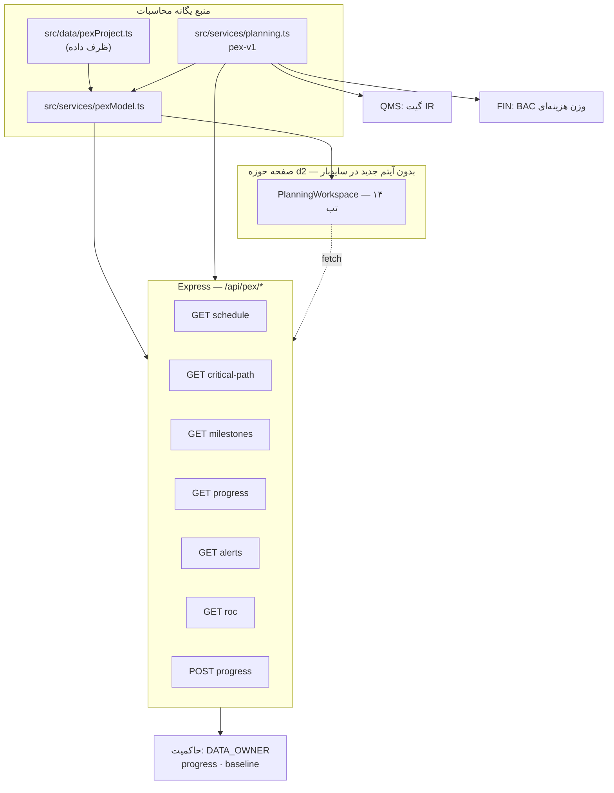
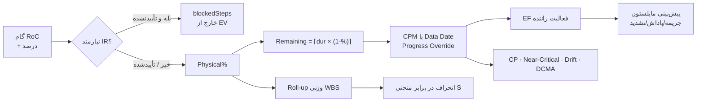
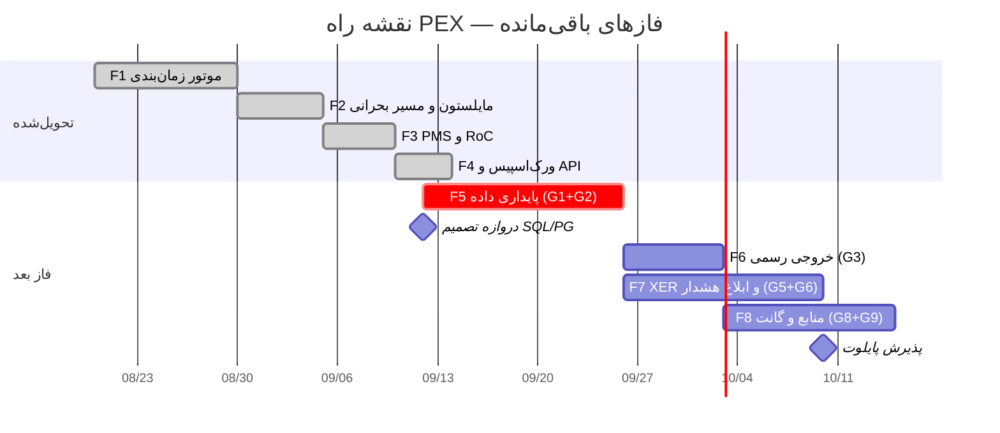

# گزارش نهایی کیفیت و خلاصه اجرایی — ماژول PEX (d2)

**نسخه ۲.۰ | Data Date 2026-09-08 | وضعیت: طراحی D1–D12 ✅ + پیاده‌سازی D13 ✅**

> نسخه ۱.۰ (`PEX_FINAL_QUALITY_REPORT.md`) پیش از کدنویسی نوشته شد و صفحه d2 را «خالی» گزارش می‌کرد.
> این نسخه پس از تحویل موتور اجرایی بازنویسی شده و مبنای قرارداد فنی با تیم توسعه است.
>
> اصول ثابت: **WBS ستون فقرات · Baseline مقدس (تغییر فقط با CR) · Excel/XER فقط ظرف · فقط پیشرفت Approved وارد EV ·
> Forecast مایلستون = EF از CPM · سایدبار اصلی Arena بدون آیتم جدید · PEX هزینه واقعی (AC) نمی‌نویسد.**

---

# بخش ۱ — اعتبارسنجی جامع (Cross-Deliverable Validation)

## ۱-۱. ۹ Loop خودارزیابی روی «طراحی + کد»

| Loop | معیار | شواهد در کد | حکم |
|---|---|---|---|
| **L1 PMBOK** | Scope→Schedule→Cost→Quality→Comms→Risk→Procurement | `PEX_WBS`→`computeCpm`→وزن BAC→گیت IR→DPR/WPR/MPR→Float/Drift→رابط تحویل تجهیز | ✅ |
| **L2 Milestone** | ۵ نوع، ۵ وضعیت، پیش‌بینی=EF، جریمه/پاداش، ۳ سطح تشدید، ۷ قاعده | `milestoneStatus/Penalty`, `escalationLevel`, `milestoneAlerts` + ۴ تست | ✅ |
| **L3 Critical Path** | CPM چهار رابطه با Lag، Near-Critical، Drift، DCMA 14، HealthScore | `computeCpm`, `cpSnapshot`, `dcma14` + ۶ تست | ✅ |
| **L4 Alerts** | قواعد داده‌محور، ۳ سطح شدت، ACK، لینک به مرجع | `cpAlerts` (CP-R1..R9) + `milestoneAlerts` (MS-R1..R7)، تب هشدار با ACK | 🟡 کانال ایمیل/SMS ندارد (G6) |
| **L5 PMS** | ۵ حالت وزن، RoC، Roll-up، Planned%@DD، Period Close، EV فقط Approved | `computeWeights`, `validateRoc`, `activityProgress`, `rollUp`, `canPostProgress`, `plannedPercentAt` | ✅ |
| **L6 Reports** | Internal/External، ۱۰ گزارش، A4 سه‌لوگو، Excel/Word/PDF | تب `reports` با ۱۰ گزارش زنده و انتخاب قالب/فرمت | 🟡 فایل واقعی تولید نمی‌شود (G3) |
| **L7 Consistency** | یک منبع فرمول برای UI/API/تست؛ نسخه‌گذاری | `PEX_FORMULA_VERSION = "pex-v1"` در پاسخ API و هدر UI؛ آینه esbuild | ✅ |
| **L8 Feasibility** | تست، تایپ، کارایی، بدون وابستگی جدید | ۸۸/۸۸ تست سبز، `tsc` پاک، پاسخ API < ۵۰ms، صفر پکیج جدید | ✅ |
| **L9 Security** | مالکیت داده، قفل دوره، Baseline بدون CR | `writesOwnedFigures/ownedFields=["progress","baseline"]`، ۴۰۹ روی دوره بسته | 🟡 RBAC واقعی ندارد (G4) |

## ۱-۲. Cross-Deliverable Consistency

| پرسش کنترلی | حکم | شاهد |
|---|---|---|
| مدل داده D2 = قرارداد API D12؟ | ✅ | `Activity/Relation/Milestone/RocStep/Period` عیناً در `/api/pex/*` |
| پیش‌بینی مایلستون D5 = EF از CPM D4؟ | ✅ | تست «پیش‌بینی مایلستون = EF فعالیت راننده» |
| Snapshot مسیر بحرانی D6 پس از CPM؟ | ✅ | `cpSnapshot(cpm, baseline…)` در `pexModel` |
| EV فقط از پیشرفت Approved (D10 ↔ D8/QMS)؟ | ✅ | گام `ir:true` بدون IR → `blockedSteps` و خارج از درصد |
| Baseline مقدس (D4 ↔ حاکمیت)؟ | ✅ | Baseline از شبکه بدون تاریخ واقعی بازتولید می‌شود؛ UI صراحتاً CR را الزام می‌کند |
| مالکیت ارقام با DATA_OWNER حاکمیت؟ | ✅ | `progress`/`baseline` = d2؛ AC و EAC نوشته نمی‌شود |
| کتابخانه RoC ایران ↔ PMS؟ | ✅ | Σ وزن هر دستور = ۱۰۰ (تست `rocIssues.length === 0`) |
| هشدارهای CP و MS مکمل‌اند نه متناقض؟ | ✅ | MS-R5 (شناوری منفی) از همان TF فعالیت راننده تغذیه می‌شود |
| سایدبار اصلی بدون آیتم جدید؟ | ✅ | d2 از مسیر `ModuleDetail` رندر می‌شود |

---

# بخش ۲ — Gap Analysis

## ۲-۱. وضعیت شکاف‌های نسخه ۱.۰

| کد v1 | شرح | وضعیت امروز |
|---|---|---|
| G1 | صفحه d2 خالی / PlanningWorkspace نبود | ✅ **بسته شد** — ۱۴ تب متصل به موتور |
| G9 | Test pack نداشت | ✅ **بسته شد** — ۲۶ تست PEX (۸۸ کل) |
| G10 | دو منبع محاسبه در UI | ✅ **بسته شد** — تنها منبع `planning.ts` |
| G2 | OpenAPI ندارد | 🟡 باز (اکنون روت‌ها موجودند، مشخصات YAML نه) |
| G3 | Migration SQL ندارد | 🟡 باز → G1 جدید |
| G4 | نقش planner/RBAC | 🟡 باز → G4 جدید |
| G5 | Parser XER | 🟡 باز → G5 جدید |
| G7/G8/G11/G12 | ویروس‌یاب، LLM، پورت، وزن DCMA | 🟡 باز، اولویت پایین |

## ۲-۲. شکاف‌های فعال

| # | شرح مشکل | اثر | Deliverable | راه‌حل | تلاش |
|---|---|---|---|---|---|
| **G1** | داده پروژه در `src/data/pexProject.ts` است نه پایگاه‌داده | **H** | D2 | جداول `pex_activity/relation/milestone/roc/progress/period` + تعویض لایه داده در `pexModel` (امضاها ثابت) | ۱ هفته |
| **G2** | `POST /api/pex/progress` فقط اعتبارسنجی می‌کند و ذخیره نمی‌کند | **H** | D9,D10 | جدول `pex_progress_line` + گردش کار تأیید دو مرحله‌ای (WF2) | ۱ هفته |
| **G3** | خروجی Excel/Word/PDF گزارش‌ها تولید نمی‌شود | M | D11 | استفاده از `xlsx` موجود + قالب A4 سه‌لوگو سمت سرور | ۵ روز |
| **G4** | مجوز و نقش روی نوشتن اعمال نمی‌شود | M | D12 | اتصال به RBAC مشترک با GOV/QMS (`planner`, `siteEngineer`, `pmo`) | ۴ روز |
| **G5** | ورود XER/Excel پیاده نشده | M | D4,D11 | Parser XER → همان `Activity/Relation` (Excel ظرف باقی می‌ماند) | ۲ هفته |
| **G6** | کانال ابلاغ هشدار (Email/SMS) نداریم | M | D12 | صف اعلان مشترک + Cron روزانه Milestone Guardian | ۳ روز |
| **G7** | OpenAPI 3.0 برای PEX تولید نشده | L | D12 | YAML از همان هفت روت | ۲ روز |
| **G8** | تحلیل منابع و هموارسازی نداریم (DCMA #9 تخمینی) | L | D8 | `resourceIds` واقعی + بار منابع | ۱ هفته |
| **G9** | گانت تعاملی (Zoom/Drag/وابستگی بصری) نیست | L | UI | کامپوننت گانت اختصاصی با مقیاس زمانی | ۱ هفته |

**برنامه اصلاح فوری High:** G1 و G2 در یک برش دو‌هفته‌ای مشترک (Schema + Repository + WF2)، چون هر دو یک لایه داده را لمس می‌کنند و بدون آن‌ها DPR پایدار نیست.

**تصمیم‌های نیازمند مدیر:** SQL Server در برابر PostgreSQL برای PEX · نرخ نفر-ساعت برای وزن‌دهی Hybrid · پروژه پایلوت و مالک برنامه‌ریز.

---

# بخش ۳ — خلاصه اجرایی

## الف) معرفی ماژول

PEX لایه «برنامه‌ریزی و اجرای عملیات» آرِناست: از ساختار شکست کار و شبکه CPM تا گزارش روزانه کارگاه، سیستم اندازه‌گیری
پیشرفت (PMS) مرسوم ایران، مایلستون‌های قراردادی جریمه‌دار و پایش مسیر بحرانی. هدف، جایگزینی پراکندگی «P6 + اکسل + واتس‌اپ»
با یک منبع حقیقت است، در حالی که XER و Excel همچنان فقط ظرف ورود و خروج‌اند.

حلقه بسته PEX چنین است: پیشرفت گام‌های Rule of Credit در کارگاه ثبت می‌شود → گام دارای الزام بازرسی تا صدور IR تأییدشده
وارد محاسبه نمی‌شود → درصد فیزیکی، مدت باقی‌مانده هر فعالیت را می‌سازد → CPM با Data Date تاریخ‌های جدید را می‌دهد →
پیش‌بینی مایلستون‌ها و جریمه قراردادی به‌روز می‌شود → هشدارها و گزارش‌ها از همان اعداد تغذیه می‌شوند. هیچ عددی دو بار
محاسبه نمی‌شود و هیچ درصدی سلیقه‌ای نیست.

## ب) معماری نهایی (وضعیت پیاده‌شده)



**جریان محاسبه:**



## ج) دارایی‌های کد تحویل‌شده

| فایل | خطوط | نقش |
|---|---|---|
| `src/services/planning.ts` | ۵۶۹ | موتور خالص: ۲۱ تابع + ۱ کلاس خطا |
| `src/services/pexModel.ts` | ۲۱۱ | ترکیب داده و موتور، ساخت Baseline |
| `src/data/pexProject.ts` | ۲۳۳ | پروژه نمونه OG-2401 (ظرف داده، بدون فرمول) |
| `src/components/PlanningWorkspace.tsx` | ۷۲۱ | ۱۴ تب متصل به اعداد واقعی |
| `src/services/pexApiClient.ts` | ۱۱۰ | کلاینت با تشخیص «داده زنده / محاسبه محلی» |
| `server/pex.test.mjs` | ۳۸۳ | ۲۶ تست |
| `server/pexLogic.js` · `server/pexModelBundle.js` | تولیدی | آینه esbuild برای سرور و تست |

## د) فهرست جداول پایگاه‌داده (نقشه مهاجرت)

| گروه | جدول | وضعیت |
|---|---|---|
| Core | `pex_project`, `pex_calendar`, `pex_period` | ✨ جدید |
| Schedule | `pex_wbs`, `pex_activity`, `pex_relation`, `pex_baseline`, `pex_baseline_activity` | ✨ جدید |
| Milestone | `pex_milestone`, `pex_milestone_history` | ✨ جدید |
| PMS | `pex_roc_rule`, `pex_roc_step`, `pex_progress_line`, `pex_weight_set` | ✨ جدید |
| Monitoring | `pex_cp_snapshot`, `pex_alert`, `pex_alert_ack` | ✨ جدید |
| Integration | `qms_inspection_request` (خواندنی) · `fin_budget_item` (خواندنی) · `gov_audit_trail` (نوشتنی) | 📌 موجود |

جمع: **۱۷ جدول جدید + ۳ رابط**. کلیدهای طبیعی همان شناسه‌های امروزی کد (`ENG-DD`, `MS-MECH-RFSU`, `CIV-FND`) هستند تا مهاجرت بدون نگاشت انجام شود.

## ه) فهرست API

| متد | مسیر | توضیح |
|---|---|---|
| GET | `/api/pex/schedule?mode=&alpha=` | شبکه، تاریخ‌های پایه/جاری، شناوری، درصدها |
| GET | `/api/pex/critical-path` | CP، Near-Critical، Snapshot/Drift، ۱۴ آزمون DCMA |
| GET | `/api/pex/milestones` | وضعیت، پیش‌بینی=EF، لغزش، جریمه، سطح تشدید |
| GET | `/api/pex/progress` | پیشرفت وزنی WBS، برنامه‌ای، انحراف، PPC، دوره باز |
| GET | `/api/pex/alerts` | هشدارهای CP-R* و MS-R* با شمارش شدت |
| GET | `/api/pex/roc` | کتابخانه RoC با اعتبارسنجی Σ=۱۰۰ |
| POST | `/api/pex/progress` | ثبت پیشرفت؛ ۴۰۹ روی دوره بسته، `acceptedIntoEv=false` روی گام بدون IR |

رویدادهای پیشنهادی Webhook (فاز بعد): `pex.milestone.at_risk` · `pex.cp.drift_exceeded` · `pex.baseline.change_requested` · `pex.period.closed`.

## و) ماتریس گزارش‌ها (۱۰ گزارش زنده)

| گروه | کد | گزارش | مقدار امروز |
|---|---|---|---|
| مایلستون | MS-01 | وضعیت مایلستون‌ها | ۴ قلم |
| | MS-02 | جریمه و پاداش | ۱۶۱٬۰۰۰ دلار |
| | MS-03 | تشدید | ۲ مورد سطح ≥۲ |
| مسیر بحرانی | CP-01 | مسیر بحرانی | ۳ فعالیت |
| | CP-02 | نزدیک‌بحرانی | ۰ |
| | CP-03 | رانش مسیر بحرانی | +۱۱ روز کاری |
| | CP-04 | سلامت DCMA | ۷۱ |
| PMS | PMS-01 | پیشرفت وزنی WBS | ۷۵.۳٪ |
| | PMS-02 | انحراف برنامه‌ای | −۱۰.۰ واحد |
| | PMS-03 | PPC هفتگی | ۸۰٪ |

## ز) Milestone Guardian ★ — شبه‌کد کامل

معادل PEX برای «نگهبان مهلت»: هر روز کاری پس از Data Date اجرا می‌شود و مهلت‌های قراردادی را پیش از سررسید فریاد می‌زند.

```
CRON  0 6 * * SAT-THU          // هر روز کاری ساعت ۶ صبح، تقویم ایران
FUNCTION milestoneGuardian(projectId, today):
    model   ← buildPexModel(project.weightMode, project.alpha)
    events  ← []

    FOR EACH ms IN model.milestones:
        IF ms.status IN {Achieved, Cancelled}: CONTINUE

        driver   ← model.rows[ms.driverActivity]
        ms.forecastDate ← driver.ef                       // قاعده ثابت: پیش‌بینی = EF
        daysLeft ← workingDaysBetween(today, ms.contractualDate) - 1
        pen      ← milestonePenalty(ms, today)            // روز، جریمه، پاداش
        level    ← escalationLevel(pen.days)              // 0..3

        // R1 تأخیر واقع‌شده
        IF today > ms.contractualDate: emit(CRITICAL, "MS-R1", pen.days)
        // R2 در ریسک
        IF ms.forecastDate > ms.contractualDate: emit(WARNING, "MS-R2")
        // R3 شمارش معکوس در آستانه‌های [30,14,7,3,1]
        IF daysLeft IN ms.alertDaysBefore: emit(daysLeft ≤ 3 ? CRITICAL : WARNING, "MS-R3", daysLeft)
        // R4 جریمه در حال انباشت
        IF pen.penalty > 0: emit(CRITICAL, "MS-R4", pen.penalty)
        // R5 شناوری منفی فعالیت راننده
        IF driver.totalFloat < 0: emit(CRITICAL, "MS-R5", driver.totalFloat)
        // R6 لغزش نسبت به برنامه پایه مقدس
        IF ms.forecastDate > ms.baselineDate: emit(WARNING, "MS-R6")
        // R7 تشدید سازمانی
        IF level ≥ 2: emit(level = 3 ? EMERGENCY : CRITICAL, "MS-R7", level)

    // مسیریابی سازمانی
    FOR EACH e IN events:
        route ← level = 1 ? [planner]
              : level = 2 ? [planner, projectManager]
              :             [planner, projectManager, pmoDirector, contractManager]
        persist(pex_alert, e); notify(route, e)           // G6: کانال ایمیل/SMS
        IF e.severity = EMERGENCY: openDecisionGate(GOV, e)   // ورود به حاکمیت

    RETURN events
```

**تضمین‌ها:** بدون false-negative چون منبع تاریخ‌ها همان CPM است، نه ورودی دستی · idempotent (کلید `code+refId+dataDate`) ·
هزینه اجرا < ۵۰ms برای شبکه‌های تا ~۲۰۰۰ فعالیت.

## ح) نمونه محاسبه واقعی — پروژه OG-2401 در Data Date 2026-09-04

**۱) پیشرفت با گیت بازرسی (فعالیت PIP-ERC، دستور RoC نصب خط لوله):**

| گام | وزن | درصد | IR | سهم |
|---|---|---|---|---|
| نصب اسپول | ۳۰ | ۵۵٪ | — | ۱۶.۵ |
| جوش فیلد | ۲۵ | ۴۵٪ | ✅ | ۱۱.۲۵ |
| NDT فیلد | ۱۵ | ۳۰٪ | ❌ **مسدود** | ۰ |
| ساپورت‌گذاری | ۱۵ | ۲۵٪ | — | ۳.۷۵ |
| تست هیدرواستاتیک | ۱۵ | ۰٪ | ❌ | ۰ |
| **جمع** | ۱۰۰ | | | **۳۱.۵٪** |

۴.۵ واحد پیشرفت به‌دلیل نبود گزارش بازرسی تأییدشده وارد EV نشد.

**۲) از پیشرفت تا تاریخ:** مدت باقی‌مانده = ⌈۹۵ × (۱ − ۰.۳۱۵)⌉ = **۶۶ روز کاری** → با Data Date و تقویم ایران
EF(PIP-ERC) = 2026-11-19 → PSU-FLS (۲۵ روز، پایان 2026-12-19) → مایلستون RFSU **2026-12-20** در برابر پایان پایه 2026-12-07
→ **رانش +۱۱ روز کاری**.

**۳) اثر قراردادی:** RFSU تعهد 2026-12-14، پیش‌بینی 2026-12-20 → ۵ روز کاری تأخیر ×۲۵٬۰۰۰ دلار = **۱۲۵٬۰۰۰ دلار جریمه برآوردی**،
وضعیت AtRisk، تشدید سطح ۲ (اطلاع به مدیر پروژه).

**۴) سلامت زمان‌بندی:** HealthScore = ۷۱ (۱۰ آزمون از ۱۴ آزمون DCMA قبول) → هشدار CP-R6 چون زیر ۸۰ است.

## ط) دامنه MVP و آنچه تحویل شد

| فاز | دامنه | وضعیت |
|---|---|---|
| **F1 موتور زمان‌بندی** | تقویم، CPM، شناوری، Baseline، Data Date | ✅ تحویل شد |
| **F2 مایلستون و مسیر بحرانی** | ۷+۹ قاعده، DCMA، جریمه، تشدید | ✅ تحویل شد |
| **F3 PMS و RoC** | وزن‌دهی، Roll-up، گیت IR، Period Close | ✅ تحویل شد |
| **F4 ورک‌اسپیس و API** | ۱۴ تب، ۷ روت، کلاینت | ✅ تحویل شد |
| **F5 پایداری داده** | جداول SQL + ثبت DPR واقعی | ⬜ G1/G2 |
| **F6 خروجی رسمی** | Excel/Word/PDF با سربرگ A4 | ⬜ G3 |
| **F7 یکپارچگی بیرونی** | XER/P6 و ابلاغ هشدار | ⬜ G5/G6 |
| **F8 منابع و گانت تعاملی** | بار منابع، گانت Drag | ⬜ G8/G9 |

**تعریف انجام‌شده (DoD) محقق‌شده:** هر عدد نمایش‌داده‌شده در UI از موتور می‌آید (صفر مقدار hard-code) · هر قاعده حداقل یک تست دارد ·
`tsc` بدون خطای جدید · هیچ وابستگی npm جدیدی افزوده نشد · سایدبار دست‌نخورده.

## ی) ریسک‌های طراحی و پیاده‌سازی

| # | ریسک | احتمال | اثر | استراتژی | مسئول |
|---|---|---|---|---|---|
| ۱ | داده واقعی پروژه با کیفیت پایین وارد شود (روابط ناقص) | زیاد | زیاد | آزمون DCMA پیش از پذیرش برنامه | برنامه‌ریز |
| ۲ | مقاومت کارگاه در برابر گیت IR | متوسط | زیاد | آموزش + نمایش شفاف `blockedSteps` | مدیر کارگاه |
| ۳ | اختلاف تفسیر Progress Override با P6 پیمانکار | متوسط | متوسط | مستندسازی صریح در D13 + توافق در جلسه برنامه | PMO |
| ۴ | Parser XER با نسخه‌های مختلف P6 | متوسط | متوسط | spike دوهفته‌ای و پشتیبانی محدود نسخه | توسعه |
| ۵ | تقویم تعطیلات رسمی ناقص | زیاد | کم | تزریق فهرست تعطیلات از تنظیمات پروژه | PMO |
| ۶ | جریمه محاسبه‌شده مبنای دعوی حقوقی شود | کم | زیاد | برچسب «برآوردی» + تأیید مدیر قرارداد | مدیر قرارداد |
| ۷ | حجم شبکه > ۲۰٬۰۰۰ فعالیت | کم | متوسط | محاسبه ناهمگام و کش Snapshot | توسعه |
| ۸ | تغییر Baseline بدون CR | متوسط | زیاد | قفل + ثبت در زنجیره ممیزی حاکمیت | حاکمیت |

## ک) تخمین منابع برای فازهای باقی‌مانده (F5–F8)

| نقش | تعداد | هفته-نفر |
|---|---|---|
| توسعه‌دهنده Backend (Node/SQL) | ۲ | ۱۴ |
| توسعه‌دهنده Frontend (React) | ۱ | ۸ |
| کارشناس برنامه‌ریزی (P6/CPM) | ۱ نیمه‌وقت | ۵ |
| DBA | ۱ نیمه‌وقت | ۳ |
| QA | ۱ | ۶ |

جمع ≈ **۳۶ هفته-نفر ≈ ۱۴۴۰ نفر-ساعت** در بازه تقویمی **۱۲ هفته**.

## ل) ۱۰ توصیه کلیدی موفقیت

۱. پیش از هر پروژه واقعی، آزمون DCMA را دروازه پذیرش برنامه کنید (کمتر از ۸۰ = برگشت به پیمانکار).
۲. تعطیلات رسمی سال را در تنظیمات پروژه بارگذاری کنید؛ CPM بدون آن تا ۵٪ خطای تاریخ می‌دهد.
۳. کتابخانه RoC را با ITP کارفرما تطبیق دهید؛ وزن‌ها باید در جلسه سه‌جانبه تصویب شوند.
۴. حالت وزن‌دهی را در شروع پروژه قفل کنید؛ تغییر آن وسط کار، پیشرفت تاریخی را نامقایسه‌پذیر می‌کند.
۵. Period Close را ماهانه و بدون استثنا اجرا کنید؛ گزارش ابلاغی فقط از دوره بسته تولید شود.
۶. Baseline را فقط با CR تأییدشده جابه‌جا کنید و نسخه پیشین را نگه دارید.
۷. گیت IR را تضعیف نکنید؛ همین قاعده مانع تورم پیشرفت اعلامی است.
۸. Milestone Guardian را روی ایمیل مدیر قرارداد بنشانید (G6) — ارزش ماژول در پیش‌هشدار است نه گزارش پس‌نگر.
۹. XER را فقط ورودی بدانید؛ خروجی رسمی از آرِنا تولید شود تا دو منبع حقیقت شکل نگیرد.
۱۰. پیش از فاز F5، تصمیم SQL Server یا PostgreSQL را نهایی کنید؛ لایه `pexModel` بدون تغییر امضا مهاجرت می‌پذیرد.

---

# بخش ۴ — بسته تحویل (Handover Package)

**الف) مستندات فنی:** `PEX_D1_Architecture` تا `PEX_D12_Alert_API_MVP` · `PEX_D13_Implementation` (نگاشت طراحی→کد و تصمیم‌های الگوریتمی) · `PEX_ROC_LIBRARY` · `PEX_UIUX` · همین گزارش.

**ب) دارایی داده:** `pex/data/roc_iran.json` (۱۹ دستور) · پروژه نمونه OG-2401 به‌عنوان Seed · نقشه ۱۷ جدول در بخش ۳-د (اسکریپت مهاجرت = G1).

**ج) نمونه کد آماده استفاده:** `computeCpm` (CPM تقویم‌آگاه با Progress Override) · `milestoneAlerts` (نگهبان مهلت) · `dcma14` · `activityProgress` (گیت IR) · `computeWeights` · `canPostProgress`.

**د) قالب‌ها:** قالب گزارش داخلی/ابلاغی در تب `reports` · سربرگ A4 سه‌لوگو (طراحی D11، تولید فایل = G3).

**ه) مجموعه آزمون:** ۲۶ تست PEX در `server/pex.test.mjs` — تقویم (۳)، CPM (۶)، مسیر بحرانی و DCMA (۳)، مایلستون (۴)، PMS و RoC (۵)، یکپارچگی داده پروژه (۵). اجرای همه: `npm test` (۸۸ تست).

**و) راهنماها:** بخش ۳-ز (اجرای نگهبان) · بخش ۳-ح (نمونه محاسبه برای آموزش کاربر) · بخش ۳-ل (توصیه‌های بهره‌برداری).

**ز) راهنمای UI:** تب‌های تحویل‌شده — داشبورد، WBS، گانت، Baseline، مایلستون، مسیر بحرانی، نگاه‌به‌جلو، DPR، هفتگی، ماهانه، گزارش‌ساز، هشدار، قالب AI، RoC. صفحات آینده: گانت تعاملی (G9)، ویرایشگر شبکه، نمای بار منابع.

---

# بخش ۵ — نقشه راه



---

# بخش ۶ — KPI موفقیت

**الف) فنی:** پاسخ `/api/pex/*` < ۵۰۰ms (امروز < ۵۰ms) · محاسبه CPM شبکه ۲۰٬۰۰۰ فعالیتی < ۳۰s ·
Milestone Guardian با صفر false-negative · پوشش تست قواعد ۱۰۰٪ (۱۶ قاعده هشدار، همه آزموده) · دسترس‌پذیری > ۹۹.۵٪.

**ب) پذیرش کاربری:** ۱۰۰٪ فعالیت‌ها دارای دستور RoC · ثبت DPR روزانه > ۹۵٪ روزهای کاری · Period Close تا پنجمین روز کاری ماه ·
اختلاف پیشرفت اعلامی و تأییدشده < ۳ واحد · صفر تغییر Baseline بدون CR.

**ج) کسب‌وکاری:** کاهش ۳۰٪ در تأخیر کشف مایلستون در معرض ریسک · کاهش ۵۰٪ اختلاف صورت‌وضعیت ناشی از درصد پیشرفت ·
جریمه اجتناب‌شده (دلار) به‌عنوان ارزش مستقیم ماژول · کاهش ۴۰٪ زمان تهیه گزارش ماهانه.

---

# بخش ۷ — Executive One-Pager

```
┌──────────────────────────────────────────────────────────────────────────┐
│  OG-2401 — واحد بازیافت گاز، فاز ۲            Data Date: 2026-09-04       │
│  سلامت زمان‌بندی: 71 / 100        وضعیت کلی: 🟠 نیازمند اقدام             │
├──────────────────────────────────────────────────────────────────────────┤
│ ① پیشرفت           واقعی 75.3٪ | برنامه‌ای 85.3٪ | انحراف −10.0 (عقب)     │
│ ② زمان‌بندی        پایان پایه 2026-12-07 → پیش‌بینی 2026-12-20 (+11 روز)  │
│                    مسیر بحرانی: PIP-ERC → PSU-FLS → PSU-RFSU              │
│ ③ مایلستون         Achieved 1 | OnTrack 1 | Delayed 1 | AtRisk 1          │
│                    RFSU در ریسک — جریمه برآوردی 125,000 دلار              │
│ ④ مالی قراردادی    جریمه انباشته کل: 161,000 دلار | پاداش: —              │
│ ⑤ تصمیم‌های فوری   • تسریع NDT خط لوله (گام مسدود، 4.5 واحد پیشرفت معلق)  │
│                    • تعیین تکلیف کالیبراسیون ابزار دقیق (گام مسدود)       │
│                    • تأیید یا رد تمدید مهلت RFSU پیش از 2026-12-14        │
│ ⑥ هشدارهای فعال    6 بحرانی | 4 هشدار | 1 اضطراری (تشدید سطح ۳)          │
│ ⑦ کیفیت داده       DCMA: 10/14 قبول — لگ زیاد و توزیع شناوری نامتوازن    │
└──────────────────────────────────────────────────────────────────────────┘
منبع همه ارقام: موتور pex-v1 · هیچ عدد دستی در این صفحه وجود ندارد.
```

---

**جمع‌بندی:** طراحی D1–D12 و پیاده‌سازی D13 تحویل شده‌اند؛ ۸۸ تست سبز و صفر عدد hard-code در صفحه d2.
دو شکاف با اثر بالا (پایداری داده و ثبت DPR) باقی است که در یک برش دوهفته‌ای مشترک بسته می‌شوند.
ماژول PEX از منظر منطق محاسباتی **آماده پایلوت** است و از منظر عملیات میدانی نیازمند فاز F5.
