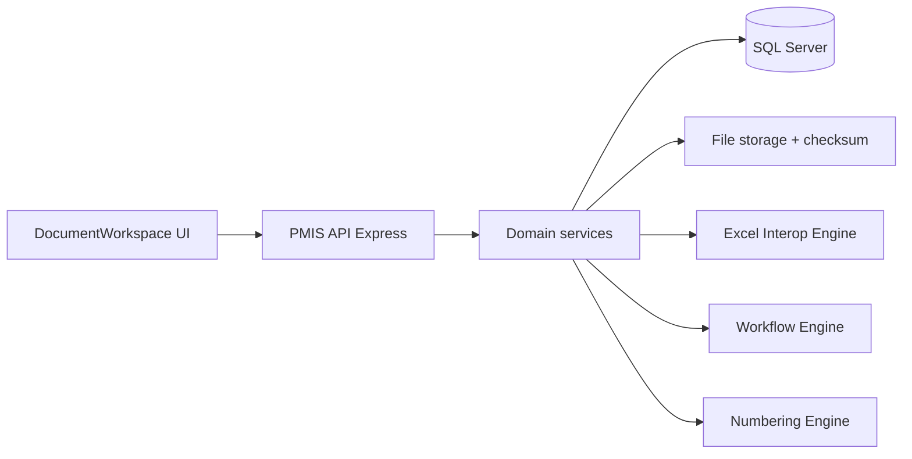
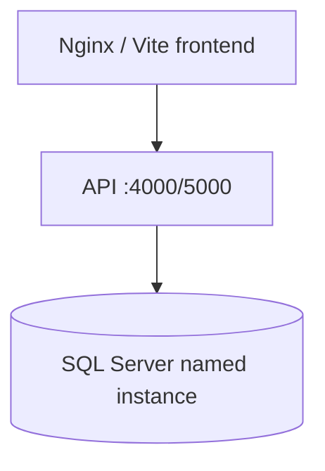

# Deliverable 1 — معماری PIM / EDMS
خلاصه: ماژول مدیریت اطلاعات و مستندات روی PMIS موجود Arena سوار می‌شود؛ منبع حقیقت Database است، Excel فقط ظرف Render.

## لایه‌ها
1. **UI** — React/Vite، همان تم شیشه‌ای و Vazirmatn. صفحه حوزه `d1` = `DocumentWorkspace` + سایدبار داخلی زیرفرآیند.
2. **Application** — سرویس‌های موجود `pmisApiClient` / قرارداد `pmisContract`. مرورگر به SQL وصل نمی‌شود.
3. **Domain** — Document, Revision, File, Numbering, Workflow, Transmittal, Correspondence, ExcelMapping, Knowledge, Audit.
4. **Infrastructure** — Express `server/index.js`، SQL Server، فایل‌استورج، صف آفلاین `syncQueue`.

## Component (Mermaid)

## Deployment

On-prem پیش‌فرض (docker-compose موجود). Cloud همان تصاویر با تعویض connection.

## ماژول‌ها و وابستگی
| ماژول | وابسته به |
|---|---|
| Document Control / MDR | Numbering, File, Audit |
| Revision | Document, File (evidence) |
| Workflow Code 1–4 | Document, RACI, Notification |
| Excel Interop | MappingSchema, Form, File |
| Transmittal | Document, Correspondence |
| Knowledge | Document (اختیاری) |
| Search/OCR | File, موجود `tesseract` در API |

## ADR
1. **Excel ظرف است نه SoT** — جلوگیری از چندنسخه‌ای سایت.
2. **Monolith modular نه microservice در MVP** — تیم و استقرار فعلی Express+SQL.
3. **شماره با sequence قفل‌شده در DB** — جلوگیری از Race.
4. **سایدبار اصلی تغییر نکند** — زیرفرآیندهای جدید فقط صفحه حوزه d1.
5. **آفلاین از طریق syncQueue** — سایت بدون اینترنت.

## Self-Validation D1
- Loop1 Completeness: پوشش ۱۰ حوزه از طریق نوع سند/لینک به ماژول‌های دیگر PMIS — بله در مدل مفهومی؛ ثبت ۳۳ سند PMBOK در D2.
- Offline, Bilingual, Audit, Baseline, Transmittal, Lessons, Comment/Review Code — در معماری دیده شده.
- Loop2: نام‌ها با D2 هم‌تراز می‌شوند.
- Loop3: SQL Server عملی است؛ Excel با `xlsx` موجود؛ MVP ۶–۸ هفته شدنی با محدوده UI+API نازک.
- Loop4: آپلود از API، نه UI؛ checksum در File؛ rate-limit موجود helmet/express-rate-limit.
- Loop5: Integration/Scope/… از طریق DocumentType و لینک به d2–d6.
- Gap: ویروس‌اسکن هنوز نیست → فاز ۲ ClamAV. PostgreSQL خواستهٔ پرامپت با SQL Server جایگزین شد تا با Arena نشکند.
