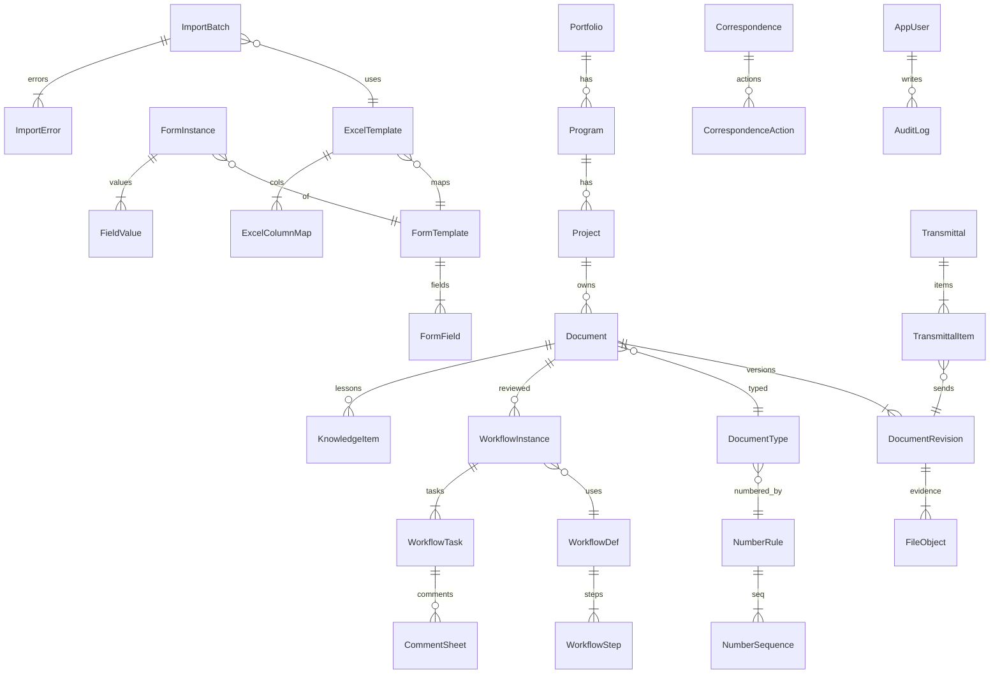

# Deliverable 2 — مدل داده PIM / EDMS
خلاصه: منبع حقیقت SQL Server. Excel فقط Render. فایل اصلی Evidence است.

وضعیت سند (هم‌تراز Workflow):
`Draft | Reserved | Issued | C1 | C2 | C3 | C4 | Approved | IFC | Superseded | Void | Archived`

## ERD

## موجودیت‌ها (حداقلی)

### Portfolio / Program / Project
| Field | Type | Constraint |
|---|---|---|
| Id | uniqueidentifier | PK |
| Code | nvarchar(32) | UNIQUE NOT NULL |
| NameFa / NameEn | nvarchar(256) | NOT NULL |
| ParentId | uniqueidentifier | FK nullable |
| Status | nvarchar(24) | CHECK |

### DocumentType
Id, Code (DR/DS/ISO/LTR/TR/NCR…), NameFa/En, PmbokArea (Integration..Stakeholder), ConfidentialityDefault, NumberRuleId.

حداقل ۳۳ نوع قابل ثبت: Charter, PM Plan, CR, WBS, RTM, Baseline Schedule, Progress, S-Curve, Budget, EVM, Invoice, QA Checklist, NCR, RACI, Assignment, Letter, Transmittal, Report, Risk Register, Response, Contract, RFQ, VendorEval, Stakeholder Register, MDR, Datasheet, Drawing, Spec, MOM, Lesson, Closeout, ITP, MethodStatement. (قابل گسترش)

### Document
Id, ProjectId FK, TypeId FK, DocNumber UNIQUE (project+number), TitleFa/En, Discipline, Confidentiality (Public/Internal/Restricted/Secret), Status, CurrentRevId, BaselineId, WbsId nullable, CreatedBy, CreatedAt, IsOfflinePending bit.

### DocumentRevision
Id, DocumentId, RevCode (Rev-00…), State, IssuedAt, ChecksumSha256, FileId, ChangeNote, ReviewCode nullable, SupersedesRevId.

### FileObject
Id, StoragePath, Mime, Bytes, ChecksumSha256, VirusScanStatus (Pending/Clean/Blocked), OriginalName, UploadedBy, UploadedAt.

### NumberRule / NumberSequence
Rule: Pattern nvarchar (e.g. `{PROJ}-{DISC}-{TYPE}-{SEQ:3}`), ProjectId nullable, TypeId.
Sequence: RuleId + ScopeKey, NextValue int, rowversion / UPDLOCK برای Race.
Reserve: NumberReservation (Number, ExpiresAt, ConsumedByDocumentId).

### FormTemplate / FormField / FormInstance / FieldValue
Field: Name, DataType, Required, ValidationJson.
Value: InstanceId, FieldId, ValueJson nvarchar(max).

### ExcelTemplate / ExcelColumnMap / ImportBatch / ImportError
TemplateVersion int, MappingSchemaJson, HiddenMetaSheet `_META`.
Column: Sheet, CellOrHeader, FieldId, Transform.
Batch: FileId, Status (Validated/Committed/Failed), RowCount.
Error: BatchId, RowNo, Column, Code, MessageFa/En.

### WorkflowDef / WorkflowStep / WorkflowInstance / WorkflowTask / CommentSheet
Step: Seq, Mode (Sequential/Parallel), Role, SlaHours, EscalationRole, ReviewCodes allowed (C1–C4).
Task: Assignee, DueAt, Status, DelegationOf.
Comment: Code, Text, SheetRow.

### Correspondence / Transmittal
LetterNo, Subject, SenderParty, ReceiverParty, DueDate, ActionRequired.
TransmittalNo, Purpose (IFA/IFC/Info), Recipient, AckAt.
Item: TransmittalId, RevisionId.

### Risk / Issue / ChangeRequest / MOM
لینک اختیاری DocumentId. جداول موجود PMIS در صورت وجود reuse می‌شوند.

### Security
AppUser, Role, Permission, UserProjectScope (ABAC: project+discipline+confidentiality).
AuditLog: Id, At, Actor, Action, Entity, EntityId, PayloadJson, PrevHash, Hash (chain).
RetentionPolicy: TypeId, Years, HoldLegal bit.

## ایندکس
- Document (ProjectId, Status) INCLUDE DocNumber
- Document UNIQUE (ProjectId, DocNumber)
- DocumentRevision (DocumentId, RevCode)
- FileObject (ChecksumSha256)
- WorkflowTask (Assignee, Status, DueAt)
- Correspondence (ProjectId, DueDate) WHERE ActionRequired=1
- Full-text: Document.TitleFa, TitleEn, CommentSheet.Text (SQL FTS)
- ImportError (BatchId, RowNo)

## Performance
۵۰k سند/پروژه: صفحه‌بندی اجباری؛ MDR view مادّی‌نشده با فیلتر Project+Discipline؛ فایل خارج از SQL (path+checksum).

## Self-Validation D2
- Loop1: ۱۰ حوزه از PmbokArea روی DocumentType؛ ۳۳ نوع فهرست شد؛ Excel A/B/C جداول دارد؛ Offline flag؛ Fa/En؛ Audit chain؛ BaselineId؛ Transmittal؛ Lessons؛ CommentSheet+ReviewCode.
- Loop2: Status با D1 یکی است؛ Role در Step با RBAC در D6؛ DocumentType با NumberRule یکی است؛ MappingSchema با FormField؛ ImportError با Validation؛ Notification بعداً روی Task.Due.
- Loop3: SQL Server + nvarchar(max) JSON به‌جای JSONB؛ xlsx موجود؛ FTS برای ۵۰k قابل قبول با ایندکس؛ Number UPDLOCK.
- Loop4: checksum؛ IDOR با Project scope در API (D8)؛ virus scan فیلد دارد پیاده‌سازی فاز۲.
- Loop5: هر حوزه PMBOK حداقل یک DocumentType.
- Gap بسته‌شده نسبت به D1: فهرست ۳۳ نوع. باقی: ویروس‌اسکن عملیاتی.
