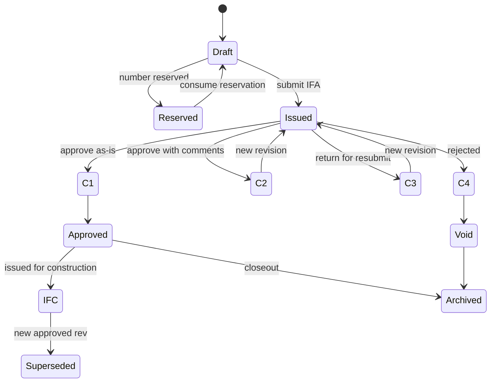
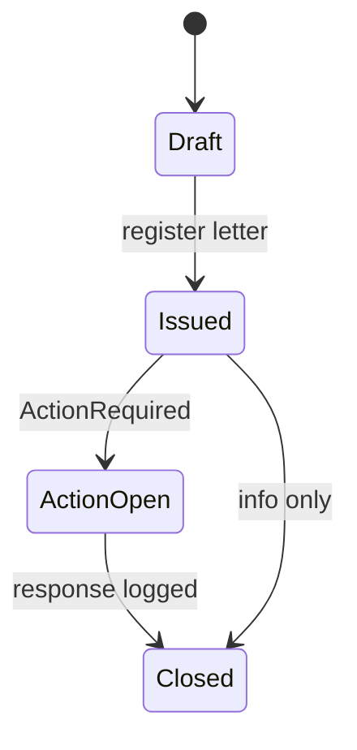
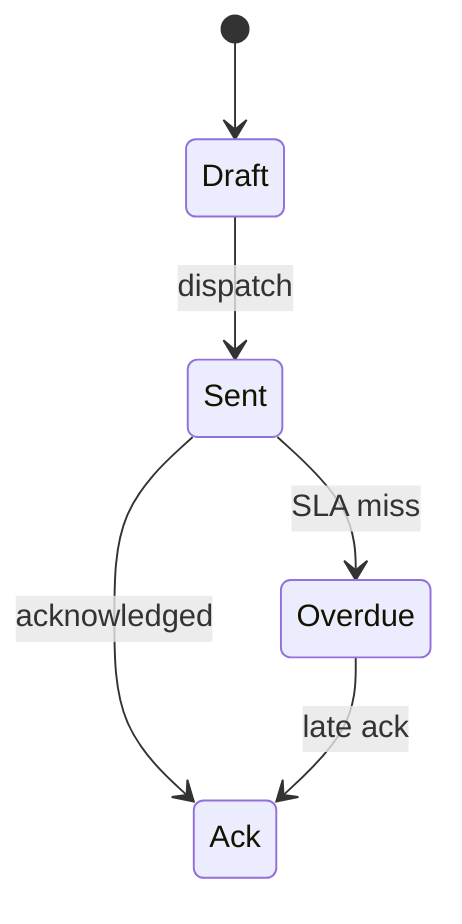

# Deliverable 5 — Workflow Engine
خلاصه: گردش کار پیکربندی‌پذیر است (نه هاردکد). وضعیت سند با D2 یکی است. Review Code 1–4، SLA، تشدید، موازی/متوالی، تفویض.

Entity: WorkflowDef, WorkflowStep, WorkflowInstance, WorkflowTask, CommentSheet.

---

## ماشین وضعیت (سند مهندسی)

کدها: C1 Approved / C2 Approved with comments / C3 Revise & resubmit / C4 Rejected.

---

## RACI پیکربندی‌پذیر
هر WorkflowStep: Role + RACI (R/A/C/I) + Discipline اختیاری.

نمونه IFA نقشه:
| Step | Role | RACI | SLA |
|---|---|---|---|
| 1 Submit | Originator (Designer) | R | 8h |
| 2 Check | Lead Discipline | A | 24h |
| 3 Review | Consultant | A | 36h |
| 4 Approve | PMC / Client | A | 48h |
| Info | Document Control | I | — |

تغییر RACI بدون تغییر کد؛ فقط WorkflowDef نسخه جدید.

---

## SLA و Escalation
DueAt = Task.CreatedAt + Step.SlaHours (تقویم کاری پروژه، نه ۲۴×۷ خام).
اگر DueAt گذشت و Status != Done:
1. T+0: نوتیف Assignee
2. T+Sla: نوتیف Assignee + Lead
3. T+Sla+EscalationHours: Task به EscalationRole؛ Audit `WF_ESCALATED`

ساعت کاری در SystemSettings؛ تعطیلات تقویم پروژه.

---

## Parallel و Sequential
Step.Mode:
- Sequential: step N بعد از Done شدن N-1
- Parallel: چند Task همزمان؛ Join = All (پیش‌فرض) یا Any برای اطلاع

خطا: Join All و یک Task C4 → Instance = C4، بقیه Cancel `WF_SHORT_CIRCUIT`.

---

## Delegation / Proxy
کاربر می‌تواند در بازه زمانی Proxy بگذارد (UserProxy: From, To, Start, End).
Task جدید به Proxy می‌رود؛ Audit Actor = Proxy on behalf Of.
تفویض تک‌تسک: DelegationOf روی WorkflowTask.
منع: Proxy زنجیره‌ای بیش از یک سطح.

---

## Notification Triggers
| Event | گیرنده |
|---|---|
| TASK_ASSIGNED | Assignee |
| TASK_DUE_SOON | Assignee (T-4h) |
| TASK_OVERDUE | Assignee + Lead |
| WF_ESCALATED | EscalationRole |
| CODE_POSTED | Originator + DC |
| TRANSMITTAL_SENT | Recipient |
| RESERVE_EXPIRING | DC |

کانال: درون‌برنامه (موجود NotificationOps) + ایمیل nodemailer در API. سایت آفلاین: در syncQueue می‌ماند.

---

## سه فرآیند — State

**1. مدرک مهندسی (بالا).**

**2. نامه اقدام‌دار**

**3. ترانسمیتال**

CommentSheet روی Task مهندسی اجباری اگر Code = C2 یا C3.

---

## Self-Validation D5
Loop1: Review Code و CommentSheet ✓ Transmittal و نامه ✓ Audit روی escalate ✓  
Loop2: Status با D2 یکی ✓ Role با RBAC D6 (نام‌های DC, Lead, Consultant, PMC) ✓ Notification با Step ✓  
Loop3: موتور جدول‌محور است نه گراف سنگین — برای MVP کافی ✓  
Loop4: تغییر وضعیت فقط Assignee/Proxy؛ IDOR Task.ProjectId  
Loop5: Quality NCR می‌تواند Def جدا با همان موتور داشته باشد  

Gap: تقویم کاری واقعی هنوز در SystemSettings کامل نیست — پیش‌فرض ساعت کاری ۸–۱۶ تا فاز ۲.
