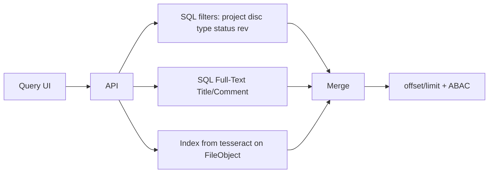

# Deliverable 7 — جستجو و گزارش‌گیری
خلاصه: جستجوی Faceted + Full-Text + OCR. ۱۵ گزارش استاندارد با صفحه‌بندی. KPI: Cycle Time، Rejection Rate، S-Curve MDR. وایرفریم متنی داشبورد = همان صفحه d1 Overview (بدون تغییر فونت پوسته).

---

## معماری جستجو

ایندکس از D2. OCR ناهمگام بعد از آپلود؛ تا Ready فقط متادیتا.

Facetها: Project, Discipline, Type, Status, ReviewCode, Date range, Confidentiality (در حد clearance).
Query خالی = فقط Facet. کاراکتر خاص parameterized.

آفلاین: جستجوی local cache همان فیلترها روی MDR syncشده.

---

## ۱۵ گزارش استاندارد
همه: فیلتر پروژه اجباری، صفحه‌بندی، خروجی Excel ظرف از D3.

| # | گزارش | فیلدهای کلیدی |
|---|---|---|
| 1 | MDR Status | DocNumber, Title, Disc, Rev, Status, Code, Updated |
| 2 | Revision History | DocNumber, FromRev, ToRev, ChangeNote, File checksum |
| 3 | Overdue Review | Task, Assignee, DueAt, SlaBreachHours |
| 4 | Review Code Register | Doc, C1–C4 count, CommentSheet |
| 5 | Transmittal Register | TR No, Purpose, Recipient, DocCount, Ack |
| 6 | Correspondence Action | LetterNo, Subject, Due, Owner, Closed |
| 7 | Number Reservation | Number, ExpiresAt, Consumed |
| 8 | Import Batch Errors | Batch, Row, Column, Code, Message |
| 9 | Workflow Cycle Time | DocType, AvgHours Submit→Approved |
| 10 | Rejection Rate | Type, Disc, C3+C4 / Issued |
| 11 | MDR S-Curve | Week, PlannedIFA, ActualApproved |
| 12 | IFC Register | Doc, IFC date, BaselineId |
| 13 | Lessons Learned | Title, Category, Impact |
| 14 | Audit Trail | Actor, Action, Entity, Hash |
| 15 | Confidentiality Access | Secret/Restricted views by user (admin) |

---

## KPI
- **Cycle Time** = میانگین ساعت Issued → C1/Approved (تقویم کاری D5)
- **Rejection Rate** = (C3+C4) / Issued در دوره
- **MDR S-Curve** = تجمعی Planned vs Approved
- **SLA Breach %** = Task overdue / Task due
هدف نمونه: Cycle ≤ 72h، Reject ≤ 15%، Breach ≤ 10%

---

## وایرفریم داشبورد (متنی)
ردیف ۱: چهار کارت Cycle / Reject / MDR count / Breach — کلاس‌های موجود glass-dark، tx1، رنگ accent حوزه d1.
ردیف ۲: ستون‌های S-Curve (نمونه فعلی UI).
ردیف ۳: جدول Overdue از گزارش 3.
سایدبار داخلی صفحه بعد: زیرفرآیندهای EDMS… — سایدبار اصلی برنامه دست نخورده.

---

## Self-Validation D7
Loop1: ۱۵ گزارش ✓ KPI خواسته‌شده ✓ OCR ✓ آفلاین cache ✓ Fa/En ستون‌ها ✓ Transmittal/Lessons/Audit ✓  
Loop2: Status/Code با D2/D5 ✓ فیلد گزارش با Entity D2 ✓  
Loop3: FTS+صفحه‌بندی برای ۵۰k ✓ بدون گزارش بی‌فیلتر ✓  
Loop4: ABAC روی هر query؛ Audit report فقط audit.view ✓  
Loop5: گزارش‌ها Integration تا Stakeholder را از Type پوشش می‌دهند  

Gap: ایندکس OCR پروداکشن هنوز Job است نه زنده.
