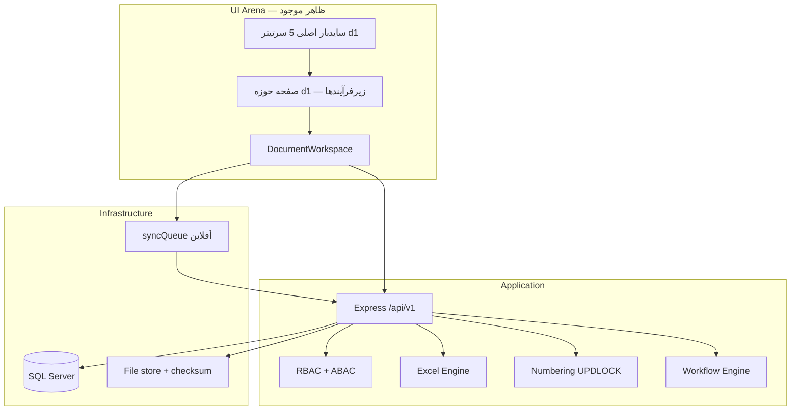
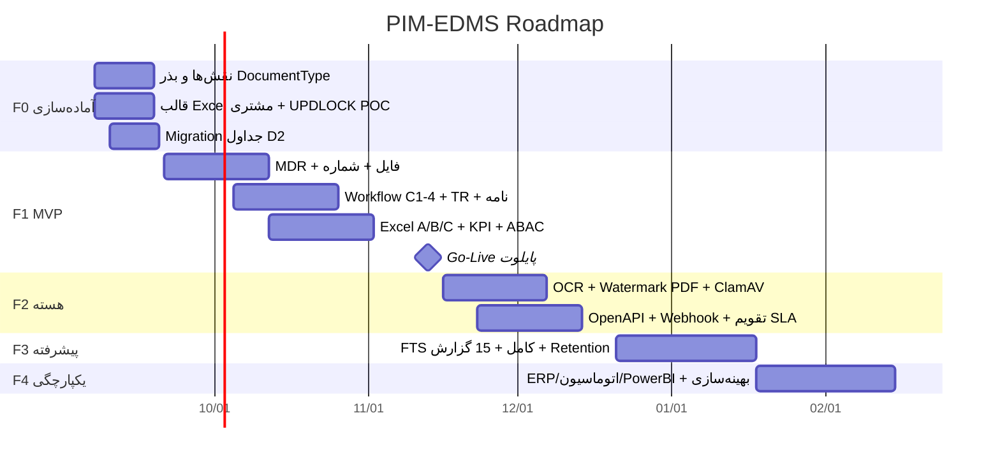

# گزارش نهایی کیفیت و خلاصه اجرایی
## ماژول مدیریت اطلاعات و مستندات پروژه (PIM / EDMS)
نسخه: 1.0 | تاریخ: 2026-09-04 | وضعیت طراحی: D1–D9 تأیید شده | وضعیت ساخت: UI پوسته d1 + API موجود PMIS (ناقص نسبت به طراحی)

این سند خودکفا است و مبنای تصمیم شروع پیاده‌سازی و تخصیص بودجه است.

اصل طلایی: **فایل Excel ظرف است نه منبع حقیقت. داده در Database؛ فایل اصلی Evidence.**

ظاهر سایدبار اصلی Arena تغییر نمی‌کند؛ قابلیت‌های جدید فقط در صفحه حوزه d1.

---

# بخش ۱ — اعتبارسنجی جامع (Cross-Deliverable)

## ۱.۱ پنج Loop روی کل طراحی

### Loop 1 — Completeness
| مورد | وضعیت |
|---|---|
| ۱۰ حوزه دانش PMBOK از طریق DocumentType.PmbokArea | پوشش طراحی |
| ۳۳ نوع سند قابل ثبت | فهرست D2؛ همه در UI فاز1 اجباری نیست |
| Excel سناریو A/B/C | طراحی کامل؛ Commit واقعی ساخته نشده |
| آفلاین | syncQueue + قالب نسخه‌دار |
| دوزبانه | Bi/Fa-En در UI و پیام API |
| Audit Trail | جدول + طرح hash chain؛ verify job نیست |
| Baseline / Configuration | Document.BaselineId |
| Transmittal و Distribution | مدل + API |
| Lessons Learned و Archive | مدل + API + وضعیت Archived |
| Comment Sheet و Review Code C1–C4 | D5 + D2 |

نتیجه Loop1: **طراحی کامل است؛ پیاده‌سازی MVP ناقص است (عمدی).**

### Loop 2 — Consistency
نگاه کنید بخش ۱.۲.

### Loop 3 — Feasibility
SQL Server (نه PostgreSQL) به‌خاطر Arena. Excel با `xlsx`. FTS+صفحه‌بندی برای ۵۰k قابل قبول. WF جدول‌محور. MVP ۶–۸ هفته با برش D9. Race شماره با UPDLOCK. فایل خارج از DB.

### Loop 4 — Security
Upload از API، MIME/size موجود. SQL parameterized. IDOR با ABAC. محرمانگی در لایه API. Audit append-only. Checksum. Rate limit. ویروس‌اسکن **نیست**.

### Loop 5 — PMBOK
Integration تا Stakeholder از DocumentType؛ گردش مهندسی روی C1–4؛ نامه/ترانسمیتال Communications؛ NCR Quality.

## ۱.۲ Cross-Deliverable Consistency

| پرسش | حکم | توضیح |
|---|---|---|
| Entity D2 = API D8؟ | **عمدتاً بله** | Document, Revision, File, Reservation, Transmittal, Correspondence, Lesson, Excel batch, Workflow task، Search/Report/Audit هم‌نام‌اند. **کمبود API:** FormTemplate/Field/Instance، NumberSequence (داخلی)، RetentionPolicy، WebhookDelivery، UserProxy، WorkflowDef CRUD کامل |
| WF D5 = Role D6؟ | **بله** | document_controller, discipline_lead, consultant, pmc, originator با Step.Role یکی است. Gap: RoleCode فعلی Arena فقط admin/PM/planner |
| MVP D9 با معماری D1؟ | **بله** | همان Express+SQL+UI شیشه‌ای؛ بدون microservice |
| KPI D7 از داده D2؟ | **بله** | Cycle از WorkflowTask/IssuedAt+Act؛ Reject از ReviewCode C3/C4؛ S-Curve از Revision/Approved؛ SLA از Task.DueAt |
| Excel D3 با مدل D2؟ | **بله** | ExcelTemplate, ExcelColumnMap, ImportBatch, ImportError, Form*, FileObject, `_META` |
| Numbering D4 با DocumentType D2؟ | **بله** | TYPE=DocumentType.Code؛ Rule.NumberRuleId روی Type |

ناسازگاری جزئی: D8 «۳۶ endpoint» در برابر وعده «حداقل ۳۰» — کافی است اما Form/Webhook/Proxy جدا نیستند.

---

# بخش ۲ — Gap Analysis

| # | شرح مشکل | تأثیر | Deliverableها | راه‌حل | تخمین اصلاح |
|---|---|---|---|---|---|
| G1 | ویروس‌اسکن فایل نیست | H | D1,D2,D6,D9 | فاز2 ClamAV روی صف آپلود؛ تا آن موقع MIME+size+checksum | 1 هفته |
| G2 | OCR ایندکس زنده نیست | M | D7,D9 | Job tesseract موجود در API پس از آپلود | 1–1.5 هفته |
| G3 | Job صحت hash chain نیست | M | D6 | سرویس nightly Verify | 3 روز |
| G4 | OpenAPI/Swagger نیست | M | D8 | تولید از لیست D8 در فاز2 | 3 روز |
| G5 | تقویم کاری SLA ناقص | M | D5 | تقویم ۸–۱۶ در Settings؛ تعطیلات فاز2 | 4 روز |
| G6 | RoleCode EDMS در AuthContext نیست | H | D6,D5,App | گسترش نقش بدون تغییر ظاهر هدر | 3–5 روز |
| G7 | Cron انقضای رزرو شماره نیست | M | D4 | Job هر ساعت؛ SEQ عقب نرود | 2 روز |
| G8 | Excel Commit واقعی به SQL نیست | H | D3,UI | پیاده‌سازی Parser روی server طبق D3 | 2 هفته |
| G9 | API فرم/پروکسی/Webhook/Retention ناقص | M | D2,D8 | افزودن endpoint در فاز2 | 1 هفته |
| G10 | PostgreSQL پرامپت اولیه ≠ SQL Server | L | D1 | تصمیم ADR آگاهانه؛ کارگاه بیشتر لازم نیست | — |
| G11 | Watermark PDF واقعی | M | D6,D9 | فاز2 کتابخانه PDF؛ MVP هدر/نام | 1 هفته |
| G12 | ۳۳ نوع سند همه در UI نیستند | L | D2,D9 | بذر داده SQL در F0؛ UI تدریجی | 2 روز |
| G13 | تست E2E Playwright برای d1 نیست | M | D9 | موارد بخش ۴ | 1 هفته |
| G14 | همگامی پورت API 4000 در مقابل 5000 | L | infra | یک منبع حقیقت `.env` | 0.5 روز |

هیچ Gapی معماری را باطل نمی‌کند. G1/G6/G8 باید قبل یا حین MVP بسته شوند.

---

# بخش ۳ — خلاصه اجرایی

## الف) معرفی ماژول

ماژول PIM/EDMS لایه رسمی اطلاعات و مدارک پروژه در سامانه Arena است برای پروژه‌های EPC، نفت و گاز، پتروشیمی و عمرانی. هدف: یک منبع حقیقت در پایگاه‌داده برای MDR، نسخه، گردش تأیید Code 1–4، ترانسمیتال، مکاتبات، شماره‌گذاری و دانش پروژه؛ در حالی که Excel فقط ظرف ورود/خروج باقی می‌ماند و فایل اصلی به‌عنوان Evidence نگه داشته می‌شود.

ارزش سازمان: حذف چندنسخه‌ای سایت و دفتر مرکزی، کاهش چرخه تأیید، قابلیت حسابرسی، آمادگی ادعا و تطبیق با PMBOK/ISO بدون اجبار به تعویض فوری فرآیندهای Excel فعلی. کاربران سایت می‌توانند آفلاین کار کنند و بعد همگام شوند.

## ب) معماری نهایی

جریان داده (۵ خط):
1. کاربر از سایدبار اصلی وارد حوزه می‌شود (صنعت/پروژه).
2. زیرفرآیند صفحه بعد، کار را به API می‌فرستد نه به SQL مرورگر.
3. شماره و وضعیت در تراکنش قفل‌شده نوشته می‌شود؛ فایل جدا ذخیره و checksum می‌گیرد.
4. Excel اگر بیاید Parse/Validate می‌شود و فقط پس از موفقیت Commit می‌گردد.
5. خواندن گزارش/KPI از همان جداول با فیلتر ABAC و صفحه‌بندی است.

## ج) لیست جداول DB (نام‌ها)

**سازمان:** Portfolio, Program, Project  
**مدرک:** DocumentType, Document, DocumentRevision, FileObject  
**شماره:** NumberRule, NumberSequence, NumberReservation  
**فرم/اکسل:** FormTemplate, FormField, FormInstance, FieldValue, ExcelTemplate, ExcelColumnMap, ImportBatch, ImportError  
**گردش کار:** WorkflowDef, WorkflowStep, WorkflowInstance, WorkflowTask, CommentSheet, UserProxy  
**ارتباطات:** Correspondence, CorrespondenceAction, Transmittal, TransmittalItem  
**دانش/تغییر (لینک):** KnowledgeItem, RiskLink, IssueLink, ChangeRequestLink, MomLink  
**امنیت:** AppUser, Role, Permission, RolePermission, UserProjectScope, AuditLog, RetentionPolicy, WebhookEndpoint, WebhookDelivery  

**تعداد: ۳۶ جدول** (لینک‌های Risk/Issue/CR/MOM در صورت reuse جداول موجود PMIS ادغام می‌شوند — نیاز به کارگاه بیشتر با صاحب داده فعلی.)

## د) API Endpoints (Method + Path)

**Documents:**  
GET `/projects/:projectId/documents` · GET `/documents/:id` · POST `/projects/:projectId/documents` · PATCH `/documents/:id` · POST `/documents/:id/issue` · GET `/documents/:id/revisions` · POST `/documents/:id/revisions` · GET `/revisions/:id/file` · GET `/revisions/:id/file/raw`

**Numbering:**  
GET `/projects/:projectId/number-rules` · POST `/projects/:projectId/number-rules` · POST `/number-rules/:id/reserve` · POST `/reservations/:id/consume` · POST `/reservations/:id/cancel`

**Workflow:**  
GET `/workflow-defs` · POST `/documents/:id/workflow/start` · GET `/workflow-instances/:id` · POST `/workflow-tasks/:id/act` · POST `/workflow-tasks/:id/delegate` · GET `/me/tasks`

**Excel:**  
POST `/excel/templates` · POST `/excel/templates/:id/import` · GET `/excel/batches/:id` · GET `/excel/batches/:id/errors` · POST `/excel/export`

**TR / نامه / دانش:**  
GET+POST `/projects/:projectId/transmittals` · POST `/transmittals/:id/ack` · GET+POST `/projects/:projectId/correspondence` · GET+POST `/projects/:projectId/lessons`

**Search / Reports / Audit:**  
GET `/projects/:projectId/search` · GET `/projects/:projectId/reports/:reportKey` · GET `/projects/:projectId/kpis` · GET `/audit`

**تعداد مستندشده: ۳۶**  
کمبود نسبت به مدل (فاز2): Form CRUD، Proxy، Webhook admin، Retention — حدود +۱۰.

## ه) MVP Scope

**In Scope:** MDR، رزرو/مصرف شماره، Revision+checksum، WF C1–4 ساده، ترانسمیتال، نامه، Lessons، Excel A/B/C، جستجوی facet، ۴ KPI، ABAC پایه، Audit insert، UI صفحه d1 بدون تغییر سایدبار اصلی، دوزبانه، صف آفلاین.

**Out of Scope:** OCR، ClamAV، Watermark PDF کامل، تقویم تعطیلات، OpenAPI، microservice، PostgreSQL، ۱۵ گزارش کامل، تغییر فونت/تم سراسری، InnovativeWorkspace.

**DoD:** AC داستان‌ها؛ ABAC روی API؛ خطای دوزبانه؛ ظاهر سراسری سالم؛ Audit روی create/issue/act/import؛ تست Race شماره + import خطا + IDOR.

**زمان MVP:** ۶–۸ هفته (حدود ۱۰۸ SP / ۲ توسعه‌دهنده).

## و) Risk Register طراحی

| # | شرح ریسک | احتمال | اثر | امتیاز | پاسخ | مسئول |
|---|---|---|---|---|---|---|
| R1 | مقاومت سایت در برابر ترک Excel به‌عنوان SoT | H | H | H | ظرف Excel عالی + آموزش | PMO |
| R2 | Race شماره در حجم بالا | M | H | H | UPDLOCK + تست بار | Backend |
| R3 | فایل آلوده | M | H | H | ClamAV فاز2؛ تا آن موقع محدودیت MIME | Sec |
| R4 | حجم ۵۰k سند کندی MDR | M | M | M | ایندکس + صفحه | DBA |
| R5 | ناهماهنگی نقش Arena با EDMS | H | M | H | گسترش Role زود در F0 | Tech Lead |
| R6 | Round-trip خراب شدن قالب سازمانی | M | H | H | فقط سلول mapped؛ تست روی قالب واقعی مشتری | BA+Dev |
| R7 | قطع اینترنت سایت | H | M | M | syncQueue؛ رزرو از قبل | App |
| R8 | IDOR با حدس UUID | M | H | H | ABAC اجباری تست E2E | Sec |
| R9 | تأخیر تأیید مشاور خارج SLA | H | M | M | Escalation حتی با تقویم ساده | DC |
| R10 | کمبود مالک فرآیند Document Control | M | H | H | تعیین DC قبل از Go-Live | Sponsor |
| R11 | پورت/ENV اشتباه استقرار | M | L | L | یک `.env` و runbook | DevOps |
| R12 | تغییر ظاهر ناخواسته | L | H | M | ممنوعیت تغییر index.css در DoD | UI |

## ز) تخمین منابع

**تیم:** Tech Lead 0.5 · Backend 1 · Frontend 1 · DBA 0.25 · QA 0.5 · BA/Document Control 0.5 · DevOps 0.25  

**زمان کل طراحی+MVP+فاز2 هسته:** حدود ۱۶–۱۸ هفته از F0 تا پایان F2. فقط MVP: ۶–۸ هفته.

**Milestone تقریبی (از 2026-09-07):**
- F0 آماده: 2026-09-18
- MVP Demo داخلی: 2026-10-30
- MVP Go-Live محدود یک پروژه: 2026-11-13
- F2 هسته (OCR/ویروس/OpenAPI): 2026-12-18

**نفر-ساعت:** MVP ≈ 2 dev × 7 w × 32 h ≈ **۴۵۰h** + QA/BA ≈ **۶۲۰h** کل فاز1. فاز2 ≈ +۲۸۰h. بودجه برنامه‌ریزی: **~۹۰۰ نفر-ساعت تا پایان F2** (بدون هزینه لایسنس SQL).

نیاز به کارگاه بیشتر: نرخ نفر-ساعت ریالی/دلاری سازمان.

## ح) توصیه‌های کلیدی موفقیت (اولویت)

1. **G6 نقش‌ها را در هفته اول ببندید** وگرنه WF روی نقش‌های فعلی می‌شکند.  
2. **یک پروژه پایلوت و یک DC واقعی** قبل از توسعه گسترده.  
3. **قالب Excel واقعی مشتری را در F0 بگیرید** و تست Round-trip همان فایل.  
4. **DoD ظاهر:** هیچ PR نباید `index.css` / سایدبار اصلی را برای آیتم جدید لمس کند.  
5. **شماره را از روز اول در SQL قفل کنید** نه در UI.  
6. **Excel را هرگز SoT نکنید** در آموزش و در کد.  
7. **ABAC را با تست IDOR سبز کنید** قبل از Go-Live.  

**CSF:** حمایت Sponsor، حضور Document Control، قالب MDR استاندارد، SQL در دسترس، عدم تغییر پوسته محصول.

---

# بخش ۴ — بسته تحویل (Handover)

## مستندات فنی (موجود)
- `docs/PIM_DMS_D1_Architecture.md`
- `docs/PIM_DMS_D2_DataModel.md`
- `docs/PIM_DMS_D3_ExcelInterop.md`
- `docs/PIM_DMS_D4_Numbering.md`
- `docs/PIM_DMS_D5_Workflow.md`
- `docs/PIM_DMS_D6_Security.md`
- `docs/PIM_DMS_D7_SearchReports.md`
- `docs/PIM_DMS_D8_API.md`
- `docs/PIM_DMS_D9_MVP.md`
- این گزارش: `docs/PIM_DMS_FINAL_QUALITY_REPORT.md`
- `BASELINE.md` پروژه Arena

## نمودارها
معماری D1، ERD D2، State WF D5 (۳ فرآیند)، جستجو D7، معماری اجرایی این سند، گانت بخش ۵. حدود **۸ نمودار Mermaid**.

## اسکریپت DB
هنوز Migration PIM جدا از `pmisSchema.ts` **تولید نشده** — باید F0 از روی D2 ساخته شود. نیاز به کارگاه بیشتر با DBA برای ادغام با اسکیمای فعلی.

## نمونه کد موجود
- UI: `src/components/DocumentWorkspace.tsx`, `ModuleDetail.tsx` (d1)
- صف: `src/services/syncQueue.ts`
- API کلی: `server/index.js` (هنوز مسیرهای D8 کامل نیست)
- Excel lib: وابستگی `xlsx`

## Test Cases پیشنهادی
- **Unit:** pad SEQ، validateCell MappingSchema، hash chain append  
- **Integration:** reserve همزمان دو تراکنش؛ import با DUP_BATCH؛ act بدون comment برای C2 → 400  
- **E2E Playwright:** ورود حوزه d1؛ سایدبار اصلی بدون آیتم اکسل؛ ثبت MDR؛ 403 پروژه غریبه  

## Onboarding توسعه‌دهنده
1. خواندن BASELINE + این گزارش  
2. `npm ci` فرانت و `server`  
3. قانون: Excel ظرف است؛ CSS سراسری دست نزن  
4. نقش‌ها را از D6 پیاده کن نه از حدس  

## استقرار
docker-compose موجود (frontend/api/db). یکسان‌سازی PORT 4000/5000. `server/.env` نمونه. Nginx برای فرانت.

## اپراتور / DBA
پشتیبان SQL + فایل‌استورج هم‌زمان. ایندکس‌های D2. Jobهای فاز2: virus, OCR, reserve expiry, audit verify. Retention را بدون LegalHold اجرا نکن.

---

# بخش ۵ — نقشه راه

---

# بخش ۶ — KPI موفقیت ماژول

**فنی:** p95 جستجوی MDR < 1.5s روی ۵۰k؛ آپلود خطا < 1%؛ Uptime API ≥ 99.5% پایلوت؛ صفر شماره تکراری؛ صفر IDOR در تست.  
**کاربری:** ≥ 70% مدارک جدید پایلوت از UI/API نه از فایل رها؛ Time-to-first-MDR < 1 روز آموزش؛ Adoption DC روزانه فعال.  
**کسب‌وکار:** کاهش Cycle Time نسبت به خط مبنا Excel (هدف −30% در 90 روز)؛ Rejection قابل اندازه‌گیری؛ زمان تهیه ترانسمیتال −50%؛ آمادگی ادعا با Evidence checksum.

خط مبنا Cycle/Reject امروز **نیاز به کارگاه بیشتر با Document Control پروژه پایلوت** دارد.

---

## حکم اجرایی
طراحی برای شروع پیاده‌سازی **کافی و سازگار** است. قبل از بودجه کامل F3/F4، پایلوت F1 را روی یک پروژه واقعی با DC مستقر کنید. سه قفل: نقش‌ها (G6)، Excel Commit (G8)، امنیت آپلود (G1).
