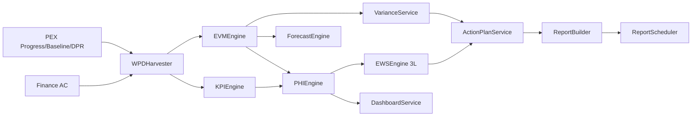

# PMA/MON D1 — تحلیل وضعیت موجود و معماری بازطراحی

**خلاصه ۳ خطی:** ماژول پایش (d3) در شِل هست اما EVM/KPI/هشدار/اکشن بیشتر نمایشی‌اند. بازطراحی = لایه موتور + جداول جدید با **حفظ نام SQL موجود** از طریق View. **سایدبار اصلی تغییر نمی‌کند**؛ صفحات فقط داخل دامنه d3 پس از صنعت/پروژه.

---

## ۱) Gap Analysis — زیرماژول‌های فعلی

منبع: `framework.ts` دامنه d3 + کامپوننت‌های موجود. وضعیت نسبت به PMA 5.0.

| id فعلی | عنوان | فایل مرتبط | وضعیت | توضیح |
|---|---|---|---|---|
| d3-p1 | KPI | MonitoringWorkspace (کارت KPI تجمیعی) | ناقص | عدد نمونه؛ بدون کاتالوگ ۲۷، Weight، Scorecard |
| d3-p2 | EVM PV/EV/AC | EarnedValueCalculator (~72 خط) | ناقص | ماشین‌حساب ساده؛ بدون ES/SPI(t)، ۵ روش EAC، Snapshot |
| d3-p3 | انحراف | MonitoringWorkspace MergeRow | ناقص | متن ثابت؛ بدون VAR/RCA/Severity |
| d3-p4 | هشدار زودهنگام | AlertsWorkspace / NotificationOpsPanel | ناقص | لیست UI؛ بدون ۳ لایه، ۲۱ قاعده، Escalation |
| d3-p5 | اکشن‌پلن ۱/۲/۳ ماهه | ActionPlan.tsx (~561) | موجود/ناقص | UI کارگاهی؛ بدون Rolling/CarryOver/Recovery/۵ سطح |
| d3-p6 | گزارش مدیریتی زنده | MonitoringWorkspace + PeriodicReportWorkspace + AnalyticsReporting | ناقص | ادغام نمایشی؛ بدون ۱۴ نوع، Cron، Lock DataDate |
| — | WPD Harvester | — | ندارد | Progress از PEX باید Harvest شود |
| — | PHI | — | ندارد | فقط SPI/CPI جدا |
| — | Forecast ۵×۴ | — | ندارد | |
| — | داشبورد ۴ نقش | PmbokRing / Portfolio | ناقص | نقش Site/PM/PMO/Exec جدا نیست |
| — | Excel Interop پایش | — | ندارد | PIM/PEX ظرف دارند؛ MON نه |

**SQL نام‌های موجود (حفظ):** `KPI_Master`, `KPI_Value`, `EVM_Transaction`, `Variance_Log`, `Alert_Register`, `Action_Plan`, `Action_Item`, `Weekly_Report`, `Monthly_Report`.

**Backward Compatibility Risks:** تغییر نام جدول بدون View → شکست گزارش‌های قدیمی؛ افزودن آیتم به RightSidebar → رد کاربر؛ بازنویسی ActionPlan.tsx بدون مهاجرت state.

---

## ۲) نقاط ضعف بصری / UX (بهبود لازم ★)

| صفحه | بهبود بصری؟ | کار |
|---|---|---|
| MonitoringWorkspace | بله | KPI strip شیشه + PHI رنگ ≥85/70/<70؛ نه کارت تخت |
| EarnedValueCalculator | بله | جدول PV/EV/AC + اسپارک SPI/CPI؛ حالت Schedule-Only |
| AlertsWorkspace | بله | چیپ شدت + Ack ۲۴س + سطح Escalation |
| ActionPlan.tsx | بله | درخت ۵ سطح + پرچم CarryOver≥2 |
| PeriodicReportWorkspace | بله | انتخاب ۱۴ نوع + Internal/External |
| AnalyticsReporting | بله | همسان‌سازی با شیشه/Vazirmatn (بدون lucide شِل) |
| دامنه d3 داخلی | بله | الگوی PIM/PEX: زیرماژول داخل صفحه |

---

## ۳) معماری بازطراحی (حفظ + اضافه)

**موجود vs جدید**

| لایه | موجود | جدید (اضافه) |
|---|---|---|
| UI شِل | RightSidebar d3 چهار فرآیند | بدون آیتم جدید سایدبار |
| UI داخلی | Monitoring / ActionPlan / Alerts | Planning-like `MonitoringDomainPage` داخل d3 |
| داده | جداول SQL نام‌های بالا | `pma_*` + **VIEW** روی نام قدیمی |
| موتور | ماشین‌حساب EV | WPD, EVM+ES, KPI, PHI, VAR, EWS, Forecast |

**Services:** WPDHarvester, EVMEngine, KPIEngine, PHIEngine, VarianceService, EWSEngine, ActionPlanService, ForecastEngine, ReportBuilder, ReportScheduler, AlertService, DashboardService, ExcelInterop, NotificationService.

---

## ۴) ADR

| ADR | تصمیم | دلیل |
|---|---|---|
| A1 | پیشوند `pma_*` + View سازگار با `KPI_Master`/`EVM_Transaction` | بازطراحی نه بازنویسی |
| A2 | EV فقط از Progress Approved PEX | همسان PEX D1 |
| A3 | Snapshot EVM/PHI Immutable + FormulaVersion | بازتولید |
| A4 | Excel ظرف است | مثل PIM/PEX |
| A5 | سایدبار اصلی دست‌نخورده | دستور کاربر |
| A6 | Schedule-Only اگر AC نباشد | پروژه‌های بدون ERP |
| A7 | Major/Critical VAR بلاک گزارش بدون Action/CR | Closed-Loop |

---

## ۵) Migration Strategy

1. ایجاد `pma_*` در کنار جداول فعلی (فاز F1).
2. View: `EVM_Transaction` → `pma_evm_snapshot` (ستون‌های PV/EV/AC/SPI/CPI).
3. View: `KPI_Master`/`KPI_Value` → تعریف/اندازه‌گیری.
4. View: `Alert_Register` → `pma_alert`.
5. View: `Action_Plan`/`Action_Item` → پلن/آیتم.
6. ETL تاریخی: یک‌بار کپی Snapshot با FormulaVersion=`legacy`.
7. Rollout: UI d3 داخلی اول؛ گزارش‌های قدیمی از View می‌خوانند.
8. Rollback: Drop View جدید، جداول `pma_*` باقی می‌مانند؛ UI به MonitoringWorkspace فعلی برمی‌گردد.

---

## ۶) قابلیت ناقص/نادرست

- SPI/CPI بدون قفل DataDate → گذشته قابل دستکاری.
- KPI بدون ΣWeight=100.
- هشدار بدون de-dup → اسپم.
- اکشن بدون Owner/DueDate در UI فعلی ممکن است.
- ForecastDate مایلستون در PEX = EF؛ MON نباید تاریخ جدا بسازد مگر Forecast Engine سناریو.

---

## ۷) نتیجه ۱۰ Loop (D1)

| Loop | نتیجه D1 |
|---|---|
| 1 PMBOK | پوشش در نقشه سرویس‌ها ثبت شد؛ پیاده‌سازی D3+ |
| 2 EVM | شکاف ES/EAC5/TCPI/Schedule-Only در Gap |
| 3 KPI/PHI | کاتالوگ ۲۷ و PHI در D4–D5 |
| 4 EWS | ۳ لایه در D7 |
| 5 AP | ۵ سطح در D8 |
| 6 Report | ۱۴ نوع در D10 |
| 7 VAR | Closed-loop در D6 |
| 8 Consistency | نام pma_* + View قدیمی |
| 9 Feasibility | F1 چهار هفته: WPD+EVM+KPI+W/BW |
| 10 Redesign | حفظ ساختار/نام؛ بدون سایدبار جدید |

**Gap D1 و حل:** جزئیات فیلد جداول نیست → D2. موتور نیست → D3. UI پیاده نشده عمداً تا دستور.

**وضعیت جداول این مرحله:** همه «طراحی / جدید با View سازگار» — اسکریپت در D2.

منتظر دستور Deliverable 2.
