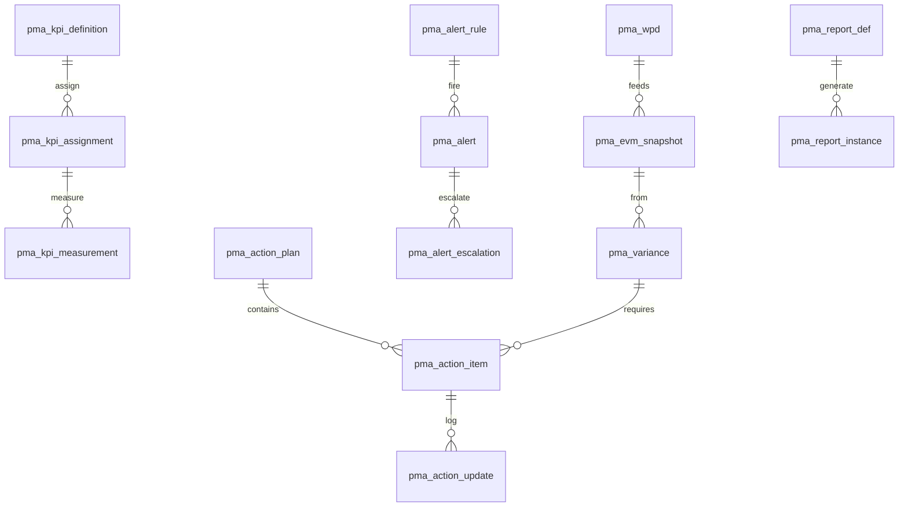

# PMA/MON D2 — مدل داده جامع

**خلاصه ۳ خطی:** جداول عملیاتی با پیشوند `pma_*`؛ نام‌های قدیمی (`KPI_Master`, `EVM_Transaction`, …) به‌صورت **VIEW** باقی می‌مانند. Snapshotهای EVM/PHI/Audit پارتیشن ماهانه و Immutable. سایدبار بدون تغییر.

وضعیت ستون: **موجود** = نام قدیمی حفظ / **بهبود** = ستون اضافه / **جدید**.

---

## ERD



---

## جداول

### WPD — جدید
`pma_wpd` (WorkPerformanceData): id, project_id, data_date, wbs_id, activity_id, source (`PEX_DPR|Timesheet|Manual|Excel`), qty, pct_physical, pct_approved, ac_amount, status (`Draft|Approved|Locked`), locked_at, adjustment jsonb, evidence_dms_id.

Constraint: محاسبات فقط `Approved|Locked`. DataDate پس از Lock تغییر نمی‌کند (Adjustment جدا).

### EVM — بهبود روی EVM_Transaction
`pma_evm_snapshot` **جدید/Immutable** PARTITION BY RANGE (data_date):
id, project_id, level (`Project|CA|WBS|Activity`), ref_id, data_date,
pv, ev, ac, bac, sv, cv, spi, cpi, es, spi_t,
eac_ate, eac_cpi, eac_cpi_spi, eac_weighted, eac_risk,
etc, vac, tcpi_bac, tcpi_eac, finish_forecast, schedule_only bool,
formula_version varchar(16), immutable bool DEFAULT true.

**VIEW موجود:** `CREATE VIEW EVM_Transaction AS SELECT … spi, cpi, pv, ev, ac FROM pma_evm_snapshot WHERE level='Project'`.

### KPI — بهبود KPI_Master / KPI_Value
`pma_kpi_definition` **جدید** (کاتالوگ ۲۷): code UNIQUE, category (14), formula, direction (`HigherBetter|LowerBetter`), unit, target, th_g, th_y, calc_type (`Auto|Manual|Hybrid`), data_source.

`pma_kpi_assignment`: project_id, kpi_id, weight numeric, override jsonb. CHECK per project Σ weight = 100 (trigger).

`pma_kpi_measurement`: assignment_id, period_date, value, status_auto (`G|Y|R`), trend (`Up|Flat|Down`), evidence_dms_id.

**VIEW:** `KPI_Master` ← definition؛ `KPI_Value` ← measurement.

### PHI — جدید
`pma_health_snapshot` Immutable: project_id, data_date, method (`Multi|KpiWeighted`),
score_schedule, cost, quality, hse, risk, claims, total,
band (`Green|Yellow|Red`), trend, formula_version.

وزن پیش‌فرض: 30/25/20/15/10 (+claims 0 یا از 10 ریسک کم شود در D5).

### Variance — بهبود Variance_Log
`pma_variance`: project_id, data_date, kind (`SV|CV|SPI|CPI|Scope|Quality`), severity (`Minor|Moderate|Major|Critical`) generated/auto,
rca_category (۱۱), rca_method (`5Whys|Fishbone|None`), impact jsonb,
status (`Analyze|Recommend|Approve|Track`), action_id, cr_id, alert_id, risk_id.
CHECK: severity in (Major,Critical) → action_id OR cr_id NOT NULL before report lock.

**VIEW:** `Variance_Log`.

### EWS — بهبود Alert_Register
`pma_alert_rule`: expression jsonb, severity, channels jsonb, auto_action, auto_cr, trigger (`OnDataChange|Scheduled|OnReportApproval`).
`pma_alert`: rule_id, status (`New|Ack|InProgress|Resolved|Escalated|Dismissed`), ack_at, dismiss_reason, pm_ack.
`pma_alert_escalation`: level 0–3, at, to_role.
`pma_leading_indicator`, `pma_trend_forecast`, `pma_anomaly`, `pma_early_warning` (Watch→Breach).

De-dup: UNIQUE (rule_id, project_id) WHERE status NOT IN (Resolved,Dismissed).

**VIEW:** `Alert_Register`.

### Action — بهبود Action_Plan / Action_Item
`pma_action_plan`: horizon (`1M|2M|3M`), parent_id, achievement_pct, review_cadence.
`pma_action_item`: source_type, category, priority, owner_id **NOT NULL**, due_date **NOT NULL**, verify_req, verified_by, effectiveness 1–5, carry_over_count, evidence_dms_id.
`pma_action_update`, `pma_action_links`, `pma_recovery_plan`, `pma_plan_rollover`, `pma_action_template`.

**VIEW:** `Action_Plan`, `Action_Item`.

### Forecast — جدید
`pma_forecast`: method (`ATE|CPI|CPI_SPI|Weighted|Risk`), scenario (`Opt|ML|Pess|WithRecovery`), eac, finish_date, recovery_plan_id, formula_version.

### Report — بهبود Weekly_Report / Monthly_Report
`pma_report_def`: code (`RPT-D`…`RPT-ACT`), kind Internal/External, cron, auto_gen.
`pma_report_instance`: data_date **locked on approve**, prev_id, dms_id, format.
`pma_report_section`, `pma_reporting_calendar`.

**VIEW:** `Weekly_Report` ← instances where code=RPT-W؛ `Monthly_Report` ← RPT-M.

### Dashboard — جدید
`pma_dash_config` (role Site/PM/PMO/Exec), `pma_dash_widget`.

### System
`pma_notification_log`, `pma_audit_log` PARTITION RANGE (at) append-only.

---

## Index + Partition + JSONB

- btree: (project_id, data_date) روی snapshot/wpd/measurement/alert.
- GIN: alert_rule.expression, wpd.adjustment, variance.impact.
- PARTITION ماهانه: `pma_evm_snapshot`, `pma_health_snapshot`, `pma_audit_log`.
- REVOKE UPDATE, DELETE روی snapshot و audit.

---

## JSONB
Rule expression، RCA impact، KPI override، WPD adjustment، dash widget layout، recovery extras.

---

## Migration Scripts (مفهومی)

```sql
-- 1 create pma_*
-- 2 INSERT INTO pma_evm_snapshot SELECT ... FROM EVM_Transaction; formula_version='legacy';
-- 3 DROP TABLE EVM_Transaction; CREATE VIEW EVM_Transaction AS SELECT ...;
-- همین برای KPI_*, Variance_Log, Alert_Register, Action_*
```

فایل اجرایی: `db/postgres/pma/migrations/` (V001–V004).

Rollback: rename view → restore table from `_bak`.

---

## UI صفحات (این Deliverable اسکیما است نه UI)

| صفحه | وضعیت | بهبود بصری؟ |
|---|---|---|
| MonitoringWorkspace | بهبود | PHI + قفل DataDate |
| EarnedValueCalculator | بهبود | ES/EAC |
| AlertsWorkspace | بهبود | ۳ لایه |
| ActionPlan | بهبود | ۵ سطح |
| PeriodicReport | بهبود | ۱۴ نوع |
| d3 inner (مثل PEX) | جدید بعداً | زیرماژول داخل صفحه |
| RightSidebar | موجود | **بدون تغییر** |

---

## ۱۰ Loop

1 PMBOK: موجودیت‌ها برای 4.5–13.4 نگاشت شد.  
2 EVM: فیلدهای ES, SPI_t, EAC5, TCPI, schedule_only, formula_version.  
3 KPI/PHI: definition 27 + assignment weight + health snapshot.  
4 EWS: rule/alert/escalation/leading/trend/anomaly/early_warning.  
5 AP: plan/item/update/recovery/rollover/template + NOT NULL owner/due.  
6 Report: def/instance/calendar ۱۴ کد.  
7 VAR: severity + RCA + FK action/cr.  
8 Consistency: pma_* + VIEW نام قدیم.  
9 Perf: پارتیشن ماهانه + GIN.  
10 Redesign: نام قدیم View؛ بدون سایدبار.

**Gap:** کاتالوگ ۲۷ ردیف seed → D4. ۲۱ قاعده seed → D7.

منتظر Deliverable 3.
