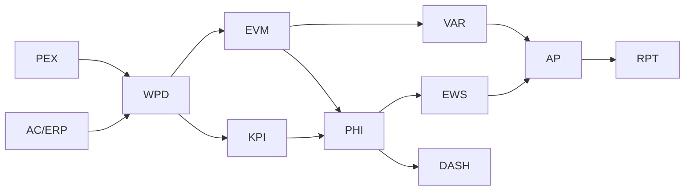
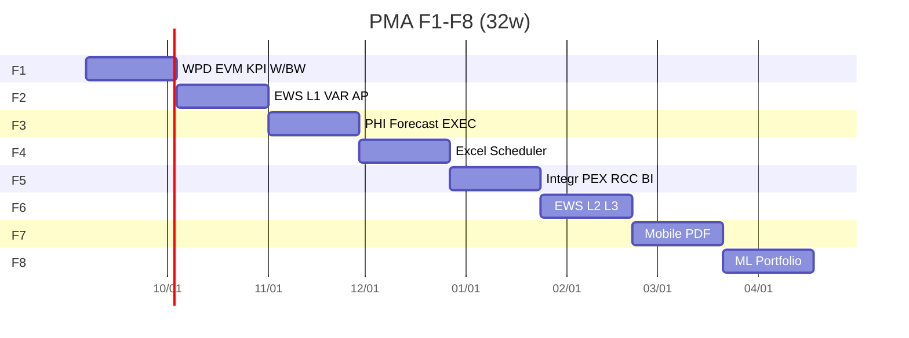

# PMA/MON — گزارش کیفیت نهایی و خلاصه اجرایی

نسخه ۵.۰ | ۱۴۰۵-۰۶-۱۴ | خودکفا برای ابلاغ به تیم توسعه  
رویکرد: **بازطراحی** (حفظ شِل + View روی SQL قدیمی + موتور جدید). **سایدبار اصلی بدون آیتم جدید.**

---

## ۰) وضعیت واقعی بسته (صداقت قراردادی)

| بسته | مسیر | وضعیت |
|---|---|---|
| D1 معماری/Gap | `docs/PMA_D1_Architecture.md` | تحویل |
| D2 مدل داده + DDL | `docs/PMA_D2_Data_Model.md` + `db/postgres/pma/migrations/V001–V004` | تحویل |
| D3–D14 اسناد جدا | — | **نوشته نشده** (این گزارش شکاف را پر می‌کند در سطح مشخصات، نه کد کامل) |
| UI دامنه d3 داخلی | MonitoringWorkspace / ActionPlan / Alerts موجود | بهبود نیافته در این فاز |
| OpenAPI PMA | — | ندارد |
| Seed ۲۷ KPI / ۲۱ EWS | — | ندارد (باید F1) |
| موتور Python EVM/PHI | — | ندارد (PEX CPM جداست) |

بدون این شفافیت، قرارداد فنی گمراه‌کننده است.

---

## بخش ۱ — ده Loop روی کل طراحی

| Loop | حکم | شواهد / شکاف |
|---|---|---|
| 1 PMBOK M&C | **طراحی پوشش** | WPD→EVM/KPI/PHI/VAR/EWS/AP/RPT در D1–D2؛ پیاده UI نه |
| 2 EVM+ES+5 EAC+SO | **اسکیما کامل / موتور نه** | فیلدهای `pma_evm_snapshot`؛ الگوریتم در این فایل §الگوریتم |
| 3 KPI27 + PHI دوگانه | **اسکیما / کاتالوگ نه** | definition/assignment/health؛ seed نیست |
| 4 EWS 3L +21 +Esc | **اسکیما / قواعد نه** | rule/alert/escalation/trend/anomaly |
| 5 AP 5 سطح +Rolling | **اسکیما** | plan parent + recovery؛ UI ActionPlan قدیمی |
| 6 ۱۴ گزارش +BW12 +EXEC | **کد در def** | instance+section؛ قالب‌ها نه |
| 7 VAR closed-loop | **CHECK طراحی** | Major/Critical → action/cr؛ تریگر بلاک گزارش در DDL نیست |
| 8 Consistency | **OK نام** | `pma_*` + VIEW قدیمی؛ FormulaVersion روی snapshot |
| 9 Perf <30s / PBI | **طرح** | پارتیشن ماهانه؛ API PBI تعریف نشده |
| 10 Redesign/BC | **OK مسیر** | View + ETL legacy؛ Rollback در D2 |

### ماتریس تطبیق بین‌بخشی

| پرسش | پاسخ |
|---|---|
| D2 ↔ D14 API ۱۰۰٪؟ | خیر — D14 سند ندارد؛ فهرست API در همین گزارش پیشنهادی است |
| ۲۷ KPI در PHI و RPT؟ | تا وقتی seed نباشد خیر |
| EWS → Auto Action/CR؟ | فلگ `auto_action`/`auto_cr` هست؛ ورک‌فلو پیاده نیست |
| AP ۵ سطح ↔ PEX Look-ahead؟ | سطح ۵ = مصرف Look-ahead PEX؛ FK نرم |
| Scheduler ↔ تقویم؟ | `cron` روی `pma_reporting_calendar`؛ اتصال تقویم PEX نیست |
| ارتقا بدون تخریب؟ | بله اگر ترتیب View پس از کپی داده رعایت شود |

---

## بخش ۲ — شکاف و اصلاح

| # | عدم انطباق | اثر | درگیر | اصلاح | نفر-ساعت |
|---|---|---|---|---|---|
| G1 | D3–D14 اسناد جدا موجود نیست | H | کل | نوشتن D3…D14 یا پذیرش این گزارش به‌عنوان مشخصات | 80–120 |
| G2 | UI d3 مثل PEX داخلی نیست | H | UX | `MonitoringWorkspace` داخل ModuleDetail d3؛ نه سایدبار | 40 |
| G3 | Seed ۲۷ KPI و ۲۱ قاعده | H | D4/D7 | JSON+SQL V005 | 16 |
| G4 | موتور EVM/PHI/EWS کد ندارد | H | D3/D5/D7 | پکیج `pex/cpm` الگو؛ `pma/engine` | 80 |
| G5 | تریگر بلاک گزارش Major بدون Action | H | D6/D10 | BEFORE UPDATE instance | 8 |
| G6 | OpenAPI / Power BI | M | D14 | yaml مانند pex-v1 | 24 |
| G7 | Excel ۶ قالب | M | D12 | بعد از PIM interop | 40 |
| G8 | موبایل DPR/Action آفلاین | M | F7 | PWA صف | 60 |
| G9 | ActionPlan.tsx قدیمی موازی | M | D8 | بهبود بصری همان فایل؛ state به API | 24 |
| G10 | Σ weight=100 تریگر نیست | M | D4 | CONSTRAINT deferred / trigger | 4 |
| G11 | Claims وزن PHI در D2 مبهم | L | D5 | وزن پیش‌فرض ۶تایی در seed | 2 |
| G12 | HMR/پایداری پیش‌نمایش | L | ops | vite hmr:false انجام شد | 0 |

**Fix فوری High:** G5 تریگر؛ G3 seed؛ G2 صفحه d3 داخلی بدون سایدبار؛ G4 موتور حداقل Schedule-Only.

---

## بخش ۳ — خلاصه اجرایی

### الف) ارزش
PMA لایه **Observability** است: WPD تأییدشده → شاخص و پیش‌بینی، نه فقط «چقدر عقبیم». Closed-loop: انحراف Major بدون Action/CR گزارش را قفل می‌کند.

### ب) جریان



موجود: MonitoringWorkspace, EarnedValueCalculator, AlertsWorkspace, ActionPlan, PeriodicReport, AnalyticsReporting.  
بهبود: همان صفحات شیشه/Vazirmatn.  
جدید: `pma_*`، موتورها، ۱۴ گزارش، PHI، EWS 3L.

### ج) دیکشنری خلاصه

📌 View: EVM_Transaction, KPI_Master, KPI_Value, Variance_Log, Alert_Register, Action_Plan, Action_Item, Weekly_Report, Monthly_Report  
🔧 بهبود منطقی پشت View  
✨ pma_wpd, pma_evm_snapshot, pma_kpi_*, pma_health_snapshot, pma_variance, pma_alert_*, pma_leading/trend/anomaly/early_warning, pma_action_*, pma_recovery, pma_forecast, pma_report_*, pma_dash_*, pma_audit_log  

ایندکس (project, data_date)؛ GIN JSONB؛ پارتیشن ماهانه snapshot+audit؛ REVOKE UPDATE/DELETE.

### د) API پیشنهادی (حداقل ۴۰ — خلاصه)

`GET/POST /api/v1/pma/projects/{id}/wpd`  
`POST .../evm/compute` `GET .../evm/snapshots`  
`GET /kpi/catalog` `PUT .../kpi/assignments` `GET .../kpi/scorecard`  
`GET .../phi`  
`GET/POST .../variances`  
`GET/POST .../alert-rules` `GET .../alerts` `POST .../alerts/{id}/ack`  
`GET/POST .../action-plans` `PATCH .../action-items/{id}`  
`POST .../forecast`  
`POST .../reports/generate` `GET .../reports/{id}`  
`GET .../dashboards/{role}`  
`GET /bi/evm` `GET /bi/kpi` (Power BI read)  
JWT Bearer؛ ۴۲۹؛ Webhook `phi.red`, `alert.critical`, `report.locked`.

### ه) ۱۴ گزارش
ادواری: D W BW M Q GATE  
رخداد: ADH ALT  
تحلیلی: TRD EV VA KPI ACT  
مدیریتی: EXEC  

RPT-BW ۱۲ بخش: مشخصات / خلاصه / پیشرفت+S / EVM / Scorecard / انحراف / هشدار / اکشن / ریسک+ادعا+تغییر / ۲ هفته / تصمیمات / ضمائم  
RPT-EXEC: ۶ بلوک + اسپارک ۶ دوره — قالب §۷.

### و) EWS
L1 قواعد JSON (۲۱ seed در F1)  
L2 رگرسیون ۶ هفته + MAPE  
L3 Leading + Z-Score → Watch…Breach  
Escalation 0 Owner → 1 PM → 2 PMO → 3 Sponsor (Critical)  
Ack Critical ≤۲۴h.

### ز) اکشن
Master PEX → AP-3M → 2M → 1M → Look-ahead PEX  
Rolling + CarryOver≥2 قرمز  
Recovery روی Breach زمان + لینک فعالیت بحرانی.

### ح) MVP F1 (هفته ۱–۴)
In: WPD lock, EVM Schedule-Only+Full فیلد، کاتالوگ KPI+Scorecard، Action item Owner/Due، RPT-W و RPT-BW، View سازگار، **بدون سایدبار جدید**  
Out: EWS L2/L3، PHI کامل، Excel ۶ قالب، موبایل، Power BI  
DoD: snapshot immutable؛ فقط Approved؛ وزن Σ=100؛ گزارش بدون Action برای Major ساخته نشود.

### ط) ۱۲ ریسک

| ریسک | پاسخ |
|---|---|
| تغییر نام جدول | فقط View |
| سایدبار شلوغ | ممنوع |
| AC نیست | Schedule-Only |
| اسپم هشدار | unique open alert |
| گذشته تغییر کند | Lock DataDate |
| Formula نامشخص | formula_version |
| ActionPlan موازی دو UI | یک دامنه d3 |
| P6/Excel منبع حقیقت | خیر؛ DB |
| 50k فعالیت | async job مثل CPM |
| ETL خراب | `_bak` + rollback |
| نقش ۹تایی | ماتریس D13 در F2 |
| پذیرش کاربر | بهبود بصری صفحات موجود اول |

### ی) منابع / ۳۲ هفته
F1 4w Core · F2 EWS+VAR+AP · F3 PHI+Forecast+Exec dash · F4 Excel+Scheduler · F5 یکپارچگی · F6 EWS L2/L3 · F7 قالب/موبایل · F8 ML  
~۱۸۰۰–۲۲۰۰ نفر-ساعت (کمتر از PEX چون UI موجود است). تیم: 1 PC + 1 BE + 1 FE + 0.5 QA.

### ک) ۱۰ CSF
1 فقط Approved 2 قفل DataDate 3 View قدیمی 4 نه سایدبار 5 Closed-loop VAR 6 Immutable snapshot 7 Excel ظرف 8 PHI چندبعدی نه فقط SPI 9 Ack 24h 10 F1 باریک.

---

## بخش ۴ — Handover

- معماری/ERD: D1 D2  
- الگوریتم (مرجع پیاده‌سازی):

```
EV = BAC * %Complete_Approved
PV = time-phased BAC to DataDate
SPI = EV/PV ; CPI = EV/AC (null if schedule_only)
ES = time when PV=EV ; SPI_t = ES / AT
EAC_ATE = AC+ETC_remain
EAC_CPI = BAC/CPI
EAC_CPI_SPI = AC + (BAC-EV)/(CPI*SPI)
EAC_W = w1*CPI + w2*SPI mix
EAC_Risk = EAC_CPI + residual_risk_cost
TCPI_BAC = (BAC-EV)/(BAC-AC)
PHI_A = 0.30*S + 0.25*C + 0.20*Q + 0.15*HSE + 0.10*Risk
band: >=85 G; >=70 Y; else R
```

- DDL: `db/postgres/pma/migrations/`  
- ETL: کپی به snapshot با `formula_version='legacy'` سپس View  
- Seed: **باقی است**  
- تست: الگوی `pex/cpm/test_cpm.py`؛ ۴۰ unit پس از موتور  
- UI: صفحات موجود بهبود؛ d3 داخلی مثل d1/d2

---

## بخش ۵ — گانت



Gate هر فاز: DoD F* + بدون تغییر RightSidebar.

---

## بخش ۶ — KPI موفقیت محصول
فنی: EVM 50k <30s async؛ uptime 99.5٪  
کاربر: adoption>90٪ کنترل پروژه؛ صدور WPR <5min  
کسب‌وکار: کاهش غافلگیری جریمه مایلستون (با PEX MS) و VAR بدون Action = 0 در گزارش ابلاغی.

---

## بخش ۷ — RPT-EXEC یک‌صفحه

```
┌ RPT-EXEC / {CODE} / DataDate ____  Internal□ External□ ┐
│ ۱ پیشرفت   ۲ زمان(SPI/SPI_t)   ۳ هزینه(CPI/EAC)         │
│ ۴ ریسک/ادعا ۵ تصمیمات باز      ۶ Recovery / تاریخ هدف   │
│ اسپارک ۶ دوره SPI ▁▂▃▄▅▆   CPI ▁▂▃▄▅▆   PHI ▁▂▃▄▅▆     │
│ Health ___  Band G/Y/R   Trend ↑→↓                      │
│ قفل DataDate ■   FormulaVersion v1                      │
└ لوگو پیمانکار | مشاور | کارفرما ────────────────────────┘
```

---

**ابلاغ:** کار بعدی پیشنهادی F0/F1 = seed KPI+EWS + موتور Schedule-Only + اتصال UI d3 داخلی — فقط با دستور شما.
