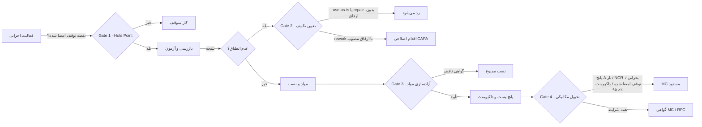
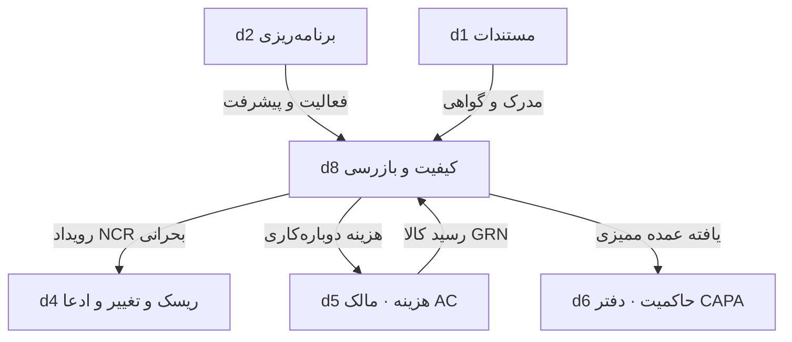

# QMS Deliverable 1 — معماری ماژول مدیریت کیفیت و بازرسی

**کد ماژول:** QMS · **دامنه:** `d8` · **جایگاه:** هفتمین ماژول کاری سایدبار اصلی، بلافاصله زیر «مدیریت حاکمیت و فرآیندهای PMBOK» و پیش از «مدیریت سامانه»
**نسخه فرمول:** `qms-v1` · **تاریخ گزارش:** 2026-09-08

خلاصه سه‌خطی: کیفیت تا امروز فقط به‌صورت پراکنده در d6 (ممیزی انطباق) و d4 (عدم انطباق به‌عنوان منشأ ادعا) دیده می‌شد و هیچ دفتر ITP، NCR، گواهی مواد یا دروازه تحویل مکانیکی نداشت. QMS این خلأ را با یک دامنه مستقل شش‌زیرماژولی پر می‌کند که چهار دروازه سخت دارد: نقطه توقف، ارفاق مهندسی، آزادسازی مواد و تحویل مکانیکی. هیچ عدد متعلق به دامنه دیگری بازنویسی نمی‌شود؛ QMS فقط می‌خواند و رویداد می‌فرستد.

---

## ۱. موجودی واقعی پیش از این ماژول

| لایه | شاهد در کد | وضعیت کیفیت |
|---|---|---|
| دامنه‌ها | `src/data/framework.ts` → `d1…d7` | ✨ هیچ دامنه کیفیت وجود نداشت |
| ممیزی انطباق | `src/services/governance.ts` → `complianceScore`, `capaRequired` | 📌 ممیزی فرآیندی سازمان، نه بازرسی فنی کارگاه |
| عدم انطباق | `src/services/rcc.ts` | 📌 فقط به‌عنوان ورودی ادعا/تغییر |
| مالکیت داده | `DATA_OWNER` در `governance.ts` | 🔧 کلید `quality` نداشت |
| گواهی مواد | `src/services/finance.ts` → `verifyCertificate`? | ✨ وجود نداشت؛ تدارکات فقط 3-Way Match دارد |

نشانه‌ها: 📌 موجود · 🔧 بهبود · ✨ جدید

---

## ۲. شش زیرماژول (نام‌ها ثابت و تغییرناپذیر)

| کد | زیرماژول | هسته منطقی | جداول |
|---|---|---|---|
| `d8-p1` | برنامه‌ریزی کیفیت و ITP | `itpBlocking`, `canProceed`, `itpCoverage`, `samplingPlan` | `Quality_Plan`, `ITP_Master`, `ITP_Point` |
| `d8-p2` | بازرسی و آزمون | `irNoticeCheck`, `irOutcome`, `firstPassYield`, `controlLimits`, `outOfControl`, `dpmo`, `sigmaLevel` | `Inspection_Request`, `Inspection_Result`, `Test_Report` |
| `d8-p3` | عدم انطباق و اقدام اصلاحی | `ncrSeverity`, `ncrDueDays`, `ncrOverdue`, `dispositionAllowed`, `capaRequired`, `pareto`, `costOfQuality` | `NCR_Register`, `CAPA_Action` |
| `d8-p4` | کنترل مواد و گواهی‌ها | `verifyCertificate`, `traceChain`, `concreteAcceptance`, `weldRepairRate` | `Material_Certificate`, `Heat_Trace_Link` |
| `d8-p5` | ممیزی کیفیت و انطباق | `complianceScore`, `certificationRisk` | `Quality_Audit`, `Audit_Finding` |
| `d8-p6` | تحویل، پانچ و راه‌اندازی | `punchSummary`, `dossierCompleteness`, `mechanicalCompletionGate` | `Punch_List`, `Completion_Certificate`, `Quality_Dossier` |

---

## ۳. چهار دروازه سخت ماژول

| دروازه | شرط عبور | پیاده‌سازی |
|---|---|---|
| ۱ نقطه توقف | هر `H` امضاشده یا با صرف‌نظر مکتوب | `canProceed` |
| ۲ تعیین تکلیف | `use_as_is` و `repair` فقط با ارفاق مهندسی | `dispositionAllowed` |
| ۳ آزادسازی مواد | نوع گواهی ≥ 3.1، انطباق گرید، اعتبار، تأیید آزمایشگاه، شماره ذوب | `verifyCertificate` |
| ۴ تحویل مکانیکی | بدون پانچ A، بدون NCR بحرانی باز، بدون توقف امضانشده، داکیومنت ≥ ۹۵٪، پیش‌راه‌اندازی انجام‌شده | `mechanicalCompletionGate` |

---

## ۴. مرزهای مالکیت داده

QMS هیچ‌گاه پیشرفت (d2)، EVM (d3) یا هزینه واقعی (d5) را نمی‌نویسد؛ فقط رویداد می‌فرستد و مالک آن دامنه ثبت می‌کند.

---

## ۵. تصمیم‌های معماری

| # | تصمیم | دلیل |
|---|---|---|
| ADR-01 | دامنه مستقل `d8` به‌جای زیرفرایند داخل d6 | کیفیت شش زیرماژول عملیاتی دارد؛ فشردن آن در حاکمیت باعث گم‌شدن دفترهای ITP/NCR می‌شد |
| ADR-02 | درج بین d6 و d7 در آرایه `domains` | «هفتمین ماژول کاری، زیر حاکمیت» بدون جابه‌جایی سایر ردیف‌ها و بدون تغییر شناسه‌های موجود |
| ADR-03 | شناسه `d8` گرچه جایگاه هفتم است | `d7` قبلاً به «مدیریت سامانه» تخصیص یافته؛ تغییر شناسه‌ها سازگاری عقب‌رو را می‌شکست |
| ADR-04 | نمودار کنترل I-MR به‌جای انحراف معیار کل | با انحراف معیار کل یک نقطه پرت حدود را باد می‌کند و خودش دیگر خارج از کنترل دیده نمی‌شود |
| ADR-05 | امضای هش‌دار رکورد بازرسی (`signRecord`) | جلوگیری از دست‌کاری نتیجه بازرسی پس از امضا، بدون نیاز به زیرساخت PKI |
| ADR-06 | منبع واحد `src/services/quality.ts` و تولید `server/qmsLogic.js` با esbuild | منطق کلاینت و سرور هرگز واگرا نمی‌شود (همان الگوی `build:fin`) |
| ADR-07 | بدون افزودن کتابخانه آیکون | هم‌راستا با ADR-03 ماژول FIN؛ ایموجی و SVG درون‌خطی |
| ADR-08 | آستانه‌های کیفیت به‌صورت پارامتر تابع | حد ۳٪ تعمیر جوش، ۴۸ ساعت اعلان و AQL 2.5 در قراردادهای مختلف تغییر می‌کند |

---

## ۶. شاخص‌ها و هشدارها

**KPI پیاده‌سازی‌شده:** پوشش ITP · قبولی بار اول (FPY) · DPMO و سطح سیگما · نرخ تعمیر جوش · نرخ بسته‌شدن NCR · سن NCR · امتیاز انطباق ISO 9001 · هزینه کیفیت و COPQ · نسبت انطباق · نرخ بستن پانچ · کامل‌بودن داکیومنت.

**۱۰ قاعده هشدار (`qmsEws`):** NCR بحرانی باز · NCR فراتر از مهلت · FPY زیر ۸۵٪ · تعمیر جوش بالای ۳٪ · COPQ بالای ۲٪ · یافته عمده باز · رد گواهی مواد · پانچ A باز · نقطه توقف امضانشده · روند خارج از کنترل.

---

## ۷. مهاجرت

| گام | اقدام | وضعیت |
|---|---|---|
| M0 | افزودن دامنه `d8` با شش فرایند به `framework.ts` | ✅ انجام شد |
| M1 | موتور `src/services/quality.ts` + تست‌های `server/qms.test.mjs` | ✅ ۱۸ تست |
| M2 | فضای کاری شش‌تبی `QualityWorkspace.tsx` + بلوک d8 در `ModuleDetail.tsx` | ✅ انجام شد |
| M3 | جداول `Quality_*`, `ITP_*`, `NCR_*` در SQL و روت‌های `/api/qms` | ⏳ Deliverable بعدی |
| M4 | افزودن `quality: "d8"` به `DATA_OWNER` و رویدادهای خودکار به d4/d5/d6 | ⏳ |
| M5 | اپ موبایل بازرسی روی `syncQueue.ts` (بازرسی آفلاین کارگاه) | ⏳ |

---

## ۸. نتیجه ۱۰ Loop

| Loop | موضوع | نتیجه |
|---|---|---|
| ۱ | کامل‌بودن زیرماژول‌ها | ✅ شش زیرماژول با تب هم‌نام |
| ۲ | مدل داده و نام‌گذاری | ✅ نام جداول با الگوی موجود هم‌خوان (`Quality_Plan`, `NCR_Register`) |
| ۳ | دروازه‌های سخت | ✅ هر چهار دروازه با تست |
| ۴ | ردیابی | ✅ زنجیره ذوب → اسپول → جوش → آزمون → داکیومنت |
| ۵ | استانداردها | ✅ ISO 9001 · ISO 2859-1 · EN 10204 · ACI 318 · قواعد نلسون |
| ۶ | یکپارچگی بین‌ماژولی | ✅ رویداد به d4/d5/d6 بدون بازنویسی داده |
| ۷ | سازگاری عقب‌رو | ✅ هیچ شناسه یا فرایند موجودی تغییر نکرد |
| ۸ | کیفیت کد | ✅ `tsc --noEmit` بدون خطای جدید · ۶۲ تست سبز |
| ۹ | UI/UX | ✅ تم شیشه‌ای تیره، دوزبانه، بدون وابستگی جدید |
| ۱۰ | شکاف‌های باز | G1 روت‌های `/api/qms` · G2 جداول SQL · G3 اپ موبایل بازرسی · G4 گزارش‌های Excel · G5 RBAC نقش‌های QC/QA |

---

## ۹. پرسش‌های باز

۱. مرجع تأیید ارفاق مهندسی: مهندس ارشد کارفرما یا کمیته فنی؟ (فعلاً هر امضای مجاز پذیرفته می‌شود)
۲. حد اعلان بازرسی: ۴۸ ساعت پیش‌فرض — در برخی قراردادها ۷۲ ساعت است.
۳. سطح AQL: فعلاً ۲٫۵ سطح II — برای اقلام بحرانی ۱٫۰ لازم است؟
۴. آیا بازرسی شخص ثالث (TPI) باید کاربر مستقل با دسترسی محدود داشته باشد؟
