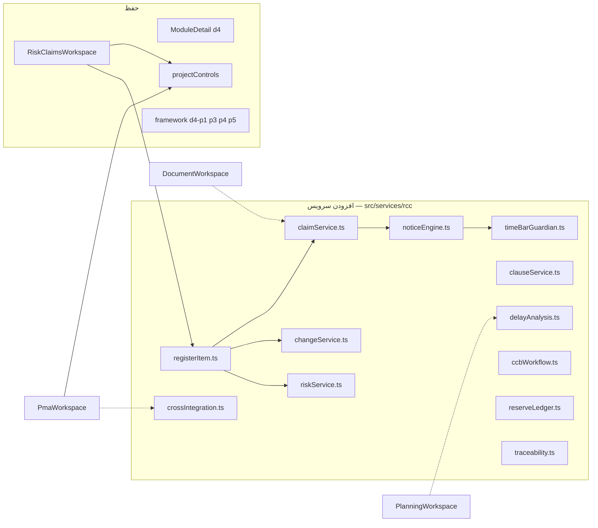

# RCC Deliverable 1 — تحلیل وضعیت موجود و معماری بازطراحی

**نسخه:** 3.0 هم‌تراز با MASTER PROMPT  
**محدوده:** d4 موجود در برنامه (نه بازنویسی کل PMIS)  
**اصل:** حفظ ساختار · افزودن قابلیت · بدون آیتم جدید در سایدبار اصلی

خلاصه ۳ خطی: ماژول d4 الان یک فضای شیشه‌ای با ماتریس P×I، ثبت ریسک، CR ساده، تأخیر ۵۰۹۰ و دروازه ادعا است و اعداد را از موتور مشترک PEX/PMA می‌خواند. شکاف اصلی RegisterItem، Notice/Time-Bar، CCB، Quantum و یکپارچگی خودکار است. بازطراحی روی همین `RiskClaimsWorkspace` + جداول فعلی SQL نام‌ها را نگه می‌دارد و ۱۵ زیرفرایند را فقط در صفحهٔ داخلی d4 اضافه می‌کند.

---

## 1. موجودی واقعی (کد)

| لایه | مسیر | نقش |
|---|---|---|
| دامنه | `src/data/framework.ts` → `domains` id `d4` | فرآیندها: d4-p1 ثبت/تحلیل ریسک، d4-p3 تغییر، d4-p4 تأخیر، d4-p5 ادعا |
| فضای کاری | `src/components/RiskClaimsWorkspace.tsx` | تب: matrix / register / change / delay / claim |
| پوسته | `src/components/ModuleDetail.tsx` | رندر d4 مثل PIM/PEX/PMA؛ زیرفرایند اضافه فقط داخل صفحه |
| جزئیات قدیمی | `src/components/CapabilityDetail.tsx` | هنوز `RiskClaimsWorkspace` را با `subId` صدا می‌زند (سازگاری عقب) |
| موتور اعداد | `src/services/projectControls.ts` | SPI/CPI/PHI/DataDate — d4 فقط می‌خواند |
| جداول اعلام‌شده در taxonomy | `Risk_Register`, `Risk_Assessment`, `Change_Request`, `Delay_Register`, `Claim_Register` | نام‌ها حفظ می‌شوند |

سایدبار اصلی: همان عنوان d4؛ **۱۵ زیرفرایند RCC فقط در aside داخلی**.

---

## 2. Gap Analysis زیرفرایندهای پرامپت در برابر برنامه

### Risk

| کد | عنوان | وضعیت | توضیح |
|---|---|---|---|
| 07.1 | Risk Planning (RBS، آستانه) | **ندارد** | ماتریس ۵×۵ هست؛ RBS و مقیاس PMO نیست |
| 07.2 | Identification | **ناقص** | فرم عنوان/P/I/مالک؛ بدون Cause-Event-Effect و Excel bulk |
| 07.3 | Analysis Qual+Quant | **ناقص** | فقط P×I تک‌بعدی؛ بدون ۷ بُعد اثر، EMV، PERT، Monte Carlo |
| 07.4 | Response | **ندارد** | استراتژی Avoid/Mitigate و ActionItem به PMA نیست |
| 07.5 | Monitoring + Reserve | **ندارد** | Ledger ذخیره نیست |
| 07.6 | Issue | **ندارد** | تبدیل ریسک رخ‌داده → Issue نیست |
| 07.7 | EWS + Trigger | **ناقص** | بنر قفل PMA از `majorVarianceBlocksReport`؛ موتور تریگر RCC نیست |

### Change

| کد | عنوان | وضعیت |
|---|---|---|
| 08.1 | CR Registration | **ناقص** — عنوان/علت/اثر زمان‌هزینه متنی |
| 08.2 | Impact ۱۲ بُعد | **ندارد** |
| 08.3 | CCB + Voting + Authority | **ندارد** |
| 08.4 | Implementation + BL update | **عمداً قفل** — اصل «Baseline sacred» رعایت شده (بازنویسی عدد ممنوع) |
| 08.5 | Change Log | **ناقص** — لیست در حافظه نشست، بدون Audit immutable |

### Claim

| کد | عنوان | وضعیت |
|---|---|---|
| 09.1 | Event registration | **ناقص** |
| 09.2 | Notice + Time-Bar ★ | **ندارد** — حیاتی |
| 09.3 | Clause engine | **ناقص** — ردیف ثابت ۵۰۹۰ / ماده ۲۹ / ۳۰ |
| 09.4 | Entitlement/Causation/Quantum | **ندارد** |
| 09.5 | Delay ۸ روش | **ناقص** — ارجاع TF/Baseline؛ روش انتخاب‌نشده |
| 09.6 | Negotiation | **ندارد** |
| 09.7 | Dispute | **ندارد** |
| 09.8 | Reserve impact | **ندارد** |

---

## 3. ضعف UX (بهبود بصری — بدون تغییر فونت سراسری)

| صفحه فعلی | بهبود لازم؟ | اقدام پیشنهادی |
|---|---|---|
| هدر d4 | بله | نوار Time-Bar (۱۴/۷/۳/۱) + قفل PMA مثل chipهای PHI |
| ماتریس | بله | حباب EMV، فیلتر RBS، کلیک سلول → لیست |
| ثبت ریسک | بله | Cause / Event / Effect سه فیلد؛ منبع موتور (PEX/PMA/PIM) خوانا |
| CR | بله | ویزارد ۱۲ بُعد به‌صورت آکاردئون شیشه‌ای |
| تأخیر | بله | انتخاب روش تحلیل (۸) به‌جای فقط مراجع |
| ادعا | بله | سه ستون Entitlement / Causation / Quantum + دروازه BL+DataDate (موجود) |
| سایدبار داخلی | خیر ساختار | فقط افزودن ۱۵ زیرآیتم زیر چهار فرآیند فعلی |

---

## 4. معماری بازطراحی (موجود vs جدید)

**قانون اعداد:** RCC هرگز `pctApproved` / SPI / CPI را نمی‌نویسد. CR مصوب CCB فقط *پیشنهاد* به‌روزرسانی Baseline به PEX می‌دهد.

---

## 5. ADR

| ID | تصمیم | دلیل |
|---|---|---|
| ADR-01 | Table-Per-Type روی هسته `Register_Item` + جداول موجود | نام `Risk_Register` و `Change_Request` حفظ؛ FK به هسته |
| ADR-02 | زیرفرایند جدید فقط `D4_PAGE_SUBS` | الزام کاربر: نه سایدبار اصلی |
| ADR-03 | Time-Bar به‌صورت job قابل شبیه‌سازی در UI (دکمه «اجرای نگهبان») تا Cron واقعی | محیط پیش‌نمایش بدون زمان‌بند سیستم |
| ADR-04 | Excel ظرف است | همسو با PIM/PEX |
| ADR-05 | مهاجرت افزایشی V001 هسته → V00n موجودیت‌ها | rollback هر نسخه |

---

## 6. Migration strategy (نام جداول حفظ)

| موجود | وضعیت | بعد |
|---|---|---|
| Risk_Register | بهبود | + `register_item_id`, cause/event/effect, rbs_id |
| Risk_Assessment | بهبود | + ۷ بُعد اثر، EMV، PERT |
| Change_Request | بهبود | + origin, emergency, ccb_id |
| Delay_Register | بهبود | + method enum (8) |
| Claim_Register | بهبود | + entitlement/causation/quantum JSONB، time_bar |
| Register_Item | **جدید** | هسته مشترک |
| Claim_Notice | **جدید** | Time-Bar |
| Contract_Clause | **جدید** | موتور بند |
| Reserve_Ledger | **جدید** | |
| CCB_Meeting | **جدید** | |
| RCC_Chain_Link | **جدید** | |

سازگاری عقب: ستون‌های فعلی NOT NULL نمی‌شوند؛ فیلدهای جدید NULLable تا F1.

Rollback: `DOWN` هر V00x فقط اشیاء جدید را DROP می‌کند؛ DROP جدول موجود ممنوع.

---

## 7. نقشه اتصال به ۱۵ زیرماژول روی ۴ فرآیند فعلی

| فرآیند موجود | زیرماژول داخلی (جدید، نه سایدبار) |
|---|---|
| d4-p1 ریسک | 07.1…07.7 |
| d4-p3 تغییر | 08.1…08.5 |
| d4-p4 تأخیر | 09.5 (+ بخشی از 09.4) |
| d4-p5 ادعا | 09.1–09.4، 09.6–09.8، 09.2 |

---

## 8. نتیجه ۱۰ Loop (D1)

| Loop | نتیجه D1 |
|---|---|
| 1 PMBOK | پوشش فرآیندی در نقشه است؛ اجرا در D3+ |
| 2 RegisterItem | ADR-01 ثبت شد؛ DDL در D2 |
| 3 Risk کامل | شکاف Quant/Reserve مشخص |
| 4 Change | شکاف ۱۲بُعد/CCB مشخص |
| 5 Claim ★ | Time-Bar غایب — اولویت F5/D10 |
| 6 Integration | Auto-Suggest ۸ قاعده → D13؛ فعلاً فقط خواندن SPI |
| 7 Time-Bar | طراحی Cron در D10؛ UI نگهبان در MVP |
| 8 KPI/Reports | ۱۸ KPI در D14 |
| 9 Consistency | تب‌های فعلی با taxonomy هم‌نام می‌مانند |
| 10 Redesign | حفظ فایل‌ها و نام جداول تأیید |

**Gap باقی‌مانده D1:** جزئیات فیلد ERD (→ D2).  
**اصلاح:** هیچ بازنویسی UI در این تحویل.

---

منتظر دستور شما برای **Deliverable 2** (مدل داده RegisterItem + ERD + اسکریپت مهاجرت نام‌محور).
