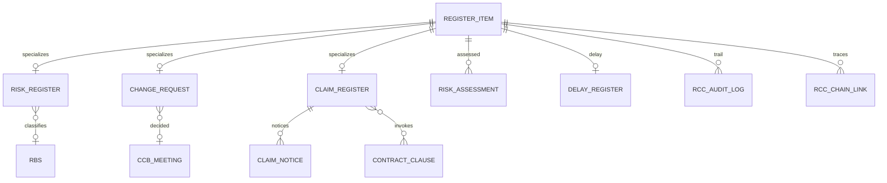

# RCC Deliverable 2 — مدل داده (RegisterItem Pattern)

خلاصه ۳ خطی: هستهٔ انتزاعی `register_item` با ارث Table-Per-Type روی جداول **موجود** (`risk_register`, `risk_assessment`, `change_request`, `delay_register`, `claim_register`). ستون‌های جدید NULLable. اسکریپت `db/postgres/rcc/migrations/V001__register_item.sql`. اعداد PEX/PMA اینجا ذخیره نمی‌شوند.

---

## 1. Inheritance

**استراتژی:** Table-Per-Type (TPT)  
هسته = هویت + وضعیت + مالک + منبع. جزئیات تخصصی در جداول فرزند با `register_item_id`.

دلیل: حفظ نام جداول taxonomy فعلی؛ جستجوی مشترک روی هسته؛ بدون Single-Table چاق.

---

## 2. جداول — وضعیت 📌موجود / 🔧بهبود / ✨جدید

### Core

| جدول | وضعیت | فیلدهای کلیدی |
|---|---|---|
| `register_item` | ✨ | id uuid PK, project_id, item_type(risk/issue/change/claim), code, title_fa/en, status, owner_id, source_module, source_ref, timestamps |
| `rcc_audit_log` | ✨ | immutable, jsonb payload, index(at) — پارتیشن بعدی بر اساس ماه |

Constraint: `UNIQUE(project_id, code)`

### Risk 📌/🔧

| جدول | وضعیت | افزودنی NULLable |
|---|---|---|
| `risk_register` | 🔧 | register_item_id, cause, event, effect, rbs_code, trigger_text, proximity |
| `risk_assessment` | 🔧 | register_item_id, impact_cost/schedule/scope/quality/safety/env/reputation (1–5), emv, pert_o/ml/p, score |
| `rbs` | ✨ | code, parent_code, title_fa/en — ۷ ریشه: EXT, ORG, PM, TEC, PRC, CON, COM |
| `risk_response` | ✨ | strategy (avoid/transfer/mitigate/accept/escalate/exploit/share/enhance), residual_score |
| `issue` | ✨ | register_item_id, source_type, root_cause |
| `early_warning` | ✨ | rule_code, severity, ack_due |
| `reserve_ledger` | ✨ | kind contingency/management, currency, balance |
| `reserve_transaction` | ✨ | ledger_id, type consume/commit/release, amount |

### Change

| جدول | وضعیت | افزودنی |
|---|---|---|
| `change_request` | 🔧 | register_item_id, origin, emergency_flag, impact jsonb (۱۲ کلید), ccb_id |
| `approval_authority` | ✨ | role, max_cost, max_days |
| `ccb_meeting` / `ccb_decision` | ✨ | vote_result |
| `baseline_version` | ✨ | immutable snapshot_ref به PEX — **بدون نوشتن pctApproved** |
| `change_log` | ✨ | append-only |

۱۲ کلید impact JSONB: scope, schedule_days, cp, cost_direct, cost_indirect, quality, risk, resource, contract, stakeholder, cash, eac, hse, procurement (۱۴ فیلد عملی؛ پرامپت ۱۲ بُعد + تجزیه هزینه).

### Claim

| جدول | وضعیت | افزودنی |
|---|---|---|
| `claim_register` | 🔧 | register_item_id, event_type, entitlement, causation, quantum jsonb (۱۴ سرفصل), notice_deadline, is_time_barred |
| `delay_register` | 🔧 | method ∈ {apab, iap, tia, cab, windows, snapshot, cpa, float} |
| `claim_notice` | ✨ | type initial/prelim/detailed/followup/final, due_at, delivered_at |
| `contract_clause` | ✨ | book fidic_red/yellow/silver / n4311, notice_period_days, body_fa/en — FTS |
| `contract_calendar` | ✨ | working vs calendar |
| `claim_negotiation` / `claim_settlement` / `claim_escalation` | ✨ | dispute path |

### Integration

| جدول | وضعیت |
|---|---|
| `rcc_chain_link` | ✨ from_id, to_id, rel (risk_to_issue, issue_to_cr, cr_to_claim, claim_to_evidence) |
| `auto_suggest_rule` | ✨ code, condition, action |

---

## 3. Index + JSONB

- `register_item (project_id, item_type, status)`
- `claim_notice (due_at) WHERE delivered_at IS NULL` — نگهبان Time-Bar
- `contract_clause` GIN `(to_tsvector('simple', body_fa || ' ' || coalesce(body_en,'')))`
- `rcc_audit_log` BRIN(at) پس از حجم
- JSONB impact / quantum: GIN اختیاری F3+

پارتیشن: `rcc_audit_log` و `claim_notice` ماهانه از F5.

---

## 4. Backward compatibility

- SELECT قدیمی روی پنج جدول 📌 بدون شکست (ستون جدید NULL).
- CapabilityDetail همچنان `subId` می‌فرستد.
- کد UI فعلی به `register_item_id` وابسته نیست تا F1.
- موتور `projectControls` جدا می‌ماند؛ RCC FK منطقی `source_ref` مثلاً `SPI` نه کپی عدد.

---

## 5. Migration

| نسخه | کار |
|---|---|
| **V001** (اعمال‌شده در repo) | `register_item` + `rcc_audit_log` + FK ستون روی ۵ جدول 📌 |
| V002 | rbs + ستون‌های cause/event/effect |
| V003 | change impact jsonb + ccb |
| V004 | claim_notice + clause + time_bar columns |
| V005 | chain_link + auto_suggest_rule |
| V006 | reserve_* |

Rollback V001: DROP TABLE register_item CASCADE فقط اگر هیچ FK پر نشده؛ در غیر این صورت DROP COLUMN register_item_id. **DROP جدول 📌 ممنوع.**

---

## 6. UI 👁️

| صفحه | بهبود بصری؟ |
|---|---|
| ماتریس | 👁️ بله — بعد از V002 رنگ از ۷ بُعد |
| ثبت | 👁️ بله — سه فیلد C-E-E |
| CR | 👁️ بله — آکاردئون ۱۲ بُعد |
| ادعا | 👁️ بله — نوار Time-Bar |
| سایدبار اصلی | خیر |

---

## 7. Loop روی D2

| Loop | |
|---|---|
| 1 PMBOK | موجودیت‌ها برای 11.1–11.7 و 4.6 جا دارند |
| 2 RegisterItem ★ | TPT + هسته ✨ + FK روی 📌 |
| 3 Risk | جداول پاسخ/ذخیره ✨ تعریف شد؛ موتور Quant در D4 |
| 4 Change | impact jsonb + CCB ✨ |
| 5 Claim | notice/clause/quantum jsonb |
| 6 Integration | chain_link + auto_suggest |
| 7 Time-Bar | claim_notice.due_at + partial index |
| 8 KPI | در D14؛ داده از هسته قابل تجمیع |
| 9 Consistency | نام SQL taxonomy حفظ |
| 10 Migration ★ | V001 نوشته شد؛ DROP 📌 ممنوع |

**Gap حل‌شده نسبت به D1:** DDL هسته.  
**Gap باقی:** RBS seed و شبه‌کد Quant → D3/D4.

فایل SQL: `db/postgres/rcc/migrations/V001__register_item.sql`

منتظر دستور برای **Deliverable 3** (RegisterItem + Risk Planning & Identification).
