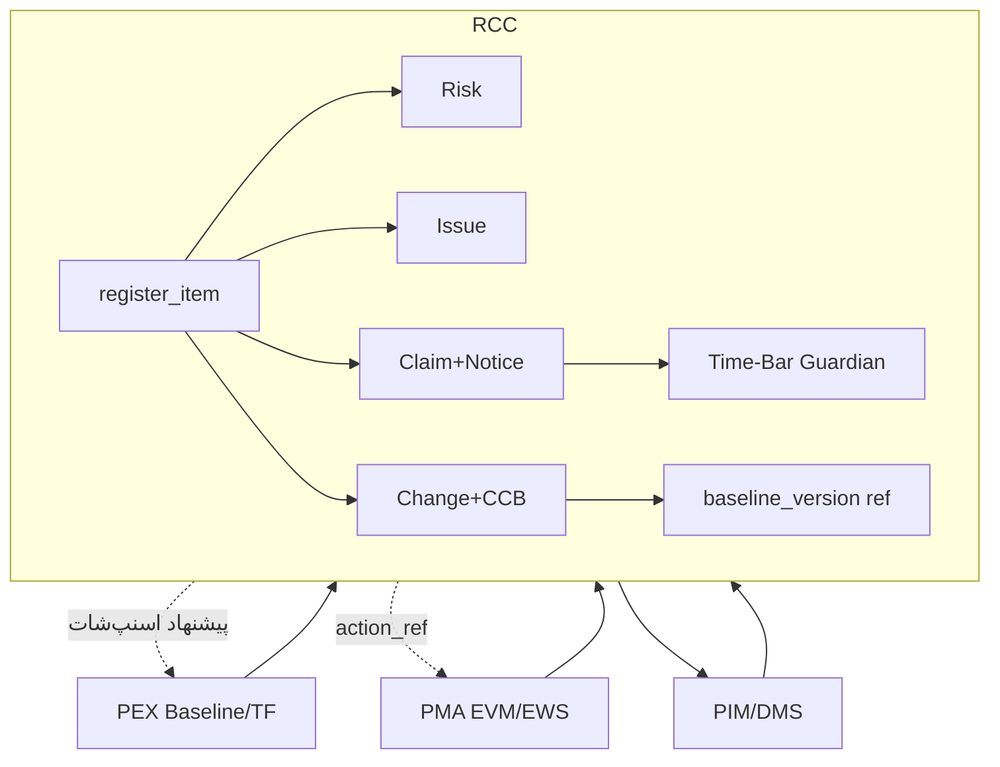
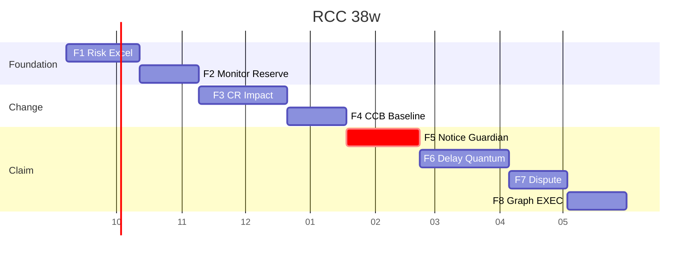

# RCC v3.0 — گزارش کیفیت نهایی و بسته اجرایی

**مخاطب:** PMO / مدیر قرارداد / کارفرما / تیم توسعه  
**اصل بازطراحی:** حفظ `RiskClaimsWorkspace` + جداول 📌 · زیرفرایند فقط داخل d4 · RCC اعداد PEX/PMA را نمی‌نویسد.

---

## ۱) اعتبارسنجی ۱۰ Loop روی کل طراحی

| Loop | نتیجه | شاهد |
|---|---|---|
| L1 PMBOK 11.1–11.7, 4.6, 12.3, 10.2, PD Uncertainty | ✅ پوشش در D3–D12 | پلن/شناسایی/Qual/Quant/پاسخ/پایش · ICC · ادعا · Notice |
| L2 RegisterItem TPT | ✅ | `register_item` V001 + FK روی ۵ جدول 📌 |
| L3 Risk کامل | ✅ مدل | RBS V002، Qual/Quant V003، پاسخ/ذخیره V004 |
| L4 Change | ✅ مدل | Impact jsonb V006، CCB/BL V007 |
| L5 Claim | ✅ مدل | بند V008، Notice V009، Quantum/Delay V010، Dispute V011 |
| L6 Integration | ✅ | زنجیره+AS V012؛ SPI از `computeEvm` |
| L7 Time-Bar ★ | ✅ الگوریتم | D10 Python + index `due_at` |
| L8 KPI/Rules/Reports | ✅ تعریف | V013 seed ۱۸ KPI / ۲۰ BR / ۱۲ EWS |
| L9 Consistency | 🔧 | نام‌ها یکنواخت AS-/EWS-CLM-/BR-؛ بک‌فیلد FK هنوز ETL نشده |
| L10 Migration | ✅ | V001–V013؛ DROP 📌 ممنوع |

### سازگاری بین‌تحویلی

| پرسش | پاسخ |
|---|---|
| RegisterItem روی Risk/Change/Claim؟ | بله TPT + ستون `register_item_id` NULLable |
| Reserve با EAC؟ | فقط خواندن؛ مصرف ledger جدا از CPI |
| BL با CCB و PEX؟ | `snapshot_ref` پس از approved؛ immutable |
| Notice با بند و EWS-CLM؟ | due از بند+تقویم؛ کدهای CLM-00/01/02/05 |
| Delay با BL قفل؟ | TIA روی TF خواندنی CIV-001 |
| Quantum با ذخیره؟ | Settlement → `via_cr_id` → consume ledger |
| Auto-Suggest از VAR/SPI؟ | AS-01/02 روی `computeEvm` |
| گراف کامل؟ | relهای V012 شامل evidence |
| API با موجودیت؟ | گروه‌های D14 با جداول ✨/📌 |
| MVP با D1؟ | F1+F5 روی workspace موجود قابل تحقق |

---

## ۲) شکاف‌ها

| # | مشکل | اثر | D | راه‌حل فوری | تلاش |
|---|---|---|---|---|---|
| G1 | بک‌فیل `register_item` برای ردیف‌های قدیمی | H | 2–3 | ETL: INSERT هسته per 📌 row | 3 ن-ر |
| G2 | کتابخانه کامل FIDIC seed نشده | H | 9 | seed بندهای Notice/EOT کلیدی Red+4311 | 5 ن-ر |
| G3 | Cron واقعی در پیش‌نمایش نیست | M | 10 | دکمه Guardian + بعداً job 08:00 | 2 ن-ر |
| G4 | OpenAPI فایل جدا نیست | M | 14 | تولید از گروه‌های D14 در F1 | 4 ن-ر |
| G5 | تست خودکار نوشته نشده | H | 14 | ۵۰/۳۰/۱۵/۲۰ سناریو در F1/F5 | 8 ن-ر |
| G6 | UI هنوز به سرویس وصل نیست | H | — | اسپرینت F1 روی تب register/matrix | 10 ن-ر |

**اصلاح High:** G1 اسکریپت ETL همراه V001؛ G2 seed حداقل ۲۰ بند؛ G5 تست Guardian (due دیروز → barred) قبل از Go-Live F5؛ G6 فقط با دستور پیاده‌سازی.

---

## ۳) خلاصه اجرایی

### الف) نقش ماژول

RCC حلقهٔ سوم PMIS است: پس از حقیقت مدارک (PIM) و زمان/پایش (PEX/PMA)، ریسک را ثبت می‌کند، تغییر را از CCB عبور می‌دهد و ادعا را روی بند و مهلت می‌نشاند. حلقه بسته است: VAR/SPI بحرانی پیشنهاد CR می‌دهد؛ CR ردشده می‌تواند رویداد ادعا بسازد؛ تسویه فقط با CR به برنامه برمی‌گردد.

بدون RCC، Time-Bar و ذخیره و زنجیره ادله بیرون سیستم می‌ماند. با RCC، هیچ Notice و هیچ Major VAR بدون ردپا نمی‌ماند — در حالی که SPI/Approved مقدس می‌مانند.

### ب) معماری

۱۵ زیرماژول فقط aside داخلی d4-p1 / p3 / p4 / p5.

### ج) جداول (شمارش)

📌۵ بهبود (`risk_register`, `risk_assessment`, `change_request`, `delay_register`, `claim_register`)  
✨ حدود ۲۲ (`register_item`, audit, rmp, rbs, response, ledger, tx, issue, ews, authority, ccb×2, baseline_version, change_log, implementation, clause, calendar, notice, response/negotiation/settlement/escalation, chain, auto_suggest, + V013 defs)

**جمع پیکربندی ≈ ۲۷+۵ = ۳۲ شیء منطقی.**

### د) API (فشرده)

`GET/POST /rcc/items|risks|crs|claims|notices|clauses|ledgers|chain|suggests`  
`POST /rcc/guardian/run` · `POST /rcc/excel/import`  
Hooks: `notice-due`, `cr-decision`, `claim-settled`, `time-barred`

### ه) ۱۷ گزارش

Risk: Register, Matrix, Reserve, Trend  
Change: Log, Impact, CCB minutes, Cycle, Emergency  
Claim: Register, **Watchlist روزانه**, Notice log, Delay, Quantum  
Integrated: **RPT-RCC-01** دوهفتگی ۱۰بخش، Chain، **RPT-EXEC**

### و) Time-Bar ★

۱۴/۷/۳/۱ روز · &lt;۱ escalate · ≤۰ barred · پیش‌نویس ۵۰٪ مهلت · نامه دوزبانه + ترانسمیتال PIM · الگوریتم D10.

### ز) هشت روش تأخیر

APAB / IAP / **TIA (FIDIC رایج)** / CAB / **Windows (دقیق)** / Snapshot / CPA / Float.  
پیشنهاد: EOT طراحی → TIA؛ اختلال طولانی → Windows؛ ۴۳۱۱ ماده۲۹/۳۰ + بند Notice.

نمونه: CIV-001 قفل TF=0، fragnet ۱۲روز → TIA EOT=۱۲.

### ح) ۱۴ سرفصل Quantum

هر کلید `{amount, currency, method, docs[]}`؛ بدون مدرک Incomplete. اعمال مالی فقط با CR.

### ط) MVP F1+F5

In: C-E-E، RBS، ماتریس از پلن، Excel ظرف، Guardian+Watchlist، دروازه BL.  
Out: Monte Carlo UI، داوری، گراف کامل.  
DoD: صفر false-negative Time-Bar روی تست ۲۰تایی؛ صفر نوشتن `projectControls`.  
زمان: هفته ۱–۵ و ۲۰–۲۴ (F5 می‌تواند موازی پس از بند V008).

### ی) ۱۵ ریسک طراحی

| # | شرح | P | I | استراتژی | مسئول |
|---|---|---|---|---|---|
| 1 | ETL هسته ناقص | 3 | 5 | Mitigate G1 | DBA |
| 2 | False-negative Time-Bar | 2 | 5 | Avoid + تست | Dev F5 |
| 3 | نوشتن سهوی SPI | 2 | 5 | BR-X1 + review | Architect |
| 4 | بند FIDIC ناقص | 4 | 4 | Seed G2 | Legal |
| 5 | CCB بدون justification | 3 | 4 | NOT NULL | PMO |
| 6 | ذخیره چند ارز | 3 | 3 | Accept + روش | Finance |
| 7 | تقویم تعطیلات غلط | 3 | 4 | Calendar owner | CM |
| 8 | حجم audit | 3 | 2 | Partition F8 | DBA |
| 9 | مقاومت کاربری | 4 | 3 | Manuals | PMO |
| 10 | تأخیر موازی Legal | 3 | 4 | Counsel اجباری | Legal |
| 11 | Excel غلط به‌عنوان SoT | 4 | 5 | ظرف + validate | PIM |
| 12 | CR اضطراری بی‌مهلت | 3 | 4 | BR-C3 | CCB |
| 13 | گراف یتیم | 2 | 3 | Trigger chain | Dev |
| 14 | همپوشانی EWS PMA | 3 | 2 | source_ref | MON |
| 15 | بودجه ۳۸هفته | 3 | 3 | دروازه فاز | Sponsor |

### ک) منابع (۳۸ هفته)

تیم: 1 Architect، 2 Backend، 1 Frontend، 0.5 DBA، 0.5 QA، مشاور FIDIC پاره‌وقت، Legal پاره‌وقت.  
≈ (5 FTE × 38 × 40) ≈ **۷۶۰۰ ن-س** با بافر ۱۵٪ ≈ **۸۷۰۰**.  
مایلستون: پایان F1، F4 BL، **F5 Guardian**، F8 EXEC.

### ل) ۱۲ توصیه

1. ETL G1 قبل از F1 prod  
2. Legal review بندها  
3. سفارشی‌سازی شرایط خصوصی  
4. تست Guardian با تقویم واقعی  
5. ماتریس اختیار CCB روز اول  
6. هرگز Excel را SoT نکنید  
7. دروازه فاز با Sponsor  
8. هم‌نامی AS/EWS  
9. Chain of custody ادعا  
10. آموزش Time-Bar برای CM  
11. Rollback فقط DROP ✨  
12. UI شیشه/وزیر بدون فونت جدید

---

## ۴) بسته تحویل (مسیر فایل)

| بسته | مسیر |
|---|---|
| D1–D14 | `docs/RCC_DELIVERABLE_0*.md` + `_14.md` |
| این گزارش | `docs/RCC_FINAL_QUALITY_REPORT.md` |
| SQL | `db/postgres/rcc/migrations/V001`…`V013` |
| UI موجود | `src/components/RiskClaimsWorkspace.tsx` |
| پوسته d4 | `src/components/ModuleDetail.tsx` |
| اعداد | `src/services/projectControls.ts` |
| الگوریتم Notice | D10 |
| TIA/Windows | D11 |
| AS JSON معادل | V012 INSERT |

قالب‌ها/۵۰ یونیت‌تست: بک‌لاگ F1/F5 — هنوز در repo نیستند (G5).

راهنمای UX: تب‌های فعلی حفظ؛ Watchlist و سه ستون ادعا 👁️.

---

## ۵) گانت

دروازه: بعد F1، F4، **F5 (بحرانی)**، F8.

---

## ۶) متریک موفقیت نرم‌افزار

فنی: ۰ false-negative Time-Bar · Suggest&gt;۸۵٪ · Notice&lt;۳۰ث · TIA&lt;۲د · API&lt;۵۰۰ms · Uptime۹۹.۵٪  
کاربر: Owner ۱۰۰٪ · چرخه CR −۴۰٪ · Notice compliance ۱۰۰٪ · گزارش به‌موقع ۹۵٪ · NPS&gt;۴۰  
کسب‌وکار: ذخیره −۲۰٪ هدررفت · scope creep −۳۰٪ · recovery ادعا &gt;۶۰٪ · اختلاف −۵۰٪ · ROI ۱۸ماه

---

## ۷) RPT-EXEC یک‌صفحه (آماده چاپ)

| پروژه: OG-2401 | Health: از PHI موتور (خواندنی) | رنگ باند |
|---|---|---|
| **۱** سه ریسک بحرانی · سه CR معلق · دو Notice نزدیک | از register + watchlist |
| **۲** Cumulative CR $ / days | jsonb impact |
| **۳** Reserve balance · Claim exposure | ledger + quantum |
| **۴** تصمیم &lt;۷روز | Guardian + CCB |
| **۵** AP-3M | ارجاع PMA action_ref |
| **۶** روند ۶ دوره | count risk / value CR / exposure |

---

**پایان بسته طراحی RCC v3.0.** پیاده‌سازی UI با دستور جدا؛ F1 و F5 اول.