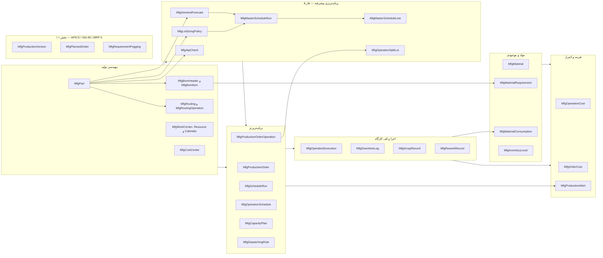

# بخش ۴ — ERD ماژول تولید عملیات‌محور

## قراردادهای مدل

- جدول‌های فیزیکی با پیشوند `Mfg` نام‌گذاری شده‌اند تا از جداول موجود SCM، Finance و PEX جدا بمانند؛ برای نمونه `parts → MfgPart`.
- هر ۲۶ جدول MFG دارای `PlantId` اجباری و ستون‌های حسابرسی سراسری (`CreatedAt`, `CreatedBy`, `UpdatedAt`, `UpdatedBy`, `RowVersion`) است. `PlantId` کلید دامنهٔ تولید است، نه `ProjectId`.
- `ProjectId` روی سفارش تولید اختیاری است. `ContractId` به `ContractMaster` موجود FK دارد. چون جدول مرجع مشتری در مخزن فعلی نیست، `CustomerRef` کلید نرم است و در این ERD رابطهٔ FK مشتری نمایش داده نمی‌شود.
- `MfgCostCenter` در ترتیب فیزیکی DDL پیش از Work Center ایجاد می‌شود تا FK هزینه قابل ساخت باشد؛ در فهرست منطقی همچنان جدول مرکز هزینه است.
- `MfgBomItem.IssueAtOperationCode` یک کلید نرم به کد Operation است؛ بررسی انطباق آن با Routing در سرویس مهندسی انجام می‌شود.
- `MfgScheduleRun` سربرگ هر اجرای نسخه‌دار را با یکتایی `(PlantId, ScheduleVersion)` نگه می‌دارد؛ بیشترین نسخهٔ Plant جاری است و Schedule/Capacity همان کلید نسخه را حمل می‌کنند. `MfgProductionOrder.DispatchWeight` مثبت و پیش‌فرض ۱ است؛ `BreakStartMinuteOfDay` زمان محلی شروع استراحت تقویم شیفت را مشخص می‌کند.

## تفکیک حوزه‌ها

## ERD کامل

در رابطه‌های زیر `||--o{` یعنی والدِ لازم به صفر/چند فرزند؛ `o|--o{` یعنی FK فرزند اختیاری به صفر/چند فرزند. رابطه‌های تکراری از Operation به جدول‌های اجرا عمداً جدا هستند: هرکدام FK مستقل‌اند. رابطهٔ `MfgScheduleRun` با Schedule و Capacity کلید منطقی `(PlantId, ScheduleVersion)` است، نه FK فیزیکی.

```mermaid
erDiagram
  MfgPart {
    string Id PK
    string PlantId
    string PartNo
    string PartType
    string BaseUom
    bool IsActive
  }
  MfgBomHeader {
    string Id PK
    string PlantId
    string PartId FK
    string Revision
    string Status
    decimal BaseQuantity
    date EffectiveFrom
    date EffectiveTo
  }
  MfgBomItem {
    string Id PK
    string PlantId
    string BomHeaderId FK
    string ComponentPartId FK
    int LineNo
    decimal QuantityPer
    decimal ScrapPct
    string IssueAtOperationCode
  }
  MfgCostCenter {
    string Id PK
    string PlantId
    string Code
    string CostElement
    decimal HourlyRate
    string Currency
    date EffectiveFrom
    date EffectiveTo
  }
  MfgWorkCenter {
    string Id PK
    string PlantId
    string Code
    string Kind
    string CostCenterId FK
    int NominalCapacityMinutesPerDay
    string TimeZoneId
    string Status
  }
  MfgWorkCenterResource {
    string Id PK
    string PlantId
    string WorkCenterId FK
    string ResourceCode
    string ResourceKind
    decimal CapacityUnits
    string EquipmentId FK
    string CostCenterId FK
  }
  MfgWorkCenterCalendar {
    string Id PK
    string PlantId
    string WorkCenterId FK
    string RuleKey
    string RuleType
    int WeekdayIso
    date CalendarDate
    string ShiftCode
    int StartMinuteOfDay
    int EndMinuteOfDay
    int BreakMinutes
    int BreakStartMinuteOfDay
    bool IsWorking
  }
  MfgRouting {
    string Id PK
    string PlantId
    string PartId FK
    string RoutingCode
    string Revision
    string Status
    date EffectiveFrom
    date EffectiveTo
  }
  MfgRoutingOperation {
    string Id PK
    string PlantId
    string RoutingId FK
    string WorkCenterId FK
    string CostCenterId FK
    int SequenceNo
    string OperationCode
    decimal SetupMinutes
    decimal RunMinutesPerUnit
    decimal QueueMinutes
    decimal MoveMinutes
    bool OverlapAllowed
  }
  MfgProductionOrder {
    string Id PK
    string PlantId
    string PartId FK
    string ContractId FK
    string ProjectId FK
    string BomHeaderId FK
    string RoutingId FK
    string OrderNo
    decimal OrderQuantity
    datetime DueAt
    string Status
    string PriorityRule
    decimal DispatchWeight
  }
  MfgProductionOrderOperation {
    string Id PK
    string PlantId
    string ProductionOrderId FK
    string RoutingOperationId FK
    string WorkCenterId FK
    string PredecessorOperationId FK
    int SequenceNo
    decimal PlannedQuantity
    string Status
  }
  MfgOperationSchedule {
    string Id PK
    string PlantId
    string ProductionOrderOperationId FK
    string WorkCenterId FK
    string ResourceId FK
    int ScheduleVersion
    int SegmentNo
    datetime PlannedStartAt
    datetime PlannedEndAt
  }
  MfgScheduleRun {
    string Id PK
    string PlantId
    int ScheduleVersion
    string Direction
    string CapacityMode
    string DispatchRule
    datetime WindowStart
    datetime WindowEnd
    int ExpectedScheduleVersion
    int ScheduledOperationCount
    int UnscheduledOperationCount
    json SummaryJson
  }
  MfgCapacityPlan {
    string Id PK
    string PlantId
    string WorkCenterId FK
    int ScheduleVersion
    datetime PeriodStart
    datetime PeriodEnd
    decimal AvailableMinutes
    decimal PlannedLoadMinutes
    decimal UtilizationPct
    bool IsBottleneck
  }
  MfgOperationExecution {
    string Id PK
    string PlantId
    string ProductionOrderOperationId FK
    string ResourceId FK
    int ExecutionNo
    datetime StartedAt
    datetime FinishedAt
    decimal InputQuantity
    decimal GoodQuantity
    decimal ReworkQuantity
    decimal ScrapQuantity
  }
  MfgDowntimeLog {
    string Id PK
    string PlantId
    string WorkCenterId FK
    string ProductionOrderOperationId FK
    string ExecutionId FK
    string ResourceId FK
    datetime StartedAt
    datetime FinishedAt
    string ReasonCode
  }
  MfgScrapRecord {
    string Id PK
    string PlantId
    string ProductionOrderOperationId FK
    string ExecutionId FK
    decimal Quantity
    string ReasonCode
    string Disposition
  }
  MfgReworkRecord {
    string Id PK
    string PlantId
    string SourceOperationId FK
    string TargetOperationId FK
    string ExecutionId FK
    string ScrapRecordId FK
    decimal Quantity
    string Status
  }
  MfgMaterial {
    string Id PK
    string PlantId
    string PartId FK
    string ProcurementType
    int LeadTimeDays
    decimal SafetyStockQty
    decimal LotSize
  }
  MfgMaterialRequirement {
    string Id PK
    string PlantId
    string ProductionOrderId FK
    string ProductionOrderOperationId FK
    string BomItemId FK
    string MaterialId FK
    datetime RequiredAt
    decimal NetQuantity
    decimal ShortageQuantity
  }
  MfgMaterialConsumption {
    string Id PK
    string PlantId
    string ProductionOrderOperationId FK
    string RequirementId FK
    string ExecutionId FK
    string MaterialId FK
    decimal Quantity
    string IdempotencyKey UK
  }
  MfgInventoryLevel {
    string Id PK
    string PlantId
    string MaterialId FK
    string WarehouseCode
    string LocationCode
    string LotNo
    decimal OnHandQty
    decimal ReservedQty
    decimal BlockedQty
  }
  MfgOperationCost {
    string Id PK
    string PlantId
    string ProductionOrderOperationId FK
    string CostCenterId FK
    string CostElement
    int CostVersion
    decimal StandardAmount
    decimal ActualAmount
  }
  MfgOrderCost {
    string Id PK
    string PlantId
    string ProductionOrderId FK
    int CostVersion
    decimal StandardTotalCost
    decimal ActualTotalCost
    decimal ContractRevenue
    decimal GrossMargin
  }
  MfgProductionAlert {
    string Id PK
    string PlantId
    string ProductionOrderId FK
    string ProductionOrderOperationId FK
    string WorkCenterId FK
    string AlertKey
    string Severity
    string Status
    datetime FirstRaisedAt
  }
  MfgDispatchingRule {
    string Id PK
    string PlantId
    string WorkCenterId FK
    string ScopeType
    string RuleScopeKey
    string RuleCode
    int PriorityOrder
    decimal PriorityWeight
  }
  MfgDemandForecast {
    string Id PK
    string PlantId
    string PartId FK
    string DemandType
    string DemandRef
    string CustomerRef
    date RequiredAt
    decimal Quantity
    decimal ConfidencePct
    string Status
    decimal ConsumedQuantity
    string MpsRunId FK
  }
  MfgLotSizingPolicy {
    string Id PK
    string PlantId
    string PartId FK
    string RuleCode
    decimal FixedLotQty
    decimal OrderMultiple
    decimal MinOrderQty
    decimal MaxOrderQty
    decimal OrderingCost
    decimal HoldingCostPerUnitPerYear
    decimal AnnualDemandQty
    int PeriodDays
    decimal PeriodOrderQuantity
    date EffectiveFrom
    date EffectiveTo
    bit IsActive
  }
  MfgMasterScheduleRun {
    string Id PK
    string PlantId
    int RunNo UK
    string TimeBucket
    int BucketCount
    date HorizonStart
    date HorizonEnd
    string PartId
    int DemandTimeFenceBuckets
    int FirmPlannedTimeFenceBuckets
    bit ConsumeForecast
    bit PreviewOnly
    int PartCount
    int LineCount
    decimal TotalPlannedOrderQty
    string Status
    string ApprovedBy
    datetime ApprovedAt
    string NoteFa
  }
  MfgProductionVersion {
    string Id PK
    string PlantId
    string PartId FK
    string VersionCode UK
    string BomRevision
    string RoutingRevision
    string WorkCenterId FK
    int Priority
    bit IsActive
    bit IsDefault
    date EffectiveFrom
    date EffectiveTo
  }
  MfgPlannedOrder {
    string Id PK
    string PlantId
    string PlannedOrderNo UK
    string PartId FK
    string ProductionVersionId FK
    string Source
    int MrpRunNo
    string MpsRunId FK
    decimal Quantity
    decimal OriginalQuantity
    string Uom
    int LowLevelCode
    int CumulativeLeadTimeDays
    datetime PlannedReleaseAt
    datetime PlannedDueAt
    int BucketIndex
    string LotSizingRule
    string Status
    string ReviewedBy
    string ConvertedProductionOrderId FK
    string RejectReasonFa
  }
  MfgRequirementPegging {
    string Id PK
    string PlantId
    string ComponentPartId FK
    string ComponentSupplyRef
    string ParentPartId FK
    string ParentSupplyRef
    string MaterialRequirementId FK
    string ProductionOrderId FK
    string PlannedOrderId FK
    decimal PeggedQuantity
    decimal QuantityPer
    int LevelFromRoot
    bit IsMultiLevel
    string RootPartId
    string RootSupplyRef
  }
  MfgMasterScheduleLine {
    string Id PK
    string PlantId
    string MpsRunId FK
    string PartId FK
    int BucketIndex
    date BucketStart
    date BucketEnd
    decimal GrossRequirementQty
    decimal ScheduledReceiptQty
    decimal NetRequirementQty
    decimal PlannedOrderReceiptQty
    decimal PlannedOrderReleaseQty
    date PlannedOrderReleaseAt
    decimal ProjectedOnHandAfter
    string LotSizingRule
    bit InsideDemandTimeFence
    bit IsFirm
  }
  MfgAtpCheck {
    string Id PK
    string PlantId
    string PartId FK
    decimal RequestedQty
    date RequestedAt
    string Mode
    string Result
    decimal PromisedQty
    date PromisedAt
    int DelayBuckets
    decimal ShortageQty
    decimal OpeningAvailableQty
    string CustomerRef
  }
  MfgOperationSplitLot {
    string Id PK
    string PlantId
    string ProductionOrderOperationId FK
    int SplitNo UK
    decimal Quantity
    decimal CumulativeQuantity
    bit IsTransferBatch
    string Status
    datetime StartedAt
    datetime CompletedAt
  }
  Project {
    string Id PK
    string Code
  }
  ContractMaster {
    string Id PK
    string ProjectId
    string Code
  }
  Equipment {
    string Id PK
    string ProjectId
    string Code
  }

  MfgPart ||--o{ MfgBomHeader : has_revisions
  MfgBomHeader ||--o{ MfgBomItem : contains
  MfgPart ||--o{ MfgBomItem : component
  MfgPart ||--o{ MfgRouting : has_routes
  MfgRouting ||--o{ MfgRoutingOperation : sequences
  MfgWorkCenter ||--o{ MfgRoutingOperation : performs
  MfgCostCenter o|--o{ MfgWorkCenter : default_rate
  MfgWorkCenter ||--o{ MfgWorkCenterResource : owns
  Equipment o|--o{ MfgWorkCenterResource : optional_asset
  MfgCostCenter o|--o{ MfgWorkCenterResource : resource_rate
  MfgWorkCenter ||--o{ MfgWorkCenterCalendar : follows
  MfgCostCenter o|--o{ MfgRoutingOperation : operation_rate

  MfgPart ||--o{ MfgProductionOrder : ordered_part
  ContractMaster o|--o{ MfgProductionOrder : optional_contract
  Project o|--o{ MfgProductionOrder : optional_project
  MfgBomHeader o|--o{ MfgProductionOrder : pinned_bom
  MfgRouting o|--o{ MfgProductionOrder : pinned_routing
  MfgProductionOrder ||--o{ MfgProductionOrderOperation : materializes
  MfgRoutingOperation o|--o{ MfgProductionOrderOperation : source_template
  MfgWorkCenter ||--o{ MfgProductionOrderOperation : assigned_center
  MfgProductionOrderOperation o|--o{ MfgProductionOrderOperation : predecessor
  MfgProductionOrderOperation ||--o{ MfgOperationSchedule : scheduled_as
  MfgScheduleRun ||--o{ MfgOperationSchedule : version_key
  MfgScheduleRun ||--o{ MfgCapacityPlan : version_key
  MfgWorkCenter ||--o{ MfgOperationSchedule : capacity_slot
  MfgWorkCenterResource o|--o{ MfgOperationSchedule : optional_resource
  MfgWorkCenter ||--o{ MfgCapacityPlan : bucketed_capacity
  MfgWorkCenter o|--o{ MfgDispatchingRule : optional_center_rule

  MfgProductionOrderOperation ||--o{ MfgOperationExecution : execution_sessions
  MfgWorkCenterResource o|--o{ MfgOperationExecution : optional_resource
  MfgWorkCenter ||--o{ MfgDowntimeLog : downtime_at
  MfgProductionOrderOperation o|--o{ MfgDowntimeLog : optional_operation
  MfgOperationExecution o|--o{ MfgDowntimeLog : optional_execution
  MfgWorkCenterResource o|--o{ MfgDowntimeLog : optional_resource
  MfgProductionOrderOperation ||--o{ MfgScrapRecord : scrap_quantity
  MfgOperationExecution o|--o{ MfgScrapRecord : optional_execution
  MfgProductionOrderOperation ||--o{ MfgReworkRecord : source_operation
  MfgProductionOrderOperation o|--o{ MfgReworkRecord : target_operation
  MfgOperationExecution o|--o{ MfgReworkRecord : optional_execution
  MfgScrapRecord o|--o{ MfgReworkRecord : origin_scrap

  MfgPart ||--o| MfgMaterial : planning_profile
  MfgProductionOrder ||--o{ MfgMaterialRequirement : demands
  MfgProductionOrderOperation o|--o{ MfgMaterialRequirement : operation_need
  MfgBomItem ||--o{ MfgMaterialRequirement : explodes_to
  MfgMaterial ||--o{ MfgMaterialRequirement : required_material
  MfgProductionOrderOperation ||--o{ MfgMaterialConsumption : consumes
  MfgMaterialRequirement o|--o{ MfgMaterialConsumption : optional_requirement
  MfgOperationExecution o|--o{ MfgMaterialConsumption : optional_execution
  MfgMaterial ||--o{ MfgMaterialConsumption : actual_issue
  MfgMaterial ||--o{ MfgInventoryLevel : stocked_at

  MfgProductionOrderOperation ||--o{ MfgOperationCost : cost_elements
  MfgCostCenter o|--o{ MfgOperationCost : optional_cost_center
  MfgProductionOrder ||--o{ MfgOrderCost : cost_versions
  MfgPart ||--o{ MfgDemandForecast : part_demand
  MfgPart ||--o{ MfgLotSizingPolicy : part_lot_policy
  MfgPart ||--o{ MfgAtpCheck : part_atp_check
  MfgMasterScheduleRun ||--o{ MfgMasterScheduleLine : run_lines
  MfgMasterScheduleRun o|--o{ MfgDemandForecast : consumed_by_run
  MfgProductionVersion }o--|| MfgPart : versions_of_part
  MfgPlannedOrder }o--|| MfgPart : plans_part
  MfgPlannedOrder }o--o| MfgProductionVersion : uses_version
  MfgPlannedOrder }o--o| MfgMasterScheduleRun : from_mps_run
  MfgPlannedOrder |o--o| MfgProductionOrder : converts_to
  MfgRequirementPegging }o--|| MfgMaterialRequirement : pegs_requirement
  MfgRequirementPegging }o--o| MfgPlannedOrder : pegs_planned_order
  MfgProductionOrderOperation ||--o{ MfgOperationSplitLot : operation_split_lots
  MfgProductionOrder o|--o{ MfgProductionAlert : optional_order_alert
  MfgProductionOrderOperation o|--o{ MfgProductionAlert : optional_operation_alert
  MfgWorkCenter o|--o{ MfgProductionAlert : optional_center_alert
```

## Cardinalityهای مهم و قواعدی که FK به‌تنهایی تضمین نمی‌کند

- Part به BOM و Routing نسخه‌دار، و به سفارش‌های تولید، رابطهٔ **یک‌به‌چند** دارد. `MfgMaterial` یک پروفایل اختیاری یک‌به‌یک برای Part است.
- BOM Header به اقلام BOM و Routing به Operationهای الگو رابطهٔ **یک‌به‌چند** دارند. جلوگیری از چرخهٔ BOM و تطبیق `IssueAtOperationCode` با Routing در سرویس دامنه انجام می‌شود.
- سفارش به Operationهای سفارش، نشست‌های اجرا، نیاز مواد و نسخه‌های هزینه رابطهٔ **یک‌به‌چند** دارد. سفارش `Created` می‌تواند هنوز Operation نداشته باشد؛ اما Release باید BOM، Routing و حداقل یک Operation معتبر داشته باشد.
- هر Operation سفارش به صفر/چند Segment زمان‌بندی و Execution، و به رکوردهای توقف، ضایعات، دوباره‌کاری، مصرف و هزینه وصل می‌شود. مقدار ضایعات/دوباره‌کاری جزئی، وضعیت کل Operation را به‌تنهایی عوض نمی‌کند.
- Work Center به منابع، تقویم‌ها، Operationها و Bucketهای ظرفیت رابطهٔ یک‌به‌چند دارد. قید عدم‌تداخل تخصیص منابع و سازگاری Plantها باید در موتور زمان‌بندی/لایهٔ تراکنش کنترل شود.
- نیاز مواد به سفارش، ردیف BOM، ماده و در صورت لزوم Operation مصرف‌کننده متصل است. مصرف واقعی می‌تواند به Requirement و Execution وصل باشد، ولی هر دو پیوند اختیاری‌اند.
- Work Center بدون Calendar یا Resource فعال می‌تواند تعریف شود، اما ظرفیت قابل‌برنامه‌ریزی ندارد؛ این وضعیت باید در اعتبارسنجی انتشار برنامه تشخیص داده شود.

## قواعد فاز ۵ — برنامه‌ریزی پیشرفته

- `MfgDemandForecast` کلید یکتای `(PlantId, DemandType, DemandRef, RequiredAt)` دارد؛ یک شمارهٔ سفارش/پیش‌بینی در یک تاریخ فقط یک ردیف است. ستون `ConsumedQuantity` مقداری است که اجرای MPS از آن ردیف مصرف کرده و `MpsRunId` همان اجرا را مهر می‌زند — این دو ستون قفل ویرایش (`MFG_DEMAND_CONSUMED_LOCK`) و قفل کاهش مقدار (`MFG_DEMAND_BELOW_CONSUMED`) را ممکن می‌کنند، چون FK به‌تنهایی نمی‌تواند بگوید «این تقاضا بخشی از یک برنامهٔ منتشرشده است».
- `MfgLotSizingPolicy` کلید یکتای `(PlantId, PartId, EffectiveFrom)` دارد؛ انتخاب سیاست مؤثر بر پایهٔ `EffectiveFrom` در سرویس دامنه انجام می‌شود، نه در پرس‌وجو.
- `MfgMasterScheduleRun` کلید یکتای `(PlantId, RunNo)` و قید `FirmPlannedTimeFenceBuckets ≥ DemandTimeFenceBuckets` دارد. `MfgMasterScheduleLine` کلید یکتای `(MpsRunId, PartId, BucketIndex)` دارد، یعنی هر اجرا برای هر قطعه در هر سطل دقیقاً یک سطر می‌نویسد و اجرای مجدد، تاریخچهٔ اجرای قبلی را بازنویسی نمی‌کند.
- `MfgAtpCheck` یک رکورد ممیزی‌پذیر از هر تعهد است؛ نتیجهٔ تعهد در `Result`/`PromisedQty`/`PromisedAt`/`DelayBuckets`/`ShortageQty` می‌ماند تا بعداً بتوان گفت «چه قولی، به چه کسی، بر پایهٔ کدام افق داده شد».
- `MfgOperationSplitLot` کلید یکتای `(ProductionOrderOperationId, SplitNo)` دارد. مجموع `Quantity` لات‌ها باید با مقدار سفارش برابر بماند؛ این تساوی در سرویس دامنه تضمین می‌شود، نه با قید جدول. `IsTransferBatch` همان لات اولی است که عملیات بعدی از آماده‌شدنش شروع می‌شود.
- ستون‌های `SplitLotCount` و `OverlapPct` روی **هر دو** جدول عملیات (الگوی Routing و عملیات سفارش) نشسته‌اند، چون هم‌پوشانی یک تصمیم مهندسی است که باید با snapshot عملیات از Routing به سفارش منتقل شود.

## قواعد بخش ۱۱ — APICS / ISA-95 / MRP II

- `MfgProductionVersion` کلید یکتای `(PlantId, PartId, VersionCode)` دارد. اینکه نسخه فقط به BOM و
  Routing **آزادشدهٔ همان قطعه** اشاره کند با قید جدول تضمین نمی‌شود (چون ارجاع با `Revision` رشته‌ای
  است نه FK) و در سرویس دامنه بررسی می‌شود: `MFG_VERSION_BOM_NOT_RELEASED`. یکتایی نسخهٔ پیش‌فرض هم
  قید جدول نیست — ساختن نسخهٔ پیش‌فرض تازه، بقیهٔ نسخه‌های همان قطعه را از حالت پیش‌فرض خارج می‌کند.
- `MfgMasterScheduleRun` ستون `Status` را با مقدار پیش‌فرض `draft` گرفت (مهاجرت `0054`)؛ قید
  `CK_MfgMpsRun_Status` فقط `draft|approved` را می‌پذیرد و `CK_MfgMpsRun_Approval` تضمین می‌کند
  `ApprovedAt` بدون `ApprovedBy` ممکن نباشد. اینکه اجرای `PreviewOnly` قابل تأیید نیست قید جدول نیست
  و در لایهٔ API با `MFG_MPS_PREVIEW_NOT_APPROVABLE` اعمال می‌شود.
- `MfgPlannedOrder` کلید یکتای `(PlantId, PlannedOrderNo)` دارد. گردش وضعیت
  `proposed → approved → converted` (یا `rejected`/`cancelled`) با قید جدول تضمین نمی‌شود؛ FK به
  `ConvertedProductionOrderId` فقط می‌گوید «به کدام سفارش وصل است»، نه «آیا تبدیل مجاز بوده».
  به همین دلیل تبدیل تنها از `approved` ممکن است و تبدیل دوباره رد می‌شود.
- `OriginalQuantity` مقدار پیشنهادی موتور را نگه می‌دارد و `Quantity` مقدار ویرایش‌شدهٔ برنامه‌ریز است؛
  تفکیک این دو ستون اجازه می‌دهد بعداً بگوییم برنامه‌ریز چقدر از پیشنهاد MRP فاصله گرفته است. ویرایش،
  تأیید قبلی را باطل می‌کند (بازگشت به `proposed`) چون تأیید روی مقدار قبلی داده شده بود.
- `Source` مقدار `mrp|mps` می‌گیرد و `MrpRunNo`/`MpsRunId` نشان می‌دهند کدام موتور این پیشنهاد را
  صادر کرده. اجرای دوبارهٔ MRP با همان `MrpRunNo` فقط ردیف‌های `proposed` را جایگزین می‌کند تا
  پیشنهادها انباشته نشوند و در عین حال کار بازبینی‌شدهٔ برنامه‌ریز پاک نشود.
- `MfgRequirementPegging` یک جدول **مشتق** است: از نیازهای مواد واقعی هر اجرای MRP ساخته می‌شود تا
  گزارش‌های بعدی بدون بازمحاسبه خوانده شوند. `ComponentSupplyRef`/`ParentSupplyRef` عامدانه
  رشته‌ای‌اند چون یک supply می‌تواند نیاز مواد، سفارش تولید یا سفارش برنامه‌ریزی‌شده باشد؛ به همین
  دلیل FK روی آن‌ها نیست و یکپارچگی با `MaterialRequirementId`/`ProductionOrderId`/`PlannedOrderId`
  نگه داشته می‌شود. `LevelFromRoot` فاصله از جزء است و `IsMultiLevel` وقتی درست است که زنجیره بیش از
  دو گام داشته باشد.
- هیچ‌کدام از سه جدول تازه کلید خارجی به جداول بیرون ماژول `Mfg*` ندارند؛ استقلال منطقی دیتابیس
  حفظ شده و مسیر `GET /conformance/isa95` این را با شمارش واقعی `foreignKeysToLevel4 = 0` می‌سنجد.

## قواعد رجیستری کارخانه و نوع صنعت

جدول `MfgPlant` (شمارهٔ ۳۶، مهاجرت `0055`) شناسهٔ کارخانه را صاحب‌دار می‌کند. تا این نقطه `PlantId`
فقط یک ستون متنی آزاد بود که با هلپر `plant()` به ۳۵ جدول تزریق می‌شد و هیچ موجودیتی پشتش نبود.

- **`Id` برابر خودِ `PlantId` است، نه یک کلید جانشین.** چون `PlantId` در ۳۵ جدول دیگر یک رشتهٔ آزاد
  است، این تنها راهی است که بدون backfill و بدون مهاجرت داده، ردیف تنظیمات به همان شناسه‌ای گره بخورد
  که در حال استفاده است.
- **هیچ کلید خارجی از `MfgPlant` به ۳۵ جدول دیگر و هیچ کلید خارجی از آن‌ها به `MfgPlant` وجود ندارد.**
  این یک معاملهٔ پذیرفته‌شده است: یکپارچگی ارجاعی تضمین نمی‌شود و `PlantId` آزاد می‌ماند، ولی در عوض
  هیچ مسیر، آزمون یا دادهٔ موجودی نمی‌شکند. چون FK نیست، نمودار ERD هم یال‌ی بین `MfgPlant` و بقیه
  ندارد — این عمدی است نه فراموشی. اگر روزی FK خواسته شد باید با backfill جدا انجام شود.
- `UX_MfgPlant_PlantId` یکتایی `PlantId` را تضمین می‌کند، یعنی **یک ردیف تنظیمات به ازای هر کارخانه**.
  `UX_MfgPlant_PlantCode` هم `(PlantId, PlantCode)` را یکتا نگه می‌دارد.
- `CK_MfgPlant_Industry` فقط شش مقدار `discrete|process|food|pharma|automotive|metal` را می‌پذیرد.
  `IndustryType` عمداً `NOT NULL` است: نوع صنعت یک حدس نیست که بتوان خالی گذاشت.
- اینکه `IndustryType` کدام قابلیت‌ها را فعال می‌کند **قید جدول نیست**؛ نگاشت قابلیت در موتور دامنه
  (`capabilitiesForIndustry`) نگه داشته می‌شود و فقط توصیفی است — هیچ مسیری بر اساس آن بسته نمی‌شود.
- `IsActive` نرم‌افزاری است: هیچ قیدی جلوی ثبت داده برای کارخانهٔ غیرفعال را نمی‌گیرد.
