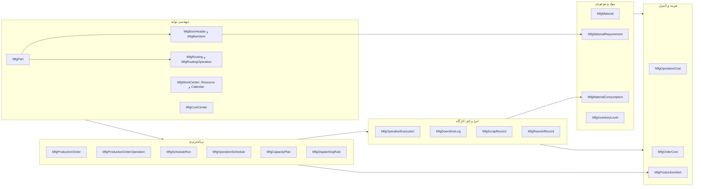

# بخش ۴ — ERD ماژول تولید عملیات‌محور

## قراردادهای مدل

- جدول‌های فیزیکی با پیشوند `Mfg` نام‌گذاری شده‌اند تا از جداول موجود SCM، Finance و PEX جدا بمانند؛ برای نمونه `parts → MfgPart`.
- هر ۲۶ جدول MFG دارای `PlantId` اجباری و ستون‌های حسابرسی سراسری (`CreatedAt`, `CreatedBy`, `UpdatedAt`, `UpdatedBy`, `RowVersion`) است. `PlantId` کلید دامنهٔ تولید است، نه `ProjectId`.
- `ProjectId` روی سفارش تولید اختیاری است. `ContractId` به `ContractMaster` موجود FK دارد. چون جدول مرجع مشتری در مخزن فعلی نیست، `CustomerRef` کلید نرم است و در این ERD رابطهٔ FK مشتری نمایش داده نمی‌شود.
- `MfgCostCenter` در ترتیب فیزیکی DDL پیش از Work Center ایجاد می‌شود تا FK هزینه قابل ساخت باشد؛ در فهرست منطقی همچنان جدول مرکز هزینه است.
- `MfgBomItem.IssueAtOperationCode` یک کلید نرم به کد Operation است؛ بررسی انطباق آن با Routing در سرویس مهندسی انجام می‌شود.
- `MfgScheduleRun` سربرگ هر اجرای نسخه‌دار را با یکتایی `(PlantId, ScheduleVersion)` نگه می‌دارد؛ بیشترین نسخهٔ Plant جاری است و Schedule/Capacity همان کلید نسخه را حمل می‌کنند. `MfgProductionOrder.DispatchWeight` مثبت و پیش‌فرض ۱ است؛ `BreakStartMinuteOfDay` زمان محلی شروع استراحت تقویم شیفت را مشخص می‌کند.

## تفکیک حوزه‌ها

## ERD کامل

در رابطه‌های زیر `||--o{` یعنی والدِ لازم به صفر/چند فرزند؛ `o|--o{` یعنی FK فرزند اختیاری به صفر/چند فرزند. رابطه‌های تکراری از Operation به جدول‌های اجرا عمداً جدا هستند: هرکدام FK مستقل‌اند. رابطهٔ `MfgScheduleRun` با Schedule و Capacity کلید منطقی `(PlantId, ScheduleVersion)` است، نه FK فیزیکی.

```mermaid
erDiagram
  MfgPart {
    string Id PK
    string PlantId
    string PartNo
    string PartType
    string BaseUom
    bool IsActive
  }
  MfgBomHeader {
    string Id PK
    string PlantId
    string PartId FK
    string Revision
    string Status
    decimal BaseQuantity
    date EffectiveFrom
    date EffectiveTo
  }
  MfgBomItem {
    string Id PK
    string PlantId
    string BomHeaderId FK
    string ComponentPartId FK
    int LineNo
    decimal QuantityPer
    decimal ScrapPct
    string IssueAtOperationCode
  }
  MfgCostCenter {
    string Id PK
    string PlantId
    string Code
    string CostElement
    decimal HourlyRate
    string Currency
    date EffectiveFrom
    date EffectiveTo
  }
  MfgWorkCenter {
    string Id PK
    string PlantId
    string Code
    string Kind
    string CostCenterId FK
    int NominalCapacityMinutesPerDay
    string TimeZoneId
    string Status
  }
  MfgWorkCenterResource {
    string Id PK
    string PlantId
    string WorkCenterId FK
    string ResourceCode
    string ResourceKind
    decimal CapacityUnits
    string EquipmentId FK
    string CostCenterId FK
  }
  MfgWorkCenterCalendar {
    string Id PK
    string PlantId
    string WorkCenterId FK
    string RuleKey
    string RuleType
    int WeekdayIso
    date CalendarDate
    string ShiftCode
    int StartMinuteOfDay
    int EndMinuteOfDay
    int BreakMinutes
    int BreakStartMinuteOfDay
    bool IsWorking
  }
  MfgRouting {
    string Id PK
    string PlantId
    string PartId FK
    string RoutingCode
    string Revision
    string Status
    date EffectiveFrom
    date EffectiveTo
  }
  MfgRoutingOperation {
    string Id PK
    string PlantId
    string RoutingId FK
    string WorkCenterId FK
    string CostCenterId FK
    int SequenceNo
    string OperationCode
    decimal SetupMinutes
    decimal RunMinutesPerUnit
    decimal QueueMinutes
    decimal MoveMinutes
    bool OverlapAllowed
  }
  MfgProductionOrder {
    string Id PK
    string PlantId
    string PartId FK
    string ContractId FK
    string ProjectId FK
    string BomHeaderId FK
    string RoutingId FK
    string OrderNo
    decimal OrderQuantity
    datetime DueAt
    string Status
    string PriorityRule
    decimal DispatchWeight
  }
  MfgProductionOrderOperation {
    string Id PK
    string PlantId
    string ProductionOrderId FK
    string RoutingOperationId FK
    string WorkCenterId FK
    string PredecessorOperationId FK
    int SequenceNo
    decimal PlannedQuantity
    string Status
  }
  MfgOperationSchedule {
    string Id PK
    string PlantId
    string ProductionOrderOperationId FK
    string WorkCenterId FK
    string ResourceId FK
    int ScheduleVersion
    int SegmentNo
    datetime PlannedStartAt
    datetime PlannedEndAt
  }
  MfgScheduleRun {
    string Id PK
    string PlantId
    int ScheduleVersion
    string Direction
    string CapacityMode
    string DispatchRule
    datetime WindowStart
    datetime WindowEnd
    int ExpectedScheduleVersion
    int ScheduledOperationCount
    int UnscheduledOperationCount
    json SummaryJson
  }
  MfgCapacityPlan {
    string Id PK
    string PlantId
    string WorkCenterId FK
    int ScheduleVersion
    datetime PeriodStart
    datetime PeriodEnd
    decimal AvailableMinutes
    decimal PlannedLoadMinutes
    decimal UtilizationPct
    bool IsBottleneck
  }
  MfgOperationExecution {
    string Id PK
    string PlantId
    string ProductionOrderOperationId FK
    string ResourceId FK
    int ExecutionNo
    datetime StartedAt
    datetime FinishedAt
    decimal InputQuantity
    decimal GoodQuantity
    decimal ReworkQuantity
    decimal ScrapQuantity
  }
  MfgDowntimeLog {
    string Id PK
    string PlantId
    string WorkCenterId FK
    string ProductionOrderOperationId FK
    string ExecutionId FK
    string ResourceId FK
    datetime StartedAt
    datetime FinishedAt
    string ReasonCode
  }
  MfgScrapRecord {
    string Id PK
    string PlantId
    string ProductionOrderOperationId FK
    string ExecutionId FK
    decimal Quantity
    string ReasonCode
    string Disposition
  }
  MfgReworkRecord {
    string Id PK
    string PlantId
    string SourceOperationId FK
    string TargetOperationId FK
    string ExecutionId FK
    string ScrapRecordId FK
    decimal Quantity
    string Status
  }
  MfgMaterial {
    string Id PK
    string PlantId
    string PartId FK
    string ProcurementType
    int LeadTimeDays
    decimal SafetyStockQty
    decimal LotSize
  }
  MfgMaterialRequirement {
    string Id PK
    string PlantId
    string ProductionOrderId FK
    string ProductionOrderOperationId FK
    string BomItemId FK
    string MaterialId FK
    datetime RequiredAt
    decimal NetQuantity
    decimal ShortageQuantity
  }
  MfgMaterialConsumption {
    string Id PK
    string PlantId
    string ProductionOrderOperationId FK
    string RequirementId FK
    string ExecutionId FK
    string MaterialId FK
    decimal Quantity
    string IdempotencyKey UK
  }
  MfgInventoryLevel {
    string Id PK
    string PlantId
    string MaterialId FK
    string WarehouseCode
    string LocationCode
    string LotNo
    decimal OnHandQty
    decimal ReservedQty
    decimal BlockedQty
  }
  MfgOperationCost {
    string Id PK
    string PlantId
    string ProductionOrderOperationId FK
    string CostCenterId FK
    string CostElement
    int CostVersion
    decimal StandardAmount
    decimal ActualAmount
  }
  MfgOrderCost {
    string Id PK
    string PlantId
    string ProductionOrderId FK
    int CostVersion
    decimal StandardTotalCost
    decimal ActualTotalCost
    decimal ContractRevenue
    decimal GrossMargin
  }
  MfgProductionAlert {
    string Id PK
    string PlantId
    string ProductionOrderId FK
    string ProductionOrderOperationId FK
    string WorkCenterId FK
    string AlertKey
    string Severity
    string Status
    datetime FirstRaisedAt
  }
  MfgDispatchingRule {
    string Id PK
    string PlantId
    string WorkCenterId FK
    string ScopeType
    string RuleScopeKey
    string RuleCode
    int PriorityOrder
    decimal PriorityWeight
  }
  Project {
    string Id PK
    string Code
  }
  ContractMaster {
    string Id PK
    string ProjectId
    string Code
  }
  Equipment {
    string Id PK
    string ProjectId
    string Code
  }

  MfgPart ||--o{ MfgBomHeader : has_revisions
  MfgBomHeader ||--o{ MfgBomItem : contains
  MfgPart ||--o{ MfgBomItem : component
  MfgPart ||--o{ MfgRouting : has_routes
  MfgRouting ||--o{ MfgRoutingOperation : sequences
  MfgWorkCenter ||--o{ MfgRoutingOperation : performs
  MfgCostCenter o|--o{ MfgWorkCenter : default_rate
  MfgWorkCenter ||--o{ MfgWorkCenterResource : owns
  Equipment o|--o{ MfgWorkCenterResource : optional_asset
  MfgCostCenter o|--o{ MfgWorkCenterResource : resource_rate
  MfgWorkCenter ||--o{ MfgWorkCenterCalendar : follows
  MfgCostCenter o|--o{ MfgRoutingOperation : operation_rate

  MfgPart ||--o{ MfgProductionOrder : ordered_part
  ContractMaster o|--o{ MfgProductionOrder : optional_contract
  Project o|--o{ MfgProductionOrder : optional_project
  MfgBomHeader o|--o{ MfgProductionOrder : pinned_bom
  MfgRouting o|--o{ MfgProductionOrder : pinned_routing
  MfgProductionOrder ||--o{ MfgProductionOrderOperation : materializes
  MfgRoutingOperation o|--o{ MfgProductionOrderOperation : source_template
  MfgWorkCenter ||--o{ MfgProductionOrderOperation : assigned_center
  MfgProductionOrderOperation o|--o{ MfgProductionOrderOperation : predecessor
  MfgProductionOrderOperation ||--o{ MfgOperationSchedule : scheduled_as
  MfgScheduleRun ||--o{ MfgOperationSchedule : version_key
  MfgScheduleRun ||--o{ MfgCapacityPlan : version_key
  MfgWorkCenter ||--o{ MfgOperationSchedule : capacity_slot
  MfgWorkCenterResource o|--o{ MfgOperationSchedule : optional_resource
  MfgWorkCenter ||--o{ MfgCapacityPlan : bucketed_capacity
  MfgWorkCenter o|--o{ MfgDispatchingRule : optional_center_rule

  MfgProductionOrderOperation ||--o{ MfgOperationExecution : execution_sessions
  MfgWorkCenterResource o|--o{ MfgOperationExecution : optional_resource
  MfgWorkCenter ||--o{ MfgDowntimeLog : downtime_at
  MfgProductionOrderOperation o|--o{ MfgDowntimeLog : optional_operation
  MfgOperationExecution o|--o{ MfgDowntimeLog : optional_execution
  MfgWorkCenterResource o|--o{ MfgDowntimeLog : optional_resource
  MfgProductionOrderOperation ||--o{ MfgScrapRecord : scrap_quantity
  MfgOperationExecution o|--o{ MfgScrapRecord : optional_execution
  MfgProductionOrderOperation ||--o{ MfgReworkRecord : source_operation
  MfgProductionOrderOperation o|--o{ MfgReworkRecord : target_operation
  MfgOperationExecution o|--o{ MfgReworkRecord : optional_execution
  MfgScrapRecord o|--o{ MfgReworkRecord : origin_scrap

  MfgPart ||--o| MfgMaterial : planning_profile
  MfgProductionOrder ||--o{ MfgMaterialRequirement : demands
  MfgProductionOrderOperation o|--o{ MfgMaterialRequirement : operation_need
  MfgBomItem ||--o{ MfgMaterialRequirement : explodes_to
  MfgMaterial ||--o{ MfgMaterialRequirement : required_material
  MfgProductionOrderOperation ||--o{ MfgMaterialConsumption : consumes
  MfgMaterialRequirement o|--o{ MfgMaterialConsumption : optional_requirement
  MfgOperationExecution o|--o{ MfgMaterialConsumption : optional_execution
  MfgMaterial ||--o{ MfgMaterialConsumption : actual_issue
  MfgMaterial ||--o{ MfgInventoryLevel : stocked_at

  MfgProductionOrderOperation ||--o{ MfgOperationCost : cost_elements
  MfgCostCenter o|--o{ MfgOperationCost : optional_cost_center
  MfgProductionOrder ||--o{ MfgOrderCost : cost_versions
  MfgProductionOrder o|--o{ MfgProductionAlert : optional_order_alert
  MfgProductionOrderOperation o|--o{ MfgProductionAlert : optional_operation_alert
  MfgWorkCenter o|--o{ MfgProductionAlert : optional_center_alert
```

## Cardinalityهای مهم و قواعدی که FK به‌تنهایی تضمین نمی‌کند

- Part به BOM و Routing نسخه‌دار، و به سفارش‌های تولید، رابطهٔ **یک‌به‌چند** دارد. `MfgMaterial` یک پروفایل اختیاری یک‌به‌یک برای Part است.
- BOM Header به اقلام BOM و Routing به Operationهای الگو رابطهٔ **یک‌به‌چند** دارند. جلوگیری از چرخهٔ BOM و تطبیق `IssueAtOperationCode` با Routing در سرویس دامنه انجام می‌شود.
- سفارش به Operationهای سفارش، نشست‌های اجرا، نیاز مواد و نسخه‌های هزینه رابطهٔ **یک‌به‌چند** دارد. سفارش `Created` می‌تواند هنوز Operation نداشته باشد؛ اما Release باید BOM، Routing و حداقل یک Operation معتبر داشته باشد.
- هر Operation سفارش به صفر/چند Segment زمان‌بندی و Execution، و به رکوردهای توقف، ضایعات، دوباره‌کاری، مصرف و هزینه وصل می‌شود. مقدار ضایعات/دوباره‌کاری جزئی، وضعیت کل Operation را به‌تنهایی عوض نمی‌کند.
- Work Center به منابع، تقویم‌ها، Operationها و Bucketهای ظرفیت رابطهٔ یک‌به‌چند دارد. قید عدم‌تداخل تخصیص منابع و سازگاری Plantها باید در موتور زمان‌بندی/لایهٔ تراکنش کنترل شود.
- نیاز مواد به سفارش، ردیف BOM، ماده و در صورت لزوم Operation مصرف‌کننده متصل است. مصرف واقعی می‌تواند به Requirement و Execution وصل باشد، ولی هر دو پیوند اختیاری‌اند.
- Work Center بدون Calendar یا Resource فعال می‌تواند تعریف شود، اما ظرفیت قابل‌برنامه‌ریزی ندارد؛ این وضعیت باید در اعتبارسنجی انتشار برنامه تشخیص داده شود.
